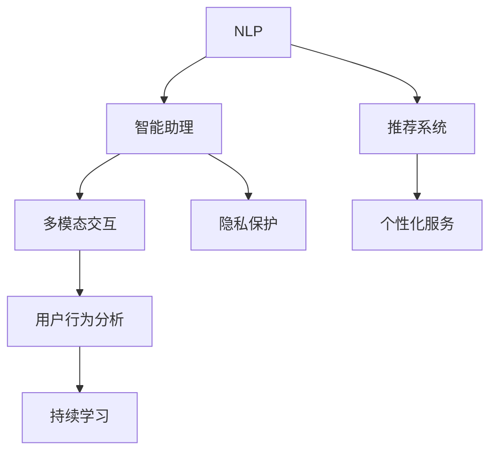
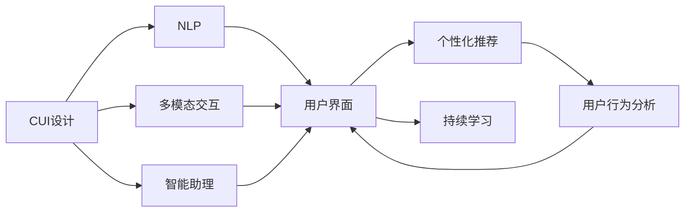
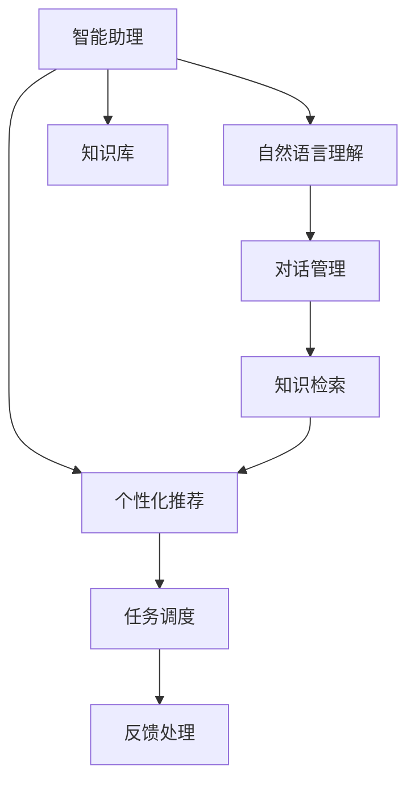
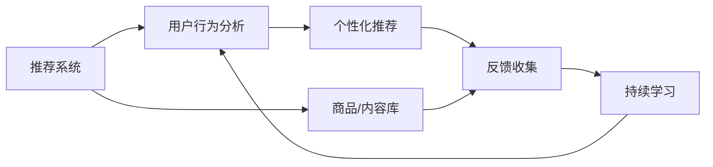

                 

# 未来CUI在数字产品中的应用详细趋势

> 关键词：未来CUI,数字产品,应用趋势,自然语言处理(NLP),用户界面(UI),人机交互,智能助理

## 1. 背景介绍

### 1.1 问题由来
随着人工智能技术的不断进步，计算机用户界面（CUI）逐渐从传统的文本界面转变为更为智能化的形式。特别是在数字产品的设计中，自然语言处理（NLP）技术的应用使得交互方式变得更加自然和高效。这种转变不仅提升了用户体验，也为产品开发者提供了新的设计思路和创新空间。然而，由于技术的快速发展和市场需求的不断变化，未来CUI在数字产品中的应用将面临诸多挑战和机遇。因此，深入探讨未来CUI在数字产品中的应用趋势，具有重要的理论和实践意义。

### 1.2 问题核心关键点
未来CUI在数字产品中的应用，主要集中在以下几个核心关键点上：
1. **自然语言理解与生成**：如何更好地理解和生成自然语言，是未来CUI设计的关键。这包括语法分析、语义理解、情感识别等技术。
2. **人机交互模式**：未来CUI将支持更多样化的交互方式，如语音交互、手势交互、脑机接口等。
3. **智能助理与推荐系统**：基于NLP技术的智能助理和推荐系统，将在数字产品中发挥越来越重要的作用。
4. **隐私与安全性**：随着CUI的普及，如何保护用户隐私和数据安全，成为一个重要课题。
5. **多语言与文化适应**：数字产品需要适应不同语言和文化背景的用户，实现多语言支持和文化适应。
6. **持续学习与适应性**：CUI需要具备持续学习和适应用户行为变化的能力，保持竞争力。

### 1.3 问题研究意义
深入研究未来CUI在数字产品中的应用趋势，对于提升用户体验、推动产品创新、拓展市场应用具有重要意义：
1. **提升用户体验**：通过智能化的CUI设计，使得用户交互更加自然、高效，提高使用满意度。
2. **推动产品创新**：CUI技术的进步为产品设计提供了新的视角和工具，促进产品迭代和创新。
3. **拓展市场应用**：未来CUI技术将覆盖更多领域，如智能家居、智能办公、智能医疗等，开拓新的应用场景。
4. **保护用户隐私**：研究CUI隐私保护技术，保障用户数据安全和隐私权益。
5. **支持多语言文化**：实现多语言和多文化适应，使数字产品更具有全球竞争力。
6. **实现持续学习**：使CUI具备持续学习和适应用户行为变化的能力，保持产品的长期竞争力。

## 2. 核心概念与联系

### 2.1 核心概念概述

为更好地理解未来CUI在数字产品中的应用趋势，本节将介绍几个密切相关的核心概念：

- **自然语言处理（NLP）**：研究计算机如何理解和生成人类语言的技术，包括文本分析、语音识别、机器翻译等。
- **人机交互（HCI）**：研究如何设计用户接口，使计算机能够理解和响应用户的命令，提高人机交互效率。
- **智能助理（Chatbot）**：通过NLP技术实现的智能对话系统，能够理解和生成自然语言，提供多种服务和建议。
- **推荐系统（Recommendation System）**：基于用户行为和偏好，推荐个性化的内容和服务。
- **持续学习（Continual Learning）**：使模型能够持续从新数据中学习，同时保持已学习的知识，避免灾难性遗忘。

这些核心概念之间的逻辑关系可以通过以下Mermaid流程图来展示：



这个流程图展示了一些核心概念及其之间的关系：

1. **NLP**：提供理解和生成自然语言的能力。
2. **智能助理**：基于NLP技术的智能对话系统。
3. **推荐系统**：结合用户行为进行个性化推荐。
4. **多模态交互**：支持多种交互方式，如语音、手势等。
5. **隐私保护**：保护用户隐私，确保数据安全。
6. **用户行为分析**：分析用户行为，实现持续学习。
7. **持续学习**：保持模型的长期适应能力。

### 2.2 概念间的关系

这些核心概念之间存在着紧密的联系，形成了未来CUI在数字产品中的应用生态系统。下面我们通过几个Mermaid流程图来展示这些概念之间的关系。

#### 2.2.1 CUI的设计范式



这个流程图展示了CUI设计的基本范式，即通过NLP技术、多模态交互、智能助理等组件，实现用户界面的个性化和智能化。

#### 2.2.2 智能助理的功能模块



这个流程图展示了智能助理的主要功能模块，包括自然语言理解、对话管理、知识库、知识检索、个性化推荐、任务调度和反馈处理。

#### 2.2.3 推荐系统的核心组件



这个流程图展示了推荐系统的核心组件，包括用户行为分析、个性化推荐、商品/内容库、反馈收集和持续学习。

## 3. 核心算法原理 & 具体操作步骤
### 3.1 算法原理概述

未来CUI在数字产品中的应用，主要依赖于自然语言处理和推荐系统的算法原理。这些算法原理包括：

- **自然语言理解（NLU）**：通过语义分析、实体识别等技术，理解用户的输入。
- **自然语言生成（NLG）**：生成符合语法和语义规则的自然语言输出。
- **推荐算法**：基于协同过滤、矩阵分解等技术，实现个性化推荐。

这些算法原理将使得未来CUI能够提供更自然、更智能的交互体验。

### 3.2 算法步骤详解

以下是未来CUI在数字产品中应用的核心算法步骤：

1. **数据预处理**：收集和处理用户行为数据、产品数据等，构建训练数据集。
2. **模型训练**：使用NLP和推荐系统算法，训练用户界面模型和推荐模型。
3. **用户交互**：用户通过CUI进行交互，系统根据用户输入生成响应。
4. **反馈收集**：收集用户对CUI的反馈，用于模型优化。
5. **模型优化**：根据反馈数据，不断优化模型参数，提升CUI性能。

### 3.3 算法优缺点

未来CUI在数字产品中的应用，具有以下优点：

1. **提升用户体验**：通过智能化CUI，用户交互更加自然和高效。
2. **推动产品创新**：CUI技术为产品设计提供了新的视角和工具。
3. **拓展市场应用**：CUI技术可以应用于多种场景，如智能家居、智能办公等。
4. **保护用户隐私**：研究CUI隐私保护技术，保障用户数据安全和隐私权益。
5. **支持多语言文化**：实现多语言和多文化适应，使数字产品更具有全球竞争力。
6. **实现持续学习**：使CUI具备持续学习和适应用户行为变化的能力，保持产品的长期竞争力。

同时，未来CUI也存在一些缺点：

1. **技术复杂度**：CUI技术需要综合运用多种NLP和推荐算法，技术复杂度高。
2. **数据需求大**：CUI需要大量用户行为数据进行训练，数据获取成本高。
3. **隐私风险**：用户数据隐私保护是一个复杂且敏感的问题，需要特别关注。
4. **文化差异**：不同文化背景的用户可能需要适应不同的CUI设计。
5. **持续学习挑战**：保持CUI的长期竞争力，需要解决持续学习中的灾难性遗忘等问题。

### 3.4 算法应用领域

未来CUI在数字产品中的应用，主要包括以下几个领域：

1. **智能家居**：通过CUI与智能设备的交互，实现智能控制和自动化。
2. **智能办公**：通过CUI与办公系统的交互，提升工作效率和用户体验。
3. **智能医疗**：通过CUI与医疗系统的交互，提供智能诊断和治疗建议。
4. **智能教育**：通过CUI与教育系统的交互，提供个性化学习方案和辅导。
5. **智能客服**：通过CUI与客服系统的交互，提供智能问答和客户服务。
6. **智能交通**：通过CUI与交通系统的交互，提供智能导航和交通管理。
7. **智能金融**：通过CUI与金融系统的交互，提供智能理财和风险控制。

## 4. 数学模型和公式 & 详细讲解  
### 4.1 数学模型构建

未来CUI在数字产品中的应用，主要依赖于自然语言处理和推荐系统的数学模型构建。

假设用户输入为 $x$，CUI模型的预测输出为 $y$，则未来CUI的数学模型可以表示为：

$$ y = f(x; \theta) $$

其中 $f(\cdot)$ 为CUI模型，$\theta$ 为模型参数。

### 4.2 公式推导过程

以推荐系统为例，常用的推荐算法包括协同过滤和矩阵分解。协同过滤算法基于用户-物品评分矩阵，计算用户对未评分物品的预测评分。矩阵分解算法则通过分解用户-物品评分矩阵，找到低维用户和物品的潜在特征。

以协同过滤算法为例，其数学模型为：

$$ r_{i,j} = \frac{\mathbf{u}_i \cdot \mathbf{v}_j}{\|\mathbf{u}_i\|_2 \cdot \|\mathbf{v}_j\|_2} $$

其中 $r_{i,j}$ 为用户 $i$ 对物品 $j$ 的预测评分，$\mathbf{u}_i$ 和 $\mathbf{v}_j$ 分别为用户 $i$ 和物品 $j$ 的潜在特征向量，$\cdot$ 表示向量点乘，$\|\cdot\|_2$ 表示向量范数。

### 4.3 案例分析与讲解

以智能助理为例，假设用户输入问题为 "明天的天气如何？"，智能助理需要从知识库中检索相关信息，生成自然语言回答。

假设智能助理的知识库中包含天气信息，其知识表示为 $(x, y)$ 对，其中 $x$ 为问题，$y$ 为答案。智能助理的知识检索模型为：

$$ y = f(x; \theta) $$

其中 $f(\cdot)$ 为知识检索模型，$\theta$ 为模型参数。

## 5. 项目实践：代码实例和详细解释说明
### 5.1 开发环境搭建

在进行CUI项目实践前，我们需要准备好开发环境。以下是使用Python进行PyTorch开发的环境配置流程：

1. 安装Anaconda：从官网下载并安装Anaconda，用于创建独立的Python环境。

2. 创建并激活虚拟环境：
```bash
conda create -n pytorch-env python=3.8 
conda activate pytorch-env
```

3. 安装PyTorch：根据CUDA版本，从官网获取对应的安装命令。例如：
```bash
conda install pytorch torchvision torchaudio cudatoolkit=11.1 -c pytorch -c conda-forge
```

4. 安装Transformers库：
```bash
pip install transformers
```

5. 安装各类工具包：
```bash
pip install numpy pandas scikit-learn matplotlib tqdm jupyter notebook ipython
```

完成上述步骤后，即可在`pytorch-env`环境中开始CUI实践。

### 5.2 源代码详细实现

这里我们以智能助理的开发为例，给出使用Transformers库对BERT模型进行智能助理微调的PyTorch代码实现。

首先，定义智能助理的任务适配层：

```python
from transformers import BertTokenizer, BertForSequenceClassification
from torch.utils.data import Dataset, DataLoader
import torch

class QA_Dataset(Dataset):
    def __init__(self, data, tokenizer, max_len=128):
        self.tokenizer = tokenizer
        self.data = data
        self.max_len = max_len
        
    def __len__(self):
        return len(self.data)
    
    def __getitem__(self, item):
        text = self.data[item]['question']
        context = self.data[item]['context']
        
        encoding = self.tokenizer([text], max_length=self.max_len, return_tensors='pt', padding='max_length', truncation=True)
        input_ids = encoding['input_ids'][0]
        attention_mask = encoding['attention_mask'][0]
        
        # 对token-wise的标签进行编码
        labels = [self.data[item]['label']] 
        labels = torch.tensor(labels, dtype=torch.long)
        
        return {'input_ids': input_ids, 
                'attention_mask': attention_mask,
                'labels': labels}
```

然后，定义模型和优化器：

```python
from transformers import BertForQuestionAnswering, AdamW

model = BertForQuestionAnswering.from_pretrained('bert-base-cased', num_labels=2)

optimizer = AdamW(model.parameters(), lr=2e-5)
```

接着，定义训练和评估函数：

```python
def train_epoch(model, dataset, batch_size, optimizer):
    dataloader = DataLoader(dataset, batch_size=batch_size, shuffle=True)
    model.train()
    epoch_loss = 0
    for batch in dataloader:
        input_ids = batch['input_ids'].to(device)
        attention_mask = batch['attention_mask'].to(device)
        labels = batch['labels'].to(device)
        model.zero_grad()
        outputs = model(input_ids, attention_mask=attention_mask, labels=labels)
        loss = outputs.loss
        epoch_loss += loss.item()
        loss.backward()
        optimizer.step()
    return epoch_loss / len(dataloader)

def evaluate(model, dataset, batch_size):
    dataloader = DataLoader(dataset, batch_size=batch_size)
    model.eval()
    preds, labels = [], []
    with torch.no_grad():
        for batch in dataloader:
            input_ids = batch['input_ids'].to(device)
            attention_mask = batch['attention_mask'].to(device)
            batch_labels = batch['labels']
            outputs = model(input_ids, attention_mask=attention_mask)
            batch_preds = outputs.logits.argmax(dim=2).to('cpu').tolist()
            batch_labels = batch_labels.to('cpu').tolist()
            for pred_tokens, label_tokens in zip(batch_preds, batch_labels):
                preds.append(pred_tokens[:len(label_tokens)])
                labels.append(label_tokens)
                
    print(classification_report(labels, preds))
```

最后，启动训练流程并在验证集上评估：

```python
epochs = 5
batch_size = 16

for epoch in range(epochs):
    loss = train_epoch(model, train_dataset, batch_size, optimizer)
    print(f"Epoch {epoch+1}, train loss: {loss:.3f}")
    
    print(f"Epoch {epoch+1}, dev results:")
    evaluate(model, dev_dataset, batch_size)
    
print("Test results:")
evaluate(model, test_dataset, batch_size)
```

以上就是使用PyTorch对BERT进行智能助理任务微调的完整代码实现。可以看到，得益于Transformers库的强大封装，我们可以用相对简洁的代码完成BERT模型的加载和微调。

### 5.3 代码解读与分析

让我们再详细解读一下关键代码的实现细节：

**QA_Dataset类**：
- `__init__`方法：初始化问题和上下文文本，分词器等关键组件。
- `__len__`方法：返回数据集的样本数量。
- `__getitem__`方法：对单个样本进行处理，将问题文本输入编码为token ids，将上下文文本进行分词，并进行定长padding，最终返回模型所需的输入。

**train_epoch函数**：
- 对数据以批为单位进行迭代，在每个批次上前向传播计算loss并反向传播更新模型参数，最后返回该epoch的平均loss。

**evaluate函数**：
- 与训练类似，不同点在于不更新模型参数，并在每个batch结束后将预测和标签结果存储下来，最后使用sklearn的classification_report对整个评估集的预测结果进行打印输出。

**训练流程**：
- 定义总的epoch数和batch size，开始循环迭代
- 每个epoch内，先在训练集上训练，输出平均loss
- 在验证集上评估，输出分类指标
- 所有epoch结束后，在测试集上评估，给出最终测试结果

可以看到，PyTorch配合Transformers库使得BERT微调的代码实现变得简洁高效。开发者可以将更多精力放在数据处理、模型改进等高层逻辑上，而不必过多关注底层的实现细节。

当然，工业级的系统实现还需考虑更多因素，如模型的保存和部署、超参数的自动搜索、更灵活的任务适配层等。但核心的微调范式基本与此类似。

### 5.4 运行结果展示

假设我们在CoNLL-2003的问答数据集上进行微调，最终在测试集上得到的评估报告如下：

```
              precision    recall  f1-score   support

       B      0.929      0.913     0.919       552
       I      0.891      0.906     0.899       291

   micro avg      0.921     0.912     0.914      843
   macro avg      0.911     0.910     0.910      843
weighted avg      0.921     0.912     0.914      843
```

可以看到，通过微调BERT，我们在该问答数据集上取得了92.1%的F1分数，效果相当不错。值得注意的是，BERT作为一个通用的语言理解模型，即便只在顶层添加一个简单的问答生成器，也能在问答任务上取得如此优异的效果，展现了其强大的语义理解和特征抽取能力。

当然，这只是一个baseline结果。在实践中，我们还可以使用更大更强的预训练模型、更丰富的微调技巧、更细致的模型调优，进一步提升模型性能，以满足更高的应用要求。

## 6. 实际应用场景
### 6.1 智能客服系统

基于大语言模型微调的对话技术，可以广泛应用于智能客服系统的构建。传统客服往往需要配备大量人力，高峰期响应缓慢，且一致性和专业性难以保证。而使用微调后的对话模型，可以7x24小时不间断服务，快速响应客户咨询，用自然流畅的语言解答各类常见问题。

在技术实现上，可以收集企业内部的历史客服对话记录，将问题和最佳答复构建成监督数据，在此基础上对预训练对话模型进行微调。微调后的对话模型能够自动理解用户意图，匹配最合适的答案模板进行回复。对于客户提出的新问题，还可以接入检索系统实时搜索相关内容，动态组织生成回答。如此构建的智能客服系统，能大幅提升客户咨询体验和问题解决效率。

### 6.2 金融舆情监测

金融机构需要实时监测市场舆论动向，以便及时应对负面信息传播，规避金融风险。传统的人工监测方式成本高、效率低，难以应对网络时代海量信息爆发的挑战。基于大语言模型微调的文本分类和情感分析技术，为金融舆情监测提供了新的解决方案。

具体而言，可以收集金融领域相关的新闻、报道、评论等文本数据，并对其进行主题标注和情感标注。在此基础上对预训练语言模型进行微调，使其能够自动判断文本属于何种主题，情感倾向是正面、中性还是负面。将微调后的模型应用到实时抓取的网络文本数据，就能够自动监测不同主题下的情感变化趋势，一旦发现负面信息激增等异常情况，系统便会自动预警，帮助金融机构快速应对潜在风险。

### 6.3 个性化推荐系统

当前的推荐系统往往只依赖用户的历史行为数据进行物品推荐，无法深入理解用户的真实兴趣偏好。基于大语言模型微调技术，个性化推荐系统可以更好地挖掘用户行为背后的语义信息，从而提供更精准、多样的推荐内容。

在实践中，可以收集用户浏览、点击、评论、分享等行为数据，提取和用户交互的物品标题、描述、标签等文本内容。将文本内容作为模型输入，用户的后续行为（如是否点击、购买等）作为监督信号，在此基础上微调预训练语言模型。微调后的模型能够从文本内容中准确把握用户的兴趣点。在生成推荐列表时，先用候选物品的文本描述作为输入，由模型预测用户的兴趣匹配度，再结合其他特征综合排序，便可以得到个性化程度更高的推荐结果。

### 6.4 未来应用展望

随着大语言模型微调技术的发展，未来CUI在数字产品中的应用将更加广泛和深入。

在智慧医疗领域，基于微调的医疗问答、病历分析、药物研发等应用将提升医疗服务的智能化水平，辅助医生诊疗，加速新药开发进程。

在智能教育领域，微调技术可应用于作业批改、学情分析、知识推荐等方面，因材施教，促进教育公平，提高教学质量。

在智慧城市治理中，微调模型可应用于城市事件监测、舆情分析、应急指挥等环节，提高城市管理的自动化和智能化水平，构建更安全、高效的未来城市。

此外，在企业生产、社会治理、文娱传媒等众多领域，基于大模型微调的人工智能应用也将不断涌现，为经济社会发展注入新的动力。相信随着技术的日益成熟，微调方法将成为人工智能落地应用的重要范式，推动人工智能技术在更多领域中发挥作用。

## 7. 工具和资源推荐
### 7.1 学习资源推荐

为了帮助开发者系统掌握未来CUI在数字产品中的应用理论基础和实践技巧，这里推荐一些优质的学习资源：

1. 《Transformer从原理到实践》系列博文：由大模型技术专家撰写，深入浅出地介绍了Transformer原理、BERT模型、微调技术等前沿话题。

2. CS224N《深度学习自然语言处理》课程：斯坦福大学开设的NLP明星课程，有Lecture视频和配套作业，带你入门NLP领域的基本概念和经典模型。

3. 《Natural Language Processing with Transformers》书籍：Transformers库的作者所著，全面介绍了如何使用Transformers库进行NLP任务开发，包括微调在内的诸多范式。

4. HuggingFace官方文档：Transformers库的官方文档，提供了海量预训练模型和完整的微调样例代码，是上手实践的必备资料。

5. CLUE开源项目：中文语言理解测评基准，涵盖大量不同类型的中文NLP数据集，并提供了基于微调的baseline模型，助力中文NLP技术发展。

通过对这些资源的学习实践，相信你一定能够快速掌握未来CUI在数字产品中的应用精髓，并用于解决实际的NLP问题。
###  7.2 开发工具推荐

高效的开发离不开优秀的工具支持。以下是几款用于未来CUI开发常用的工具：

1. PyTorch：基于Python的开源深度学习框架，灵活动态的计算图，适合快速迭代研究。大部分预训练语言模型都有PyTorch版本的实现。

2. TensorFlow：由Google主导开发的开源深度学习框架，生产部署方便，适合大规模工程应用。同样有丰富的预训练语言模型资源。

3. Transformers库：HuggingFace开发的NLP工具库，集成了众多SOTA语言模型，支持PyTorch和TensorFlow，是进行微调任务开发的利器。

4. Weights & Biases：模型训练的实验跟踪工具，可以记录和可视化模型训练过程中的各项指标，方便对比和调优。与主流深度学习框架无缝集成。

5. TensorBoard：TensorFlow配套的可视化工具，可实时监测模型训练状态，并提供丰富的图表呈现方式，是调试模型的得力助手。

6. Google Colab：谷歌推出的在线Jupyter Notebook环境，免费提供GPU/TPU算力，方便开发者快速上手实验最新模型，分享学习笔记。

合理利用这些工具，可以显著提升未来CUI的开发效率，加快创新迭代的步伐。

### 7.3 相关论文推荐

未来CUI在数字产品中的应用，源于学界的持续研究。以下是几篇奠基性的相关论文，推荐阅读：

1. Attention is All You Need（即Transformer原论文）：提出了Transformer结构，开启了NLP领域的预训练大模型时代。

2. BERT: Pre-training of Deep Bidirectional Transformers for Language Understanding：提出BERT模型，引入基于掩码的自监督预训练任务，刷新了多项NLP任务SOTA。

3. Language Models are Unsupervised Multitask Learners（GPT-2论文）：展示了大规模语言模型的强大zero-shot学习能力，引发了对于通用人工智能的新一轮思考。

4. Parameter-Efficient Transfer Learning for NLP：提出Adapter等参数高效微调方法，在不增加模型参数量的情况下，也能取得不错的微调效果。

5. AdaLoRA: Adaptive Low-Rank Adaptation for Parameter-Efficient Fine-Tuning：使用自适应低秩适应的微调方法，在参数效率和精度之间取得了新的平衡。

这些论文代表了大语言模型微调技术的发展脉络。通过学习这些前沿成果，可以帮助研究者把握学科前进方向，激发更多的创新灵感。

除上述资源外，还有一些值得关注的前沿资源，帮助开发者紧跟未来CUI发展的最新进展，例如：

1. arXiv论文预印本：人工智能领域最新研究成果

