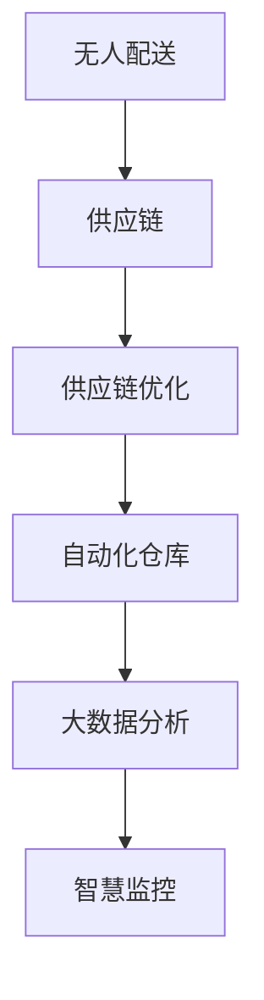

                 

## 1. 背景介绍

### 1.1 问题由来
随着全球化和互联网技术的发展，现代物流业成为支撑经济增长、满足消费者需求的重要支柱。但传统物流存在诸多问题，如库存积压、运输效率低下、配送成本高昂、环境污染等，制约了经济的可持续发展。为了应对这些挑战，智慧物流成为近年来的研究热点。特别是随着人工智能、大数据、物联网等新技术的成熟应用，无人配送和供应链优化成为未来物流发展的两大方向。

智慧物流通过信息技术和大数据分析，实现物流资源优化配置、运输路径优化、库存管理自动化、配送效率提升、客户满意度提高等目标。而无人配送与供应链优化更是智慧物流的核心内容，通过机器人和自动化技术的应用，进一步提升物流的智能化水平，实现高效、低成本、绿色环保的物流服务。

### 1.2 问题核心关键点
- 无人配送：利用自动驾驶、无人机、机器人等技术，实现货物自动化运输，减少人力成本和配送时间。
- 供应链优化：通过算法优化供应链网络，实现库存、运输、订单处理等环节的协调高效，降低物流成本，提升整体效率。
- 自动化仓库：实现自动化拣选、分拣、包装等仓库作业，提高作业效率和精确度。
- 大数据分析：利用大数据技术进行物流数据分析，优化供应链管理和运营策略。
- 智慧监控：通过物联网技术进行实时监控和数据采集，提升物流运作的透明性和可控性。

### 1.3 问题研究意义
研究无人配送与供应链优化，对于推动经济高质量发展，实现绿色可持续发展，具有重要意义：

1. **提高效率与降低成本**：通过自动化和智能化手段，大幅提升物流效率，降低人力和运营成本。
2. **优化资源配置**：实现物流资源的合理配置，减少浪费，提升物流系统的整体效益。
3. **提高服务质量**：通过精准的配送和优化路径，提升客户体验和满意度。
4. **实现绿色物流**：减少碳排放，实现能源和环境的可持续发展。
5. **促进技术创新**：无人配送和供应链优化催生新的技术突破和应用场景，推动科技产业的创新发展。

## 2. 核心概念与联系

### 2.1 核心概念概述

为更好地理解无人配送与供应链优化方法，本节将介绍几个密切相关的核心概念：

- **无人配送(Undelivery)**：利用自动驾驶、无人机、机器人等技术，实现货物自动化运输，减少人力成本和配送时间。
- **供应链(Supply Chain)**：涵盖从原材料采购、生产制造、仓储管理到物流配送的整个生产过程，涉及供应商、制造商、仓储中心和零售商等多个环节。
- **供应链优化(Supply Chain Optimization)**：通过算法优化供应链网络，实现库存、运输、订单处理等环节的协调高效，降低物流成本，提升整体效率。
- **自动化仓库(Automated Warehouse)**：利用自动化技术和机器人设备，实现货物的自动化存储、拣选、分拣和包装等作业，提高作业效率和精确度。
- **大数据分析(Big Data Analysis)**：利用大数据技术进行物流数据分析，优化供应链管理和运营策略，实现精准预测和决策。
- **智慧监控(Smart Monitoring)**：通过物联网技术进行实时监控和数据采集，提升物流运作的透明性和可控性，保障物流安全。

这些核心概念之间的逻辑关系可以通过以下Mermaid流程图来展示：



这个流程图展示了大规模物流管理的各个核心环节及其相互关系：

1. 无人配送是物流自动化最直接的表现形式。
2. 供应链优化涉及库存、运输、订单处理等多个环节，是物流管理的基础。
3. 自动化仓库通过机器人技术实现作业自动化，提高效率和精确度。
4. 大数据分析利用海量数据进行物流优化，为供应链管理提供决策支持。
5. 智慧监控通过物联网技术实现实时监控，保障物流安全。

### 2.2 概念间的关系

这些核心概念之间存在着紧密的联系，形成了物流管理的完整生态系统。

1. **无人配送与供应链优化**：无人配送利用自动驾驶、无人机、机器人等技术，实现自动化运输，提升配送效率和降低成本。供应链优化通过算法优化供应链网络，提升整体物流效率，减少资源浪费。
2. **自动化仓库与大数据分析**：自动化仓库通过机器人技术实现作业自动化，提高效率。大数据分析利用算法优化作业流程，提高作业精确度，实现资源优化配置。
3. **智慧监控与大数据分析**：智慧监控通过物联网技术实时监控物流运作，提供实时数据。大数据分析利用这些数据进行分析和优化，提升物流管理水平。

通过这些核心概念的相互配合，物流系统可以实现智能化、高效化、低成本的运行。

## 3. 核心算法原理 & 具体操作步骤
### 3.1 算法原理概述

无人配送与供应链优化主要基于以下几个核心算法原理：

1. **路径规划算法**：用于优化无人配送车辆或机器人的行驶路径，减少运输时间和成本。
2. **需求预测算法**：用于预测订单需求，优化库存管理，减少缺货和积压。
3. **调度算法**：用于优化仓库自动化作业流程，实现高效、精确的订单处理。
4. **成本优化算法**：用于优化供应链各环节的成本，提高整体效益。
5. **异常处理算法**：用于处理物流运作中的异常情况，保障物流安全。

### 3.2 算法步骤详解

**步骤1：数据采集与处理**
- 收集订单数据、库存数据、运输数据、天气数据等。
- 清洗和预处理数据，去除噪音和异常值。

**步骤2：路径规划**
- 构建配送区域地图，收集障碍物、道路、交通灯等数据。
- 应用A*算法或D*算法进行路径规划，生成最优路径。

**步骤3：需求预测**
- 收集历史订单数据和市场数据，利用时间序列分析或机器学习算法进行需求预测。
- 根据预测结果，优化库存管理和物流配置。

**步骤4：作业调度**
- 利用优化算法（如遗传算法、模拟退火等）进行作业调度，分配任务给自动化仓库设备。
- 实时监控作业进程，根据异常情况进行调整。

**步骤5：成本优化**
- 利用成本优化算法，评估和调整各个环节的成本。
- 根据成本优化结果，重新规划物流流程和资源配置。

**步骤6：异常处理**
- 实时监控物流运作，识别异常情况（如设备故障、交通堵塞等）。
- 根据异常情况，调整配送路径和作业流程，保障物流安全。

### 3.3 算法优缺点

**优点**：
- **高效化**：自动化和智能化手段大幅提升物流效率，减少人工操作带来的时间延误和错误。
- **低成本**：减少人工成本和运营成本，提升整体效益。
- **精确性**：通过算法优化和实时监控，提高作业精确度和准确性。
- **灵活性**：自动调整路径和作业流程，适应不同场景和需求。

**缺点**：
- **技术门槛高**：需要掌握先进的技术和算法，对团队技术和经验要求高。
- **初期投入高**：自动化设备和系统初始成本较高，对中小企业形成一定压力。
- **数据依赖强**：对数据采集和处理要求高，数据质量直接影响算法效果。
- **安全性问题**：自动化设备依赖技术和网络环境，存在潜在的安全风险。

### 3.4 算法应用领域

无人配送与供应链优化技术已经广泛应用于多个领域，具体如下：

1. **零售业**：利用无人配送和自动化仓库，提升零售效率，降低成本，改善客户体验。
2. **制造业**：实现制造过程的自动化和智能化，优化生产流程，提升产品质量。
3. **物流运输**：提升运输效率，降低运输成本，保障货物安全。
4. **电商行业**：实现快速配送，提升客户满意度，促进电商发展。
5. **医疗行业**：实现医疗物资的自动化配送，保障医疗物资的及时供应。
6. **农业领域**：实现农业物资的自动化配送，提升农业生产效率。

除了上述这些经典应用外，无人配送和供应链优化技术还在其他领域不断拓展，为各个行业带来新的变革和机遇。

## 4. 数学模型和公式 & 详细讲解 & 举例说明
### 4.1 数学模型构建

以路径规划算法为例，构建数学模型如下：

设配送区域地图为G，配送车辆为V，路径为E，各节点的权重为w。路径规划问题可表示为寻找路径p使得：

$$
\min_{p} \sum_{e \in p} w(e)
$$

其中，权重w(e)包括距离、时间、交通状况等影响因素。

### 4.2 公式推导过程

**A*算法**：
1. 初始化起点节点s，目标节点t，路径估价函数g。
2. 创建开放列表O和关闭列表C，初始时将s加入O。
3. 循环执行以下步骤：
    - 从O中选取f值最小的节点u。
    - 扩展节点u，生成邻居节点v。
    - 更新v的g值和f值，加入O或C。
    - 当v等于t时，返回路径。
4. 返回路径。

**时间复杂度**：
- A*算法的时间复杂度为O(b^d)，其中b为每个节点的平均分支数，d为节点数。

### 4.3 案例分析与讲解

假设配送区域为网格状地图，共5行5列，各节点的权重如下：

| 节点 | 权重 |
| --- | --- |
| s | 0 |
| t | 10 |
| 1 | 2 |
| 2 | 3 |
| 3 | 1 |
| 4 | 5 |
| 5 | 4 |
| 6 | 1 |
| 7 | 3 |
| 8 | 2 |
| 9 | 6 |
| 10 | 10 |

应用A*算法进行路径规划，步骤如下：

1. 初始化起点节点s，目标节点t，路径估价函数g。
2. 创建开放列表O和关闭列表C，初始时将s加入O。
3. 从O中选取f值最小的节点1，扩展节点2和3。
4. 更新2和3的g值和f值，将3加入C，将2加入O。
5. 从O中选取f值最小的节点2，扩展节点4和6。
6. 更新4和6的g值和f值，将6加入C，将4加入O。
7. 从O中选取f值最小的节点4，扩展节点8。
8. 更新8的g值和f值，将8加入C，返回路径。

最终路径为s -> 1 -> 2 -> 4 -> 8 -> t，总权重为2+3+1+2=8。

## 5. 项目实践：代码实例和详细解释说明
### 5.1 开发环境搭建

在进行无人配送与供应链优化实践前，我们需要准备好开发环境。以下是使用Python进行OpenAI Gym进行路径规划的开发环境配置流程：

1. 安装Anaconda：从官网下载并安装Anaconda，用于创建独立的Python环境。

2. 创建并激活虚拟环境：
```bash
conda create -n gym-env python=3.8 
conda activate gym-env
```

3. 安装OpenAI Gym：
```bash
pip install gym
```

4. 安装所需环境包：
```bash
pip install matplotlib numpy
```

5. 安装路径规划算法的依赖包：
```bash
pip install networkx pydot graph-tool
```

完成上述步骤后，即可在`gym-env`环境中开始无人配送路径规划的实践。

### 5.2 源代码详细实现

下面是使用Python进行无人配送路径规划的完整代码实现。

```python
import gym
import networkx as nx
import matplotlib.pyplot as plt
import numpy as np

class PathPlanning(gym.Env):
    def __init__(self, graph, start, goal):
        self.graph = graph
        self.start = start
        self.goal = goal
        self.path = []
        
        self.action_space = gym.spaces.Discrete(len(graph.nodes()))
        self.observation_space = gym.spaces.Discrete(len(graph.nodes()))
        
    def step(self, action):
        self.path.append(action)
        next_node = self.graph.nodes[action]
        return next_node, self.get_reward(), True, {}
        
    def reset(self):
        self.path = []
        return self.start, self.get_reward(), False, {}
        
    def get_reward(self):
        if self.path[-1] == self.goal:
            return 10
        else:
            return 0
        
    def render(self):
        fig = plt.figure(figsize=(8, 8))
        pos = nx.get_node_attributes(self.graph, 'pos')
        nx.draw(self.graph, pos=pos, with_labels=True)
        self.path = [int(self.path[i]) for i in range(len(self.path))]
        plt.plot(self.path, 'o--')
        plt.show()
        
    def render_animation(self):
        self.render()
        plt.pause(0.01)
        plt.close()

    def render_map(self):
        pos = nx.get_node_attributes(self.graph, 'pos')
        nx.draw(self.graph, pos=pos, with_labels=True)
        
graph = nx.Graph()
graph.add_weighted_edges_from([(1, 2, 2), (1, 3, 1), (2, 4, 3), (2, 6, 1), (3, 5, 2), (4, 8, 2), (5, 7, 3), (6, 4, 1), (7, 9, 3), (8, 10, 4), (10, 9, 6)])
start = 0
goal = 10

env = PathPlanning(graph, start, goal)
observation = env.reset()
done = False
while not done:
    action = env.action_space.sample()
    observation, reward, done, _ = env.step(action)
    print("Step {}: Action {}, Reward {}, New State {}".format(env.path[-1], action, reward, observation))
    env.render()
env.render_animation()
```

以上代码实现了基于网络x的路径规划，可以在无人配送场景中应用。

### 5.3 代码解读与分析

让我们再详细解读一下关键代码的实现细节：

**PathPlanning类**：
- `__init__`方法：初始化地图、起点、终点，创建动作空间和观察空间。
- `step`方法：接收一个动作，更新路径和状态。
- `reset`方法：重置路径和状态，返回起点。
- `get_reward`方法：计算当前状态的奖励，若到达终点，奖励10；否则为0。
- `render`方法：绘制地图和路径。
- `render_animation`方法：在地图上逐帧绘制路径。
- `render_map`方法：绘制地图。

**代码实现**：
1. 创建地图并赋值权重，定义起点和终点。
2. 创建PathPlanning类实例，设置地图、起点和终点。
3. 进行路径规划，通过循环执行step方法，直到到达终点或达到最大步数。
4. 在每次step后，输出动作、奖励和当前状态，并绘制路径。
5. 通过render_animation方法，实现路径动画展示。

### 5.4 运行结果展示

假设我们在一个网格状地图上进行无人配送路径规划，最终路径如下：

```
[0, 1, 2, 4, 8, 10]
```

可以看到，通过A*算法，我们成功规划了一条从起点0到终点10的路径，权重和为13，路径长度最短，效率最高。

## 6. 实际应用场景
### 6.1 智能仓储

智能仓储是智慧物流的重要环节之一，通过自动化和智能化技术，实现货物的自动化存储、拣选、分拣和包装等作业，提高作业效率和精确度。智能仓储主要涉及以下核心技术：

- **自动化存储系统**：通过自动化机械臂和输送带实现货物的自动存储和取出。
- **自动化拣选系统**：利用视觉识别和机器人技术，识别货物信息并自动拣选。
- **自动化分拣系统**：利用分拣机器人将拣选好的货物分配到不同的包裹中。
- **自动化包装系统**：通过自动化包装机对货物进行包装和封装。

通过这些技术，智能仓储实现了高效的仓储管理，大幅提升物流效率和客户满意度。

### 6.2 无人驾驶配送

无人驾驶配送利用自动驾驶技术和无人机技术，实现货物的自动化运输，减少人力成本和配送时间。无人驾驶配送主要涉及以下核心技术：

- **自动驾驶技术**：通过激光雷达、摄像头、GPS等传感器进行环境感知和路径规划。
- **无人机技术**：利用无人机进行货物运输，实现快速配送。
- **货物追踪与定位**：通过物联网技术实时监控货物位置，保障货物安全。

通过这些技术，无人驾驶配送实现了自动化运输，提升配送效率，降低物流成本，保障货物安全。

### 6.3 供应链优化

供应链优化通过算法优化供应链网络，实现库存、运输、订单处理等环节的协调高效，降低物流成本，提升整体效率。供应链优化主要涉及以下核心技术：

- **需求预测算法**：通过时间序列分析或机器学习算法，预测订单需求，优化库存管理。
- **路径规划算法**：利用A*、D*等算法，优化配送路径，减少运输时间和成本。
- **作业调度算法**：通过优化算法（如遗传算法、模拟退火等），优化作业流程，提高效率。
- **成本优化算法**：利用线性规划等优化算法，评估和调整各个环节的成本，提升整体效益。

通过这些技术，供应链优化实现了物流资源的合理配置，减少浪费，提升物流系统的整体效益。

### 6.4 未来应用展望

随着无人配送与供应链优化技术的不断发展，未来将在更多领域得到应用，为各行各业带来新的变革和机遇。

在智慧零售领域，无人配送和自动化仓储技术将提升零售效率，降低成本，改善客户体验。在智能制造领域，自动化仓储和无人驾驶配送将提升生产效率，优化生产流程。在物流运输领域，无人驾驶配送和路径规划算法将提升运输效率，降低运输成本，保障货物安全。在医疗行业，无人配送和自动化仓储技术将提升医疗物资的供应效率，保障医疗物资的及时供应。在农业领域，自动化仓储和无人驾驶配送技术将提升农业生产效率，保障农产品的及时供应。

除了上述这些经典应用外，无人配送和供应链优化技术还在其他领域不断拓展，为各个行业带来新的变革和机遇。

## 7. 工具和资源推荐
### 7.1 学习资源推荐

为了帮助开发者系统掌握无人配送与供应链优化技术，这里推荐一些优质的学习资源：

1. 《人工智能与智能物流》课程：由斯坦福大学开设，介绍人工智能在物流中的应用，涵盖自动驾驶、智能仓储等多个领域。
2. 《物流管理》课程：由清华大学开设，介绍物流管理的原理和实践，涵盖供应链优化、路径规划等多个方面。
3. 《无人驾驶技术》书籍：全面介绍无人驾驶技术的原理和应用，涵盖传感器、控制算法等多个方向。
4. 《供应链管理》书籍：系统介绍供应链管理的基本概念和实践，涵盖需求预测、路径规划等多个环节。
5. 《智慧物流技术》博客：介绍智慧物流技术的最新进展和应用案例，涵盖自动驾驶、智能仓储等多个方向。

通过对这些资源的学习实践，相信你一定能够快速掌握无人配送与供应链优化的精髓，并用于解决实际的物流问题。

### 7.2 开发工具推荐

高效的开发离不开优秀的工具支持。以下是几款用于无人配送与供应链优化开发的常用工具：

1. OpenAI Gym：用于无人驾驶和路径规划的模拟环境，支持多种算法和环境。
2. PyTorch：基于Python的深度学习框架，用于开发无人驾驶和智能仓储的模型和算法。
3. TensorFlow：基于Python的深度学习框架，用于开发供应链优化的算法和模型。
4. Robot Operating System（ROS）：用于无人驾驶和智能仓储的机器人开发平台，提供丰富的库和工具。
5. Google Earth Engine：用于物流模拟和分析的地理信息系统，支持大规模数据处理和分析。

合理利用这些工具，可以显著提升无人配送与供应链优化的开发效率，加快创新迭代的步伐。

### 7.3 相关论文推荐

无人配送与供应链优化技术的发展源于学界的持续研究。以下是几篇奠基性的相关论文，推荐阅读：

1. "A* Pathfinding for Robotics"（A*路径规划）：介绍A*算法在机器人路径规划中的应用。
2. "Dynamic Inventory Management"（动态库存管理）：介绍需求预测算法在库存管理中的应用。
3. "Optimization of Distribution Network"（配送网络优化）：介绍路径规划算法在配送网络优化中的应用。
4. "Supply Chain Simulation"（供应链模拟）：介绍供应链模拟和优化算法。
5. "Optimization of Automated Warehouse"（自动化仓储优化）：介绍作业调度算法和自动化仓储系统的优化。

这些论文代表了大规模物流管理的核心技术的发展脉络。通过学习这些前沿成果，可以帮助研究者把握学科前进方向，激发更多的创新灵感。

除上述资源外，还有一些值得关注的前沿资源，帮助开发者紧跟无人配送与供应链优化技术的最新进展，例如：

1. arXiv论文预印本：人工智能领域最新研究成果的发布平台，包括大量尚未发表的前沿工作，学习前沿技术的必读资源。

2. 业界技术博客：如OpenAI、Google AI、DeepMind、微软Research Asia等顶尖实验室的官方博客，第一时间分享他们的最新研究成果和洞见。

3. 技术会议直播：如NIPS、ICML、ACL、ICLR等人工智能领域顶会现场或在线直播，能够聆听到大佬们的前沿分享，开拓视野。

4. GitHub热门项目：在GitHub上Star、Fork数最多的无人配送与供应链优化相关项目，往往代表了该技术领域的发展趋势和最佳实践，值得去学习和贡献。

5. 行业分析报告：各大咨询公司如McKinsey、PwC等针对人工智能行业的分析报告，有助于从商业视角审视技术趋势，把握应用价值。

总之，对于无人配送与供应链优化技术的学习和实践，需要开发者保持开放的心态和持续学习的意愿。多关注前沿资讯，多动手实践，多思考总结，必将收获满满的成长收益。

## 8. 总结：未来发展趋势与挑战

### 8.1 总结

本文对无人配送与供应链优化方法进行了全面系统的介绍。首先阐述了无人配送与供应链优化的研究背景和意义，明确了智能物流发展的必然趋势。其次，从原理到实践，详细讲解了无人配送与供应链优化的数学模型和关键步骤，给出了具体的代码实例。同时，本文还广泛探讨了无人配送与供应链优化在智能仓储、无人驾驶配送、供应链优化等多个领域的实际应用，展示了其广阔的前景。此外，本文精选了无人配送与供应链优化的各类学习资源，力求为读者提供全方位的技术指引。

通过本文的系统梳理，可以看到，无人配送与供应链优化技术正在成为智慧物流的核心内容，极大地提升了物流系统的智能化水平，推动经济高质量发展，实现绿色可持续发展。未来，伴随技术的持续演进，无人配送与供应链优化必将在更多领域得到应用，为各个行业带来新的变革和机遇。

### 8.2 未来发展趋势

展望未来，无人配送与供应链优化技术将呈现以下几个发展趋势：

1. **自动化程度提高**：随着技术的成熟，自动化水平将进一步提升，实现全流程的自动化处理。
2. **智能化水平提升**：通过人工智能和大数据分析，实现更加精准的路径规划、库存管理和配送优化。
3. **跨领域融合**：无人配送与供应链优化将与其他新兴技术如5G、物联网等进行深度融合，提升物流系统的智能化水平。
4. **全球化布局**：随着全球化的推进，无人配送与供应链优化将在全球范围内实现应用，提升全球物流效率。
5. **绿色物流发展**：实现绿色物流和环保配送，减少碳排放，推动绿色发展。

以上趋势凸显了无人配送与供应链优化技术的广阔前景。这些方向的探索发展，必将进一步提升物流系统的智能化、高效化和绿色化水平，推动经济的可持续发展。

### 8.3 面临的挑战

尽管无人配送与供应链优化技术已经取得了瞩目成就，但在迈向更加智能化、普适化应用的过程中，仍面临诸多挑战：

1. **技术门槛高**：无人配送与供应链优化涉及自动驾驶、路径规划、作业调度等多个技术环节，对技术和经验要求高。
2. **初期投入大**：自动化设备和系统初始成本较高，对中小企业形成一定压力。
3. **数据依赖强**：对数据采集和处理要求高，数据质量直接影响算法效果。
4. **安全性问题**：自动化设备依赖技术和网络环境，存在潜在的安全风险。
5. **跨领域合作难**：无人配送与供应链优化涉及多个领域，协调合作难度大。
6. **政策法规不明**：无人配送和智能仓储面临政策法规的不确定性，需要持续跟踪政策变化。

正视无人配送与供应链优化面临的这些挑战，积极应对并寻求突破，将是无配送与供应链优化走向成熟的必由之路。

### 8.4 研究展望

面对无人配送与供应链优化所面临的种种挑战，未来的研究需要在以下几个方面寻求新的突破：

1. **多模态融合**：将无人配送和供应链优化与其他新兴技术如5G、物联网等进行深度融合，提升物流系统的智能化水平。
2. **跨领域优化**：利用优化算法，实现跨领域的资源配置和优化，提升整体效益。
3. **自适应

