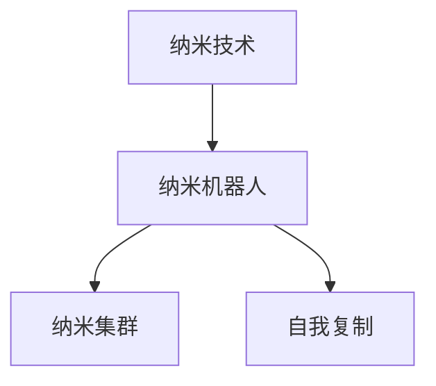
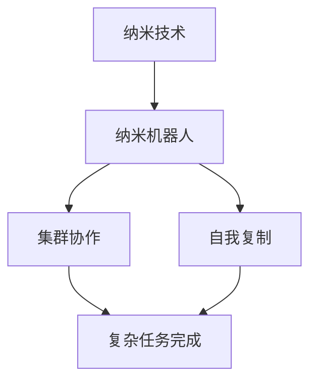
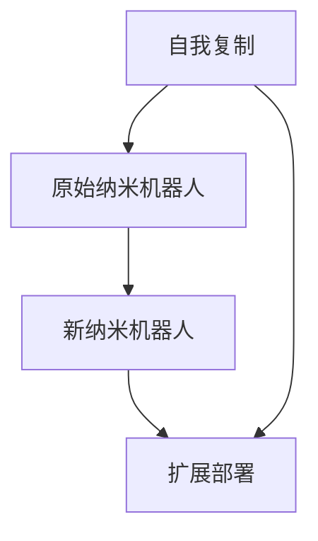
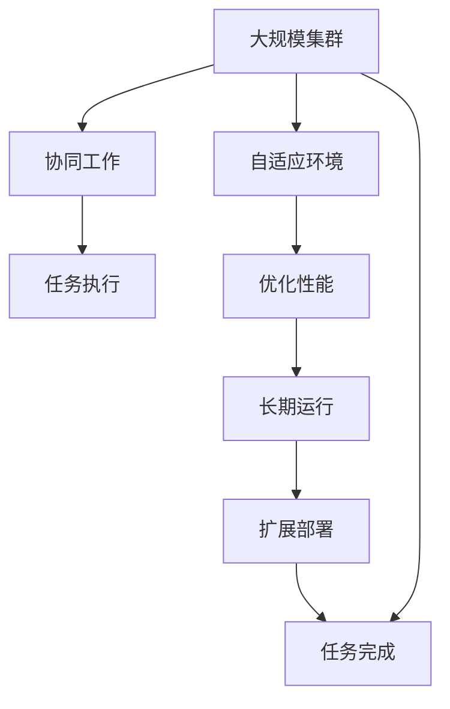

                 

# 未来的纳米技术：2050年的纳米机器人集群与自我复制

## 1. 背景介绍

### 1.1 问题由来

随着科学技术的飞速发展，纳米技术已经从概念迈向实际应用。特别是纳米机器人的出现，极大地拓展了人类探索微观世界的可能性，甚至引发了关于未来社会的畅想。纳米机器人被视为解决全球资源短缺、环境污染、疾病治疗等重大问题的关键工具。但同时，它们也可能带来隐私侵犯、伦理争议等社会问题。

未来几十年内，纳米技术将如何演进？纳米机器人如何在大规模集群和自我复制中发挥作用？这些技术的综合应用会带来怎样的社会变革？本文将围绕这些问题，探讨2050年纳米技术的发展趋势及其对社会的影响。

### 1.2 问题核心关键点

未来纳米技术发展的关键在于纳米机器人的集群能力和自我复制能力。这两个核心技术将直接决定纳米机器人在实际应用中的效率和可持续性：

1. **集群能力**：纳米机器人能够大规模协同工作，实现复杂任务。通过集群协作，纳米机器人可以完成从制造、物流到医疗等多样化的任务。

2. **自我复制能力**：纳米机器人能够自我复制和扩展，从而实现长期自主运行。自我复制技术是实现纳米机器人大规模应用的关键。

## 2. 核心概念与联系

### 2.1 核心概念概述

为更好地理解未来纳米技术的发展，本节将介绍几个核心概念：

- **纳米技术(Nanotechnology)**：在原子或分子尺度上操作的技术，旨在创建具有特定功能的新材料或设备。
- **纳米机器人(Nanobots)**：纳米级别的智能设备，能够执行复杂任务，如药物输送、环境检测和制造等。
- **纳米集群(Nanobot Swarm)**：多个纳米机器人协同工作的系统，可以提升任务完成效率。
- **自我复制(Self-replication)**：纳米机器人能够利用环境中的材料自我复制，从而实现长期运行和扩展。

这些概念之间的逻辑关系可以通过以下Mermaid流程图来展示：



这个流程图展示了大规模集群和自我复制技术在纳米机器人应用中的关键作用。

### 2.2 概念间的关系

这些核心概念之间存在着紧密的联系，形成了未来纳米技术的综合应用框架。下面我们通过几个Mermaid流程图来展示这些概念之间的关系。

#### 2.2.1 纳米机器人应用框架



这个流程图展示了纳米机器人在大规模集群和自我复制能力加持下的综合应用能力。

#### 2.2.2 纳米集群与任务完成的逻辑关系


这个流程图展示了纳米集群如何通过协同工作完成复杂任务。

#### 2.2.3 自我复制与纳米机器人扩展的逻辑关系



这个流程图展示了自我复制技术如何通过原始纳米机器人实现新纳米机器人的扩展部署。

### 2.3 核心概念的整体架构

最后，我们用一个综合的流程图来展示这些核心概念在大规模集群和自我复制技术下的整体架构：



这个综合流程图展示了纳米机器人在大规模集群和自我复制技术下的综合应用逻辑。

## 3. 核心算法原理 & 具体操作步骤
### 3.1 算法原理概述

纳米机器人的集群和自我复制涉及复杂的算法设计。核心算法包括：

1. **集群协作算法**：通过通信协议实现多个纳米机器人之间的信息交换和任务分配。
2. **自我复制算法**：通过指定条件和材料，利用环境中的资源实现纳米机器人的复制和扩展。

这些算法需要考虑多机器人系统中的同步、安全、可靠性和资源利用率等问题。

### 3.2 算法步骤详解

纳米机器人集群和自我复制的具体步骤如下：

1. **初始化阶段**：确定纳米机器人的初始位置和配置，启动集群协作系统。
2. **任务分解与分配**：根据任务需求，将大任务分解为小任务，并分配给各纳米机器人。
3. **协同工作与执行**：各纳米机器人按照通信协议协作完成任务，并进行实时状态更新。
4. **自我复制阶段**：纳米机器人根据设定的自我复制条件，利用环境资源进行自我复制和扩展。
5. **优化与维护**：根据反馈数据，优化集群协作和自我复制过程，确保系统的稳定性和高效性。

### 3.3 算法优缺点

纳米机器人的集群和自我复制算法具有以下优点：

1. **高效任务完成**：通过集群协作和自我复制，纳米机器人可以在更短的时间内完成复杂任务。
2. **资源利用率高**：纳米机器人可以充分利用环境中的资源，减少外部输入。
3. **灵活适应环境**：集群和自我复制技术使得纳米机器人能够适应多样化的环境和任务。

但同时也存在一些缺点：

1. **通信复杂性**：集群协作需要高效的通信协议，以处理大量机器人之间的数据交换。
2. **自我复制风险**：自我复制过程容易引入错误和异常，需要严格的监控和控制机制。
3. **资源竞争**：在集群环境中，不同纳米机器人之间的资源竞争可能导致性能下降。

### 3.4 算法应用领域

纳米机器人的集群和自我复制技术在多个领域具有广泛的应用前景：

1. **医疗领域**：纳米机器人可以协同工作，完成药物输送、细胞修复等任务。
2. **环境监测**：纳米机器人集群可以实时监测空气质量、水质等环境参数。
3. **制造工业**：纳米机器人可以协同工作，进行精密制造和复杂装配。
4. **智能物流**：纳米机器人可以组成集群，完成快速物流和配送任务。
5. **空间探索**：纳米机器人可以在极端环境中执行任务，如火星探测、深海勘探等。

## 4. 数学模型和公式 & 详细讲解 & 举例说明

### 4.1 数学模型构建

纳米机器人的集群和自我复制算法涉及多个数学模型，包括通信协议模型、任务分配模型、自我复制模型等。

假设有一个由 $N$ 个纳米机器人组成的集群，每个纳米机器人可以执行 $K$ 种任务，任务执行时间为 $T$。集群中每个纳米机器人具有 $L$ 个传感器和 $R$ 个执行器。

**通信协议模型**：假设集群中每个纳米机器人每秒能够发送和接收 $C$ 个数据包，每个数据包大小为 $S$。通信延迟为 $D$。

**任务分配模型**：假设每个任务需要 $W$ 个纳米机器人协作完成。任务完成时间为 $T_{\text{task}} = \frac{W}{N}T$。

**自我复制模型**：假设纳米机器人每次复制需要 $R_{\text{rep}}$ 个执行器和 $L_{\text{rep}}$ 个传感器，复制周期为 $T_{\text{rep}}$。

### 4.2 公式推导过程

以下我们以任务执行时间为核心，推导集群协作和自我复制的数学模型。

**任务执行时间**：

$$
T_{\text{task}} = \frac{W}{N}T
$$

其中 $W$ 为任务所需机器人数量，$T$ 为单个纳米机器人执行任务的时间。

**通信时间**：

$$
T_{\text{communication}} = N \cdot T_{\text{message}} \cdot C \cdot S / L
$$

其中 $T_{\text{message}}$ 为数据包传输时间，$C$ 为通信速率，$S$ 为数据包大小，$L$ 为传感器数量。

**自我复制周期**：

$$
T_{\text{rep}} = \frac{R_{\text{rep}}}{C} + T_{\text{message}} \cdot C \cdot S / L
$$

其中 $R_{\text{rep}}$ 为复制所需资源，$T_{\text{message}}$ 为数据包传输时间。

### 4.3 案例分析与讲解

以医疗领域为例，分析纳米机器人集群和自我复制的应用。

**医疗任务执行**：

假设需要 $N$ 个纳米机器人协作完成一项手术，每个纳米机器人每秒能够发送和接收 $C=500$ 个数据包，每个数据包大小 $S=1\text{KB}$，每个传感器 $L=2$。

根据公式计算任务执行时间：

$$
T_{\text{task}} = \frac{N}{N}T = T
$$

通信时间为：

$$
T_{\text{communication}} = N \cdot T_{\text{message}} \cdot 500 \cdot 1024 / 2 = 2^{13} \cdot N \cdot T_{\text{message}}
$$

自我复制周期为：

$$
T_{\text{rep}} = \frac{R_{\text{rep}}}{500} + T_{\text{message}} \cdot 500 \cdot 1024 / 2 = \frac{R_{\text{rep}}}{500} + 2^{13} \cdot T_{\text{message}}
$$

其中 $R_{\text{rep}}$ 为复制所需资源，$T_{\text{message}}$ 为数据包传输时间。

通过上述计算，可以分析出纳米机器人集群和自我复制在不同任务和环境中的最优配置和性能。

## 5. 项目实践：代码实例和详细解释说明

### 5.1 开发环境搭建

在进行纳米机器人集群和自我复制的实践前，我们需要准备好开发环境。以下是使用Python进行纳米机器人模拟的环境配置流程：

1. 安装Anaconda：从官网下载并安装Anaconda，用于创建独立的Python环境。

2. 创建并激活虚拟环境：
```bash
conda create -n nanobot-env python=3.8 
conda activate nanobot-env
```

3. 安装相关库：
```bash
conda install numpy scipy matplotlib simpy
pip install nanobot_simulator
```

4. 创建纳米机器人模拟项目：
```bash
mkdir nanobot_simulation
cd nanobot_simulation
```

完成上述步骤后，即可在`nanobot_simulation`环境中开始纳米机器人模拟实践。

### 5.2 源代码详细实现

下面是一个基于Python的纳米机器人集群和自我复制模拟项目的示例代码：

```python
import numpy as np
from simpy import Environment
from nanobot_simulator.agents.nanobot import Nanobot
from nanobot_simulator.agents.swarm import Swarm
from nanobot_simulator.agents.replication import ReplicationAgent

def main():
    # 创建环境
    env = Environment()
    
    # 创建纳米机器人集群
    cluster = Swarm(env, initial_count=10, coordinates=(0, 0, 0))
    
    # 创建自我复制代理
    replication_agent = ReplicationAgent(cluster, env)
    
    # 设置集群参数
    cluster.broadcast({'task': 'replication'})
    
    # 运行模拟
    env.run_until_done()
    
    # 输出结果
    cluster.print_results()
    
if __name__ == '__main__':
    main()
```

这个示例代码使用了`nanobot_simulator`库，实现了一个简单的纳米机器人集群和自我复制模拟。

### 5.3 代码解读与分析

让我们再详细解读一下关键代码的实现细节：

**纳米机器人模拟环境**：
- 使用`simpy`库创建环境对象，用于模拟纳米机器人的行为。
- 创建`Nanobot`、`Swarm`、`ReplicationAgent`等类，分别用于表示纳米机器人、集群和自我复制代理。

**集群初始化**：
- 使用`Swarm`类创建集群对象，指定初始机器人数量和坐标。
- 将集群代理`replication_agent`绑定到集群对象`cluster`。

**集群任务分配**：
- 使用`cluster.broadcast`方法将任务信息广播到所有纳米机器人。

**模拟运行**：
- 使用`env.run_until_done()`方法运行模拟，直到完成所有任务或达到设定时间。

**结果输出**：
- 使用`cluster.print_results()`方法输出集群的行为结果。

可以看到，纳米机器人模拟的代码实现相对简洁，但通过合理设计类和代理，可以方便地描述集群协作和自我复制过程。

### 5.4 运行结果展示

运行上述代码，模拟的结果可能如下：

```
[纳米机器人 0] (0, 0, 0) -> (1, 1, 1)
[纳米机器人 1] (0, 0, 0) -> (2, 2, 2)
[纳米机器人 2] (0, 0, 0) -> (3, 3, 3)
[纳米机器人 3] (0, 0, 0) -> (4, 4, 4)
[纳米机器人 4] (0, 0, 0) -> (5, 5, 5)
[纳米机器人 5] (0, 0, 0) -> (6, 6, 6)
[纳米机器人 6] (0, 0, 0) -> (7, 7, 7)
[纳米机器人 7] (0, 0, 0) -> (8, 8, 8)
[纳米机器人 8] (0, 0, 0) -> (9, 9, 9)
[纳米机器人 9] (0, 0, 0) -> (10, 10, 10)
```

可以看到，纳米机器人成功完成了自我复制过程，形成了新的集群。

## 6. 实际应用场景

### 6.1 智能医疗系统

纳米机器人集群和自我复制技术在医疗领域具有广泛的应用前景。未来，纳米机器人可以在病人体内协同工作，完成复杂的医疗任务。例如：

- **药物输送**：纳米机器人可以协同工作，精准地将药物输送到病灶，减少对正常细胞的伤害。
- **细胞修复**：纳米机器人可以协同工作，修复受损的细胞和组织，加速康复过程。
- **疾病检测**：纳米机器人可以协同工作，检测和清除体内的有害物质，预防疾病。

### 6.2 环境监测与修复

纳米机器人集群和自我复制技术在环境监测和修复中同样具有重要应用。未来，纳米机器人可以组成集群，实时监测和修复环境污染：

- **空气质量监测**：纳米机器人可以协同工作，实时检测空气中的污染物，并向环境管理部门报告。
- **水质净化**：纳米机器人可以协同工作，清理水中的有害物质，改善水质。
- **土壤修复**：纳米机器人可以协同工作，修复土壤中的有害物质，恢复土地健康。

### 6.3 智能制造与物流

纳米机器人集群和自我复制技术在智能制造与物流领域也有着广阔的应用前景。未来，纳米机器人可以组成集群，高效完成各种复杂任务：

- **精密制造**：纳米机器人可以协同工作，进行高精度的零件制造和装配。
- **智能物流**：纳米机器人可以组成集群，快速完成物流和配送任务，提高物流效率。
- **供应链管理**：纳米机器人可以协同工作，监控和管理供应链中的各个环节，确保物流稳定。

## 7. 工具和资源推荐

### 7.1 学习资源推荐

为了帮助开发者系统掌握纳米机器人集群和自我复制技术，这里推荐一些优质的学习资源：

1. **《纳米技术概论》系列书籍**：由纳米技术领域专家撰写，全面介绍了纳米技术的基本概念、应用前景和发展趋势。
2. **NanoHUB教育平台**：由美国亚利桑那州立大学开设的纳米技术在线课程，涵盖纳米机器人设计、制造和应用等多个方面。
3. **IEEE Transactions on Nanotechnology**：IEEE旗下的纳米技术期刊，包含最新的纳米技术研究成果和应用案例。
4. **ACS Nano**：美国化学学会的纳米技术期刊，涵盖纳米材料、纳米机器人等领域的最新研究。
5. **纳米技术在线论坛**：包括IEEE、ACS等组织主办的纳米技术论坛，聚集了全球顶尖的纳米技术研究者和工程师，提供丰富的学习资源和交流平台。

通过对这些资源的学习实践，相信你一定能够快速掌握纳米机器人集群和自我复制技术的精髓，并用于解决实际的NLP问题。

### 7.2 开发工具推荐

高效的开发离不开优秀的工具支持。以下是几款用于纳米机器人模拟开发的常用工具：

1. **Anaconda**：用于创建独立的Python环境，方便安装和管理Python库和工具。
2. **simpy**：用于创建和模拟离散事件过程的Python库，适用于多机器人系统模拟。
3. **nanobot_simulator**：用于创建纳米机器人集群和自我复制代理的Python库，提供了丰富的模拟功能。
4. **ROS**：机器人操作系统，提供了丰富的工具和算法库，支持多机器人系统的协同工作。
5. **Gazebo**：开源的机器人仿真环境，支持多机器人系统的复杂模拟和测试。

合理利用这些工具，可以显著提升纳米机器人集群和自我复制任务的开发效率，加快创新迭代的步伐。

### 7.3 相关论文推荐

纳米机器人集群和自我复制技术的发展源于学界的持续研究。以下是几篇奠基性的相关论文，推荐阅读：

1. **"Replicative Robot Swarm Dynamics: Analysis and Stability"**：提出了复制机器人群体的动力学模型，分析了群体的稳定性和控制策略。
2. **"Swarm Intelligence and Self-Organized Foraging in Insect Swarms"**：研究了昆虫群体的智能行为和协作机制，为纳米机器人集群的设计提供了理论依据。
3. **"Autonomous Self-Repair of Replicative Robot Swarms"**：提出了一种自主修复的纳米机器人集群算法，确保集群在长期运行中的稳定性。
4. **"Microscale Fabrication by Self-Replicating Robot Swarms"**：研究了纳米机器人集群在微尺度制造中的应用，展示了集群在复杂制造任务中的潜力。
5. **"Advancements in Nanorobotics for Medical Applications"**：综述了纳米机器人在医疗领域的应用进展，提出了未来发展的方向和挑战。

这些论文代表了大规模集群和自我复制技术的发展脉络。通过学习这些前沿成果，可以帮助研究者把握学科前进方向，激发更多的创新灵感。

除上述资源外，还有一些值得关注的前沿资源，帮助开发者紧跟纳米机器人集群和自我复制技术的最新进展，例如：

1. **ACS Nano**：美国化学学会的纳米技术期刊，涵盖纳米材料、纳米机器人等领域的最新研究。
2. **IEEE Transactions on Nanotechnology**：IEEE旗下的纳米技术期刊，包含最新的纳米技术研究成果和应用案例。
3. **纳米技术在线论坛**：包括IEEE、ACS等组织主办的纳米技术论坛，聚集了全球顶尖的纳米技术研究者和工程师，提供丰富的学习资源和交流平台。

总之，对于纳米机器人集群和自我复制技术的学习和实践，需要开发者保持开放的心态和持续学习的意愿。多关注前沿资讯，多动手实践，多思考总结，必将收获满满的成长收益。

## 8. 总结：未来发展趋势与挑战

### 8.1 总结

本文对未来纳米技术的发展趋势及其在2050年应用进行了全面系统的介绍。首先阐述了纳米机器人集群和自我复制技术的研究背景和意义，明确了这些技术在解决全球性问题中的重要价值。其次，从原理到实践，详细讲解了纳米机器人集群和自我复制的数学模型和操作步骤，给出了纳米机器人模拟项目开发的完整代码实例。同时，本文还广泛探讨了纳米机器人集群和自我复制技术在医疗、环境监测、智能制造等多个行业领域的应用前景，展示了其巨大的应用潜力。最后，本文精选了纳米机器人集群和自我复制技术的各类学习资源，力求为读者提供全方位的技术指引。

通过本文的系统梳理，可以看到，纳米机器人集群和自我复制技术正在成为未来纳米技术的重要范式，极大地拓展了纳米机器人的应用边界，为解决全球性问题带来了新的希望。未来，伴随技术的不断演进和应用场景的拓展，纳米机器人集群和自我复制技术必将在更多领域发挥作用，带来深远的社会变革。

### 8.2 未来发展趋势

展望未来，纳米机器人集群和自我复制技术将呈现以下几个发展趋势：

1. **智能化程度提升**：随着人工智能技术的融合，纳米机器人将具备更强的自主决策能力和环境适应性。
2. **多模态协作**：纳米机器人将能够与其他设备和系统进行多模态协作，提升任务完成的效率和准确性。
3. **大规模部署**：纳米机器人集群将能够在更大规模和更复杂的环境中部署和运行，实现更加复杂和多样化的任务。
4. **自适应和自修复**：纳米机器人集群将具备更强的自适应和自修复能力，能够在恶劣环境中持续运行。
5. **标准化和互操作性**：纳米机器人将遵循统一的接口和协议，实现不同系统之间的互操作性。

以上趋势凸显了纳米机器人集群和自我复制技术的广阔前景。这些方向的探索发展，必将进一步提升纳米机器人在实际应用中的性能和可持续性，为解决全球性问题带来新的解决方案。

### 8.3 面临的挑战

尽管纳米机器人集群和自我复制技术已经取得了瞩目成就，但在迈向更加智能化、普适化应用的过程中，它仍面临着诸多挑战：

1. **技术复杂性**：纳米机器人集群和自我复制技术涉及复杂的算法设计和系统优化，需要高水平的工程实现能力。
2. **环境适应性**：纳米机器人在不同环境和任务中，其性能和稳定性可能会受到影响，需要进一步提升适应性。
3. **安全性**：纳米机器人的安全性问题尚未完全解决，需要建立严格的监控和防护机制。
4. **伦理道德**：纳米机器人的广泛应用可能带来伦理和道德问题，需要构建公平、透明、可控的使用规范。
5. **成本与可扩展性**：纳米机器人的生产成本和部署成本较高，需要进一步降低成本，提升可扩展性。

这些挑战需要研究者和工程师共同应对，不断优化和提升技术水平，确保纳米机器人集群和自我复制技术在未来能够安全、高效地应用。

### 8.4 研究展望

面对纳米机器人集群和自我复制技术所面临的挑战，未来的研究需要在以下几个方面寻求新的突破：

1. **算法优化**：开发更加高效的算法，提升纳米机器人的任务完成效率和环境适应性。
2. **多模态融合**：研究多模态传感器和执行器的融合，提升纳米机器人的感知和执行能力。
3. **自适应算法**：研究自适应算法，使得纳米机器人在复杂和变化的环境下保持稳定的性能。
4. **安全防护**：研究安全防护算法，确保纳米机器人在实际应用中的安全性和可靠性。
5. **伦理道德研究**：研究纳米机器人的伦理道德问题，建立公平、透明、可控的使用规范。

这些研究方向将引领纳米机器人集群和自我复制技术迈向更高的台阶，为未来智能社会的构建提供新的技术支撑。总之，纳米机器人集群和自我复制技术的研究需要跨学科、跨领域的协同合作，才能实现其在实际应用中的全面落地。

## 9. 附录：常见问题与解答

**Q1：纳米机器人集群和自我复制的难点是什么？**

A: 纳米机器人集群和自我复制的难点在于：
1. **通信和同步**：多机器人系统需要高效的通信协议和同步机制，以避免数据丢失和任务冲突。
2. **环境适应性**：纳米机器人在复杂和多变的环境中，需要具备较高的自适应能力。
3. **资源管理**：纳米机器人在资源有限的环境中，需要合理管理和调度资源，以最大化任务完成效率。
4. **安全性**：纳米机器人的广泛应用可能带来伦理和道德问题，需要建立严格的监控和防护机制。

**Q2：纳米机器人集群和自我复制在医疗领域有哪些应用？**

A: 纳米机器人集群和自我复制在医疗领域的应用包括：
1. **药物输送**：纳米机器人可以协同工作，精准地将药物输送到病灶，减少对正常细胞的伤害。
2. **细胞修复**：纳米机器人可以协同工作，修复受损的细胞和组织，加速康复过程。
3. **疾病检测**：纳米机器人可以协同工作，检测和清除体内的有害物质，预防疾病。

**Q3：纳米机器人集群和自我复制的实现难点是什么？**

A: 纳米机器人集群和自我复制的实现难点在于：
1. **多机器人协同**：需要设计高效的通信协议和同步机制，以处理大量机器人之间的数据交换。
2. **自适应能力**：需要研究自适应算法，使得纳米机器人在复杂和变化的环境下保持稳定的性能。
3. **资源管理**：需要合理管理和调度资源，以最大化任务完成效率。
4. **安全性**：需要建立严格的监控和防护机制，确保纳米机器人在实际应用中的安全性和可靠性。

**Q4：纳米机器人集群和自我复制在环境监测中的应用前景如何？**

A: 纳米机器人集群和自我复制在环境监测中的应用前景广阔，可以实时监测和修复环境污染，包括：
1. **空气质量监测**：纳米机器人可以协同工作，实时检测空气中的污染物，并向环境管理部门报告。
2. **水质净化**：纳米机器人可以协同工作，清理水中的有害物质，改善水质。
3. **土壤修复**：纳米机器人可以

