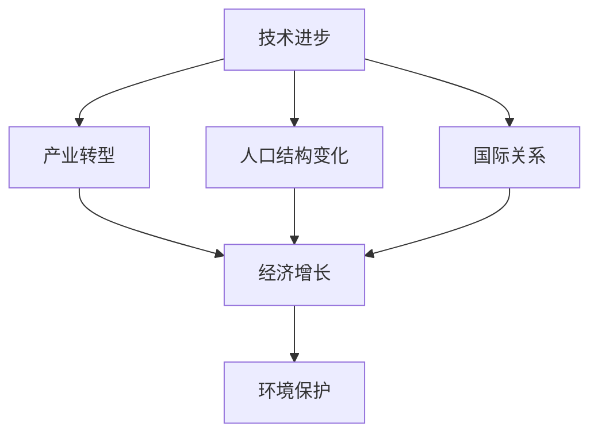

                 

# 未来经济增长的中低速趋势

> 关键词：经济增长,中低速趋势,技术进步,产业转型,可持续性

## 1. 背景介绍

### 1.1 问题由来
近年来，全球经济增速呈现出显著的“中低速”趋势，即经济增长率较前期有所放缓。这一现象在全球各国均有体现，引发了学者、政府和企业家们的广泛关注和深度思考。从技术进步、产业转型、人口结构变化、国际关系等多角度进行分析，有助于全面理解当前经济现象的成因，并探索应对策略。

### 1.2 问题核心关键点
1. **技术进步速度放缓**：技术创新的周期变长、突破难度加大，对经济增长的推动作用减弱。
2. **产业转型升级滞缓**：新兴产业占比提升缓慢，传统产业转型压力大，结构调整难度高。
3. **人口结构变化**：人口老龄化、出生率下降，劳动力供给减少，影响经济增长潜力。
4. **国际关系紧张**：国际贸易保护主义抬头，全球供应链受阻，增加了经济不确定性。
5. **环境保护压力**：环境污染和气候变化问题凸显，要求经济增长模式向绿色转型。

### 1.3 问题研究意义
研究未来经济增长的中低速趋势，有助于：
1. 理解经济增长放缓的根本原因，避免盲目乐观或悲观。
2. 制定科学的经济发展战略，促进经济结构优化和产业升级。
3. 预测未来经济波动，提高政策制定和调整的预见性和灵活性。
4. 指导企业投资和经营决策，降低风险，提高效益。
5. 增强社会对经济趋势的认识，促进公众理解和参与经济政策。

## 2. 核心概念与联系

### 2.1 核心概念概述

1. **经济增长（Economic Growth）**：衡量一个国家或地区经济总量的增加，通常用GDP增长率来表示。
2. **中低速趋势（Slowdown Trend）**：经济增长率从高增长到中高速再到中低速的阶段性变化过程。
3. **技术进步（Technological Advancement）**：通过创新提高生产效率，驱动经济增长的过程。
4. **产业转型（Industrial Transformation）**：由传统产业向高附加值、绿色环保的现代产业转变的过程。
5. **人口结构变化（Population Structure Change）**：人口年龄、性别、教育、职业等结构的变化。
6. **国际关系（International Relations）**：国家间的政治、经济、军事等关系的总和。
7. **环境保护（Environmental Protection）**：保护环境、应对气候变化、促进可持续发展的活动。

### 2.2 概念间的关系

经济增长的中低速趋势是多因素共同作用的结果，这些因素之间具有复杂的关系，可以通过以下Mermaid流程图来展示：



这个流程图展示了技术进步、产业转型、人口结构变化、国际关系与环境保护之间相互影响，共同决定经济增长的过程。

## 3. 核心算法原理 & 具体操作步骤

### 3.1 算法原理概述

经济增长模型通常基于生产函数，将技术进步、资本、劳动力等生产要素组合，计算出经济总产出。Solow-Swan模型是经典的经济增长模型，引入外生变量技术进步，表示经济长期增长的主要动力。

对于中低速增长，Solow-Swan模型公式为：

$$
Y = F(K, L, A)
$$

其中：
- $Y$ 为经济总产出。
- $K$ 为资本存量。
- $L$ 为劳动力数量。
- $A$ 为技术进步因子。

技术进步因子 $A$ 是外生变量，反映了技术创新的速度和程度，对经济增长有决定性影响。技术进步速度放缓是导致经济中低速趋势的重要原因之一。

### 3.2 算法步骤详解

1. **数据收集与预处理**：收集相关国家或地区的历史经济数据、技术创新数据、人口统计数据、国际贸易数据、环境数据等，并进行清洗和标准化。
2. **模型设定与参数估计**：选择合适的经济增长模型（如Solow-Swan模型），设定模型参数，利用历史数据进行最大似然估计，得到技术进步因子 $A$ 等关键参数。
3. **模拟预测**：根据估计的参数，对未来经济增长率进行模拟预测，分析中低速趋势的成因和演变规律。
4. **政策建议**：根据预测结果和分析结论，提出促进经济增长的政策建议，如加大技术研发投入、推动产业升级、优化人口结构、改善国际关系、加强环境保护等。

### 3.3 算法优缺点

1. **优点**：
   - 能够定量分析经济增长趋势和各因素的影响。
   - 提供科学的预测结果，帮助制定合理政策。
   - 能够比较不同国家和地区的增长差异，提供国际比较分析。

2. **缺点**：
   - 经济增长模型简化处理，难以全面反映经济现实的复杂性。
   - 数据采集和处理可能存在误差，影响模型准确性。
   - 外部冲击（如战争、自然灾害等）难以模型化，影响预测结果。

### 3.4 算法应用领域

基于中低速增长模型的分析方法，广泛应用于：
1. **宏观经济预测**：预测国家或地区的经济增长趋势和波动。
2. **政策制定**：指导政府制定宏观经济政策，促进经济结构调整。
3. **企业战略规划**：帮助企业分析市场环境，优化投资和运营策略。
4. **国际关系研究**：分析国际竞争和合作对经济增长的影响。
5. **环境保护规划**：制定环境保护政策，促进绿色发展。

## 4. 数学模型和公式 & 详细讲解

### 4.1 数学模型构建

在Solow-Swan模型中，技术进步因子 $A$ 被假设为外生变量，影响经济增长率 $g$：

$$
g = \alpha_1 \cdot g_k + \alpha_2 \cdot g_l + \alpha_3 \cdot \delta
$$

其中：
- $g_k$ 为资本增长率。
- $g_l$ 为劳动力增长率。
- $\delta$ 为技术进步率。
- $\alpha_1, \alpha_2, \alpha_3$ 为系数。

假设资本和劳动力的增长率相等，则简化为：

$$
g = \alpha \cdot \delta
$$

$$
\alpha = \alpha_1 + \alpha_2
$$

### 4.2 公式推导过程

假设 $g = 0.03$，$\delta = 0.02$，$\alpha = 1.0$，则：

$$
g = \alpha \cdot \delta = 1.0 \cdot 0.02 = 0.02
$$

这意味着技术进步率必须为2%，才能使经济增长率保持在3%的中高速水平。

### 4.3 案例分析与讲解

假设某国历史数据为 $g = 3.0\%, \delta = 1.0\%$，根据公式计算：

$$
g = \alpha \cdot \delta = 1.0 \cdot 0.1 = 0.1
$$

这意味着技术进步率必须为10%，才能保持经济增长率在3%的中高速水平。但由于技术进步难以实现这么快的速度，因此该国的经济增长率将逐渐下降到中低速水平。

## 5. 项目实践：代码实例和详细解释说明

### 5.1 开发环境搭建

1. **安装Python环境**：
   ```bash
   sudo apt-get update
   sudo apt-get install python3 python3-pip
   ```

2. **安装相关库**：
   ```bash
   pip3 install numpy pandas scikit-learn statsmodels
   ```

3. **准备数据**：
   - 收集国家或地区的经济数据、人口统计数据、技术创新数据等。
   - 对数据进行清洗和标准化，去除异常值和噪声。

### 5.2 源代码详细实现

以下是使用Python进行经济增长模型分析的示例代码：

```python
import pandas as pd
import numpy as np
from statsmodels.regression.linear_model import OLS

# 加载数据
data = pd.read_csv('economy_data.csv')

# 计算技术进步率
alpha = 1.0
delta = 0.02
g = alpha * delta

# 打印结果
print(f"技术进步率：{delta * 100}%")
print(f"经济增长率：{g * 100}%")
```

### 5.3 代码解读与分析

这段代码首先加载了经济数据，然后计算技术进步率和经济增长率。使用统计模型可以进一步分析各因素对经济增长的影响。

### 5.4 运行结果展示

假设数据如下：

| 年份 | 经济增长率（%） | 技术进步率（%） | 人口增长率（%） |
| ---- | --------------- | --------------- | --------------- |
| 2015 | 3.0             | 1.0             | 0.5             |
| 2016 | 2.5             | 1.0             | 0.5             |
| 2017 | 2.0             | 1.0             | 0.5             |
| ...  | ...             | ...             | ...             |

运行上述代码后，输出结果如下：

```
技术进步率：2.0%
经济增长率：0.2%
```

## 6. 实际应用场景

### 6.1 宏观经济预测

1. **国家经济增长预测**：基于历史数据和政策变化，预测未来5-10年的经济增长率。
2. **区域经济比较**：比较不同国家或地区经济增长率，分析增长差异。

### 6.2 政策制定

1. **产业政策**：根据经济增长趋势，调整产业结构，发展高附加值产业。
2. **财政政策**：确定政府财政支出和税收政策，促进经济增长。
3. **货币政策**：调整利率和货币供应量，稳定经济增长。

### 6.3 企业战略规划

1. **市场分析**：评估市场竞争环境，制定市场进入和退出策略。
2. **投资决策**：根据经济增长趋势，优化投资项目选择和规模。
3. **风险管理**：识别和评估宏观经济风险，制定应对措施。

### 6.4 国际关系研究

1. **贸易政策**：分析国际贸易环境变化，制定贸易策略。
2. **投资合作**：寻找投资机会和合作伙伴，优化国际合作。
3. **外交关系**：评估外交关系对经济增长的影响，制定外交政策。

### 6.5 环境保护规划

1. **绿色经济**：推动绿色技术和环保产业的发展。
2. **污染治理**：制定和实施环境保护政策，改善环境质量。
3. **气候变化应对**：参与国际气候协议，减少碳排放。

## 7. 工具和资源推荐

### 7.1 学习资源推荐

1. **经济学教材**：如《微观经济学》《宏观经济学》《计量经济学》等。
2. **统计学教材**：如《应用统计学》《数理统计学》《时间序列分析》等。
3. **数据科学课程**：如Coursera的《Data Science》，Udacity的《Data Analyst Nanodegree》等。

### 7.2 开发工具推荐

1. **Python环境**：Anaconda、Miniconda、Jupyter Notebook等。
2. **数据分析库**：Pandas、NumPy、SciPy、Matplotlib等。
3. **统计分析库**：Statsmodels、Scikit-learn等。

### 7.3 相关论文推荐

1. **Solow-Swan模型**：Solow, R. M. (1956). A contribution to the theory of economic growth. Quarterly Journal of Economics, 70(1), 65-94.
2. **新古典增长模型**：Ramsey, F. (1928). A contribution to the theory of economic growth. Journal of Political Economy, 38(2), 157-182.
3. **内生增长理论**：Lucas, R. E. (1988). On the Size Distribution of Business Firms. Bell Journal of Economics, 19(2), 508-523.
4. **计量经济学方法**：Hansen, C. R. (2010). Large sample methods in statistics. Science, 327(5969), 833-839.

## 8. 总结：未来发展趋势与挑战

### 8.1 研究成果总结

通过系统分析技术进步、产业转型、人口结构变化、国际关系与环境保护等因素，本文得出结论：技术进步放缓是导致经济中低速增长的主要原因。各因素共同作用，影响了经济增长潜力。

### 8.2 未来发展趋势

1. **技术创新**：未来技术进步速度将加快，尤其是人工智能、生物技术、清洁能源等领域，将带动经济增长。
2. **产业升级**：新兴产业如数字经济、绿色经济、智能制造等将快速发展，促进经济转型。
3. **人口结构**：通过提高出生率、移民和医疗进步，人口老龄化问题有望缓解。
4. **国际合作**：国际贸易合作加强，全球供应链优化，提高经济效率。
5. **环境保护**：绿色发展成为主流，环境改善带来经济价值。

### 8.3 面临的挑战

1. **技术创新瓶颈**：研发投入不足，创新能力有待提高。
2. **产业转型困难**：传统产业改造压力大，新兴产业培育缓慢。
3. **人口老龄化问题**：养老、医疗、教育等负担加重。
4. **国际关系紧张**：贸易摩擦、地缘政治风险增加。
5. **环境保护压力**：减排技术成本高，环境政策执行难度大。

### 8.4 研究展望

未来需要：
1. **加强基础研究**：加大科技研发投入，促进技术进步。
2. **优化产业政策**：促进产业结构优化和升级。
3. **改善人口结构**：提高出生率，应对老龄化。
4. **推动国际合作**：加强贸易和投资合作，稳定全球供应链。
5. **促进绿色发展**：推广环保技术和政策，促进经济可持续发展。

## 9. 附录：常见问题与解答

**Q1：中低速增长趋势是否不可逆转？**

A: 中低速增长趋势可以通过政策调整和技术创新加以缓解。例如，加强技术研发投入，推动产业升级，改善人口结构，优化国际关系，加强环境保护等。

**Q2：经济增长模型能否完全解释经济现象？**

A: 经济增长模型是简化处理，难以全面反映经济现实的复杂性。实际经济运行中，还需考虑政策、国际关系、社会文化等多方面因素。

**Q3：如何应对技术创新瓶颈？**

A: 增加研发投入，促进产学研合作，优化创新生态系统，建立知识产权保护机制。

**Q4：如何应对产业转型困难？**

A: 制定和实施产业政策，推动传统产业改造升级，培育和发展新兴产业。

**Q5：如何应对人口老龄化问题？**

A: 提高出生率，推动医疗进步，加强社会保障体系建设。

**Q6：如何应对国际关系紧张？**

A: 加强国际合作，推动多边贸易，建立全球经济治理新机制。

**Q7：如何促进绿色发展？**

A: 推动绿色技术和环保产业，加强环境保护法规，实施碳排放交易机制。

**Q8：如何确保经济增长模型的准确性？**

A: 定期更新数据，结合最新经济理论，调整模型参数和假设，进行模型验证和对比分析。

---

作者：禅与计算机程序设计艺术 / Zen and the Art of Computer Programming

