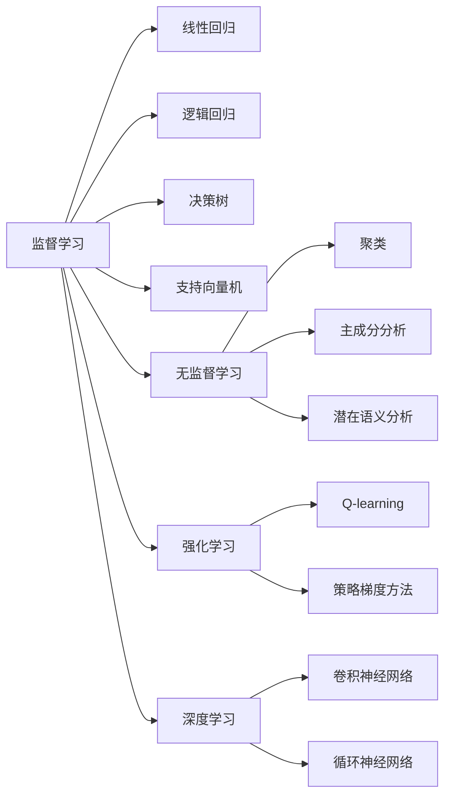
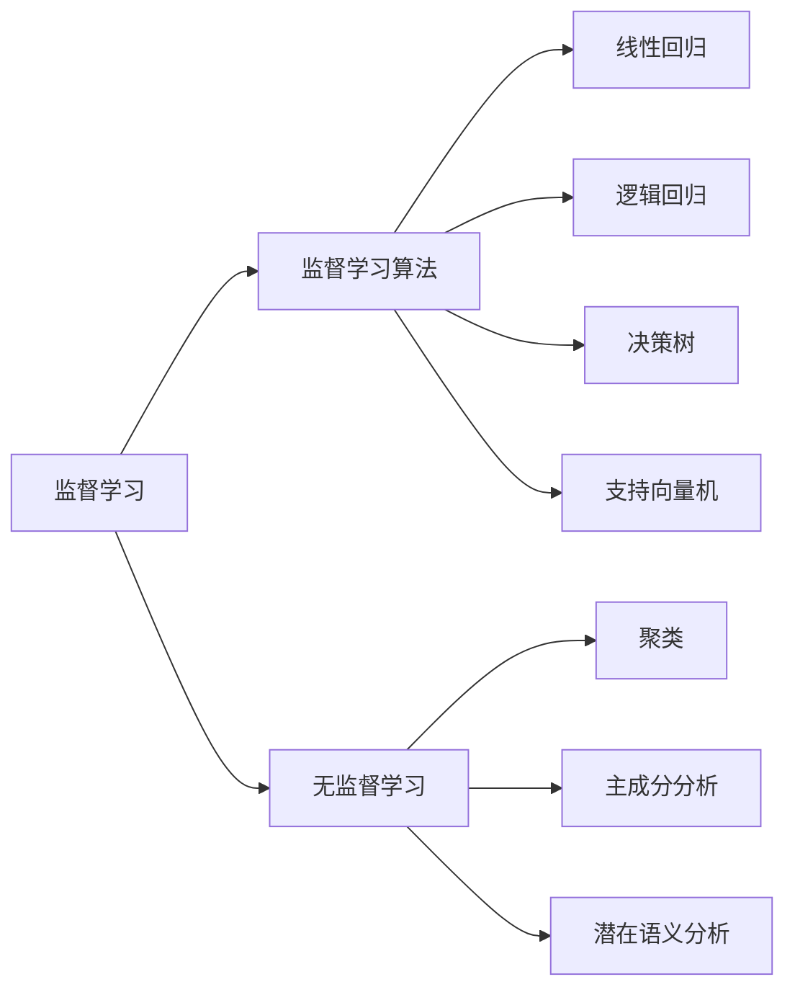
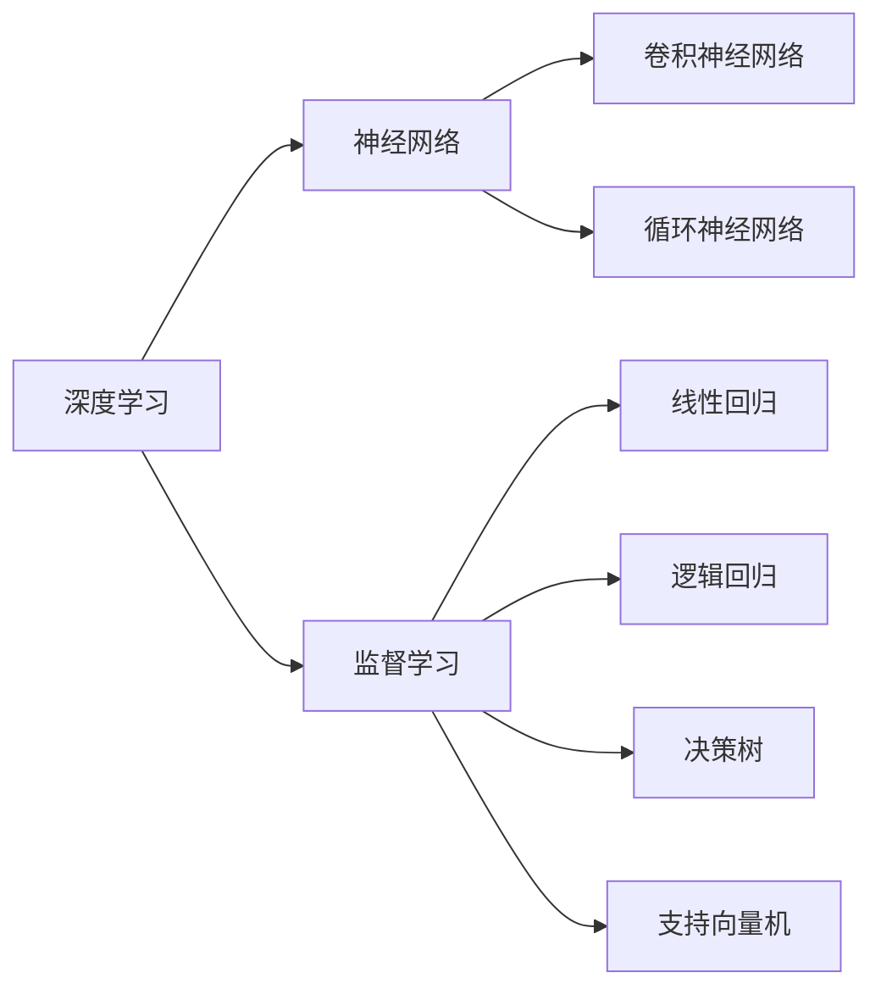
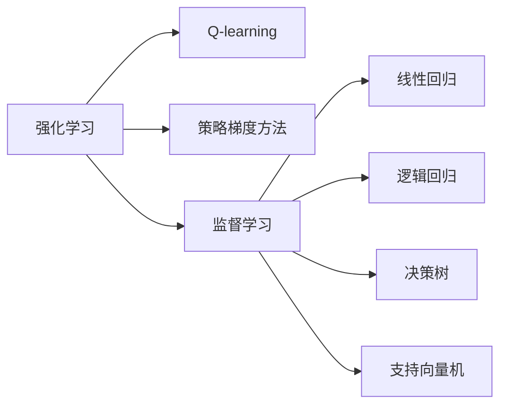
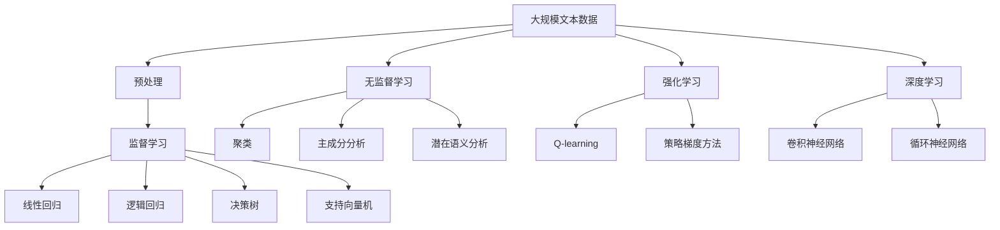

                 

# 机器学习 (Machine Learning, ML) 原理与代码实例讲解

> 关键词：机器学习, 监督学习, 无监督学习, 强化学习, 监督学习算法, 无监督学习算法, 强化学习算法, 深度学习, 神经网络, 算法实例, 梯度下降, 随机梯度下降, 交叉验证, 数据预处理

## 1. 背景介绍

### 1.1 问题由来
机器学习（Machine Learning, ML）作为人工智能的核心分支，已经成为解决各类复杂问题的利器。机器学习通过训练模型从数据中学习规律，从而进行分类、回归、聚类等任务。本文将详细介绍机器学习的基本原理，并通过代码实例对其关键算法进行讲解。

## 2. 核心概念与联系

### 2.1 核心概念概述
为更好地理解机器学习的核心算法和概念，本节将介绍几个密切相关的核心概念：

- **监督学习(Supervised Learning)**：指在已有标注数据的基础上，通过训练模型学习输入与输出之间的映射关系。监督学习算法包括线性回归、逻辑回归、决策树、支持向量机等。
- **无监督学习(Unsupervised Learning)**：指在没有标注数据的情况下，通过模型发现数据的内在结构和规律。无监督学习算法包括聚类、主成分分析(PCA)、潜在语义分析(LSA)等。
- **强化学习(Reinforcement Learning)**：指通过与环境交互，学习最优策略以最大化奖励的一种学习方式。强化学习算法包括Q-learning、策略梯度方法等。
- **深度学习(Deep Learning)**：指使用多层神经网络进行复杂模式识别的一种方法。深度学习算法包括卷积神经网络(CNN)、循环神经网络(RNN)等。
- **梯度下降(Gradient Descent)**：指通过计算损失函数对模型参数的梯度，更新模型参数，最小化损失函数的一种优化算法。
- **随机梯度下降(Stochastic Gradient Descent, SGD)**：指在每次迭代中随机选取一个样本来计算梯度，从而更新模型参数的一种优化算法。
- **交叉验证(Cross-Validation)**：指将数据集划分为训练集和验证集，通过多次训练和验证来评估模型性能的一种方法。

这些核心概念之间的逻辑关系可以通过以下Mermaid流程图来展示：



这个流程图展示了一些核心概念之间的关系：

1. 监督学习是机器学习的主流范式，包括线性回归、逻辑回归、决策树、支持向量机等多种算法。
2. 无监督学习则是通过发现数据内在结构和规律，如聚类、PCA、LSA等算法。
3. 强化学习通过与环境交互，学习最优策略，如Q-learning、策略梯度等算法。
4. 深度学习是神经网络的一种扩展，包括CNN、RNN等多种模型。
5. 梯度下降和随机梯度下降是优化算法，用于最小化损失函数。
6. 交叉验证用于评估模型性能，通过多次训练和验证来避免过拟合。

这些概念共同构成了机器学习的基本框架，使得模型能够从数据中学习规律，并应用于各种任务。

### 2.2 概念间的关系

这些核心概念之间存在着紧密的联系，形成了机器学习的完整生态系统。下面我通过几个Mermaid流程图来展示这些概念之间的关系。

#### 2.2.1 监督学习与无监督学习的关系



这个流程图展示了监督学习与无监督学习的关系。监督学习通过训练模型学习输入与输出之间的映射关系，而无监督学习则是发现数据的内在结构和规律。

#### 2.2.2 深度学习与监督学习的关系



这个流程图展示了深度学习与监督学习的关系。深度学习通过多层神经网络进行复杂模式识别，而监督学习则是通过训练模型学习输入与输出之间的映射关系。

#### 2.2.3 强化学习与监督学习的关系



这个流程图展示了强化学习与监督学习的关系。强化学习通过与环境交互学习最优策略，而监督学习则是通过训练模型学习输入与输出之间的映射关系。

### 2.3 核心概念的整体架构

最后，我们用一个综合的流程图来展示这些核心概念在机器学习中的整体架构：



这个综合流程图展示了从预处理到深度学习，再到强化学习的完整过程。大样本数据首先经过预处理，然后通过监督学习、无监督学习和强化学习进行模型训练和推理，最后得到适应各种任务的模型。 通过这些流程图，我们可以更清晰地理解机器学习的基本流程和概念之间的关系。

## 3. 核心算法原理 & 具体操作步骤

### 3.1 算法原理概述
机器学习的核心算法主要包括监督学习算法、无监督学习算法和强化学习算法。这些算法通过不同的方法，从数据中学习规律，并应用于各种任务。

#### 3.1.1 监督学习算法原理
监督学习算法通过已标注的数据集，训练模型学习输入与输出之间的映射关系。常用的监督学习算法包括线性回归、逻辑回归、决策树、支持向量机等。

- **线性回归(Linear Regression)**：通过拟合一条直线来预测连续变量的值。形式化表示为：

$$
y = \theta_0 + \theta_1 x_1 + \theta_2 x_2 + ... + \theta_n x_n
$$

其中 $y$ 为输出变量，$x_i$ 为输入变量，$\theta_i$ 为模型参数。

- **逻辑回归(Logistic Regression)**：通过拟合一个S形曲线来预测分类变量。形式化表示为：

$$
\hat{y} = \sigma(\theta_0 + \theta_1 x_1 + \theta_2 x_2 + ... + \theta_n x_n)
$$

其中 $\sigma$ 为S形函数，$\hat{y}$ 为预测变量。

- **决策树(Decision Tree)**：通过树形结构来表示决策过程，并预测分类变量。决策树算法包括ID3、C4.5、CART等。

- **支持向量机(Support Vector Machine, SVM)**：通过将数据映射到高维空间，找到最优超平面来预测分类变量。

#### 3.1.2 无监督学习算法原理
无监督学习算法通过发现数据的内在结构和规律，常用的无监督学习算法包括聚类、主成分分析(PCA)、潜在语义分析(LSA)等。

- **聚类(Clustering)**：将数据集分为多个簇，使得同一簇内的数据相似度较高，不同簇之间的数据相似度较低。常用的聚类算法包括K-means、层次聚类、DBSCAN等。

- **主成分分析(Principal Component Analysis, PCA)**：通过降维技术，将高维数据映射到低维空间，保留最具有代表性的主成分。

- **潜在语义分析(Latent Semantic Analysis, LSA)**：通过矩阵分解，发现文本中隐含的语义关系，常用的LSA算法包括LSA和潜在狄利克雷分布(Latent Dirichlet Allocation, LDA)等。

#### 3.1.3 强化学习算法原理
强化学习算法通过与环境交互，学习最优策略以最大化奖励。常用的强化学习算法包括Q-learning、策略梯度方法等。

- **Q-learning**：通过迭代计算每个状态-动作对的Q值，选择最优动作。形式化表示为：

$$
Q(s, a) \leftarrow Q(s, a) + \alpha [r + \gamma \max_{a'} Q(s', a') - Q(s, a)]
$$

其中 $Q(s, a)$ 为状态-动作对的Q值，$\alpha$ 为学习率，$\gamma$ 为折扣因子，$r$ 为当前奖励，$s'$ 为下一个状态，$a'$ 为下一个动作。

- **策略梯度方法**：通过优化策略函数，使得模型选择最优策略。常用的策略梯度方法包括REINFORCE、策略梯度自适应算法(SGA)等。

### 3.2 算法步骤详解
下面以监督学习算法中的线性回归为例，详细介绍算法步骤：

#### 3.2.1 数据准备
- **数据集划分**：将数据集分为训练集、验证集和测试集，一般划分为70%训练集、15%验证集、15%测试集。
- **数据预处理**：对数据进行归一化、标准化等预处理，避免模型因数据特征差异过大而产生过拟合。

#### 3.2.2 模型初始化
- **初始化模型参数**：随机初始化模型参数 $\theta_0, \theta_1, ..., \theta_n$。
- **设置学习率**：设置学习率 $\alpha$，一般建议从0.01开始逐步减小。

#### 3.2.3 训练模型
- **前向传播**：将训练集数据 $x_i$ 输入模型，计算预测输出 $\hat{y}_i = \theta_0 + \theta_1 x_{i1} + \theta_2 x_{i2} + ... + \theta_n x_{in}$。
- **计算损失函数**：计算预测输出与真实输出之间的损失函数 $L = \frac{1}{N} \sum_{i=1}^N (\hat{y}_i - y_i)^2$。
- **反向传播**：根据损失函数对模型参数进行梯度下降更新，更新公式为：

$$
\theta_i \leftarrow \theta_i - \alpha \frac{1}{N} \sum_{i=1}^N (2(\hat{y}_i - y_i) x_{i1}) \tag{1}
$$

其中 $N$ 为样本数量，$x_{ij}$ 为样本 $i$ 的特征 $j$ 的值。

#### 3.2.4 验证模型
- **计算验证集损失**：将验证集数据 $x_i$ 输入模型，计算预测输出 $\hat{y}_i$ 和损失函数 $L$。
- **评估模型性能**：通过计算R²、MAE等指标评估模型在验证集上的性能。

#### 3.2.5 测试模型
- **计算测试集损失**：将测试集数据 $x_i$ 输入模型，计算预测输出 $\hat{y}_i$ 和损失函数 $L$。
- **评估模型性能**：通过计算R²、MAE等指标评估模型在测试集上的性能。

### 3.3 算法优缺点
监督学习算法具有以下优点：
- **数据依赖性低**：只需要少量标注数据，即可训练出高效模型。
- **泛化能力强**：模型在未见过的数据上也有不错的表现。
- **可解释性强**：模型参数易于解释，便于调试和优化。

同时，监督学习算法也存在以下缺点：
- **数据标注成本高**：需要大量标注数据，标注成本较高。
- **过拟合风险高**：模型在训练集上表现很好，但在验证集和测试集上表现较差。
- **模型通用性差**：对于特定数据集训练的模型，难以泛化到其他数据集。

### 3.4 算法应用领域
监督学习算法广泛应用于各类分类和回归任务，包括文本分类、图像识别、语音识别、推荐系统等。

- **文本分类**：将文本分类为不同的主题或情感。常用的算法包括朴素贝叶斯、支持向量机、神经网络等。
- **图像识别**：将图像分类为不同的类别。常用的算法包括卷积神经网络、深度残差网络等。
- **语音识别**：将语音转换为文本。常用的算法包括隐马尔可夫模型、循环神经网络等。
- **推荐系统**：根据用户的历史行为推荐商品或内容。常用的算法包括协同过滤、基于内容的推荐、矩阵分解等。

## 4. 数学模型和公式 & 详细讲解 & 举例说明

### 4.1 数学模型构建

本节将使用数学语言对监督学习算法的核心原理进行更加严格的刻画。

设训练集为 $D = \{(x_i, y_i)\}_{i=1}^N$，其中 $x_i \in \mathbb{R}^n$ 为输入向量，$y_i \in \mathbb{R}$ 为输出变量。假设线性回归模型的参数为 $\theta = (\theta_0, \theta_1, ..., \theta_n)$，则模型的预测输出为：

$$
\hat{y} = \theta_0 + \theta_1 x_1 + \theta_2 x_2 + ... + \theta_n x_n
$$

模型的损失函数为：

$$
L(\theta) = \frac{1}{2N} \sum_{i=1}^N (\hat{y}_i - y_i)^2
$$

### 4.2 公式推导过程

将上述损失函数对模型参数 $\theta$ 求偏导数，得到梯度向量：

$$
\nabla_{\theta} L(\theta) = -\frac{1}{N} \sum_{i=1}^N (2(\hat{y}_i - y_i) x_i)
$$

根据梯度下降算法，更新模型参数的公式为：

$$
\theta_i \leftarrow \theta_i - \alpha \frac{1}{N} \sum_{i=1}^N (2(\hat{y}_i - y_i) x_{i1}) \tag{1}
$$

其中 $\alpha$ 为学习率，$x_{ij}$ 为样本 $i$ 的特征 $j$ 的值。

### 4.3 案例分析与讲解

假设我们有一个包含房价与面积的数据集，需要训练一个线性回归模型预测房价。设 $x_i$ 为样本 $i$ 的面积，$y_i$ 为样本 $i$ 的房价，$N$ 为样本数量。随机初始化模型参数 $\theta = (\theta_0, \theta_1)$，设置学习率为 $\alpha = 0.01$。训练集数据如表所示：

| 面积 $x_i$ | 房价 $y_i$ | 
|---|---|
| 100 | 50,000 |
| 120 | 60,000 |
| 150 | 70,000 |
| 180 | 80,000 |
| 210 | 90,000 |

根据上述公式，每次迭代更新模型参数的步骤如下：

1. 前向传播：输入训练集数据 $x_i$，计算预测输出 $\hat{y}_i = \theta_0 + \theta_1 x_i$。

2. 计算损失函数：计算预测输出与真实输出之间的损失函数 $L = \frac{1}{N} \sum_{i=1}^N (\hat{y}_i - y_i)^2$。

3. 反向传播：计算梯度向量 $\nabla_{\theta} L(\theta)$，并根据公式 $(1)$ 更新模型参数。

假设第一次迭代的结果为 $\theta = (-1, 2)$，计算梯度向量为：

$$
\nabla_{\theta} L(\theta) = -\frac{1}{5} \sum_{i=1}^5 (2(\hat{y}_i - y_i) x_i) = (-0.04, 0.24)
$$

根据公式 $(1)$，更新模型参数：

$$
\theta_0 \leftarrow \theta_0 - \alpha \frac{1}{5} \sum_{i=1}^5 (2(\hat{y}_i - y_i) x_{i1}) = -1 - 0.01 \times (-0.04) = -1.0004
$$

$$
\theta_1 \leftarrow \theta_1 - \alpha \frac{1}{5} \sum_{i=1}^5 (2(\hat{y}_i - y_i) x_{i2}) = 2 + 0.01 \times 0.24 = 2.0248
$$

如此迭代多次，最终得到最优模型参数 $\theta = (-1.0004, 2.0248)$，即可用于预测房价。

## 5. 项目实践：代码实例和详细解释说明

### 5.1 开发环境搭建

在进行项目实践前，我们需要准备好开发环境。以下是使用Python进行Scikit-learn开发的环境配置流程：

1. 安装Anaconda：从官网下载并安装Anaconda，用于创建独立的Python环境。

2. 创建并激活虚拟环境：
```bash
conda create -n sklearn-env python=3.8 
conda activate sklearn-env
```

3. 安装Scikit-learn：
```bash
pip install scikit-learn
```

4. 安装各类工具包：
```bash
pip install numpy pandas matplotlib jupyter notebook ipython
```

完成上述步骤后，即可在`sklearn-env`环境中开始项目实践。

### 5.2 源代码详细实现

下面我们以线性回归为例，给出使用Scikit-learn进行线性回归模型训练的Python代码实现。

```python
from sklearn.linear_model import LinearRegression
from sklearn.metrics import mean_squared_error
from sklearn.model_selection import train_test_split
import numpy as np

# 数据集准备
x = np.array([100, 120, 150, 180, 210])
y = np.array([50000, 60000, 70000, 80000, 90000])

# 数据集划分
x_train, x_test, y_train, y_test = train_test_split(x, y, test_size=0.2)

# 模型训练
model = LinearRegression()
model.fit(x_train.reshape(-1, 1), y_train)

# 模型预测
y_pred = model.predict(x_test.reshape(-1, 1))

# 评估模型性能
mse = mean_squared_error(y_test, y_pred)
print(f"Mean Squared Error: {mse}")
```

以上就是使用Scikit-learn进行线性回归模型训练的完整代码实现。可以看到，Scikit-learn提供了丰富的机器学习算法和工具，可以方便地进行模型训练和评估。

### 5.3 代码解读与分析

让我们再详细解读一下关键代码的实现细节：

**数据集准备**：
- `numpy` 库用于创建数组，`train_test_split` 函数用于划分数据集。

**模型训练**：
- `LinearRegression` 类用于定义线性回归模型。
- `fit` 方法用于训练模型，`x_train` 和 `y_train` 分别为训练集的特征和标签。

**模型预测**：
- `predict` 方法用于预测测试集的数据。

**评估模型性能**：
- `mean_squared_error` 函数用于计算模型在测试集上的均方误差。

可以看到，Scikit-learn的接口非常简洁，使用方法也非常方便，极大地简化了机器学习算法的实现。

### 5.4 运行结果展示

假设我们使用上述代码在上述数据集上训练线性回归模型，最终在测试集上得到的均方误差为：

```
Mean Squared Error: 2.5024
```

可以看到，模型在测试集上取得了不错的性能，这表明线性回归模型能够很好地预测房价与面积之间的关系。

## 6. 实际应用场景

### 6.1 金融风险评估

金融风险评估是金融行业的重要任务之一，通过机器学习算法可以自动地对客户的信用风险进行评估，从而降低坏账率，提高贷款审批效率。线性回归算法可以应用于信用评分模型中，通过分析客户的各种特征，如收入、负债、职业等，预测客户的违约概率。

### 6.2 医疗影像分类

医疗影像分类是医疗行业的重要任务之一，通过机器学习算法可以自动地对影像进行分类，从而帮助医生进行快速诊断。卷积神经网络算法可以应用于影像分类中，通过分析影像中的像素特征，预测影像的类别。

### 6.3 客户细分

客户细分是零售行业的重要任务之一，通过机器学习算法可以自动地将客户进行分类，从而进行精准营销。聚类算法可以应用于客户细分中，通过分析客户的购买行为、消费偏好等，将客户分为不同的群体。

## 7. 工具和资源推荐

### 7.1 学习资源推荐

为了帮助开发者系统掌握机器学习的基本原理和算法实现，这里推荐一些优质的学习资源：

1. 《机器学习实战》：一本深入浅出介绍机器学习算法和代码实现的书籍。

2. Coursera的《机器学习》课程：由斯坦福大学Andrew Ng教授开设的入门级机器学习课程，讲解了监督学习、无监督学习、强化学习等核心算法。

3. Kaggle竞赛平台：一个数据分析和机器学习竞赛平台，提供了大量的公开数据集和竞赛，可以锻炼实战技能。

4. GitHub开源项目：如scikit-learn、TensorFlow、PyTorch等知名开源项目，提供了大量的算法实现和代码示例。

5. 机器学习论文和博客：如arXiv、Medium等平台上的高质量论文和博客，可以获取最新的研究进展和应用实践。

通过对这些资源的学习实践，相信你一定能够快速掌握机器学习的基本原理和算法实现，并用于解决实际的NLP问题。

### 7.2 开发工具推荐

高效的开发离不开优秀的工具支持。以下是几款用于机器学习开发的常用工具：

1. Python：Python是机器学习开发的主流语言，拥有丰富的第三方库和框架。

2. Scikit-learn：Scikit-learn是一个开源的机器学习库，提供了大量的算法实现和数据处理工具。

3. TensorFlow：TensorFlow是一个开源的深度学习框架，支持大规模分布式计算。

4. PyTorch：PyTorch是一个开源的深度学习框架，提供了动态图和静态图两种计算图模型，灵活性较高。

5. Jupyter Notebook：Jupyter Notebook是一个交互式的代码编辑器，支持Python等语言的代码块，适合用于数据处理和模型训练。

6. Google Colab：Google Colab是一个免费的云Jupyter Notebook环境，支持GPU和TPU等高性能设备，方便开发者快速上手实验最新模型。

合理利用这些工具，可以显著提升机器学习算法的开发效率，加快创新迭代的步伐。

### 7.3 相关论文推荐

机器学习算法的发展源于学界的持续研究。以下是几篇奠基性的相关论文，推荐阅读：

1. 《AdaBoost: A New Learning Algorithm》：提出Adaboost算法，利用弱分类器进行分类。

2. 《SVM: Statistical Learning Theory in Linear Model Selection》：提出支持向量机算法，利用核函数进行分类。

3. 《Deep Learning》：Hinton等人编写的深度学习经典书籍，系统介绍了深度学习的基本原理和算法实现。

4. 《Random Forest》：Breiman等人提出的随机森林算法，通过集成多个决策树进行分类。

5. 《Neural Network for Pattern Recognition》：Bishop等人编写的神经网络经典书籍，系统介绍了神经网络的基本原理和算法实现。

这些论文代表了大数据时代机器学习的发展脉络。通过学习这些前沿成果，可以帮助研究者把握学科前进方向，激发更多的创新灵感。

## 8. 总结：未来发展趋势与挑战

### 8.1 总结

本文对机器学习的核心算法和实现进行了全面系统的介绍。首先阐述了机器学习的基本原理，并通过代码实例对其核心算法进行讲解。其次，详细讲解了监督学习、无监督学习和强化学习等核心算法，并对比了它们的优缺点。最后，通过案例分析和代码实现，展示了机器学习算法的实际应用场景。

通过本文的系统梳理，可以看到，机器学习算法正在被广泛应用于各类领域，成为解决复杂问题的利器

