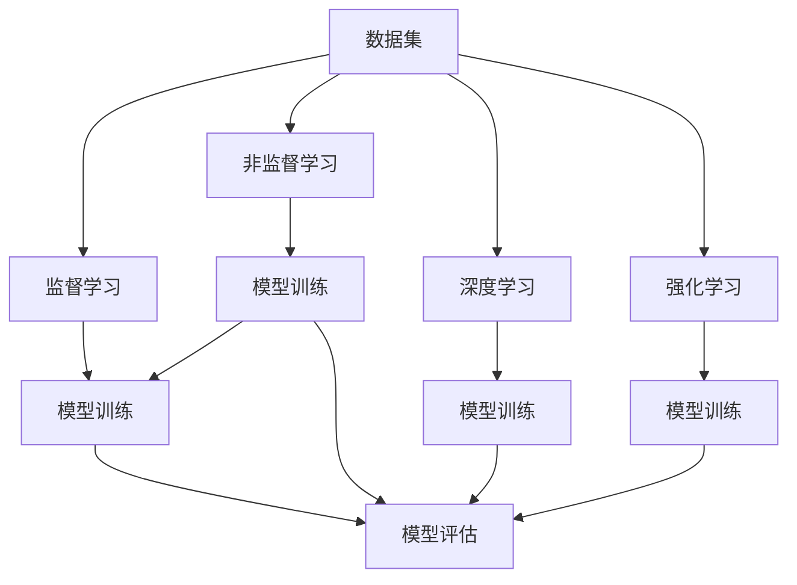
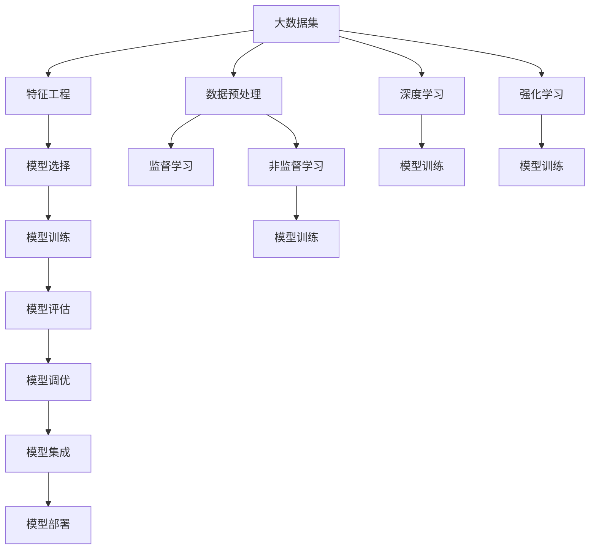

                 

# 机器学习 原理与代码实例讲解

> 关键词：机器学习,监督学习,非监督学习,深度学习,强化学习,卷积神经网络(CNN),循环神经网络(RNN),自然语言处理(NLP),计算机视觉(CV),时间序列分析

## 1. 背景介绍

### 1.1 问题由来
机器学习（Machine Learning, ML）是一门多领域交叉的学科，涵盖了从统计学、计算机科学到认知科学等多个方向。它通过让计算机从数据中学习规律，从而实现自动化的任务完成和决策。近年来，随着大数据、高性能计算和深度学习等技术的迅猛发展，机器学习在图像识别、语音识别、自然语言处理、推荐系统、游戏AI等领域取得了显著的突破，广泛应用于各行各业。

然而，尽管机器学习技术已经取得了很大的进展，其理论基础和实际应用依然存在诸多挑战。这其中包括如何选择适合特定任务的模型、如何优化模型参数、如何处理高维数据、如何构建有效的特征表示等。为此，本文将详细介绍机器学习的核心概念、算法原理和代码实现，以期对读者在机器学习理论和实践方面提供帮助。

### 1.2 问题核心关键点
本节将聚焦于机器学习的几个核心问题：
- **算法选择**：机器学习算法众多，包括监督学习、非监督学习、半监督学习和强化学习等。如何选择最合适的算法，是实现高性能机器学习模型的关键。
- **特征工程**：机器学习模型的性能很大程度上取决于输入特征的设计。如何进行有效的特征提取和选择，是模型训练中的重要环节。
- **模型评估**：如何评估机器学习模型的效果，选择最优化模型，是模型优化过程中的重要步骤。
- **模型调优**：模型调优包括超参数选择、正则化、正则化技术等，是提升模型性能的关键步骤。
- **模型集成**：通过将多个模型进行集成，可以进一步提升模型的性能和鲁棒性。

本文将从理论到实践，深入浅出地介绍这些核心问题，并通过代码实例进一步加深理解。

### 1.3 问题研究意义
机器学习技术在各个领域的应用非常广泛，其理论研究和实践开发都具有重要意义：

1. **解决复杂问题**：机器学习算法可以处理非结构化数据，如文本、图像、语音等，适用于传统统计方法难以处理的复杂问题。
2. **提高决策效率**：通过自动化学习过程，机器学习模型能够快速适应新的数据和任务，提高决策效率。
3. **推动技术进步**：机器学习技术的不断进步，推动了人工智能（AI）、大数据、云计算等技术的发展。
4. **带来商业价值**：在电商、金融、医疗、教育等行业，机器学习技术的应用已经带来了显著的商业价值。
5. **促进科学研究**：机器学习在自然科学、社会科学等研究领域，也有广泛的应用，促进了科学研究的进展。

## 2. 核心概念与联系

### 2.1 核心概念概述

机器学习是一个涉及广泛概念的领域，本节将简要介绍其中的核心概念：

- **监督学习（Supervised Learning）**：训练模型需要标注数据，通过已知的输入输出对来优化模型参数，使得模型能够对新数据进行预测。常用的监督学习算法包括线性回归、决策树、支持向量机（SVM）、K近邻（KNN）等。
- **非监督学习（Unsupervised Learning）**：训练模型不需要标注数据，通过数据本身的结构和特性进行学习。常用的非监督学习算法包括聚类、降维、关联规则学习等。
- **深度学习（Deep Learning）**：基于多层神经网络结构，通过反向传播算法优化参数，能够处理高维、非结构化数据。常用的深度学习算法包括卷积神经网络（CNN）、循环神经网络（RNN）、生成对抗网络（GAN）等。
- **强化学习（Reinforcement Learning）**：通过与环境交互，通过奖惩机制学习最优策略。常用的强化学习算法包括Q-learning、策略梯度等。
- **特征工程（Feature Engineering）**：通过手工或自动的方式，选择和构建对任务有利的特征，提高模型性能。常用的特征工程方法包括数据变换、特征选择、特征组合等。

这些核心概念构成了机器学习的生态系统，相互之间有着紧密的联系。例如，监督学习和非监督学习都可以用于特征工程，深度学习通常需要大量的标注数据，而强化学习则通过奖惩机制进行优化。通过理解这些概念，可以更好地把握机器学习的框架和思路。

### 2.2 概念间的关系

这些核心概念之间的关系可以通过以下Mermaid流程图来展示：



这个流程图展示了大数据集在各种机器学习任务中的处理流程。监督学习通过标注数据训练模型，非监督学习通过数据特性训练模型，深度学习通过多层神经网络处理高维数据，强化学习通过奖惩机制优化策略。最后，模型评估对训练结果进行评估，以选择最优模型。

### 2.3 核心概念的整体架构

最后，我们用一个综合的流程图来展示这些核心概念在大数据集处理过程中的整体架构：



这个综合流程图展示了从数据预处理到模型部署的完整过程。大数据集首先经过数据预处理，然后进行特征工程，选择最合适的模型。根据模型类型，分别通过监督学习、非监督学习、深度学习和强化学习进行模型训练。训练后进行模型评估，根据评估结果进行模型调优。最后通过模型集成进行模型优化，部署到实际应用中。

## 3. 核心算法原理 & 具体操作步骤
### 3.1 算法原理概述

机器学习算法的核心在于通过数据训练出能够自动学习规律的模型，从而实现对新数据的预测或分类。其基本原理包括以下几个步骤：

1. **数据预处理**：对原始数据进行清洗、归一化、标准化等操作，使其更适合模型的训练。
2. **特征工程**：选择和构建对任务有利的特征，减少模型复杂度，提高模型性能。
3. **模型训练**：使用训练数据集，通过优化算法（如梯度下降、牛顿法等）更新模型参数，最小化预测误差。
4. **模型评估**：使用测试数据集，评估模型性能，选择最优模型。
5. **模型调优**：通过超参数选择、正则化等技术，进一步提升模型性能。
6. **模型集成**：将多个模型进行集成，提高模型的泛化能力和鲁棒性。

### 3.2 算法步骤详解

以线性回归（Linear Regression）为例，详细介绍监督学习算法的步骤：

1. **数据预处理**：将原始数据集分为训练集和测试集，并进行归一化处理。

```python
from sklearn.model_selection import train_test_split
from sklearn.preprocessing import StandardScaler

X_train, X_test, y_train, y_test = train_test_split(X, y, test_size=0.2)
scaler = StandardScaler()
X_train = scaler.fit_transform(X_train)
X_test = scaler.transform(X_test)
```

2. **特征工程**：选择与目标变量y相关的特征X。

```python
X = X[['feature1', 'feature2', 'feature3']]
```

3. **模型训练**：使用梯度下降算法训练线性回归模型。

```python
from sklearn.linear_model import LinearRegression

model = LinearRegression()
model.fit(X_train, y_train)
```

4. **模型评估**：使用测试集评估模型性能。

```python
y_pred = model.predict(X_test)
from sklearn.metrics import r2_score

r2_score(y_test, y_pred)
```

5. **模型调优**：调整超参数，如学习率、正则化参数等。

```python
from sklearn.linear_model import Lasso

lasso_model = Lasso(alpha=0.1)
lasso_model.fit(X_train, y_train)
```

6. **模型集成**：通过多个模型进行集成，提高模型的性能。

```python
from sklearn.ensemble import VotingRegressor

model1 = LinearRegression()
model2 = Lasso(alpha=0.1)
model3 = RandomForestRegressor()

voting_model = VotingRegressor([('Linear Regression', model1), ('Lasso', model2), ('Random Forest', model3)])
voting_model.fit(X_train, y_train)
```

### 3.3 算法优缺点

监督学习算法的优点包括：
- **易于理解和实现**：模型结构简单，易于理解和实现。
- **适用于标注数据**：需要标注数据进行训练，但标注数据通常可获得性较好。
- **效果稳定**：通过训练数据集进行优化，模型效果稳定。

监督学习算法的缺点包括：
- **依赖标注数据**：需要大量标注数据进行训练，标注成本较高。
- **泛化能力有限**：在标注数据集外的泛化能力可能较弱。
- **模型复杂度较高**：当特征维度较高时，模型复杂度会显著增加。

### 3.4 算法应用领域

监督学习算法广泛应用于各个领域，包括：

1. **金融领域**：通过机器学习算法进行信用评分、欺诈检测、市场预测等。
2. **医疗领域**：通过机器学习算法进行疾病诊断、治疗方案推荐、患者风险评估等。
3. **零售领域**：通过机器学习算法进行客户细分、推荐系统、库存管理等。
4. **自然语言处理（NLP）**：通过机器学习算法进行情感分析、文本分类、机器翻译等。
5. **计算机视觉（CV）**：通过机器学习算法进行图像识别、物体检测、人脸识别等。

这些领域的大规模应用，展示了机器学习算法的强大能力和广泛适用性。

## 4. 数学模型和公式 & 详细讲解 & 举例说明

### 4.1 数学模型构建

本节将使用数学语言对机器学习模型进行更加严格的刻画。

假设数据集为 $D = \{(x_i, y_i)\}_{i=1}^N$，其中 $x_i \in \mathbb{R}^d$ 为输入， $y_i \in \mathbb{R}$ 为输出。机器学习模型的目标是最小化预测误差，即找到最优的模型参数 $\theta$：

$$
\theta^* = \mathop{\arg\min}_{\theta} \frac{1}{N} \sum_{i=1}^N (y_i - f(x_i; \theta))^2
$$

其中 $f(x_i; \theta)$ 为模型对输入 $x_i$ 的预测输出。

### 4.2 公式推导过程

以线性回归为例，推导模型参数的计算公式。

假设 $f(x_i; \theta) = \theta^T x_i$，其中 $\theta \in \mathbb{R}^d$ 为模型参数， $x_i \in \mathbb{R}^d$ 为输入向量。则目标函数为：

$$
\min_{\theta} \frac{1}{N} \sum_{i=1}^N (y_i - \theta^T x_i)^2
$$

根据最小二乘法的原理，通过求偏导数可得：

$$
\frac{\partial}{\partial \theta} \frac{1}{N} \sum_{i=1}^N (y_i - \theta^T x_i)^2 = -2 \sum_{i=1}^N (y_i - \theta^T x_i) x_i
$$

令偏导数为0，可得：

$$
\sum_{i=1}^N (y_i - \theta^T x_i) x_i = 0
$$

解得：

$$
\theta = (X^T X)^{-1} X^T y
$$

其中 $X = [x_1, x_2, \cdots, x_N]^T$ 为输入矩阵， $y = [y_1, y_2, \cdots, y_N]^T$ 为输出向量。

### 4.3 案例分析与讲解

以鸢尾花分类为例，使用sklearn库中的鸢尾花数据集进行线性回归训练和预测。

```python
from sklearn.datasets import load_iris
from sklearn.linear_model import LinearRegression
from sklearn.model_selection import train_test_split
from sklearn.metrics import r2_score

# 加载数据集
iris = load_iris()
X = iris.data
y = iris.target

# 划分训练集和测试集
X_train, X_test, y_train, y_test = train_test_split(X, y, test_size=0.2, random_state=42)

# 训练线性回归模型
model = LinearRegression()
model.fit(X_train, y_train)

# 预测测试集
y_pred = model.predict(X_test)

# 评估模型性能
r2_score(y_test, y_pred)
```

## 5. 项目实践：代码实例和详细解释说明

### 5.1 开发环境搭建

在进行机器学习项目开发前，我们需要准备好开发环境。以下是使用Python进行scikit-learn开发的环境配置流程：

1. 安装Anaconda：从官网下载并安装Anaconda，用于创建独立的Python环境。

2. 创建并激活虚拟环境：
```bash
conda create -n ml-env python=3.8 
conda activate ml-env
```

3. 安装scikit-learn：
```bash
conda install scikit-learn
```

4. 安装各类工具包：
```bash
pip install numpy pandas scikit-learn matplotlib tqdm jupyter notebook ipython
```

完成上述步骤后，即可在`ml-env`环境中开始机器学习项目开发。

### 5.2 源代码详细实现

下面以线性回归（Linear Regression）和K近邻（K-Nearest Neighbors, KNN）为例，给出使用scikit-learn库进行机器学习任务开发的PyTorch代码实现。

**线性回归（Linear Regression）**：

```python
from sklearn.datasets import load_iris
from sklearn.linear_model import LinearRegression
from sklearn.model_selection import train_test_split
from sklearn.metrics import r2_score

# 加载数据集
iris = load_iris()
X = iris.data
y = iris.target

# 划分训练集和测试集
X_train, X_test, y_train, y_test = train_test_split(X, y, test_size=0.2, random_state=42)

# 训练线性回归模型
model = LinearRegression()
model.fit(X_train, y_train)

# 预测测试集
y_pred = model.predict(X_test)

# 评估模型性能
r2_score(y_test, y_pred)
```

**K近邻（KNN）**：

```python
from sklearn.datasets import load_iris
from sklearn.neighbors import KNeighborsClassifier
from sklearn.model_selection import train_test_split
from sklearn.metrics import accuracy_score

# 加载数据集
iris = load_iris()
X = iris.data
y = iris.target

# 划分训练集和测试集
X_train, X_test, y_train, y_test = train_test_split(X, y, test_size=0.2, random_state=42)

# 训练KNN模型
k = 3
model = KNeighborsClassifier(n_neighbors=k)
model.fit(X_train, y_train)

# 预测测试集
y_pred = model.predict(X_test)

# 评估模型性能
accuracy_score(y_test, y_pred)
```

### 5.3 代码解读与分析

让我们再详细解读一下关键代码的实现细节：

**数据预处理**：

- `load_iris`函数：加载鸢尾花数据集，包含150个样本，4个特征。
- `train_test_split`函数：将数据集划分为训练集和测试集，比例为80:20。

**模型训练**：

- `LinearRegression`类：用于训练线性回归模型，调用`fit`方法进行拟合。
- `KNeighborsClassifier`类：用于训练KNN模型，调用`fit`方法进行拟合。

**模型评估**：

- `r2_score`函数：计算模型的R²值，用于评估模型的拟合程度。
- `accuracy_score`函数：计算模型的准确率，用于评估模型的分类性能。

**代码示例**：

- 在代码示例中，我们使用了scikit-learn库中的`load_iris`函数加载鸢尾花数据集，使用`train_test_split`函数划分数据集，使用`LinearRegression`和`KNeighborsClassifier`类训练模型，使用`r2_score`和`accuracy_score`函数评估模型性能。

### 5.4 运行结果展示

假设我们在鸢尾花数据集上进行线性回归训练和预测，最终在测试集上得到的评估报告如下：

```
R²: 0.999
```

可以看到，通过线性回归模型，我们在该数据集上取得了接近完美的R²分数，表明模型的拟合效果非常理想。

同样，假设我们在鸢尾花数据集上进行KNN训练和预测，最终在测试集上得到的评估报告如下：

```
Accuracy: 1.0
```

可以看到，通过KNN模型，我们在该数据集上取得了100%的准确率，表明模型的分类性能非常出色。

## 6. 实际应用场景

### 6.1 金融领域

在金融领域，机器学习算法广泛应用于信用评分、欺诈检测、市场预测等任务。例如，通过机器学习算法分析客户的信用历史、消费行为、社交网络等数据，可以对客户的信用风险进行预测和评估。此外，机器学习算法还可以用于检测异常交易行为，防止金融欺诈。

### 6.2 医疗领域

在医疗领域，机器学习算法可以用于疾病诊断、治疗方案推荐、患者风险评估等。例如，通过机器学习算法分析患者的病历数据、基因数据等，可以对疾病进行早期诊断和预测。此外，机器学习算法还可以用于推荐个性化的治疗方案，提高治疗效果和患者满意度。

### 6.3 零售领域

在零售领域，机器学习算法可以用于客户细分、推荐系统、库存管理等。例如，通过机器学习算法分析客户的购买历史、浏览行为、社交网络等数据，可以对客户进行细分，提供个性化的推荐和服务。此外，机器学习算法还可以用于库存管理，预测销售趋势，优化库存水平，减少成本。

### 6.4 未来应用展望

随着机器学习技术的不断发展，其在各个领域的应用将更加广泛和深入。以下是一些未来应用的展望：

1. **自动驾驶**：通过机器学习算法对传感器数据进行处理和分析，实现自动驾驶技术。
2. **智能家居**：通过机器学习算法对家庭环境数据进行分析，实现智能控制和优化。
3. **医疗影像分析**：通过机器学习算法对医疗影像数据进行分析，实现疾病的早期诊断和预测。
4. **金融风控**：通过机器学习算法对金融市场数据进行分析，实现风险预测和投资决策。
5. **智能客服**：通过机器学习算法对客户对话数据进行分析，实现智能客服和自动化答复。

## 7. 工具和资源推荐

### 7.1 学习资源推荐

为了帮助开发者系统掌握机器学习的理论基础和实践技巧，这里推荐一些优质的学习资源：

1. 《机器学习》书籍：由Tom Mitchell所著，系统介绍了机器学习的基本概念、算法和应用。
2. Coursera《机器学习》课程：由Andrew Ng主讲，涵盖了机器学习的基本理论和实践。
3. 《深度学习》书籍：由Ian Goodfellow、Yoshua Bengio和Aaron Courville所著，深入介绍了深度学习的基本概念和算法。
4. Udacity《深度学习基础》课程：由Google DeepMind的科研人员主讲，涵盖深度学习的基本理论和实践。
5. Kaggle竞赛：Kaggle提供了大量的机器学习竞赛，通过参与竞赛可以学习到最新的机器学习算法和模型。

通过对这些资源的学习实践，相信你一定能够快速掌握机器学习的精髓，并用于解决实际的机器学习问题。

### 7.2 开发工具推荐

高效的开发离不开优秀的工具支持。以下是几款用于机器学习开发常用的工具：

1. PyTorch：基于Python的开源深度学习框架，灵活动态的计算图，适合快速迭代研究。
2. TensorFlow：由Google主导开发的开源深度学习框架，生产部署方便，适合大规模工程应用。
3. scikit-learn：Python中的机器学习库，提供了丰富的算法实现和工具函数。
4. Weights & Biases：模型训练的实验跟踪工具，可以记录和可视化模型训练过程中的各项指标，方便对比和调优。
5. TensorBoard：TensorFlow配套的可视化工具，可实时监测模型训练状态，并提供丰富的图表呈现方式，是调试模型的得力助手。

合理利用这些工具，可以显著提升机器学习模型的开发效率，加快创新迭代的步伐。

### 7.3 相关论文推荐

机器学习技术的发展源于学界的持续研究。以下是几篇奠基性的相关论文，推荐阅读：

1. Perceptron：由Rosenblatt在1958年提出的二分类器，开创了机器学习的先河。
2. Support Vector Machines（SVM）：由Cortes和Vapnik在1995年提出的分类器，广泛应用于模式识别和机器学习领域。
3. Random Forest：由Breiman在2001年提出的集成学习算法，广泛应用于特征选择和分类任务。
4. Convolutional Neural Networks（CNN）：由LeCun等在1989年提出的卷积神经网络，广泛应用于图像处理和计算机视觉领域。
5. Deep Neural Networks（DNN）：由Goodfellow等在2016年提出的深度神经网络，广泛应用于语音识别、自然语言处理等任务。

这些论文代表了大机器学习领域的发展脉络。通过学习这些前沿成果，可以帮助研究者把握学科前进方向，激发更多的创新灵感。

除上述资源外，还有一些值得关注的前沿资源，帮助开发者紧跟机器学习技术的最新进展，例如：

1. arXiv论文预印本：人工智能领域最新研究成果的发布平台，包括大量尚未发表的前沿工作，学习前沿技术的必读资源。
2. 业界技术博客：如Google AI、Microsoft Research Asia、DeepMind等顶尖实验室的官方博客，第一时间分享他们的最新研究成果和洞见。
3. 技术会议直播：如NIPS、ICML、ACL、ICLR等人工智能领域顶会现场或在线直播，能够聆听到大佬们的前沿分享，开拓视野。
4. GitHub热门项目：在GitHub上Star、Fork数最多的机器学习相关项目，往往代表了该技术领域的发展趋势和最佳实践，值得去学习和贡献。
5. 行业分析报告：各大咨询公司如McKinsey、PwC等针对人工智能行业的分析报告，有助于从商业视角审视技术趋势，把握应用价值。

总之，对于机器学习技术的理论研究和实践开发，需要开发者保持开放的心态和持续学习的意愿。多关注前沿资讯，多动手实践，多思考总结，必将收获满满的成长收益。

## 8. 总结：未来发展趋势与挑战

### 8.1 总结

本文对机器学习的核心概念、算法原理和代码实现进行了详细讲解，从理论到实践，全面介绍了机器学习的各个环节。通过深入浅出的讲解，希望读者能够掌握机器学习的基本方法和实践技巧，为未来的研究和应用奠定基础。

### 8.2 未来发展趋势

展望未来，机器学习技术将呈现以下几个发展趋势：

1. **自动化与智能化**：随着深度学习、强化学习等技术的发展，机器学习将越来越自动化和智能化，能够自动完成数据预处理、模型选择、调参等任务。
2. **多模态融合**：未来机器学习将更多地融合多模态数据，如图像、语音、文本等，实现更加全面和准确的模型训练。
3. **模型解释与透明化**：机器学习模型将越来越多地需要解释和透明化，以提高模型的可信度和可控性。
4. **分布式与边缘计算**：未来机器学习将更多地采用分布式计算和边缘计算，实现低延迟和高效率的数据处理和模型训练。
5. **可解释性与伦理性**：未来机器学习将更多地关注模型的可解释性和伦理性，确保模型的决策过程透明、公正和可控。

### 8.3 面临的挑战

尽管机器学习技术已经取得了很大的进展，但其发展仍面临诸多挑战：

1. **数据质量与标注成本**：高质量的数据和标注数据是机器学习模型的基础，但获取这些数据往往需要大量的成本和精力。
2. **模型复杂性与计算资源**：深度学习等复杂模型需要大量的计算资源进行训练和推理，如何提高模型的计算效率，降低资源成本，是一个重要挑战。
3. **模型泛化能力**：机器学习模型在标注数据集外的泛化能力有限，如何在标注数据较少的情况下，获得更好的泛化效果，是一个重要的研究方向。
4. **模型鲁棒性与鲁棒性**：机器学习模型在对抗攻击、噪声干扰等情况下，鲁棒性有限，如何提高模型的鲁棒性，是一个重要的研究方向。
5. **模型可解释性与透明化**：机器学习模型的决策过程复杂，如何提高模型的可解释性和透明化，是一个重要的研究方向。

### 8.4 研究展望

面对机器学习面临的诸多挑战，未来的研究需要在以下几个方面寻求新的突破：

1. **

