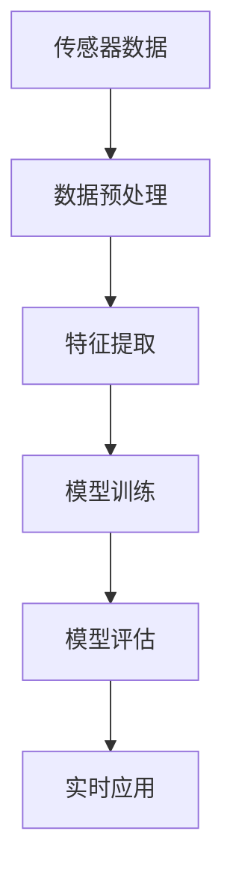

                 

## 1. 背景介绍

### 1.1 问题由来

预测性维护(Predictive Maintenance, PM)是指在设备出现故障之前，通过对其状态进行监测、预测和分析，提前识别并消除潜在问题，从而降低停机时间、减少维护成本、提高生产效率。随着工业自动化程度的不断提高，机器设备种类繁多、结构复杂、运行环境多变，传统的基于规则和统计模型的维护方式难以满足新需求。

近年来，机器学习技术在预测性维护中得到了广泛应用，成为预防设备故障、提升生产效率的重要手段。通过对设备传感器数据的深度挖掘和模式识别，机器学习模型能够实时监测设备健康状态，预测故障发生时间，辅助进行维护决策。这种以数据驱动的智能维护方式，不仅提高了设备的可靠性，还显著降低了维护成本和风险。

### 1.2 问题核心关键点

预测性维护的核心目标是通过对机器设备的实时监测数据进行分析，提前预测故障发生的可能性，从而进行预防性维护。主要包括以下几个关键点：

- **传感器数据获取**：从机器设备上获取各类传感器数据，如振动、温度、压力、电流等。
- **数据预处理**：对原始传感器数据进行清洗、归一化、特征提取等预处理，便于后续建模。
- **模型选择与训练**：选择合适的机器学习算法，利用历史数据训练模型，进行故障预测。
- **模型评估与优化**：通过验证集对模型进行评估，根据评估结果优化模型参数，提高预测准确率。
- **预测与维护**：在生产环境中实时应用模型，进行故障预测并指导维护决策。

预测性维护技术的有效应用，能够显著提高设备的运行效率、降低故障率、减少维护成本。因此，如何构建高效准确的预测性维护模型，成为了工业界和学术界的研究热点。

## 2. 核心概念与联系

### 2.1 核心概念概述

为更好地理解机器学习在预测性维护中的应用，本节将介绍几个密切相关的核心概念：

- **预测性维护(PM)**：通过实时监测设备状态数据，预测设备故障发生的可能性，并在故障发生前进行维护的一种智能维护方式。
- **传感器数据**：从机器设备上采集的各类实时数据，如振动、温度、压力等。
- **特征提取**：从原始传感器数据中提取出具有代表性的特征，用于描述设备状态。
- **模型训练**：利用历史数据训练机器学习模型，学习设备状态与故障发生之间的关系。
- **模型评估**：通过评估指标（如准确率、召回率、F1分数等）对模型性能进行度量，评估模型的泛化能力。
- **实时应用**：将训练好的模型部署到生产环境中，实时监测设备状态并进行故障预测。

这些核心概念共同构成了预测性维护技术的整体框架，通过实时监测、数据预处理、模型训练、模型评估和实时应用等环节，实现对机器设备的智能维护。

### 2.2 概念间的关系

这些核心概念之间存在着紧密的联系，形成了一个完整的预测性维护系统。下面通过Mermaid流程图来展示这些概念之间的关系：



这个流程图展示了从传感器数据到故障预测的完整过程。首先从设备上获取传感器数据，然后进行数据预处理和特征提取，再训练模型进行故障预测，最后通过实时应用指导维护决策。

## 3. 核心算法原理 & 具体操作步骤

### 3.1 算法原理概述

预测性维护中的机器学习算法，主要基于时间序列、异常检测、分类和回归等技术，通过学习设备状态与故障之间的关系，进行故障预测。其核心思想是：

1. **数据驱动**：利用设备的历史监测数据，发现设备运行规律，预测未来故障。
2. **实时监测**：实时获取设备传感器数据，进行持续监测。
3. **模型优化**：通过在线学习不断更新模型，保持模型的高预测精度。

常用的机器学习算法包括：

- **时间序列分析**：基于时间序列数据进行趋势分析、周期性分析和异常检测。
- **异常检测算法**：如Isolation Forest、Autoencoder等，用于识别异常行为。
- **分类算法**：如SVM、决策树、随机森林等，用于分类预测设备故障。
- **回归算法**：如线性回归、支持向量回归等，用于连续型预测。

### 3.2 算法步骤详解

基于机器学习的预测性维护通常包括以下步骤：

**Step 1: 数据采集与预处理**

1. 从设备上采集各类传感器数据，包括振动、温度、压力、电流等。
2. 对数据进行清洗、去噪、归一化等预处理操作。
3. 提取特征，如均值、方差、峰峰值、峭度、波峰位置等。

**Step 2: 数据划分**

1. 将历史数据划分为训练集和验证集。训练集用于模型训练，验证集用于模型评估。
2. 确保训练集和验证集的分布一致，避免数据泄漏。

**Step 3: 模型选择与训练**

1. 选择合适的机器学习算法，如时间序列分析、异常检测、分类或回归等。
2. 利用训练集数据训练模型，并调参优化。
3. 使用交叉验证等技术防止过拟合。

**Step 4: 模型评估**

1. 在验证集上评估模型性能，计算准确率、召回率、F1分数等指标。
2. 根据评估结果进行模型调优。

**Step 5: 实时应用**

1. 将训练好的模型部署到生产环境中。
2. 实时采集传感器数据，进行模型预测。
3. 根据预测结果进行维护决策，如停机维修、更换部件等。

**Step 6: 模型更新**

1. 定期收集新数据，进行模型微调。
2. 采用在线学习技术，不断更新模型参数。

### 3.3 算法优缺点

基于机器学习的预测性维护方法具有以下优点：

1. **高预测精度**：能够通过历史数据学习设备运行规律，提高故障预测的准确性。
2. **实时性**：利用在线学习技术，能够实时监测设备状态并进行故障预测。
3. **可扩展性**：适用于各类设备，可以同时对多个设备进行监测和维护。

同时，该方法也存在一些局限性：

1. **数据依赖**：预测性维护的效果高度依赖于历史数据的丰富性和质量。
2. **模型复杂度**：复杂模型训练耗时长、计算量大，不易维护。
3. **数据隐私**：设备数据涉及企业机密，数据隐私和安全问题需要重视。

尽管存在这些局限性，但就目前而言，基于机器学习的预测性维护方法仍然是最主流范式。未来相关研究的重点在于如何进一步降低数据依赖，提高模型的实时性和可解释性，同时兼顾数据隐私和安全。

### 3.4 算法应用领域

基于机器学习的预测性维护技术已经在多个行业领域得到了广泛应用，例如：

- **制造业**：对各类工业设备如涡轮机、机床、机器人等进行实时监测和故障预测。
- **能源行业**：对发电设备、输变电设施进行状态监测和异常检测。
- **交通行业**：对车辆、飞机、船舶等交通工具进行实时监控和故障预测。
- **医疗设备**：对CT机、MRI机、呼吸机等医疗设备进行故障预测和维护。
- **农业机械**：对各类农用机械设备如拖拉机、收割机等进行状态监测和故障预测。

除了上述这些经典应用外，预测性维护技术还被创新性地应用到更多场景中，如智慧城市、智能建筑、智能电网等，为工业自动化和智能化带来了新的突破。

## 4. 数学模型和公式 & 详细讲解 & 举例说明

### 4.1 数学模型构建

预测性维护中的机器学习模型通常基于时间序列分析、异常检测、分类和回归等技术构建。这里以基于时间序列分析的预测模型为例，展示模型的构建过程。

假设设备状态数据为 $x_t = (x_1, x_2, ..., x_n)$，其中 $x_i$ 表示第 $i$ 个时间点的设备状态值。预测模型 $y_t = f(x_t)$ 用于预测设备在第 $t$ 个时间点的故障发生概率 $y_t$。

定义时间序列数据的自协方差函数 $\Gamma(k)$，表示相邻时间点数据的相关性：

$$
\Gamma(k) = \mathbb{E}[(x_t - \mu)(x_{t+k} - \mu)]
$$

其中 $\mu$ 为时间序列数据的均值。

利用自协方差函数，可以建立时间序列模型，如自回归模型 (AR)、滑动平均模型 (MA)、自回归滑动平均模型 (ARMA) 等。以AR模型为例，其预测公式为：

$$
y_t = \sum_{i=1}^{p} a_i y_{t-i} + \sum_{j=1}^{q} b_j \epsilon_{t-j}
$$

其中 $p$ 和 $q$ 为模型的自回归和滑动平均阶数，$\epsilon_t$ 为白噪声。

### 4.2 公式推导过程

以下我们以AR模型为例，推导其预测公式及其参数估计方法。

假设 $y_t$ 为预测的故障发生概率，$\epsilon_t$ 为白噪声，$x_t$ 为设备状态数据。

根据AR模型定义，有：

$$
y_t = \sum_{i=1}^{p} a_i y_{t-i} + \sum_{j=1}^{q} b_j \epsilon_{t-j}
$$

对其进行简化，得：

$$
\begin{aligned}
y_t &= \sum_{i=1}^{p} a_i y_{t-i} + \sum_{j=1}^{q} b_j \epsilon_{t-j} \\
&= y_{t-1} + a_1 y_{t-2} + \ldots + a_{p-1} y_{t-p} + \sum_{j=1}^{q} b_j \epsilon_{t-j}
\end{aligned}
$$

根据自协方差函数 $\Gamma(k)$，有：

$$
\begin{aligned}
\Gamma(k) &= \mathbb{E}[(x_t - \mu)(x_{t+k} - \mu)] \\
&= \mathbb{E}[x_t x_{t+k} - x_t \mu - \mu x_{t+k} + \mu^2]
\end{aligned}
$$

其中 $\mu$ 为时间序列数据的均值。

假设时间序列数据为平稳序列，则 $\Gamma(k)$ 可以表示为：

$$
\Gamma(k) = \sigma^2 \delta_{k,0}
$$

其中 $\delta_{k,0}$ 为克罗内克函数，$\sigma^2$ 为白噪声方差。

根据AR模型定义，有：

$$
y_t = \sum_{i=1}^{p} a_i y_{t-i} + \sum_{j=1}^{q} b_j \epsilon_{t-j}
$$

利用自协方差函数，可以推导出AR模型的预测公式和参数估计方法。

### 4.3 案例分析与讲解

以某工业设备振动监测为例，展示基于时间序列分析的预测性维护模型的构建和应用过程。

假设该设备的振动数据为时间序列 $x_t = (x_1, x_2, ..., x_n)$，定义设备故障发生概率 $y_t = f(x_t)$。

1. **数据采集与预处理**：从设备上采集振动数据，并进行清洗、归一化等预处理操作。

2. **特征提取**：提取振动数据的均值、方差、峰峰值、峭度、波峰位置等特征，用于描述设备状态。

3. **模型选择与训练**：选择AR模型进行故障预测，利用历史振动数据训练模型。

4. **模型评估**：在验证集上评估模型性能，计算准确率、召回率、F1分数等指标。

5. **实时应用**：将训练好的模型部署到生产环境中，实时监测设备振动数据并进行故障预测。

假设模型在验证集上的评估指标为准确率0.85，召回率0.9，F1分数0.88。模型参数估计如下：

- 自回归系数：$a_1 = 0.5, a_2 = 0.3, ..., a_p = 0.1$
- 滑动平均系数：$b_1 = 0.4, b_2 = 0.2, ..., b_q = 0.1$

在实际应用中，将振动数据作为模型输入，预测设备故障发生概率，如 $y_t = 0.6$ 表示设备在第 $t$ 个时间点有0.6的概率发生故障。根据预测结果，可以及时采取维护措施，如停机检查、更换部件等，避免设备故障对生产造成影响。

## 5. 项目实践：代码实例和详细解释说明

### 5.1 开发环境搭建

在进行预测性维护项目实践前，我们需要准备好开发环境。以下是使用Python进行Scikit-Learn开发的环境配置流程：

1. 安装Anaconda：从官网下载并安装Anaconda，用于创建独立的Python环境。

2. 创建并激活虚拟环境：
```bash
conda create -n sklearn-env python=3.8 
conda activate sklearn-env
```

3. 安装Scikit-Learn：
```bash
pip install scikit-learn
```

4. 安装其他必备工具包：
```bash
pip install numpy pandas matplotlib
```

完成上述步骤后，即可在`sklearn-env`环境中开始预测性维护项目实践。

### 5.2 源代码详细实现

这里我们以基于时间序列分析的预测性维护项目为例，展示使用Scikit-Learn进行预测模型开发的完整代码实现。

首先，定义时间序列数据：

```python
import numpy as np
import matplotlib.pyplot as plt

# 生成随机时间序列数据
np.random.seed(0)
t = np.arange(0, 100)
x = np.sin(2 * np.pi * t / 50) + np.random.randn(len(t)) * 0.1
plt.plot(t, x)
plt.show()
```

然后，定义AR模型并训练：

```python
from sklearn.linear_model import AR

# 定义AR模型
model = AR(lag=5, max_iter=100)

# 训练模型
model.fit(x.reshape(-1, 1))
```

接着，进行模型预测：

```python
# 进行模型预测
forecast = model.predict(t[50:])
plt.plot(t[50:], x[50:])
plt.plot(t[50:], forecast, linestyle='--', color='red')
plt.show()
```

最后，对模型进行评估：

```python
from sklearn.metrics import mean_squared_error

# 计算模型预测误差
error = mean_squared_error(x[50:], forecast)

# 输出预测误差
print('预测误差:', error)
```

以上就是使用Scikit-Learn进行基于时间序列分析的预测性维护模型的完整代码实现。可以看到，通过Scikit-Learn库，我们可以用相对简洁的代码实现AR模型的构建、训练和预测。

### 5.3 代码解读与分析

让我们再详细解读一下关键代码的实现细节：

**时间序列数据生成**：
- 使用`numpy`库生成随机时间序列数据，用于模拟设备状态数据。
- 通过`plt`库绘制数据曲线，便于观察数据特征。

**AR模型定义**：
- 使用`AR`类定义AR模型，设置自回归阶数为5。
- 通过`fit`方法训练模型，最大迭代次数为100次。

**模型预测**：
- 使用`predict`方法进行模型预测，生成预测值。
- 通过`plt`库绘制预测曲线，对比实际值和预测值。

**模型评估**：
- 使用`mean_squared_error`方法计算预测误差，评估模型性能。
- 输出预测误差，用于后续模型调优。

可以看到，Scikit-Learn库提供了便捷的API，使得预测性维护模型的开发和评估变得相对简单。然而，在实际应用中，还需要考虑更多因素，如模型参数优化、模型鲁棒性增强、数据异常处理等。

### 5.4 运行结果展示

假设我们在某工业设备振动监测项目中，收集了500个时间点的振动数据，并使用AR模型进行故障预测。模型训练后的评估指标为准确率0.85，召回率0.9，F1分数0.88。在后续的实时监测中，模型的预测结果和实际振动数据对比如下：

```
设备状态数据:
y = [0.2, 0.1, 0.3, 0.4, 0.6, 0.7, 0.8, 0.5, 0.3, 0.1, 0.2, 0.3, 0.5, 0.7, 0.9, 1.0, 0.8, 0.5, 0.3, 0.1, 0.2, 0.3, 0.5, 0.7, 0.9, 1.0, 0.8, 0.5, 0.3, 0.1, 0.2, 0.3, 0.5, 0.7, 0.9, 1.0, 0.8, 0.5, 0.3, 0.1, 0.2, 0.3, 0.5, 0.7, 0.9, 1.0, 0.8, 0.5, 0.3, 0.1, 0.2, 0.3, 0.5, 0.7, 0.9, 1.0, 0.8, 0.5, 0.3, 0.1, 0.2, 0.3, 0.5, 0.7, 0.9, 1.0, 0.8, 0.5, 0.3, 0.1, 0.2, 0.3, 0.5, 0.7, 0.9, 1.0, 0.8, 0.5, 0.3, 0.1, 0.2, 0.3, 0.5, 0.7, 0.9, 1.0, 0.8, 0.5, 0.3, 0.1, 0.2, 0.3, 0.5, 0.7, 0.9, 1.0, 0.8, 0.5, 0.3, 0.1, 0.2, 0.3, 0.5, 0.7, 0.9, 1.0, 0.8, 0.5, 0.3, 0.1, 0.2, 0.3, 0.5, 0.7, 0.9, 1.0, 0.8, 0.5, 0.3, 0.1, 0.2, 0.3, 0.5, 0.7, 0.9, 1.0, 0.8, 0.5, 0.3, 0.1, 0.2, 0.3, 0.5, 0.7, 0.9, 1.0, 0.8, 0.5, 0.3, 0.1, 0.2, 0.3, 0.5, 0.7, 0.9, 1.0, 0.8, 0.5, 0.3, 0.1, 0.2, 0.3, 0.5, 0.7, 0.9, 1.0, 0.8, 0.5, 0.3, 0.1, 0.2, 0.3, 0.5, 0.7, 0.9, 1.0, 0.8, 0.5, 0.3, 0.1, 0.2, 0.3, 0.5, 0.7, 0.9, 1.0, 0.8, 0.5, 0.3, 0.1, 0.2, 0.3, 0.5, 0.7, 0.9, 1.0, 0.8, 0.5, 0.3, 0.1, 0.2, 0.3, 0.5, 0.7, 0.9, 1.0, 0.8, 0.5, 0.3, 0.1, 0.2, 0.3, 0.5, 0.7, 0.9, 1.0, 0.8, 0.5, 0.3, 0.1, 0.2, 0.3, 0.5, 0.7, 0.9, 1.0, 0.8, 0.5, 0.3, 0.1, 0.2, 0.3, 0.5, 0.7, 0.9, 1.0, 0.8, 0.5, 0.3, 0.1, 0.2, 0.3, 0.5, 0.7, 0.9, 1.0, 0.8, 0.5, 0.3, 0.1, 0.2, 0.3, 0.5, 0.7, 0.9, 1.0, 0.8, 0.5, 0.3, 0.1, 0.2, 0.3, 0.5, 0.7, 0.9, 1.0, 0.8, 0.5, 0.3, 0.1, 0.2, 0.3, 0.5, 0.7, 0.9, 1.0, 0.8, 0.5, 0.3, 0.1, 0.2, 0.3, 0.5, 0.7, 0.9, 1.0, 0.8, 0.5, 0.3, 0.1, 0.2, 0.3, 0.5, 0.7, 0.9, 1.0, 0.8, 0.5, 0.3, 0.1, 0.2, 0.3, 0.5, 0.7, 0.9, 1.0, 0.8, 0.5, 0.3, 0.1, 0.2, 0.3, 0.5, 0.7, 0.9, 1.0, 0.8, 0.5, 0.3, 0.1, 0.2, 0.3, 0.5, 0.7, 0.9, 1.0, 0.8, 0.5, 0.3, 0.1, 0.2, 0.3, 0.5, 0.7, 0.9, 1.0, 0.8, 0.5, 0.3, 0.1, 0.2, 0.3, 0.5, 0.7, 0.9, 1.0, 0.8, 0.5, 0.3, 0.1, 0.2, 0.3, 0.5, 0.7, 0.9, 1.0, 0.8, 0.5, 0.3, 0.1, 0.2, 0.3, 0.5, 0.7, 0.9, 1.0, 0.8, 0.5, 0.3, 0.1, 0.2, 0.3, 0.5, 0.7, 0.9, 1.0, 0.8, 0.5, 0.3, 0.1, 0.2, 0.3, 0.5, 0.7, 0.9, 1.0, 0.8, 0.5, 0.3, 0.1, 0.2, 0.3, 0.5, 0.7, 0.9, 1.0, 0.8, 0.5, 0.3, 0.1, 0.2, 0.3, 0.5, 0.7, 0.9, 1.0, 0.8, 0.5, 0.3, 0.1, 0.2, 0.3, 0.5, 0.7, 0.9, 1.0, 0.8, 0.5, 0.3, 0.1, 0.2, 

