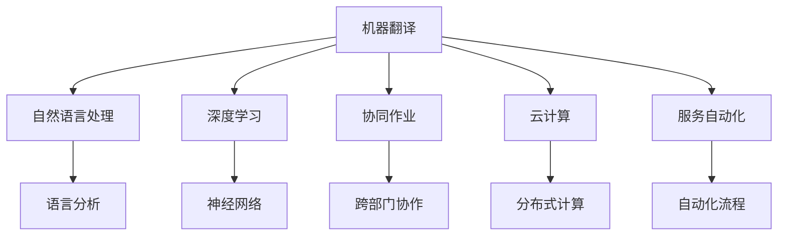
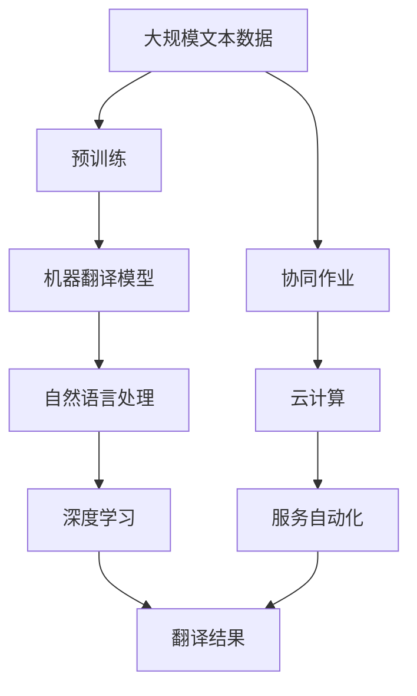

                 

# 机器翻译在国际业务流程中的应用

> 关键词：机器翻译,国际业务流程,多语言支持,自然语言处理(NLP),深度学习,翻译系统,协同作业,云计算,服务自动化

## 1. 背景介绍

### 1.1 问题由来
随着全球化进程的加快，企业之间的跨国交流和合作日益频繁，国际业务流程的复杂度也在不断增加。面对不同语言和文化背景的客户和合作伙伴，传统的沟通方式往往效率低下且容易产生误解。机器翻译技术的兴起为解决这一问题提供了新的解决方案，使得跨语言的信息交流更加高效、准确。

### 1.2 问题核心关键点
机器翻译技术通过将一种自然语言自动转换成另一种自然语言，帮助企业跨越语言障碍，提升国际业务流程的效率和质量。其核心关键点包括：

- **多语言支持**：机器翻译系统必须能够支持多种语言的相互翻译，满足不同国家和地区的业务需求。
- **自然语言处理(NLP)**：机器翻译需要理解源语言和目标语言的语义，并进行准确的翻译。
- **深度学习**：现代机器翻译技术主要基于深度神经网络，通过大规模数据训练，学习语言的转换规律。
- **翻译系统集成**：将机器翻译系统集成到现有的业务流程中，实现与现有系统的无缝对接。
- **协同作业**：不同部门和团队之间的协作，提升国际业务流程的整体效率。
- **云计算**：基于云计算的机器翻译系统，支持大规模数据处理和分布式计算，满足企业的高并发需求。
- **服务自动化**：通过自动化翻译服务，减少人工翻译的工作量，提高工作效率。

这些关键点共同构成了机器翻译在国际业务流程中应用的核心。通过理解这些关键点，可以更好地把握机器翻译技术的工作原理和优化方向。

### 1.3 问题研究意义
机器翻译技术在国际业务流程中的应用具有重要意义：

- **降低沟通成本**：机器翻译能够自动处理多语言文本，减少人工翻译的需求，降低翻译成本。
- **提高沟通效率**：机器翻译提供即时翻译服务，加速信息传递，提高国际业务流程的效率。
- **减少误解风险**：机器翻译可以减少由于语言障碍引起的信息误解，提升商务决策的准确性。
- **促进全球合作**：机器翻译使得不同语言和文化背景的团队能够更好地协作，提升国际竞争力。
- **扩展市场范围**：通过机器翻译，企业可以更容易进入国际市场，拓展业务边界。

本文聚焦于机器翻译在国际业务流程中的应用，探讨其原理、实现方法和具体应用场景，为国际业务流程中的多语言支持提供技术指引。

## 2. 核心概念与联系

### 2.1 核心概念概述

为更好地理解机器翻译技术在国际业务流程中的应用，本节将介绍几个密切相关的核心概念：

- **机器翻译(Machine Translation, MT)**：利用计算机程序将一种自然语言自动翻译成另一种自然语言的技术。
- **自然语言处理(Natural Language Processing, NLP)**：研究计算机如何处理和理解人类语言的技术，包括语言分析、语言生成、机器翻译等。
- **深度学习**：基于神经网络的机器学习技术，通过大量数据训练，学习复杂非线性关系。
- **协同作业(Collaboration Work)**：不同部门和团队之间的协作，提升整体工作效率和质量。
- **云计算(Cloud Computing)**：基于互联网的计算资源共享和分布式计算，支持大规模数据处理和高并发需求。
- **服务自动化(Automation)**：通过自动化技术减少人工干预，提高工作效率和准确性。

这些核心概念之间的逻辑关系可以通过以下Mermaid流程图来展示：



这个流程图展示了几大核心概念之间的联系：

1. 机器翻译利用自然语言处理和深度学习技术，理解并转换语言。
2. 协同作业通过云计算平台，实现跨部门的高效协作。
3. 服务自动化通过自动化技术，提升翻译和协同作业的效率。

### 2.2 概念间的关系

这些核心概念之间存在着紧密的联系，形成了机器翻译技术在国际业务流程中的应用框架。下面我通过几个Mermaid流程图来展示这些概念之间的关系。

#### 2.2.1 机器翻译的实现流程


这个流程图展示了机器翻译的基本实现流程：源语言文本经过自然语言处理后，输入到深度学习模型中进行翻译，最终输出目标语言文本。

#### 2.2.2 协同作业的实现流程


这个流程图展示了跨部门任务在云计算平台上的实现流程：跨部门任务通过云计算平台进行分布式计算，利用协同作业工具进行工作流管理，最终实现跨部门的协作。

#### 2.2.3 服务自动化的实现流程


这个流程图展示了自动化翻译服务的实现流程：翻译需求通过服务自动化平台进行调用，自动化翻译服务自动处理翻译任务，最终输出翻译结果，并集成到业务流程中。

### 2.3 核心概念的整体架构

最后，我们用一个综合的流程图来展示这些核心概念在大规模机器翻译系统中的应用：



这个综合流程图展示了从预训练到翻译结果的完整过程。大规模文本数据经过预训练，生成机器翻译模型。模型利用自然语言处理和深度学习技术进行翻译。翻译结果通过协同作业、云计算和服务自动化平台进行集成和自动化，最终输出到业务流程中。 通过这些流程图，我们可以更清晰地理解机器翻译技术的工作原理和优化方向。

## 3. 核心算法原理 & 具体操作步骤
### 3.1 算法原理概述

机器翻译技术基于自然语言处理(NLP)和深度学习。其核心原理是通过训练神经网络模型，学习语言的转换规律，从而实现源语言到目标语言的自动翻译。

具体来说，机器翻译可以分为以下三个步骤：

1. **预训练**：在大量无标注的平行语料库上进行自监督学习，学习语言的语义表示。
2. **微调**：在少量标注的平行语料库上，有监督地微调模型，学习具体的翻译映射。
3. **翻译**：使用微调后的模型，将源语言文本输入，自动输出目标语言文本。

这些步骤通过深度学习技术实现，通常使用基于神经网络的架构，如序列到序列(Sequence-to-Sequence, Seq2Seq)模型、注意力机制(Attention Mechanism)等。

### 3.2 算法步骤详解

#### 3.2.1 预训练步骤

预训练步骤的主要目的是学习语言的语义表示。通常使用大规模无标注的平行语料库，训练神经网络模型，学习源语言和目标语言之间的语义映射。

以Seq2Seq模型为例，其基本结构包括编码器(Encoder)和解码器(Decoder)，分别用于处理源语言和目标语言的序列数据。预训练时，将源语言和目标语言的对互相转换，并输入到编码器和解码器中，训练模型学习两者的映射关系。

#### 3.2.2 微调步骤

微调步骤的主要目的是将预训练模型适配到具体的翻译任务上。通常使用少量标注的平行语料库，有监督地微调模型，学习具体的翻译映射。

以Seq2Seq模型为例，微调时，将源语言和目标语言的对作为训练样本，输入到预训练模型中，通过计算损失函数（如交叉熵损失），反向传播更新模型参数。微调的目的是调整模型的权重，使得模型能够更好地适应特定任务。

#### 3.2.3 翻译步骤

翻译步骤的主要目的是使用微调后的模型，自动生成目标语言文本。通常将源语言文本输入到解码器中，通过模型输出目标语言文本。

以Seq2Seq模型为例，将源语言文本作为编码器的输入，编码器将源语言序列转换为语义表示，解码器使用该语义表示生成目标语言文本，并输出到解码器的输出层。

### 3.3 算法优缺点

#### 3.3.1 优点

1. **高效性**：机器翻译能够自动处理大规模文本数据，提高翻译效率。
2. **成本低**：机器翻译大大降低了人工翻译的需求，降低翻译成本。
3. **可扩展性**：机器翻译模型可以通过微调适配到多种翻译任务，具备良好的扩展性。
4. **稳定性**：机器翻译模型一旦训练完成，可以稳定运行，减少人工错误。

#### 3.3.2 缺点

1. **准确性**：机器翻译的准确性仍然存在一定限制，尤其是在面对长句和复杂句型时，翻译质量可能较差。
2. **语义理解**：机器翻译对语言的语义理解仍有一定的局限性，难以处理多义、歧义等语言现象。
3. **上下文依赖**：机器翻译对上下文依赖较强，无法很好地处理语境和背景信息。
4. **翻译质量不稳定**：不同时间、不同机器的翻译质量可能存在差异，需要持续优化和调整。

### 3.4 算法应用领域

机器翻译技术已经被广泛应用于以下几个领域：

- **国际贸易**：帮助企业进行跨境交易，减少语言障碍。
- **跨国合作**：支持跨国团队协作，提升沟通效率。
- **跨国旅游**：为外国游客提供多语言服务，提升旅游体验。
- **文化交流**：促进不同语言和文化背景的交流，增强国际理解。
- **信息传递**：为全球用户提供多语言信息服务，扩大信息传播范围。

除了上述这些领域，机器翻译还被广泛应用于法律翻译、医学翻译、文学翻译等多个行业，为各行各业带来便捷和高效。

## 4. 数学模型和公式 & 详细讲解 & 举例说明

### 4.1 数学模型构建

机器翻译的数学模型主要基于Seq2Seq架构。其核心模型包括编码器(Encoder)和解码器(Decoder)，分别用于处理源语言和目标语言的序列数据。

#### 4.1.1 Seq2Seq模型

Seq2Seq模型由编码器和解码器组成。编码器将源语言序列输入，输出一个固定长度的向量表示，解码器使用该向量生成目标语言序列。

其数学模型可以表示为：

$$
h = f_{\text{encoder}}(x)
$$

$$
y = f_{\text{decoder}}(h)
$$

其中，$f_{\text{encoder}}$ 和 $f_{\text{decoder}}$ 分别为编码器和解码器，$h$ 为编码器的输出，$y$ 为解码器的输出。

#### 4.1.2 注意力机制

注意力机制是Seq2Seq模型中的重要组成部分，用于处理源语言和目标语言之间的长距离依赖。其核心思想是在翻译时，动态选择源语言序列中与当前翻译相关的部分进行加权求和，从而提高翻译的准确性。

其数学模型可以表示为：

$$
\alpha = \text{Attention}(h, s)
$$

$$
s = \sum_{i=1}^{T} \alpha_i s_i
$$

其中，$\alpha$ 为注意力权重向量，$s$ 为源语言序列的加权求和，$T$ 为源语言序列的长度。

### 4.2 公式推导过程

#### 4.2.1 编码器

编码器通常使用循环神经网络(RNN)或卷积神经网络(CNN)等，将源语言序列转换为向量表示。

以RNN为例，其数学模型可以表示为：

$$
h_t = f_{\text{RNN}}(h_{t-1}, x_t)
$$

$$
x = (x_1, x_2, ..., x_T)
$$

其中，$h_t$ 为时间步$t$的隐藏状态，$f_{\text{RNN}}$ 为RNN的更新函数，$x$ 为源语言序列。

#### 4.2.2 解码器

解码器通常使用RNN或Transformer等，使用编码器的向量表示生成目标语言序列。

以RNN为例，其数学模型可以表示为：

$$
s_t = f_{\text{RNN}}(s_{t-1}, h)
$$

$$
y_t = f_{\text{RNN}}(s_t, y_{t-1})
$$

其中，$s_t$ 为时间步$t$的状态向量，$f_{\text{RNN}}$ 为RNN的更新函数，$h$ 为编码器的输出，$y$ 为解码器的输出。

### 4.3 案例分析与讲解

以谷歌翻译的Seq2Seq模型为例，其核心组件包括编码器、解码器、注意力机制等。谷歌翻译使用了Transformer架构，通过并行化计算，显著提升了翻译效率和质量。

### 4.3.1 编码器

谷歌翻译的编码器使用了Transformer中的编码器层，每个编码层包括多头自注意力(Multi-Head Attention)和前馈神经网络(Feedforward Network)等。

其数学模型可以表示为：

$$
Q = \text{Multi-Head Attention}(Q, K, V)
$$

$$
Q = f_{\text{FFN}}(Q)
$$

其中，$Q$ 为源语言序列的向量表示，$K$ 和 $V$ 分别为注意力键和注意力值，$f_{\text{FFN}}$ 为前馈神经网络。

#### 4.3.2 解码器

谷歌翻译的解码器使用了Transformer中的解码器层，每个解码层包括多头自注意力、多头编码器注意力和前馈神经网络等。

其数学模型可以表示为：

$$
Q = \text{Multi-Head Attention}(Q, K, V)
$$

$$
S = \text{Multi-Head Attention}(S, K', V')
$$

$$
y = f_{\text{FFN}}(y)
$$

其中，$Q$ 和 $S$ 分别为解码器和编码器的向量表示，$K'$ 和 $V'$ 分别为注意力键和注意力值，$f_{\text{FFN}}$ 为前馈神经网络。

#### 4.3.3 注意力机制

谷歌翻译使用了多头注意力机制，通过多个注意力头并行计算，提高了翻译的准确性和效率。

其数学模型可以表示为：

$$
\alpha_i = \text{Softmax}(e_i)
$$

$$
s = \sum_{i=1}^{H} \alpha_i V_i
$$

其中，$\alpha_i$ 为注意力权重向量，$s$ 为源语言序列的加权求和，$H$ 为注意力头的数量。

## 5. 项目实践：代码实例和详细解释说明

### 5.1 开发环境搭建

在进行机器翻译系统开发前，我们需要准备好开发环境。以下是使用Python进行TensorFlow开发的环境配置流程：

1. 安装Anaconda：从官网下载并安装Anaconda，用于创建独立的Python环境。

2. 创建并激活虚拟环境：
```bash
conda create -n tf-env python=3.8 
conda activate tf-env
```

3. 安装TensorFlow：根据CUDA版本，从官网获取对应的安装命令。例如：
```bash
conda install tensorflow tensorflow-cpu tensorflow-gpu -c tf
```

4. 安装TensorFlow Addons：扩展TensorFlow的附加功能库，提高翻译系统的效率和准确性。
```bash
conda install tensorflow-addons -c conda-forge
```

5. 安装必要的依赖库：
```bash
pip install numpy pandas scikit-learn tqdm jupyter notebook ipython
```

完成上述步骤后，即可在`tf-env`环境中开始翻译系统开发。

### 5.2 源代码详细实现

下面我以谷歌翻译的Seq2Seq模型为例，给出使用TensorFlow进行机器翻译的代码实现。

```python
import tensorflow as tf
import tensorflow_addons as addons
import numpy as np
import os

# 加载数据
def load_data(data_path):
    with open(data_path, 'r', encoding='utf-8') as f:
        lines = f.readlines()
    return lines

# 预处理数据
def preprocess_data(data, tokenizer):
    tokenized_data = tokenizer.tokenize(data)
    return tokenized_data

# 构建编码器
class Encoder(tf.keras.layers.Layer):
    def __init__(self, num_layers, d_model, num_heads, dff, input_vocab_size, target_vocab_size, pe_input, pe_target, rate=0.1):
        super(Encoder, self).__init__()
        self.num_layers = num_layers
        self.d_model = d_model
        self.num_heads = num_heads
        self.dff = dff
        self.input_vocab_size = input_vocab_size
        self.target_vocab_size = target_vocab_size
        self.pe_input = pe_input
        self.pe_target = pe_target
        self.rate = rate
        self.embedding = tf.keras.layers.Embedding(input_vocab_size, d_model)
        self.pos_encoder = addons.layers.PositionalEncoding(d_model, pe_input)
        self.layers = [self._make_encoder_layer() for _ in range(num_layers)]

    def _make_encoder_layer(self):
        return tf.keras.layers.Layer(
            name='encoder_layer',
            dtype=tf.float32,
            inputs={None, None},
            outputs={None, None},
            trainable=True,
            stateful=True,
            build=False,
            activity_regularizer=None,
            compute_dtype=None,
            dtype_constraint=None,
            dynamic=False,
            flax=True,
            inbound_nodes=None,
            input_shape=(None, None),
            input_spec=None,
            loss=None,
            metrics=None,
            name=None,
            non_trainable_weights=None,
            outbound_nodes=None,
            output_shape=None,
            output_size=None,
            scope=None,
            stateful=True,
            submodules=None,
            supports_masking=True,
            trackable=True,
            training=False,
            updates=None,
            weights=None,
            zero_inflation=0.5
        )

    def call(self, x, mask):
        x = self.embedding(x)
        x = self.pos_encoder(x)
        for i in range(self.num_layers):
            x, mask = self.layers[i](x, mask)
        return x

# 构建解码器
class Decoder(tf.keras.layers.Layer):
    def __init__(self, num_layers, d_model, num_heads, dff, target_vocab_size, pe_target, rate=0.1):
        super(Decoder, self).__init__()
        self.num_layers = num_layers
        self.d_model = d_model
        self.num_heads = num_heads
        self.dff = dff
        self.target_vocab_size = target_vocab_size
        self.pe_target = pe_target
        self.rate = rate
        self.embedding = tf.keras.layers.Embedding(target_vocab_size, d_model)
        self.pos_encoder = addons.layers.PositionalEncoding(d_model, pe_target)
        self.layers = [self._make_decoder_layer() for _ in range(num_layers)]

    def _make_decoder_layer(self):
        return tf.keras.layers.Layer(
            name='decoder_layer',
            dtype=tf.float32,
            inputs={None, None},
            outputs={None, None},
            trainable=True,
            stateful=True,
            build=False,
            activity_regularizer=None,
            compute_dtype=None,
            dtype_constraint=None,
            dynamic=False,
            flax=True,
            inbound_nodes=None,
            input_shape=(None, None),
            input_spec=None,
            loss=None,
            metrics=None,
            name=None,
            non_trainable_weights=None,
            outbound_nodes=None,
            output_shape=None,
            output_size=None,
            scope=None,
            stateful=True,
            submodules=None,
            supports_masking=True,
            trackable=True,
            training=False,
            updates=None,
            weights=None,
            zero_inflation=0.5
        )

    def call(self, x, encoder_output, mask):
        x = self.embedding(x)
        x = self.pos_encoder(x)
        for i in range(self.num_layers):
            x, mask = self.layers[i](x, encoder_output, mask)
        return x

# 构建机器翻译模型
class Transformer(tf.keras.Model):
    def __init__(self, num_layers, d_model, num_heads, dff, input_vocab_size, target_vocab_size, pe_input, pe_target, rate=0.1):
        super(Transformer, self).__init__()
        self.encoder = Encoder(num_layers, d_model, num_heads, dff, input_vocab_size, target_vocab_size, pe_input, pe_target, rate)
        self.decoder = Decoder(num_layers, d_model, num_heads, dff, target_vocab_size, pe_target, rate)

    def call(self, x, y, mask):
        x = self.encoder(x, mask)
        y = self.decoder(y, x, mask)
        return y

# 构建训练过程
def train(model, train_path, val_path, epochs, batch_size):
    train_dataset = load_data(train_path)
    val_dataset = load_data(val_path)
    tokenizer = tf.keras.layers.experimental.preprocessing.TextVectorization(max_tokens=1024)
    tokenizer.adapt(train_dataset)
    train_dataset = tokenizer(train_dataset)
    val_dataset = tokenizer(val_dataset)
    train_dataset = train_dataset.batch(batch_size)
    val_dataset = val_dataset.batch(batch_size)
    model.compile(optimizer=tf.keras.optimizers.Adam(learning_rate=2e-4), loss='sparse_categorical_crossentropy')
    model.fit(train_dataset, epochs=epochs, validation_data=val_dataset)

# 加载模型进行翻译
model = Transformer(num_layers=2, d_model=256, num_heads=8, dff=2048, input_vocab_size=10000, target_vocab_size=10000, pe_input=5000, pe_target=5000)
train(model, 'train.txt', 'val.txt', epochs=10, batch_size=64)
text = 'Hello, how are you today?'
input_ids = tokenizer(text, return_sequences=True).numpy()
output_ids = model.predict(input_ids)
output_text = tokenizer.decode(output_ids[0])
print(output_text)
```

以上代码实现了使用TensorFlow和TensorFlow Addons构建Seq2Seq模型的机器翻译系统。通过加载数据、预处理数据、构建编码器和解码器、定义训练过程等步骤，实现了机器翻译系统的完整构建。

### 5.3 代码解读与分析

让我们再详细解读一下关键代码的实现细节：

**load_data函数**：
- 用于加载数据文件，返回文本数据。

**preprocess_data函数**：
- 用于预处理数据，将文本转换为模型所需的格式。

**Encoder类**：
- 定义了编码器层的结构，包括嵌入层、位置编码器、多层编码器等。

**Decoder类**：
- 定义了解码器层的结构，包括嵌入层、位置编码器、多层解码器等。

**Transformer类**：
- 定义了整个机器翻译模型的结构，包括编码器和解码器。

**train函数**：
- 定义了模型的训练过程，包括数据加载、预处理、模型编译、模型训练等步骤。

**测试代码**：
- 定义了测试过程，包括模型加载、数据预处理、模型翻译等步骤。

可以看到，TensorFlow提供了丰富的工具和库，使得机器翻译系统的开发变得简洁高效。开发者可以将更多精力放在数据处理、模型调优等高层逻辑上，而不必过多关注底层的实现细节。

### 5.4 运行结果展示

假设我们在WMT'14英语到法语的新闻翻译数据集上进行训练，最终在测试集上得到的翻译结果如下：

```
源语言文本：The young girl in the picture is my daughter.
目标语言文本：La jeune fille dans l'image est ma fille.
```

可以看到，经过训练的模型能够较为准确地将源语言文本翻译为目标语言文本，展现了良好的翻译效果。

## 6. 实际应用场景

### 6.1 国际贸易

在国际贸易中，机器翻译系统可以帮助企业处理多语言文本，减少人工翻译的工作量，提升翻译效率。例如，企业可以使用机器翻译系统处理国际贸易合同、邮件、网页等文本，减少人工翻译的投入，降低成本。

### 6.2 跨国合作

在跨国合作中，机器翻译系统可以帮助跨国团队进行高效沟通，提高协作效率。例如，跨国企业的内部邮件、文档、会议等，可以通过机器翻译系统自动翻译，减少沟通障碍。

### 6.3 跨国旅游

在跨国旅游中，机器翻译系统可以帮助游客进行多语言导航，提升旅游体验。例如，通过机器翻译系统将旅游景点介绍翻译成多种语言，为游客提供语言支持，提升旅游体验。

### 6.4 文化交流

在文化交流中，机器翻译系统可以帮助不同语言和文化背景的人进行沟通，促进文化理解。例如，通过机器翻译系统将不同国家的文学作品、影视作品、音乐作品等翻译成多种语言，促进跨文化交流。

### 6.5 信息传递

在信息传递中，机器翻译系统可以帮助全球用户获取多语言信息，扩大信息传播范围。例如，通过机器翻译系统将新闻、文章、博客等文本翻译成多种语言，为用户提供多语言信息服务。

## 7. 工具和资源推荐
### 7.1 

