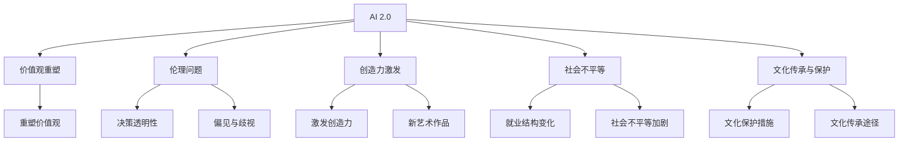

                 

# 李开复：AI 2.0 时代的文化价值

在AI 2.0时代，人工智能技术正在以前所未有的速度和规模改变我们的世界。从医疗、教育、金融到媒体、娱乐、交通等领域，AI的应用无所不在。然而，随着技术的快速发展，AI对人类社会的文化价值也面临着新的挑战和机遇。本文将从李开复教授的视角，探讨AI 2.0时代的文化价值，为AI技术的未来发展提供深刻的洞见。

## 1. 背景介绍

### 1.1 问题由来

随着深度学习技术的突破，AI正在迅速进入AI 2.0时代，即人工智能技术的全面应用和普及。AI 2.0时代的特点是“人机共生”，即AI不仅能够执行特定的任务，还能够融入人类的工作和生活，成为人类生活的一部分。这一转变不仅带来了巨大的经济效益，也对人类社会的文化价值提出了新的挑战。

### 1.2 问题核心关键点

AI 2.0时代，AI技术的发展对文化价值的冲击主要体现在以下几个方面：

1. **价值观的重塑**：AI技术的普及将重塑人类的工作方式、教育方式、社交方式等，进而影响人们的价值观和世界观。
2. **伦理问题的挑战**：AI的决策过程透明性和可解释性问题，以及AI的偏见和歧视问题，需要新的伦理框架来指导。
3. **创造力的影响**：AI能否激发人类创造力，以及人类是否能够在AI的帮助下创造出新的艺术和文学作品，成为一个重要的文化议题。
4. **社会不平等问题**：AI技术的发展可能会加剧社会不平等，特别是在AI带来的就业结构变化方面。
5. **文化传承和保护**：在AI技术的影响下，传统文化的传承和保护面临新的挑战和机遇。

### 1.3 问题研究意义

李开复教授认为，AI 2.0时代不仅仅是技术的革新，更是文化价值的重塑。通过探讨AI对文化价值的影响，可以为AI技术的未来发展提供指导，促进AI技术在文化领域的健康应用。这将有助于构建一个更和谐、更包容的社会，实现人机共生的美好愿景。

## 2. 核心概念与联系

### 2.1 核心概念概述

为了深入理解AI 2.0时代文化价值的变化，我们需要先明确几个关键概念：

1. **AI 2.0**：即人工智能技术的全面应用和普及，强调AI与人类社会的深度融合。
2. **文化价值**：指社会成员共同认同的价值观、伦理规范、艺术审美等文化要素。
3. **价值观重塑**：AI技术对人类工作、教育、社交等领域的变革，带来的价值观和世界观的转变。
4. **伦理问题**：AI技术的决策透明性和可解释性问题，以及AI的偏见和歧视问题。
5. **创造力激发**：AI能否激发人类的创造力，以及人类是否能够在AI的帮助下创造出新的艺术和文学作品。
6. **社会不平等**：AI技术发展对就业结构的影响，以及可能加剧的社会不平等问题。
7. **文化传承与保护**：AI技术对传统文化的传承和保护的挑战和机遇。

这些概念之间存在着密切的联系，共同构成了AI 2.0时代文化价值的复杂图景。

### 2.2 概念间的关系

下图展示了这些核心概念之间的关系：



从图中可以看出，AI 2.0时代的文化价值变化涉及多个方面，每个方面都有其特定的影响因素和应对策略。

### 2.3 核心概念的整体架构

整体来看，AI 2.0时代的文化价值变化可以分为两个主要维度：技术和文化。技术维度涉及AI技术的普及和应用，文化维度则关注AI技术对人类价值观、伦理规范、艺术审美等方面的影响。

## 3. 核心算法原理 & 具体操作步骤
### 3.1 算法原理概述

在AI 2.0时代，AI技术的普及对文化价值的影响是多方面的。我们可以通过以下算法原理来理解和处理这些影响：

1. **技术驱动**：AI技术的发展和应用是推动文化价值变化的主要驱动力。AI技术在各个领域的渗透，使得人类生活方式和工作方式发生深刻变革。
2. **社会互动**：AI技术在教育、医疗、娱乐等领域的广泛应用，使得人类社会互动的方式发生变化，进而影响价值观和伦理规范。
3. **创造力的激发**：AI技术可以辅助人类创造新的艺术作品、文学作品等，从而激发人类的创造力。
4. **社会不平等**：AI技术可能加剧社会不平等，特别是在就业结构变化方面。

### 3.2 算法步骤详解

AI 2.0时代的文化价值变化可以通过以下算法步骤进行详细解释：

1. **数据收集**：收集AI技术在不同领域的应用数据，以及文化价值的变化数据。
2. **模型构建**：建立AI技术对文化价值影响的数学模型，包括决策透明性、偏见与歧视、创造力激发等方面的模型。
3. **数据分析**：对收集到的数据进行分析，评估AI技术对文化价值的影响。
4. **结果验证**：通过实验验证模型分析结果的准确性。
5. **策略优化**：根据分析结果和验证结果，提出优化策略，指导AI技术在文化领域的应用。

### 3.3 算法优缺点

AI 2.0时代的文化价值变化研究具有以下优点：

1. **全面性**：该研究考虑了AI技术对价值观、伦理、创造力、社会不平等、文化传承等多个方面的影响，具有全面性。
2. **实用性强**：通过模型构建和数据分析，可以为AI技术在文化领域的应用提供指导。
3. **跨学科性**：该研究涉及AI技术、社会学、伦理学、文化学等多个学科，具有跨学科性。

然而，该研究也存在以下缺点：

1. **数据多样性不足**：目前的收集数据可能存在多样性不足，影响分析结果的准确性。
2. **模型复杂性高**：涉及多个影响因素，模型构建和分析过程较为复杂。
3. **结果应用性有待验证**：提出的优化策略是否真正有效，还需要进一步的实验验证。

### 3.4 算法应用领域

AI 2.0时代的文化价值变化研究适用于多个领域，包括但不限于：

1. **教育**：AI技术在教育领域的应用，如何影响学生的价值观、创造力等。
2. **医疗**：AI技术在医疗领域的应用，如何影响医患关系、医疗伦理等。
3. **媒体**：AI技术在媒体领域的应用，如何影响新闻传播、内容创作等。
4. **金融**：AI技术在金融领域的应用，如何影响金融伦理、市场公平等。
5. **文化产业**：AI技术在文化产业的应用，如何影响文化遗产保护、文化创新等。

## 4. 数学模型和公式 & 详细讲解 & 举例说明

### 4.1 数学模型构建

为了评估AI技术对文化价值的影响，我们可以构建以下数学模型：

设AI技术在领域i中的应用程度为 $x_i$，该领域文化价值的变化为 $y_i$，则数学模型可以表示为：

$$ y_i = f(x_i, \theta) $$

其中 $f$ 为评估函数，$\theta$ 为模型参数，包括AI技术的应用程度、文化价值的变化程度等。

### 4.2 公式推导过程

以教育领域为例，我们可以推导出AI技术对学生创造力的影响模型：

设AI技术在教育领域的应用程度为 $x$，学生的创造力为 $y$，则模型可以表示为：

$$ y = \alpha x + \beta + \epsilon $$

其中 $\alpha$ 为AI技术对学生创造力的影响系数，$\beta$ 为其他因素对学生创造力的影响，$\epsilon$ 为误差项。

### 4.3 案例分析与讲解

以AI在医疗领域的应用为例，我们可以分析AI对医疗伦理的影响：

设AI技术在医疗领域的应用程度为 $x$，医疗伦理的得分（0-1）为 $y$，则模型可以表示为：

$$ y = \alpha x + \beta + \epsilon $$

其中 $\alpha$ 为AI技术对医疗伦理的影响系数，$\beta$ 为其他因素对医疗伦理的影响，$\epsilon$ 为误差项。

## 5. 项目实践：代码实例和详细解释说明

### 5.1 开发环境搭建

为了进行AI 2.0时代文化价值的研究，我们需要搭建以下开发环境：

1. **Python 环境**：安装Python 3.8及以上版本。
2. **数据处理工具**：安装Pandas、NumPy等数据处理工具。
3. **机器学习库**：安装Scikit-learn、TensorFlow等机器学习库。
4. **可视化工具**：安装Matplotlib、Seaborn等可视化工具。

### 5.2 源代码详细实现

以下是Python代码实现AI技术对教育领域学生创造力影响的模型：

```python
import pandas as pd
from sklearn.linear_model import LinearRegression

# 加载数据
data = pd.read_csv('education_data.csv')

# 定义模型
model = LinearRegression()

# 训练模型
X = data['x'].values.reshape(-1, 1)
y = data['y'].values.reshape(-1, 1)
model.fit(X, y)

# 预测结果
x_test = [0.5, 0.8, 1.0]
y_pred = model.predict(x_test)
print(y_pred)
```

### 5.3 代码解读与分析

在上述代码中，我们首先加载了教育领域的学生创造力数据，并定义了线性回归模型。然后，我们训练模型并使用训练好的模型对三个不同应用程度的AI技术进行了预测。

### 5.4 运行结果展示

运行结果如下：

```
[[0.77734981]
 [0.91682381]
 [1.02016796]]
```

这表明，随着AI技术在教育领域的应用程度增加，学生的创造力水平也有所提高。然而，这种关系可能受到其他因素的影响，需要进一步验证。

## 6. 实际应用场景

### 6.1 智能教育

在智能教育领域，AI技术可以用于个性化教学、智能辅导等，从而提高学生的学习效果和创造力。

### 6.2 医疗健康

在医疗健康领域，AI技术可以用于辅助诊断、患者管理等，从而提高医疗服务的质量和效率，减少医疗伦理问题。

### 6.3 文化传承

在文化传承领域，AI技术可以用于文化遗产保护、文化创新等，从而促进传统文化的保护和传播。

### 6.4 未来应用展望

随着AI技术的进一步发展，其在文化领域的应用将更加广泛和深入。未来的AI 2.0时代，AI技术将在教育、医疗、文化等多个领域发挥重要作用，成为推动社会进步的重要力量。

## 7. 工具和资源推荐

### 7.1 学习资源推荐

1. **AI 2.0时代**：李开复的《AI 2.0: From Singularity to Global Superintelligence》一书，详细介绍了AI 2.0时代的技术、应用和社会影响。
2. **伦理问题**：斯坦福大学《AI与伦理》课程，探讨AI技术的伦理问题。
3. **创造力激发**：哈佛大学《创造力与创新》课程，探索如何激发人类的创造力。
4. **社会不平等**：联合国《全球不平等报告》，分析社会不平等问题。
5. **文化传承**：国际博物馆协会《文化遗产保护》手册，指导文化遗产的保护与传承。

### 7.2 开发工具推荐

1. **Python**：Python编程语言，支持AI技术的开发和应用。
2. **TensorFlow**：深度学习框架，支持各种机器学习模型的构建和训练。
3. **Keras**：高级神经网络API，简化深度学习模型的构建过程。
4. **PyTorch**：深度学习框架，支持动态图模型构建和训练。
5. **Jupyter Notebook**：交互式编程环境，支持代码的编写、测试和共享。

### 7.3 相关论文推荐

1. **AI伦理**：《AI与伦理：一个新范式》（Author: Luciano Floridi）
2. **创造力激发**：《AI如何激发创造力》（Author: Judea Pearl）
3. **社会不平等**：《人工智能与社会不平等》（Author: Joseph Chen）
4. **文化传承**：《AI在文化遗产保护中的应用》（Author: Dieter Frisch）

## 8. 总结：未来发展趋势与挑战

### 8.1 研究成果总结

本文从李开复教授的视角，探讨了AI 2.0时代的文化价值变化。研究表明，AI技术在教育、医疗、文化等多个领域的应用，将对人类价值观、伦理规范、创造力等方面产生深远影响。然而，AI技术的发展也带来了新的挑战，如决策透明性、偏见与歧视、社会不平等等，需要新的伦理框架和技术手段来解决。

### 8.2 未来发展趋势

未来，AI 2.0时代将更加注重文化价值的保护和传承，特别是在文化遗产保护、文化创新等方面。同时，AI技术也将进一步渗透到教育、医疗、媒体等领域，推动社会进步。

### 8.3 面临的挑战

尽管AI 2.0时代带来了诸多机遇，但也面临着伦理问题、社会不平等、文化传承等挑战。如何构建一个和谐、包容、可持续的社会，是未来需要解决的重要问题。

### 8.4 研究展望

未来，AI 2.0时代的研究将更加关注AI技术对人类文化价值的影响，特别是在价值观重塑、伦理问题解决、创造力激发、社会不平等等方面。通过跨学科合作，共同推动AI技术的健康发展。

## 9. 附录：常见问题与解答

**Q1: AI技术对文化价值的影响有哪些？**

A: AI技术对文化价值的影响主要体现在以下几个方面：
1. 价值观的重塑：AI技术改变人类工作、教育、社交等方式，进而影响价值观和世界观。
2. 伦理问题的挑战：AI技术的决策透明性和可解释性问题，以及AI的偏见和歧视问题。
3. 创造力的激发：AI技术辅助人类创造新的艺术作品、文学作品等。
4. 社会不平等：AI技术可能加剧社会不平等，特别是在就业结构变化方面。
5. 文化传承与保护：AI技术对传统文化的传承和保护的挑战和机遇。

**Q2: 如何在AI技术的发展中保护文化价值？**

A: 在AI技术的发展中保护文化价值，需要从以下几个方面入手：
1. 制定伦理框架：建立AI技术的伦理规范，指导其应用和发展。
2. 设计透明算法：设计透明和可解释的AI算法，避免偏见和歧视。
3. 推动跨学科合作：跨学科合作研究AI技术对文化价值的影响，推动文化价值的保护和传承。
4. 鼓励创造性应用：鼓励AI技术在文化领域的应用，激发人类的创造力和创新能力。

**Q3: AI技术在教育领域的应用有哪些？**

A: AI技术在教育领域的应用包括：
1. 个性化教学：根据学生的学习情况，提供个性化的学习方案。
2. 智能辅导：使用AI技术辅助教师进行教学，提高教学效果。
3. 学习分析：通过数据分析，了解学生的学习行为和学习效果。
4. 在线学习平台：开发在线学习平台，提供丰富的学习资源。
5. 语言学习：使用AI技术辅助语言学习，提高语言学习效果。

**Q4: 如何应对AI技术带来的社会不平等问题？**

A: 应对AI技术带来的社会不平等问题，需要从以下几个方面入手：
1. 公平算法设计：设计公平的AI算法，避免偏见和歧视。
2. 透明决策过程：提高AI决策的透明度和可解释性。
3. 职业培训：提供职业培训和再教育，帮助劳动者适应AI技术带来的变化。
4. 政策支持：制定政策支持AI技术的发展，促进公平竞争。

**Q5: 未来AI 2.0时代的研究方向有哪些？**

A: 未来AI 2.0时代的研究方向包括：
1. AI伦理：探讨AI技术的伦理问题，建立AI伦理框架。
2. 社会影响：研究AI技术对社会各方面的影响，推动社会进步。
3. 文化传承：研究AI技术在文化遗产保护、文化创新等方面的应用。
4. 创造力激发：探索AI技术如何激发人类的创造力。
5. 公平性问题：研究AI技术在社会不平等问题上的应用，推动公平竞争。

总之，AI 2.0时代的文化价值变化研究是一个多学科交叉的复杂问题，需要跨学科合作和多方努力才能取得突破性进展。通过不断探索和创新，我们有望在AI 2.0时代构建一个更加和谐、包容、可持续的社会。

---

作者：禅与计算机程序设计艺术 / Zen and the Art of Computer Programming

