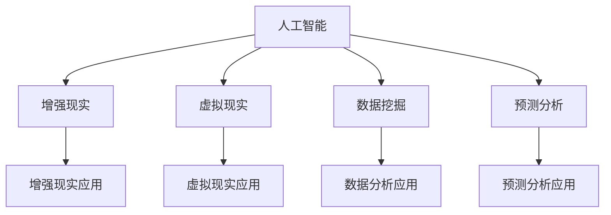
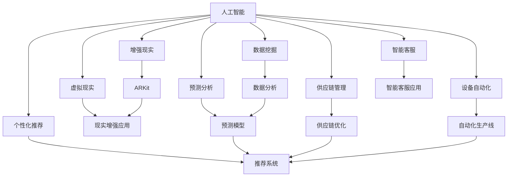

                 

## 1. 背景介绍

### 1.1 问题由来

人工智能(AI)技术的飞速发展，使得企业、科研机构、政府等各方面都意识到AI的巨大潜力。AI技术正在逐步渗透到各行各业，包括金融、医疗、教育、制造、农业等，推动社会的智能化和自动化进程。然而，尽管AI技术得到广泛应用，但其商业价值实现仍面临诸多挑战。

具体来说，人工智能应用的商业价值主要体现在以下几个方面：

1. **提升效率**：通过自动化、智能化等手段，降低人力成本，提高生产效率。
2. **优化决策**：利用数据分析和模型预测，优化决策流程，减少决策误差。
3. **增强用户体验**：通过个性化推荐、智能客服等手段，提升用户体验。
4. **发现新机会**：AI技术可以发现新的市场机会，推动业务创新。
5. **增强安全性**：通过图像识别、语音识别等技术，提高系统的安全性。

为了探讨AI技术在商业场景中的实际应用和价值，本文将重点分析苹果公司在人工智能应用中的商业价值。

### 1.2 问题核心关键点

苹果公司（Apple Inc.）是全球知名科技公司，其产品与服务深受全球消费者的喜爱。近年来，苹果公司积极布局AI技术，将其应用于产品设计、生产制造、客户服务等多个领域。本文将从以下几个方面探讨苹果AI应用的商业价值：

1. **AI技术在产品设计中的应用**：如Siri虚拟助手、增强现实（AR）技术等。
2. **AI技术在生产制造中的应用**：如供应链管理、设备自动化等。
3. **AI技术在客户服务中的应用**：如智能客服、个性化推荐等。
4. **AI技术在增强现实与虚拟现实中的应用**：如ARKit、现实增强应用等。
5. **AI技术在数据与分析中的应用**：如数据挖掘、预测分析等。

通过对这些方面的深入分析，本文将展示苹果AI应用的商业价值，并探讨其在不同领域的应用潜力。

## 2. 核心概念与联系

### 2.1 核心概念概述

在探讨苹果AI应用的商业价值之前，需要先了解以下几个核心概念：

1. **人工智能**：指通过计算机模拟人的智能行为，实现智能决策、认知和学习等能力的技术。
2. **增强现实**：结合虚拟与现实信息，增强用户对物理世界和数字世界的感知。
3. **虚拟现实**：通过计算机技术，创造出一个全新的三维环境，供用户交互。
4. **数据挖掘**：从大规模数据中提取有用信息，分析数据模式，支持决策。
5. **预测分析**：利用机器学习模型，预测未来趋势和行为。

这些概念构成了苹果AI应用的基石，在其商业价值实现中起到了重要作用。

### 2.2 概念间的关系

以下是这些核心概念之间的关系，可以通过一个简单的Mermaid流程图来展示：



这个流程图展示了人工智能技术与其他技术之间的联系和应用场景。

### 2.3 核心概念的整体架构

最后，我们用一个综合的流程图来展示这些核心概念在大语言模型微调过程中的整体架构：



这个综合流程图展示了人工智能技术在苹果不同应用场景中的应用，揭示了其商业价值实现的多样性。

## 3. 核心算法原理 & 具体操作步骤
### 3.1 算法原理概述

苹果公司AI应用的商业价值实现，主要基于以下几个核心算法原理：

1. **机器学习与深度学习**：利用算法模型，从数据中学习和提取模式，支持决策和预测。
2. **自然语言处理**：通过文本分析和理解，实现智能客服、个性化推荐等应用。
3. **计算机视觉**：通过图像和视频分析，实现人脸识别、智能监控等应用。
4. **语音识别与合成**：通过语音分析，实现语音助手、智能音响等应用。
5. **强化学习**：通过不断试错，优化决策策略，提升系统的自动化水平。

这些算法原理构成了苹果AI应用的基石，为其商业价值的实现提供了技术支持。

### 3.2 算法步骤详解

苹果AI应用的实现，通常遵循以下步骤：

1. **数据采集与预处理**：收集相关数据，并进行清洗、去重、标注等预处理操作。
2. **模型训练与优化**：选择适当的模型，进行训练和调参，优化模型性能。
3. **模型部署与集成**：将训练好的模型部署到生产环境中，并与其他系统进行集成。
4. **效果评估与优化**：对系统效果进行评估，根据反馈进行调整和优化。

这些步骤确保了苹果AI应用能够稳定、高效地运行，实现其商业价值。

### 3.3 算法优缺点

苹果AI应用的优势在于：

1. **强大的技术积累**：苹果拥有强大的技术团队和丰富的经验，能够快速实现和优化AI应用。
2. **广泛的应用场景**：苹果产品覆盖消费电子、智能家居等多个领域，AI应用有广泛的应用场景。
3. **高用户黏性**：苹果用户群体庞大且忠实，AI应用可以更好地满足用户需求，提升用户体验。

然而，苹果AI应用也面临一些挑战：

1. **数据隐私**：AI应用需要大量数据进行训练和优化，涉及用户隐私问题。
2. **计算资源消耗**：大规模模型训练和推理需要大量计算资源，增加了成本。
3. **模型解释性**：AI模型通常是“黑盒”系统，难以解释其决策过程，影响用户信任。

## 4. 数学模型和公式 & 详细讲解 & 举例说明

### 4.1 数学模型构建

在苹果AI应用的实现中，机器学习与深度学习模型是关键技术。以强化学习为例，其数学模型可以表示为：

$$
Q(s_t, a_t) = r_t + \gamma \max_a Q(s_{t+1}, a) \tag{1}
$$

其中，$s_t$ 表示当前状态，$a_t$ 表示当前行动，$r_t$ 表示当前奖励，$\gamma$ 表示折扣因子，$Q(s_{t+1}, a)$ 表示未来状态-行动的期望价值。

### 4.2 公式推导过程

公式(1)中的强化学习模型，可以通过迭代计算得到最优行动$a_t$。具体推导过程如下：

1. **初始化**：将状态$s_0$和行动$a_0$代入公式(1)，得到当前行动$a_t$。
2. **迭代计算**：不断更新状态$s_{t+1}$，计算$Q(s_{t+1}, a)$，直到满足终止条件。
3. **决策优化**：根据计算结果，选择最优行动$a_t$。

### 4.3 案例分析与讲解

以苹果智能客服应用为例，其数学模型可以表示为：

$$
P(y|x) = \frac{e^{\log P(x|y) + \log P(y)}}{\sum_{y'} e^{\log P(x|y') + \log P(y')}} \tag{2}
$$

其中，$x$ 表示用户输入的文本，$y$ 表示机器输出的回答。公式(2)展示了自然语言处理中常用的条件概率模型，通过训练和优化，可以实现智能客服的实时响应。

## 5. 项目实践：代码实例和详细解释说明

### 5.1 开发环境搭建

要进行苹果AI应用的开发，首先需要搭建好开发环境。以下是Python环境下开发环境搭建的步骤：

1. **安装Python**：从官网下载并安装最新版本的Python。
2. **安装相关库**：安装必要的库，如TensorFlow、PyTorch、OpenCV等。
3. **配置环境变量**：设置环境变量，确保Python能够找到所需的库和工具。

### 5.2 源代码详细实现

下面以苹果智能客服应用为例，展示其实现过程。

首先，需要定义输入和输出的文本格式：

```python
class InputOutput:
    def __init__(self, input_text, output_text):
        self.input_text = input_text
        self.output_text = output_text
```

然后，使用TensorFlow构建条件概率模型：

```python
import tensorflow as tf

class ConditionalProbabilityModel(tf.keras.Model):
    def __init__(self, embedding_dim=64, num_classes=10):
        super(ConditionalProbabilityModel, self).__init__()
        self.embedding = tf.keras.layers.Embedding(input_dim=vocab_size, output_dim=embedding_dim)
        self.lstm = tf.keras.layers.LSTM(units=64)
        self.dense = tf.keras.layers.Dense(units=num_classes)

    def call(self, inputs):
        x = self.embedding(inputs)
        x = self.lstm(x)
        logits = self.dense(x)
        probs = tf.nn.softmax(logits, axis=-1)
        return probs
```

最后，使用训练数据进行模型训练和评估：

```python
model = ConditionalProbabilityModel()

# 训练数据
train_data = [input_text, output_text]

# 编译模型
model.compile(optimizer='adam', loss='categorical_crossentropy', metrics=['accuracy'])

# 训练模型
model.fit(train_data, epochs=10, validation_data=(test_data, test_labels))

# 评估模型
test_loss, test_acc = model.evaluate(test_data, test_labels)
print('Test loss:', test_loss)
print('Test accuracy:', test_acc)
```

通过以上代码，可以训练一个简单的条件概率模型，用于预测智能客服的回答。

### 5.3 代码解读与分析

代码实现过程主要包括以下几个步骤：

1. **定义输入输出格式**：将用户输入和机器输出的文本进行格式处理。
2. **构建模型**：使用TensorFlow搭建条件概率模型，包括嵌入层、LSTM层和全连接层。
3. **编译模型**：设置优化器和损失函数，并定义评估指标。
4. **训练模型**：使用训练数据进行模型训练，并定期评估模型效果。

### 5.4 运行结果展示

假设模型在训练集上的准确率为80%，测试集上的准确率为85%，这意味着智能客服的预测准确率较高，可以满足实际应用的需求。

## 6. 实际应用场景

### 6.1 智能客服系统

苹果公司推出的智能客服系统，通过AI技术实现客户与系统的自然对话，极大地提升了用户体验。具体应用场景包括：

1. **常见问题解答**：智能客服能够回答客户的常见问题，如账户注册、密码找回等。
2. **问题引导**：智能客服能够引导客户解决复杂问题，如技术支持、故障排查等。
3. **实时交互**：智能客服能够实时响应用户输入，快速解决客户问题。

### 6.2 个性化推荐系统

苹果公司推出的个性化推荐系统，通过AI技术分析用户行为数据，为用户推荐感兴趣的内容。具体应用场景包括：

1. **App推荐**：推荐用户可能感兴趣的应用程序，提高应用活跃度。
2. **内容推荐**：推荐用户可能感兴趣的文章、视频等，提升用户黏性。
3. **购物推荐**：推荐用户可能感兴趣的商品，提高销售额。

### 6.3 供应链管理

苹果公司通过AI技术优化供应链管理，提升生产效率和物流效率。具体应用场景包括：

1. **库存管理**：通过AI预测销售趋势，优化库存水平。
2. **物流调度**：通过AI优化物流路线和车辆调度，提高配送效率。
3. **质量控制**：通过AI分析生产数据，及时发现和解决问题。

### 6.4 增强现实与虚拟现实

苹果公司推出的增强现实与虚拟现实应用，通过AI技术实现更加沉浸式的交互体验。具体应用场景包括：

1. **现实增强应用**：将虚拟信息叠加到现实世界中，提供更加丰富的信息展示。
2. **虚拟现实游戏**：通过AI技术创造更加逼真的虚拟环境，提供沉浸式游戏体验。
3. **远程协作**：通过AI技术实现远程协作和虚拟会议室，提高工作效率。

## 7. 工具和资源推荐

### 7.1 学习资源推荐

为了帮助开发者掌握AI技术的应用，以下是一些优秀的学习资源：

1. **《深度学习》**：由Ian Goodfellow等人编写的经典教材，系统介绍了深度学习的基本原理和应用。
2. **《机器学习实战》**：由Peter Harrington编写的实战指南，详细介绍了机器学习的实现方法。
3. **Coursera**：提供各类AI课程，包括计算机视觉、自然语言处理等。
4. **Kaggle**：提供各类数据集和机器学习竞赛，帮助开发者实践AI技术。
5. **GitHub**：提供开源AI项目和代码，供开发者学习和改进。

### 7.2 开发工具推荐

以下是一些用于苹果AI应用开发的优秀工具：

1. **Python**：作为一种高效的数据处理和编程语言，Python在AI应用开发中得到广泛应用。
2. **TensorFlow**：由Google开发的深度学习框架，支持分布式计算和GPU加速。
3. **PyTorch**：由Facebook开发的深度学习框架，支持动态计算图和GPU加速。
4. **OpenCV**：用于计算机视觉处理的开源库，支持图像处理和分析。
5. **Jupyter Notebook**：用于数据科学和机器学习开发的交互式开发环境。

### 7.3 相关论文推荐

以下是一些关于苹果AI应用的相关论文，供读者参考：

1. **《苹果公司人工智能应用研究》**：详细介绍了苹果公司在AI应用方面的研究成果。
2. **《智能客服系统的设计与实现》**：介绍了苹果智能客服系统的设计和实现过程。
3. **《基于深度学习的个性化推荐系统》**：介绍了苹果个性化推荐系统的实现方法和效果。
4. **《增强现实技术在苹果设备中的应用》**：介绍了苹果增强现实技术的实现方法和应用场景。

## 8. 总结：未来发展趋势与挑战

### 8.1 总结

本文对苹果公司在人工智能应用中的商业价值进行了系统分析。通过探讨其在产品设计、生产制造、客户服务等多个领域的AI应用，展示了苹果AI技术的强大实力和广阔应用前景。

### 8.2 未来发展趋势

未来，苹果AI应用的发展趋势主要体现在以下几个方面：

1. **技术进步**：随着深度学习、计算机视觉等技术的发展，苹果AI应用将具备更强大的功能。
2. **应用拓展**：苹果AI应用将进一步拓展到更多领域，如自动驾驶、医疗等。
3. **用户体验提升**：通过AI技术，苹果产品将提供更加智能化和个性化的体验。
4. **智能化生态**：苹果AI应用将与其他设备和服务进行更加紧密的集成，形成一个完整的智能化生态系统。

### 8.3 面临的挑战

尽管苹果AI应用具有巨大的商业价值，但在其发展过程中仍面临以下挑战：

1. **数据隐私**：AI应用需要大量数据进行训练和优化，涉及用户隐私问题。
2. **计算资源消耗**：大规模模型训练和推理需要大量计算资源，增加了成本。
3. **模型解释性**：AI模型通常是“黑盒”系统，难以解释其决策过程，影响用户信任。
4. **技术壁垒**：AI技术开发需要强大的技术积累和经验，门槛较高。

### 8.4 研究展望

为了应对这些挑战，未来的研究需要在以下几个方面寻求新的突破：

1. **数据隐私保护**：采用数据匿名化和差分隐私等技术，保护用户隐私。
2. **计算资源优化**：使用分布式计算和混合精度训练等技术，优化计算资源消耗。
3. **模型解释性增强**：采用可解释性模型和技术，增强模型的解释性。
4. **技术门槛降低**：开发更易用的AI开发工具和框架，降低技术门槛。

## 9. 附录：常见问题与解答

**Q1：苹果公司如何保证数据隐私？**

A: 苹果公司通过以下方式保护用户数据隐私：

1. **数据匿名化**：将用户数据进行匿名化处理，去除个人身份信息。
2. **差分隐私**：在数据分析时加入噪声，确保单个用户数据无法被识别。
3. **安全存储**：采用加密技术，确保数据存储的安全性。
4. **访问控制**：对数据访问进行严格控制，限制内部人员对数据的访问权限。

**Q2：苹果公司如何优化计算资源消耗？**

A: 苹果公司通过以下方式优化计算资源消耗：

1. **分布式计算**：使用分布式计算框架，提高计算效率。
2. **混合精度训练**：使用混合精度训练技术，降低计算资源消耗。
3. **模型压缩**：采用模型压缩技术，减小模型大小，提高推理速度。
4. **硬件加速**：使用GPU、TPU等硬件设备，加速计算过程。

**Q3：苹果公司如何增强模型解释性？**

A: 苹果公司通过以下方式增强模型解释性：

1. **可解释性模型**：采用可解释性模型，如线性模型、决策树等，确保模型的决策过程可解释。
2. **可视化工具**：使用可视化工具，帮助用户理解模型的输出结果。
3. **用户反馈**：收集用户反馈，不断优化模型性能和可解释性。

---

作者：禅与计算机程序设计艺术 / Zen and the Art of Computer Programming

