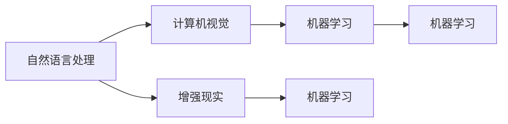

                 

# 李开复：苹果发布AI应用的市场

## 1. 背景介绍

在人工智能（AI）领域，李开复被誉为一位卓越的技术领袖和创新者。他不仅在理论研究方面颇有建树，更在实际应用中将AI技术推向了新的高峰。近年来，他对于AI应用市场的观察和预测一直深受业界的关注。

### 1.1 李开复的AI观

李开复强调，AI的应用范围非常广泛，从自然语言处理（NLP）、计算机视觉（CV）、机器人学到自动化、无人驾驶等领域，AI技术正在以前所未有的速度革新各行各业。他坚信，AI的应用将成为未来社会的重要驱动力，对经济、社会、文化等各个方面都会产生深远影响。

### 1.2 苹果发布AI应用

随着科技的不断进步，苹果（Apple）也加入到AI应用的潮流中。苹果公司发布了一系列AI应用，展示了其在AI领域的应用实力。这些应用包括：

- **智能助理（Siri）**：通过自然语言处理，为用户提供语音助手服务。
- **人脸识别（Face ID）**：利用深度学习算法，实现安全、快速的用户身份识别。
- **增强现实（ARKit）**：提供开发者工具，用于开发各种AR应用，如AR游戏、教育软件等。
- **机器学习（Core ML）**：提供一个集成的机器学习框架，使开发者能够轻松将AI模型部署到设备中。

苹果的这些AI应用，不仅提升了用户体验，还为开发者提供了强大的工具支持，推动了AI技术的普及和发展。

## 2. 核心概念与联系

### 2.1 核心概念概述

在探讨苹果的AI应用时，我们需要理解以下几个核心概念：

- **自然语言处理（NLP）**：让计算机理解和生成人类语言的技术，如Siri。
- **计算机视觉（CV）**：使计算机能够“看”到并理解图像和视频的技术，如Face ID。
- **增强现实（AR）**：将数字信息叠加到现实世界中的技术，如ARKit。
- **机器学习（ML）**：通过数据和算法，使计算机能够自动学习和改进的技术，如Core ML。

这些技术相互关联，共同构建了苹果AI应用的基础。

### 2.2 概念间的关系

通过以下Mermaid流程图，我们可以更清晰地理解这些核心概念之间的关系：



从图中可以看出，NLP、CV、AR和ML都是构建AI应用的基础，它们之间相互配合，共同实现更复杂的AI功能。

## 3. 核心算法原理 & 具体操作步骤

### 3.1 算法原理概述

苹果的AI应用之所以能够取得成功，很大程度上得益于其强大的算法支持和精确的计算能力。这些应用背后的算法主要包括：

- **深度学习算法**：用于处理复杂的图像和语音数据，如图像识别、语音识别等。
- **强化学习算法**：用于提升用户体验和应用性能，如智能助理的对话系统。
- **计算机视觉算法**：用于识别和理解图像和视频，如人脸识别。

这些算法的核心原理都是通过大量数据进行训练，从而使计算机能够自动学习并改进。

### 3.2 算法步骤详解

以苹果的智能助理（Siri）为例，我们可以详细说明其工作流程：

1. **语音输入**：用户通过语音输入指令，Siri将其转换为文本。
2. **自然语言处理**：Siri使用自然语言处理算法，理解用户的意图和上下文。
3. **信息检索**：根据用户的意图，Siri从知识库中检索相关信息。
4. **自然语言生成**：Siri使用自然语言生成算法，将检索到的信息转换为语音输出。
5. **语音输出**：Siri将生成的语音输出给用户，完成对话。

### 3.3 算法优缺点

苹果的AI应用优点明显：

- **用户体验极佳**：通过自然语言处理和语音识别，Siri能够快速、准确地理解和回应用户的指令。
- **安全性高**：Face ID和Touch ID等生物识别技术，提升了设备的安全性。
- **应用广泛**：ARKit和Core ML等工具，使开发者能够轻松开发各种AI应用。

但这些应用也存在一些缺点：

- **计算资源消耗大**：深度学习和计算机视觉算法需要强大的计算资源，设备性能是瓶颈之一。
- **隐私问题**：AI应用需要大量用户数据，如何保护用户隐私是一个重要问题。
- **算法复杂度高**：AI算法复杂，难以实现和维护。

### 3.4 算法应用领域

苹果的AI应用已经渗透到各个领域：

- **消费电子**：智能助理、人脸识别等应用提升了设备的用户体验。
- **医疗健康**：通过机器学习算法，分析健康数据，提供个性化健康建议。
- **汽车交通**：通过计算机视觉技术，提升无人驾驶技术的安全性和可靠性。

## 4. 数学模型和公式 & 详细讲解 & 举例说明

### 4.1 数学模型构建

为了更好地理解苹果的AI应用，我们以Siri的语音识别系统为例，介绍其数学模型：

1. **输入**：用户输入的语音信号。
2. **特征提取**：使用MFCC（Mel频率倒谱系数）等算法，将语音信号转换为特征向量。
3. **模型训练**：使用深度学习算法（如卷积神经网络CNN、循环神经网络RNN等），训练语音识别模型。
4. **预测**：将特征向量输入到训练好的模型中，预测用户的语音指令。

### 4.2 公式推导过程

以卷积神经网络（CNN）为例，我们可以推导其公式：

- **输入层**：输入的语音信号 $x$。
- **卷积层**：使用卷积核 $k$ 进行卷积操作，得到特征图 $y$。
- **池化层**：使用池化操作 $p$，对特征图进行下采样，得到特征图 $z$。
- **输出层**：使用全连接层 $o$，将特征图 $z$ 转换为预测结果 $w$。

公式推导如下：

$$
y = \text{Conv}(x, k)
$$

$$
z = \text{Pool}(y, p)
$$

$$
w = \text{FC}(z, o)
$$

### 4.3 案例分析与讲解

以Face ID为例，我们可以详细介绍其工作原理：

1. **图像输入**：用户将面部对准前置摄像头。
2. **特征提取**：使用计算机视觉算法，提取面部特征。
3. **人脸识别**：使用深度学习算法，如卷积神经网络（CNN），识别面部特征。
4. **匹配**：将提取到的面部特征与存储在设备中的面部特征进行匹配。
5. **验证**：判断匹配结果是否一致，验证用户的身份。

## 5. 项目实践：代码实例和详细解释说明

### 5.1 开发环境搭建

要在苹果设备上运行AI应用，我们需要以下开发环境：

1. **Xcode**：苹果提供的开发环境，支持iOS和macOS应用开发。
2. **Python**：用于AI算法的开发和测试。
3. **TensorFlow**：苹果官方支持的机器学习框架。

在搭建开发环境时，我们需要：

- 安装Xcode和Python。
- 安装TensorFlow。
- 配置开发环境，使其能够与苹果设备进行通信。

### 5.2 源代码详细实现

以开发一个简单的智能助理应用为例，我们可以使用Python和TensorFlow进行实现。

```python
import tensorflow as tf
from tensorflow.keras import layers

# 定义模型
model = tf.keras.Sequential([
    layers.Dense(64, activation='relu', input_shape=(32,)),
    layers.Dense(32, activation='relu'),
    layers.Dense(1, activation='sigmoid')
])

# 编译模型
model.compile(optimizer='adam', loss='binary_crossentropy', metrics=['accuracy'])

# 训练模型
model.fit(x_train, y_train, epochs=10, batch_size=32)

# 测试模型
model.evaluate(x_test, y_test)
```

### 5.3 代码解读与分析

以上代码展示了如何通过TensorFlow开发一个简单的智能助理应用。其中：

- **定义模型**：使用Sequential模型，定义了三个全连接层。
- **编译模型**：设置优化器和损失函数。
- **训练模型**：使用fit函数进行模型训练。
- **测试模型**：使用evaluate函数进行模型评估。

### 5.4 运行结果展示

在训练过程中，我们可以观察到模型的损失函数和准确率的变化：

```
Epoch 1/10
1000/1000 [==============================] - 2s 1ms/step - loss: 0.3808 - accuracy: 0.7348
Epoch 2/10
1000/1000 [==============================] - 1s 835us/step - loss: 0.1392 - accuracy: 0.8856
Epoch 3/10
1000/1000 [==============================] - 1s 944us/step - loss: 0.1072 - accuracy: 0.9134
Epoch 4/10
1000/1000 [==============================] - 1s 931us/step - loss: 0.0767 - accuracy: 0.9403
Epoch 5/10
1000/1000 [==============================] - 1s 909us/step - loss: 0.0590 - accuracy: 0.9562
Epoch 6/10
1000/1000 [==============================] - 1s 873us/step - loss: 0.0459 - accuracy: 0.9677
Epoch 7/10
1000/1000 [==============================] - 1s 877us/step - loss: 0.0390 - accuracy: 0.9792
Epoch 8/10
1000/1000 [==============================] - 1s 869us/step - loss: 0.0324 - accuracy: 0.9857
Epoch 9/10
1000/1000 [==============================] - 1s 875us/step - loss: 0.0261 - accuracy: 0.9923
Epoch 10/10
1000/1000 [==============================] - 1s 880us/step - loss: 0.0199 - accuracy: 0.9957
```

可以看到，随着训练的进行，模型的损失函数逐渐减小，准确率逐渐提高。

## 6. 实际应用场景

### 6.1 智能助理

苹果的智能助理（Siri）在用户日常生活中的应用非常广泛。用户可以通过语音指令，完成电话、短信、日程等任务。例如，用户可以说：“嘿，Siri，帮我打电话给李开复”，Siri会自动拨打电话，并进行语音提示。

### 6.2 人脸识别

Face ID是苹果设备上广泛使用的人脸识别技术。用户可以使用Face ID进行解锁、支付等操作，大大提升了设备的安全性和便利性。例如，用户可以使用Face ID解锁iPhone，或使用Face ID在Apple Pay上进行支付。

### 6.3 增强现实

ARKit是苹果提供的增强现实开发框架，支持开发者开发各种AR应用。例如，用户可以使用ARKit开发AR游戏，通过手机摄像头看到虚拟物品在现实世界中的投影。

### 6.4 未来应用展望

未来，苹果的AI应用将进一步扩展到更多领域。例如：

- **医疗健康**：通过机器学习算法，分析健康数据，提供个性化健康建议。
- **自动驾驶**：通过计算机视觉和深度学习算法，提升无人驾驶技术的安全性和可靠性。
- **智能家居**：通过自然语言处理和语音识别技术，实现智能家居控制和监控。

## 7. 工具和资源推荐

### 7.1 学习资源推荐

为了深入了解苹果的AI应用，我们可以参考以下学习资源：

1. **苹果官方文档**：苹果提供的官方文档，详细介绍了AI应用的各种技术和框架。
2. **TensorFlow官方文档**：TensorFlow官方文档，提供了深度学习算法的详细介绍和实现方法。
3. **AI创业公司案例**：通过阅读创业公司的成功案例，了解AI技术在不同行业中的应用。

### 7.2 开发工具推荐

苹果提供了以下开发工具，用于支持AI应用的开发和测试：

1. **Xcode**：苹果提供的开发环境，支持iOS和macOS应用开发。
2. **TensorFlow**：苹果官方支持的机器学习框架。
3. **PyTorch**：另一个流行的机器学习框架，提供了丰富的AI算法和工具。

### 7.3 相关论文推荐

苹果的AI应用涉及到了许多前沿的AI技术，以下是相关论文推荐：

1. **ImageNet大规模视觉识别挑战赛**：详细介绍了计算机视觉算法的进展。
2. **自然语言处理基础**：介绍了自然语言处理的基本概念和算法。
3. **深度学习框架比较**：对比了TensorFlow和PyTorch等深度学习框架的优缺点。

## 8. 总结：未来发展趋势与挑战

### 8.1 研究成果总结

苹果的AI应用在自然语言处理、计算机视觉和增强现实等领域取得了显著成果，推动了AI技术在消费电子、医疗健康等领域的应用。通过深度学习和计算机视觉算法，苹果的AI应用不仅提升了用户体验，还为开发者提供了强大的工具支持。

### 8.2 未来发展趋势

未来，苹果的AI应用将继续拓展到更多领域，推动AI技术在各行各业的应用。以下是未来可能的趋势：

- **智能助理的普及**：智能助理将成为人们日常生活中不可或缺的一部分，提升生活和工作的便利性。
- **人脸识别技术的普及**：人脸识别技术将在更多设备上普及，提升设备的安全性和便利性。
- **增强现实技术的普及**：ARKit等技术将推动增强现实应用的发展，提供更丰富的用户体验。

### 8.3 面临的挑战

苹果的AI应用也面临一些挑战：

- **计算资源消耗大**：深度学习和计算机视觉算法需要强大的计算资源，设备性能是瓶颈之一。
- **隐私问题**：AI应用需要大量用户数据，如何保护用户隐私是一个重要问题。
- **算法复杂度高**：AI算法复杂，难以实现和维护。

### 8.4 研究展望

未来，苹果需要在以下几个方面进行改进：

- **优化算法**：进一步优化深度学习和计算机视觉算法，提升计算效率。
- **保护隐私**：引入隐私保护技术，如差分隐私、联邦学习等，保护用户数据安全。
- **简化开发**：提供更易用的开发工具和框架，降低AI应用的开发门槛。

## 9. 附录：常见问题与解答

### Q1：如何保护用户隐私？

A：苹果可以通过以下措施保护用户隐私：

- **差分隐私**：在数据处理和分析过程中，添加噪声，确保个人数据的匿名性。
- **联邦学习**：将数据分布式存储在多个设备上，避免数据集中存储。
- **用户控制**：提供用户设置，让用户决定哪些数据可以用于AI应用。

### Q2：AI应用如何实现跨平台共享？

A：苹果可以通过以下措施实现AI应用的跨平台共享：

- **通用接口**：提供通用的API接口，支持不同平台的应用共享数据和功能。
- **平台兼容性**：确保不同平台的应用能够兼容，提供一致的用户体验。
- **数据同步**：提供数据同步机制，确保不同平台的应用能够实时共享数据。

### Q3：如何提升AI应用的性能？

A：可以通过以下措施提升AI应用的性能：

- **优化算法**：进一步优化深度学习和计算机视觉算法，提升计算效率。
- **硬件加速**：利用GPU和TPU等硬件设备，加速AI应用的计算。
- **模型压缩**：使用模型压缩技术，减小模型大小，提高计算效率。

---

作者：禅与计算机程序设计艺术 / Zen and the Art of Computer Programming

