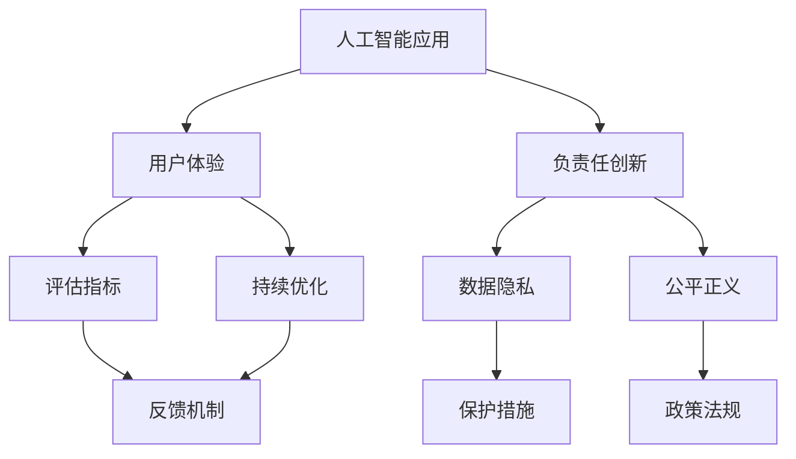

                 

# 李开复：苹果发布AI应用的文化价值

> 关键词：苹果、人工智能应用、文化价值、创新驱动、伦理道德、用户体验

## 1. 背景介绍

### 1.1 问题由来
近年来，苹果公司迅速崛起为人工智能应用领域的领头羊。从Siri到Face ID，再到Apple Health，苹果公司通过一系列AI应用的创新，不仅提升了用户体验，还拓展了公司的市场份额。这些AI应用背后，是苹果公司强大的技术实力和文化价值支撑。本文旨在探讨苹果公司发布AI应用背后的文化价值，并分析其在推动创新驱动、增强用户体验以及确保伦理道德等方面发挥的作用。

### 1.2 问题核心关键点
苹果公司发布AI应用的核心理念在于“以用户体验为中心”，通过智能化的技术手段，提升用户的生活品质和交互体验。此外，苹果公司强调“负责任创新”，确保AI应用的伦理道德，保护用户隐私，推动社会的公平正义。本文将重点分析这两个核心理念，并探讨其在实际应用中的表现和影响。

### 1.3 问题研究意义
了解苹果公司发布AI应用的文化价值，对于其他科技公司具有重要的借鉴意义。本文通过深入分析苹果公司的AI应用策略，揭示其成功的关键因素，为其他公司提供宝贵的经验参考。同时，本文也将为科技伦理和用户体验的探讨提供新的视角。

## 2. 核心概念与联系

### 2.1 核心概念概述

- **人工智能应用(AI Application)**：指通过AI技术实现的自动化、智能化服务或工具，如语音识别、图像处理、自然语言处理等。
- **用户体验(User Experience, UX)**：指用户在使用产品或服务过程中获得的感受和体验，是评估产品或服务质量的重要指标。
- **负责任创新(Responsible Innovation)**：指在科技创新过程中，考虑到伦理道德、社会影响等方面的因素，负责任地推进技术应用，确保其对社会的正面影响。
- **数据隐私(Data Privacy)**：指保护个人在数据收集、处理和使用过程中不受侵犯的权利，是数据驱动型应用的关键考虑因素。
- **公平正义(Social Justice)**：指确保技术应用的普及性和包容性，避免因技术鸿沟导致的社会不公。

### 2.2 概念间的关系

这些核心概念相互联系，共同构成了苹果公司发布AI应用的文化价值体系。具体来说：

- **人工智能应用**是实现用户体验和技术创新的手段。
- **负责任创新**是确保AI应用伦理道德、数据隐私和社会公正的重要保障。
- **用户体验**是评估AI应用成效的关键指标。
- **数据隐私**是确保用户体验和负责任创新的基础。
- **公平正义**是提升用户体验和负责任创新的终极目标。

这些概念之间的关系可以通过以下Mermaid流程图来展示：



这个流程图展示了大语言模型微调过程中各个概念的相互联系：

1. 人工智能应用通过提升用户体验来驱动技术创新。
2. 负责任创新确保人工智能应用的伦理道德和数据隐私。
3. 用户体验的评估指标通过反馈机制进行持续优化。
4. 数据隐私的保护措施和公平正义的政策法规共同保障用户权益。

通过理解这些概念的关系，我们可以更深入地分析苹果公司发布AI应用的文化价值及其影响。

## 3. 核心算法原理 & 具体操作步骤
### 3.1 算法原理概述

苹果公司发布AI应用的核心算法原理主要基于以下两点：

1. **用户行为分析**：通过分析用户的日常行为数据，识别用户的偏好和需求，实现个性化推荐和服务。
2. **智能决策支持**：利用机器学习算法，为用户提供决策支持，如智能助理推荐、健康管理建议等。

### 3.2 算法步骤详解

1. **数据收集与预处理**：收集用户的日常行为数据，包括浏览记录、购买记录、位置数据等，并对数据进行清洗和预处理，去除噪声和异常值。

2. **特征提取与选择**：利用自然语言处理(NLP)技术提取文本特征，使用计算机视觉技术提取图像特征，选择对用户行为有重要影响的特征进行建模。

3. **模型训练与优化**：使用机器学习算法（如决策树、随机森林、深度学习等）对数据进行训练，并根据实际效果进行调整和优化，确保模型的高效性和准确性。

4. **模型部署与迭代**：将训练好的模型部署到生产环境中，并通过用户的反馈进行持续迭代优化，提升用户体验和模型性能。

### 3.3 算法优缺点

**优点**：

- **高度个性化**：通过分析用户行为数据，提供高度个性化的服务。
- **决策支持**：智能决策支持提升了用户的决策效率和质量。
- **用户体验优化**：通过不断迭代优化，提升用户体验。

**缺点**：

- **隐私风险**：大规模数据收集和处理存在隐私泄露的风险。
- **模型偏见**：模型可能存在数据偏见，影响决策的公平性。
- **计算资源需求高**：训练和部署AI模型需要大量的计算资源。

### 3.4 算法应用领域

苹果公司发布AI应用涉及多个领域，包括但不限于：

- **智能助理(Siri)**：提供语音识别、自然语言理解和任务执行等功能，提升用户的交互体验。
- **人脸识别(Face ID)**：通过人脸识别技术实现设备解锁和支付等功能，提高安全性。
- **健康管理(Apple Health)**：通过智能健康监测和管理，提升用户的健康水平和医疗体验。
- **个性化推荐(推荐系统)**：根据用户行为数据，提供个性化的产品和服务推荐。
- **图像处理(如照片增强)**：通过智能图像处理技术提升用户体验。

## 4. 数学模型和公式 & 详细讲解  
### 4.1 数学模型构建

苹果公司发布AI应用涉及的数学模型主要包括以下几种：

- **决策树模型**：用于分类和回归任务，可以处理非线性关系和缺失数据。
- **随机森林模型**：通过集成多个决策树，提升模型的稳定性和准确性。
- **深度学习模型**：如卷积神经网络(CNN)和循环神经网络(RNN)，适用于复杂的图像和序列数据处理。
- **强化学习模型**：用于决策制定，通过与环境的交互学习最优策略。

### 4.2 公式推导过程

以决策树模型为例，推导其基本的决策过程：

1. **分裂准则**：选择最优特征和分裂点，使得信息增益最大化。
2. **分裂策略**：根据特征值将数据集分成两个子集，递归地进行分裂。
3. **剪枝策略**：防止过拟合，通过剪枝策略优化模型。

决策树的公式推导较为复杂，这里仅以决策树的基尼不纯度公式为例：

$$
Gini = \sum_{i=1}^C \frac{n_i}{n} (1 - \frac{n_i}{n}) = 1 - \frac{\sum_{i=1}^C n_i^2}{n^2}
$$

其中 $n$ 为样本总数，$n_i$ 为属于第 $i$ 类别的样本数。

### 4.3 案例分析与讲解

以Siri为例，分析其背后的决策树模型和智能决策支持：

1. **用户指令识别**：通过决策树模型对用户指令进行分类，判断用户意图。
2. **任务执行**：根据用户意图，调用相应的任务执行函数，实现任务执行。
3. **反馈与优化**：根据用户反馈，调整决策树模型和任务执行函数，提升用户体验。

## 5. 项目实践：代码实例和详细解释说明
### 5.1 开发环境搭建

要搭建一个AI应用项目，首先需要安装Python、R等编程语言，以及相关的开发环境和工具。以下是Python环境搭建的步骤：

1. **安装Python**：从官网下载Python安装包，进行安装。
2. **安装依赖库**：使用pip安装所需的依赖库，如numpy、pandas、scikit-learn等。
3. **配置开发环境**：根据需要，配置开发环境，如Jupyter Notebook、Git等。

### 5.2 源代码详细实现

以下是一个简单的决策树分类器的Python实现：

```python
from sklearn.tree import DecisionTreeClassifier
from sklearn.datasets import load_iris
from sklearn.model_selection import train_test_split

# 加载数据集
iris = load_iris()
X = iris.data
y = iris.target

# 划分训练集和测试集
X_train, X_test, y_train, y_test = train_test_split(X, y, test_size=0.3, random_state=42)

# 构建决策树模型
clf = DecisionTreeClassifier()

# 训练模型
clf.fit(X_train, y_train)

# 评估模型
print(clf.score(X_test, y_test))
```

### 5.3 代码解读与分析

- **数据加载**：使用sklearn库加载Iris数据集，分为特征和标签。
- **模型构建**：选择决策树分类器，并对其进行训练。
- **模型评估**：使用测试集评估模型性能，输出分类准确率。

## 6. 实际应用场景
### 6.1 智能助理

智能助理Siri是基于语音识别和自然语言处理技术的AI应用，通过分析用户的语音指令，提供任务执行和信息查询等服务。其背后的文化和价值体现在以下几个方面：

1. **用户为中心**：Siri的设计理念是“以用户为中心”，始终关注用户的需求和体验，提升用户的满意度和依赖感。
2. **负责任创新**：Siri在语音识别和自然语言处理过程中，严格遵守隐私保护和数据安全等伦理道德准则，确保用户信息的安全和隐私。
3. **公平正义**：Siri致力于消除技术鸿沟，确保所有用户都能平等地享受到智能助理带来的便利。

### 6.2 人脸识别

人脸识别技术通过深度学习算法，实现对人脸图像的高精度识别和验证。其背后的文化和价值包括：

1. **安全可靠**：人脸识别技术通过高精度的算法和数据处理，确保设备的可靠性和安全性。
2. **用户友好**：人脸识别技术通过简化解锁流程，提升用户的使用体验，减少用户的操作步骤。
3. **负责任创新**：人脸识别技术在设计和应用过程中，严格遵守数据隐私和伦理道德，保护用户隐私。

### 6.3 健康管理

Apple Health是一款基于智能手机的健康管理应用，通过收集用户健康数据，提供个性化的健康建议和监测。其背后的文化和价值体现在：

1. **数据驱动**：Apple Health通过收集用户健康数据，提供科学合理的健康建议，提升用户的健康水平。
2. **负责任创新**：Apple Health严格遵守数据隐私和伦理道德准则，确保用户健康数据的保密和安全。
3. **用户体验优化**：Apple Health通过持续迭代优化，提升用户的使用体验，使健康管理更加便捷和高效。

### 6.4 未来应用展望

随着AI技术的不断进步，苹果公司将会在更多领域推出新的AI应用。未来，苹果公司可能会在以下领域进行探索：

1. **自动驾驶**：通过AI技术实现自动驾驶，提升驾驶安全性和效率。
2. **医疗诊断**：利用AI技术进行疾病诊断和治疗，提升医疗水平。
3. **智能家居**：通过AI技术实现智能家居控制，提升家居智能化水平。
4. **虚拟现实(VR)**：通过AI技术实现虚拟现实应用，提升用户体验。

## 7. 工具和资源推荐
### 7.1 学习资源推荐

- **书籍**：《Python机器学习》、《深度学习》、《数据科学导论》等。
- **在线课程**：Coursera、edX等平台提供的机器学习和数据科学课程。
- **社区**：Kaggle、GitHub等社区，提供丰富的数据集和代码资源。

### 7.2 开发工具推荐

- **Python**：广泛使用的编程语言，支持丰富的机器学习和数据科学库。
- **R**：专业的统计分析工具，适用于数据科学和机器学习。
- **Jupyter Notebook**：支持Python和R等多种语言的交互式编程环境。
- **Git**：版本控制工具，支持协作开发和代码管理。

### 7.3 相关论文推荐

- **深度学习**：《Deep Learning》by Ian Goodfellow、Yoshua Bengio和Aaron Courville。
- **机器学习**：《Pattern Recognition and Machine Learning》by Christopher Bishop。
- **自然语言处理**：《Speech and Language Processing》by Daniel Jurafsky and James H. Martin。

## 8. 总结：未来发展趋势与挑战
### 8.1 研究成果总结

苹果公司发布AI应用的实践，展示了其在用户体验和负责任创新方面的成功经验。通过高度个性化的服务、智能决策支持和负责任的创新，苹果公司赢得了用户的信任和依赖。然而，大规模数据收集和处理存在隐私泄露的风险，模型可能存在数据偏见，高计算资源需求等问题仍需进一步解决。

### 8.2 未来发展趋势

未来，苹果公司将会在更多领域推出新的AI应用，推动AI技术的进一步发展和应用。其主要发展趋势包括：

1. **跨领域应用**：AI技术将会在更多领域得到应用，如自动驾驶、医疗诊断、智能家居等。
2. **多模态融合**：通过融合多模态数据（如语音、图像、文本等），提升AI应用的性能和用户体验。
3. **隐私保护**：AI应用将更加注重用户隐私保护，采用隐私保护技术（如差分隐私、联邦学习等）。
4. **公平正义**：AI应用将更加注重公平性和包容性，消除技术鸿沟，确保所有用户平等地享受AI带来的便利。

### 8.3 面临的挑战

苹果公司在发布AI应用的过程中，仍面临以下挑战：

1. **隐私泄露**：大规模数据收集和处理存在隐私泄露的风险，需要加强数据保护措施。
2. **模型偏见**：AI模型可能存在数据偏见，需要采取措施消除模型偏见。
3. **计算资源需求高**：AI应用的开发和部署需要大量的计算资源，需要优化资源利用。
4. **用户体验优化**：如何不断提升用户体验，满足用户不断变化的需求，需要持续创新和优化。

### 8.4 研究展望

未来的研究需要从以下几个方向进行突破：

1. **隐私保护技术**：研究差分隐私、联邦学习等隐私保护技术，确保用户隐私安全。
2. **公平性算法**：开发公平性算法，消除模型偏见，提升AI应用的公平性。
3. **多模态融合**：研究多模态融合技术，提升AI应用的性能和用户体验。
4. **负责任创新**：研究负责任创新的理论和方法，确保AI应用的社会影响和伦理道德。

## 9. 附录：常见问题与解答

**Q1：苹果公司发布AI应用的核心理念是什么？**

A: 苹果公司发布AI应用的核心理念是“以用户体验为中心”和“负责任创新”。

**Q2：苹果公司如何处理隐私保护问题？**

A: 苹果公司通过差分隐私、联邦学习等技术，处理大规模数据收集和处理过程中的隐私保护问题。

**Q3：苹果公司的AI应用如何保证公平正义？**

A: 苹果公司通过消除技术鸿沟、确保所有用户平等地享受AI应用，实现公平正义。

**Q4：苹果公司发布AI应用的优势是什么？**

A: 苹果公司发布AI应用的优势在于其高度个性化的服务、智能决策支持和负责任的创新。

**Q5：苹果公司发布AI应用存在哪些挑战？**

A: 苹果公司发布AI应用存在隐私泄露、模型偏见、计算资源需求高和用户体验优化等方面的挑战。

---

作者：禅与计算机程序设计艺术 / Zen and the Art of Computer Programming

