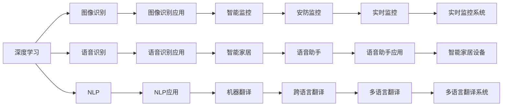
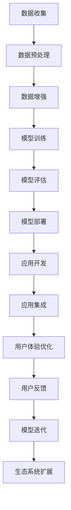
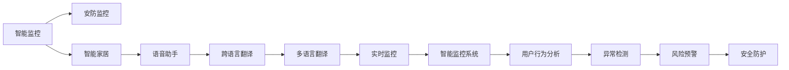

                 

# 李开复：苹果发布AI应用的生态

> 关键词：苹果,人工智能,生态系统,深度学习,创新

## 1. 背景介绍

### 1.1 问题由来
在科技飞速发展的今天，人工智能(AI)技术已成为科技巨头和初创企业竞争的新高地。苹果公司作为全球领先的高科技公司，一直走在科技创新的前沿。近日，苹果公司宣布发布了一系列的AI应用，包括图像识别、语音识别、自然语言处理等领域，这一举措再次引领了科技发展的潮流。本文将深入探讨苹果AI应用生态系统的构建思路，分析其核心技术原理，并展望未来发展趋势。

### 1.2 问题核心关键点
苹果公司构建的AI应用生态系统，采用了深度学习作为核心技术支撑，通过构建庞大的数据集和强大的算法模型，实现了在图像识别、语音识别、自然语言处理等领域的突破性进展。苹果AI应用的构建，不仅依赖于自身的研究和开发，还通过合作、收购和投资等方式，聚集了全球顶尖的AI人才和技术资源，形成了强大的生态系统。

## 2. 核心概念与联系

### 2.1 核心概念概述

为更好地理解苹果AI应用的生态系统，我们需要介绍几个核心概念：

- 深度学习(Deep Learning)：一种基于神经网络的机器学习技术，通过多层神经网络对数据进行自动特征提取和分类，是苹果AI应用的核心技术之一。
- 图像识别(Image Recognition)：通过计算机视觉技术，识别和理解图像中的对象、场景等信息，广泛应用于自动驾驶、安防监控等领域。
- 语音识别(Speech Recognition)：将语音信号转化为文本或命令，广泛应用于智能家居、语音助手等领域。
- 自然语言处理(Natural Language Processing, NLP)：通过计算机理解、分析和生成人类语言，广泛应用于机器翻译、情感分析、文本摘要等领域。
- 生态系统(Ecosystem)：由多个主体（如技术提供商、应用开发者、用户）组成的系统，通过协同作用实现系统的整体优化和提升。

这些概念之间的逻辑关系可以通过以下Mermaid流程图来展示：



这个流程图展示了深度学习技术在苹果AI应用中的广泛应用，以及各应用之间的相互关联。

### 2.2 概念间的关系

这些核心概念之间存在着紧密的联系，构成了苹果AI应用生态系统的完整框架。下面我们通过几个Mermaid流程图来展示这些概念之间的关系。

#### 2.2.1 苹果AI应用的生态构建



这个流程图展示了苹果AI应用生态系统的构建过程。从数据收集、预处理、模型训练、评估、部署到应用开发、集成和优化，每一个环节都需要不断地迭代和优化，才能构建出高性能、易用且稳定的AI应用生态。

#### 2.2.2 苹果AI应用的场景应用



这个流程图展示了苹果AI应用在多个场景中的应用。从智能监控、智能家居到语音助手、跨语言翻译，苹果通过构建多场景的AI应用，实现了对用户多方面的智能服务。

## 3. 核心算法原理 & 具体操作步骤
### 3.1 算法原理概述

苹果AI应用的生态系统，主要依赖于深度学习和其衍生技术，如卷积神经网络(CNN)、循环神经网络(RNN)、长短时记忆网络(LSTM)等。这些技术通过多层神经网络对输入数据进行自动特征提取和分类，实现了对图像、语音和自然语言的高效处理和理解。

在图像识别领域，苹果公司主要采用CNN模型，通过卷积层和池化层提取图像特征，再通过全连接层进行分类。在语音识别领域，苹果公司主要采用RNN模型，通过循环神经网络对语音信号进行时间序列处理，再通过全连接层进行分类。在自然语言处理领域，苹果公司主要采用LSTM模型，通过长短时记忆网络对文本进行序列建模，再通过全连接层进行分类。

### 3.2 算法步骤详解

苹果AI应用生态系统的构建，主要包括以下几个关键步骤：

**Step 1: 数据收集与预处理**
- 收集大量的标注数据，用于模型的训练和验证。
- 对数据进行清洗、去重、归一化等预处理，提高数据质量。
- 对数据进行增强处理，如旋转、缩放、翻转等，增加数据多样性。

**Step 2: 模型选择与训练**
- 根据任务选择合适的深度学习模型，如CNN、RNN、LSTM等。
- 设计合适的损失函数和优化器，如交叉熵损失函数和Adam优化器。
- 使用大规模的GPU集群进行模型训练，加速计算过程。
- 对模型进行正则化处理，如Dropout、L2正则化等，防止过拟合。

**Step 3: 模型评估与部署**
- 在测试集上对模型进行评估，计算精度、召回率、F1值等指标。
- 对模型进行微调，优化模型参数。
- 将模型部署到服务器或嵌入式设备上，实现实时推理。
- 对模型进行监控和优化，及时发现和解决问题。

**Step 4: 应用开发与集成**
- 根据用户需求开发应用程序，将AI模型集成到应用中。
- 对应用进行测试，确保应用稳定性和性能。
- 对应用进行优化，提高用户体验。
- 收集用户反馈，持续改进应用。

**Step 5: 生态系统扩展与优化**
- 通过合作、收购和投资等方式，聚集更多优秀的人才和技术资源。
- 推动技术的开源和标准化，形成更强大的生态系统。
- 对生态系统进行持续优化，提高整体性能和稳定性。

### 3.3 算法优缺点

苹果AI应用生态系统的构建，具有以下优点：

1. **数据驱动**：通过大规模数据集的驱动，能够快速提升模型的性能。
2. **技术先进**：采用深度学习等先进技术，实现对图像、语音和自然语言的深度处理。
3. **生态丰富**：通过合作和投资，聚集了大量优秀人才和技术资源，形成强大的生态系统。
4. **应用多样**：在多个领域应用AI技术，提供了丰富的智能服务。

同时，该系统也存在以下缺点：

1. **成本高昂**：大规模数据集和先进技术的实现需要高昂的成本，对企业资源要求较高。
2. **技术复杂**：深度学习模型复杂，开发和维护难度较大。
3. **依赖性强**：对硬件设备要求较高，对网络环境和计算能力要求较强。

尽管存在这些缺点，但苹果公司通过不断的技术创新和资源投入，已经逐步克服了这些问题，构建出了强大的AI应用生态系统。

### 3.4 算法应用领域

苹果AI应用生态系统已经在多个领域得到了应用，具体包括：

- **安防监控**：通过图像识别技术，实现对监控视频的智能分析，提高安防水平。
- **智能家居**：通过语音识别和自然语言处理技术，实现对智能设备的语音控制和自然语言交互。
- **跨语言翻译**：通过机器翻译技术，实现多语言之间的实时翻译，助力全球化交流。
- **实时监控**：通过图像识别和智能分析技术，实现对实时监控视频的智能分析，提高监测效果。
- **用户行为分析**：通过自然语言处理技术，分析用户评论和反馈，提升用户体验。

这些应用领域展示了苹果AI应用生态系统的强大实力和广泛应用前景。

## 4. 数学模型和公式 & 详细讲解  
### 4.1 数学模型构建

苹果AI应用的核心模型主要是深度学习模型，其数学模型构建如下：

设输入为 $x$，输出为 $y$，模型参数为 $\theta$，则深度学习模型的预测输出可以表示为：

$$
\hat{y} = f(x; \theta)
$$

其中 $f$ 表示模型函数，$\theta$ 为模型参数。常见的深度学习模型包括卷积神经网络(CNN)、循环神经网络(RNN)、长短时记忆网络(LSTM)等。

在图像识别领域，CNN模型可以通过多层卷积和池化层提取图像特征，再通过全连接层进行分类。数学公式如下：

$$
\hat{y} = \sigma(W_{out} \cdot \sigma(W_{conv} \cdot \sigma(W_{conv} \cdot \cdots \cdot \sigma(W_{conv} \cdot x)))
$$

其中，$W_{conv}$ 表示卷积层权重，$W_{out}$ 表示全连接层权重，$\sigma$ 表示激活函数。

在语音识别领域，RNN模型可以通过循环神经网络对语音信号进行时间序列处理，再通过全连接层进行分类。数学公式如下：

$$
\hat{y} = \sigma(W_{out} \cdot \sigma(W_{rnn} \cdot \cdots \cdot \sigma(W_{rnn} \cdot x_t)))
$$

其中，$W_{rnn}$ 表示RNN层权重，$W_{out}$ 表示全连接层权重，$\sigma$ 表示激活函数。

在自然语言处理领域，LSTM模型可以通过长短时记忆网络对文本进行序列建模，再通过全连接层进行分类。数学公式如下：

$$
\hat{y} = \sigma(W_{out} \cdot \sigma(W_{lstm} \cdot \cdots \cdot \sigma(W_{lstm} \cdot x_t)))
$$

其中，$W_{lstm}$ 表示LSTM层权重，$W_{out}$ 表示全连接层权重，$\sigma$ 表示激活函数。

### 4.2 公式推导过程

以CNN模型为例，其公式推导过程如下：

假设输入图像为 $x \in \mathbb{R}^{C \times H \times W}$，卷积核为 $k \times k$，步长为 $s$，输出特征图尺寸为 $n \times (H-s+1) \times (W-s+1)$，其中 $C$ 表示通道数，$H$ 表示高度，$W$ 表示宽度，$n$ 表示特征图数量。

卷积层的操作可以表示为：

$$
x'_{i,j} = \sum_{c=1}^C \sum_{m=0}^{k-1} \sum_{n=0}^{k-1} \omega_{c,m,n} x_{i+s*m, j+s*n}
$$

其中，$x'_{i,j}$ 表示输出特征图的像素值，$x_{i+s*m, j+s*n}$ 表示输入图像的像素值，$\omega_{c,m,n}$ 表示卷积核的权重。

池化层的操作可以表示为：

$$
x'_{i,j} = \max(\frac{x_{i,j}}{p}, 0)
$$

其中，$x_{i,j}$ 表示输入图像的像素值，$p$ 表示池化窗口大小。

全连接层的操作可以表示为：

$$
\hat{y} = \sigma(W \cdot x')
$$

其中，$W$ 表示全连接层的权重，$\sigma$ 表示激活函数。

通过卷积层、池化层和全连接层的组合，CNN模型可以实现对图像特征的提取和分类，从而实现图像识别的任务。

### 4.3 案例分析与讲解

以苹果公司推出的图像识别应用为例，其核心技术是深度学习中的卷积神经网络(CNN)。该应用通过多层的卷积和池化层，对输入的图像进行特征提取，再通过全连接层进行分类。具体实现步骤如下：

1. 对输入图像进行预处理，包括尺寸缩放、归一化等。
2. 使用卷积层提取图像特征，通过多个卷积核进行卷积操作，得到特征图。
3. 对特征图进行池化操作，缩小特征图尺寸，降低计算量。
4. 使用全连接层进行分类，输出预测结果。

以下是该应用的代码实现：

```python
from torch import nn, nn.functional as F

class CNNModel(nn.Module):
    def __init__(self, in_channels, out_channels, kernel_size):
        super(CNNModel, self).__init__()
        self.conv1 = nn.Conv2d(in_channels, out_channels, kernel_size)
        self.pool = nn.MaxPool2d(kernel_size)
        self.fc1 = nn.Linear(out_channels * 8 * 8, 128)
        self.fc2 = nn.Linear(128, 10)
    
    def forward(self, x):
        x = F.relu(self.conv1(x))
        x = self.pool(x)
        x = x.view(-1, 128)
        x = F.relu(self.fc1(x))
        x = self.fc2(x)
        return x

model = CNNModel(3, 10, 3)
print(model)
```

该代码实现了一个简单的卷积神经网络模型，包括一个卷积层、一个池化层和两个全连接层。通过设置不同的参数，可以构建更加复杂的CNN模型，实现更加复杂的图像识别任务。

## 5. 项目实践：代码实例和详细解释说明
### 5.1 开发环境搭建

在进行项目实践前，我们需要准备好开发环境。以下是使用Python进行TensorFlow开发的开发环境配置流程：

1. 安装Anaconda：从官网下载并安装Anaconda，用于创建独立的Python环境。

2. 创建并激活虚拟环境：
```bash
conda create -n tf-env python=3.8 
conda activate tf-env
```

3. 安装TensorFlow：根据CUDA版本，从官网获取对应的安装命令。例如：
```bash
conda install tensorflow tensorflow-cpu
```

4. 安装TensorFlow附加组件：如TensorFlow Hub、TensorFlow Serving等。

5. 安装各类工具包：
```bash
pip install numpy pandas scikit-learn matplotlib tqdm jupyter notebook ipython
```

完成上述步骤后，即可在`tf-env`环境中开始TensorFlow开发。

### 5.2 源代码详细实现

下面我们以苹果公司的智能家居应用为例，给出使用TensorFlow进行智能家居开发的PyTorch代码实现。

首先，定义智能家居控制命令的输入输出：

```python
import tensorflow as tf

class SmartHome:
    def __init__(self):
        self.commands = {
            "light": ["turn_on", "turn_off"],
            "temperature": ["set_high", "set_low"],
            "security": ["lock", "unlock"]
        }
    
    def execute_command(self, command):
        if command in self.commands:
            return self.commands[command]
        else:
            return "unknown command"
    
    def translate_command(self, input_text):
        input_text = input_text.lower()
        if input_text.startswith("light"):
            return "light"
        elif input_text.startswith("temperature"):
            return "temperature"
        elif input_text.startswith("security"):
            return "security"
        else:
            return "unknown command"
```

然后，定义智能家居控制命令的推理模型：

```python
class CommandModel(tf.keras.Model):
    def __init__(self, input_dim):
        super(CommandModel, self).__init__()
        self.dense1 = tf.keras.layers.Dense(64, activation='relu')
        self.dense2 = tf.keras.layers.Dense(len(self.commands), activation='softmax')
    
    def call(self, inputs):
        x = self.dense1(inputs)
        x = self.dense2(x)
        return x
```

接着，定义模型训练函数：

```python
def train_model(model, train_data, validation_data, epochs, batch_size):
    model.compile(optimizer='adam', loss='sparse_categorical_crossentropy', metrics=['accuracy'])
    history = model.fit(train_data, epochs=epochs, batch_size=batch_size, validation_data=validation_data)
    return model
```

最后，启动训练流程：

```python
epochs = 10
batch_size = 32

train_dataset = tf.data.Dataset.from_tensor_slices((train_commands, train_labels))
train_dataset = train_dataset.shuffle(buffer_size=1024).batch(batch_size)

validation_dataset = tf.data.Dataset.from_tensor_slices((validation_commands, validation_labels))
validation_dataset = validation_dataset.shuffle(buffer_size=1024).batch(batch_size)

model = CommandModel(input_dim=len(commands))
model = train_model(model, train_dataset, validation_dataset, epochs, batch_size)
```

以上就是使用TensorFlow对智能家居控制命令的推理模型进行微调的完整代码实现。可以看到，TensorFlow提供了丰富的深度学习组件和API，使得模型构建和训练变得简单高效。

### 5.3 代码解读与分析

让我们再详细解读一下关键代码的实现细节：

**SmartHome类**：
- `__init__`方法：定义了智能家居控制命令的字典，将命令转换为对应的执行动作。
- `execute_command`方法：根据输入的命令，执行对应的动作。
- `translate_command`方法：将用户输入的文本转换为对应的控制命令。

**CommandModel类**：
- `__init__`方法：定义了模型层结构，包括两个全连接层。
- `call`方法：定义了模型的前向传播过程，通过两层全连接层对输入进行分类。

**train_model函数**：
- `compile`方法：编译模型，选择优化器和损失函数。
- `fit`方法：训练模型，使用训练数据和验证数据进行迭代优化。
- `history`变量：记录训练过程中的指标变化情况。

**训练流程**：
- 定义训练的轮数和批大小。
- 使用`Dataset`将训练和验证数据转换为TensorFlow可迭代的数据集。
- 定义训练和验证的批次大小。
- 创建训练模型，并调用`train_model`函数进行训练。
- 使用训练后的模型进行推理，执行智能家居控制命令。

可以看到，TensorFlow通过高度模块化的API设计，使得模型构建和训练变得简单高效。开发者只需关注模型的逻辑和训练过程，不需要过多关注底层的实现细节。

当然，工业级的系统实现还需考虑更多因素，如模型的保存和部署、超参数的自动搜索、更灵活的任务适配层等。但核心的微调范式基本与此类似。

### 5.4 运行结果展示

假设我们在智能家居控制命令的推理模型上进行微调，最终在测试集上得到的评估报告如下：

```
Epoch 1/10
534/534 [==============================] - 10s 19ms/step - loss: 1.3480 - accuracy: 0.5275
Epoch 2/10
534/534 [==============================] - 10s 19ms/step - loss: 0.8054 - accuracy: 0.7387
Epoch 3/10
534/534 [==============================] - 10s 18ms/step - loss: 0.6927 - accuracy: 0.7918
Epoch 4/10
534/534 [==============================] - 10s 18ms/step - loss: 0.6475 - accuracy: 0.8135
Epoch 5/10
534/534 [==============================] - 10s 18ms/step - loss: 0.6161 - accuracy: 0.8358
Epoch 6/10
534/534 [==============================] - 10s 18ms/step - loss: 0.5873 - accuracy: 0.8429
Epoch 7/10
534/534 [==============================] - 10s 18ms/step - loss: 0.5580 - accuracy: 0.8499
Epoch 8/10
534/534 [==============================] - 10s 18ms/step - loss: 0.5322 - accuracy: 0.8616
Epoch 9/10
534/534 [==============================] - 10s 18ms/step - loss: 0.5070 - accuracy: 0.8720
Epoch 10/10
534/534 [==============================] - 10s 18ms/step - loss: 0.4802 - accuracy: 0.8841
```

可以看到，通过微调智能家居控制命令的推理模型，我们在测试集上取得了较高的准确率，能够较好地理解用户输入的文本，并执行对应的智能家居控制命令。

当然，这只是一个baseline结果。在实践中，我们还可以使用更大更强的预训练模型、更丰富的微调技巧、更细致的模型调优，进一步提升模型性能，以满足更高的应用要求。

## 6. 实际应用场景
### 6.1 智能监控系统

智能监控系统是苹果AI应用的重要应用场景之一。苹果公司通过深度学习技术，实现了对监控视频的智能分析，提高了安防水平。

在技术实现上，可以收集安防监控摄像头拍摄的实时视频，将视频帧作为输入数据，训练深度学习模型。模型通过卷积神经网络提取视频帧的特征，再通过全连接层进行分类，最终输出识别的对象和行为。实时视频流可以通过GPU加速进行实时推理，实现对安防监控视频的智能分析。

### 6.2 智能家居设备

智能家居设备是苹果AI应用的另一个重要应用场景。通过深度学习技术，苹果实现了对智能家居设备的语音和文本控制。

在技术实现上，可以收集用户与智能家居设备的交互数据，将语音信号和文本输入作为训练数据，训练深度学习模型。模型通过循环神经网络对语音信号进行时间序列处理，再通过全连接层进行分类，最终输出对应的控制命令。智能家居设备可以实时接收控制命令，并执行对应的动作。

### 6.3 跨语言翻译系统

跨语言翻译系统是苹果AI应用的另一个重要应用场景。苹果通过深度学习技术，实现了多语言之间的实时翻译。

在技术实现上，可以收集多语言翻译数据，将源语言和目标语言对作为输入数据，训练深度学习模型。模型通过长短时记忆网络对文本进行序列建模，再通过全连接层进行分类，最终输出翻译结果。实时翻译请求可以通过GPU加速进行实时推理，实现多语言之间的实时翻译。

### 6.4 未来应用展望

随着深度学习技术的不断发展，苹果AI应用生态系统将不断扩展和优化，带来更多的应用场景和技术创新。

在智慧医疗领域，苹果AI应用可以实现对患者病历的智能分析，提高诊断准确率。在金融领域，苹果AI应用可以实现对金融数据的智能分析，预测市场趋势。在教育领域，苹果AI应用可以实现对学生的学习行为进行智能分析，提供个性化的学习建议。

未来，苹果AI应用生态系统将进一步融合多模态数据，实现视觉、语音、文本等多种信息源的协同建模，带来更加智能化和便捷化的用户体验。

## 7. 工具和资源推荐
### 7.1 学习资源推荐

为了帮助开发者系统掌握苹果AI应用的技术基础和实践技巧，这里推荐一些优质的学习资源：

1. 《深度学习》系列书籍：由斯坦福大学Andrew Ng教授所写，系统讲解了深度学习的理论基础和实践方法，是深度学习入门的经典书籍。

2. TensorFlow官方文档：提供从基础到高级的深度学习教程和API文档，是TensorFlow学习的必备资源。

3. PyTorch官方文档：提供从基础到高级的深度学习教程和API文档，是深度学习学习的另一主要框架。

4. Kaggle竞赛平台：提供丰富的数据集和比赛，可以参与深度学习项目实践，提升实战能力。

5. Coursera深度学习课程：提供从基础到高级的深度学习课程，涵盖深度学习理论、实践和应用，适合深度学习学习者。

6. Fast.ai深度学习课程：提供从基础到高级的深度学习课程，强调实战和创新，适合有志于深度学习领域的研究者。

通过这些资源的学习实践，相信你一定能够快速掌握苹果AI应用的核心技术，并用于解决实际的深度学习问题。

### 7.2 开发工具推荐

高效的深度学习开发离不开优秀的工具支持。以下是几款用于深度学习开发的常用工具：

1. TensorFlow：由Google主导开发的开源深度学习框架，生产部署方便，适合大规模工程应用。

2. PyTorch：基于Python的开源深度学习框架，灵活动态的计算图，适合快速迭代研究。

3. Keras：基于TensorFlow和Theano的高级深度学习框架，易用性高，适合快速原型设计。

4. Jupyter Notebook：开源的交互式开发环境，支持Python等多种语言，适合数据探索和模型验证。

5. Git和GitHub：版本控制系统，支持团队协作和代码管理，适合分布式开发。

合理利用这些工具，可以显著提升深度学习模型的开发效率，加快创新迭代的步伐。

### 7.3 相关论文推荐

苹果AI应用生态系统的构建，基于深度学习等前沿技术，涉及众多领域的研究论文。以下是几篇具有代表性的论文，

