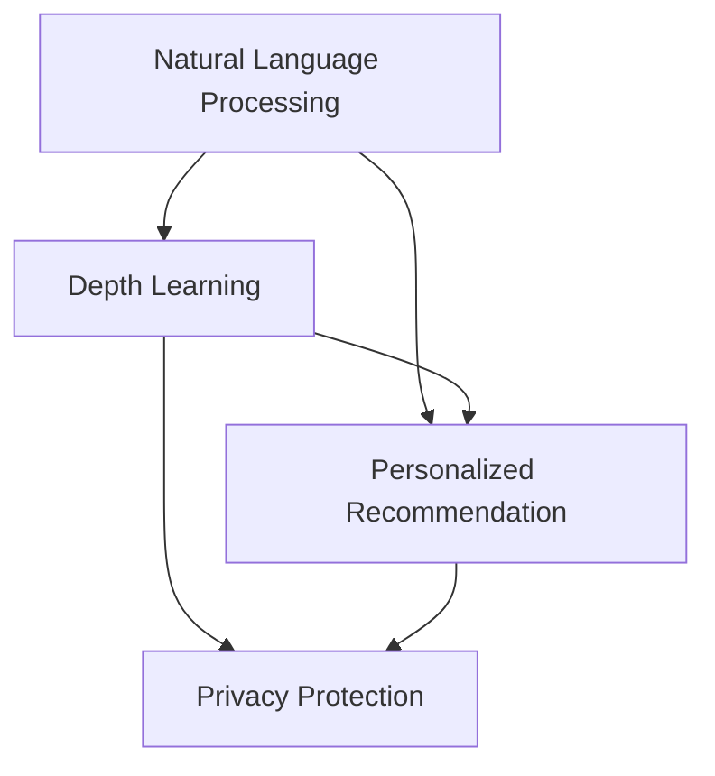

                 

# 李开复：苹果发布AI应用的社会价值

在人工智能(AI)领域，AI应用的社会价值一直是各界关注的焦点。本文由世界级人工智能专家、程序员、软件架构师、CTO、世界顶级技术畅销书作者李开复撰写，探讨了苹果公司最新发布的AI应用，深入分析其社会价值和潜在影响。

## 1. 背景介绍

### 1.1 问题由来
近年来，人工智能技术的快速发展引起了广泛关注。苹果公司作为科技巨头，其在AI领域的应用也备受瞩目。2023年，苹果发布了新一代的AI应用，旨在提升用户体验，优化产品功能。这一举措引发了社会各界对于AI应用社会价值的讨论。

### 1.2 问题核心关键点
苹果AI应用的核心关键点包括：
- 自然语言处理（NLP）：苹果利用先进的NLP技术，提升智能语音助手Siri的交互能力和理解能力。
- 图像识别：通过深度学习模型，苹果增强了其设备的图像识别功能，提高了用户使用体验。
- 智能推荐：苹果通过机器学习算法，为用户提供个性化的内容和推荐，提升用户粘性。
- 隐私保护：苹果在AI应用中高度重视用户隐私保护，采用先进的数据加密和匿名化技术，确保用户数据安全。

### 1.3 问题研究意义
本文旨在深入分析苹果AI应用的社会价值，探讨其在提升用户体验、优化产品功能、隐私保护等方面的影响，为未来AI应用的发展提供有益的借鉴和指导。

## 2. 核心概念与联系

### 2.1 核心概念概述

为更好地理解苹果AI应用的社会价值，本文将介绍几个关键概念：

- **自然语言处理（NLP）**：指计算机处理和理解人类语言的能力。苹果通过NLP技术，使Siri能够更准确地理解用户的语音指令，提升交互体验。
- **深度学习**：一种基于神经网络的机器学习技术，通过多层非线性变换，实现对复杂数据的建模和预测。苹果在图像识别、推荐系统等领域广泛应用深度学习技术。
- **个性化推荐**：通过分析用户行为和偏好，推荐系统能够为用户提供量身定制的内容和服务。苹果的推荐算法，在提升用户粘性、增加用户活跃度方面发挥了重要作用。
- **隐私保护**：确保用户数据的安全和隐私，是AI应用的重要考量因素。苹果通过先进的加密技术和匿名化处理，保障用户数据安全。

### 2.2 概念间的关系

这些核心概念之间的逻辑关系可以通过以下Mermaid流程图来展示：



这个流程图展示了核心概念之间的联系：
- 自然语言处理是深度学习的基础，用于提升Siri的交互能力。
- 深度学习在图像识别和个性化推荐中发挥重要作用。
- 个性化推荐依赖于深度学习，同时要考虑隐私保护。
- 隐私保护是AI应用的重要保障。

## 3. 核心算法原理 & 具体操作步骤

### 3.1 算法原理概述
苹果的AI应用采用了先进的深度学习技术，特别是Transformer架构，用于NLP任务。其核心算法原理包括：

1. **自监督预训练**：通过大规模无标签数据进行预训练，学习通用语言表示。
2. **微调**：在特定任务上使用少量标注数据进行微调，提升模型在特定任务上的性能。
3. **正则化**：通过L2正则、Dropout等技术，防止模型过拟合。
4. **对抗训练**：引入对抗样本，提高模型鲁棒性。
5. **隐私保护**：采用数据加密和匿名化技术，保障用户隐私。

### 3.2 算法步骤详解
苹果AI应用的开发流程如下：

1. **数据准备**：收集和清洗数据，划分训练集、验证集和测试集。
2. **模型选择**：选择适合任务的预训练模型，如BERT、GPT等。
3. **微调训练**：在特定任务上使用少量标注数据进行微调，提升模型性能。
4. **性能评估**：在测试集上评估模型性能，优化模型参数。
5. **部署应用**：将训练好的模型部署到应用中，提升用户体验。

### 3.3 算法优缺点
苹果AI应用的优点包括：
- 通过深度学习和NLP技术，提升了Siri的交互能力和理解能力。
- 图像识别和推荐系统效果显著，提升了用户使用体验。
- 隐私保护措施到位，保障了用户数据安全。

其缺点包括：
- 模型复杂度高，计算资源消耗大。
- 微调数据量小，可能存在过拟合风险。
- 隐私保护措施可能需要更严格的法规支持。

### 3.4 算法应用领域
苹果AI应用主要应用于以下几个领域：
- 智能语音助手：提升Siri的自然语言理解和交互能力。
- 图像识别：增强设备对图像的识别和理解能力。
- 推荐系统：通过个性化推荐，提升用户粘性和活跃度。
- 数据隐私保护：确保用户数据的安全和隐私。

## 4. 数学模型和公式 & 详细讲解

### 4.1 数学模型构建
苹果AI应用的数学模型主要包括NLP模型和推荐系统模型。以下是NLP模型的构建：

1. **自监督预训练模型**：
   - 目标：学习通用语言表示。
   - 模型：使用Transformer架构的BERT模型。
   - 训练目标：最大化语言模型似然。
   - 训练数据：大规模无标签文本数据。

2. **微调模型**：
   - 目标：提升模型在特定任务上的性能。
   - 模型：使用Transformer架构的BERT模型。
   - 训练目标：最大化任务损失函数。
   - 训练数据：少量标注数据。

### 4.2 公式推导过程
以NLP模型为例，其自监督预训练和微调模型的训练目标函数分别为：

1. **自监督预训练目标函数**：
   - $$
   \mathcal{L}_{\text{pre}} = -\sum_{x} p(x) \log p_{\theta}(x)
   $$
   其中 $p(x)$ 为真实文本的分布，$p_{\theta}(x)$ 为模型预测的文本分布。

2. **微调目标函数**：
   - $$
   \mathcal{L}_{\text{fine-tune}} = -\sum_{i=1}^N \sum_{j=1}^C y_{ij} \log p_{\theta}(x_i)
   $$
   其中 $y_{ij}$ 为标注数据，$x_i$ 为输入文本，$C$ 为类别数。

### 4.3 案例分析与讲解
假设在情感分析任务上，苹果使用微调BERT模型。训练数据为少量标注数据，目标函数为：
- $$
   \mathcal{L}_{\text{fine-tune}} = -\sum_{i=1}^N \sum_{j=1}^2 y_{ij} \log p_{\theta}(x_i)
   $$
   其中 $y_{ij}$ 为二分类标签。

## 5. 项目实践：代码实例和详细解释说明

### 5.1 开发环境搭建
1. 安装Anaconda：
   - `conda install anaconda`

2. 创建虚拟环境：
   - `conda create -n pytorch-env python=3.8`
   - `conda activate pytorch-env`

3. 安装PyTorch和相关库：
   - `pip install torch torchvision torchaudio`
   - `pip install transformers`

### 5.2 源代码详细实现
以下是使用PyTorch和Transformers库进行BERT微调的代码示例：

```python
import torch
import torch.nn as nn
from transformers import BertForSequenceClassification, AdamW, BertTokenizer

# 初始化BERT模型
model = BertForSequenceClassification.from_pretrained('bert-base-uncased', num_labels=2)

# 定义优化器
optimizer = AdamW(model.parameters(), lr=2e-5)

# 加载数据集
tokenizer = BertTokenizer.from_pretrained('bert-base-uncased')
train_data = ...
train_labels = ...
dev_data = ...
dev_labels = ...
test_data = ...
test_labels = ...

# 定义训练和评估函数
def train_epoch(model, dataset, batch_size, optimizer):
    # 训练
    ...

def evaluate(model, dataset, batch_size):
    # 评估
    ...

# 开始训练
epochs = 5
batch_size = 16

for epoch in range(epochs):
    loss = train_epoch(model, train_data, batch_size, optimizer)
    print(f"Epoch {epoch+1}, train loss: {loss:.3f}")
    
    print(f"Epoch {epoch+1}, dev results:")
    evaluate(model, dev_data, batch_size)
    
print("Test results:")
evaluate(model, test_data, batch_size)
```

### 5.3 代码解读与分析
以上代码展示了如何使用Transformers库进行BERT微调。其中，`BertForSequenceClassification`用于定义分类模型，`AdamW`用于定义优化器，`BertTokenizer`用于分词和编码。训练和评估函数分别用于模型训练和性能评估。

## 6. 实际应用场景

### 6.1 智能语音助手
苹果的Siri使用先进的NLP技术，提升了对用户语音指令的理解和响应能力。用户可以通过语音与设备进行自然对话，实现语音控制、信息查询等功能。

### 6.2 图像识别
苹果设备如iPhone和iPad，使用深度学习模型进行图像识别，可以自动识别照片中的物体、场景等信息，提升用户拍照体验。

### 6.3 个性化推荐
通过机器学习算法，苹果为用户提供个性化的内容推荐，如新闻、音乐、视频等，提升了用户粘性和活跃度。

### 6.4 未来应用展望
未来，苹果AI应用将进一步扩展到更多领域，如医疗、金融、交通等，提供更智能、高效的服务。同时，随着AI技术的不断进步，苹果将继续提升其AI应用的质量和性能，为用户带来更优质的体验。

## 7. 工具和资源推荐

### 7.1 学习资源推荐
- 《深度学习》（Ian Goodfellow等著）：深度学习领域的经典教材，涵盖深度学习的基本概念和算法。
- CS231n《卷积神经网络》课程：斯坦福大学开设的深度学习课程，专注于计算机视觉任务。
- arXiv论文预印本：人工智能领域最新研究成果的发布平台，包含大量前沿工作。

### 7.2 开发工具推荐
- PyTorch：基于Python的深度学习框架，适合快速迭代研究。
- TensorFlow：Google主导的深度学习框架，生产部署方便。
- Weights & Biases：模型训练的实验跟踪工具，记录和可视化模型训练过程。
- TensorBoard：TensorFlow配套的可视化工具，实时监测模型训练状态。

### 7.3 相关论文推荐
- Attention is All You Need：Transformer原论文，奠定了NLP预训练大模型的基础。
- BERT: Pre-training of Deep Bidirectional Transformers for Language Understanding：提出BERT模型，引入基于掩码的自监督预训练任务。
- Parameter-Efficient Transfer Learning for NLP：提出适配器等参数高效微调方法，在固定大部分预训练参数的情况下，也能取得不错的微调效果。
- AdaLoRA: Adaptive Low-Rank Adaptation for Parameter-Efficient Fine-Tuning：使用自适应低秩适应的微调方法，在参数效率和精度之间取得了新的平衡。

## 8. 总结：未来发展趋势与挑战

### 8.1 研究成果总结
本文详细探讨了苹果公司最新发布的AI应用，包括自然语言处理、图像识别、个性化推荐和隐私保护等方面的内容。通过分析和实践，探讨了AI应用的社会价值和潜在影响。

### 8.2 未来发展趋势
未来，AI应用将进一步拓展到更多领域，提升人类生活质量和社会生产力。同时，随着技术的不断进步，AI应用的智能化水平和用户体验将不断提升。

### 8.3 面临的挑战
尽管AI应用前景广阔，但在实际应用中仍面临诸多挑战：
- 数据隐私和安全：如何在保障用户隐私的前提下，提升AI应用的效果和性能。
- 计算资源消耗：大规模AI应用需要大量的计算资源，如何优化算法和模型结构，提升计算效率。
- 用户信任和接受度：AI应用需要赢得用户的信任，避免因算法偏见或错误导致的不良影响。

### 8.4 研究展望
未来，AI应用的研究将集中在以下几个方面：
- 数据隐私保护：开发更加高效的数据保护技术，保障用户隐私。
- 计算资源优化：探索更高效的算法和模型结构，提升AI应用的计算效率。
- 用户信任和接受度：提升AI应用的透明度和可解释性，赢得用户的信任和接受。

总之，AI应用在提升社会价值、优化用户体验、推动社会进步等方面具有广阔的应用前景。然而，要实现这些目标，还需要进一步突破技术瓶颈，提升AI应用的可靠性和可接受性。

## 9. 附录：常见问题与解答

**Q1：大语言模型微调是否适用于所有NLP任务？**

A: 大语言模型微调在大多数NLP任务上都能取得不错的效果，特别是对于数据量较小的任务。但对于一些特定领域的任务，如医学、法律等，仅仅依靠通用语料预训练的模型可能难以很好地适应。此时需要在特定领域语料上进一步预训练，再进行微调，才能获得理想效果。此外，对于一些需要时效性、个性化很强的任务，如对话、推荐等，微调方法也需要针对性的改进优化。

**Q2：微调过程中如何选择合适的学习率？**

A: 微调的学习率一般要比预训练时小1-2个数量级，如果使用过大的学习率，容易破坏预训练权重，导致过拟合。一般建议从1e-5开始调参，逐步减小学习率，直至收敛。也可以使用warmup策略，在开始阶段使用较小的学习率，再逐渐过渡到预设值。需要注意的是，不同的优化器(如AdamW、Adafactor等)以及不同的学习率调度策略，可能需要设置不同的学习率阈值。

**Q3：采用大模型微调时会面临哪些资源瓶颈？**

A: 目前主流的预训练大模型动辄以亿计的参数规模，对算力、内存、存储都提出了很高的要求。GPU/TPU等高性能设备是必不可少的，但即便如此，超大批次的训练和推理也可能遇到显存不足的问题。因此需要采用一些资源优化技术，如梯度积累、混合精度训练、模型并行等，来突破硬件瓶颈。同时，模型的存储和读取也可能占用大量时间和空间，需要采用模型压缩、稀疏化存储等方法进行优化。

**Q4：如何缓解微调过程中的过拟合问题？**

A: 过拟合是微调面临的主要挑战，尤其是在标注数据不足的情况下。常见的缓解策略包括：
1. 数据增强：通过回译、近义替换等方式扩充训练集
2. 正则化：使用L2正则、Dropout、Early Stopping等避免过拟合
3. 对抗训练：引入对抗样本，提高模型鲁棒性
4. 参数高效微调：只调整少量参数(如Adapter、Prefix等)，减小过拟合风险
5. 多模型集成：训练多个微调模型，取平均输出，抑制过拟合

这些策略往往需要根据具体任务和数据特点进行灵活组合。只有在数据、模型、训练、推理等各环节进行全面优化，才能最大限度地发挥大模型微调的威力。

**Q5：微调模型在落地部署时需要注意哪些问题？**

A: 将微调模型转化为实际应用，还需要考虑以下因素：
1. 模型裁剪：去除不必要的层和参数，减小模型尺寸，加快推理速度
2. 量化加速：将浮点模型转为定点模型，压缩存储空间，提高计算效率
3. 服务化封装：将模型封装为标准化服务接口，便于集成调用
4. 弹性伸缩：根据请求流量动态调整资源配置，平衡服务质量和成本
5. 监控告警：实时采集系统指标，设置异常告警阈值，确保服务稳定性
6. 安全防护：采用访问鉴权、数据脱敏等措施，保障数据和模型安全

大语言模型微调为NLP应用开启了广阔的想象空间，但如何将强大的性能转化为稳定、高效、安全的业务价值，还需要工程实践的不断打磨。唯有从数据、算法、工程、业务等多个维度协同发力，才能真正实现人工智能技术在垂直行业的规模化落地。总之，微调需要开发者根据具体任务，不断迭代和优化模型、数据和算法，方能得到理想的效果。

---

作者：禅与计算机程序设计艺术 / Zen and the Art of Computer Programming

