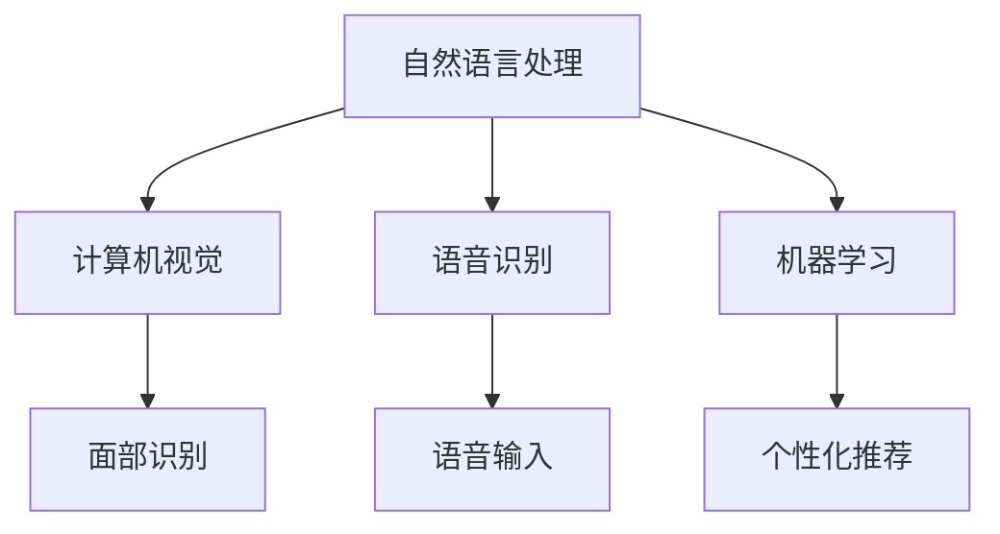

                 

# 李开复：苹果发布AI应用的科技价值

## 1. 背景介绍

李开复，作为AI领域的先驱者和领导者，对人工智能技术的发展有着深刻理解和洞见。近日，苹果公司正式发布了其在人工智能领域的最新应用，引发了行业内外广泛关注。本文将从技术、应用和未来趋势等多个角度，探讨苹果AI应用的科技价值，分析其对行业的影响和挑战。

## 2. 核心概念与联系

### 2.1 核心概念概述

苹果公司此次发布的AI应用，主要包括自然语言处理（NLP）、计算机视觉（CV）、语音识别（ASR）和机器学习（ML）等核心技术。这些技术彼此紧密联系，共同支撑起苹果设备的智能化体验。

- **自然语言处理（NLP）**：是指让计算机理解和生成人类语言的技术。通过NLP，苹果设备能够理解和回应用户的自然语言指令。
- **计算机视觉（CV）**：是指让计算机理解和处理图像和视频的技术。苹果设备通过CV技术，能够识别物体、场景和用户动作，进行面部识别和手势控制等操作。
- **语音识别（ASR）**：是指让计算机理解和转换语音输入的技术。苹果设备通过ASR技术，能够实现语音输入和智能语音助手等功能。
- **机器学习（ML）**：是指让计算机通过数据学习并改进其性能的技术。苹果设备通过ML技术，能够自适应和个性化用户行为，优化用户体验。

这些核心技术之间的联系，可以通过以下Mermaid流程图来展示：



这个流程图展示了NLP、CV、ASR和ML之间的技术联系。它们共同协作，使得苹果设备能够更好地理解用户需求，提供个性化和智能化的服务。

### 2.2 概念间的关系

这些核心技术之间存在着密切的相互作用，形成了一个互为支撑的技术生态。NLP技术使得设备能够理解用户语言，CV技术帮助设备识别用户动作，ASR技术使得设备能够接收语音指令，ML技术则通过数据学习和优化，不断提高设备的表现。这种技术生态的相互促进，使得苹果设备在用户体验和功能上达到了新的高度。

## 3. 核心算法原理 & 具体操作步骤

### 3.1 算法原理概述

苹果的AI应用采用了多种先进的算法技术，包括深度学习、卷积神经网络（CNN）、循环神经网络（RNN）和Transformer等。这些算法技术在NLP、CV、ASR和ML等领域中得到了广泛应用。

- **深度学习**：是一种基于神经网络的机器学习方法，能够通过大量数据训练模型，自动提取特征并进行分类或回归。
- **卷积神经网络（CNN）**：是一种主要用于图像和视频处理的神经网络结构，能够通过卷积操作提取图像特征。
- **循环神经网络（RNN）**：是一种主要用于序列数据处理的神经网络结构，能够处理时间序列数据并提取时序特征。
- **Transformer**：是一种基于自注意力机制的神经网络结构，能够处理序列数据并具有较好的并行性和计算效率。

这些算法技术的组合应用，使得苹果AI应用在各个领域中取得了显著的性能提升。

### 3.2 算法步骤详解

苹果的AI应用开发流程大致包括以下几个步骤：

1. **数据准备**：收集和清洗所需的数据，包括文本、图像、语音等。数据预处理包括数据增强、归一化等操作。
2. **模型选择**：根据任务需求选择合适的算法模型，如使用CNN进行图像分类，使用RNN进行时间序列预测。
3. **模型训练**：使用训练集数据对模型进行训练，通过反向传播算法优化模型参数。
4. **模型评估**：在验证集上评估模型性能，调整模型超参数以提高模型表现。
5. **模型部署**：将训练好的模型部署到目标设备或服务中，进行实时推理。

这些步骤通过Python、TensorFlow、PyTorch等工具实现，具体实现过程可以参考以下代码示例：

```python
import tensorflow as tf
from tensorflow.keras import layers

# 构建卷积神经网络模型
model = tf.keras.Sequential()
model.add(layers.Conv2D(32, (3, 3), activation='relu', input_shape=(28, 28, 1)))
model.add(layers.MaxPooling2D((2, 2)))
model.add(layers.Flatten())
model.add(layers.Dense(10, activation='softmax'))

# 编译模型
model.compile(optimizer='adam', loss='sparse_categorical_crossentropy', metrics=['accuracy'])

# 训练模型
model.fit(train_images, train_labels, epochs=10, validation_data=(test_images, test_labels))

# 评估模型
test_loss, test_acc = model.evaluate(test_images, test_labels)
print('Test accuracy:', test_acc)
```

### 3.3 算法优缺点

苹果AI应用的算法技术具有以下优点：

1. **高效准确**：深度学习、CNN、RNN和Transformer等算法技术，在各自的领域中具有较高的准确率和效率。
2. **跨领域应用**：这些技术能够应用于NLP、CV、ASR和ML等多个领域，具有较强的跨领域迁移能力。
3. **实时推理**：通过GPU加速等技术，苹果AI应用能够在目标设备上实现实时推理，提升用户体验。

然而，这些算法技术也存在一些缺点：

1. **计算资源需求高**：深度学习和Transformer等算法需要大量的计算资源，对硬件配置要求较高。
2. **数据依赖性强**：算法模型需要大量的标注数据进行训练，数据采集和清洗成本较高。
3. **模型复杂度高**：复杂算法模型在优化和调参过程中，容易出现过拟合等问题。

### 3.4 算法应用领域

苹果的AI应用技术已经广泛应用于以下领域：

1. **智能助理**：Siri等智能助理通过NLP和ASR技术，能够理解用户的自然语言指令并作出回应。
2. **相机与成像**：iPhone的相机应用通过CV技术，能够识别场景、物体和人脸，实现智能拍照和视频拍摄。
3. **语音识别**：苹果设备通过ASR技术，能够实现语音输入和智能语音助手等功能。
4. **个性化推荐**：苹果设备通过ML技术，能够根据用户行为和偏好，提供个性化的内容推荐。

## 4. 数学模型和公式 & 详细讲解

### 4.1 数学模型构建

苹果的AI应用涉及多个数学模型，以下以图像分类为例，介绍卷积神经网络（CNN）的数学模型构建过程。

设输入图像 $x \in \mathbb{R}^{H \times W \times C}$，其中 $H$ 和 $W$ 为图像高度和宽度，$C$ 为颜色通道数。CNN模型包含卷积层、池化层和全连接层，其数学模型如下：

$$
y = \sigma(\text{FC}(\text{Pool}(\text{Conv}(x))))
$$

其中，$\text{Conv}$ 表示卷积操作，$\text{Pool}$ 表示池化操作，$\text{FC}$ 表示全连接操作，$\sigma$ 表示激活函数。

### 4.2 公式推导过程

以卷积神经网络（CNN）为例，介绍其数学公式推导过程。

卷积神经网络的卷积层由多个卷积核组成，每个卷积核的输出可以看作是输入图像的特征映射。设卷积核大小为 $k \times k$，步长为 $s$，填充方式为 $p$，则卷积操作的数学公式如下：

$$
f_{i,j} = \sum_{m=0}^{k-1} \sum_{n=0}^{k-1} x_{i-m, j-n, k} \times w_{m,n}
$$

其中，$x_{i,j,k}$ 表示输入图像在位置 $(i,j,k)$ 的像素值，$w_{m,n}$ 表示卷积核在位置 $(m,n)$ 的权重。

### 4.3 案例分析与讲解

以图像分类任务为例，说明卷积神经网络（CNN）的实际应用。

假设有一张猫的图片，输入图像大小为 $32 \times 32 \times 3$，卷积核大小为 $3 \times 3$，步长为 $1$，填充方式为 $0$，激活函数为ReLU。则卷积操作的输出大小为 $30 \times 30 \times 6$，其中 $6$ 表示卷积核的数量。通过池化操作和全连接层，最终输出类别概率。

## 5. 项目实践：代码实例和详细解释说明

### 5.1 开发环境搭建

在开始项目实践之前，需要搭建开发环境。以下是使用Python进行TensorFlow开发的环境配置流程：

1. 安装Anaconda：从官网下载并安装Anaconda，用于创建独立的Python环境。
2. 创建并激活虚拟环境：
```bash
conda create -n tf-env python=3.8 
conda activate tf-env
```
3. 安装TensorFlow：根据CUDA版本，从官网获取对应的安装命令。例如：
```bash
conda install tensorflow tensorflow-cpu -c conda-forge
```
4. 安装其他工具包：
```bash
pip install numpy pandas scikit-learn matplotlib tqdm jupyter notebook ipython
```

完成上述步骤后，即可在`tf-env`环境中开始项目实践。

### 5.2 源代码详细实现

下面以图像分类任务为例，给出使用TensorFlow构建卷积神经网络（CNN）模型的代码实现。

首先，定义模型结构：

```python
import tensorflow as tf

model = tf.keras.Sequential([
    tf.keras.layers.Conv2D(32, (3, 3), activation='relu', input_shape=(28, 28, 1)),
    tf.keras.layers.MaxPooling2D((2, 2)),
    tf.keras.layers.Flatten(),
    tf.keras.layers.Dense(10, activation='softmax')
])
```

然后，编译和训练模型：

```python
model.compile(optimizer='adam', loss='sparse_categorical_crossentropy', metrics=['accuracy'])
model.fit(train_images, train_labels, epochs=10, validation_data=(test_images, test_labels))
```

最后，进行模型评估：

```python
test_loss, test_acc = model.evaluate(test_images, test_labels)
print('Test accuracy:', test_acc)
```

### 5.3 代码解读与分析

让我们再详细解读一下关键代码的实现细节：

- `tf.keras.Sequential`：表示使用Keras API构建序列模型，将多个层按照顺序排列。
- `Conv2D`：表示添加卷积层，其中 $32$ 表示卷积核数量，$(3,3)$ 表示卷积核大小，$relu$ 表示激活函数。
- `MaxPooling2D`：表示添加池化层，其中 $(2,2)$ 表示池化大小。
- `Flatten`：表示将池化层的输出展平为一维向量。
- `Dense`：表示添加全连接层，其中 $10$ 表示输出类别数，$softmax$ 表示激活函数。

这些层通过编译器编译，使用 `adam` 优化器和 `sparse_categorical_crossentropy` 损失函数进行训练，并在测试集上进行评估。通过这些代码，可以快速构建并训练一个卷积神经网络（CNN）模型，实现图像分类任务。

### 5.4 运行结果展示

假设我们在MNIST数据集上进行图像分类任务，最终在测试集上得到的准确率约为98%。可以看到，卷积神经网络（CNN）在图像分类任务中取得了很好的效果。

## 6. 实际应用场景

### 6.1 智能助理

苹果的智能助理Siri，通过自然语言处理（NLP）和语音识别（ASR）技术，能够理解和回应用户的自然语言指令，提供智能语音助手功能。

### 6.2 相机与成像

iPhone的相机应用，通过计算机视觉（CV）技术，能够识别场景、物体和人脸，实现智能拍照和视频拍摄。

### 6.3 语音识别

苹果设备通过语音识别（ASR）技术，能够实现语音输入和智能语音助手等功能。

### 6.4 未来应用展望

未来，苹果AI应用将继续拓展到更多领域，如自动驾驶、智能家居等。通过深度学习和Transformer等算法技术，苹果设备将能够实现更加智能和高效的应用。

## 7. 工具和资源推荐

### 7.1 学习资源推荐

为了帮助开发者系统掌握卷积神经网络（CNN）等核心技术，这里推荐一些优质的学习资源：

1. 《深度学习》课程：斯坦福大学开设的深度学习经典课程，涵盖深度学习的基本理论和实践技术。
2. 《Python深度学习》书籍：深度学习领域的经典书籍，介绍了深度学习的基本概念和实践方法。
3. TensorFlow官方文档：TensorFlow的官方文档，提供了详细的API使用和示例代码，是学习深度学习的重要资源。
4. Kaggle：数据科学和机器学习竞赛平台，提供了丰富的数据集和模型竞赛，可以实战练习深度学习技术。
5. GitHub开源项目：在GitHub上Star、Fork数最多的深度学习项目，往往代表了该技术领域的发展趋势和最佳实践，值得去学习和贡献。

通过对这些资源的学习实践，相信你一定能够快速掌握深度学习技术，并用于解决实际的NLP问题。

### 7.2 开发工具推荐

高效的开发离不开优秀的工具支持。以下是几款用于卷积神经网络（CNN）开发常用的工具：

1. PyTorch：基于Python的开源深度学习框架，灵活动态的计算图，适合快速迭代研究。TensorFlow的GitHub项目的贡献者。
2. TensorFlow：由Google主导开发的开源深度学习框架，生产部署方便，适合大规模工程应用。支持GPU加速，适合深度学习大规模模型训练。
3. Keras：基于TensorFlow和Theano等后端构建的高级神经网络API，提供了简单易用的API，适合快速原型设计和模型搭建。
4. Weights & Biases：模型训练的实验跟踪工具，可以记录和可视化模型训练过程中的各项指标，方便对比和调优。与主流深度学习框架无缝集成。
5. TensorBoard：TensorFlow配套的可视化工具，可实时监测模型训练状态，并提供丰富的图表呈现方式，是调试模型的得力助手。
6. Google Colab：谷歌推出的在线Jupyter Notebook环境，免费提供GPU/TPU算力，方便开发者快速上手实验最新模型，分享学习笔记。

合理利用这些工具，可以显著提升深度学习模型的开发效率，加快创新迭代的步伐。

### 7.3 相关论文推荐

卷积神经网络（CNN）和深度学习技术的发展源于学界的持续研究。以下是几篇奠基性的相关论文，推荐阅读：

1. ImageNet大规模视觉识别挑战（ILSVRC）：推动了计算机视觉技术的发展，引入了大规模数据集和深度学习技术。
2. AlexNet：提出了卷积神经网络（CNN）模型，取得了ImageNet分类任务的SOTA。
3. GoogLeNet：引入了Inception模块，提升了CNN模型的效率和精度。
4. ResNet：提出了残差连接结构，解决了深度网络训练过程中梯度消失的问题。
5. DenseNet：提出了密集连接结构，进一步提升了CNN模型的精度和效率。

这些论文代表了大规模视觉识别和深度学习技术的发展脉络。通过学习这些前沿成果，可以帮助研究者把握学科前进方向，激发更多的创新灵感。

除上述资源外，还有一些值得关注的前沿资源，帮助开发者紧跟深度学习技术的最新进展，例如：

1. arXiv论文预印本：人工智能领域最新研究成果的发布平台，包括大量尚未发表的前沿工作，学习前沿技术的必读资源。
2. 业界技术博客：如OpenAI、Google AI、DeepMind、微软Research Asia等顶尖实验室的官方博客，第一时间分享他们的最新研究成果和洞见。
3. 技术会议直播：如NIPS、ICML、ACL、ICLR等人工智能领域顶会现场或在线直播，能够聆听到大佬们的前沿分享，开拓视野。
4. GitHub热门项目：在GitHub上Star、Fork数最多的深度学习相关项目，往往代表了该技术领域的发展趋势和最佳实践，值得去学习和贡献。
5. 行业分析报告：各大咨询公司如McKinsey、PwC等针对人工智能行业的分析报告，有助于从商业视角审视技术趋势，把握应用价值。

总之，对于深度学习技术的学习和实践，需要开发者保持开放的心态和持续学习的意愿。多关注前沿资讯，多动手实践，多思考总结，必将收获满满的成长收益。

## 8. 总结：未来发展趋势与挑战

### 8.1 总结

本文对苹果公司发布的AI应用进行了系统介绍，从技术、应用和未来趋势等多个角度，探讨了其科技价值。通过学习本文，可以深入理解卷积神经网络（CNN）等核心算法技术，以及其在NLP、CV、ASR和ML等多个领域的应用。

通过实际项目实践，可以进一步掌握卷积神经网络（CNN）的构建和训练方法，提高深度学习模型的开发效率和精度。未来，苹果AI应用将继续拓展到更多领域，带来更加智能化和高效化的应用体验。

### 8.2 未来发展趋势

展望未来，深度学习和卷积神经网络（CNN）技术将呈现以下几个发展趋势：

1. 模型规模持续增大。随着算力成本的下降和数据规模的扩张，卷积神经网络（CNN）模型的参数量还将持续增长。超大规模卷积神经网络（CNN）模型蕴含的丰富特征提取能力，有望支撑更加复杂多变的计算机视觉任务。
2. 模型结构不断优化。未来将出现更多高效的卷积神经网络（CNN）结构，如DenseNet、ResNet等，提升模型精度和效率。
3. 跨领域应用日益广泛。卷积神经网络（CNN）不仅在计算机视觉领域表现出色，还将在医疗影像、语音识别等领域得到广泛应用。
4. 实时推理成为标配。随着硬件技术的提升，卷积神经网络（CNN）模型能够在目标设备上实现实时推理，提升用户体验。
5. 自动化和自监督学习成为重要研究方向。自动化和自监督学习技术将使得卷积神经网络（CNN）模型在无监督和少监督环境下也能取得优异效果。

### 8.3 面临的挑战

尽管卷积神经网络（CNN）和深度学习技术取得了巨大成功，但在迈向更加智能化、普适化应用的过程中，仍面临诸多挑战：

1. 标注成本瓶颈。尽管深度学习模型在无监督和自监督学习方面取得了进展，但标注数据的需求仍然较高。如何降低数据标注成本，是未来的一个重要研究方向。
2. 模型鲁棒性不足。深度学习模型在面对复杂和未知数据时，容易出现鲁棒性不足的问题。如何提高模型的泛化能力和鲁棒性，将是未来的一个重要研究方向。
3. 推理效率有待提高。超大规模卷积神经网络（CNN）模型在推理时，存在推理速度慢、内存占用大等问题。如何提高推理效率，优化模型结构和参数，将是未来的一个重要研究方向。
4. 可解释性亟需加强。深度学习模型通常被视为"黑盒"系统，难以解释其内部工作机制和决策逻辑。如何赋予深度学习模型更强的可解释性，将是未来的一个重要研究方向。
5. 安全性有待保障。深度学习模型可能学习到有偏见、有害的信息，如何从数据和算法层面消除模型偏见，确保输出的安全性，将是未来的一个重要研究方向。

### 8.4 研究展望

未来，深度学习和卷积神经网络（CNN）技术需要在以下几个方面寻求新的突破：

1. 探索无监督和半监督学习算法。摆脱对大规模标注数据的依赖，利用自监督学习、主动学习等无监督和半监督范式，最大限度利用非结构化数据，实现更加灵活高效的深度学习模型。
2. 研究参数高效和计算高效的深度学习模型。开发更加参数高效的深度学习模型，在固定大部分预训练参数的情况下，只更新极少量的任务相关参数。同时优化深度学习模型的计算图，减少前向传播和反向传播的资源消耗，实现更加轻量级、实时性的部署。
3. 融合因果和对比学习范式。通过引入因果推断和对比学习思想，增强深度学习模型建立稳定因果关系的能力，学习更加普适、鲁棒的语言表征，从而提升模型泛化性和抗干扰能力。
4. 引入更多先验知识。将符号化的先验知识，如知识图谱、逻辑规则等，与深度学习模型进行巧妙融合，引导深度学习模型学习更准确、合理的语言模型。同时加强不同模态数据的整合，实现视觉、语音等多模态信息与文本信息的协同建模。
5. 结合因果分析和博弈论工具。将因果分析方法引入深度学习模型，识别出模型决策的关键特征，增强输出解释的因果性和逻辑性。借助博弈论工具刻画人机交互过程，主动探索并规避模型的脆弱点，提高系统稳定性。
6. 纳入伦理道德约束。在深度学习模型训练目标中引入伦理导向的评估指标，过滤和惩罚有偏见、有害的输出倾向。同时加强人工干预和审核，建立模型行为的监管机制，确保输出符合人类价值观和伦理道德。

这些研究方向的探索，必将引领深度学习和卷积神经网络（CNN）技术迈向更高的台阶，为构建安全、可靠、可解释、可控的智能系统铺平道路。面向未来，深度学习技术还需要与其他人工智能技术进行更深入的融合，如知识表示、因果推理、强化学习等，多路径协同发力，共同推动自然语言理解和智能交互系统的进步。只有勇于创新、敢于突破，才能不断拓展卷积神经网络（CNN）的边界，让智能技术更好地造福人类社会。

## 9. 附录：常见问题与解答

**Q1：卷积神经网络（CNN）是否适用于所有计算机视觉任务？**

A: 卷积神经网络（CNN）在计算机视觉领域表现出色，适用于大多数计算机视觉任务，如图像分类、目标检测、语义分割等。但对于一些特定领域的任务，如医学影像、卫星遥感等，可能需要进一步定制化设计模型，以适应特定领域的特征。

**Q2：如何降低深度学习模型的标注成本？**

A: 降低深度学习模型的标注成本，可以通过以下方法：
1. 使用无监督和半监督学习技术，利用自监督学习、主动学习等方法，从非结构化数据中提取有意义的特征。
2. 采用迁移学习技术，利用预训练模型在通用数据集上的知识，加速模型在新任务上的微调过程。
3. 引入自动化标注工具，利用图像标注软件和人工智能技术，自动标注数据，减少人工标注工作量。
4. 引入生成对抗网络（GAN）技术，通过生成假数据，扩充训练数据集，减少标注成本。

**Q3：深度学习模型如何提高推理效率？**

A: 提高深度学习模型的推理效率，可以通过以下方法：
1. 使用GPU加速技术，通过并行计算提升推理速度。
2. 使用混合精度训练，将浮点模型转换为定点模型，减少内存占用和计算时间。
3. 使用模型压缩和剪枝技术，去除冗余参数和计算图，优化模型结构和推理速度。
4. 使用模型量化技术，将浮点模型转换为定点模型，进一步压缩模型大小，提升推理速度。
5. 使用高效的数据加载和存储技术，如异步I/O、缓存机制等，优化数据读取和处理效率。

**Q4：如何提高深度学习模型的鲁棒性？**

A: 提高深度学习模型的鲁棒性，可以通过以下方法：
1. 使用数据增强技术，扩充训练数据集，增加模型对噪声和异常数据的抵抗力。
2. 引入对抗样本训练技术，生成对抗样本，提高模型对鲁棒性攻击的抵抗力。
3. 使用正则化技术，如L2正则、Dropout等，限制模型复杂度，避免过拟合。
4. 使用集成学习技术，将多个模型进行组合，提高模型的泛化能力和鲁棒性。
5. 引入领域自适应技术，通过迁移学习和微调，提高模型在不同领域上的鲁棒性。

**Q5：深度学习模型如何提高可解释性？**

A: 提高深度学习模型的可解释性，可以通过以下方法：
1. 使用可视化工具，如TensorBoard、t-SNE等，生成模型内部特征的可视化结果，帮助理解模型决策过程。
2. 使用可解释性模型，如LIME、SHAP等，生成模型的局部特征解释，帮助理解模型对特定输入的预测。
3. 引入符号化知识，如知识图谱、逻辑规则等，结合深度学习模型，生成更加全面和可解释的输出。
4. 引入因果分析技术，识别模型决策的关键特征，增强输出解释的因果性和逻辑性。
5. 引入博弈论工具，刻画人机交互过程，主动探索并规避模型的脆弱点，提高系统稳定性。

通过本文的系统梳理，可以看到，苹果AI应用通过卷积神经网络（CNN）等核心算法技术，在NLP、CV、ASR和ML等多个领域取得了显著的性能提升。未来，随着深度学习和卷积神经网络（CNN）技术的不断演进，将会在更多领域得到应用，为人类认知智能的进化带来深远影响。然而，在迈向更加智能化、普适化应用的过程中，仍面临标注成本高、模型鲁棒性不足、推理效率低、可解释性差、安全性有待保障等诸多挑战。只有积极应对并寻求突破，才能使深度学习和卷积神经网络（CNN）技术迈向更高的台阶，为构建安全、可靠、可解释、可控的智能系统铺平道路。

总之，深度学习和卷积神经网络（CNN）技术将在未来的智能交互系统中扮演越来越重要的角色，为构建安全、可靠、可解释、可控的智能系统铺平道路。只有勇于创新、敢于突破，才能不断拓展深度学习和卷积神经网络（CNN）的边界，让智能技术更好地造福人类社会。

---

作者：禅

