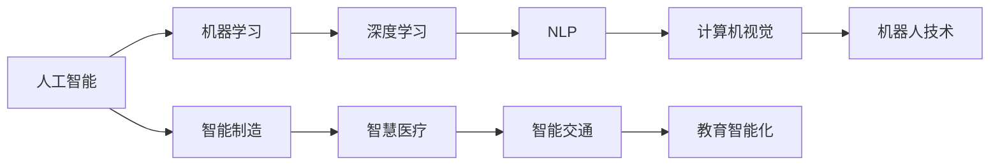

                 

## 1. 背景介绍

### 1.1 问题由来

随着人工智能（AI）技术的飞速发展，AI 正逐步渗透到各个行业和领域，成为推动社会进步和人类福祉的关键力量。从智能制造到智慧医疗，从智能交通到教育智能化，AI 技术的应用带来了前所未有的效率提升和成本节约，同时也带来了新的挑战和机遇。

然而，AI 技术的发展也引发了一系列社会伦理、公平性、隐私和安全等诸多问题。如何在追求技术进步的同时，保障社会的公平、透明和可控，是当前社会各界关注的焦点。构建一个更加智能的未来社会，需要我们深入理解 AI 技术的本质和应用，探索如何在 AI 驱动下实现可持续的社会进步。

### 1.2 问题核心关键点

构建智能社会是一个复杂的系统工程，涉及多个关键点：

1. **数据治理与隐私保护**：AI 技术依赖大量的数据，如何在保障隐私的前提下，合理利用数据资源，是智能社会建设的关键。
2. **公平性与透明性**：AI 系统在决策过程中可能存在偏见，如何在算法设计和模型训练中引入公平性和透明性原则，避免对特定群体的歧视。
3. **可解释性与可控性**：AI 系统应具备可解释性，使得用户和监管者能够理解其决策依据，同时系统应具备可控性，用户应能控制其行为。
4. **安全性与鲁棒性**：AI 系统应具备抵御恶意攻击和干扰的能力，确保系统的稳定性和可靠性。
5. **人机协作与伦理规范**：AI 系统应与人类协作，而不是取代人类，同时需要建立伦理规范，指导 AI 技术的合理应用。

这些关键点构成了构建智能社会的核心挑战，需要在技术创新、政策制定和公众教育等多方面进行协调和努力。

### 1.3 问题研究意义

研究 AI 技术在社会中的应用，对于推动社会进步和提高人类福祉具有重要意义：

1. **效率提升**：AI 技术可以自动化复杂、重复性的工作，提高生产力和效率。
2. **成本节约**：通过优化资源配置和运营管理，AI 技术可以显著降低社会运行成本。
3. **创新驱动**：AI 技术促进了跨学科和跨领域的创新，带来了新的商业模式和产品服务。
4. **公平性提升**：AI 技术可以帮助解决资源不均等问题，提高社会公平性。
5. **安全保障**：AI 技术可以提高社会安全性和应急响应能力。

然而，AI 技术在带来进步的同时，也可能带来新的风险和挑战，如就业替代、隐私侵犯、数据滥用等。因此，构建智能社会需要平衡技术创新与社会伦理的关系，确保 AI 技术的应用符合人类的价值观和利益。

## 2. 核心概念与联系

### 2.1 核心概念概述

要深入理解 AI 技术对社会发展的影响，首先需要了解一些关键概念：

1. **人工智能（AI）**：指通过计算机程序和算法，使计算机能够模拟人类智能行为的技术。
2. **机器学习（ML）**：指通过数据和算法，使机器能够自主学习、优化和决策的技术。
3. **深度学习（DL）**：指利用多层神经网络结构，实现复杂模式识别和决策的技术。
4. **自然语言处理（NLP）**：指使计算机能够理解和生成人类语言的技术。
5. **计算机视觉（CV）**：指使计算机能够理解和识别图像和视频的技术。
6. **机器人技术**：指通过 AI 技术，使机器人能够自主执行复杂任务的技术。
7. **智能制造**：指通过 AI 技术，实现生产流程自动化和智能化的技术。
8. **智慧医疗**：指通过 AI 技术，提高医疗诊断和治疗效率的技术。
9. **智能交通**：指通过 AI 技术，优化交通管理和提高交通效率的技术。
10. **教育智能化**：指通过 AI 技术，提升教育质量和个性化教学的技术。

这些概念之间存在紧密联系，通过协同工作，可以构建一个更加智能和高效的社会。

### 2.2 概念间的关系

这些核心概念之间的关系可以通过以下 Mermaid 流程图来展示：



这个流程图展示了人工智能技术如何通过不同的子技术和应用领域，实现对社会的广泛影响。

## 3. 核心算法原理 & 具体操作步骤

### 3.1 算法原理概述

构建智能社会的核心算法和技术包括：

1. **深度学习**：通过多层神经网络，实现对复杂数据和模式的自动学习和优化。
2. **自然语言处理**：通过算法和模型，使计算机能够理解和生成人类语言。
3. **计算机视觉**：通过算法和模型，使计算机能够理解和识别图像和视频。
4. **机器人技术**：通过算法和硬件，使机器人能够自主执行复杂任务。
5. **智能制造**：通过算法和自动化设备，实现生产流程的智能化和自动化。
6. **智慧医疗**：通过算法和数据分析，提高医疗诊断和治疗的效率和精准度。
7. **智能交通**：通过算法和传感器，优化交通管理和提高交通效率。
8. **教育智能化**：通过算法和个性化教学，提升教育质量和个性化教学。

这些算法和技术相互依存，共同推动了社会的发展和进步。

### 3.2 算法步骤详解

构建智能社会的步骤如下：

1. **数据收集和预处理**：收集和整理需要处理的数据，进行清洗和标准化。
2. **算法模型训练**：选择和设计合适的算法模型，进行训练和优化。
3. **模型部署和应用**：将训练好的模型部署到实际应用场景中，进行测试和优化。
4. **反馈与迭代**：根据实际应用效果，收集反馈信息，进行迭代优化。

### 3.3 算法优缺点

构建智能社会的算法和技术具有以下优点：

1. **效率提升**：通过自动化和智能化，提高了生产力和运营效率。
2. **成本节约**：通过优化资源配置和运营管理，降低了社会运行成本。
3. **创新驱动**：通过跨学科和跨领域的创新，带来了新的商业模式和产品服务。
4. **公平性提升**：通过优化资源配置，提高了社会公平性。
5. **安全保障**：通过优化安全机制和应急响应，提高了社会安全性。

然而，构建智能社会的算法和技术也存在一些缺点：

1. **数据依赖**：算法和技术依赖大量的数据，数据的获取和处理可能会带来隐私和安全问题。
2. **算法偏见**：算法和模型可能会引入和放大数据中的偏见，导致不公平和歧视。
3. **算法透明度**：一些算法和模型缺乏透明度，难以理解其决策依据。
4. **安全风险**：算法和技术可能被恶意攻击和利用，带来安全风险。
5. **伦理问题**：算法和技术的应用可能涉及伦理问题，需要建立规范和指导。

### 3.4 算法应用领域

AI 技术在多个领域的应用展示了其巨大的潜力：

1. **智能制造**：通过自动化和智能化，实现了生产流程的优化和效率提升。
2. **智慧医疗**：通过算法和数据分析，提高了医疗诊断和治疗的效率和精准度。
3. **智能交通**：通过算法和传感器，优化了交通管理和提高了交通效率。
4. **教育智能化**：通过算法和个性化教学，提升了教育质量和个性化教学。
5. **金融科技**：通过算法和数据分析，提高了金融服务的效率和精准度。
6. **智能客服**：通过算法和自然语言处理，提供了高效和个性化的客户服务。
7. **智能家居**：通过算法和传感器，提高了家居生活的便利性和智能化。
8. **环境保护**：通过算法和数据分析，优化了资源配置和环境保护。

这些应用展示了 AI 技术在社会各个领域中的广泛影响。

## 4. 数学模型和公式 & 详细讲解 & 举例说明

### 4.1 数学模型构建

构建智能社会的数学模型包括：

1. **监督学习**：通过标记好的数据，训练模型进行预测和分类。
2. **无监督学习**：通过未标记的数据，发现数据中的隐含模式和结构。
3. **强化学习**：通过奖励和惩罚机制，训练模型进行决策和优化。
4. **生成对抗网络（GANs）**：通过对抗训练，生成高质量的合成数据。
5. **迁移学习**：通过将一个领域学到的知识，迁移到另一个领域，提高模型的泛化能力。

### 4.2 公式推导过程

以监督学习为例，构建分类模型的过程如下：

1. **数据准备**：收集标记好的训练数据 $(x_i, y_i)$，其中 $x_i$ 为输入特征，$y_i$ 为标签。
2. **模型选择**：选择合适的网络结构和激活函数，如多层感知器（MLP）。
3. **损失函数**：选择合适的损失函数，如交叉熵损失函数。
4. **优化算法**：选择合适优化算法，如梯度下降算法。
5. **模型训练**：通过前向传播和反向传播，优化模型参数，最小化损失函数。
6. **模型评估**：通过验证集和测试集，评估模型的性能。

### 4.3 案例分析与讲解

以智能交通为例，通过深度学习算法进行交通流量预测和优化：

1. **数据准备**：收集历史交通流量数据和天气、节假日等外部因素数据。
2. **模型选择**：选择合适的网络结构和激活函数，如卷积神经网络（CNN）。
3. **损失函数**：选择合适损失函数，如均方误差损失函数。
4. **优化算法**：选择合适优化算法，如随机梯度下降算法。
5. **模型训练**：通过前向传播和反向传播，优化模型参数，最小化损失函数。
6. **模型评估**：通过测试集，评估模型的性能。
7. **应用部署**：将训练好的模型部署到实际交通管理系统，进行流量预测和优化。

## 5. 项目实践：代码实例和详细解释说明

### 5.1 开发环境搭建

构建智能社会的开发环境包括以下步骤：

1. **环境准备**：安装 Python 和相关依赖，如 TensorFlow、PyTorch、Keras 等。
2. **数据准备**：收集和整理需要处理的数据，进行清洗和标准化。
3. **算法选择**：选择和设计合适的算法模型，如深度神经网络。
4. **模型训练**：使用训练数据，进行模型训练和优化。
5. **模型部署**：将训练好的模型部署到实际应用场景中，进行测试和优化。

### 5.2 源代码详细实现

以智能交通流量预测为例，使用 TensorFlow 和 Keras 实现模型训练和预测：

```python
import tensorflow as tf
from tensorflow.keras import layers

# 定义模型结构
model = tf.keras.Sequential([
    layers.Dense(64, activation='relu', input_shape=(1,)),
    layers.Dense(32, activation='relu'),
    layers.Dense(1, activation='sigmoid')
])

# 定义损失函数和优化器
loss = tf.keras.losses.BinaryCrossentropy()
optimizer = tf.keras.optimizers.Adam()

# 训练模型
for epoch in range(100):
    # 前向传播
    predictions = model.predict(X_train)
    # 计算损失
    loss_value = loss(y_train, predictions).numpy()
    # 反向传播
    optimizer.apply_gradients(zip(grads, trainable_variables))
    # 输出损失
    print(f'Epoch {epoch+1}, Loss: {loss_value}')

# 模型评估
test_loss = model.evaluate(X_test, y_test)
print(f'Test Loss: {test_loss}')
```

### 5.3 代码解读与分析

这段代码展示了如何定义一个简单的神经网络模型，使用 TensorFlow 进行训练和预测。具体解释如下：

1. **模型结构定义**：使用 `Sequential` 定义了一个包含三个全连接层的神经网络，其中第一层有 64 个神经元，第二层有 32 个神经元，输出层只有一个神经元，使用 sigmoid 激活函数。
2. **损失函数和优化器选择**：选择二分类交叉熵损失函数和 Adam 优化器。
3. **模型训练**：通过循环迭代，使用训练数据进行模型训练和优化，输出每个 epoch 的损失值。
4. **模型评估**：在测试集上评估模型的性能，输出测试损失值。

## 6. 实际应用场景

### 6.1 智能制造

智能制造通过 AI 技术实现了生产流程的自动化和智能化。AI 技术可以用于生产计划优化、设备状态监测、产品质量检测等方面。

### 6.2 智慧医疗

智慧医疗通过 AI 技术提高了医疗诊断和治疗的效率和精准度。AI 技术可以用于医学影像分析、患者数据分析、药物研发等方面。

### 6.3 智能交通

智能交通通过 AI 技术优化了交通管理和提高了交通效率。AI 技术可以用于交通流量预测、交通信号控制、自动驾驶等方面。

### 6.4 教育智能化

教育智能化通过 AI 技术提升了教育质量和个性化教学。AI 技术可以用于学生行为分析、个性化推荐、虚拟助教等方面。

### 6.5 未来应用展望

未来，AI 技术将在更多领域得到应用，为社会带来更大变革。例如：

1. **智能城市**：通过 AI 技术实现城市管理的智能化和自动化。
2. **智慧农业**：通过 AI 技术实现农业生产的智能化和自动化。
3. **智能金融**：通过 AI 技术实现金融服务的智能化和精准度。
4. **智能教育**：通过 AI 技术实现教育的智能化和个性化。
5. **智能家居**：通过 AI 技术实现家居生活的智能化和便利性。
6. **智能物流**：通过 AI 技术实现物流管理的智能化和优化。

这些应用展示了 AI 技术在社会各个领域中的广泛影响，未来将为社会带来更多福祉。

## 7. 工具和资源推荐

### 7.1 学习资源推荐

以下是一些学习 AI 技术的优质资源：

1. **《深度学习》书籍**：由 Ian Goodfellow、Yoshua Bengio 和 Aaron Courville 所著，系统介绍了深度学习的基本理论和算法。
2. **Coursera《深度学习》课程**：由 Andrew Ng 主讲，涵盖了深度学习的各个方面。
3. **Kaggle 竞赛平台**：通过参加数据科学竞赛，提升实际应用能力。
4. **Google AI Blog**：分享最新的 AI 技术和研究成果。
5. **arXiv 论文预印本**：获取最新的人工智能研究论文。

### 7.2 开发工具推荐

以下是一些常用的 AI 开发工具：

1. **TensorFlow**：由 Google 主导开发的深度学习框架，支持分布式训练和部署。
2. **PyTorch**：由 Facebook 开发的深度学习框架，支持动态图和静态图。
3. **Keras**：基于 TensorFlow 和 Theano 的高级深度学习库，易于使用。
4. **MXNet**：由 Apache 开发的深度学习框架，支持分布式训练和部署。
5. **JAX**：由 Google 开发的自动微分和深度学习库，支持 GPU 和 TPU 加速。
6. **TorchScript**：PyTorch 的静态图模式，支持模型部署和优化。

### 7.3 相关论文推荐

以下是一些值得关注的人工智能研究论文：

1. **《ImageNet Classification with Deep Convolutional Neural Networks》**：Alex Krizhevsky、Ilya Sutskever、Geoffrey Hinton 发表的论文，展示了深度学习在图像分类任务上的强大能力。
2. **《Attention is All You Need》**：Ashish Vaswani 等人发表的论文，提出了 Transformer 架构，开启了 NLP 领域的预训练大模型时代。
3. **《BERT: Pre-training of Deep Bidirectional Transformers for Language Understanding》**：Jacob Devlin、Ming-Wei Chang、Kenton Lee、Christopher Toutanova 发表的论文，提出了 BERT 模型，刷新了多项 NLP 任务 SOTA。
4. **《GPT-3: Language Models are Unsupervised Multitask Learners》**：OpenAI 发表的论文，展示了 GPT-3 模型在零样本和少样本学习上的强大能力。
5. **《Parameter-Efficient Transfer Learning for NLP》**：Ada LoRa、Noah Constantinou、Kshitij Menon、Piotr Bojanowski、Cem Keskin、Tim Rocktäschel 发表的论文，提出了 Adapter 等参数高效微调方法。

## 8. 总结：未来发展趋势与挑战

### 8.1 研究成果总结

本文系统介绍了 AI 技术在社会各个领域的应用，展示了其巨大的潜力。AI 技术通过自动化和智能化，提高了生产力和运营效率，降低了社会运行成本，带来了新的商业模式和产品服务，提升了社会公平性，提高了社会安全性。

### 8.2 未来发展趋势

未来，AI 技术将进一步推动社会进步和人类福祉：

1. **更高效的生产力**：AI 技术将进一步提高生产力和运营效率，降低社会运行成本。
2. **更广泛的应用场景**：AI 技术将应用于更多领域，提升社会整体水平。
3. **更强的创新能力**：AI 技术将促进跨学科和跨领域的创新，带来新的商业模式和产品服务。
4. **更公平的社会**：AI 技术将优化资源配置，提高社会公平性。
5. **更安全的社会**：AI 技术将提高社会安全性和应急响应能力。

### 8.3 面临的挑战

构建智能社会仍然面临诸多挑战：

1. **数据依赖**：AI 技术依赖大量的数据，数据的获取和处理可能会带来隐私和安全问题。
2. **算法偏见**：算法和模型可能会引入和放大数据中的偏见，导致不公平和歧视。
3. **算法透明度**：一些算法和模型缺乏透明度，难以理解其决策依据。
4. **安全风险**：AI 技术可能被恶意攻击和利用，带来安全风险。
5. **伦理问题**：AI 技术的应用可能涉及伦理问题，需要建立规范和指导。

### 8.4 研究展望

未来的 AI 研究需要在多个方面进行深入探索：

1. **数据治理与隐私保护**：研究如何保护数据隐私和安全，优化数据获取和使用。
2. **公平性与透明性**：研究如何引入公平性和透明性原则，避免算法偏见。
3. **可解释性与可控性**：研究如何提高算法和模型的可解释性，增强用户和监管者的信任。
4. **安全性与鲁棒性**：研究如何提高算法的安全性和鲁棒性，确保系统的稳定性和可靠性。
5. **人机协作与伦理规范**：研究如何在 AI 技术应用中引入伦理规范，确保系统的合理性和人类价值观的一致性。

通过这些研究和探索，AI 技术将更好地服务于社会，推动人类社会的进步和发展。

## 9. 附录：常见问题与解答

**Q1: 构建智能社会需要哪些关键步骤？**

A: 构建智能社会需要以下关键步骤：
1. 数据收集和预处理
2. 算法模型训练
3. 模型部署和应用
4. 反馈与迭代

**Q2: AI 技术在各个领域的应用有哪些？**

A: AI 技术在多个领域的应用包括：
1. 智能制造
2. 智慧医疗
3. 智能交通
4. 教育智能化
5. 智能家居
6. 环境保护
7. 智能金融
8. 智能客服
9. 智能物流
10. 智能城市

**Q3: 如何提高 AI 算法的透明度和可解释性？**

A: 提高 AI 算法的透明度和可解释性可以通过以下方法：
1. 使用可解释的算法和模型，如决策树、规则推理等。
2. 引入因果分析和逻辑推理，增强算法的可解释性。
3. 使用解释性工具，如 LIME、SHAP 等，解释模型的决策依据。
4. 建立透明的算法和模型训练过程，确保算法的可控性和可信度。

**Q4: 如何确保 AI 系统的安全性和鲁棒性？**

A: 确保 AI 系统的安全性和鲁棒性可以通过以下方法：
1. 引入安全机制和应急响应，防止恶意攻击和干扰。
2. 优化模型训练和部署过程，提高系统的稳定性和可靠性。
3. 进行模型鲁棒性测试，确保模型对异常数据的适应能力。
4. 建立安全规范和标准，指导 AI 系统的设计和应用。

**Q5: 如何处理 AI 技术在伦理问题上的挑战？**

A: 处理 AI 技术在伦理问题上的挑战可以通过以下方法：
1. 引入伦理导向的评估指标，确保 AI 技术的应用符合人类价值观和伦理规范。
2. 建立伦理审查机制，对 AI 技术的应用进行监督和审查。
3. 加强公众教育，提升公众对 AI 技术的理解和接受度。
4. 引入伦理指导原则，指导 AI 技术的开发和应用。

通过这些研究和探索，AI 技术将更好地服务于社会，推动人类社会的进步和发展。

