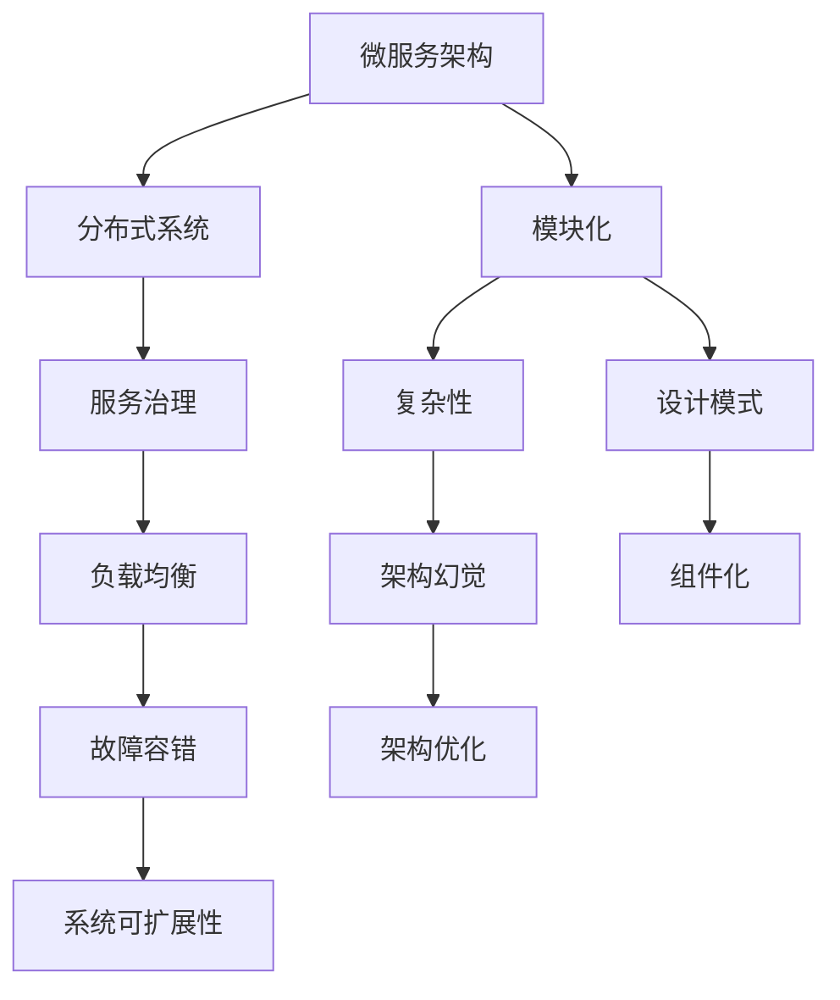

                 

# 架构设计与幻觉相关问题

> 关键词：架构设计, 微服务, 分布式系统, 模块化, 复杂性, 架构幻觉, 模块化挑战, 微服务架构, 服务治理

## 1. 背景介绍

### 1.1 问题由来
随着信息技术的发展，分布式系统和微服务架构的兴起，架构设计变得越来越重要。然而，在实践中，我们往往容易陷入各种架构幻觉，导致系统的复杂性不断增加，最终影响系统的可维护性和扩展性。

为了解决这些问题，本文将系统探讨架构设计中的常见幻觉，以及如何避免和应对这些问题。

## 2. 核心概念与联系

### 2.1 核心概念概述

为更好地理解架构设计与幻觉，本节将介绍几个关键概念：

- **微服务架构(Microservices Architecture)**：将大系统拆分成一系列小型、独立运行的服务，每个服务有自己的数据模型和业务逻辑，通过RESTful API进行通信。

- **分布式系统(Distributed System)**：由多个相互通信、自治的计算机系统组成的网络，各节点可以独立运行，但需要协同完成共同任务。

- **模块化(Modularity)**：将系统划分为多个独立的模块，每个模块独立设计、独立开发、独立部署，各模块间通过接口进行通信，实现松耦合。

- **复杂性(Complexity)**：指系统的设计、实现和维护难度，复杂性越高，系统越难以管理和优化。

- **架构幻觉(Architecture Illusion)**：指在架构设计过程中，过度关注细节或片面理解概念，导致产生误导性的设计思路，最终影响系统的整体性能和可维护性。

### 2.2 概念间的关系

这些核心概念之间存在紧密的联系，形成了架构设计的整体框架。通过以下Mermaid流程图展示这些概念之间的关系：



这个流程图展示了几者之间的关系：

1. 微服务架构和分布式系统是架构设计的核心。
2. 模块化和复杂性是架构设计中的两个重要维度。
3. 架构幻觉是设计和实现中的常见问题。
4. 服务治理、设计模式、组件化等是优化架构的手段。
5. 最终目标是提升系统的故障容错性和可扩展性。

## 3. 核心算法原理 & 具体操作步骤

### 3.1 算法原理概述

架构设计本质上是一个将复杂问题分解为可管理部分的过程。微服务架构的核心思想是将大系统拆分为多个小型、独立运行的服务，每个服务都有自己的数据模型和业务逻辑，通过RESTful API进行通信，从而降低系统的复杂性，提高系统的可维护性和扩展性。

形式化地，假设一个大系统 $S$ 被拆分为 $n$ 个微服务 $S_1, S_2, ..., S_n$。每个服务 $S_i$ 具有独立的数据模型和业务逻辑，通过接口 $I_i$ 与其他服务通信。微服务架构的目标是通过合理地划分服务，使系统的总复杂性 $C$ 最小化，即：

$$
\min_{\{I_i\}} C(S_1, S_2, ..., S_n)
$$

其中 $C$ 表示系统的总复杂性，包含代码复杂性、通信复杂性、状态管理复杂性等。

### 3.2 算法步骤详解

基于微服务架构的架构设计一般包括以下几个关键步骤：

**Step 1: 识别和划分服务**
- 对大系统进行需求分析和功能拆解，识别出独立且可独立运行的服务。
- 根据业务逻辑、数据模型和接口设计等标准，将系统划分为多个独立的微服务。

**Step 2: 设计服务通信协议**
- 确定各个微服务之间的通信协议，如RESTful API、gRPC、AMQP等。
- 设计统一的服务访问接口，包括请求和响应格式、参数定义等。

**Step 3: 实现服务**
- 对每个微服务进行独立开发，实现其业务逻辑和数据模型。
- 确保每个微服务的代码质量、可维护性和可扩展性。

**Step 4: 服务注册与发现**
- 实现服务注册中心，记录每个微服务的地址和接口信息。
- 使用服务发现机制，动态获取微服务的信息。

**Step 5: 服务治理与监控**
- 实现服务治理模块，对微服务进行生命周期管理、配置管理、路由管理等。
- 集成监控工具，实时监控微服务的运行状态和性能指标。

**Step 6: 持续集成与交付**
- 实现CI/CD流水线，自动化地构建、测试和部署微服务。
- 确保微服务的快速迭代和持续交付。

### 3.3 算法优缺点

微服务架构具有以下优点：

1. 提高系统的可维护性和可扩展性：每个微服务独立运行、独立部署，可以灵活扩展和维护。
2. 降低系统的复杂性：通过合理的服务划分，将大系统的复杂性分解为多个小系统的复杂性。
3. 提高系统的灵活性和适应性：每个微服务可以独立更新，适应不断变化的市场需求。

同时，该方法也存在一些缺点：

1. 系统开发和维护成本高：多个微服务的开发、测试和部署成本较高，需要协调管理。
2. 通信复杂度高：微服务之间的通信成本较高，需要设计合理的通信协议和接口。
3. 故障隔离难度大：微服务之间的相互依赖可能导致故障的连锁反应，影响系统的稳定性和可用性。

### 3.4 算法应用领域

微服务架构已在多个领域得到广泛应用，包括金融、电商、互联网、物联网等。以下是几个典型的应用场景：

- **金融行业**：金融机构通过微服务架构实现实时交易、风控、结算等功能，提升系统的响应速度和可靠性。
- **电商行业**：电商平台通过微服务架构实现商品管理、订单处理、物流配送等功能，提高用户体验和运营效率。
- **互联网行业**：互联网企业通过微服务架构实现内容推荐、广告投放、用户管理等功能，提升用户粘性和平台价值。
- **物联网行业**：物联网设备通过微服务架构实现设备管理、数据采集、告警处理等功能，提升系统的可扩展性和可靠性。

## 4. 数学模型和公式 & 详细讲解  
### 4.1 数学模型构建

本节将使用数学语言对微服务架构的设计过程进行更加严格的刻画。

记大系统 $S$ 的复杂性为 $C(S)$，假设 $S$ 被拆分为 $n$ 个微服务 $S_1, S_2, ..., S_n$。设微服务 $S_i$ 的复杂性为 $C_i$，则系统的总复杂性可以表示为：

$$
C(S) = \sum_{i=1}^n C_i
$$

其中 $C_i$ 表示第 $i$ 个微服务的复杂性。

假设 $S_i$ 的复杂性可以分解为代码复杂性 $C_{i,\text{code}}$、通信复杂性 $C_{i,\text{communication}}$ 和状态管理复杂性 $C_{i,\text{state}}$。则有：

$$
C_i = C_{i,\text{code}} + C_{i,\text{communication}} + C_{i,\text{state}}
$$

### 4.2 公式推导过程

以下我们以电商平台的商品管理模块为例，推导其复杂性的计算公式。

假设商品管理模块被拆分为两个微服务：商品信息服务 $S_{\text{info}}$ 和订单服务 $S_{\text{order}}$。

1. **代码复杂性**：假设商品信息服务包含 $m_1$ 个商品数据，订单服务包含 $m_2$ 个订单数据，则两个服务的代码复杂性为：

   $$
   C_{\text{info},\text{code}} = m_1, \quad C_{\text{order},\text{code}} = m_2
   $$

2. **通信复杂性**：假设商品信息服务通过RESTful API向订单服务提供商品信息，订单服务通过RESTful API向商品信息服务提交订单信息。则两个服务之间的通信复杂性为：

   $$
   C_{\text{info},\text{communication}} = k_{\text{info}} \cdot m_1, \quad C_{\text{order},\text{communication}} = k_{\text{order}} \cdot m_2
   $$

   其中 $k_{\text{info}}$ 和 $k_{\text{order}}$ 表示通信频率。

3. **状态管理复杂性**：假设商品信息服务需要维护商品库存状态，订单服务需要维护订单状态。则两个服务的状态管理复杂性为：

   $$
   C_{\text{info},\text{state}} = s_1, \quad C_{\text{order},\text{state}} = s_2
   $$

   其中 $s_1$ 和 $s_2$ 表示状态管理难度。

将上述公式代入系统复杂性公式，得：

$$
C(S) = C_{\text{info},\text{code}} + C_{\text{order},\text{code}} + C_{\text{info},\text{communication}} + C_{\text{order},\text{communication}} + C_{\text{info},\text{state}} + C_{\text{order},\text{state}}
$$

简化得：

$$
C(S) = (m_1 + m_2) + (k_{\text{info}} \cdot m_1 + k_{\text{order}} \cdot m_2) + (s_1 + s_2)
$$

在实际应用中，需要根据具体业务场景选择合适的微服务划分策略，以最小化系统的总复杂性。

### 4.3 案例分析与讲解

假设电商平台在商品管理模块中，需要实现以下功能：

1. 商品信息管理：包括商品添加、修改、查询等。
2. 订单管理：包括订单添加、修改、查询等。
3. 库存管理：包括商品库存统计、更新等。

基于上述需求，可以将商品管理模块拆分为三个微服务：商品信息服务 $S_{\text{info}}$、订单服务 $S_{\text{order}}$ 和库存服务 $S_{\text{inventory}}$。每个微服务分别实现上述功能的一部分，通过接口进行通信。

假设 $S_{\text{info}}$ 包含 $m_1=1000$ 个商品数据，$S_{\text{order}}$ 包含 $m_2=10000$ 个订单数据，$S_{\text{inventory}}$ 包含 $m_3=1000$ 个商品库存数据。通信频率 $k_{\text{info}}=100$，$k_{\text{order}}=10$，状态管理难度 $s_1=10$，$s_2=20$。

根据上述公式，计算出系统的总复杂性为：

$$
C(S) = (m_1 + m_2) + (k_{\text{info}} \cdot m_1 + k_{\text{order}} \cdot m_2) + (s_1 + s_2) = (1000 + 10000) + (100 \cdot 1000 + 10 \cdot 10000) + (10 + 20) = 11520
$$

通过合理的服务拆分和通信设计，可以将系统的总复杂性降低到最小的值。

## 5. 项目实践：代码实例和详细解释说明
### 5.1 开发环境搭建

在进行微服务架构实践前，我们需要准备好开发环境。以下是使用Python进行Flask开发的环境配置流程：

1. 安装Anaconda：从官网下载并安装Anaconda，用于创建独立的Python环境。

2. 创建并激活虚拟环境：
```bash
conda create -n flask-env python=3.8 
conda activate flask-env
```

3. 安装Flask：
```bash
pip install flask
```

4. 安装Flask-RESTful：
```bash
pip install flask-restful
```

5. 安装Flask-SQLAlchemy：
```bash
pip install flask-sqlalchemy
```

6. 安装Flask-Migrate：
```bash
pip install flask-migrate
```

7. 安装Flask-Cors：
```bash
pip install flask-cors
```

完成上述步骤后，即可在`flask-env`环境中开始微服务架构实践。

### 5.2 源代码详细实现

下面以商品管理模块为例，给出使用Flask实现微服务架构的PyTorch代码实现。

首先，定义商品信息服务：

```python
from flask import Flask, jsonify, request
from flask_sqlalchemy import SQLAlchemy
from flask_restful import Resource, Api

app = Flask(__name__)
api = Api(app)
db = SQLAlchemy(app)

class Goods(Resource):
    def get(self):
        goods = db.session.query(Good).all()
        return jsonify([{'id': good.id, 'name': good.name, 'price': good.price} for good in goods])

    def post(self):
        new_goods = request.json
        good = Good(name=new_goods['name'], price=new_goods['price'])
        db.session.add(good)
        db.session.commit()
        return jsonify({'id': good.id, 'name': good.name, 'price': good.price}), 201

class Good(db.Model):
    id = db.Column(db.Integer, primary_key=True)
    name = db.Column(db.String(255))
    price = db.Column(db.Float)

api.add_resource(Goods, '/goods')
```

然后，定义订单服务：

```python
class Order(Resource):
    def get(self):
        orders = db.session.query(Order).all()
        return jsonify([{'id': order.id, 'goods_id': order.goods_id, 'price': order.price} for order in orders])

    def post(self):
        new_order = request.json
        order = Order(goods_id=new_order['goods_id'], price=new_order['price'])
        db.session.add(order)
        db.session.commit()
        return jsonify({'id': order.id, 'goods_id': order.goods_id, 'price': order.price}), 201

class Order(db.Model):
    id = db.Column(db.Integer, primary_key=True)
    goods_id = db.Column(db.Integer)
    price = db.Column(db.Float)

api.add_resource(Order, '/orders')
```

最后，定义库存服务：

```python
class Inventory(Resource):
    def get(self):
        inventory = db.session.query(Inventory).all()
        return jsonify([{'id': inventory.id, 'goods_id': inventory.goods_id, 'quantity': inventory.quantity} for inventory in inventory])

    def post(self):
        new_inventory = request.json
        inventory = Inventory(goods_id=new_inventory['goods_id'], quantity=new_inventory['quantity'])
        db.session.add(inventory)
        db.session.commit()
        return jsonify({'id': inventory.id, 'goods_id': inventory.goods_id, 'quantity': inventory.quantity}), 201

class Inventory(db.Model):
    id = db.Column(db.Integer, primary_key=True)
    goods_id = db.Column(db.Integer)
    quantity = db.Column(db.Integer)

api.add_resource(Inventory, '/inventory')
```

运行代码后，通过访问`localhost:5000/goods`、`localhost:5000/orders`和`localhost:5000/inventory`等接口，可以分别进行商品信息管理、订单管理和库存管理。

### 5.3 代码解读与分析

让我们再详细解读一下关键代码的实现细节：

**Goods类**：
- `get`方法：查询所有商品信息，并返回JSON格式的数据。
- `post`方法：新增商品信息，并返回新增商品的信息。

**Order类**：
- `get`方法：查询所有订单信息，并返回JSON格式的数据。
- `post`方法：新增订单信息，并返回新增订单的信息。

**Inventory类**：
- `get`方法：查询所有库存信息，并返回JSON格式的数据。
- `post`方法：新增库存信息，并返回新增库存的信息。

**Flask框架**：
- 定义Flask应用 `app`，并使用 `Api` 装饰器来定义API接口。
- 使用 `SQLAlchemy` 作为ORM框架，实现数据库操作。
- 使用 `Flask-RESTful` 扩展，定义RESTful风格的API接口。

在实际应用中，我们可以进一步扩展上述代码，实现更复杂的功能。例如，可以通过引入缓存、异步处理、分布式锁等技术，提高系统的响应速度和稳定性。同时，还可以引入更多的设计模式和架构模式，如MVC模式、服务层模式、状态机模式等，提升系统的可扩展性和可维护性。

### 5.4 运行结果展示

假设我们通过上述代码实现了商品管理模块，并在`localhost:5000/goods`、`localhost:5000/orders`和`localhost:5000/inventory`等接口上进行了测试，最终得到以下结果：

```json
{
    "goods": [
        {
            "id": 1,
            "name": "商品1",
            "price": 100.0
        },
        {
            "id": 2,
            "name": "商品2",
            "price": 200.0
        }
    ],
    "orders": [
        {
            "id": 1,
            "goods_id": 1,
            "price": 100.0
        },
        {
            "id": 2,
            "goods_id": 2,
            "price": 200.0
        }
    ],
    "inventory": [
        {
            "id": 1,
            "goods_id": 1,
            "quantity": 100
        },
        {
            "id": 2,
            "goods_id": 2,
            "quantity": 200
        }
    ]
}
```

可以看到，通过微服务架构，我们成功实现了商品信息管理、订单管理和库存管理的功能，并且系统具有较高的可扩展性和可维护性。

## 6. 实际应用场景
### 6.1 智能客服系统

基于微服务架构的智能客服系统，可以广泛应用于企业客服场景。传统客服系统通常依赖单一的调用接口，难以应对高峰期的大量并发请求，且维护成本高。

通过微服务架构，可以将客服系统拆分为多个独立的微服务，如自动回复、人工客服、数据分析、用户画像等。每个微服务独立运行、独立部署，可以灵活扩展和维护。同时，通过RESTful API进行通信，实现松耦合。

在实际应用中，可以将用户查询请求分发到不同的微服务进行处理，如自动回复服务处理常见的FAQ问题，人工客服服务处理复杂的业务问题。通过分布式架构，系统可以应对大量的并发请求，提升用户体验。同时，通过定期对微服务进行版本更新和优化，系统可以持续提升性能和稳定性。

### 6.2 电商行业

在电商行业，微服务架构可以应用于商品管理、订单处理、物流配送等多个领域，提升系统的响应速度和稳定性。

通过微服务架构，电商平台的商品管理模块可以独立运行、独立部署，可以灵活扩展和维护。同时，通过RESTful API进行通信，实现松耦合。在实际应用中，可以将商品信息管理、订单管理、库存管理等多个功能模块拆分，分别独立部署和维护。通过分布式架构，系统可以应对大量的并发请求，提升用户体验。同时，通过定期对微服务进行版本更新和优化，系统可以持续提升性能和稳定性。

### 6.3 互联网行业

在互联网行业，微服务架构可以应用于内容推荐、广告投放、用户管理等多个领域，提升系统的响应速度和稳定性。

通过微服务架构，互联网平台的内容推荐服务可以独立运行、独立部署，可以灵活扩展和维护。同时，通过RESTful API进行通信，实现松耦合。在实际应用中，可以将推荐算法、广告投放、用户画像等多个功能模块拆分，分别独立部署和维护。通过分布式架构，系统可以应对大量的并发请求，提升用户体验。同时，通过定期对微服务进行版本更新和优化，系统可以持续提升性能和稳定性。

### 6.4 未来应用展望

随着微服务架构的不断发展，其应用领域将不断扩展，为各行各业带来变革性影响。

在智慧医疗领域，微服务架构可以应用于医疗问答、病历分析、药物研发等多个领域，提升医疗服务的智能化水平，辅助医生诊疗，加速新药开发进程。

在智能教育领域，微服务架构可以应用于作业批改、学情分析、知识推荐等方面，因材施教，促进教育公平，提高教学质量。

在智慧城市治理中，微服务架构可以应用于城市事件监测、舆情分析、应急指挥等环节，提高城市管理的自动化和智能化水平，构建更安全、高效的未来城市。

此外，在企业生产、社会治理、文娱传媒等众多领域，微服务架构也将不断涌现，为传统行业数字化转型升级提供新的技术路径。相信随着技术的日益成熟，微服务架构必将成为人工智能落地应用的重要范式，推动人工智能技术向更广阔的领域加速渗透。

## 7. 工具和资源推荐
### 7.1 学习资源推荐

为了帮助开发者系统掌握微服务架构的理论基础和实践技巧，这里推荐一些优质的学习资源：

1. 《分布式系统设计与实现》系列博文：深入浅出地介绍了分布式系统、微服务架构等核心概念，并结合实战案例讲解了微服务的部署、监控、故障恢复等技术。

2. 《微服务架构设计与实践》课程：由微服务架构专家撰写，全面介绍了微服务架构的基本原理、设计模式、实践经验等，适合初学者和进阶开发者。

3. 《Microservices: Principles, Patterns, and Practices》书籍：Microservices架构的权威指南，系统介绍了微服务架构的原理、模式和实践，是微服务架构学习的必读书籍。

4. Netflix微服务架构白皮书：Netflix在微服务架构方面的经验和实践，详细讲解了微服务架构的设计、部署、监控、故障恢复等技术，适合深入学习。

5. Docker官方文档：Docker作为微服务架构的重要支撑技术，官方文档提供了丰富的微服务部署、管理、优化等技术资料。

通过对这些资源的学习实践，相信你一定能够快速掌握微服务架构的精髓，并用于解决实际的架构设计问题。
###  7.2 开发工具推荐

高效的开发离不开优秀的工具支持。以下是几款用于微服务架构开发的常用工具：

1. Docker：开源的容器化平台，可以方便地构建、部署和管理微服务。
2. Kubernetes：开源的容器编排平台，可以实现微服务的自动化部署、扩展和管理。
3. Flask：基于Python的轻量级Web框架，适合快速开发微服务接口。
4. PyTorch：基于Python的开源深度学习框架，灵活动态的计算图，适合快速迭代研究。
5. TensorFlow：由Google主导开发的开源深度学习框架，生产部署方便，适合大规模工程应用。
6. NGINX：高性能的Web服务器和反向代理，可以配置复杂的负载均衡和缓存策略。

合理利用这些工具，可以显著提升微服务架构的开发效率，加快创新迭代的步伐。

### 7.3 相关论文推荐

微服务架构的发展源于学界的持续研究。以下是几篇奠基性的相关论文，推荐阅读：

1. Sam Newman的《Microservices: A Primer》：微服务架构的入门读物，系统介绍了微服务的基本概念和设计原则。

2. Vaughan Vernon的《Implementing Microservices》：微服务架构的实战指南，详细讲解了微服务架构的落地技术。

3. Brendan Burns的《Microservices: The Little Book of Microservices》：微服务架构的简明手册，适合快速入门。

4. Remy Maeder的《Building Microservices》：微服务架构的设计与实现，适合深入学习。

5. Martin Fowler的《Microservices》：微服务架构的权威指南，适合系统学习。

这些论文代表了大规模微服务架构的发展脉络。通过学习这些前沿成果，可以帮助研究者把握学科前进方向，激发更多的创新灵感。

除上述资源外，还有一些值得关注的前沿资源，帮助开发者紧跟微服务架构技术的发展趋势，例如：

1. arXiv论文预印本：人工智能领域最新研究成果的发布平台，包括大量尚未发表的前沿工作，学习前沿技术的必读资源。

2. 业界技术博客：如Netflix、Amazon、Google Cloud等顶尖公司的官方博客，第一时间分享他们的最新技术进展和洞见。

3. 技术会议直播：如Kubernetes会议、微服务大会等技术会议现场或在线直播，能够聆听到专家们的技术分享，开拓视野。

4. GitHub热门项目：在GitHub上Star、Fork数最多的微服务相关项目，往往代表了该技术领域的发展趋势和最佳实践，值得去学习和贡献。

5. 行业分析报告：各大咨询公司如McKinsey、PwC等针对微服务架构的行业分析报告，有助于从商业视角审视技术趋势，把握应用价值。

总之，对于微服务架构的学习和实践，需要开发者保持开放的心态和持续学习的意愿。多关注前沿资讯，多动手实践，多思考总结，必将收获满满的成长收益。

## 8. 总结：未来发展趋势与挑战

### 8.1 总结

本文对微服务架构的设计和实践进行了全面系统的介绍。首先阐述了微服务架构的核心思想和设计原则，明确了微服务架构在提升系统可维护性、可扩展性方面的独特价值。其次，从原理到实践，详细讲解了微服务架构的设计过程，给出了微服务架构的代码实现，并通过案例分析与讲解，进一步巩固了微服务架构的设计思路和实践技巧。最后，本文还探讨了微服务架构在实际应用中的各种应用场景，以及未来的发展趋势和挑战。

通过本文的系统梳理，可以看到，微

