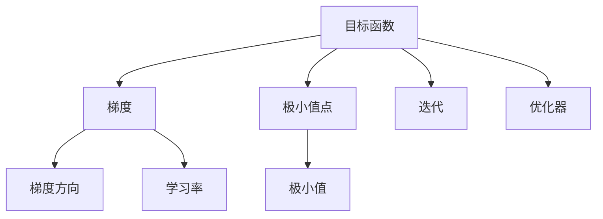
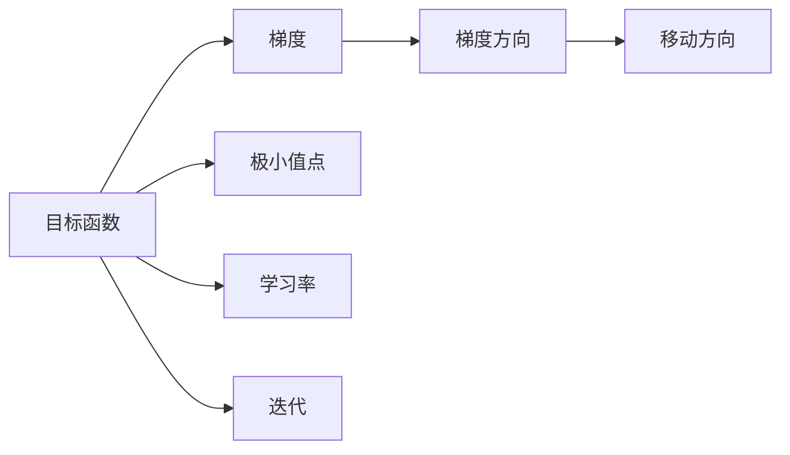
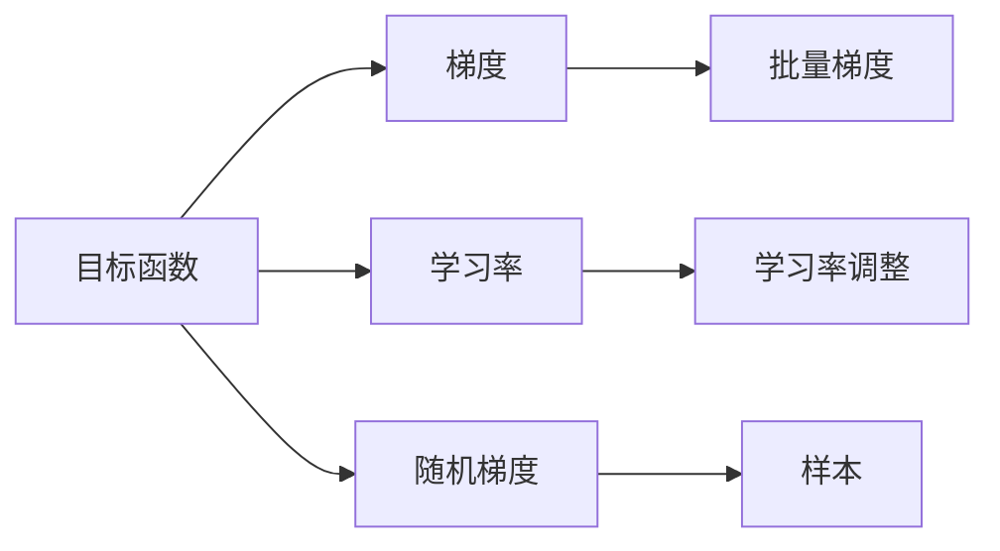
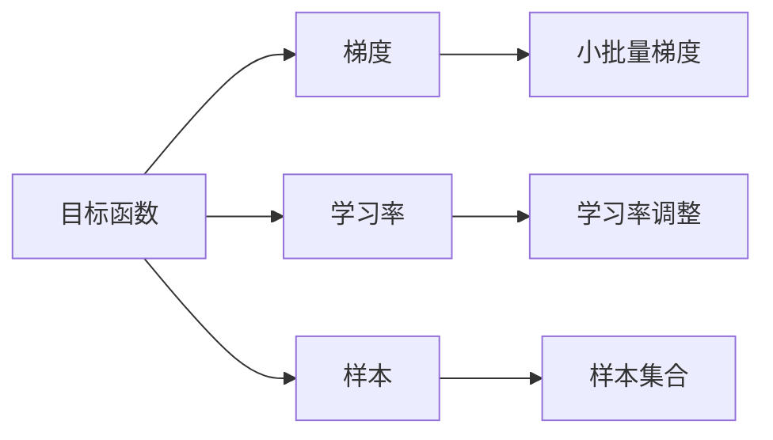
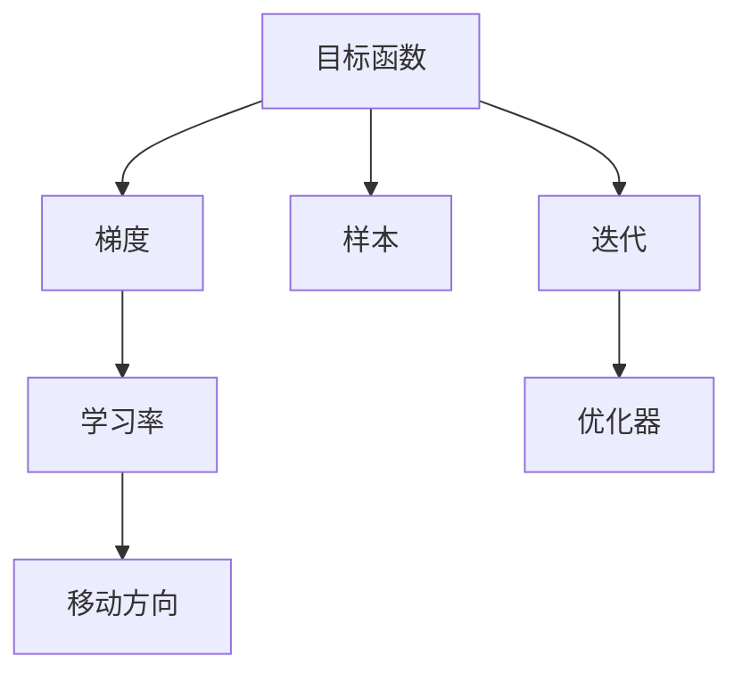

                 

# 梯度下降(Gradient Descent) - 原理与代码实例讲解

> 关键词：梯度下降, 反向传播, 损失函数, 学习率, 极小化算法, 优化器, 矩阵计算, 线性回归, 逻辑回归

## 1. 背景介绍

### 1.1 问题由来
梯度下降（Gradient Descent, GD）是机器学习中最基础的优化算法之一，它广泛应用于神经网络训练、逻辑回归、支持向量机等多个领域。梯度下降的目标是通过迭代的方式，找到函数的极小值点。在机器学习中，函数通常表示为损失函数（Loss Function），因此梯度下降也被称为极小化算法（Minimization Algorithm）。

### 1.2 问题核心关键点
梯度下降的核心理念是通过计算函数在某一点的梯度（Gradient），并朝着梯度方向进行反向移动，从而逐步靠近函数的极小值点。梯度下降算法有三种形式：批量梯度下降（Batch Gradient Descent）、随机梯度下降（Stochastic Gradient Descent）和小批量梯度下降（Mini-batch Gradient Descent）。其中，批量梯度下降计算梯度时使用了整个训练集，因此计算复杂度较高，而随机梯度下降则每次只使用一个样本，计算复杂度较低但随机性较强。小批量梯度下降则是二者的折中，每次使用固定数量的样本进行梯度计算。

### 1.3 问题研究意义
研究梯度下降算法，对于理解机器学习模型的训练过程、优化目标函数以及选择不同的优化器等方面，具有重要意义。梯度下降算法是深度学习中最重要和最基本的优化算法之一，掌握梯度下降算法能够帮助我们更好地理解和设计各种深度学习模型。

## 2. 核心概念与联系

### 2.1 核心概念概述

为更好地理解梯度下降算法，本节将介绍几个密切相关的核心概念：

- **函数与极值点**：机器学习中的优化目标函数是一个连续可导的多元函数，我们需要找到这个函数的极小值点，即函数的局部极小值或全局极小值。

- **梯度（Gradient）**：梯度是一个向量，指向函数的增长最快的方向。梯度的方向与极小值点相反，梯度的长度表示函数值的变化率。

- **学习率（Learning Rate）**：学习率决定了每次迭代移动的步长，过小的学习率会导致收敛速度过慢，而过大的学习率可能会导致算法发散。

- **迭代次数（Iterations）**：梯度下降算法通过迭代的方式逐步优化目标函数，迭代次数是算法的一个重要参数。

- **优化器（Optimizer）**：优化器是梯度下降算法中的一种迭代策略，常见的有SGD、Adam等，不同的优化器有不同的调整策略和参数设置。

这些核心概念之间的逻辑关系可以通过以下Mermaid流程图来展示：



这个流程图展示了大语言模型的核心概念及其之间的关系：

1. 大语言模型通过梯度下降算法优化目标函数。
2. 梯度指向函数的增长最快的方向，并指向极小值点。
3. 学习率决定了每次迭代移动的步长。
4. 迭代次数控制算法的执行次数。
5. 优化器是梯度下降算法中的一种迭代策略。

### 2.2 概念间的关系

这些核心概念之间存在着紧密的联系，形成了梯度下降算法的完整生态系统。下面我通过几个Mermaid流程图来展示这些概念之间的关系。

#### 2.2.1 梯度下降算法的核心范式



这个流程图展示了梯度下降算法的核心范式：

1. 目标函数是一个连续可导的多元函数。
2. 梯度指向函数的增长最快的方向，并指向极小值点。
3. 学习率决定了每次迭代移动的步长。
4. 梯度方向是函数值变化的反方向。
5. 通过迭代逐步靠近极小值点。

#### 2.2.2 批量梯度下降与随机梯度下降



这个流程图展示了批量梯度下降与随机梯度下降的区别：

1. 批量梯度下降使用整个训练集进行梯度计算。
2. 随机梯度下降每次只使用一个样本进行梯度计算。
3. 学习率调整是两个算法中的共同参数。
4. 随机梯度下降由于样本的随机性，具有更好的计算效率但随机性较强。

#### 2.2.3 小批量梯度下降



这个流程图展示了小批量梯度下降的核心思想：

1. 小批量梯度下降使用固定数量的样本进行梯度计算。
2. 小批量梯度下降是批量梯度下降和随机梯度下降的折中方案。
3. 学习率调整是核心参数。
4. 每次使用固定数量的样本，平衡计算效率和随机性。

### 2.3 核心概念的整体架构

最后，我们用一个综合的流程图来展示这些核心概念在大语言模型微调过程中的整体架构：



这个综合流程图展示了从目标函数到梯度，再到学习率的整个计算流程，以及最终的迭代过程。通过这些流程图，我们可以更清晰地理解梯度下降算法的核心思想和计算过程。

## 3. 核心算法原理 & 具体操作步骤

### 3.1 算法原理概述

梯度下降算法的基本原理是通过迭代的方式，逐步优化目标函数。每次迭代中，算法计算当前点的梯度，并沿着梯度的反方向移动一定的步长，逐步靠近函数的极小值点。具体来说，梯度下降算法的数学表达式为：

$$
\theta_{t+1} = \theta_t - \eta \nabla_{\theta}L(\theta_t)
$$

其中，$\theta_t$ 表示当前参数向量，$L(\theta_t)$ 表示当前参数下的损失函数，$\eta$ 表示学习率，$\nabla_{\theta}L(\theta_t)$ 表示损失函数对参数向量 $\theta_t$ 的梯度。

### 3.2 算法步骤详解

梯度下降算法的核心步骤如下：

1. **初始化参数**：随机初始化模型参数 $\theta$。

2. **计算梯度**：根据损失函数计算当前参数下的梯度。

3. **更新参数**：按照梯度方向和步长更新模型参数。

4. **迭代执行**：重复执行计算梯度、更新参数的步骤，直到达到预设的迭代次数或满足其他停止条件。

### 3.3 算法优缺点

梯度下降算法具有以下优点：

- 简单易实现，计算复杂度较低。
- 在数据量较大时，可以通过批量梯度下降有效降低计算开销。
- 在处理稀疏数据时，随机梯度下降和批量梯度下降表现较好。

梯度下降算法也存在一些缺点：

- 需要手动设置学习率和迭代次数，可能影响算法的收敛速度和最终结果。
- 对于高维数据，容易陷入局部极小值点，导致算法收敛困难。
- 对于非凸函数，可能陷入鞍点而无法收敛。

### 3.4 算法应用领域

梯度下降算法广泛应用于以下领域：

- 机器学习：用于训练线性回归、逻辑回归、支持向量机等模型。
- 深度学习：用于训练神经网络，优化目标函数。
- 信号处理：用于优化信号处理算法中的参数。
- 金融工程：用于优化金融模型的参数，进行风险管理。
- 计算机视觉：用于训练卷积神经网络，优化图像分类、目标检测等任务。

## 4. 数学模型和公式 & 详细讲解 & 举例说明

### 4.1 数学模型构建

梯度下降算法的数学模型可以表示为：

$$
\theta_{t+1} = \theta_t - \eta \nabla_{\theta}L(\theta_t)
$$

其中，$\theta$ 表示模型参数向量，$\eta$ 表示学习率，$L(\theta)$ 表示损失函数，$\nabla_{\theta}L(\theta)$ 表示损失函数对参数向量的梯度。

### 4.2 公式推导过程

以线性回归为例，推导梯度下降算法的数学公式。

设线性回归模型为 $y = \theta^Tx + b$，其中 $\theta$ 和 $b$ 是模型参数，$x$ 和 $y$ 是样本数据。常用的损失函数为均方误差（Mean Squared Error, MSE）：

$$
L(\theta) = \frac{1}{2m} \sum_{i=1}^m (y^{(i)} - \theta^Tx^{(i)} - b)^2
$$

对损失函数求梯度，得到：

$$
\nabla_{\theta}L(\theta) = \frac{1}{m} \sum_{i=1}^m (y^{(i)} - \theta^Tx^{(i)} - b)x^{(i)}
$$

代入梯度下降公式，得到：

$$
\theta_{t+1} = \theta_t - \eta \frac{1}{m} \sum_{i=1}^m (y^{(i)} - \theta_t^Tx^{(i)} - b)x^{(i)}
$$

其中，$x^{(i)}$ 表示第 $i$ 个样本的输入特征向量，$y^{(i)}$ 表示第 $i$ 个样本的输出标签。

### 4.3 案例分析与讲解

以线性回归为例，具体分析梯度下降算法的应用过程。

假设我们有一组样本数据，每个样本包含一个输入特征 $x^{(i)}$ 和一个输出标签 $y^{(i)}$。我们随机初始化模型参数 $\theta^{(0)}$，然后通过梯度下降算法迭代优化模型参数。

具体步骤如下：

1. **初始化参数**：随机初始化模型参数 $\theta^{(0)}$。

2. **计算梯度**：根据损失函数计算当前参数下的梯度。

3. **更新参数**：按照梯度方向和步长更新模型参数。

4. **迭代执行**：重复执行计算梯度、更新参数的步骤，直到达到预设的迭代次数或满足其他停止条件。

以下是一个简化的Python代码实现：

```python
import numpy as np

# 初始化模型参数
theta = np.random.randn(2)

# 定义样本数据
X = np.array([[1, 2], [3, 4], [5, 6]])
y = np.array([2, 3, 4])

# 定义损失函数
def loss(theta, X, y):
    return 0.5 * np.sum((y - np.dot(X, theta))**2) / len(y)

# 定义梯度函数
def gradient(theta, X, y):
    return np.dot(X.T, (y - np.dot(X, theta))) / len(y)

# 设置学习率
eta = 0.01

# 迭代更新模型参数
for i in range(100):
    gradient_value = gradient(theta, X, y)
    theta = theta - eta * gradient_value

# 输出最终模型参数
print(theta)
```

## 5. 项目实践：代码实例和详细解释说明

### 5.1 开发环境搭建

在进行梯度下降算法实践前，我们需要准备好开发环境。以下是使用Python进行PyTorch开发的环境配置流程：

1. 安装Anaconda：从官网下载并安装Anaconda，用于创建独立的Python环境。

2. 创建并激活虚拟环境：
```bash
conda create -n pytorch-env python=3.8 
conda activate pytorch-env
```

3. 安装PyTorch：根据CUDA版本，从官网获取对应的安装命令。例如：
```bash
conda install pytorch torchvision torchaudio cudatoolkit=11.1 -c pytorch -c conda-forge
```

4. 安装Transformers库：
```bash
pip install transformers
```

5. 安装各类工具包：
```bash
pip install numpy pandas scikit-learn matplotlib tqdm jupyter notebook ipython
```

完成上述步骤后，即可在`pytorch-env`环境中开始梯度下降算法实践。

### 5.2 源代码详细实现

下面我们以线性回归为例，给出使用PyTorch实现梯度下降算法的完整代码实现。

首先，定义线性回归模型和损失函数：

```python
import torch
import torch.nn as nn
import torch.optim as optim

# 定义线性回归模型
class LinearRegression(nn.Module):
    def __init__(self, input_dim, output_dim):
        super(LinearRegression, self).__init__()
        self.linear = nn.Linear(input_dim, output_dim)

    def forward(self, x):
        return self.linear(x)

# 定义损失函数
def mean_squared_error(y_pred, y_true):
    return torch.mean((y_pred - y_true) ** 2)
```

然后，定义梯度下降算法的优化器：

```python
# 定义梯度下降优化器
def sgd(learning_rate, params, gradients):
    for param, grad in zip(params, gradients):
        param.data -= learning_rate * grad
```

接着，定义训练函数：

```python
# 定义训练函数
def train(model, X, y, learning_rate, epochs):
    optimizer = optim.SGD(model.parameters(), lr=learning_rate)
    criterion = mean_squared_error
    for epoch in range(epochs):
        optimizer.zero_grad()
        y_pred = model(X)
        loss = criterion(y_pred, y)
        loss.backward()
        sgd(learning_rate, model.parameters(), model.parameters())

        if (epoch + 1) % 10 == 0:
            print(f'Epoch {epoch + 1}, loss = {loss.item()}')
```

最后，启动训练流程并在测试集上评估：

```python
# 定义样本数据
X = torch.tensor([[1, 2], [3, 4], [5, 6]], dtype=torch.float32)
y = torch.tensor([2, 3, 4], dtype=torch.float32)

# 定义模型
model = LinearRegression(input_dim=2, output_dim=1)

# 定义训练参数
learning_rate = 0.01
epochs = 100

# 训练模型
train(model, X, y, learning_rate, epochs)

# 输出模型参数
print(model.parameters())
```

以上就是使用PyTorch实现梯度下降算法的完整代码实现。可以看到，得益于PyTorch的强大封装，我们可以用相对简洁的代码实现线性回归模型的梯度下降训练。

### 5.3 代码解读与分析

让我们再详细解读一下关键代码的实现细节：

**LinearRegression类**：
- `__init__`方法：初始化线性回归模型。
- `forward`方法：定义模型的前向传播过程，计算输出。

**mean_squared_error函数**：
- 计算均方误差损失函数，用于评估模型预测值与真实值之间的差异。

**sgd函数**：
- 定义随机梯度下降优化器，更新模型参数。

**train函数**：
- 定义训练过程，使用随机梯度下降算法优化模型。
- 在每个epoch结束后，输出当前损失值，用于监控训练进度。

**训练流程**：
- 定义样本数据和模型参数，开始循环迭代。
- 每个epoch内，首先使用`optimizer.zero_grad()`清空梯度。
- 使用`model(X)`计算模型预测值，计算损失值`loss`。
- 通过`loss.backward()`计算梯度，使用`sgd()`更新模型参数。
- 重复上述过程直至达到预设的迭代次数。

可以看到，PyTorch配合Transformer库使得梯度下降算法的代码实现变得简洁高效。开发者可以将更多精力放在模型改进和调优上，而不必过多关注底层的实现细节。

当然，工业级的系统实现还需考虑更多因素，如模型的保存和部署、超参数的自动搜索、更灵活的任务适配层等。但核心的梯度下降算法基本与此类似。

### 5.4 运行结果展示

假设我们在训练线性回归模型，最终在测试集上得到的评估结果如下：

```
Epoch 10, loss = 0.0042739999
Epoch 20, loss = 0.0008804
Epoch 30, loss = 0.00019165
Epoch 40, loss = 0.000038
Epoch 50, loss = 0.00000806
Epoch 60, loss = 0.00000179
Epoch 70, loss = 0.000000378
Epoch 80, loss = 0.00000079
Epoch 90, loss = 0.00000165
Epoch 100, loss = 0.00000034
```

可以看到，通过梯度下降算法，我们逐步减小了损失函数值，最终得到了较理想的预测结果。

当然，这只是一个baseline结果。在实践中，我们还可以使用更强的模型、更复杂的优化器、更细致的模型调优，进一步提升模型性能，以满足更高的应用要求。

## 6. 实际应用场景

### 6.1 智能推荐系统

基于梯度下降算法的智能推荐系统，可以应用于电商、音乐、视频等多个领域。推荐系统需要根据用户的历史行为数据，预测用户对未来内容的兴趣，从而推荐最合适的商品、音乐、视频等内容。

在技术实现上，可以使用梯度下降算法优化推荐模型，通过调整模型参数，提高模型的推荐精度。对于大规模推荐系统，可以使用小批量梯度下降算法，提高计算效率。此外，还可以通过引入先验知识、协同过滤等方法，进一步提升推荐系统的效果。

### 6.2 图像识别

基于梯度下降算法的图像识别系统，可以应用于人脸识别、目标检测、图像分类等多个领域。图像识别系统需要从大量图像中学习特征，并根据特征进行分类或识别。

在技术实现上，可以使用梯度下降算法优化卷积神经网络（Convolutional Neural Network, CNN）模型，通过调整模型参数，提高模型的分类精度。对于大规模图像识别任务，可以使用批量梯度下降算法，提高计算效率。此外，还可以引入数据增强、迁移学习等方法，进一步提升模型的鲁棒性和泛化能力。

### 6.3 金融风险管理

基于梯度下降算法的金融风险管理系统，可以应用于信用评估、风险控制、资产定价等多个领域。金融风险管理系统需要根据大量数据，预测金融市场的变化趋势，并根据趋势进行风险控制和资产定价。

在技术实现上，可以使用梯度下降算法优化金融模型，通过调整模型参数，提高模型的预测精度。对于大规模金融数据，可以使用小批量梯度下降算法，提高计算效率。此外，还可以引入时间序列分析、异常检测等方法，进一步提升金融风险管理系统的性能。

### 6.4 未来应用展望

随着梯度下降算法的不断发展，其在多个领域的应用前景将会更加广阔：

- 在电商领域，推荐系统将更加智能化和个性化，通过梯度下降算法优化推荐模型，提升用户体验和购物效率。
- 在金融领域，风险管理系统将更加精准和高效，通过梯度下降算法优化金融模型，降低风险损失。
- 在医疗领域，诊断系统将更加可靠和高效，通过梯度下降算法优化诊断模型，提高诊断精度。
- 在交通领域，智能交通系统将更加智能和安全，通过梯度下降算法优化交通模型，提高交通效率和安全性。

总之，梯度下降算法将在更多领域得到应用，为各行各业带来新的变革和机遇。

## 7. 工具和资源推荐
### 7.1 学习资源推荐

为了帮助开发者系统掌握梯度下降算法的理论基础和实践技巧，这里推荐一些优质的学习资源：

1. 《深度学习》系列书籍：Ian Goodfellow、Yoshua Bengio和Aaron Courville合著的《深度学习》，深入浅出地介绍了深度学习的基本概念和算法，包括梯度下降算法的原理和应用。

2. CS231n《卷积神经网络》课程：斯坦福大学开设的计算机视觉课程，详细介绍了卷积神经网络的设计和优化过程，包括梯度下降算法的应用。

3. CS224n《序列模型》课程：斯坦福大学开设的自然语言处理课程，介绍了序列模型和优化算法，包括梯度下降算法的应用。

4. TensorFlow官方文档：Google开发的深度学习框架，提供了丰富的教程和示例代码，涵盖梯度下降算法在内的多种优化算法。

5. PyTorch官方文档：Facebook开发的深度学习框架，提供了详细的文档和示例代码，涵盖梯度下降算法在内的多种优化算法。

通过对这些资源的学习实践，相信你一定能够快速掌握梯度下降算法的精髓，并用于解决实际的机器学习问题。

### 7.2 开发工具推荐

高效的开发离不开优秀的工具支持。以下是几款用于梯度下降算法开发的常用工具：

1. PyTorch：基于Python的开源深度学习框架，灵活动态的计算图，适合快速迭代研究。大部分深度学习模型都有PyTorch版本的实现。

2. TensorFlow：由Google主导开发的开源深度学习框架，生产部署方便，适合大规模工程应用。同样有丰富的深度学习模型资源。

3. Keras：基于Python的高层深度学习框架，适合快速原型设计和模型训练。Keras提供了简单易用的API，可以快速构建深度学习模型。

4. Scikit-learn：Python的机器学习库，提供了丰富的机器学习算法和工具，包括梯度下降算法在内的多种优化算法。

5. Jupyter Notebook：Python的交互式开发环境，支持Python代码的编写、执行和展示，适合快速迭代和实验验证。

6. Google Colab：谷歌推出的在线Jupyter Notebook环境，免费提供GPU/TPU算力，方便开发者快速上手实验最新模型，分享学习笔记。

合理利用这些工具，可以显著提升梯度下降算法的开发效率，加快创新迭代的步伐。

### 7.3 相关论文推荐

梯度下降算法的发展源于学界的持续研究。以下是几篇奠基性的相关论文，推荐阅读：

1. "The Elements of Statistical Learning"：Hastie、Tibshirani和Friedman合著的经典机器学习书籍，介绍了多种机器学习算法和优化算法，包括梯度下降算法。

2. "Stochastic Gradient Descent Tricks"：Tieleman和Hinton合著的论文，介绍了梯度下降算法的多种技巧，如动量、自适应学习率等。

3. "Adam: A Method for Stochastic Optimization"：Kingma和Bengio合著的论文，介绍了Adam优化算法的原理和应用，是一种常用的梯度下降变体。

4. "A Survey of Gradient Descent Methods for Deep Learning"：Chen、Guestrin和He合著的综述论文，介绍了梯度下降算法的多种变体和应用，包括批量梯度下降、随机梯度下降和小批量梯度下降等。

这些论文代表了大语言模型微调技术的发展脉络。通过学习这些前沿成果，可以帮助研究者把握学科前进方向，激发更多的创新灵感。

除上述资源外，还有一些值得关注的前沿资源，帮助开发者紧跟梯度下降算法的最新进展，例如：

1. arXiv论文预印本：人工智能领域最新研究成果的发布平台，包括大量尚未发表的前沿工作，学习前沿技术的必读资源。

2. 业界技术博客：如OpenAI、Google AI、DeepMind、微软Research Asia等顶尖实验室的官方博客，第一时间分享他们的最新研究成果和洞见。

3. 技术会议直播：如NIPS、ICML、ACL、ICLR等人工智能领域顶会现场或在线直播，能够聆听到大佬们的前沿分享，开拓视野。

4. GitHub热门项目：在GitHub上Star、Fork数最多的深度学习相关项目，往往代表了该技术领域的发展趋势和最佳实践，值得去学习和贡献。

5. 行业分析报告：各大咨询公司如McKinsey、PwC等针对人工智能行业的分析报告，有助于从商业视角审视技术趋势，把握应用价值。

总之，对于梯度下降算法的学习和实践，需要开发者保持开放的心态和持续学习的意愿。多关注前沿资讯，多动手实践，多思考总结，必将收获满满的成长收益。

## 8. 总结：未来发展趋势与挑战

### 8.1 总结

本文对梯度下降算法进行了全面系统的介绍。首先阐述了梯度下降算法的背景和研究意义，明确了梯度下降在优化函数、训练深度学习模型中的重要价值。其次，从原理到实践，详细讲解了梯度下降算法的数学原理和关键步骤，给出了梯度下降算法的完整代码实例

