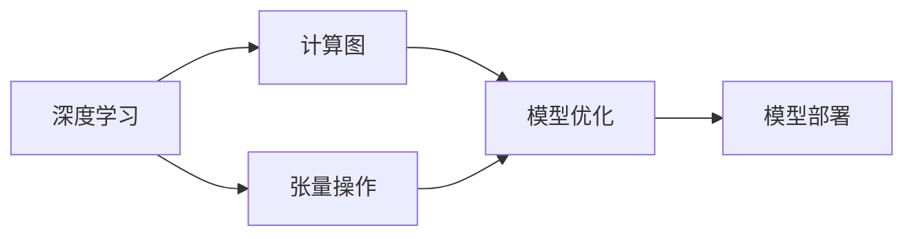
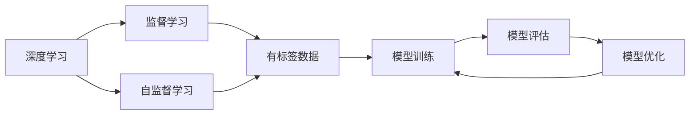
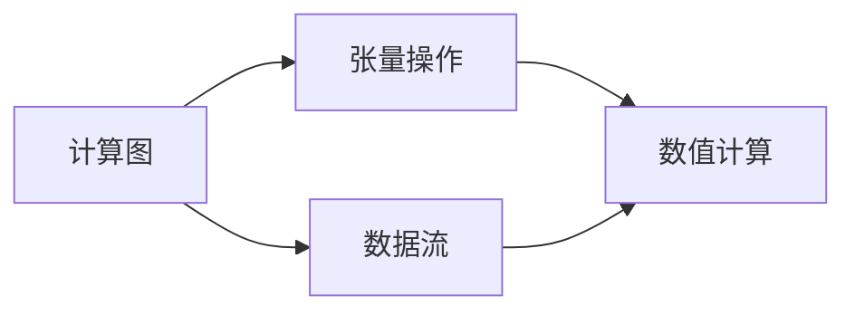
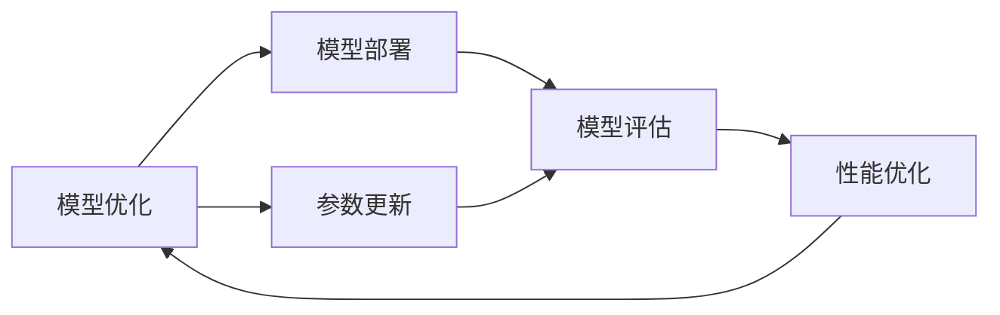

                 

## 1. 背景介绍

### 1.1 问题由来
在AI领域，人们常把深度学习看作是独立于编程技能的特殊技术领域。然而，随着深度学习技术的发展和普及，越来越多的编程工作开始与AI技术结合，使得"每个程序员都成为了AI程序员"。

AI技术的快速发展，离不开算法和编程的不断进步。深度学习算法的设计、模型架构的搭建、数据处理的优化等，都需要程序员进行编码实现。特别是在目前热门的NLP、CV等领域，程序员的作用更是不可替代。

### 1.2 问题核心关键点
为什么AI技术的进步离不开程序员的代码？核心原因有以下几点：

- 编程是实现算法的唯一手段：任何深度学习模型最终都需要通过编程实现，才能在实际应用中落地。
- 深度学习模型本质上是计算图：计算图是深度学习模型的核心组成部分，通过编程实现计算图，才能进行高效的数值计算。
- 深度学习算法依赖于大量的数据处理：数据预处理、特征工程、模型评估等，都需要程序员编写代码实现。
- 程序员是技术落地的执行者：无论算法设计多么先进，最终还需要程序员去实现和部署。

因此，每个程序员都具备了成为AI程序员的潜力。了解和掌握AI技术的编程实现，能够帮助程序员更好地理解和应用这些技术，提升自身竞争力。

## 2. 核心概念与联系

### 2.1 核心概念概述

为更好地理解"每个程序员都是AI程序员"这一命题，本节将介绍几个密切相关的核心概念：

- 深度学习：基于神经网络模型的机器学习方法，通过大量数据训练模型，实现对输入数据的预测、分类、生成等任务。
- 计算图：深度学习模型的核心组成部分，通过计算图描述模型结构和数据流，进行高效的数值计算。
- 张量操作：深度学习模型中的基本运算单位，类似于数组，通过编程实现张量操作，实现模型计算。
- 模型优化：通过编程实现模型的参数更新和优化，提升模型的预测准确率和计算效率。
- 模型部署：通过编程实现模型在不同硬件平台（如GPU、TPU等）上的部署和优化，提升实际应用的性能。

这些核心概念之间的逻辑关系可以通过以下Mermaid流程图来展示：



这个流程图展示了大语言模型微调过程中各个核心概念的关系和作用：

1. 深度学习通过大量数据训练模型，实现对输入数据的预测、分类、生成等任务。
2. 计算图描述模型结构和数据流，进行高效的数值计算。
3. 张量操作是深度学习模型中的基本运算单位，通过编程实现张量操作，实现模型计算。
4. 模型优化通过编程实现模型的参数更新和优化，提升模型的预测准确率和计算效率。
5. 模型部署通过编程实现模型在不同硬件平台上的部署和优化，提升实际应用的性能。

这些核心概念共同构成了深度学习的完整生态系统，使其能够在各种场景下发挥强大的模型性能。通过理解这些核心概念，我们可以更好地把握深度学习的编程实现和技术细节。

### 2.2 概念间的关系

这些核心概念之间存在着紧密的联系，形成了深度学习的完整生态系统。下面我通过几个Mermaid流程图来展示这些概念之间的关系。

#### 2.2.1 深度学习的学习范式



这个流程图展示了大语言模型微调的基本学习范式，即通过监督学习、自监督学习等方式，使用有标签或无标签数据训练深度学习模型。

#### 2.2.2 计算图与张量操作的关系



这个流程图展示了计算图和张量操作的基本关系。计算图通过描述数据流和运算顺序，实现高效的数值计算，而张量操作是实现计算图的基本手段。

#### 2.2.3 模型优化与部署的关系



这个流程图展示了模型优化和模型部署的基本关系。模型优化通过编程实现参数更新和模型优化，提升模型的预测准确率和计算效率，而模型部署则通过编程实现模型在不同硬件平台上的部署和优化，提升实际应用的性能。

## 3. 核心算法原理 & 具体操作步骤

### 3.1 算法原理概述

深度学习模型的编程实现主要基于计算图和张量操作的原理。深度学习模型的核心组成部分是一个计算图，通过图描述模型结构和数据流，实现高效的数值计算。在计算图中，张量操作是基本运算单位，通过编程实现张量操作，实现模型计算。

深度学习模型通常由若干个层组成，每层由一个或多个张量操作构成，包括线性变换、非线性变换、池化、激活函数等。深度学习模型通过大量数据训练，学习到数据的表示和模式，从而实现对输入数据的预测、分类、生成等任务。

### 3.2 算法步骤详解

深度学习模型的编程实现一般包括以下几个关键步骤：

**Step 1: 准备数据集**
- 收集和处理训练数据和测试数据，将数据转化为张量形式，进行特征工程和预处理。

**Step 2: 搭建计算图**
- 使用编程语言（如Python、C++）和深度学习框架（如PyTorch、TensorFlow等），搭建深度学习模型的计算图。
- 定义模型层和张量操作，实现模型的前向传播和后向传播。

**Step 3: 定义损失函数**
- 根据任务类型，选择合适的损失函数，如交叉熵损失、均方误差损失等。
- 定义模型在训练集上的损失函数，并计算梯度。

**Step 4: 执行优化器**
- 选择适当的优化器，如Adam、SGD等，并设置学习率等参数。
- 通过编程实现模型的参数更新，最小化损失函数。

**Step 5: 训练和测试模型**
- 将训练集数据分批次输入模型，计算损失函数并更新参数。
- 在验证集上评估模型性能，根据性能指标决定是否停止训练。
- 在测试集上评估模型效果，输出模型预测结果。

### 3.3 算法优缺点

深度学习模型的编程实现有以下优点：

1. 灵活性高：通过编程实现计算图和张量操作，可以灵活地设计模型结构，适应不同的任务和数据。
2. 可移植性好：模型可以在不同硬件平台（如GPU、TPU等）上运行，提升实际应用的性能。
3. 易于调试和优化：通过编程实现模型，可以方便地添加调试点和性能监测点，对模型进行调试和优化。

同时，深度学习模型的编程实现也存在一些缺点：

1. 计算量大：深度学习模型的计算量巨大，需要大量计算资源。
2. 编程复杂度高：深度学习模型的实现复杂度高，需要编程经验丰富的开发者。
3. 调试困难：深度学习模型通常包含大量参数和层，调试和优化难度较大。

### 3.4 算法应用领域

深度学习模型的编程实现广泛应用于以下几个领域：

- 自然语言处理（NLP）：如文本分类、情感分析、机器翻译等。
- 计算机视觉（CV）：如图像分类、目标检测、图像生成等。
- 语音处理：如语音识别、语音合成等。
- 推荐系统：如协同过滤、内容推荐等。
- 自动驾驶：如路径规划、障碍物检测等。

除了上述这些典型领域外，深度学习模型的编程实现还被应用于医疗、金融、教育、智慧城市等多个行业，为这些领域带来了新的应用突破。

## 4. 数学模型和公式 & 详细讲解

### 4.1 数学模型构建

深度学习模型的数学模型构建主要基于线性代数和微积分的理论基础。深度学习模型的核心组成部分是一个计算图，通过图描述模型结构和数据流，实现高效的数值计算。在计算图中，张量操作是基本运算单位，通过编程实现张量操作，实现模型计算。

假设深度学习模型由$L$层组成，每一层由若干个神经元构成，每个神经元由一个权重矩阵$W$和一个偏置向量$b$组成。深度学习模型的前向传播过程为：

$$
h_0 = x
$$
$$
h_l = \sigma(W_lh_{l-1} + b_l), \quad l=1,...,L
$$

其中$h_0$为输入数据，$h_L$为模型输出，$W_l$和$b_l$分别为第$l$层的权重矩阵和偏置向量，$\sigma$为激活函数。

假设模型的损失函数为$\mathcal{L}$，则模型的优化目标为最小化损失函数：

$$
\theta^* = \mathop{\arg\min}_{\theta} \mathcal{L}(\theta)
$$

其中$\theta$为模型参数，包括所有权重矩阵和偏置向量。

### 4.2 公式推导过程

以二分类任务为例，推导深度学习模型在交叉熵损失函数下的优化目标。

假设模型输出为$\hat{y}$，真实标签为$y$，则二分类交叉熵损失函数定义为：

$$
\ell(\hat{y},y) = -[y\log \hat{y} + (1-y)\log(1-\hat{y})]
$$

将损失函数累加，得到模型在训练集上的经验风险：

$$
\mathcal{L}(\theta) = \frac{1}{N}\sum_{i=1}^N \ell(y_i,\hat{y}_i)
$$

其中$N$为训练样本数。

根据链式法则，损失函数对参数$\theta_k$的梯度为：

$$
\frac{\partial \mathcal{L}(\theta)}{\partial \theta_k} = \frac{\partial \mathcal{L}(\theta)}{\partial \hat{y}} \frac{\partial \hat{y}}{\partial \theta_k}
$$

其中$\frac{\partial \mathcal{L}(\theta)}{\partial \hat{y}}$为损失函数对模型输出的梯度，$\frac{\partial \hat{y}}{\partial \theta_k}$为模型输出对参数$\theta_k$的梯度。

在得到损失函数的梯度后，即可带入优化器进行模型参数的更新。通过梯度下降等优化算法，最小化损失函数，使得模型输出逼近真实标签。

### 4.3 案例分析与讲解

以图像分类任务为例，展示深度学习模型的数学模型构建和优化目标的推导过程。

假设输入图像为$x$，输出标签为$y$，模型由卷积层和全连接层组成。模型输出为：

$$
h_0 = x
$$
$$
h_1 = \sigma(W_1h_0 + b_1)
$$
$$
h_2 = \sigma(W_2h_1 + b_2)
$$
$$
h_3 = \sigma(W_3h_2 + b_3)
$$
$$
\hat{y} = W_Lh_{L-1} + b_L
$$

其中$W_1, W_2, ..., W_L$为卷积层和全连接层的权重矩阵，$b_1, b_2, ..., b_L$为偏置向量，$\sigma$为激活函数。

假设模型输出为$\hat{y}$，真实标签为$y$，则二分类交叉熵损失函数定义为：

$$
\ell(\hat{y},y) = -[y\log \hat{y} + (1-y)\log(1-\hat{y})]
$$

将损失函数累加，得到模型在训练集上的经验风险：

$$
\mathcal{L}(\theta) = \frac{1}{N}\sum_{i=1}^N \ell(y_i,\hat{y}_i)
$$

其中$N$为训练样本数。

根据链式法则，损失函数对参数$\theta_k$的梯度为：

$$
\frac{\partial \mathcal{L}(\theta)}{\partial \theta_k} = \frac{\partial \mathcal{L}(\theta)}{\partial \hat{y}} \frac{\partial \hat{y}}{\partial \theta_k}
$$

其中$\frac{\partial \mathcal{L}(\theta)}{\partial \hat{y}}$为损失函数对模型输出的梯度，$\frac{\partial \hat{y}}{\partial \theta_k}$为模型输出对参数$\theta_k$的梯度。

在得到损失函数的梯度后，即可带入优化器进行模型参数的更新。通过梯度下降等优化算法，最小化损失函数，使得模型输出逼近真实标签。

## 5. 项目实践：代码实例和详细解释说明

### 5.1 开发环境搭建

在进行深度学习模型的编程实现前，我们需要准备好开发环境。以下是使用Python进行PyTorch开发的环境配置流程：

1. 安装Anaconda：从官网下载并安装Anaconda，用于创建独立的Python环境。

2. 创建并激活虚拟环境：
```bash
conda create -n pytorch-env python=3.8 
conda activate pytorch-env
```

3. 安装PyTorch：根据CUDA版本，从官网获取对应的安装命令。例如：
```bash
conda install pytorch torchvision torchaudio cudatoolkit=11.1 -c pytorch -c conda-forge
```

4. 安装TensorFlow：从官网下载安装包，并添加到Python环境。例如：
```bash
pip install tensorflow
```

5. 安装各类工具包：
```bash
pip install numpy pandas scikit-learn matplotlib tqdm jupyter notebook ipython
```

完成上述步骤后，即可在`pytorch-env`环境中开始深度学习模型的编程实现。

### 5.2 源代码详细实现

下面我们以图像分类任务为例，给出使用PyTorch进行深度学习模型编程实现的PyTorch代码实现。

首先，定义模型结构：

```python
import torch
import torch.nn as nn
import torch.nn.functional as F

class Net(nn.Module):
    def __init__(self):
        super(Net, self).__init__()
        self.conv1 = nn.Conv2d(3, 32, 3)
        self.conv2 = nn.Conv2d(32, 64, 3)
        self.pool = nn.MaxPool2d(2)
        self.fc1 = nn.Linear(64 * 8 * 8, 1000)
        self.fc2 = nn.Linear(1000, 10)

    def forward(self, x):
        x = self.pool(F.relu(self.conv1(x)))
        x = self.pool(F.relu(self.conv2(x)))
        x = x.view(-1, 64 * 8 * 8)
        x = F.relu(self.fc1(x))
        x = self.fc2(x)
        return x
```

然后，定义优化器和学习率调度：

```python
from torch.optim import SGD
from torch.optim.lr_scheduler import StepLR

model = Net()
optimizer = SGD(model.parameters(), lr=0.01, momentum=0.9)
scheduler = StepLR(optimizer, step_size=7, gamma=0.1)
```

接着，定义训练和评估函数：

```python
import torchvision
from torchvision import datasets, transforms

# 定义数据转换
transform = transforms.Compose(
    [transforms.ToTensor(),
     transforms.Normalize((0.5, 0.5, 0.5), (0.5, 0.5, 0.5))
])

# 加载数据集
train_dataset = datasets.CIFAR10(root='./data', train=True, download=True, transform=transform)
test_dataset = datasets.CIFAR10(root='./data', train=False, download=True, transform=transform)

# 定义训练和测试函数
def train_epoch(model, dataset, optimizer):
    dataloader = torch.utils.data.DataLoader(dataset, batch_size=64, shuffle=True)
    model.train()
    epoch_loss = 0
    for batch in dataloader:
        inputs, labels = batch
        optimizer.zero_grad()
        outputs = model(inputs)
        loss = F.cross_entropy(outputs, labels)
        loss.backward()
        optimizer.step()
        epoch_loss += loss.item()
    return epoch_loss / len(dataloader)

def evaluate(model, dataset, optimizer):
    dataloader = torch.utils.data.DataLoader(dataset, batch_size=64, shuffle=True)
    model.eval()
    correct = 0
    total = 0
    with torch.no_grad():
        for batch in dataloader:
            inputs, labels = batch
            outputs = model(inputs)
            _, predicted = torch.max(outputs.data, 1)
            total += labels.size(0)
            correct += (predicted == labels).sum().item()
    print('Accuracy: %.2f %%' % (100 * correct / total))
```

最后，启动训练流程并在测试集上评估：

```python
epochs = 10
train_dataset = train_dataset

for epoch in range(epochs):
    loss = train_epoch(model, train_dataset, optimizer)
    print('Epoch [%d/%d], train loss: %.4f' % (epoch + 1, epochs, loss))

    evaluate(model, test_dataset, optimizer)
```

以上就是使用PyTorch进行深度学习模型编程实现的完整代码实现。可以看到，通过编程实现深度学习模型，可以方便地进行模型设计、优化和评估，快速迭代出优化的模型。

### 5.3 代码解读与分析

让我们再详细解读一下关键代码的实现细节：

**Net类**：
- `__init__`方法：定义模型结构，包括卷积层、池化层、全连接层等。
- `forward`方法：实现前向传播，依次对输入数据进行卷积、池化、线性变换等操作，最后输出模型预测结果。

**优化器和学习率调度**：
- 定义了SGD优化器和学习率调度，设置了学习率为0.01，动量为0.9，步长为7，衰减率为0.1。

**训练和评估函数**：
- 定义了训练函数`train_epoch`，通过循环迭代训练集数据，计算损失函数并更新模型参数。
- 定义了评估函数`evaluate`，在测试集上评估模型性能，输出准确率。

**训练流程**：
- 定义总的epoch数，循环迭代进行训练。
- 在每个epoch内，先进行训练，输出训练损失。
- 在测试集上评估模型性能，输出准确率。

可以看到，通过编程实现深度学习模型，可以方便地进行模型设计、优化和评估，快速迭代出优化的模型。

当然，工业级的系统实现还需考虑更多因素，如模型的保存和部署、超参数的自动搜索、更灵活的任务适配层等。但核心的编程实现原理基本与此类似。

## 6. 实际应用场景

### 6.1 智能推荐系统

深度学习模型的编程实现可以应用于智能推荐系统。推荐系统通常需要根据用户历史行为数据进行推荐，深度学习模型可以通过编程实现用户行为特征的提取和推荐算法的优化。

在实践中，可以收集用户浏览、点击、评分等行为数据，提取和用户交互的物品特征，构建特征向量，输入到深度学习模型中进行训练。深度学习模型通过编程实现，可以实现高效的特征提取和推荐算法优化，提高推荐的准确性和多样性。

### 6.2 医疗影像分析

深度学习模型的编程实现可以应用于医疗影像分析。医疗影像分析通常需要处理大量的医学图像数据，深度学习模型可以通过编程实现图像特征提取和分类。

在实践中，可以收集和处理医疗影像数据，提取和标注图像特征，输入到深度学习模型中进行训练。深度学习模型通过编程实现，可以实现高效的图像特征提取和分类，提高诊断的准确性和效率。

### 6.3 金融风险预测

深度学习模型的编程实现可以应用于金融风险预测。金融风险预测通常需要处理大量的金融数据，深度学习模型可以通过编程实现金融特征提取和风险预测。

在实践中，可以收集和处理金融数据，提取和标注金融特征，输入到深度学习模型中进行训练。深度学习模型通过编程实现，可以实现高效的金融特征提取和风险预测，提高风险评估的准确性和及时性。

### 6.4 未来应用展望

随着深度学习技术的发展和普及，深度学习模型的编程实现将在更多领域得到应用，为传统行业带来变革性影响。

在智慧城市治理中，深度学习模型的编程实现可以应用于交通监控、城市管理、环境监测等领域，提升城市管理的自动化和智能化水平，构建更安全、高效的未来城市。

在智慧医疗领域，深度学习模型的编程实现可以应用于医学影像分析、疾病预测、药物研发等领域，提升医疗服务的智能化水平，辅助医生诊疗，加速新药开发进程。

在智能教育领域，深度学习模型的编程实现可以应用于智能作业批改、学情分析、知识推荐等领域，因材施教，促进教育公平，提高教学质量。

此外，在智能交通、智慧农业、智能制造等多个领域，深度学习模型的编程实现也将不断涌现，为经济社会发展注入新的动力。相信随着技术的日益成熟，深度学习模型的编程实现必将成为人工智能技术落地应用的重要范式，推动人工智能技术向更广阔的领域加速渗透。

## 7. 工具和资源推荐

### 7.1 学习资源推荐

为了帮助开发者系统掌握深度学习模型的编程实现，这里推荐一些优质的学习资源：

1. 《深度学习》书籍：由Ian Goodfellow等撰写，深入浅出地介绍了深度学习的基本原理和应用，是学习深度学习编程实现的必读书籍。

2. 《TensorFlow官方文档》：TensorFlow官方文档，提供了丰富的深度学习教程和样例代码，是学习深度学习编程实现的重要资源。

3. 《PyTorch官方文档》：PyTorch官方文档，提供了详细的深度学习教程和样例代码，是学习深度学习编程实现的重要资源。

4. 《自然语言处理入门》课程：由李宏毅教授主讲的NLP入门课程，讲解了NLP的基本概念和深度学习模型实现，是学习NLP编程实现的良好起点。

5. Kaggle竞赛平台：Kaggle是一个数据科学竞赛平台，提供了大量的深度学习竞赛和数据集，可以用于实践和提高深度学习编程实现能力。

通过这些学习资源，相信你一定能够快速掌握深度学习模型的编程实现，并用于解决实际的NLP问题。

### 7.2 开发工具推荐

高效的深度学习模型开发离不开优秀的工具支持。以下是几款用于深度学习模型编程实现的常用工具：

1. PyTorch：基于Python的开源深度学习框架，灵活动态的计算图，适合快速迭代研究。大多数深度学习模型都有PyTorch版本的实现。

2. TensorFlow：由Google主导开发的开源深度学习框架，生产部署方便，适合大规模工程应用。同样有丰富的深度学习模型资源。

3. Keras：基于TensorFlow和Theano等框架的高级深度学习库，提供了便捷的API，适合快速原型开发。

4. MXNet：由Amazon开发的开源深度学习框架，支持多种编程语言，适合大规模工程应用。

5. JAX：由Google开发的张量计算框架，支持动态计算图，适合进行高效的深度学习模型优化和部署。

6. Amazon SageMaker：AWS提供的深度学习模型训练和部署平台，支持多种深度学习框架，提供便捷的模型开发和部署工具。

合理利用这些工具，可以显著提升深度学习模型编程实现的开发效率，加快创新迭代的步伐。

### 7.3 相关论文推荐

深度学习模型的编程实现得益于学界的持续研究。以下是几篇奠基性的相关论文，推荐阅读：

1. "Deep Learning" by Ian Goodfellow et al.：深度学习领域的经典教材，涵盖了深度学习模型的编程实现、优化算法等基础理论。

2. "ImageNet Classification with Deep Convolutional Neural Networks" by Alex Krizhevsky et al.：介绍卷积神经网络模型在图像分类任务中的应用，是深度学习编程实现的经典案例。

3. "DenseNet: Dense Convolutional Networks" by Huang et al.：介绍DenseNet模型在图像分类任务中的应用，展示了深度学习模型的编程实现和优化。

4. "Rethinking the Inception Architecture for Computer Vision" by Szegedy et al.：介绍Inception模型在图像分类任务中的应用，展示了深度学习模型的编程实现和优化。

5. "ResNet: Deep Residual Learning for Image Recognition" by He et al.：介绍ResNet模型在图像分类任务中的应用，展示了深度学习模型的编程实现和优化。

6. "Natural Language Processing with Transformers" by Vaswani et al.：介绍Transformer模型在NLP任务中的应用，展示了深度学习模型的编程实现和优化。

这些论文代表了大语言模型微调技术的发展脉络。通过学习这些前沿成果，可以帮助研究者把握学科前进方向，激发更多的创新灵感。

除上述资源外，还有一些值得关注的前沿资源，帮助开发者紧跟深度学习模型的编程实现技术的最新进展，例如：

1. arXiv论文预印本：人工智能领域最新研究成果的发布平台，包括大量尚未发表的前沿工作，学习前沿技术的必读资源。

2. 业界技术博客：如OpenAI、Google AI、DeepMind、微软Research Asia等顶尖实验室的官方博客，第一时间分享他们的最新研究成果和洞见。

3. 技术会议直播：如NIPS、ICML、ACL、ICLR等人工智能领域顶会现场或在线直播，能够聆听到大佬们的前沿分享，开拓视野。

4. GitHub热门项目：在GitHub上Star、

