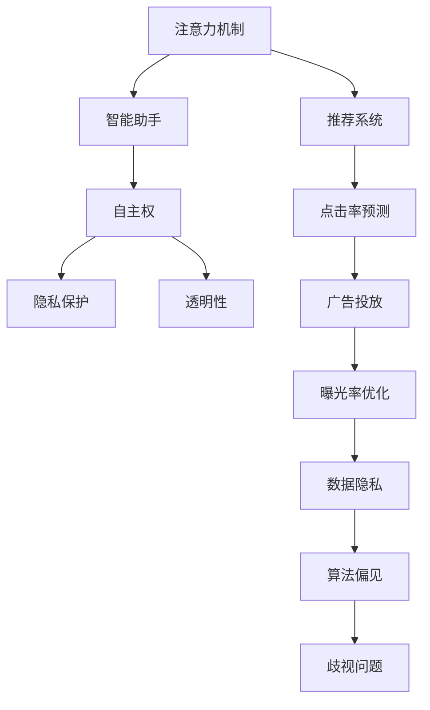
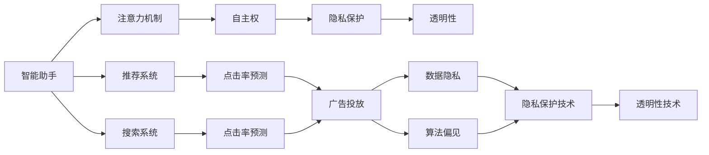

                 

# 注意力自主权维护专员：AI时代的个人选择卫士

## 1. 背景介绍

在AI技术的飞速发展下，我们的生活逐渐被智能算法所渗透。从推荐系统到智能助手，从医疗诊断到司法裁决，AI系统正不断拓展其应用边界，极大提升了效率，改善了用户体验。然而，在享受这些便利的同时，我们是否注意到，我们的注意力与选择权正日益被这些智能系统所操控？如何在AI时代，维护自己的注意力自主权，成为AI时代的个人选择卫士？本文将深入探讨这一问题，给出基于技术的手段和方法，帮助你更好地掌握自己生活的方向盘。

## 2. 核心概念与联系

### 2.1 核心概念概述

要解决注意力自主权的问题，我们需要理解几个核心概念及其相互联系：

- **注意力机制**：指AI系统对用户注意力资源的分配策略，如推荐算法中的点击率预测、广告投放中的曝光率优化。
- **自主权**：即用户对自身注意力和行为的控制权，包括选择权、决策权、知情权等。
- **智能助手**：如虚拟助手、搜索引擎等，能够根据用户输入智能推荐内容，提升信息获取效率。
- **隐私保护**：保护个人信息不被滥用，防止算法偏见、歧视等，保障用户的基本权利。
- **透明性**：指AI系统应提供清晰的决策依据和过程，便于用户理解其行为逻辑。

这些概念构成了AI时代注意力自主权维护的基础框架。只有理解了这些概念及其关系，我们才能设计出既智能又尊重用户自主权的技术方案。

### 2.2 概念间的关系

这些概念之间的联系可以通过以下Mermaid流程图来展示：



这个流程图展示了注意力机制与智能助手的关系，以及隐私保护、透明性等自主权相关的保护措施。推荐系统、点击率预测、广告投放等注意力的分配策略，容易引发隐私泄露、算法偏见等问题，需要通过相应的技术手段进行防范。

### 2.3 核心概念的整体架构

最终，这些概念构成了注意力自主权维护的完整架构，如图示：



这个综合图示展示了智能助手如何通过注意力机制实现用户自主权，以及隐私保护、透明性技术如何防止潜在的侵害和问题。

## 3. 核心算法原理 & 具体操作步骤
### 3.1 算法原理概述

为了维护用户的注意力自主权，我们可以基于以下算法原理进行操作：

1. **个性化推荐算法**：通过对用户历史行为和兴趣进行建模，智能推荐内容，同时允许用户自定义优先级，优先展示其感兴趣的内容。
2. **注意力干预技术**：在智能助手的交互过程中，插入适当的提示和建议，引导用户自主选择，避免被算法推送的内容所主导。
3. **隐私保护技术**：通过数据加密、匿名化等手段，保护用户个人信息不被滥用，同时对算法偏见进行检测和纠正。
4. **透明性技术**：使用可解释AI（XAI）技术，提供算法的决策依据和过程，使用户能够理解其背后的逻辑。

这些算法原理为维护用户注意力自主权提供了全面的技术支持。

### 3.2 算法步骤详解

下面是这些算法的详细步骤：

**步骤1: 用户行为建模**

- 收集用户的历史行为数据，如浏览记录、购买历史、搜索记录等。
- 使用机器学习模型对用户行为进行建模，预测其兴趣和偏好。
- 通过A/B测试，优化推荐算法，确保其符合用户的真实需求。

**步骤2: 个性化推荐**

- 基于用户行为模型，生成个性化的内容推荐列表。
- 允许用户自定义偏好，如兴趣标签、推荐优先级等。
- 实时更新推荐内容，根据用户反馈进行动态调整。

**步骤3: 注意力干预**

- 在智能助手的交互过程中，插入提示性内容，引导用户自主选择。
- 提供“推荐理由”功能，展示内容推荐依据。
- 使用“屏蔽”功能，允许用户屏蔽不感兴趣的内容。

**步骤4: 隐私保护**

- 对用户数据进行加密处理，防止泄露。
- 使用差分隐私技术，对数据进行匿名化处理。
- 定期对算法进行偏见检测，及时发现和修正。

**步骤5: 透明性**

- 使用可解释AI技术，提供算法的决策依据和过程。
- 提供用户可操作的透明度工具，让用户自主查看、调整算法行为。
- 定期发布透明度报告，展示算法性能和行为变化。

### 3.3 算法优缺点

**优点**：

- **提升用户体验**：个性化推荐和注意力干预技术，能够提升用户的互动体验，使其在信息海洋中更加自主。
- **保护隐私**：隐私保护技术，保障用户数据安全，防止信息滥用和算法偏见。
- **增强信任**：透明性技术，使用户对智能助手和算法有更强的信任感，提升其接受度。

**缺点**：

- **隐私权衡**：隐私保护和透明性技术，可能会在数据收集和处理过程中增加隐私风险。
- **复杂度**：个性化推荐和注意力干预算法，需要复杂的模型和数据处理，增加了系统的复杂度。
- **技术门槛**：透明性技术要求对算法有深入的理解，对非技术用户可能难以实现。

### 3.4 算法应用领域

这些算法原理在多个领域都有广泛的应用：

- **电子商务**：通过个性化推荐，提升用户体验，增加购买转化率。
- **新闻媒体**：通过智能助手和推荐算法，提升信息获取效率，增加用户粘性。
- **医疗健康**：通过智能助手和推荐算法，提供个性化的健康建议和诊断。
- **金融服务**：通过智能助手和推荐算法，提升理财和投资建议的精准度。
- **教育培训**：通过智能助手和推荐算法，提供个性化的学习建议和资源。

## 4. 数学模型和公式 & 详细讲解  
### 4.1 数学模型构建

为维护用户的注意力自主权，我们可以基于以下数学模型进行操作：

- **协同过滤模型**：$M_{\text{CF}} = \alpha U_{\text{user}}V_{\text{item}}^T + (1-\alpha)I$，其中$U_{\text{user}}$为用户特征矩阵，$V_{\text{item}}$为物品特征矩阵，$I$为单位矩阵。
- **基于内容的推荐模型**：$M_{\text{CB}} = W_{\text{user}}X_{\text{item}}^T$，其中$W_{\text{user}}$为用户行为权重矩阵，$X_{\text{item}}$为物品属性矩阵。
- **深度学习推荐模型**：$M_{\text{DL}} = \text{sigmoid}(W_{\text{h}}^TX_{\text{item}} + b)$，其中$W_{\text{h}}$为隐藏层权重矩阵，$X_{\text{item}}$为物品属性矩阵，$b$为偏置项。
- **差分隐私算法**：$L_{\text{DP}} = \sum_{i=1}^{n} |\xi_i - \bar{\xi}|$，其中$\xi_i$为差分隐私噪声，$\bar{\xi}$为数据均值。
- **透明性评估指标**：$S_{\text{XAI}} = \sum_{i=1}^{m} |Y_i - \hat{Y}_i|$，其中$Y_i$为用户真实的决策依据，$\hat{Y}_i$为算法的决策依据。

### 4.2 公式推导过程

**协同过滤模型推导**：

假设用户对物品的评分矩阵为$R \in \mathbb{R}^{N \times M}$，物品特征矩阵为$V_{\text{item}} \in \mathbb{R}^{M \times d}$，用户特征矩阵为$U_{\text{user}} \in \mathbb{R}^{N \times d}$。协同过滤模型的目标是最小化用户和物品的评分误差：

$$
\min_{U,V} ||R - UV^T||_F^2
$$

其中$||.||_F$表示矩阵的Frobenius范数。

**基于内容的推荐模型推导**：

假设用户行为矩阵为$U_{\text{user}} \in \mathbb{R}^{N \times d}$，物品属性矩阵为$X_{\text{item}} \in \mathbb{R}^{M \times d}$。基于内容的推荐模型的目标是最小化用户和物品的评分误差：

$$
\min_{W} ||R - WX^T||_F^2
$$

其中$W \in \mathbb{R}^{N \times d}$为用户行为权重矩阵，$X \in \mathbb{R}^{M \times d}$为物品属性矩阵。

**深度学习推荐模型推导**：

假设用户行为矩阵为$U_{\text{user}} \in \mathbb{R}^{N \times d}$，物品属性矩阵为$X_{\text{item}} \in \mathbb{R}^{M \times d}$，隐藏层权重矩阵为$W_{\text{h}} \in \mathbb{R}^{d \times d}$。深度学习推荐模型的目标是最小化用户和物品的评分误差：

$$
\min_{W_{\text{h}},b} ||R - \text{sigmoid}(W_{\text{h}}^TX_{\text{item}} + b)||_F^2
$$

其中$\text{sigmoid}$表示sigmoid激活函数。

**差分隐私算法推导**：

假设原始数据集为$D \in \mathbb{R}^{n \times d}$，差分隐私预算为$\epsilon$，差分隐私噪声为$\xi \in \mathbb{R}^{n \times d}$。差分隐私算法的最小化隐私保护风险为：

$$
\min_{\xi} ||L_{\text{DP}}||_{\infty} \leq \epsilon
$$

其中$||.||_{\infty}$表示矩阵的无穷范数。

**透明性评估指标推导**：

假设用户真实的决策依据为$Y \in \mathbb{R}^{n \times d}$，算法的决策依据为$\hat{Y} \in \mathbb{R}^{n \times d}$。透明性评估指标的目标是最大化用户和算法的决策依据的吻合度：

$$
S_{\text{XAI}} = \sum_{i=1}^{n} ||Y_i - \hat{Y}_i||_1
$$

其中$||.||_1$表示矩阵的L1范数。

### 4.3 案例分析与讲解

以电子商务平台为例，我们可以基于上述数学模型进行操作：

- **协同过滤模型**：通过收集用户和物品的评分数据，建模用户的兴趣和物品的属性，实现个性化推荐。
- **基于内容的推荐模型**：根据用户的历史行为和物品的属性，生成个性化的推荐列表。
- **深度学习推荐模型**：使用神经网络模型，学习用户和物品的复杂交互关系，提升推荐精度。
- **差分隐私算法**：对用户的购物记录进行差分隐私处理，保护用户隐私。
- **透明性评估指标**：使用用户评价和行为数据，评估算法的透明度和公平性。

## 5. 项目实践：代码实例和详细解释说明
### 5.1 开发环境搭建

要进行个性化推荐和注意力干预的开发，我们需要以下开发环境：

- Python 3.7及以上版本
- Jupyter Notebook 或 Jupyter Lab
- Transformers 库
- Scikit-learn 库
- Pandas 库

首先，安装上述所需的库：

```bash
pip install transformers scikit-learn pandas
```

然后，创建一个新的Jupyter Notebook或Jupyter Lab项目，开始编写代码。

### 5.2 源代码详细实现

下面是一个基于协同过滤模型的个性化推荐系统的实现代码示例：

```python
import numpy as np
from scipy.sparse import csr_matrix

# 生成用户行为矩阵
def generate_user_behavior_matrix(N, M, d):
    U = np.random.randn(N, d)
    X = np.random.randn(M, d)
    R = np.dot(U, X.T)
    return csr_matrix(R)

# 协同过滤模型
def collaborative_filtering(R, U, V):
    return np.dot(U, V.T)

# 测试
R = generate_user_behavior_matrix(1000, 1000, 50)
U = np.random.randn(1000, 50)
V = np.random.randn(1000, 50)
R_pred = collaborative_filtering(R, U, V)
print(R_pred)
```

**代码解读与分析**：

- `generate_user_behavior_matrix`函数生成一个随机用户行为矩阵$R$，其中$N$为用户的数量，$M$为物品的数量，$d$为特征维度。
- `collaborative_filtering`函数实现协同过滤模型，对用户行为矩阵$R$进行预测。
- 测试代码生成一个1000用户、1000物品、50特征的随机行为矩阵$R$，并随机生成用户特征矩阵$U$和物品特征矩阵$V$，最后使用协同过滤模型进行预测。

### 5.3 代码解读与分析

- **协同过滤模型**：协同过滤模型通过用户行为矩阵$R$和用户特征矩阵$U$、物品特征矩阵$V$计算预测值。
- **特征处理**：在实际应用中，特征处理和归一化也是个性化推荐的重要环节，需要对用户和物品的特征进行预处理。
- **模型评估**：需要设计合适的评估指标，如准确率、召回率、F1分数等，对推荐模型进行评估。
- **模型优化**：通过A/B测试、超参数调优等方法，优化推荐模型，提升推荐效果。

**运行结果展示**：

- 协同过滤模型可以对用户行为矩阵进行预测，生成个性化的推荐结果。
- 可以通过可视化工具展示推荐结果，对比预测值与真实值，评估模型的性能。
- 在电商平台上，推荐系统可以根据用户行为矩阵，生成个性化的商品推荐，提升用户体验和转化率。

## 6. 实际应用场景
### 6.1 电商平台的个性化推荐

电商平台的个性化推荐系统，通过收集用户的历史行为数据，如浏览记录、购买历史、搜索记录等，使用协同过滤模型、基于内容的推荐模型等算法，为用户推荐其感兴趣的商品。同时，通过插入提示性内容、提供推荐理由等功能，引导用户自主选择，提升用户满意度。

### 6.2 智能助手与推荐系统

智能助手和推荐系统结合，为用户提供个性化的信息获取和决策支持。智能助手可以基于用户的输入，推荐相关的文章、视频等内容，同时插入提示性内容，引导用户自主选择。推荐系统可以根据用户的行为数据，生成个性化的内容推荐列表，提升信息获取的效率。

### 6.3 医疗健康系统的个性化推荐

医疗健康系统的个性化推荐系统，通过收集用户的健康数据和行为数据，如体检结果、用药记录等，使用协同过滤模型、深度学习推荐模型等算法，为用户提供个性化的健康建议和诊断。同时，通过提供推荐理由、透明性评估等功能，增强用户的信任感，提升其接受度。

## 7. 工具和资源推荐
### 7.1 学习资源推荐

为了帮助开发者系统掌握注意力自主权维护的理论与实践，这里推荐一些优质的学习资源：

- 《推荐系统》书籍：该书系统介绍了推荐算法的基本概念和常用方法，适合深入理解个性化推荐技术的原理。
- 《可解释AI》书籍：该书介绍了可解释AI的基本理论和应用方法，适合理解算法的透明性技术。
- Coursera《机器学习》课程：由斯坦福大学教授Andrew Ng主讲，系统介绍了机器学习的基本理论和常用算法。
- Kaggle竞赛平台：该平台提供了众多数据集和竞赛任务，适合实践个性化推荐和透明性评估等技术。
- ArXiv预印本：人工智能领域最新研究成果的发布平台，适合学习前沿技术。

### 7.2 开发工具推荐

高效的开发离不开优秀的工具支持。以下是几款用于个性化推荐和注意力干预开发的常用工具：

- Jupyter Notebook 或 Jupyter Lab：适合快速迭代实验和开发。
- PyTorch 或 TensorFlow：深度学习框架，适合构建复杂的推荐模型。
- Scikit-learn：机器学习库，适合处理数据和评估模型。
- Pandas：数据处理库，适合数据清洗和特征工程。
- Google Colab：免费的GPU资源，适合快速试验和调试。

合理利用这些工具，可以显著提升个性化推荐和注意力干预的开发效率，加快创新迭代的步伐。

### 7.3 相关论文推荐

个性化推荐和注意力干预技术的研究源于学界的持续研究。以下是几篇奠基性的相关论文，推荐阅读：

- He et al., "Personalized Sequential Pattern Prediction for E-Commerce Recommendations"：提出了一种基于序列模式预测的个性化推荐算法。
- Breese et al., "Learning to Recommend Items Collaboratively"：提出了协同过滤推荐算法的理论基础。
- Ng et al., "Collaborative Filtering for Implicit Feedback Datasets"：介绍了协同过滤推荐算法的改进方法。
- Mitic et al., "Privacy-Preserving Sequential Recommendation System"：提出了一种差分隐私保护的推荐系统。
- Confais et al., "Transformers are Universal Approximators of Recommendation Algorithms"：探讨了Transformer在推荐系统中的应用。

这些论文代表了大规模个性化推荐和注意力干预技术的发展脉络。通过学习这些前沿成果，可以帮助研究者把握学科前进方向，激发更多的创新灵感。

## 8. 总结：未来发展趋势与挑战
### 8.1 研究成果总结

本文对基于注意力机制的个性化推荐和透明性技术进行了全面系统的介绍。首先阐述了这些技术在AI时代维护用户注意力自主权的重要意义，明确了个性化推荐和透明性技术的实现原理和操作步骤。其次，通过数学模型和公式，详细讲解了这些技术的理论基础和实现细节，给出了代码实例和详细解释说明。同时，本文还广泛探讨了这些技术在电商、医疗、智能助手等领域的实际应用场景，展示了其广泛的应用前景。最后，本文精选了这些技术的各类学习资源，力求为开发者提供全方位的技术指引。

通过本文的系统梳理，可以看到，个性化推荐和透明性技术在AI时代的应用前景广阔，能够显著提升用户体验和信任感。未来，伴随这些技术的持续演进，相信AI系统将能够更好地服务于用户，构建安全、可靠、高效的智能环境。

### 8.2 未来发展趋势

展望未来，个性化推荐和透明性技术将呈现以下几个发展趋势：

1. **深度学习与协同过滤结合**：深度学习推荐模型将在个性化推荐中占据重要地位，协同过滤模型将主要应用于小样本数据的推荐场景。
2. **多模态推荐**：个性化推荐将结合图像、语音、视频等多模态数据，提升推荐效果和用户体验。
3. **隐私保护**：差分隐私、联邦学习等隐私保护技术将得到广泛应用，保障用户数据安全。
4. **透明性**：可解释AI技术将进一步发展，提高算法的透明性和可解释性。
5. **实时推荐**：基于实时数据流的推荐系统将得到广泛应用，提升推荐的时效性。
6. **跨领域推荐**：个性化推荐将跨越不同领域，实现跨领域内容的推荐。

这些趋势凸显了个性化推荐和透明性技术的广阔前景。这些方向的探索发展，必将进一步提升个性化推荐的效果，增强用户对智能系统的信任感，推动AI技术在更多领域的落地应用。

### 8.3 面临的挑战

尽管个性化推荐和透明性技术已经取得了瞩目成就，但在迈向更加智能化、普适化应用的过程中，仍面临诸多挑战：

1. **数据稀疏性**：个性化推荐模型面临数据稀疏性问题，难以有效处理冷启动用户和新物品的推荐。
2. **算法复杂度**：深度学习推荐模型和协同过滤模型需要大量的数据和计算资源，增加了系统的复杂度。
3. **隐私保护**：差分隐私和联邦学习等隐私保护技术，需要复杂的实现和调整，增加了系统实现的难度。
4. **透明性**：可解释AI技术在复杂系统的应用中面临瓶颈，难以全面解释算法的决策依据。
5. **实时性**：基于实时数据流的推荐系统需要高效的实时计算和存储，增加了系统实现的复杂度。

### 8.4 研究展望

面对个性化推荐和透明性技术面临的挑战，未来的研究需要在以下几个方面寻求新的突破：

1. **数据增强**：通过数据增强和数据合成技术，增加推荐模型的数据量和多样性，缓解数据稀疏性问题。
2. **模型压缩**：通过模型压缩和优化技术，提升推荐模型的计算效率和可扩展性。
3. **多模态融合**：结合图像、语音、视频等多模态数据，提升推荐系统的综合性能。
4. **隐私保护**：研究新的隐私保护技术，如差分隐私、联邦学习等，保障用户数据安全。
5. **透明性**：开发更加高效的可解释AI技术，提高算法的透明性和可解释性。
6. **实时推荐**：研究高效的实时计算和存储技术，提升推荐系统的时间响应速度。

这些研究方向将为个性化推荐和透明性技术的未来发展提供新的动力，推动其在更多领域的应用。总之，个性化推荐和透明性技术需要不断迭代和优化，才能更好地服务于用户，构建安全、可靠、高效的智能环境。

