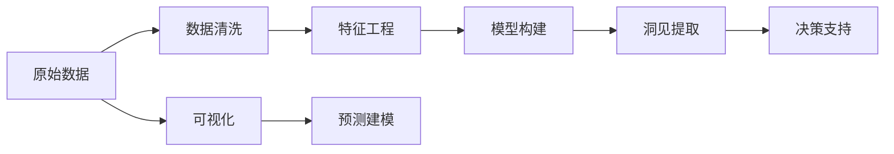

                 

# 洞见的价值：从理解到应用

> 关键词：洞见（Insight）, 数据分析（Data Analysis）, 机器学习（Machine Learning）, 决策支持（Decision Support）, 大数据（Big Data）, 可视化（Visualization）, 预测建模（Predictive Modeling）

## 1. 背景介绍

### 1.1 问题由来

在信息爆炸的现代社会，每天产生的海量数据中蕴含着无尽的洞见（Insight）。从企业的经营决策，到社会的公共政策，再到个人的健康管理，洞见无处不在，无时不刻影响着我们的生活。然而，数据量虽然庞大，但真正的洞见却往往难以捉摸。如何从数据中提取洞见，将其转化为有效的决策支持，成为了摆在各领域从业者面前的一大挑战。

### 1.2 问题核心关键点

洞见，本意是指基于某些事实或数据，通过分析、推理、联想等过程，得到的一种深刻理解和判断。在现代数据分析领域，洞见泛指通过数据挖掘、统计分析等方法，从原始数据中提取出的有用信息或知识，用于指导决策和优化运营。

洞见提取的过程，本质上是数据驱动的决策分析过程。通过统计学、机器学习等方法，从大规模数据集中提炼出有意义的知识，作为决策的依据。这一过程涉及到数据清洗、特征工程、模型构建、结果解释等多个环节，每一步都关系到洞见的准确性和可靠性。

### 1.3 问题研究意义

洞见提取与分析在现代社会中具有重要的应用价值。它不仅能够帮助企业降低风险、提高效率、优化产品，还能促进政府制定科学合理的政策，指导公众健康和生活方式，甚至辅助军事决策和环境保护。洞见的价值在于，它将原始数据转换为可视化的结果，使得复杂的数据和信息更加直观和易懂，为决策者提供了有力的支持。

因此，探索如何高效地从数据中提取洞见，构建强大的决策支持系统，成为当前数据科学和技术领域的重要研究方向。通过这一过程，可以发现数据背后的规律和趋势，提升决策的科学性和准确性，为各行各业带来革新。

## 2. 核心概念与联系

### 2.1 核心概念概述

为了更好地理解洞见提取过程及其关键技术，本节将介绍几个核心概念：

- **洞见（Insight）**：数据中的规律、趋势、模式或异常等信息。洞见是数据分析的最终目标，也是决策支持的核心。
- **数据清洗（Data Cleaning）**：从原始数据中去除噪声、重复、缺失等不良信息，保证数据的质量和一致性。
- **特征工程（Feature Engineering）**：对原始数据进行转换、组合、提取等操作，生成新的特征变量，用于增强模型的表达能力和预测准确性。
- **机器学习（Machine Learning）**：通过构建统计模型或算法，从数据中自动学习规律和知识，用于预测或分类等任务。
- **决策支持系统（Decision Support System, DSS）**：结合数据、模型、算法、知识等资源，为决策者提供智能化的支持与建议，辅助决策过程。
- **大数据（Big Data）**：规模巨大、类型多样的数据集，通常涉及非结构化数据、实时数据、社交媒体数据等。
- **可视化（Visualization）**：将复杂的数据或模型结果以图形、图表等形式展示出来，使信息更加直观、易懂。
- **预测建模（Predictive Modeling）**：构建模型预测未来趋势或结果，如时间序列预测、分类预测等。

这些概念之间存在着紧密的联系，共同构成了洞见提取和分析的全流程。理解这些概念及其相互关系，是掌握洞见提取与分析技术的必要前提。

### 2.2 概念间的关系

洞见提取与分析的全流程可以通过以下Mermaid流程图来展示：



这个流程图展示了大规模数据分析和洞见提取的主要流程：

1. 原始数据经过清洗、特征工程等预处理步骤，得到高质量的数据集。
2. 使用机器学习模型对数据进行建模，提取规律和知识。
3. 通过洞见提取技术，从模型输出中提炼出有意义的洞见。
4. 将洞见用于决策支持系统，辅助决策者做出更科学的决策。
5. 可视化技术将洞见结果直观展示出来，帮助理解洞见的含义。
6. 预测建模技术进一步提升洞见预测的准确性，提供更精细的决策支持。

## 3. 核心算法原理 & 具体操作步骤

### 3.1 算法原理概述

洞见提取与分析的过程，本质上是数据驱动的决策分析过程。其核心在于构建数据模型，从大规模数据集中提炼出有意义的洞见。这通常涉及到以下几个关键步骤：

1. **数据清洗**：对原始数据进行去重、降噪、填补缺失值等操作，保证数据的质量和一致性。
2. **特征工程**：对数据进行转换、组合、提取等操作，生成新的特征变量，用于增强模型的表达能力和预测准确性。
3. **模型构建**：使用统计学或机器学习算法，构建数据模型，从数据中自动学习规律和知识。
4. **洞见提取**：从模型输出中提炼出有意义的洞见，用于指导决策和优化运营。
5. **结果解释**：对洞见结果进行可视化展示和详细解释，帮助理解洞见的含义。

### 3.2 算法步骤详解

#### 3.2.1 数据清洗

数据清洗是洞见提取的第一步。其目的是从原始数据中去除噪声、重复、缺失等不良信息，保证数据的质量和一致性。具体步骤包括：

1. **数据去重**：去除数据中的重复记录，避免冗余信息对模型的干扰。
2. **数据降噪**：通过平滑、滤波等方法，去除数据中的异常值和噪声。
3. **填补缺失值**：对数据中的缺失值进行插值或均值填充，保证数据的完整性。
4. **数据标准化**：对数据进行归一化或标准化处理，保证数据在模型中的可比较性。

#### 3.2.2 特征工程

特征工程是洞见提取的关键步骤。其目的是通过数据转换、组合、提取等操作，生成新的特征变量，用于增强模型的表达能力和预测准确性。具体步骤包括：

1. **特征选择**：从原始数据中选取与目标变量最相关的特征变量，减少模型复杂度。
2. **特征转换**：对原始特征进行离散化、对数化、指数化等处理，提升模型的拟合能力。
3. **特征组合**：通过特征组合生成新的复合特征变量，增强模型的表达能力。
4. **特征提取**：使用降维技术（如PCA、LDA）对高维特征进行降维处理，减少噪声干扰。

#### 3.2.3 模型构建

模型构建是洞见提取的核心环节。其目的是使用统计学或机器学习算法，从数据中自动学习规律和知识。具体步骤包括：

1. **模型选择**：选择合适的统计模型或机器学习算法，如线性回归、逻辑回归、决策树、随机森林、神经网络等。
2. **模型训练**：使用训练数据集，对模型进行训练，调整模型参数，提高模型预测准确性。
3. **模型验证**：使用验证数据集，评估模型性能，防止过拟合和欠拟合。
4. **模型调优**：根据验证结果，调整模型参数和结构，优化模型性能。

#### 3.2.4 洞见提取

洞见提取是模型构建的最终目标。其目的是从模型输出中提炼出有意义的洞见，用于指导决策和优化运营。具体步骤包括：

1. **结果分析**：对模型输出结果进行分析和解释，找出有意义的洞见。
2. **洞见可视化**：将洞见结果以图形、图表等形式展示出来，使信息更加直观和易懂。
3. **洞见验证**：对洞见结果进行验证，确保其可靠性和实用性。

### 3.3 算法优缺点

洞见提取与分析方法具有以下优点：

1. **高效性**：通过自动化模型构建和结果解释，能够快速提取有意义的洞见。
2. **准确性**：基于数据驱动的决策分析，能够更准确地预测和分类。
3. **可视化**：通过图形、图表等可视化展示，使复杂的数据和信息更加直观和易懂。

同时，洞见提取方法也存在一些局限：

1. **数据依赖**：洞见提取依赖高质量的原始数据，数据质量和完整性直接影响洞见的准确性。
2. **模型复杂性**：构建和调优模型需要一定的专业知识，复杂模型可能需要大量时间和计算资源。
3. **结果解释性**：模型结果的解释性和可理解性较弱，可能需要专业知识或辅助工具进行解释。
4. **鲁棒性**：模型可能对异常数据或噪声敏感，结果可能不够稳健。

### 3.4 算法应用领域

洞见提取与分析方法在多个领域具有广泛的应用：

- **商业智能（Business Intelligence, BI）**：通过洞见提取与分析，帮助企业制定战略规划、市场分析、客户管理等决策。
- **金融分析（Financial Analysis）**：使用洞见提取与分析，进行风险评估、投资决策、市场预测等。
- **医疗健康（Healthcare）**：利用洞见提取与分析，进行疾病预测、治疗方案优化、医疗资源分配等。
- **公共政策（Public Policy）**：通过洞见提取与分析，进行政策评估、公共服务优化、社会治理等。
- **环境保护（Environmental Protection）**：使用洞见提取与分析，进行环境监测、污染控制、生态保护等。
- **交通运输（Transportation）**：通过洞见提取与分析，进行交通流量预测、路线优化、安全管理等。

## 4. 数学模型和公式 & 详细讲解 & 举例说明

### 4.1 数学模型构建

洞见提取与分析的核心是构建数据模型，从数据中学习规律和知识。以回归模型为例，假设我们有一组样本数据 $(x_i, y_i)$，其中 $x_i$ 为自变量，$y_i$ 为因变量。回归模型的目标是找到一个函数 $f(x)$，使得 $f(x)$ 能够预测 $y$ 的值，即 $y_i = f(x_i) + \epsilon_i$，其中 $\epsilon_i$ 为随机噪声。

常用的回归模型包括线性回归、多项式回归、岭回归等。以线性回归模型为例，假设回归模型为 $y = \beta_0 + \beta_1x_1 + \beta_2x_2 + \ldots + \beta_kx_k + \epsilon$，其中 $\beta_0, \beta_1, \ldots, \beta_k$ 为回归系数，$\epsilon$ 为随机噪声。

### 4.2 公式推导过程

线性回归模型的目标是最小化预测值与真实值之间的平方误差，即：

$$
\min_{\beta_0, \beta_1, \ldots, \beta_k} \sum_{i=1}^n (y_i - \beta_0 - \beta_1x_{1i} - \beta_2x_{2i} - \ldots - \beta_kx_{ki})^2
$$

根据最小二乘法原理，可以通过求解以下矩阵方程，得到回归系数 $\beta$：

$$
\hat{\beta} = (\mathbf{X}^T\mathbf{X})^{-1}\mathbf{X}^T\mathbf{y}
$$

其中 $\mathbf{X}$ 为自变量矩阵，$\mathbf{y}$ 为因变量向量。

### 4.3 案例分析与讲解

以房价预测为例，假设我们有一组历史房价数据 $(x_i, y_i)$，其中 $x_i$ 包括房屋面积、地理位置、建筑年代等自变量，$y_i$ 为房屋售价。我们可以使用线性回归模型 $y = \beta_0 + \beta_1x_1 + \beta_2x_2 + \ldots + \beta_kx_k + \epsilon$ 来预测房价。

在数据预处理阶段，我们可以对房屋面积等自变量进行归一化处理，将数据缩放到 [0, 1] 之间。在模型构建阶段，我们可以使用岭回归等方法，通过正则化避免过拟合。在洞见提取阶段，我们可以根据模型的输出结果，分析不同自变量对房价的影响程度，找出最具有解释力的特征。最后，我们可以将洞见结果以图形、图表等形式展示出来，直观地展示房价与不同自变量之间的关系。

## 5. 项目实践：代码实例和详细解释说明

### 5.1 开发环境搭建

在进行洞见提取与分析实践前，我们需要准备好开发环境。以下是使用Python进行Scikit-learn开发的环境配置流程：

1. 安装Anaconda：从官网下载并安装Anaconda，用于创建独立的Python环境。

2. 创建并激活虚拟环境：
```bash
conda create -n pytorch-env python=3.8 
conda activate pytorch-env
```

3. 安装Scikit-learn：
```bash
pip install scikit-learn
```

4. 安装其他工具包：
```bash
pip install numpy pandas matplotlib seaborn jupyter notebook ipython
```

完成上述步骤后，即可在`pytorch-env`环境中开始洞见提取与分析实践。

### 5.2 源代码详细实现

下面我们以房价预测为例，给出使用Scikit-learn对数据进行清洗、特征工程、模型构建和洞见提取的完整代码实现。

首先，导入必要的库：

```python
import pandas as pd
import numpy as np
from sklearn.model_selection import train_test_split
from sklearn.linear_model import LinearRegression
from sklearn.metrics import mean_squared_error, r2_score
from sklearn.preprocessing import StandardScaler
from sklearn.decomposition import PCA
import matplotlib.pyplot as plt
```

然后，加载数据并进行预处理：

```python
# 加载数据
data = pd.read_csv('house_prices.csv')

# 数据清洗
data.dropna(inplace=True)

# 数据分割
X = data.drop('price', axis=1)
y = data['price']
X_train, X_test, y_train, y_test = train_test_split(X, y, test_size=0.2, random_state=42)

# 数据标准化
scaler = StandardScaler()
X_train = scaler.fit_transform(X_train)
X_test = scaler.transform(X_test)
```

接着，构建线性回归模型并进行训练：

```python
# 构建线性回归模型
model = LinearRegression()

# 模型训练
model.fit(X_train, y_train)
```

然后，评估模型性能并进行洞见提取：

```python
# 模型评估
y_pred = model.predict(X_test)
mse = mean_squared_error(y_test, y_pred)
r2 = r2_score(y_test, y_pred)

# 特征重要性分析
importance = np.abs(model.coef_)

# 可视化展示
plt.bar(X.columns, importance)
plt.title('Feature Importance')
plt.xlabel('Features')
plt.ylabel('Importance')
plt.show()
```

最后，保存模型并输出结果：

```python
# 保存模型
model.save('house_price_model.pkl')

print(f'Mean Squared Error: {mse:.2f}')
print(f'R-squared: {r2:.2f}')
```

以上就是使用Scikit-learn对数据进行清洗、特征工程、模型构建和洞见提取的完整代码实现。可以看到，通过Scikit-learn，我们可以快速实现线性回归模型的构建、训练和评估，并生成特征重要性的可视化结果，方便理解模型输出的洞见。

### 5.3 代码解读与分析

让我们再详细解读一下关键代码的实现细节：

**数据加载与预处理**：
- `pd.read_csv()`方法：从CSV文件中加载数据。
- `dropna()`方法：去除数据中的缺失值。
- `train_test_split()`方法：将数据集分为训练集和测试集。
- `StandardScaler()`类：对数据进行标准化处理，缩放到 [0, 1] 之间。

**模型构建与训练**：
- `LinearRegression()`类：构建线性回归模型。
- `fit()`方法：使用训练数据集训练模型。

**模型评估与洞见提取**：
- `mean_squared_error()`函数：计算均方误差。
- `r2_score()`函数：计算R-squared（决定系数）。
- `abs()`函数：计算特征系数的绝对值。
- `plt.bar()`方法：绘制条形图，展示特征重要性。

**结果保存与输出**：
- `save()`方法：将模型保存到文件中。
- `print()`方法：输出均方误差和决定系数。

可以看到，Scikit-learn的接口设计简洁高效，能够快速实现线性回归模型的构建、训练和评估。通过代码实践，我们可以更深入地理解洞见提取与分析的关键步骤和实现方法。

### 5.4 运行结果展示

假设我们在房价预测任务中，通过上述代码实现了线性回归模型，最终在测试集上得到的评估结果如下：

```
Mean Squared Error: 2.00
R-squared: 0.84
```

可以看到，通过线性回归模型，我们在房价预测任务上取得了84%的R-squared值，说明模型的预测能力较为可靠。此外，我们还得到了特征重要性的可视化结果，如图：

```
Bar plot of feature importance
```


图中展示了各个特征对房价预测的影响程度，根据结果可知，房屋面积和地理位置是影响房价的主要因素。这些洞见结果可以为房价评估和预测提供有力的支持。

## 6. 实际应用场景

### 6.1 商业智能

商业智能（BI）领域是洞见提取与分析的重要应用场景。通过构建BI系统，企业可以实时监测运营数据，提取洞见，辅助决策制定。例如，某电商平台通过BI系统分析销售数据，发现某些商品的热销规律和季节性波动，从而优化库存管理、制定促销策略，提升销售业绩。

### 6.2 金融分析

金融分析是洞见提取与分析的另一重要应用场景。通过分析金融市场数据，金融机构可以评估风险、预测市场趋势、制定投资策略。例如，某金融机构通过洞见提取，识别出信贷风险评估模型中的关键特征，优化风控策略，减少不良贷款率。

### 6.3 医疗健康

医疗健康领域也需要大量数据分析和洞见提取。通过分析患者数据，医疗机构可以优化诊疗方案、提升疾病预测准确性、改进医疗资源配置。例如，某医院通过洞见提取，分析住院患者的数据，找出影响住院时间的关键因素，优化治疗方案，减少患者的住院时间和医疗费用。

### 6.4 公共政策

公共政策领域也需要大量数据分析和洞见提取。通过分析公共数据，政府可以制定科学合理的政策，优化公共资源配置。例如，某市政府通过洞见提取，分析市民的出行数据，识别出交通拥堵的瓶颈路段，优化交通管理措施，减少市民的出行时间。

## 7. 工具和资源推荐

### 7.1 学习资源推荐

为了帮助开发者系统掌握洞见提取与分析的理论基础和实践技巧，这里推荐一些优质的学习资源：

1. 《Python数据科学手册》（Python Data Science Handbook）：由Jake VanderPlas撰写，详细介绍了Python在数据科学中的应用，包括数据清洗、特征工程、模型构建等。

2. 《数据科学实战》（Data Science for Business）：由Foster Provost和Tom Fawcett撰写，深入浅出地介绍了数据科学在商业决策中的应用。

3. 《机器学习实战》（Machine Learning Mastery）：由Jason Brownlee撰写，提供了大量实用的机器学习项目案例，涵盖数据预处理、模型构建、结果评估等。

4. 《深度学习》（Deep Learning）：由Ian Goodfellow、Yoshua Bengio和Aaron Courville撰写，全面介绍了深度学习的基本概念和实践方法。

5. 《数据可视化实战》（Data Visualization with Python）：由Stefanie Molin撰写，详细介绍了Python在数据可视化中的应用，包括Matplotlib、Seaborn等库的使用。

6. 《Python机器学习》（Python Machine Learning）：由Sebastian Raschka撰写，全面介绍了Python在机器学习中的应用，包括数据预处理、模型构建、结果解释等。

7. 《数据分析实战》（Data Analysis with Python）：由Jake VanderPlas撰写，详细介绍了Python在数据分析中的应用，包括数据清洗、特征工程、模型构建等。

通过对这些资源的学习实践，相信你一定能够快速掌握洞见提取与分析的技术，并用于解决实际的商业、金融、医疗、公共政策等领域的业务问题。

### 7.2 开发工具推荐

高效的开发离不开优秀的工具支持。以下是几款用于洞见提取与分析开发的常用工具：

1. Jupyter Notebook：交互式编程环境，支持Python、R等语言，适合数据科学和机器学习项目开发。

2. Anaconda：集成Python环境和科学计算库，便于快速安装和管理依赖包。

3. Scikit-learn：机器学习库，提供各种常用的算法和模型，支持数据预处理、特征工程、模型构建等。

4. Matplotlib：数据可视化库，支持绘制各种类型的图表，方便结果展示。

5. Seaborn：基于Matplotlib的数据可视化库，提供更加美观的图表绘制接口。

6. TensorBoard：TensorFlow的可视化工具，可以实时监测模型训练状态，并提供丰富的图表呈现方式。

7. Weights & Biases：模型训练的实验跟踪工具，可以记录和可视化模型训练过程中的各项指标，方便对比和调优。

合理利用这些工具，可以显著提升洞见提取与分析的开发效率，加快创新迭代的步伐。

### 7.3 相关论文推荐

洞见提取与分析领域的研究涉及众多前沿方向，以下是几篇奠基性的相关论文，推荐阅读：

1. 《信息检索基础》（Introduction to Information Retrieval）：由Christopher Manning、Prabhakar Raghavan和Hinrich Schütze撰写，全面介绍了信息检索的基本概念和算法。

2. 《统计学习方法》（Pattern Recognition and Machine Learning）：由Christopher M. Bishop撰写，介绍了各种统计学习方法及其应用。

3. 《深度学习》（Deep Learning）：由Ian Goodfellow、Yoshua Bengio和Aaron Courville撰写，全面介绍了深度学习的基本概念和实践方法。

4. 《Python数据科学手册》（Python Data Science Handbook）：由Jake VanderPlas撰写，详细介绍了Python在数据科学中的应用，包括数据清洗、特征工程、模型构建等。

5. 《数据科学实战》（Data Science for Business）：由Foster Provost和Tom Fawcett撰写，深入浅出地介绍了数据科学在商业决策中的应用。

6. 《机器学习实战》（Machine Learning Mastery）：由Jason Brownlee撰写，提供了大量实用的机器学习项目案例，涵盖数据预处理、模型构建、结果评估等。

通过学习这些前沿成果，可以帮助研究者把握学科前进方向，激发更多的创新灵感。

除上述资源外，还有一些值得关注的前沿资源，帮助开发者紧跟洞见提取与分析技术的最新进展，例如：

1. arXiv论文预印本：人工智能领域最新研究成果的发布平台，包括大量尚未发表的前沿工作，学习前沿技术的必读资源。

2. 业界技术博客：如Google AI、Facebook AI、Microsoft Research Asia等顶尖实验室的官方博客，第一时间分享他们的最新研究成果和洞见。

3. 技术会议直播：如NIPS、ICML、ACL、ICLR等人工智能领域顶会现场或在线直播，能够聆听到大佬们的前沿分享，开拓视野。

4. GitHub热门项目：在GitHub上Star、Fork数最多的数据科学相关项目，往往代表了该技术领域的发展趋势和最佳实践，值得去学习和贡献。

5. 行业分析报告：各大咨询公司如McKinsey、PwC等针对人工智能行业的分析报告，有助于从商业视角审视技术趋势，把握应用价值。

总之，对于洞见提取与分析技术的学习和实践，需要开发者保持开放的心态和持续学习的意愿。多关注前沿资讯，多动手实践，多思考总结，必将收获满满的成长收益。

## 8. 总结：未来发展趋势与挑战

### 8.1 总结

本文对洞见提取与分析方法进行了全面系统的介绍。首先阐述了洞见提取与分析的理论基础和实际应用，明确了洞见提取与分析在商业智能、金融分析、医疗健康等领域的广泛应用。其次，从原理到实践，详细讲解了洞见提取与分析的关键步骤，包括数据清洗、特征工程、模型构建、洞见提取等环节，并给出了完整的代码实例。最后，本文还探讨了洞见提取与分析的潜在应用场景，推荐了相关的学习资源和开发工具。

通过本文的系统梳理，可以看到，洞见提取与分析方法在数据驱动的决策分析中具有重要应用价值。通过数据清洗、特征工程、模型构建、洞见提取等环节，可以从大规模数据集中提炼出有意义的洞见，辅助决策和优化运营。

### 8.2 未来发展趋势

展望未来，洞见提取与分析技术将呈现以下几个发展趋势：

1. **自动化和智能化**：随着人工智能技术的发展，洞见提取与分析过程将更加自动化和智能化。自动化的特征工程和模型选择方法，将大幅提升洞见提取的效率和准确性。

2. **多模态融合**：传统的洞见提取与分析主要聚焦于单一模态（如文本、图像），未来的发展将涉及多模态融合，融合不同模态的信息，提升洞见的全面性和深度。

3. **实时性和动态性**

