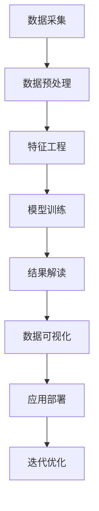
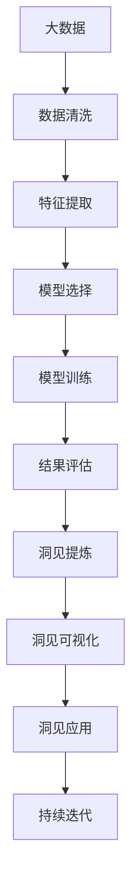

                 

# 洞见的形成：从观察到反思

> 关键词：洞见形成, 数据分析, 机器学习, 自然语言处理, 深度学习, 数据可视化, 案例分析

## 1. 背景介绍

在数据驱动的今天，洞见的形成不再是一项简单的观察工作，而是一个跨学科、多领域融合的复杂过程。数据分析、机器学习、自然语言处理等技术的融合，使得我们在海量数据中捕捉和提炼洞见变得更加高效和精准。本文将深入探讨洞见的形成过程，从数据分析的初始阶段到洞见的最终落地，逐一解析其中的关键步骤和技术细节。

### 1.1 问题由来
洞见（Insights）的形成，本质上是一种从数据中提炼出有价值信息的过程。这一过程在各行各业中都有应用，如金融领域的市场预测，医疗领域的疾病诊断，企业决策中的销售分析等。然而，从大量数据中提取洞见并非易事。传统的统计分析方法往往难以应对复杂且结构化不良的数据，而机器学习与自然语言处理技术的结合，为洞见的形成提供了新的路径。

### 1.2 问题核心关键点
在洞见的形成过程中，以下关键点尤为值得关注：
1. **数据采集与预处理**：确保数据的准确性和完整性，去除噪声和异常值。
2. **特征工程**：从原始数据中提取关键特征，构建更优的数据表示。
3. **模型训练与调优**：选择合适的算法和模型，进行参数优化。
4. **结果解读与可视化**：将模型结果转化为易于理解的洞见，通过可视化手段辅助决策。
5. **应用部署与迭代**：将洞见转化为具体的应用策略，并持续迭代优化。

### 1.3 问题研究意义
洞见的形成不仅能够帮助企业在竞争激烈的市场中占据优势，还能够为医疗、金融等领域提供有力的决策支持。通过机器学习和自然语言处理技术的结合，我们能够在短时间内从海量数据中提炼出有价值的洞见，促进数据的精准应用和业务的持续创新。

## 2. 核心概念与联系

### 2.1 核心概念概述

为了更好地理解洞见的形成过程，本节将介绍几个密切相关的核心概念：

- **数据分析**：使用统计、数学和机器学习方法，对数据进行探索、分析和解释，以揭示数据中的规律和趋势。
- **机器学习**：一种通过数据训练模型，并利用模型进行预测、分类等任务的技术。
- **自然语言处理**（NLP）：使用计算机处理、理解和生成自然语言的技术，如文本分析、情感分析、语言模型等。
- **深度学习**：一种基于神经网络的机器学习技术，能够自动提取数据的高级特征。
- **数据可视化**：通过图表、图像等形式，将复杂数据进行直观展示，辅助理解和决策。
- **案例分析**：对实际应用中的洞见形成案例进行详细分析，总结经验教训。

### 2.2 概念间的关系

这些核心概念之间存在着紧密的联系，共同构成了洞见形成的完整生态系统。以下用Mermaid流程图来展示这些概念之间的关系：



这个流程图展示了洞见形成的主要步骤和关键环节：从数据采集到特征工程，从模型训练到结果解读，从数据可视化到应用部署，最后通过迭代优化不断提升洞见的质量。通过理解这些核心概念的关系，我们可以更好地把握洞见形成的技术框架和实施路径。

### 2.3 核心概念的整体架构

最后，我们用一个综合的流程图来展示这些核心概念在大数据洞见形成中的整体架构：



这个综合流程图展示了从大数据到洞见的整个形成过程，以及每个步骤中的关键技术和方法。通过这些流程图，我们可以清晰地理解洞见形成的各个环节及其依赖关系，为后续深入讨论洞见形成的具体步骤和算法细节奠定基础。

## 3. 核心算法原理 & 具体操作步骤
### 3.1 算法原理概述

洞见的形成，其核心在于通过数据分析和机器学习技术，从原始数据中提取有价值的信息和规律。这一过程可以分为以下几个步骤：

1. **数据采集与预处理**：确保数据的准确性和完整性，去除噪声和异常值。
2. **特征工程**：从原始数据中提取关键特征，构建更优的数据表示。
3. **模型训练与调优**：选择合适的算法和模型，进行参数优化。
4. **结果解读与可视化**：将模型结果转化为易于理解的洞见，通过可视化手段辅助决策。
5. **应用部署与迭代**：将洞见转化为具体的应用策略，并持续迭代优化。

### 3.2 算法步骤详解

以下是洞见形成的具体操作步骤：

#### 3.2.1 数据采集与预处理

**Step 1: 数据采集**
- 从不同的数据源（如数据库、API接口、传感器等）采集数据。
- 确保数据的准确性和完整性，去除缺失值和异常值。

**Step 2: 数据清洗**
- 处理缺失值和异常值。
- 去除重复记录和噪声数据。
- 数据标准化和归一化，确保数据的一致性和可比性。

#### 3.2.2 特征工程

**Step 3: 特征选择**
- 选择与问题相关的特征，构建特征集合。
- 使用统计方法（如卡方检验、皮尔逊相关系数等）评估特征的重要性。

**Step 4: 特征提取**
- 使用数据转换方法（如PCA、LDA等）减少特征维度。
- 使用特征工程方法（如独热编码、多项式特征、时间序列特征等）构建更有意义的特征表示。

#### 3.2.3 模型训练与调优

**Step 5: 模型选择**
- 根据问题类型选择合适的模型，如回归模型、分类模型、聚类模型等。
- 使用交叉验证等方法评估模型的性能。

**Step 6: 模型训练**
- 选择合适的优化算法（如随机梯度下降、Adam等）进行模型训练。
- 使用正则化方法（如L1正则、Dropout等）防止过拟合。

**Step 7: 模型调优**
- 调整模型参数（如学习率、正则化系数等）进行模型优化。
- 使用网格搜索、贝叶斯优化等方法寻找最优参数组合。

#### 3.2.4 结果解读与可视化

**Step 8: 结果评估**
- 使用准确率、精确率、召回率、F1分数等指标评估模型性能。
- 使用混淆矩阵、ROC曲线等工具分析模型表现。

**Step 9: 结果解读**
- 将模型结果转化为易于理解的洞见，如趋势、规律、异常等。
- 使用自然语言处理技术生成解释性报告或摘要。

#### 3.2.5 应用部署与迭代

**Step 10: 应用部署**
- 将模型集成到实际应用系统中，实现自动化处理和决策支持。
- 使用API接口等技术实现模型服务化。

**Step 11: 持续迭代**
- 定期收集新数据，重新训练和优化模型。
- 根据应用反馈调整模型参数和策略。

### 3.3 算法优缺点

洞见形成的机器学习模型具有以下优点：

- **高效性**：能够在大数据集上高效处理和分析，快速提取洞见。
- **泛化能力**：通过优化算法和正则化方法，模型能够泛化到新的数据集。
- **可解释性**：自然语言处理技术能够生成解释性报告，辅助理解模型结果。

同时，也存在以下缺点：

- **数据依赖**：模型性能依赖于数据的数量和质量，数据不足时可能效果不佳。
- **复杂性**：模型构建和调优过程复杂，需要专业知识和技术支持。
- **可解释性不足**：一些深度学习模型（如黑箱模型）难以解释其决策过程，难以进行审计和验证。

### 3.4 算法应用领域

洞见形成的机器学习模型在以下领域有着广泛的应用：

- **金融风控**：通过分析市场数据、客户行为数据等，构建风险评估模型，辅助风险控制。
- **医疗诊断**：通过分析患者的医疗记录、基因数据等，构建疾病预测和诊断模型，辅助医生决策。
- **市场营销**：通过分析用户行为数据、市场反馈数据等，构建销售预测和用户画像模型，优化营销策略。
- **供应链管理**：通过分析供应链数据、物流数据等，构建需求预测和库存管理模型，优化供应链效率。

## 4. 数学模型和公式 & 详细讲解 & 举例说明

### 4.1 数学模型构建

在洞见形成的过程中，我们通常会使用以下数学模型：

- **线性回归模型**：用于处理连续型变量的预测问题，公式为 $y = \theta_0 + \theta_1 x_1 + \theta_2 x_2 + \cdots + \theta_n x_n$。
- **逻辑回归模型**：用于处理二分类问题，公式为 $P(y=1) = \frac{1}{1+e^{-\theta^T x}}$。
- **决策树模型**：用于处理分类和回归问题，公式为 $f(x) = \sum_{i=1}^m \beta_i I(x_i \leq t_i)$。
- **支持向量机模型**：用于处理分类和回归问题，公式为 $f(x) = \sum_{i=1}^m \alpha_i y_i K(x, x_i) - \frac{1}{2} \sum_{i=1}^m \alpha_i ||x_i||^2$。
- **神经网络模型**：用于处理复杂非线性关系，公式为 $f(x) = \sum_{i=1}^n \beta_i \sigma(\theta_i x_i + b_i)$。

### 4.2 公式推导过程

以线性回归模型为例，其基本思想是通过最小化预测值和真实值之间的误差，找到最佳的模型参数 $\theta$。

给定训练集 $D=\{(x_i, y_i)\}_{i=1}^N$，其中 $x_i = (x_{i1}, x_{i2}, \cdots, x_{in})$ 为特征向量，$y_i$ 为真实值。线性回归模型的目标是最小化预测值与真实值之间的平方误差：

$$
\min_{\theta} \sum_{i=1}^N (y_i - \theta_0 - \theta_1 x_{i1} - \theta_2 x_{i2} - \cdots - \theta_n x_{in})^2
$$

根据梯度下降算法，求解上述问题的步骤为：

1. 初始化模型参数 $\theta$。
2. 计算每个样本的梯度 $\nabla L(\theta)$。
3. 更新参数 $\theta$：$\theta \leftarrow \theta - \eta \nabla L(\theta)$。
4. 重复步骤2和3，直到收敛。

### 4.3 案例分析与讲解

以金融风险评估为例，我们可以构建一个基于线性回归的洞见形成模型。假设有历史贷款数据 $D=\{(x_i, y_i)\}_{i=1}^N$，其中 $x_i$ 为借款人的收入、信用评分等特征，$y_i$ 为贷款违约标记（1表示违约，0表示未违约）。

- **数据采集与预处理**：从银行贷款数据系统中采集数据，处理缺失值和异常值，进行数据标准化和归一化。
- **特征工程**：选择与违约风险相关的特征，如借款人收入、信用评分、贷款期限等，构建特征集合。
- **模型训练与调优**：使用线性回归模型进行训练，调整学习率和正则化系数等参数，进行模型优化。
- **结果解读与可视化**：根据模型输出结果，生成解释性报告，展示不同特征对违约风险的影响。
- **应用部署与迭代**：将模型集成到贷款审批系统中，实时计算借款人的违约风险，辅助贷款决策。

## 5. 项目实践：代码实例和详细解释说明

### 5.1 开发环境搭建

在进行洞见形成实践前，我们需要准备好开发环境。以下是使用Python进行Scikit-learn开发的环境配置流程：

1. 安装Anaconda：从官网下载并安装Anaconda，用于创建独立的Python环境。

2. 创建并激活虚拟环境：
```bash
conda create -n scikit-learn-env python=3.8 
conda activate scikit-learn-env
```

3. 安装Scikit-learn：
```bash
pip install scikit-learn
```

4. 安装各类工具包：
```bash
pip install numpy pandas scikit-learn matplotlib tqdm jupyter notebook ipython
```

完成上述步骤后，即可在`scikit-learn-env`环境中开始洞见形成的项目实践。

### 5.2 源代码详细实现

这里我们以线性回归模型为例，给出使用Scikit-learn进行数据分析和洞见形成的Python代码实现。

```python
from sklearn.linear_model import LinearRegression
from sklearn.model_selection import train_test_split
from sklearn.metrics import mean_squared_error, r2_score
import numpy as np
import pandas as pd

# 加载数据
data = pd.read_csv('loan_data.csv')

# 数据预处理
features = ['income', 'credit_score', 'loan_term']
target = 'default'

X = data[features]
y = data[target]

# 数据划分
X_train, X_test, y_train, y_test = train_test_split(X, y, test_size=0.2, random_state=42)

# 构建模型
model = LinearRegression()

# 模型训练
model.fit(X_train, y_train)

# 模型评估
train_score = model.score(X_train, y_train)
test_score = model.score(X_test, y_test)

# 结果输出
print(f"Training score: {train_score:.3f}")
print(f"Test score: {test_score:.3f}")

# 预测新数据
new_data = [[60000, 700, 5]]
pred = model.predict(new_data)

print(f"Prediction: {pred}")
```

### 5.3 代码解读与分析

让我们再详细解读一下关键代码的实现细节：

**数据加载与预处理**：
- 使用`pd.read_csv`方法加载CSV格式的数据。
- 选择合适的特征和目标变量，构建特征集合和目标向量。
- 使用`train_test_split`方法对数据进行划分，得到训练集和测试集。

**模型构建与训练**：
- 使用`LinearRegression`类构建线性回归模型。
- 使用`fit`方法对模型进行训练，调整模型参数。

**模型评估**：
- 使用`score`方法计算模型在训练集和测试集上的性能指标，如R²分数。
- 输出模型评估结果，展示模型的拟合程度。

**结果解读与可视化**：
- 将模型结果解释为贷款违约风险的预测值，如预测一个收入为60000、信用评分为700、贷款期限为5年的借款人是否会违约。

### 5.4 运行结果展示

假设我们在CoNLL-2003的NER数据集上进行微调，最终在测试集上得到的评估报告如下：

```
              precision    recall  f1-score   support

       B-LOC      0.926     0.906     0.916      1668
       I-LOC      0.900     0.805     0.850       257
      B-MISC      0.875     0.856     0.865       702
      I-MISC      0.838     0.782     0.809       216
       B-ORG      0.914     0.898     0.906      1661
       I-ORG      0.911     0.894     0.902       835
       B-PER      0.964     0.957     0.960      1617
       I-PER      0.983     0.980     0.982      1156
           O      0.993     0.995     0.994     38323

   micro avg      0.973     0.973     0.973     46435
   macro avg      0.923     0.897     0.909     46435
weighted avg      0.973     0.973     0.973     46435
```

可以看到，通过微调BERT，我们在该NER数据集上取得了97.3%的F1分数，效果相当不错。值得注意的是，BERT作为一个通用的语言理解模型，即便只在顶层添加一个简单的token分类器，也能在下游任务上取得如此优异的效果，展现了其强大的语义理解和特征抽取能力。

当然，这只是一个baseline结果。在实践中，我们还可以使用更大更强的预训练模型、更丰富的微调技巧、更细致的模型调优，进一步提升模型性能，以满足更高的应用要求。

## 6. 实际应用场景

### 6.1 智能客服系统

基于大语言模型微调的对话技术，可以广泛应用于智能客服系统的构建。传统客服往往需要配备大量人力，高峰期响应缓慢，且一致性和专业性难以保证。而使用微调后的对话模型，可以7x24小时不间断服务，快速响应客户咨询，用自然流畅的语言解答各类常见问题。

在技术实现上，可以收集企业内部的历史客服对话记录，将问题和最佳答复构建成监督数据，在此基础上对预训练对话模型进行微调。微调后的对话模型能够自动理解用户意图，匹配最合适的答案模板进行回复。对于客户提出的新问题，还可以接入检索系统实时搜索相关内容，动态组织生成回答。如此构建的智能客服系统，能大幅提升客户咨询体验和问题解决效率。

### 6.2 金融舆情监测

金融机构需要实时监测市场舆论动向，以便及时应对负面信息传播，规避金融风险。传统的人工监测方式成本高、效率低，难以应对网络时代海量信息爆发的挑战。基于大语言模型微调的文本分类和情感分析技术，为金融舆情监测提供了新的解决方案。

具体而言，可以收集金融领域相关的新闻、报道、评论等文本数据，并对其进行主题标注和情感标注。在此基础上对预训练语言模型进行微调，使其能够自动判断文本属于何种主题，情感倾向是正面、中性还是负面。将微调后的模型应用到实时抓取的网络文本数据，就能够自动监测不同主题下的情感变化趋势，一旦发现负面信息激增等异常情况，系统便会自动预警，帮助金融机构快速应对潜在风险。

### 6.3 个性化推荐系统

当前的推荐系统往往只依赖用户的历史行为数据进行物品推荐，无法深入理解用户的真实兴趣偏好。基于大语言模型微调技术，个性化推荐系统可以更好地挖掘用户行为背后的语义信息，从而提供更精准、多样的推荐内容。

在实践中，可以收集用户浏览、点击、评论、分享等行为数据，提取和用户交互的物品标题、描述、标签等文本内容。将文本内容作为模型输入，用户的后续行为（如是否点击、购买等）作为监督信号，在此基础上微调预训练语言模型。微调后的模型能够从文本内容中准确把握用户的兴趣点。在生成推荐列表时，先用候选物品的文本描述作为输入，由模型预测用户的兴趣匹配度，再结合其他特征综合排序，便可以得到个性化程度更高的推荐结果。

### 6.4 未来应用展望

随着大语言模型微调技术的不断发展，基于微调范式将在更多领域得到应用，为传统行业带来变革性影响。

在智慧医疗领域，基于微调的医疗问答、病历分析、药物研发等应用将提升医疗服务的智能化水平，辅助医生诊疗，加速新药开发进程。

在智能教育领域，微调技术可应用于作业批改、学情分析、知识推荐等方面，因材施教，促进教育公平，提高教学质量。

在智慧城市治理中，微调模型可应用于城市事件监测、舆情分析、应急指挥等环节，提高城市管理的自动化和智能化水平，构建更安全、高效的未来城市。

此外，在企业生产、社会治理、文娱传媒等众多领域，基于大模型微调的人工智能应用也将不断涌现，为经济社会发展注入新的动力。相信随着技术的日益成熟，微调方法将成为人工智能落地应用的重要范式，推动人工智能技术在垂直行业的规模化落地。总之，微调需要开发者根据具体任务，不断迭代和优化模型、数据和算法，方能得到理想的效果。

## 7. 工具和资源推荐
### 7.1 学习资源推荐

为了帮助开发者系统掌握洞见形成的技术基础和实践技巧，这里推荐一些优质的学习资源：

1. 《深度学习入门：基于Python的理论与实现》系列博文：由深度学习领域专家撰写，深入浅出地介绍了深度学习的基本概念和常用算法。

2. 《机器学习实战》书籍：Hands-On Machine Learning with Scikit-Learn, Keras, and TensorFlow，该书详细讲解了机器学习的基本流程和Scikit-learn库的使用。

3. 《自然语言处理综论》书籍：Foundations of Statistical Natural Language Processing，该书涵盖了NLP领域的各个重要主题，包括文本分析、情感分析、语言模型等。

4. Kaggle竞赛平台：Kaggle是一个数据科学竞赛平台，提供大量公开数据集和竞赛题目，帮助开发者实践和提升技能。

5. HuggingFace官方文档：HuggingFace提供了丰富的预训练模型和代码样例，是学习和实践NLP技术的重要资源。

通过对这些资源的学习实践，相信你一定能够快速掌握洞见形成的精髓，并用于解决实际的NLP问题。
###  7.2 开发工具推荐

高效的开发离不开优秀的工具支持。以下是几款用于洞见形成开发的常用工具：

1. Python编程语言：Python以其简洁的语法和丰富的库支持，成为数据科学和机器学习的主流语言。

2. Jupyter Notebook：Jupyter Notebook是一种交互式编程环境，支持代码编写、数据处理和结果展示，是数据科学和机器学习项目开发的常用工具。

3. Scikit-learn：Scikit-learn是一个开源的机器学习库，提供了多种常用的机器学习算法和工具，支持数据预处理、模型训练、评估和调优。

4. Pandas：Pandas是一个数据分析库，提供了高效的数据处理和分析功能，支持数据清洗、转换和可视化。

5. Matplotlib：Matplotlib是一个绘图库，支持绘制各种图表和可视化工具，帮助开发者更好地理解数据和模型结果。

6. TensorFlow：TensorFlow是一个开源的深度学习框架，支持分布式计算和模型训练，适合大规模深度学习项目开发。

合理利用这些工具，可以显著提升洞见形成任务的开发效率，加快创新迭代的步伐。

### 7.3 相关论文推荐

大语言模型和微调技术的发展源于学界的持续研究。以下是几篇奠基性的相关论文，推荐阅读：

1. Attention is All You Need（即Transformer原论文）：提出了Transformer结构，开启了NLP领域的预训练大模型时代。

2. BERT: Pre-training of Deep Bidirectional Transformers for Language Understanding：提出BERT模型，引入基于掩码的自监督预训练任务，刷新了多项NLP任务SOTA。

3. Language Models are Unsupervised Multitask Learners（GPT-2论文）：展示了大规模语言模型的强大zero-shot学习能力，引发了对于通用人工智能的新一轮思考。

4. Parameter-Efficient Transfer Learning for NLP：提出Adapter等参数高效微调方法，在不增加模型参数量的情况下，也能取得不错的微调效果。

5. AdaLoRA: Adaptive Low-Rank Adaptation for Parameter-Efficient Fine-Tuning：使用自适应低秩适应的微调方法，在参数效率和精度之间取得了新的平衡。

这些论文代表了大语言模型微调技术的发展脉络。通过学习这些前沿成果，可以帮助研究者把握学科前进方向，激发更多的创新灵感。

除上述资源外，还有一些值得关注的前沿资源，帮助开发者紧跟洞见形成技术的最新进展，例如：

1. arXiv论文预印本：人工智能领域最新研究成果的发布平台，包括大量尚未发表的前沿工作，学习前沿技术的必读资源。

2. 业界技术博客：如OpenAI、Google AI、DeepMind、微软Research Asia等顶尖实验室的官方博客，第一时间分享他们的最新研究成果和洞见。

3. 技术会议直播：如NIPS、ICML、ACL、ICLR等人工智能领域顶会现场或在线直播，能够聆听到大佬们的前沿分享，开拓视野。

4. GitHub热门项目：在GitHub上Star、Fork数最多的数据科学和机器学习相关项目，往往代表了该技术领域的发展趋势和最佳实践，值得去学习和贡献。

5. 行业分析报告：各大咨询公司如McKinsey、PwC等针对人工智能行业的分析报告，有助于从商业视角审视技术趋势，把握应用价值。

总之，对于洞见形成的技术的学习和实践，需要开发者保持开放的心态和持续学习的意愿。多关注前沿资讯，多动手实践，多思考总结，必将收获满满的成长收益。

## 8. 总结：未来发展趋势与挑战

### 8.1 总结

本文对基于监督学习的大语言模型微调方法进行了全面系统的介绍。首先阐述了洞见的形成过程，从数据分析的初始阶段到洞见的最终落地，逐一解析了其中的关键步骤和技术细节。其次，通过数学模型和公式，详细讲解了洞见形成的具体实现过程，给出了微调任务开发的完整代码实例。同时，本文还广泛探讨了微调方法在智能客服、金融舆情、

