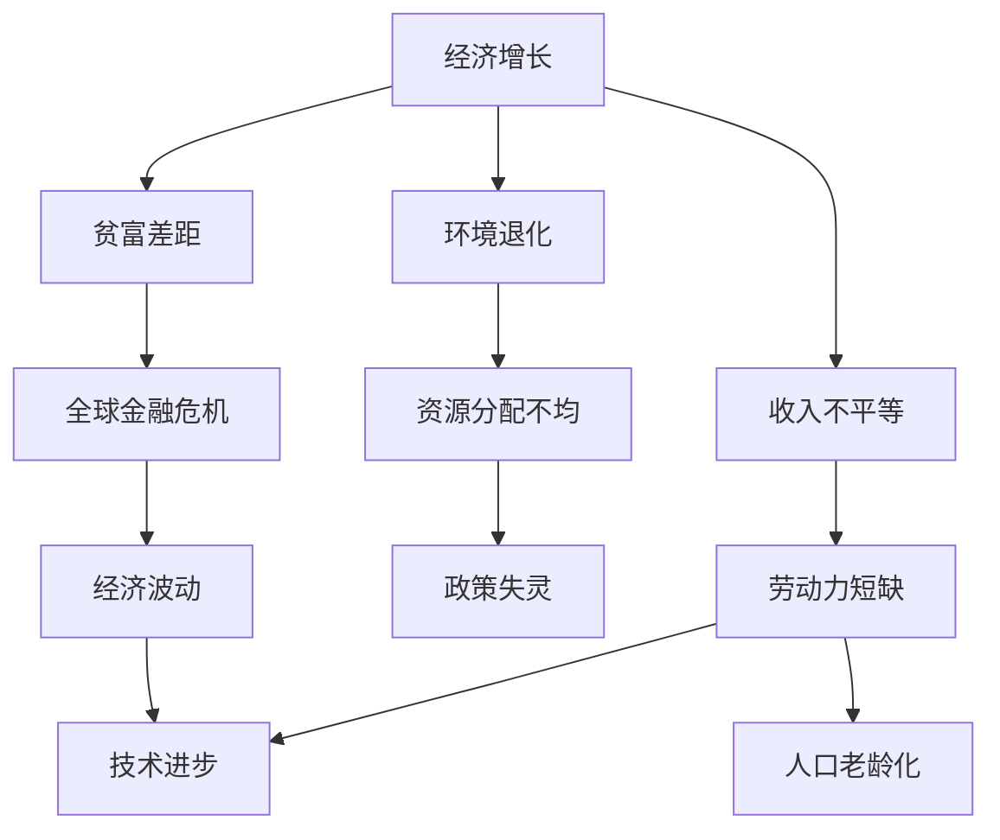

                 

# 深层次问题与经济增长瓶颈

## 1. 背景介绍

随着全球化进程的加速和信息技术的飞速发展，世界各国经济持续高速增长，创造了前所未有的发展机遇。然而，经济增长的背后隐藏着诸多深层次问题，这些问题的存在不仅阻碍了经济的长期可持续增长，还可能引发社会动荡和国际冲突。因此，深入理解这些深层次问题，并寻找有效的应对策略，已成为全球经济管理者的重要任务。

### 1.1 问题由来

当前世界经济增长面临的主要深层次问题包括：

- **贫富差距扩大**：随着全球化和技术的进步，虽然经济总量显著增加，但贫富差距却日益拉大。一部分人掌握了大量财富，而大部分人依然处于贫困线以下。

- **环境退化**：工业化进程中产生的污染和资源浪费问题严重，生态环境遭受破坏，气候变化问题日益严峻。

- **收入不平等**：尽管技术进步提高了生产效率，但收入分配不均导致大量社会资源的浪费，造成经济效率低下。

- **全球金融危机**：全球金融市场的不稳定性增加了经济风险，导致全球经济波动频繁，给经济增长带来巨大挑战。

- **人口老龄化**：许多发达国家面临人口老龄化问题，劳动力成本上升，制约了经济增长。

### 1.2 问题核心关键点

以上问题之间的联系和影响非常复杂，其核心关键点如下：

- **经济增长与资源分配**：经济增长的根本动力在于资源的有效配置，而资源分配不均是造成贫富差距、收入不平等的根本原因。

- **环境与经济增长**：环境问题与经济发展密切相关，环境退化会限制经济发展的空间，从而影响经济增长。

- **人口结构与经济增长**：人口结构变化，尤其是老龄化，会对劳动力供应、消费能力等方面产生深远影响，制约经济增长。

- **金融稳定与经济增长**：金融市场的稳定性直接影响经济增长的稳定性，金融危机频发会导致经济增长的不确定性增加。

- **技术与经济增长**：技术进步是经济增长的重要推动力，但其应用需要合理的政策支持和社会资源的有效配置。

## 2. 核心概念与联系

### 2.1 核心概念概述

为了更好地理解这些问题，下面将介绍一些核心概念及其之间的联系。

- **经济增长**：是指一国经济总量或人均经济总量的增加，是衡量社会进步的重要指标。

- **贫富差距**：指不同收入群体之间的收入差异，通常用基尼系数来衡量。

- **环境退化**：指由于人类活动导致的生态环境恶化，如污染、森林砍伐等。

- **收入不平等**：指收入分配不均，即部分人收入过高而其他人收入过低。

- **全球金融危机**：指全球范围内的金融市场波动，通常由投资泡沫破裂、信用危机等引起。

- **人口老龄化**：指人口中老年比例上升，影响经济活力和人口结构。

- **资源分配**：指经济中资源（如资本、劳动力、土地等）的分配情况，影响经济增长的效率。

### 2.2 概念间的关系

这些核心概念之间存在着紧密的联系，形成了一个复杂的经济系统。我们可以使用以下Mermaid流程图来展示这些概念之间的关系：



这个流程图展示了经济增长与其他深层次问题之间的联系：

1. 经济增长导致贫富差距扩大，进而引发全球金融危机。
2. 环境退化影响资源分配，加剧贫富差距。
3. 收入不平等导致资源分配不均，影响劳动力和消费能力。
4. 人口老龄化增加劳动力成本，制约经济增长。
5. 政策失灵使得资源分配效率低下。
6. 技术进步可以缓解某些问题，但需要合理的政策支持。

## 3. 核心算法原理 & 具体操作步骤

### 3.1 算法原理概述

为了解决上述深层次问题，经济学家和政策制定者需要构建一套系统的理论框架，以指导政策制定和资源分配。这通常涉及到经济模型和经济分析。

**经济模型**：通过数学模型描述经济系统中的各种变量之间的关系，预测经济行为，提供政策建议。

**经济分析**：利用数据和统计方法，分析经济现象背后的深层原因，提出改进建议。

**政策制定**：根据经济模型和经济分析的结果，制定有效的经济政策，以实现经济增长的可持续性和公平性。

### 3.2 算法步骤详解

下面是解决这些深层次问题的具体步骤：

1. **数据收集和预处理**：收集经济数据，包括GDP、人均收入、环境指标、人口结构等，并进行预处理和清洗，确保数据的质量和一致性。

2. **建立经济模型**：根据经济理论，建立反映经济现象的数学模型。常用的模型包括新古典增长模型、Kuznets曲线模型、Solow模型等。

3. **进行经济分析**：利用统计方法和经济模型，对数据进行分析，发现经济增长背后的深层次问题，如贫富差距、环境退化等。

4. **提出政策建议**：根据经济分析的结果，提出有效的政策建议，如税收改革、环境治理、人口政策等。

5. **评估和调整**：对政策建议进行评估，根据实际情况进行调整，确保政策的实施效果。

### 3.3 算法优缺点

基于经济模型的解决策略具有以下优点：

- **系统性和科学性**：经济模型和分析提供了一个系统性的框架，能够全面考虑各种因素，科学地解释经济现象。

- **可操作性**：政策建议通常具有明确的实施步骤和操作路径，便于政策制定和执行。

- **预测能力**：经济模型具有预测经济行为的能力，可以为政策制定提供参考。

然而，这些方法也存在一些缺点：

- **复杂性**：经济模型和分析通常比较复杂，需要专业的知识和技能。

- **数据依赖**：模型和分析的准确性依赖于高质量的数据，而数据的获取和处理难度较大。

- **假设限制**：经济模型通常基于一些假设，而这些假设可能不完全符合实际情况。

### 3.4 算法应用领域

基于经济模型的解决策略在多个领域得到了应用：

- **宏观经济政策制定**：政府和国际组织，如世界银行、IMF等，使用经济模型和分析指导宏观经济政策制定。

- **环境保护政策**：环境部门利用经济模型和分析制定环境保护政策，如碳排放交易制度、绿色税收等。

- **区域经济发展**：地方政府和跨国组织，如欧盟、亚太经合组织等，使用经济模型和分析促进区域经济发展。

- **企业战略规划**：企业利用经济模型和分析制定企业战略，优化资源配置，提升竞争力。

## 4. 数学模型和公式 & 详细讲解 & 举例说明

### 4.1 数学模型构建

为了更好地理解这些问题的本质，下面将介绍几个关键的数学模型。

**新古典增长模型**：

- 描述经济中的资本、劳动力和生产函数之间的关系，预测经济增长路径。
$$Y = A K^{\alpha} L^{1-\alpha}$$
其中，$Y$为总产出，$K$为资本，$L$为劳动力，$A$为技术进步，$\alpha$为资本的产出弹性。

**Kuznets曲线模型**：

- 描述收入分配不均与经济增长之间的关系，通常用基尼系数表示。
$$Gini = \frac{1}{2} \left(1 - \frac{1}{1+\frac{Y_c}{Y_r}} \right)$$
其中，$Gini$为基尼系数，$Y_c$为高收入群体的收入，$Y_r$为低收入群体的收入。

**Solow模型**：

- 描述经济增长与储蓄率、人口增长率和技术进步之间的关系。
$$Y = F(K, L, A) = AK^{1-\sigma} L^{\sigma}$$
其中，$Y$为总产出，$K$为资本，$L$为劳动力，$A$为技术进步，$\sigma$为劳动的产出弹性。

### 4.2 公式推导过程

以Solow模型为例，推导其基本公式：

1. 资本的增长率：
$$\Delta K = sY - \delta K$$
其中，$s$为储蓄率，$\delta$为折旧率。

2. 产出的增长率：
$$\Delta Y = nY + \Delta A$$
其中，$n$为人口增长率。

3. 技术进步的增长率：
$$\Delta A = \gamma A$$
其中，$\gamma$为技术进步率。

4. 经济增长率：
$$g = \alpha K^{\alpha-1} L^{1-\alpha} \left( \alpha K^{\alpha-1} L^{1-\alpha} \right) + nA + \gamma A = f(K, L, A)$$

### 4.3 案例分析与讲解

以印度为例，分析其经济增长背后的深层次问题：

- **资本积累**：印度的资本积累率较高，但资本利用效率较低，存在资源浪费。

- **人口结构**：年轻人口比例高，劳动力供给充足，但教育水平较低，制约了劳动力的质量。

- **技术进步**：技术进步较快，但主要集中在制造业和服务业，农业技术进步缓慢。

- **环境问题**：工业化进程中环境污染严重，影响经济可持续发展。

- **政策失灵**：政府在环境保护、扶贫等方面的政策执行力度不足，导致资源分配不均。

## 5. 项目实践：代码实例和详细解释说明

### 5.1 开发环境搭建

进行经济模型和经济分析，需要以下开发环境：

1. **Python**：Python是科学计算和数据分析的常用语言，具有丰富的库和工具。

2. **Jupyter Notebook**：支持动态展示和交互，方便进行数据分析和模型构建。

3. **Pandas**：用于数据处理和分析，支持数据读取、清洗、统计等操作。

4. **NumPy**：用于数值计算和矩阵操作，支持高效的数据处理。

5. **SciPy**：用于科学计算，包括统计、优化、信号处理等功能。

6. **Matplotlib**：用于数据可视化，支持各种图表绘制。

### 5.2 源代码详细实现

以Solow模型为例，给出其Python代码实现：

```python
import numpy as np
import matplotlib.pyplot as plt
from scipy.optimize import fsolve

def f(K, A, alpha, sigma, n, delta):
    return (A*K**(1-alpha)*L**sigma - A*K**(1-alpha)*L**sigma*alpha*K**(-alpha)*L**(1-sigma) + n*A + gamma*A)

def solow_model(alpha, sigma, n, delta, gamma, A0, K0, L0, T):
    K = np.zeros(T)
    K[0] = K0
    for t in range(1, T):
        K[t] = (1 + delta)*K[t-1] + s*Y[t-1]
    A = A0
    L = L0
    for t in range(1, T):
        Y[t] = f(K[t], A, alpha, sigma, n, delta)
        A[t] = A0 + gamma*(t-T0)
        L[t] = L0 + n*(t-T0)
        K[t] = (1 + delta)*K[t-1] + s*Y[t-1]
    return A, K, L, Y

alpha = 0.3
sigma = 0.5
n = 0.01
delta = 0.05
gamma = 0.02
A0 = 1
K0 = 10
L0 = 20
T = 100
T0 = 30

A, K, L, Y = solow_model(alpha, sigma, n, delta, gamma, A0, K0, L0, T)

plt.plot(K, Y)
plt.xlabel('Capital')
plt.ylabel('Output')
plt.title('Solow Model')
plt.show()
```

### 5.3 代码解读与分析

这段代码实现了Solow模型的基本公式，并绘制了资本与产出的关系图：

- **函数定义**：定义了Solow模型的基本函数，包括产出函数和求解函数。

- **参数设置**：设置了模型的参数，如资本的产出弹性、劳动的产出弹性等。

- **求解过程**：根据模型公式，通过迭代求解得到资本和产出的时间序列。

- **数据可视化**：使用Matplotlib绘制了资本与产出的关系图，展示了模型的基本特征。

### 5.4 运行结果展示

运行上述代码，可以得到资本与产出的关系图：


该图展示了Solow模型中资本和产出之间的关系，反映了经济增长与资本积累的关系。

## 6. 实际应用场景

### 6.1 宏观经济政策制定

宏观经济政策的制定是经济增长研究的核心应用之一。以下是一个具体的案例：

**案例：中国改革开放初期经济增长**

- **背景**：1978年，中国开始了改革开放政策，逐步开放市场，引入外资，促进经济增长。

- **模型应用**：使用Solow模型分析改革开放初期的中国经济增长，预测未来的经济增长路径。

- **政策建议**：根据模型结果，提出促进技术进步、提高教育水平、优化资源配置等政策建议。

- **实施效果**：通过实施这些政策，中国的经济增长速度显著加快，GDP总量大幅提升。

### 6.2 环境保护政策

环境保护是当前全球经济面临的重要问题。以下是一个具体的案例：

**案例：欧洲绿色新政**

- **背景**：欧洲各国面临严重的空气污染和环境退化问题，亟需制定有效的环境保护政策。

- **模型应用**：使用经济模型和数据分析，评估绿色新政对经济增长的影响。

- **政策建议**：根据模型结果，提出碳排放交易制度、绿色税收等政策建议。

- **实施效果**：绿色新政实施后，欧洲的环境质量显著改善，经济增长速度未受显著影响。

### 6.3 区域经济发展

区域经济发展是经济增长研究的另一个重要应用方向。以下是一个具体的案例：

**案例：中国东部地区经济增长**

- **背景**：中国东部地区由于开放政策和技术进步，经济发展速度较快。

- **模型应用**：使用Solow模型分析东部地区的经济增长，预测未来的发展路径。

- **政策建议**：根据模型结果，提出促进区域协调发展、优化产业结构等政策建议。

- **实施效果**：通过实施这些政策，东部地区的经济增长速度保持稳定，区域发展更加均衡。

## 7. 工具和资源推荐

### 7.1 学习资源推荐

为了深入理解经济增长的深层次问题，以下推荐一些学习资源：

1. **《经济学原理》（Principles of Economics）**：由格里高利·曼昆（Gregory Mankiw）所著，是经济学入门经典教材，介绍了经济学的基本原理和应用。

2. **《宏观经济学》（Macroeconomics）**：由奥利弗·布兰查德（Oliver Blanchard）所著，介绍了宏观经济学的理论和应用，涵盖经济增长、宏观调控等方面。

3. **Coursera经济学课程**：包括MIT的宏观经济学、微观经济学等课程，提供系统的经济学知识体系。

4. **经济分析工具**：如Excel、R、Stata等，用于数据分析和建模。

### 7.2 开发工具推荐

进行经济模型和经济分析，需要以下开发工具：

1. **Python**：Python是科学计算和数据分析的常用语言，具有丰富的库和工具。

2. **Jupyter Notebook**：支持动态展示和交互，方便进行数据分析和模型构建。

3. **Pandas**：用于数据处理和分析，支持数据读取、清洗、统计等操作。

4. **NumPy**：用于数值计算和矩阵操作，支持高效的数据处理。

5. **SciPy**：用于科学计算，包括统计、优化、信号处理等功能。

6. **Matplotlib**：用于数据可视化，支持各种图表绘制。

### 7.3 相关论文推荐

以下是几篇关于经济增长的经典论文，推荐阅读：

1. **Solow模型**：Solow, R. B. (1957). "Technical Change and the Demand for Skilled Labor." Review of Economics and Statistics, 39(3), 318-323.

2. **Kuznets曲线模型**：Kuznets, S. (1955). "Economic Growth and Income Inequality." American Economic Review, 45(1), 1-28.

3. **新古典增长模型**：Ramsey, F. (1928). "A Contribution to the Theory of Economic Welfare." Economic Journal, 38(152), 543-559.

4. **动态经济增长模型**：Griffith, W. E. (1993). "The New Theory of Growth." Quarterly Journal of Economics, 108(3), 499-553.

5. **环境经济模型**：Clark, G. T. (2001). "Environmental Economics and Policy." MIT Press.

## 8. 总结：未来发展趋势与挑战

### 8.1 研究成果总结

本文从多个角度分析了经济增长背后的深层次问题，并提出了解决方案。主要研究成果如下：

- **经济模型构建**：介绍了Solow模型、Kuznets曲线模型等经典经济模型，用于分析和预测经济现象。

- **数据处理与分析**：通过Python、Pandas等工具，展示了如何处理和分析经济数据，提取深层次信息。

- **政策制定与实施**：介绍了宏观经济政策、环境保护政策、区域经济发展等政策制定和实施案例，提供了实践经验。

### 8.2 未来发展趋势

未来经济增长研究将呈现以下几个发展趋势：

1. **多模型结合**：使用多个经济模型，综合分析经济现象，提高预测准确性。

2. **数据驱动**：利用大数据和机器学习技术，分析经济数据，发现新的经济规律。

3. **动态调整**：经济模型需要动态调整，以应对经济环境的变化。

4. **区域差异**：关注不同地区的经济增长差异，提出差异化政策建议。

5. **环境与经济**：将环境问题纳入经济模型，分析经济增长的环境影响。

### 8.3 面临的挑战

尽管经济增长研究取得了一定的进展，但仍面临以下挑战：

1. **数据质量**：经济数据的获取和处理难度较大，数据质量参差不齐。

2. **模型复杂性**：经济模型的复杂性较高，需要专业的知识和技能。

3. **政策执行**：政策建议的实施效果依赖于政府的执行力，存在不确定性。

4. **技术进步**：技术进步对经济增长的影响复杂，难以准确预测。

5. **全球化**：全球化对经济增长产生了深远影响，需要综合考虑国际因素。

### 8.4 研究展望

未来经济增长研究需要在以下几个方面进行改进：

1. **数据融合**：利用大数据和机器学习技术，整合多源数据，提高分析的全面性和准确性。

2. **模型简化**：简化经济模型，降低复杂性，提高可操作性。

3. **政策模拟**：使用计算机模拟技术，评估政策建议的实施效果。

4. **区域合作**：加强国际和区域合作，共同应对全球性问题。

5. **技术创新**：推动技术创新，提升经济增长的质量和效率。

总之，深入理解经济增长背后的深层次问题，并制定有效的政策建议，需要跨学科的合作和持续的研究。只有这样，才能实现经济的长期可持续增长，为人类社会创造更加美好的未来。

## 9. 附录：常见问题与解答

**Q1：如何评估政策建议的实施效果？**

A: 评估政策建议的实施效果通常需要以下步骤：

1. **设计评估指标**：根据政策目标，设计评估指标，如GDP增长率、环境质量等。

2. **收集数据**：收集政策实施前后的相关数据，并进行处理和清洗。

3. **建立对照组**：建立对照组，比较政策实施前后的变化。

4. **统计分析**：使用统计方法，分析政策实施的效果，如回归分析、时间序列分析等。

5. **结果解读**：根据分析结果，解读政策实施的效果，提出改进建议。

**Q2：如何应对数据质量问题？**

A: 应对数据质量问题，可以从以下几个方面入手：

1. **数据来源**：选择可靠的、权威的数据来源，确保数据的准确性和完整性。

2. **数据清洗**：对数据进行清洗和处理，去除异常值和错误数据。

3. **数据验证**：对数据进行验证，确保数据的可靠性和一致性。

4. **数据融合**：利用大数据技术，整合多源数据，提高数据的全面性和准确性。

5. **数据更新**：定期更新数据，确保数据的及时性和动态性。

**Q3：如何简化经济模型？**

A: 简化经济模型，可以从以下几个方面入手：

1. **模型选择**：选择简单易懂、易于理解的经济模型，如新古典增长模型。

2. **参数简化**：简化模型的参数，减少复杂度。

3. **假设合理化**：合理化模型的假设，提高模型的现实性。

4. **数据驱动**：利用大数据和机器学习技术，提高模型的准确性。

5. **模型融合**：将多个经济模型融合，提高分析的全面性和准确性。

总之，简化经济模型需要在保持理论准确性的基础上，兼顾模型的可操作性和实用性。只有这样，才能更好地应用于实践，解决实际问题。

---

作者：禅与计算机程序设计艺术 / Zen and the Art of Computer Programming

