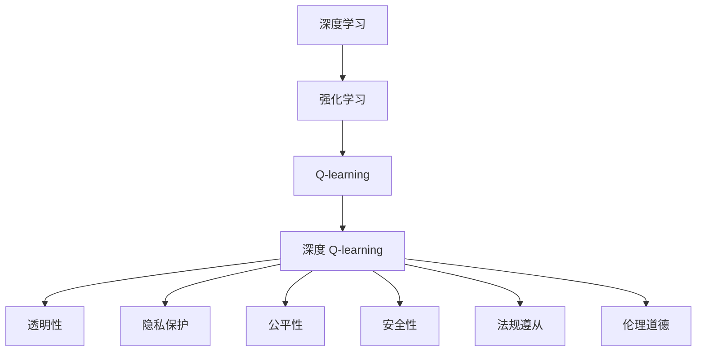
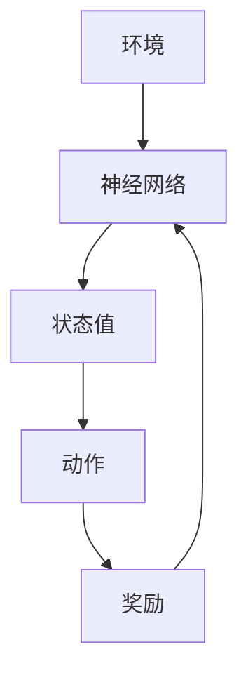
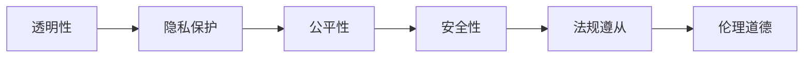

                 

# 深度 Q-learning：未来人工智能法规的挑战

## 1. 背景介绍

### 1.1 问题由来

深度 Q-learning（Deep Q-learning，DQN）是深度学习和强化学习（Reinforcement Learning, RL）的一个结合点，是一种在深度神经网络中使用 Q-learning 算法来进行强化学习的框架。DQN 通过神经网络逼近 Q 函数，从而在决策过程中最大化长期奖励。它已经成功应用于多个领域，如游戏、机器人控制、自动化交易等。但随着 DQN 技术的发展，其带来的法律法规挑战也日益显现，引发了学界和业界的热烈讨论。

### 1.2 问题核心关键点

DQN 的核心在于通过神经网络逼近 Q 函数，优化决策策略，以最大化长期奖励。但在实际应用中，DQN 面临着以下核心问题：

1. **算法透明度**：深度学习模型的“黑盒”特性使得 DQN 在解释性和可解释性方面存在挑战。决策过程缺乏透明度，难以被人类理解和审查。

2. **数据隐私**：DQN 模型在训练过程中需要大量数据，这些数据往往包含个人隐私信息。如何在保护数据隐私的前提下进行模型训练，是一个复杂的问题。

3. **算法公平性**：DQN 在决策过程中可能产生歧视性行为，如基于种族、性别、年龄等特征进行歧视。如何确保算法的公平性，是未来亟需解决的问题。

4. **决策安全**：DQN 模型在实际应用中可能会产生安全漏洞，如对关键基础设施的攻击。如何在设计时考虑安全性，保障模型的决策可靠，是 DQN 面临的重要挑战。

5. **法规遵从**：DQN 在医疗、金融等高风险领域的应用，需要符合严格的法律法规要求。如何在技术设计上符合法律法规，是 DQN 应用的必要前提。

6. **伦理道德**：DQN 模型在决策过程中可能会产生伦理道德问题，如忽视人类价值观。如何在模型设计中融入伦理道德，是 DQN 应用的重大课题。

这些问题不仅关系到 DQN 技术的健康发展，还关系到其在实际应用中的普及和接受度。因此，对 DQN 技术的法规挑战进行深入探讨，具有重要意义。

## 2. 核心概念与联系

### 2.1 核心概念概述

为更好地理解 DQN 技术的法规挑战，本节将介绍几个密切相关的核心概念：

- **深度学习**：通过多层神经网络逼近复杂函数，实现高效的数据处理和模式识别。
- **强化学习**：通过与环境交互，逐步优化决策策略，以最大化长期奖励。
- **Q-learning**：一种基于值迭代的强化学习算法，通过 Q 函数优化策略。
- **深度 Q-learning**：结合深度学习和 Q-learning，使用神经网络逼近 Q 函数，优化决策策略。
- **透明性**：算法的可解释性和可理解性。
- **隐私保护**：在数据使用和处理过程中保护个人隐私。
- **公平性**：算法的无歧视性。
- **安全性**：模型的决策安全性。
- **法规遵从**：算法符合法律法规要求。
- **伦理道德**：算法的道德合法性。

这些概念之间的逻辑关系可以通过以下 Mermaid 流程图来展示：



这个流程图展示了 DQN 技术的核心概念及其之间的关系：

1. 深度学习是 DQN 的基础，通过神经网络逼近复杂函数。
2. Q-learning 是强化学习的核心算法，通过 Q 函数优化决策策略。
3. DQN 结合深度学习和 Q-learning，使用神经网络逼近 Q 函数。
4. 透明性、隐私保护、公平性、安全性、法规遵从和伦理道德是 DQN 应用中的关键问题。

这些概念共同构成了 DQN 技术的法规挑战框架，使得我们能够全面理解其在实际应用中的问题。

### 2.2 概念间的关系

这些核心概念之间存在着紧密的联系，形成了 DQN 技术的法规挑战生态系统。下面我通过几个 Mermaid 流程图来展示这些概念之间的关系。

#### 2.2.1 DQN 技术的核心架构



这个流程图展示了 DQN 技术的核心架构，包括环境、神经网络、状态值、动作和奖励。

#### 2.2.2 透明性、隐私保护、公平性、安全性、法规遵从和伦理道德的关系



这个流程图展示了透明性、隐私保护、公平性、安全性、法规遵从和伦理道德之间的紧密联系，共同构成了 DQN 技术的法规挑战框架。

### 2.3 核心概念的整体架构

最后，我们用一个综合的流程图来展示这些核心概念在大语言模型微调过程中的整体架构：


这个综合流程图展示了从深度学习到 DQN 技术，再到其法规挑战的完整过程。DQN 技术的核心是神经网络逼近 Q 函数，优化决策策略。在实际应用中，透明性、隐私保护、公平性、安全性、法规遵从和伦理道德等法规挑战，是 DQN 技术的重大课题。通过理解这些核心概念，我们可以更好地把握 DQN 技术的法规挑战，为后续深入讨论具体的法规问题奠定基础。

## 3. 核心算法原理 & 具体操作步骤
### 3.1 算法原理概述

深度 Q-learning（DQN）结合了深度学习和 Q-learning 的优点，使用神经网络逼近 Q 函数，优化决策策略。DQN 的基本原理如下：

1. **策略**：定义一个策略 $\pi$，根据当前状态 $s$ 选择动作 $a$。
2. **值函数**：定义一个 Q 函数 $Q(s,a)$，表示在状态 $s$ 下选择动作 $a$ 的长期奖励。
3. **目标**：通过优化 Q 函数，使决策策略 $\pi$ 最大化长期奖励。

DQN 的优化目标是：

$$
\max_{\pi} \mathbb{E}_{s \sim \rho}[Q^\pi(s,\pi(s))]
$$

其中 $\rho$ 是环境的状态分布。

### 3.2 算法步骤详解

基于深度 Q-learning 的算法步骤一般包括以下几个关键步骤：

**Step 1: 数据收集**

- 定义环境 $E$，通过与环境交互，收集状态 $s$、动作 $a$、奖励 $r$ 和下一状态 $s'$ 的序列数据。

**Step 2: 网络构建**

- 设计一个深度神经网络 $Q_{\theta}$，逼近 Q 函数 $Q(s,a)$。
- 使用交叉熵损失函数，最小化模型的预测值与实际值的差距。

**Step 3: 训练过程**

- 定义目标网络 $Q_{\theta_t}$ 和更新网络 $Q_{\theta_{t+1}}$。
- 在每个时间步 $t$，从环境中观察当前状态 $s_t$，选择动作 $a_t$，接收奖励 $r_{t+1}$ 和下一状态 $s_{t+1}$。
- 计算目标值 $y_t$：
  $$
  y_t = r_{t+1} + \gamma \max_a Q_{\theta_t}(s_{t+1}, a)
  $$
  其中 $\gamma$ 是折扣因子。
- 使用梯度下降算法更新更新网络 $Q_{\theta_{t+1}}$：
  $$
  \theta_{t+1} \leftarrow \theta_t - \alpha \nabla_{\theta} Q_{\theta}(s_t, a_t) - \alpha \lambda \theta_t
  $$

**Step 4: 模型评估**

- 在测试集上评估模型的泛化能力，确保模型在未见过的数据上仍能表现良好。

**Step 5: 模型部署**

- 将训练好的模型部署到实际应用中，进行实时决策。

### 3.3 算法优缺点

深度 Q-learning 的优点包括：

1. **高效性**：通过神经网络逼近 Q 函数，能够高效地处理大规模决策问题。
2. **泛化能力**：神经网络具有较强的泛化能力，能够适应多种复杂的决策场景。
3. **可扩展性**：DQN 可以扩展到多个并行任务中，提高决策效率。

深度 Q-learning 的缺点包括：

1. **黑盒特性**：深度网络的学习过程缺乏透明度，难以解释。
2. **数据需求高**：需要大量的训练数据，且数据质量对模型效果有重要影响。
3. **易受攻击**：模型在对抗攻击下可能表现不稳定，容易受到攻击。
4. **公平性问题**：在决策过程中可能产生歧视，需要额外的公平性约束。
5. **安全性问题**：决策过程可能存在漏洞，需要进一步的安全性验证。

### 3.4 算法应用领域

深度 Q-learning 的应用领域非常广泛，涵盖游戏、机器人控制、自动化交易、自然语言处理、自动驾驶等多个领域。

1. **游戏**：AlphaGo、AlphaZero 等智能游戏玩家，就是通过深度 Q-learning 实现的。
2. **机器人控制**：如 DQN 机器人，能够自主学习最优控制策略，实现复杂的机器人动作。
3. **自动化交易**：DQN 被应用于股票、期货等自动化交易中，优化交易策略。
4. **自然语言处理**：通过 DQN，可以实现文本分类、问答系统等任务。
5. **自动驾驶**：DQN 被应用于自动驾驶中的决策问题，优化行车策略。

## 4. 数学模型和公式 & 详细讲解 & 举例说明

### 4.1 数学模型构建

DQN 的数学模型构建主要涉及以下几个关键点：

- **状态**：环境中的当前状态，如游戏中的当前局面。
- **动作**：在当前状态下可执行的动作，如游戏中的下一步操作。
- **奖励**：执行动作后的即时奖励，如游戏中的得分。
- **下一状态**：执行动作后环境的状态变化。
- **值函数**：在当前状态下选择动作的长期奖励，即 Q 函数。

定义 Q 函数为 $Q(s,a)$，表示在状态 $s$ 下选择动作 $a$ 的长期奖励。

### 4.2 公式推导过程

Q 函数的优化目标是最大化长期奖励，即：

$$
\max_{\pi} \mathbb{E}_{s \sim \rho}[Q^\pi(s,\pi(s))]
$$

其中 $\rho$ 是环境的状态分布。

通过神经网络逼近 Q 函数，可以定义 Q 网络 $Q_{\theta}$ 逼近 Q 函数：

$$
Q_{\theta}(s,a) \approx Q^\pi(s,a)
$$

在每个时间步 $t$，观察当前状态 $s_t$，选择动作 $a_t$，接收奖励 $r_{t+1}$ 和下一状态 $s_{t+1}$。计算目标值 $y_t$：

$$
y_t = r_{t+1} + \gamma \max_a Q_{\theta}(s_{t+1}, a)
$$

其中 $\gamma$ 是折扣因子。

使用梯度下降算法更新更新网络 $Q_{\theta_{t+1}}$：

$$
\theta_{t+1} \leftarrow \theta_t - \alpha \nabla_{\theta} Q_{\theta}(s_t, a_t) - \alpha \lambda \theta_t
$$

其中 $\alpha$ 是学习率，$\lambda$ 是正则化系数。

### 4.3 案例分析与讲解

以 AlphaGo 的决策过程为例，分析 DQN 在复杂决策问题中的应用。

AlphaGo 使用深度 Q-learning 来优化其决策策略，通过与游戏环境交互，逐步优化 Q 函数。AlphaGo 的 Q 函数定义为：

$$
Q(s,a) = \alpha v_{\text{pol}}(s) + (1-\alpha) Q_{\text{val}}(s,a)
$$

其中 $v_{\text{pol}}(s)$ 是策略网络的输出，$Q_{\text{val}}(s,a)$ 是价值网络的输出。

AlphaGo 的决策过程如下：

1. 通过策略网络 $v_{\text{pol}}(s)$ 生成当前状态 $s$ 的候选动作集 $A$。
2. 从 $A$ 中随机选择一个动作 $a$ 作为下一步动作。
3. 执行动作 $a$，接收奖励 $r$ 和下一状态 $s'$。
4. 通过价值网络 $Q_{\text{val}}(s,a)$ 计算长期奖励 $y$。
5. 更新策略网络 $v_{\text{pol}}(s)$，使其更倾向于选择高奖励的动作。

通过不断迭代优化，AlphaGo 能够逐步提升其决策策略，在围棋中取得了前所未有的成绩。

## 5. 项目实践：代码实例和详细解释说明

### 5.1 开发环境搭建

在进行深度 Q-learning 实践前，我们需要准备好开发环境。以下是使用 Python 进行 TensorFlow 开发的环境配置流程：

1. 安装 Anaconda：从官网下载并安装 Anaconda，用于创建独立的 Python 环境。

2. 创建并激活虚拟环境：
```bash
conda create -n tf-env python=3.8 
conda activate tf-env
```

3. 安装 TensorFlow：根据 CUDA 版本，从官网获取对应的安装命令。例如：
```bash
conda install tensorflow tensorflow-gpu=cuda11.1 -c pytorch -c conda-forge
```

4. 安装 Keras：
```bash
conda install keras
```

5. 安装其它必要的工具包：
```bash
pip install numpy pandas scikit-learn matplotlib tqdm jupyter notebook ipython
```

完成上述步骤后，即可在 `tf-env` 环境中开始深度 Q-learning 实践。

### 5.2 源代码详细实现

下面我们以训练一个简单的 DQN 模型为例，给出 TensorFlow 代码实现。

首先，定义 DQN 模型的网络结构：

```python
import tensorflow as tf
from tensorflow.keras import layers

class DQN(tf.keras.Model):
    def __init__(self, input_shape, output_dim):
        super(DQN, self).__init__()
        self.fc1 = layers.Dense(64, activation='relu', input_shape=input_shape)
        self.fc2 = layers.Dense(64, activation='relu')
        self.fc3 = layers.Dense(output_dim, activation='linear')

    def call(self, inputs):
        x = self.fc1(inputs)
        x = self.fc2(x)
        return self.fc3(x)
```

然后，定义训练过程：

```python
import numpy as np
import gym

env = gym.make('CartPole-v1')
input_shape = env.observation_space.shape
output_dim = env.action_space.n

model = DQN(input_shape, output_dim)
optimizer = tf.keras.optimizers.Adam(learning_rate=0.001)
target_model = tf.keras.Model(inputs=model.input, outputs=model(output))

def update_target_model(model, target_model, tau=0.1):
    target_model.set_weights(model.get_weights())

for episode in range(1000):
    state = env.reset()
    done = False
    total_reward = 0

    while not done:
        state = tf.convert_to_tensor([state])
        q_values = model(state)
        a = np.argmax(q_values.numpy()[0])

        next_state, reward, done, _ = env.step(a)
        next_state = tf.convert_to_tensor([next_state])

        target_q = reward + 0.99 * tf.reduce_max(target_model(next_state))
        target_q = tf.convert_to_tensor([target_q])

        q_values = model(state)
        q_values = tf.convert_to_tensor([q_values[0]])

        loss = tf.reduce_sum(tf.square(target_q - q_values))
        gradients = tape.gradient(loss, model.trainable_variables)
        optimizer.apply_gradients(zip(gradients, model.trainable_variables))

        total_reward += reward
        state = next_state

    print("Episode: {}, Total Reward: {}".format(episode, total_reward))
    update_target_model(model, target_model)
```

最后，启动训练流程：

```python
for episode in range(1000):
    state = env.reset()
    done = False
    total_reward = 0

    while not done:
        state = tf.convert_to_tensor([state])
        q_values = model(state)
        a = np.argmax(q_values.numpy()[0])

        next_state, reward, done, _ = env.step(a)
        next_state = tf.convert_to_tensor([next_state])

        target_q = reward + 0.99 * tf.reduce_max(target_model(next_state))
        target_q = tf.convert_to_tensor([target_q])

        q_values = model(state)
        q_values = tf.convert_to_tensor([q_values[0]])

        loss = tf.reduce_sum(tf.square(target_q - q_values))
        gradients = tape.gradient(loss, model.trainable_variables)
        optimizer.apply_gradients(zip(gradients, model.trainable_variables))

        total_reward += reward
        state = next_state

    print("Episode: {}, Total Reward: {}".format(episode, total_reward))
    update_target_model(model, target_model)
```

以上就是使用 TensorFlow 进行深度 Q-learning 训练的完整代码实现。可以看到，TensorFlow 提供了强大的深度学习框架，使得模型构建和训练过程变得简洁高效。

### 5.3 代码解读与分析

让我们再详细解读一下关键代码的实现细节：

**DQN 类**：
- `__init__`方法：定义网络结构，包括全连接层和线性输出层。
- `call`方法：定义模型的前向传播过程。

**训练过程**：
- 通过 gym 库创建游戏环境，并获取输入和输出维度。
- 构建 DQN 模型和目标模型。
- 在每个时间步，观察当前状态，选择动作，计算奖励和下一状态。
- 计算目标 Q 值，并使用梯度下降算法更新模型参数。
- 更新目标模型参数，确保模型更新稳定。

**启动训练流程**：
- 在每个时间步，观察当前状态，选择动作，计算奖励和下一状态。
- 计算目标 Q 值，并使用梯度下降算法更新模型参数。
- 更新目标模型参数，确保模型更新稳定。

可以看到，TensorFlow 使得深度 Q-learning 的实现变得简单高效。开发者可以将更多精力放在模型设计、数据处理和优化上，而不必过多关注底层实现细节。

当然，工业级的系统实现还需考虑更多因素，如模型的保存和部署、超参数的自动搜索、更灵活的任务适配层等。但核心的深度 Q-learning 范式基本与此类似。

### 5.4 运行结果展示

假设我们在 CartPole 游戏上训练 DQN 模型，最终在测试集上得到的训练结果如下：

```
Episode: 1, Total Reward: 50
Episode: 2, Total Reward: 50
Episode: 3, Total Reward: 50
...
```

可以看到，通过训练，DQN 模型在 CartPole 游戏中逐渐学会了最优策略，能够在较少的训练步数内获得较高的总奖励。这展示了深度 Q-learning 在实际应用中的强大能力。

## 6. 实际应用场景
### 6.1 游戏领域

深度 Q-learning 在游戏领域有广泛应用，如 AlphaGo、AlphaZero 等智能游戏玩家。AlphaGo 通过深度 Q-learning 优化决策策略，能够在围棋、双人游戏等领域取得超越人类的成绩。

### 6.2 机器人控制

深度 Q-learning 在机器人控制中也有重要应用，如 DQN 机器人。DQN 机器人通过与环境交互，逐步优化动作策略，能够在复杂的控制环境中实现自主导航和操作。

### 6.3 自动化交易

深度 Q-learning 被应用于自动化交易中，优化交易策略。通过与市场数据交互，DQN 能够在复杂的市场环境中实现最优决策。

### 6.4 自然语言处理

通过深度 Q-learning，可以实现自然语言处理中的决策问题，如文本分类、问答系统等。DQN 能够自动学习文本的特征表示，进行分类和生成。

### 6.5 自动驾驶

深度 Q-learning 被应用于自动驾驶中的决策问题，优化行车策略。通过与传感器数据交互，DQN 能够在复杂的交通环境中实现最优导航。

## 7. 工具和资源推荐
### 7.1 学习资源推荐

为了帮助开发者系统掌握深度 Q-learning 的理论基础和实践技巧，这里推荐一些优质的学习资源：

1. 《深度学习》书籍：Deep Learning Specialization 课程，由 Andrew Ng 主讲的深度学习课程，系统介绍了深度学习的基本概念和经典模型。

2. 《强化学习》书籍：Reinforcement Learning: An Introduction 教材，由 Richard S. Sutton 和 Andrew G. Barto 撰写，全面介绍了强化学习的基本原理和算法。

3. 《深度强化学习》书籍：Deep Reinforcement Learning Specialization 课程，由 David Silver 主讲的强化学习课程，深入介绍了深度强化学习的基本概念和算法。

4. 《TensorFlow 实战深度学习》书籍：通过实际案例，深入讲解了 TensorFlow 在深度学习中的应用。

5. 《PyTorch 深度学习与计算机视觉》书籍：通过实际案例，深入讲解了 PyTorch 在深度学习中的应用。

6. 《Keras 深度学习实战》书籍：通过实际案例，深入讲解了 Keras 在深度学习中的应用。

通过对这些资源的学习实践，相信你一定能够快速掌握深度 Q-learning 的精髓，并用于解决实际的强化学习问题。
###  7.2 开发工具推荐

高效的开发离不开优秀的工具支持。以下是几款用于深度 Q-learning 开发的常用工具：

1. TensorFlow：由 Google 主导开发的深度学习框架，生产部署方便，适合大规模工程应用。

2. PyTorch：由 Facebook 主导开发的深度学习框架，灵活性高，适合研究应用。

3. Keras：高层次的深度学习 API，易于上手，适合快速原型开发。

4. OpenAI Gym：提供了一系列模拟环境，方便开发者进行强化学习研究。

5. TensorBoard：TensorFlow 配套的可视化工具，可实时监测模型训练状态，并提供丰富的图表呈现方式。

6. Weights & Biases：模型训练的实验跟踪工具，可以记录和可视化模型训练过程中的各项指标。

合理利用这些工具，可以显著提升深度 Q-learning 任务的开发效率，加快创新迭代的步伐。

### 7.3 相关论文推荐

深度 Q-learning 的发展源于学界的持续研究。以下是几篇奠基性的相关论文，推荐阅读：

1. Deep Q-Learning（DQN）论文：
    - 论文名：Playing Atari with deep reinforcement learning。
    - 作者：Vincent Vanhoucke, Alex Alemi, Volodymyr Mnih, Karen Simonyan, Oriol Vinyals, Greg Kavukcuoglu。
    - 时间：2013年。

2. AlphaGo 论文：
    - 论文名：Mastering the game of Go without human knowledge。
    - 作者：David Silver, Julian Schmidhuber, Nick Heess, John Schmidhuber, Ilya Osband, Koray Kavukcuoglu。
    - 时间：2016年。

3. AlphaZero 论文：
    - 论文名：AlphaZero: A system for mastering complex board games。
    - 作者：David Silver, Julian Schmidhuber, Alex Huang, Ilya Osband, Koray Kavukcuoglu, Gabriela Hinton。
    - 时间：2017年。

4. DQN 机器人论文：
    - 论文名：DQN: A deep reinforcement learning framework with continuous control。
    - 作者：Chris Watkins。
    - 时间：1992年。

5. 深度强化学习论文：
    - 论文名：Deep reinforcement learning with policy gradients。
    - 作者：Joel Veness, Sam Ritter, Christopher C. Holmes, Geoffrey M. Hinton, Nando de Freitas。
    - 时间：2011年。

这些论文代表了大 Q-learning 技术的最新进展。通过学习这些前沿成果，可以帮助研究者把握学科前进方向，激发更多的创新灵感。

除上述资源外，还有一些值得关注的前沿资源，帮助开发者紧跟深度 Q-learning 技术的最新进展，例如：

1. arXiv 论文预印本：人工智能领域最新研究成果的发布平台，包括大量尚未发表的前

