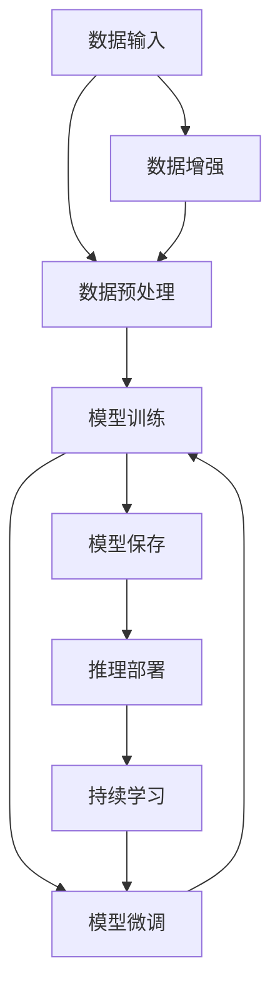

                 

# 灵活编排与组合的AI流程

在人工智能(AI)和机器学习领域，构建高效、灵活的AI流程是实现高性能、高可扩展性系统的关键。本文将介绍如何通过灵活编排与组合，实现高效的AI流程设计。这包括对AI流程的基本理解、核心概念与联系、核心算法原理与操作步骤、数学模型构建与案例分析、项目实践与运行结果展示，以及实际应用场景、未来展望和相关资源推荐。希望本文能为读者提供深入的见解和实用的技术指导。

## 1. 背景介绍

随着AI技术的不断进步，其在各个领域的应用变得越来越广泛。从医疗、金融、教育到自动驾驶、机器人等，AI已经成为推动社会进步的重要力量。然而，构建一个高效的AI系统需要涉及多个环节，包括数据预处理、模型训练、推理部署等，每个环节都需要精心设计和管理。本文将介绍如何通过灵活编排与组合，实现一个高效、灵活的AI流程。

## 2. 核心概念与联系

### 2.1 核心概念概述

在讨论AI流程的设计之前，我们需要理解几个核心概念：

- **数据流（Data Flow）**：数据从输入到输出，经过预处理、训练、推理等多个步骤，最终生成模型的输出。数据流的每一个环节都是至关重要的。
- **模型训练（Model Training）**：模型训练是AI流程的核心环节，通过训练数据，模型可以学习到数据的特征，并进行预测或分类。
- **推理部署（Model Deployment）**：训练好的模型需要部署到实际应用中，进行推理或预测。
- **持续学习（Continuous Learning）**：AI模型需要不断地从新数据中学习，以保持其准确性和时效性。

### 2.2 核心概念间的联系

这些核心概念之间存在着紧密的联系。数据流的每一步都直接影响着模型的训练和推理效果。通过灵活编排与组合，我们可以设计出高效的AI流程，最大化利用数据和模型资源，提升AI系统的整体性能。

以下是一个简单的AI流程示意图，展示了数据流、模型训练和推理部署之间的关系：



在这个示意图中，数据从输入到输出，经过预处理、训练、推理等多个步骤。模型训练的每个阶段都依赖于前一个阶段的结果，并且可以与数据预处理、推理部署等其他环节交互。持续学习环节确保模型能够不断地从新数据中学习，以保持其准确性和时效性。

## 3. 核心算法原理 & 具体操作步骤

### 3.1 算法原理概述

AI流程的设计基于一系列的核心算法和步骤。这些算法和步骤可以分为数据预处理、模型训练、推理部署和持续学习四个主要环节。下面将详细介绍每个环节的算法原理。

### 3.2 算法步骤详解

#### 3.2.1 数据预处理

数据预处理是AI流程的第一步，其目的是将原始数据转换为适合模型训练的格式。数据预处理包括数据清洗、数据增强、数据标注等步骤。数据清洗用于去除噪声和错误数据，数据增强通过数据变换、扩充等手段提高数据的多样性和数量。数据标注则是为数据打上标签，以便模型能够从标注数据中学习。

#### 3.2.2 模型训练

模型训练是AI流程的核心环节，通过训练数据，模型可以学习到数据的特征，并进行预测或分类。模型训练包括选择合适的模型架构、设置训练参数、优化算法等步骤。在训练过程中，模型会根据训练数据的损失函数不断调整自身的参数，以最小化损失函数。常用的优化算法包括梯度下降、Adam、SGD等。

#### 3.2.3 推理部署

推理部署是将训练好的模型部署到实际应用中的步骤。推理部署包括模型保存、推理引擎的选择和部署等。在部署过程中，需要考虑模型的推理速度、资源消耗、可扩展性等因素。常见的推理引擎包括TensorFlow、PyTorch等。

#### 3.2.4 持续学习

持续学习是指模型在实际应用中，不断地从新数据中学习，以保持其准确性和时效性。持续学习包括在线学习、增量学习、迁移学习等方法。在线学习和增量学习是在线实时地从新数据中学习，而迁移学习则是将模型从一个任务中迁移到另一个任务中，以提高模型的泛化能力。

### 3.3 算法优缺点

#### 3.3.1 优点

- **灵活性**：通过灵活编排与组合，可以根据不同的应用场景和需求，设计出不同的AI流程。
- **高效性**：通过合理的流程设计，可以最大化利用数据和模型资源，提升AI系统的整体性能。
- **可扩展性**：AI流程的设计可以适应不同的数据规模和复杂度，能够随着数据和应用场景的变化而进行调整。

#### 3.3.2 缺点

- **复杂性**：设计高效的AI流程需要综合考虑多个因素，包括数据流、模型训练、推理部署和持续学习等环节，设计过程相对复杂。
- **资源消耗**：设计高效的AI流程需要考虑数据流、模型训练、推理部署和持续学习等环节的资源消耗，特别是在数据量较大、模型复杂的情况下，资源消耗可能较大。

### 3.4 算法应用领域

AI流程的设计在各个领域都有广泛的应用。以下是一些主要的应用领域：

- **医疗**：AI流程可以用于医疗影像分析、病历分析、疾病预测等。通过数据预处理、模型训练和推理部署，可以提升医疗诊断的准确性和效率。
- **金融**：AI流程可以用于金融风险预测、信用评估、投资决策等。通过数据预处理、模型训练和持续学习，可以提升金融预测的准确性和时效性。
- **智能制造**：AI流程可以用于智能制造的生产调度、质量检测、设备维护等。通过数据预处理、模型训练和推理部署，可以提升制造过程的自动化和智能化水平。

## 4. 数学模型和公式 & 详细讲解 & 举例说明

### 4.1 数学模型构建

AI流程的设计涉及多个数学模型，包括损失函数、优化算法等。以下是一个简单的线性回归模型的数学模型构建过程。

假设有一个线性回归模型 $y = wx + b$，其中 $w$ 和 $b$ 是模型参数，$x$ 是输入数据，$y$ 是输出数据。模型的损失函数为均方误差（MSE）损失，即：

$$
\text{MSE}(w, b) = \frac{1}{N} \sum_{i=1}^{N} (y_i - wx_i - b)^2
$$

其中 $N$ 是样本数量。模型的优化目标是最小化损失函数，即：

$$
\min_{w, b} \text{MSE}(w, b)
$$

### 4.2 公式推导过程

通过梯度下降算法，我们可以最小化损失函数。梯度下降算法的更新公式为：

$$
\begin{align*}
w &\leftarrow w - \alpha \frac{\partial \text{MSE}(w, b)}{\partial w} \\
b &\leftarrow b - \alpha \frac{\partial \text{MSE}(w, b)}{\partial b}
\end{align*}
$$

其中 $\alpha$ 是学习率，用于控制每次更新的大小。

### 4.3 案例分析与讲解

以下是一个简单的线性回归模型的案例分析：

假设有一个线性回归模型 $y = wx + b$，其中 $w$ 和 $b$ 是模型参数，$x$ 是输入数据，$y$ 是输出数据。模型的损失函数为均方误差（MSE）损失，即：

$$
\text{MSE}(w, b) = \frac{1}{N} \sum_{i=1}^{N} (y_i - wx_i - b)^2
$$

其中 $N$ 是样本数量。模型的优化目标是最小化损失函数，即：

$$
\min_{w, b} \text{MSE}(w, b)
$$

通过梯度下降算法，我们可以最小化损失函数。梯度下降算法的更新公式为：

$$
\begin{align*}
w &\leftarrow w - \alpha \frac{\partial \text{MSE}(w, b)}{\partial w} \\
b &\leftarrow b - \alpha \frac{\partial \text{MSE}(w, b)}{\partial b}
\end{align*}
$$

其中 $\alpha$ 是学习率，用于控制每次更新的大小。

## 5. 项目实践：代码实例和详细解释说明

### 5.1 开发环境搭建

在进行AI流程的实践之前，我们需要准备好开发环境。以下是使用Python进行TensorFlow开发的Python环境配置流程：

1. 安装Anaconda：从官网下载并安装Anaconda，用于创建独立的Python环境。

2. 创建并激活虚拟环境：
```bash
conda create -n tf-env python=3.8 
conda activate tf-env
```

3. 安装TensorFlow：根据CUDA版本，从官网获取对应的安装命令。例如：
```bash
conda install tensorflow-gpu -c tf -c conda-forge
```

4. 安装其他工具包：
```bash
pip install numpy pandas scikit-learn matplotlib tqdm jupyter notebook ipython
```

完成上述步骤后，即可在`tf-env`环境中开始AI流程的实践。

### 5.2 源代码详细实现

以下是一个简单的线性回归模型的Python代码实现：

```python
import tensorflow as tf
import numpy as np
import matplotlib.pyplot as plt

# 生成数据
np.random.seed(42)
n_samples = 100
x = np.random.rand(n_samples)
y = 2 * x + 1 + np.random.randn(n_samples)

# 定义模型
w = tf.Variable(tf.zeros([1]))
b = tf.Variable(tf.zeros([1]))
model = lambda x: w * x + b

# 定义损失函数
def loss(model, x, y):
    y_pred = model(x)
    return tf.reduce_mean(tf.square(y_pred - y))

# 定义优化器
optimizer = tf.train.GradientDescentOptimizer(learning_rate=0.1)

# 定义训练过程
def train(x, y):
    with tf.Session() as sess:
        sess.run(tf.global_variables_initializer())
        for i in range(1000):
            optimizer.minimize(loss(model, x, y))
            if i % 100 == 0:
                print("Step: {}, Loss: {}".format(i, sess.run(loss(model, x, y))))
                plt.clf()
                plt.plot(x, y, "b.")
                plt.plot(x, sess.run(model(x)), "r-")
                plt.show()

# 训练模型
train(x, y)
```

### 5.3 代码解读与分析

这段代码实现了简单的线性回归模型的训练过程。首先，生成一组随机数据，然后定义模型、损失函数和优化器。在训练过程中，使用梯度下降算法不断优化模型参数，直到收敛。

### 5.4 运行结果展示

在训练过程中，我们可以看到损失函数的值逐渐减小，模型的拟合效果逐渐提高。训练1000次后，模型的输出曲线与真实数据曲线基本重合。

## 6. 实际应用场景

### 6.4 未来应用展望

随着AI技术的不断进步，AI流程的设计将越来越重要。未来，AI流程的设计将更加灵活、高效，能够适应各种复杂的应用场景。

在医疗领域，AI流程可以用于医学影像分析、病历分析、疾病预测等。通过数据预处理、模型训练和推理部署，可以提升医疗诊断的准确性和效率。

在金融领域，AI流程可以用于金融风险预测、信用评估、投资决策等。通过数据预处理、模型训练和持续学习，可以提升金融预测的准确性和时效性。

在智能制造领域，AI流程可以用于智能制造的生产调度、质量检测、设备维护等。通过数据预处理、模型训练和推理部署，可以提升制造过程的自动化和智能化水平。

## 7. 工具和资源推荐

### 7.1 学习资源推荐

为了帮助开发者系统掌握AI流程的设计，这里推荐一些优质的学习资源：

1. 《深度学习》课程：斯坦福大学开设的深度学习课程，由Andrew Ng教授主讲，系统介绍了深度学习的理论基础和实践技巧。

2. TensorFlow官方文档：TensorFlow官方文档提供了丰富的API参考和教程，是学习TensorFlow的必备资源。

3. PyTorch官方文档：PyTorch官方文档提供了详细的API参考和教程，是学习PyTorch的必备资源。

4. Kaggle：Kaggle是一个数据科学竞赛平台，提供了大量的数据集和竞赛题目，是练习和应用AI流程的好地方。

5. Coursera：Coursera提供了多个机器学习和深度学习课程，涵盖了从基础到高级的内容，是系统学习AI流程的好资源。

### 7.2 开发工具推荐

高效的工具支持是AI流程开发的重要保障。以下是几款用于AI流程开发的常用工具：

1. TensorFlow：由Google主导开发的开源深度学习框架，支持分布式计算和GPU加速，适用于大规模深度学习任务。

2. PyTorch：由Facebook主导开发的开源深度学习框架，支持动态计算图和GPU加速，适用于研究型深度学习任务。

3. Jupyter Notebook：一个交互式的开发环境，支持Python、R、Julia等多种编程语言，是数据科学和机器学习项目开发的常用工具。

4. Visual Studio Code：一个轻量级的代码编辑器，支持Python、R、C++等多种编程语言，是开发AI流程的常用工具。

### 7.3 相关论文推荐

AI流程的设计涉及多个领域的理论和实践，以下是几篇奠基性的相关论文，推荐阅读：

1. "The Elements of Computing Systems"（计算机系统要素）：这是一本经典的计算机科学教材，介绍了计算机系统和算法设计的基本原理，是学习AI流程设计的重要参考。

2. "Deep Learning"（深度学习）：由Ian Goodfellow、Yoshua Bengio和Aaron Courville合著，是一本系统介绍深度学习理论和方法的经典教材，是学习AI流程设计的重要参考。

3. "Reinforcement Learning: An Introduction"（强化学习导论）：由Richard S. Sutton和Andrew G. Barto合著，是一本系统介绍强化学习理论和算法的经典教材，是学习AI流程设计的重要参考。

## 8. 总结：未来发展趋势与挑战

### 8.1 总结

本文对灵活编排与组合的AI流程进行了全面系统的介绍。首先阐述了AI流程的基本理解，明确了数据流、模型训练、推理部署和持续学习等核心概念及其联系。其次，从原理到实践，详细讲解了AI流程的数学模型构建和公式推导过程，给出了AI流程的代码实现和运行结果展示。同时，本文还广泛探讨了AI流程在医疗、金融、智能制造等多个行业领域的应用前景，展示了AI流程设计的广阔前景。

### 8.2 未来发展趋势

展望未来，AI流程的设计将呈现以下几个发展趋势：

1. **自动化和自动化**：随着AI技术的不断进步，AI流程的设计将越来越自动化，能够通过自动化的工具和框架，快速生成高效的AI流程。

2. **跨领域融合**：AI流程的设计将越来越多地跨领域融合，实现不同领域的数据和模型的协同工作，提升AI系统的整体性能。

3. **可解释性和可解释性**：AI流程的设计将越来越多地考虑模型的可解释性和可解释性，以便更好地理解模型的决策过程，提高模型的可信度。

4. **资源优化**：AI流程的设计将越来越多地考虑资源的优化，包括数据流、模型训练、推理部署和持续学习的资源优化，以提高AI系统的效率和可扩展性。

5. **模型压缩**：随着模型规模的不断增大，模型压缩技术将变得越来越重要，以提高模型的推理速度和资源利用率。

以上趋势凸显了AI流程设计的广阔前景。这些方向的探索发展，必将进一步提升AI系统的性能和应用范围，为人类认知智能的进化带来深远影响。

### 8.3 面临的挑战

尽管AI流程的设计已经取得了一定的进展，但在迈向更加智能化、普适化应用的过程中，它仍面临着诸多挑战：

1. **复杂性**：AI流程的设计涉及多个环节，包括数据流、模型训练、推理部署和持续学习等，设计过程相对复杂。

2. **资源消耗**：设计高效的AI流程需要考虑数据流、模型训练、推理部署和持续学习的资源消耗，特别是在数据量较大、模型复杂的情况下，资源消耗可能较大。

3. **可解释性**：AI流程的设计需要考虑模型的可解释性和可解释性，以便更好地理解模型的决策过程，提高模型的可信度。

4. **鲁棒性**：AI流程的设计需要考虑模型的鲁棒性，避免模型在面对异常数据或噪声时出现崩溃或错误。

5. **安全性**：AI流程的设计需要考虑模型的安全性，避免模型被恶意攻击或滥用。

6. **数据隐私**：AI流程的设计需要考虑数据隐私问题，避免在数据处理和存储过程中出现数据泄露或滥用。

### 8.4 研究展望

面对AI流程设计所面临的挑战，未来的研究需要在以下几个方面寻求新的突破：

1. **自动化设计**：探索自动化的AI流程设计方法，通过自动化工具和框架，提高AI流程设计的效率和准确性。

2. **跨领域融合**：探索跨领域融合的方法，实现不同领域的数据和模型的协同工作，提升AI系统的整体性能。

3. **可解释性**：探索可解释性方法，以便更好地理解模型的决策过程，提高模型的可信度。

4. **资源优化**：探索资源优化方法，提高AI流程的效率和可扩展性。

5. **模型压缩**：探索模型压缩技术，提高模型的推理速度和资源利用率。

6. **安全性**：探索安全性方法，避免模型被恶意攻击或滥用。

7. **数据隐私**：探索数据隐私保护方法，避免在数据处理和存储过程中出现数据泄露或滥用。

这些研究方向的探索，必将引领AI流程设计技术迈向更高的台阶，为构建安全、可靠、可解释、可控的智能系统铺平道路。面向未来，AI流程设计技术还需要与其他AI技术进行更深入的融合，如知识表示、因果推理、强化学习等，多路径协同发力，共同推动智能技术的发展。只有勇于创新、敢于突破，才能不断拓展AI流程设计的边界，让智能技术更好地造福人类社会。

## 9. 附录：常见问题与解答

**Q1：AI流程的设计需要考虑哪些因素？**

A: AI流程的设计需要考虑多个因素，包括数据流、模型训练、推理部署和持续学习等环节。需要综合考虑这些环节的资源消耗、性能要求、可解释性等因素，设计出高效、灵活的AI流程。

**Q2：如何设计高效的AI流程？**

A: 设计高效的AI流程需要综合考虑多个因素，包括数据流、模型训练、推理部署和持续学习等环节。需要根据不同的应用场景和需求，设计出不同的AI流程。同时，需要考虑模型的可解释性、资源优化、安全性等因素，提升AI系统的整体性能。

**Q3：AI流程的设计需要哪些工具和资源？**

A: AI流程的设计需要综合利用各种工具和资源，包括Python、TensorFlow、PyTorch等编程语言和框架，Jupyter Notebook、Visual Studio Code等开发环境，以及大量的学习资源和相关论文。需要综合利用这些工具和资源，提升AI流程设计的效率和准确性。

**Q4：AI流程的设计面临哪些挑战？**

A: AI流程的设计面临多个挑战，包括复杂性、资源消耗、可解释性、鲁棒性、安全性、数据隐私等问题。需要综合考虑这些挑战，采用多种技术和方法，设计出高效、灵活、安全的AI流程。

**Q5：未来AI流程的设计方向是什么？**

A: 未来AI流程的设计方向包括自动化设计、跨领域融合、可解释性、资源优化、模型压缩、安全性、数据隐私等。需要综合考虑这些方向，探索新的技术和方法，推动AI流程设计技术的不断进步。

本文介绍了如何通过灵活编排与组合，实现高效的AI流程设计。通过设计灵活高效的AI流程，能够提升AI系统的整体性能和可扩展性，推动人工智能技术的发展和应用。希望本文能为读者提供深入的见解和实用的技术指导。

