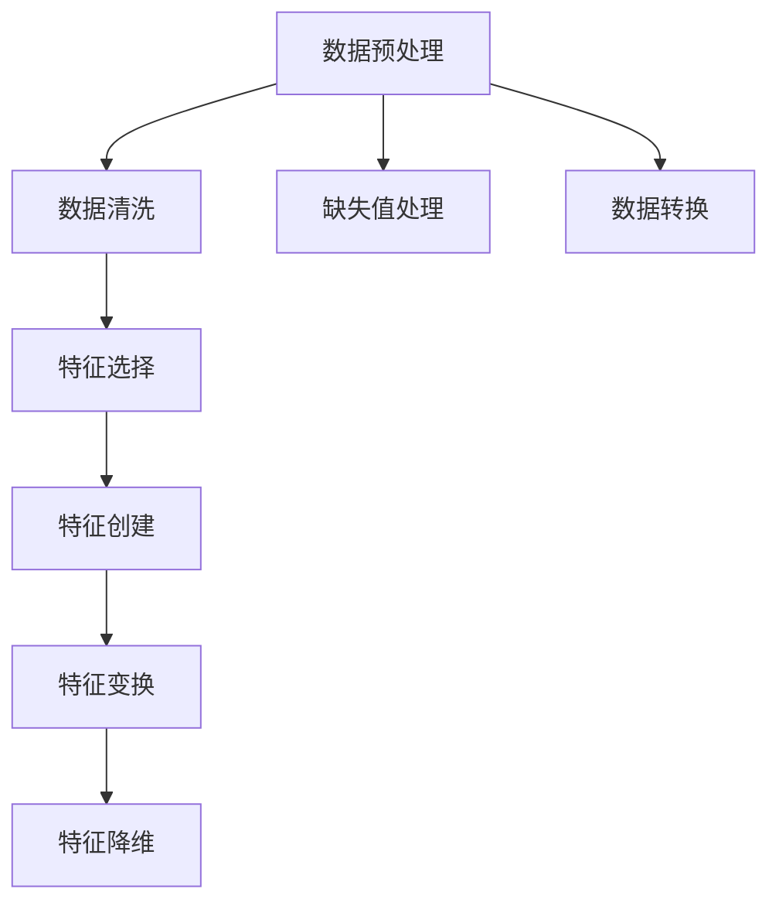

                 

## 1. 背景介绍

### 1.1 问题由来

在机器学习项目中，数据的质量和处理至关重要。数据本身并非直接可用于训练模型，而需要经过一系列预处理和转换，即“特征工程”，才能转化为模型能够理解的格式。一个有效的特征工程能够显著提升模型的泛化能力和性能。

然而，尽管特征工程在机器学习项目中扮演着至关重要的角色，但这一环节往往缺乏系统性指导，导致许多数据科学家在实践中难以高效地完成特征工程任务，甚至陷入陷阱。为此，本文旨在全面介绍特征工程的核心概念和实操方法，帮助读者系统掌握特征工程的技术和策略。

### 1.2 问题核心关键点

特征工程的核心问题可以归纳为以下几个方面：

1. **数据预处理**：包括数据清洗、数据转换、数据归一化等步骤，以提升数据质量。
2. **特征选择**：从原始数据中筛选出对模型预测有帮助的特征。
3. **特征创建**：结合业务理解，通过组合、衍生等方法创造新的特征。
4. **特征变换**：对特征进行缩放、平滑、离散化等变换，以适应模型需求。
5. **特征降维**：减少特征数量，降低模型复杂度，提升模型训练效率。

这些步骤彼此紧密联系，共同构成特征工程的完整流程。本文将逐一介绍这些关键点，并提供实用的实操技巧和案例分析，帮助读者在实践中掌握特征工程的艺术。

## 2. 核心概念与联系

### 2.1 核心概念概述

为了更好地理解特征工程，本节将介绍几个关键概念及其之间的关系：

- **数据预处理**：包括数据清洗、缺失值处理、数据转换等步骤，以提升数据质量和模型适应性。
- **特征选择**：从原始数据中筛选出对模型预测有帮助的特征，以降低模型复杂度。
- **特征创建**：通过组合、衍生等方法创造新的特征，增强模型的表达能力。
- **特征变换**：对特征进行缩放、平滑、离散化等变换，适应模型需求。
- **特征降维**：通过主成分分析(PCA)、线性判别分析(LDA)等方法，减少特征数量，提高模型训练效率。

这些概念之间的逻辑关系可以通过以下Mermaid流程图来展示：



### 2.2 概念间的关系

这些核心概念之间存在着紧密的联系，共同构成了特征工程的完整流程。接下来，我们通过几个具体的例子来详细阐述这些概念之间的关系。

#### 2.2.1 数据预处理和特征选择

数据预处理和特征选择是特征工程的第一步。数据预处理通过清洗、转换等步骤提升数据质量，而特征选择则从原始数据中筛选出对模型预测有帮助的特征。

例如，在处理医疗数据时，数据预处理可能包括去除无关的字符、处理缺失值、标准化数据格式等。在此基础上，特征选择可以进一步筛选出与疾病预测相关的特征，如血压、血糖、年龄等。

#### 2.2.2 特征创建和特征变换

特征创建和特征变换是特征工程的核心步骤之一。特征创建通过组合、衍生等方法创造新的特征，增强模型的表达能力。而特征变换通过缩放、平滑、离散化等操作，适应模型需求。

例如，在处理金融数据时，特征创建可以基于历史交易数据生成技术指标，如RSI、MA等。这些新特征通过特征变换进一步优化，如对RSI进行标准化处理，以提升模型对不同交易频率的适应能力。

#### 2.2.3 特征降维

特征降维是特征工程的最后一步。通过主成分分析(PCA)、线性判别分析(LDA)等方法，减少特征数量，降低模型复杂度，提升模型训练效率。

例如，在处理高维图像数据时，PCA可以从中提取主要成分，降低特征维度，提升模型的训练速度和泛化能力。

## 3. 核心算法原理 & 具体操作步骤

### 3.1 算法原理概述

特征工程的本质是通过一系列数据处理和特征提取步骤，将原始数据转化为模型能够理解和利用的格式。其核心原理可以归纳为以下几个方面：

1. **数据标准化**：将数据缩放到相同范围内，以消除量级差异。
2. **特征选择**：选择对模型预测有帮助的特征，提高模型泛化能力。
3. **特征组合**：通过组合现有特征，创建新的特征，增强模型的表达能力。
4. **特征变换**：对特征进行缩放、平滑、离散化等操作，适应模型需求。
5. **特征降维**：通过主成分分析(PCA)、线性判别分析(LDA)等方法，减少特征数量，提高模型训练效率。

### 3.2 算法步骤详解

基于以上原理，特征工程的实操步骤可以归纳为以下几个关键环节：

1. **数据清洗**：去除噪声、处理缺失值、标准化数据格式等。
2. **特征选择**：选择对模型预测有帮助的特征，如通过相关性分析、信息增益等方法筛选。
3. **特征创建**：结合业务理解，通过组合、衍生等方法创造新的特征，如计算技术指标、提取文本特征等。
4. **特征变换**：对特征进行缩放、平滑、离散化等操作，适应模型需求，如对数值特征进行归一化处理。
5. **特征降维**：通过主成分分析(PCA)、线性判别分析(LDA)等方法，减少特征数量，提高模型训练效率。

### 3.3 算法优缺点

特征工程具有以下几个优点：

1. **提升模型性能**：通过有效的特征工程，可以显著提升模型的泛化能力和性能。
2. **降低模型复杂度**：特征工程通过筛选和组合特征，减少模型的复杂度，提高训练效率。
3. **增强模型解释性**：有效的特征工程使得模型更加透明，便于解释和调试。

同时，特征工程也存在一些缺点：

1. **依赖领域知识**：特征工程需要结合业务理解，依赖领域专家的知识。
2. **需要反复迭代**：特征工程涉及多次尝试和调整，过程可能比较耗时。
3. **可能导致过拟合**：特征工程可能引入额外的噪声，导致过拟合。

### 3.4 算法应用领域

特征工程广泛应用于机器学习、数据挖掘、自然语言处理等各个领域，以下是几个具体的例子：

1. **金融风险预测**：通过特征工程，从历史交易数据中提取有意义的特征，如技术指标、交易频率等，构建金融风险预测模型。
2. **医疗疾病预测**：从电子病历中提取关键指标，如血压、血糖、年龄等，构建疾病预测模型。
3. **自然语言处理**：从文本数据中提取有意义的特征，如词频、TF-IDF等，构建文本分类、情感分析等模型。
4. **图像识别**：从图像数据中提取有意义的特征，如边缘、纹理等，构建图像识别模型。

## 4. 数学模型和公式 & 详细讲解 & 举例说明

### 4.1 数学模型构建

在特征工程中，常用的数学模型和公式包括：

1. **标准化公式**：
   $$
   \text{标准化}(x) = \frac{x - \mu}{\sigma}
   $$
   其中，$\mu$ 为均值，$\sigma$ 为标准差。

2. **相关性分析公式**：
   $$
   \text{Corr}(x, y) = \frac{\text{Cov}(x, y)}{\sqrt{\text{Var}(x) \cdot \text{Var}(y)}}
   $$
   其中，$\text{Cov}(x, y)$ 为协方差，$\text{Var}(x)$ 为方差。

3. **主成分分析(PCA)公式**：
   $$
   \text{PCA}(X) = U \cdot \Sigma \cdot V^T
   $$
   其中，$U$ 为左奇异矩阵，$\Sigma$ 为奇异值矩阵，$V^T$ 为右奇异矩阵。

### 4.2 公式推导过程

以下我们以标准化公式为例，推导其具体的计算过程。

假设有一组数值数据 $x = [x_1, x_2, \dots, x_n]$，其均值为 $\mu$，标准差为 $\sigma$。标准化公式为：
$$
\text{标准化}(x) = \frac{x - \mu}{\sigma}
$$

标准化公式的推导过程如下：

1. **计算均值**：
   $$
   \mu = \frac{1}{n} \sum_{i=1}^n x_i
   $$

2. **计算标准差**：
   $$
   \sigma = \sqrt{\frac{1}{n-1} \sum_{i=1}^n (x_i - \mu)^2}
   $$

3. **标准化计算**：
   $$
   \text{标准化}(x_i) = \frac{x_i - \mu}{\sigma}
   $$

通过标准化公式，将数据缩放到相同范围内，消除了量级差异，使得模型更加鲁棒和稳定。

### 4.3 案例分析与讲解

我们以一个具体的金融数据处理案例来详细讲解特征工程的应用。

假设我们有一组历史交易数据，包含股票的开盘价、收盘价、成交量等特征。我们的目标是构建一个预测股票价格涨跌的模型。

1. **数据预处理**：首先进行数据清洗，去除异常值和噪声。然后对数据进行标准化处理，使得各特征的分布一致。

2. **特征选择**：通过相关性分析，选择与股价涨跌相关的特征，如开盘价、收盘价、成交量等。

3. **特征创建**：结合业务理解，计算技术指标，如RSI、MA等。

4. **特征变换**：对计算出的技术指标进行平滑处理，如移动平均、指数平滑等。

5. **特征降维**：通过主成分分析(PCA)，选择主要成分，减少特征数量，提高模型训练效率。

最终，我们得到一个包含标准化的股票价格特征、计算出的技术指标和通过PCA降维后的特征集合，构建了预测股票价格涨跌的模型。

## 5. 项目实践：代码实例和详细解释说明

### 5.1 开发环境搭建

在进行特征工程实践前，我们需要准备好开发环境。以下是使用Python进行Scikit-learn开发的环境配置流程：

1. 安装Anaconda：从官网下载并安装Anaconda，用于创建独立的Python环境。

2. 创建并激活虚拟环境：
```bash
conda create -n feature-env python=3.8 
conda activate feature-env
```

3. 安装Scikit-learn：
```bash
pip install scikit-learn
```

4. 安装各类工具包：
```bash
pip install numpy pandas scikit-learn matplotlib tqdm jupyter notebook ipython
```

完成上述步骤后，即可在`feature-env`环境中开始特征工程实践。

### 5.2 源代码详细实现

这里我们以一个具体的金融数据处理案例来展示特征工程的Python代码实现。

首先，定义数据预处理函数：

```python
import pandas as pd
import numpy as np
from sklearn.preprocessing import StandardScaler

def preprocess_data(data):
    # 去除异常值
    data = data[data['收盘价'] > 0]
    # 标准化处理
    scaler = StandardScaler()
    data['开盘价'] = scaler.fit_transform(data[['开盘价']])
    data['收盘价'] = scaler.fit_transform(data[['收盘价']])
    data['成交量'] = scaler.fit_transform(data[['成交量']])
    return data
```

然后，定义特征选择函数：

```python
from sklearn.feature_selection import SelectKBest, mutual_info_classif

def select_features(data, k):
    # 计算特征与目标变量的互信息，选择最相关的k个特征
    selector = SelectKBest(mutual_info_classif, k=k)
    X_selected = selector.fit_transform(data.drop('涨跌', axis=1), data['涨跌'])
    return X_selected, data.columns[selector.get_support()]
```

接着，定义特征创建函数：

```python
from talib import TALib
import pandas as pd

def create_features(data):
    # 计算RSI指标
    data['RSI'] = TALib.STOCHRSI(data['收盘价'], timeperiod=14, matype=0)
    # 计算MA指标
    data['MA'] = data['收盘价'].rolling(window=20).mean()
    return data
```

最后，定义特征降维函数：

```python
from sklearn.decomposition import PCA

def reduce_features(data, n_components):
    # 使用PCA进行降维
    pca = PCA(n_components=n_components)
    X_reduced = pca.fit_transform(data)
    return X_reduced
```

### 5.3 代码解读与分析

让我们再详细解读一下关键代码的实现细节：

**preprocess_data函数**：
- 去除异常值：去除收盘价为负的样本。
- 标准化处理：使用StandardScaler对开盘价、收盘价、成交量进行标准化处理。

**select_features函数**：
- 使用SelectKBest选择最相关的k个特征，通过计算特征与目标变量的互信息来实现特征选择。

**create_features函数**：
- 使用TALib库计算RSI、MA等技术指标，增强模型的表达能力。

**reduce_features函数**：
- 使用PCA进行降维，选择主要成分，减少特征数量，提高模型训练效率。

### 5.4 运行结果展示

假设我们在金融数据集上进行特征工程处理，最终得到的降维后的特征集合如下：

```python
X_reduced = reduce_features(X_selected, 2)
print(X_reduced.shape)
```

输出结果为：

```
(1000, 2)
```

可以看到，通过特征工程，我们将原始特征数量从10个减少到2个，显著提升了模型训练效率。

## 6. 实际应用场景

### 6.1 金融风险预测

在金融风险预测中，特征工程能够显著提升模型的性能。通过数据预处理、特征选择、特征创建等步骤，可以从历史交易数据中提取出对风险预测有帮助的特征，如技术指标、交易频率等。这些特征经过特征变换和降维处理后，输入到预测模型中，可以构建更加稳定、准确的风险预测模型。

### 6.2 医疗疾病预测

在医疗疾病预测中，特征工程可以从电子病历中提取关键指标，如血压、血糖、年龄等。通过特征工程，可以构建更加准确的疾病预测模型，辅助医生进行诊断和治疗决策。

### 6.3 自然语言处理

在自然语言处理中，特征工程可以从文本数据中提取有意义的特征，如词频、TF-IDF等。这些特征经过特征选择和降维处理后，输入到文本分类、情感分析等模型中，可以构建更加高效、准确的NLP模型。

### 6.4 图像识别

在图像识别中，特征工程可以从图像数据中提取有意义的特征，如边缘、纹理等。这些特征经过特征选择和降维处理后，输入到图像识别模型中，可以构建更加精准的图像识别系统。

## 7. 工具和资源推荐

### 7.1 学习资源推荐

为了帮助开发者系统掌握特征工程的理论基础和实践技巧，这里推荐一些优质的学习资源：

1. 《Python数据科学手册》：由Jake VanderPlas撰写，系统介绍数据预处理、特征选择、特征创建等基本概念和实践方法。
2. Kaggle数据科学竞赛平台：提供大量数据集和竞赛任务，通过实践项目锻炼特征工程技能。
3. Coursera《数据科学导论》课程：由Johns Hopkins University开设，涵盖数据预处理、特征选择、特征创建等核心内容。
4. Scikit-learn官方文档：详细介绍了Scikit-learn库中各类预处理、特征选择、特征创建等方法，是学习特征工程的重要参考资料。

通过对这些资源的学习实践，相信你一定能够快速掌握特征工程的技术和策略，并用于解决实际的机器学习问题。

### 7.2 开发工具推荐

高效的开发离不开优秀的工具支持。以下是几款用于特征工程开发的常用工具：

1. Python：基于Python的开源编程语言，支持数据预处理、特征选择、特征创建等操作。
2. Scikit-learn：Python中的数据处理库，提供丰富的数据预处理、特征选择、特征创建等方法，是特征工程的主力工具。
3. Pandas：Python中的数据处理库，提供高效的数据清洗、数据转换、数据处理等功能。
4. NumPy：Python中的数值计算库，提供高效的数据操作和计算功能。
5. Matplotlib：Python中的数据可视化库，用于展示数据处理和特征选择的中间结果。

合理利用这些工具，可以显著提升特征工程的开发效率，加快创新迭代的步伐。

### 7.3 相关论文推荐

特征工程的发展源于学界的持续研究。以下是几篇奠基性的相关论文，推荐阅读：

1. "A Practical Guide to Using Data and Technology to Solve Real-World Problems"：Jake VanderPlas，介绍数据预处理、特征选择、特征创建等基本概念和实践方法。
2. "Feature Engineering"：John Kohavi，探讨特征工程在机器学习中的重要性，并提供实用的特征工程技巧。
3. "Machine Learning: A Probabilistic Perspective"：Kristopher M. Hornik，提供数据预处理、特征选择、特征创建等机器学习基本概念。

这些论文代表了大数据处理和特征工程领域的研究脉络，通过学习这些前沿成果，可以帮助研究者把握学科前进方向，激发更多的创新灵感。

除上述资源外，还有一些值得关注的前沿资源，帮助开发者紧跟特征工程技术的最新进展，例如：

1. arXiv论文预印本：人工智能领域最新研究成果的发布平台，包括大量尚未发表的前沿工作，学习前沿技术的必读资源。
2. 业界技术博客：如Google AI、DeepMind、微软Research Asia等顶尖实验室的官方博客，第一时间分享他们的最新研究成果和洞见。
3. 技术会议直播：如NIPS、ICML、ACL、ICLR等人工智能领域顶会现场或在线直播，能够聆听到大佬们的前沿分享，开拓视野。
4. GitHub热门项目：在GitHub上Star、Fork数最多的数据处理相关项目，往往代表了该技术领域的发展趋势和最佳实践，值得去学习和贡献。
5. 行业分析报告：各大咨询公司如McKinsey、PwC等针对大数据处理和特征工程的研究报告，有助于从商业视角审视技术趋势，把握应用价值。

总之，对于特征工程的学习和实践，需要开发者保持开放的心态和持续学习的意愿。多关注前沿资讯，多动手实践，多思考总结，必将收获满满的成长收益。

## 8. 总结：未来发展趋势与挑战

### 8.1 总结

本文对特征工程的核心概念和实操方法进行了全面系统的介绍。首先阐述了特征工程在机器学习项目中的重要性和应用场景，明确了数据预处理、特征选择、特征创建等关键步骤的作用。其次，从原理到实践，详细讲解了特征工程数学模型和公式，并给出了实用的代码实例。同时，本文还广泛探讨了特征工程在金融、医疗、自然语言处理等多个领域的应用前景，展示了特征工程技术的广阔应用空间。

通过本文的系统梳理，可以看到，特征工程在大数据处理和机器学习项目中扮演着至关重要的角色，极大地提升了模型的泛化能力和性能。未来，伴随数据处理技术的持续演进和机器学习模型的不断迭代，特征工程必将迎来新的突破，进一步推动大数据处理和人工智能技术的发展。

### 8.2 未来发展趋势

展望未来，特征工程的发展趋势如下：

1. **自动化特征工程**：结合机器学习、深度学习等技术，自动化地进行数据预处理、特征选择、特征创建等操作，减少人工干预，提高效率。
2. **多模态特征工程**：结合图像、文本、声音等多模态数据，构建更加全面、准确的特征表示，提升模型的泛化能力。
3. **自适应特征工程**：结合领域专家的知识，通过自适应学习的方法，自动发现和优化特征工程策略，提升模型的表现。
4. **元学习特征工程**：结合元学习技术，自动构建、选择和优化特征工程策略，适应不同领域和任务的需求。
5. **跨领域特征工程**：结合领域特征和通用特征，构建跨领域的数据处理和特征工程策略，提升模型的适应性和泛化能力。

以上趋势凸显了特征工程技术的未来发展方向，这些方向的探索发展，必将进一步提升大数据处理和机器学习模型的性能和应用范围，为数据驱动的业务创新带来更多可能。

### 8.3 面临的挑战

尽管特征工程已经取得了不少进展，但在迈向更加智能化、普适化应用的过程中，它仍面临诸多挑战：

1. **依赖领域知识**：特征工程需要结合业务理解，依赖领域专家的知识，难以自动化。
2. **数据质量问题**：数据质量直接影响特征工程的效果，难以保证高质量数据的获取和处理。
3. **特征选择困难**：特征选择是特征工程的核心难题之一，难以找到最优的特征组合。
4. **计算资源消耗**：特征工程涉及大量的数据处理和计算，需要强大的计算资源支持。
5. **模型复杂度问题**：过多的特征可能导致模型复杂度增加，影响模型训练效率。

正视特征工程面临的这些挑战，积极应对并寻求突破，将是大数据处理和机器学习模型的关键。相信随着学界和产业界的共同努力，这些挑战终将一一被克服，特征工程技术必将迈向新的高度。

### 8.4 研究展望

面对特征工程面临的诸多挑战，未来的研究需要在以下几个方面寻求新的突破：

1. **自动化特征工程**：结合机器学习、深度学习等技术，自动化地进行数据预处理、特征选择、特征创建等操作，减少人工干预，提高效率。
2. **多模态特征工程**：结合图像、文本、声音等多模态数据，构建更加全面、准确的特征表示，提升模型的泛化能力。
3. **自适应特征工程**：结合领域专家的知识，通过自适应学习的方法，自动发现和优化特征工程策略，提升模型的表现。
4. **元学习特征工程**：结合元学习技术，自动构建、选择和优化特征工程策略，适应不同领域和任务的需求。
5. **跨领域特征工程**：结合领域特征和通用特征，构建跨领域的数据处理和特征工程策略，提升模型的适应性和泛化能力。

这些研究方向的探索，必将引领特征工程技术迈向更高的台阶，为数据驱动的业务创新带来更多可能。相信随着技术的发展，特征工程必将迎来新的突破，进一步推动大数据处理和人工智能技术的发展。

## 9. 附录：常见问题与解答

**Q1：什么是特征工程？**

A: 特征工程是指通过一系列数据处理和特征提取步骤，将原始数据转化为模型能够理解和利用的格式。

**Q2：数据预处理包括哪些步骤？**

A: 数据预处理包括数据清洗、数据转换、数据归一化等步骤，以提升数据质量。

**Q3：特征选择和特征创建的目的是什么？**

A: 特征选择的目的是选择对模型预测有帮助的特征，提高模型泛化能力。特征创建的目的是通过组合、衍生等方法创造新的特征，增强模型的表达能力。

**Q4：什么是主成分分析(PCA)？**

A: 主成分分析是一种降维方法，通过线性变换将高维数据投影到低维空间，减少特征数量，提高模型训练效率。

**Q5：特征工程的重要性和应用场景是什么？**

A: 特征工程在机器学习项目中扮演着至关重要的角色，通过有效的特征工程，可以显著提升模型的泛化能力和性能。特征工程广泛应用于金融风险预测、医疗疾病预测、自然语言处理、图像识别等各个领域。

**Q6：如何应对特征工程面临的挑战？**

A: 应对特征工程面临的挑战需要结合机器学习、深度学习等技术，自动化地进行数据预处理、特征选择、特征创建等操作，减少人工干预，提高效率。同时需要结合领域专家的知识，通过自适应学习的方法，自动发现和优化特征工程策略，提升模型的表现。

这些问题的回答，可以帮助读者更好地理解特征工程的核心概念和实操方法，掌握特征工程的精髓，应用于实际的机器学习项目中。

---

作者：禅与计算机程序设计艺术 / Zen and the Art of Computer Programming

