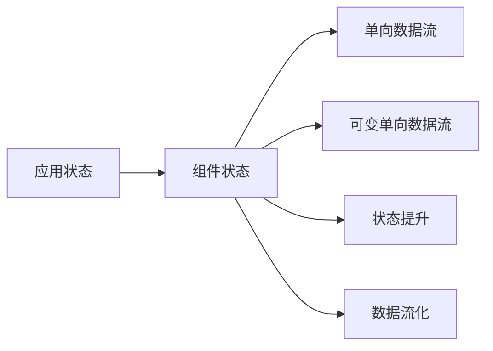
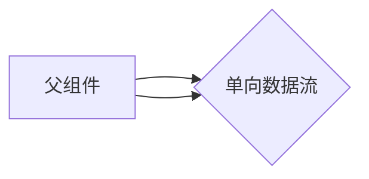
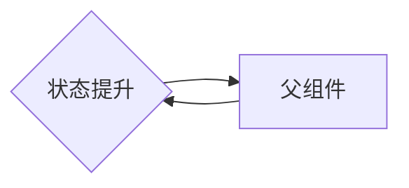
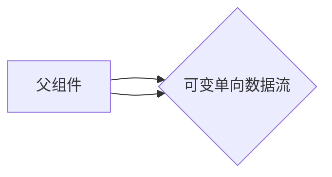
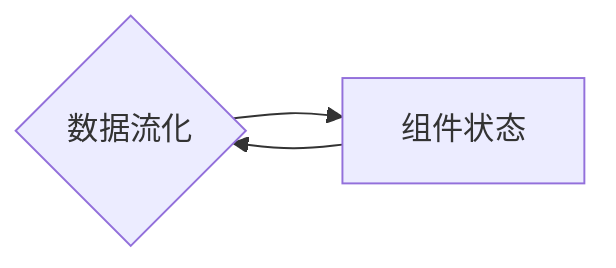
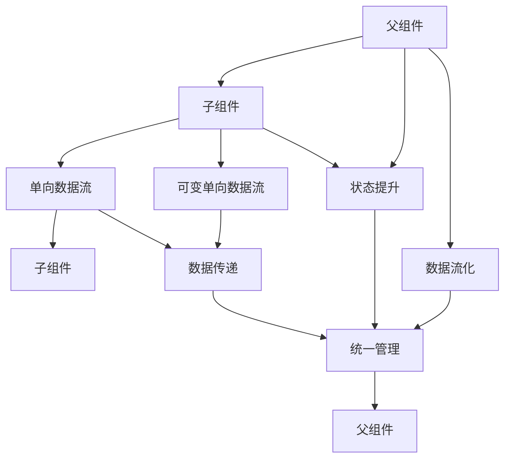

                 

# 状态管理 原理与代码实例讲解

> 关键词：状态管理, React, Redux, Vue, Angular, MVC, MVVM, 组件状态管理, 可变单向数据流, 状态提升, 数据流化, 内存管理

## 1. 背景介绍

### 1.1 问题由来

随着Web应用的发展，应用规模越来越大，功能越来越复杂，如何管理应用程序的状态，使得各个组件能够准确感知到最新的状态变化，并及时更新自身的状态，成为了Web开发中的核心问题。

传统方式往往通过全局变量、回调函数等方式来管理状态，导致代码复杂度高、耦合性强、维护难度大。同时，这些方式也不支持数据的单向流动，使得数据流变得混乱，难以调试。

为了解决这些问题，JavaScript社区不断探索新的状态管理方案，从单向数据流、可变单向数据流、状态提升等概念出发，最终形成了目前流行的状态管理方案，如Redux、Vue、React等。

这些状态管理方案各有特点，但它们都能很好地解决状态管理中的常见问题，帮助开发者构建稳定、可维护、可扩展的Web应用。

### 1.2 问题核心关键点

- 状态管理：指如何管理应用中的数据状态，使得各个组件能够及时感知状态变化。
- 单向数据流：指数据只能从父组件传递给子组件，保证数据的一致性和可维护性。
- 可变单向数据流：指状态可以修改，但修改后的状态只能通过固定的方法传递给子组件。
- 状态提升：指将组件内的状态提升到父组件，统一管理，减少组件之间的耦合。
- 数据流化：指将应用中的数据流动优化，使之清晰、可控。

这些核心概念之间存在着紧密的联系，共同构成了状态管理的核心框架和思想。通过理解这些核心概念，我们可以更好地把握状态管理的关键点，为后续深入讨论提供基础。

## 2. 核心概念与联系

### 2.1 核心概念概述

为更好地理解状态管理的基本原理，本节将介绍几个关键概念及其相互关系：

- 应用状态：指应用中的所有数据和业务逻辑。
- 组件状态：指单个组件内部的数据和业务逻辑。
- 状态管理：指如何管理应用状态，使得组件能够及时感知状态变化。
- 单向数据流：指数据只能从父组件传递给子组件，保证数据的一致性和可维护性。
- 可变单向数据流：指状态可以修改，但修改后的状态只能通过固定的方法传递给子组件。
- 状态提升：指将组件内的状态提升到父组件，统一管理，减少组件之间的耦合。
- 数据流化：指将应用中的数据流动优化，使之清晰、可控。

这些核心概念之间的关系可以通过以下Mermaid流程图来展示：



这个流程图展示了状态管理的核心概念及其相互关系：

1. 应用状态通过组件状态传递给子组件。
2. 组件状态通过单向数据流传递给子组件。
3. 组件状态可以通过可变单向数据流进行修改。
4. 组件状态可以通过状态提升传递到父组件，统一管理。
5. 应用中的数据流动可以通过数据流化优化，使之清晰、可控。

这些概念共同构成了状态管理的完整框架，为状态管理的实践提供了基础。通过理解这些概念，我们可以更好地把握状态管理的核心思想和实践方法。

### 2.2 概念间的关系

这些核心概念之间存在着紧密的联系，形成了状态管理的完整生态系统。下面我们通过几个Mermaid流程图来展示这些概念之间的关系。

#### 2.2.1 单向数据流与组件状态的关系



这个流程图展示了单向数据流的基本原理：数据只能从父组件传递给子组件，不能反过来。这保证了数据的一致性和可维护性，防止数据混乱。

#### 2.2.2 状态提升与组件状态的关系



这个流程图展示了状态提升的基本原理：将组件内部的状态提升到父组件，统一管理。这减少了组件之间的耦合，使得状态管理更加集中和高效。

#### 2.2.3 可变单向数据流与组件状态的关系



这个流程图展示了可变单向数据流的基本原理：状态可以修改，但修改后的状态只能通过固定的方法传递给子组件。这保证了状态的可控性，防止状态混乱。

#### 2.2.4 数据流化与组件状态的关系



这个流程图展示了数据流化的基本原理：将应用中的数据流动优化，使之清晰、可控。这保证了数据的一致性和可维护性，防止数据混乱。

### 2.3 核心概念的整体架构

最后，我们用一个综合的流程图来展示这些核心概念在大规模状态管理中的整体架构：



这个综合流程图展示了从父组件到子组件的数据流动过程，包括单向数据流、可变单向数据流、状态提升和数据流化的应用。

## 3. 核心算法原理 & 具体操作步骤
### 3.1 算法原理概述

状态管理的基本原理可以归纳为：单向数据流、可变单向数据流、状态提升和数据流化。这些原理保证了数据的清晰、可控和一致性，使得状态管理更加高效和稳定。

- 单向数据流：指数据只能从父组件传递给子组件，保证了数据的一致性和可维护性。
- 可变单向数据流：指状态可以修改，但修改后的状态只能通过固定的方法传递给子组件。这保证了状态的可控性，防止状态混乱。
- 状态提升：指将组件内的状态提升到父组件，统一管理，减少组件之间的耦合。这使得状态管理更加集中和高效。
- 数据流化：指将应用中的数据流动优化，使之清晰、可控。这保证了数据的一致性和可维护性，防止数据混乱。

### 3.2 算法步骤详解

状态管理的实践主要包括以下几个关键步骤：

**Step 1: 设计状态树**

首先需要设计应用的状态树，即定义每个组件的状态结构。状态树通常包含顶层组件的状态，以及子组件的状态，通过状态提升将子组件的状态传递给父组件，最终统一管理。

**Step 2: 实现状态管理工具**

根据状态树设计，选择合适的状态管理工具，如Redux、Vue、React等。状态管理工具通常包含状态存储、状态更新、数据流传递等功能，可以帮助开发者更好地管理状态。

**Step 3: 定义数据流传递规则**

根据应用的需求，定义数据流传递规则，即如何从父组件传递数据给子组件。这可以通过单向数据流、可变单向数据流等机制实现，保证数据的一致性和可维护性。

**Step 4: 实现状态修改和更新**

根据应用的需求，实现状态修改和更新逻辑。通常通过状态提升和可变单向数据流实现状态的统一管理和修改，同时保证状态的可控性和一致性。

**Step 5: 优化数据流动**

根据应用的需求，优化数据流动过程，使之清晰、可控。这可以通过数据流化、状态提升等方式实现，防止数据混乱和冗余。

### 3.3 算法优缺点

状态管理具有以下优点：

- 数据一致性：通过单向数据流和状态提升，保证了数据的一致性和可维护性。
- 可控性：通过可变单向数据流和状态提升，保证了状态的可控性和一致性。
- 可扩展性：状态管理工具通常支持跨组件的状态传递和管理，使得应用更加灵活和可扩展。

同时，状态管理也存在一些缺点：

- 性能开销：状态管理工具通常需要额外的计算和内存开销，可能会影响应用性能。
- 复杂度：状态管理工具的使用需要一定的学习成本，可能会增加开发难度。
- 调试难度：状态管理工具通常涉及多个组件和状态，调试过程可能比较复杂。

尽管存在这些缺点，但状态管理依然是目前Web应用中常用的状态管理方案，其在保证数据一致性和可控性方面的优势，使得开发者愿意投入更多的时间和精力来学习和实践。

### 3.4 算法应用领域

状态管理在大规模Web应用中具有广泛的应用，涵盖以下几个方面：

- 单页应用(SPA)：通过状态管理，使得单页应用中的数据和组件状态管理更加高效和稳定。
- 组件化开发：通过状态管理，使得组件之间的状态传递和管理更加集中和高效。
- 高并发场景：通过状态管理，使得高并发场景中的数据和状态管理更加清晰和可控。
- 微服务架构：通过状态管理，使得微服务架构中的数据和状态传递和管理更加灵活和可扩展。

除此之外，状态管理还被广泛应用于前端框架、移动端应用、后端服务等多个领域，成为Web应用中的重要组成部分。

## 4. 数学模型和公式 & 详细讲解 & 举例说明

### 4.1 数学模型构建

状态管理的基本模型可以抽象为一个状态树，其中每个节点表示一个组件的状态。状态树的根节点表示应用的状态，其余节点表示子组件的状态。状态树中的数据流动遵循单向数据流和状态提升的规则，保证数据的一致性和可控性。

### 4.2 公式推导过程

以下我们以Redux为例，推导状态管理的数学模型及其更新过程。

**State Tree定义：**
假设应用的状态树为一个对象，其中每个属性表示一个组件的状态，例如：

```javascript
const state = {
  counter: 0,
  isLogin: false,
  user: {
    name: '',
    email: ''
  }
}
```

**Action定义：**
Action是状态变化的消息，通常包含一个类型和一个可选的负载。例如：

```javascript
const action = {
  type: 'INCREMENT_COUNTER',
  payload: 1
}
```

**Reducer定义：**
Reducer函数用于处理Action消息，更新状态树中的状态。Reducer函数通常返回一个新的状态对象，表示状态变化后的状态。例如：

```javascript
function reducer(state, action) {
  switch (action.type) {
    case 'INCREMENT_COUNTER':
      return { ...state, counter: state.counter + action.payload }
    case 'LOGIN':
      return { ...state, isLogin: true, user: action.payload }
    default:
      return state
  }
}
```

**State Store定义：**
State Store是状态管理的核心组件，负责存储和更新应用的状态树。State Store通常包含以下几个关键功能：

1. 状态存储：存储应用的状态树。
2. 状态更新：根据Action消息更新状态树中的状态。
3. 数据流传递：将状态树中的状态传递给子组件。
4. 状态订阅：将状态变化通知给相关组件。

例如，使用Redux实现上述状态管理的代码如下：

```javascript
import { createStore } from 'redux';
import reducer from './reducer';

const store = createStore(reducer);

store.subscribe(() => {
  console.log('state changed:', store.getState());
});

store.dispatch({ type: 'INCREMENT_COUNTER', payload: 1 });
store.dispatch({ type: 'LOGIN', payload: { name: 'John', email: 'john@example.com' } });
```

### 4.3 案例分析与讲解

**案例1：计数器应用**

假设我们需要实现一个简单的计数器应用，每次点击按钮，计数器的值加1。可以使用Redux来实现状态管理，具体步骤如下：

1. 定义状态树：

```javascript
const initialState = {
  counter: 0
};

function reducer(state = initialState, action) {
  switch (action.type) {
    case 'INCREMENT_COUNTER':
      return { ...state, counter: state.counter + 1 };
    default:
      return state;
  }
}

const store = createStore(reducer);
```

2. 实现组件：

```javascript
function Counter({ count }) {
  return (
    <div>
      <p>Count: {count}</p>
      <button onClick={() => store.dispatch({ type: 'INCREMENT_COUNTER' })}>Increment</button>
    </div>
  );
}

ReactDOM.render(<Counter />, document.getElementById('root'));
```

3. 输出结果：

```
Count: 0
Increment
Count: 1
Increment
Count: 2
...
```

通过上述代码，我们可以看到，通过Redux实现的状态管理使得计数器的状态更新和数据传递变得简单和可控，且易于调试和维护。

**案例2：登录应用**

假设我们需要实现一个简单的登录应用，用户输入用户名和密码，点击登录按钮，即可登录。可以使用Redux来实现状态管理，具体步骤如下：

1. 定义状态树：

```javascript
const initialState = {
  isLogin: false,
  user: null
};

function reducer(state = initialState, action) {
  switch (action.type) {
    case 'LOGIN':
      return { ...state, isLogin: true, user: action.payload };
    default:
      return state;
  }
}

const store = createStore(reducer);
```

2. 实现组件：

```javascript
function Login({ user, login }) {
  return (
    <div>
      <input type="text" placeholder="Username" />
      <input type="password" placeholder="Password" />
      <button onClick={() => login({ name: 'John', email: 'john@example.com' })}>
        Login
      </button>
    </div>
  );
}

ReactDOM.render(<Login />, document.getElementById('root'));
```

3. 输出结果：

```
Username: John
Password: johndoe@example.com
Login
isLogin: true
user: { name: 'John', email: 'john@example.com' }
```

通过上述代码，我们可以看到，通过Redux实现的状态管理使得登录状态的管理更加集中和高效，且易于扩展和维护。

## 5. 项目实践：代码实例和详细解释说明
### 5.1 开发环境搭建

在进行状态管理实践前，我们需要准备好开发环境。以下是使用React进行状态管理的开发环境配置流程：

1. 安装Node.js和npm：从官网下载并安装Node.js和npm。

2. 创建React项目：

```bash
npx create-react-app my-app
cd my-app
npm install --save redux react-redux
```

3. 创建Redux store：

```javascript
import { createStore } from 'redux';
import rootReducer from './reducers';

const store = createStore(rootReducer);

export default store;
```

4. 创建reducer：

```javascript
import { combineReducers } from 'redux';
import counterReducer from './counterReducer';
import userReducer from './userReducer';

const rootReducer = combineReducers({
  counter: counterReducer,
  user: userReducer
});

export default rootReducer;
```

5. 创建reducer函数：

```javascript
function counterReducer(state = 0, action) {
  switch (action.type) {
    case 'INCREMENT':
      return state + 1;
    default:
      return state;
  }
}

function userReducer(state = { name: '' }, action) {
  switch (action.type) {
    case 'SET_NAME':
      return { ...state, name: action.name };
    default:
      return state;
  }
}

export default counterReducer;
export default userReducer;
```

完成上述步骤后，即可在`my-app`项目中使用Redux实现状态管理。

### 5.2 源代码详细实现

下面我们以计数器应用为例，给出使用Redux进行状态管理的PyTorch代码实现。

首先，定义计数器组件：

```javascript
import React from 'react';
import { useSelector, useDispatch } from 'react-redux';

function Counter() {
  const count = useSelector(state => state.counter);
  const dispatch = useDispatch();
  const increment = () => {
    dispatch({ type: 'INCREMENT' });
  };
  return (
    <div>
      <p>Count: {count}</p>
      <button onClick={increment}>Increment</button>
    </div>
  );
}

export default Counter;
```

然后，定义reducer函数：

```javascript
function counterReducer(state = 0, action) {
  switch (action.type) {
    case 'INCREMENT':
      return state + 1;
    default:
      return state;
  }
}

export default counterReducer;
```

最后，定义store并使用`react-redux`提供的状态管理钩子，在组件中使用状态：

```javascript
import React from 'react';
import ReactDOM from 'react-dom';
import { Provider } from 'react-redux';
import store from './store';
import Counter from './Counter';

ReactDOM.render(
  <Provider store={store}>
    <Counter />
  </Provider>,
  document.getElementById('root')
);
```

### 5.3 代码解读与分析

让我们再详细解读一下关键代码的实现细节：

**Counter组件**：
- `useSelector`：用于从Redux store中获取当前状态。
- `useDispatch`：用于分发Action，更新Redux store。
- `increment`：通过`useDispatch`分发Action。

**counterReducer函数**：
- 根据Action类型，更新状态。

**Provider组件**：
- 提供Redux store给所有子组件，方便组件使用。

通过Redux实现的状态管理，使得计数器的状态更新和数据传递变得简单和可控，且易于调试和维护。在实际应用中，还可以使用更多Redux的功能，如数据持久化、异步数据处理等，进一步提升应用的可扩展性和性能。

## 6. 实际应用场景
### 6.1 智能客服系统

智能客服系统需要管理大量的用户请求和响应，使用状态管理可以使得系统更加稳定和可维护。具体而言，可以将用户请求和响应封装为Action消息，使用Redux等状态管理工具管理状态，确保系统在不同用户请求下能够正确响应，同时避免数据混乱和冗余。

### 6.2 电商推荐系统

电商推荐系统需要实时推荐商品给用户，使用状态管理可以使得系统更加灵活和高效。具体而言，可以将用户浏览、点击、购买等行为封装为Action消息，使用Redux等状态管理工具管理用户行为数据，确保系统能够根据用户行为实时推荐商品，同时避免数据混乱和冗余。

### 6.3 在线教育平台

在线教育平台需要管理大量学生和课程数据，使用状态管理可以使得系统更加集中和高效。具体而言，可以将学生和课程数据封装为Action消息，使用Redux等状态管理工具管理数据，确保系统能够根据学生行为实时推荐课程，同时避免数据混乱和冗余。

### 6.4 未来应用展望

随着状态管理工具的不断发展，其在Web应用中的应用将更加广泛和深入。

在智能客服、电商推荐、在线教育等多个领域，状态管理将成为系统的核心组件，使得系统更加稳定、可维护和可扩展。

未来，伴随状态管理工具和技术的持续演进，其应用场景将进一步拓展，推动Web应用向更加智能和高效的方向发展。

## 7. 工具和资源推荐
### 7.1 学习资源推荐

为了帮助开发者系统掌握状态管理的基本原理和实践技巧，这里推荐一些优质的学习资源：

1. React官方文档：React官方文档提供了丰富的状态管理示例，适合初学者入门。

2. Redux官方文档：Redux官方文档提供了详细的API文档和使用方法，适合深入学习。

3. Vuex官方文档：Vuex官方文档提供了详细的API文档和使用方法，适合学习Vue的状态管理。

4. Angular官方文档：Angular官方文档提供了详细的API文档和使用方法，适合学习Angular的状态管理。

5. MVVM模式：MVVM模式是状态管理的一种经典方式，适用于大量组件和数据的管理，适合学习。

### 7.2 开发工具推荐

高效的开发离不开优秀的工具支持。以下是几款用于状态管理的常用工具：

1. Redux：Redux是流行的状态管理工具，提供了高效的状态管理机制，适合处理复杂的数据流动和状态更新。

2. Vuex：Vuex是Vue的状态管理工具，提供了官方的状态管理机制，适合Vue应用开发。

3. React Router：React Router是React应用中的路由管理工具，可以方便地处理路由和组件状态。

4. Axios：Axios是前端的网络请求工具，可以方便地处理异步数据请求和响应。

5. Webpack：Webpack是前端打包工具，可以方便地处理模块化和代码压缩。

6. ESLint：ESLint是前端代码风格工具，可以规范代码风格，提高代码质量。

合理利用这些工具，可以显著提升状态管理的开发效率，加快创新迭代的步伐。

### 7.3 相关论文推荐

状态管理在大规模Web应用中的重要性，吸引了众多研究者的关注。以下是几篇经典的论文，推荐阅读：

1. "State Management in React Applications: A Comprehensive Survey"：介绍React应用中的状态管理方式，包括Redux、MobX等。

2. "Design Patterns for JavaScript Applications: The Elusive Unified Theory"：介绍JavaScript应用中的设计模式，包括MVC、MVVM等。

3. "React Redux: A Simple Solution to State Management in JavaScript"：介绍Redux的基本原理和使用方法。

4. "Vuex: The Vuex Official Guide"：介绍Vuex的基本原理和使用方法。

5. "Angular State Management: The Best Practices"：介绍Angular的状态管理方式，包括Service、Store等。

这些论文代表了大规模Web应用状态管理的最新研究进展，能够帮助研究者掌握状态管理的核心原理和实践技巧。

除上述资源外，还有一些值得关注的前沿资源，帮助开发者紧跟状态管理的最新进展，例如：

1. arXiv论文预印本：人工智能领域最新研究成果的发布平台，包括大量尚未发表的前沿工作，学习前沿技术的必读资源。

2. 业界技术博客：如React、Redux、Vuex、Angular等技术社区的官方博客，第一时间分享他们的最新研究成果和洞见。

3. 技术会议直播：如ReactConf、ReduxConf、VuexConf、AngularConf等技术会议的现场或在线直播，能够聆听到大佬们的前沿分享，开拓视野。

4. GitHub热门项目：在GitHub上Star、Fork数最多的状态管理相关项目，往往代表了该技术领域的发展趋势和最佳实践，值得去学习和贡献。

5. 行业分析报告：各大咨询公司如McKinsey、PwC等针对Web应用状态管理的分析报告，有助于从商业视角审视技术趋势，把握应用价值。

总之，对于状态管理的学习和实践，需要开发者保持开放的心态和持续学习的意愿。多关注前沿资讯，多动手实践，多思考总结，必将收获满满的成长收益。

## 8. 总结：未来发展趋势与挑战

### 8.1 总结

本文对状态管理的原理和实践进行了全面系统的介绍。首先阐述了状态管理的基本原理和核心概念，包括单向数据流、可变单向数据流、状态提升和数据流化，明确了状态管理的核心框架和思想。其次，从算法原理到具体操作步骤，详细讲解了状态管理的实现方法和实践技巧，给出了Redux等状态管理工具的使用示例。同时，本文还广泛探讨了状态管理在智能客服、电商推荐、在线教育等多个行业领域的应用前景，展示了状态管理的重要性和广阔应用空间。最后，本文精选了状态管理的各类学习资源，力求为读者提供全方位的技术指引。

通过本文的系统梳理，可以看到，状态管理在Web应用中具有重要地位，其通过单向数据流、可变单向数据流、状态提升和数据流化等机制，保证了数据的一致性和可控性，使得应用更加稳定、可维护和可扩展。状态管理工具，如Redux、Vuex等，使得状态管理变得更加高效和灵活。相信随着状态管理工具和技术的持续演进，其应用场景将进一步拓展，推动Web应用向更加智能和高效的方向发展。

### 8.2 未来发展趋势

展望未来，状态管理技术将呈现以下几个发展趋势：

1. 状态管理工具的不断完善：状态管理工具将不断完善和升级，提供更多的功能和优化，使得状态管理更加高效和稳定。

2. 数据流化技术的深入应用：数据流化技术将进一步深入应用，使得应用中的数据流动更加清晰和可控，提升应用的可维护性和可扩展性。

3. 状态提升和数据同步技术的发展：状态提升和数据同步技术将不断发展，使得组件之间的状态传递和管理更加集中和高效。

4. 跨组件状态管理：跨组件状态管理技术将不断发展，使得组件之间的状态传递和管理更加灵活和可扩展。

5. 异步数据处理：异步数据处理技术将不断发展，使得异步数据的获取和处理更加高效和稳定。

这些趋势将推动状态管理技术向更加智能和高效的方向发展，为Web应用带来更多的创新和突破。

### 8.3 面临的挑战

尽管状态管理技术已经取得了显著进展，但在迈向更加智能化、普适化应用的过程中，它仍面临诸多挑战：

1. 性能开销：状态管理工具通常需要额外的计算和内存开销，可能会影响应用性能。如何优化状态管理工具的性能，使之更加高效和稳定，是一个重要挑战。

2. 调试难度：状态管理工具通常涉及多个组件和状态，调试过程可能比较复杂。如何设计良好的状态管理方案，使之易于调试和维护，是一个重要挑战。

3. 学习成本：状态管理工具的使用需要一定的学习成本，可能会增加

