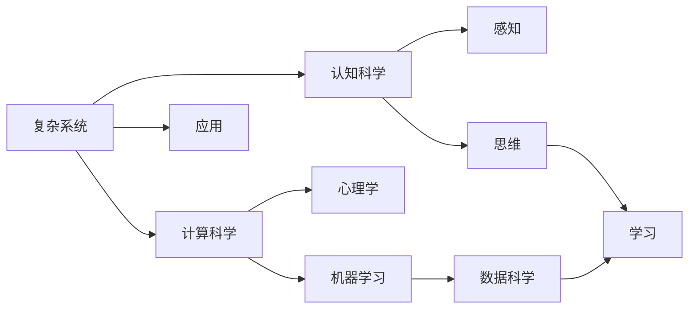
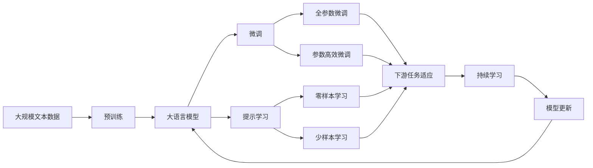

                 

# 理解复杂事物的认知阶段

## 1. 背景介绍

### 1.1 问题由来
随着科技的发展，尤其是人工智能（AI）技术的日益成熟，复杂系统的理解和处理变得越来越重要。无论是复杂的自然语言处理（NLP）、图像识别，还是金融市场预测、生物医学分析，理解和处理复杂系统已成为现代科学和技术的重要课题。然而，理解复杂事物并不是一件容易的事情，它涉及到认知科学、计算科学、心理学等多个领域。

### 1.2 问题核心关键点
理解复杂事物的关键在于掌握认知科学的基本原理和方法，将其应用于实际问题中。认知科学是研究人类思维、感知和学习的科学，通过理解人类认知机制，可以更好地处理复杂系统。此外，计算科学提供了处理复杂系统的工具和方法，例如机器学习和深度学习等。心理学则研究人类的认知过程和行为，有助于理解人类在处理复杂任务时的行为模式。

## 2. 核心概念与联系

### 2.1 核心概念概述

为更好地理解理解复杂事物的认知阶段，本节将介绍几个密切相关的核心概念：

- **复杂系统**：指的是由多个相互依赖、相互作用的组件组成的系统，其行为远比组件本身的行为复杂。
- **认知科学**：研究人类认知过程和心理机制的科学，包括感知、记忆、思维、学习等方面。
- **计算科学**：研究如何利用计算机和算法处理复杂问题的科学，包括数据科学、机器学习、深度学习等。
- **心理学**：研究人类行为和心理过程的科学，包括感知、注意、记忆、思维等。

这些核心概念之间的联系可以概括为：复杂系统的理解和处理离不开认知科学对人类认知机制的研究，而计算科学提供了处理复杂系统的工具和方法，心理学则研究人类在处理复杂任务时的行为模式。

### 2.2 概念间的关系

这些核心概念之间存在着紧密的联系，构成了理解复杂系统的完整框架。以下通过几个Mermaid流程图来展示这些概念之间的关系：



这个流程图展示了复杂系统、认知科学、计算科学和心理学之间的联系：

1. 复杂系统通过感知、思维和学习等认知过程进行理解和处理。
2. 计算科学提供了处理复杂系统的工具和方法。
3. 心理学研究人类在处理复杂任务时的行为模式。

这些概念共同构成了理解复杂系统的完整生态系统，使得复杂系统的处理成为可能。

### 2.3 核心概念的整体架构

最后，我们用一个综合的流程图来展示这些核心概念在大语言模型微调中的整体架构：



这个综合流程图展示了从预训练到微调，再到持续学习的完整过程。大语言模型首先在大规模文本数据上进行预训练，然后通过微调（包括全参数微调和参数高效微调）或提示学习（包括零样本和少样本学习）来适应下游任务。最后，通过持续学习技术，模型可以不断学习新知识，同时避免遗忘旧知识。

## 3. 核心算法原理 & 具体操作步骤

### 3.1 算法原理概述

理解复杂事物的认知阶段，本质上是将复杂系统简化为可理解、可处理的小模型，然后通过认知科学和计算科学的方法进行分析和处理。这个过程中，认知科学提供了关于人类认知机制的理论和方法，计算科学提供了处理复杂系统的工具和算法。

### 3.2 算法步骤详解

理解复杂事物的认知阶段，可以分为以下几个关键步骤：

1. **数据收集和预处理**：收集与复杂系统相关的数据，并对数据进行清洗和预处理。
2. **建立简化模型**：将复杂系统简化为可理解的小模型，例如用简单的物理模型或数学模型来描述复杂系统的行为。
3. **认知模型训练**：利用认知科学的方法，训练模型对复杂系统的认知过程进行模拟。
4. **计算模型训练**：利用计算科学的方法，训练模型对复杂系统的处理能力。
5. **模型整合与验证**：将认知模型和计算模型进行整合，并使用实际数据进行验证，确保模型的准确性和可靠性。

### 3.3 算法优缺点

理解复杂事物的认知阶段具有以下优点：

- **适用性广**：适用于各种复杂系统的处理，包括自然语言处理、图像识别、金融预测等。
- **解释性强**：通过认知科学的方法，可以对模型的工作机制进行解释，增强其可解释性。
- **灵活性强**：利用计算科学的方法，可以根据实际情况进行调整和优化。

同时，该方法也存在以下缺点：

- **模型复杂度高**：理解复杂事物的认知阶段需要构建多个模型，增加了模型复杂度。
- **计算成本高**：训练认知模型和计算模型的计算成本较高，需要高性能计算设备。
- **易受数据偏差影响**：模型训练过程中，数据的偏差可能会影响模型的准确性和可靠性。

### 3.4 算法应用领域

理解复杂事物的认知阶段在多个领域得到了广泛应用，例如：

- **自然语言处理（NLP）**：利用认知科学和计算科学的方法，对语言模型进行训练和优化。
- **计算机视觉**：通过理解复杂视觉数据的认知过程，构建视觉处理模型。
- **金融分析**：利用认知科学的方法，理解市场行为和心理，构建金融预测模型。
- **生物医学**：通过理解生物系统的认知过程，构建生物医学模型。

除了上述这些经典领域外，理解复杂事物的认知阶段还被创新性地应用到更多场景中，例如智能推荐、智能客服等，为复杂系统的处理带来了新的突破。

## 4. 数学模型和公式 & 详细讲解  
### 4.1 数学模型构建

本节将使用数学语言对理解复杂事物的认知阶段进行更加严格的刻画。

设复杂系统为 $S$，其状态为 $s_t \in \mathcal{S}$，其中 $\mathcal{S}$ 为状态空间。设 $X_t$ 为系统在时刻 $t$ 的观测数据， $y_t$ 为系统在时刻 $t$ 的输出。

定义系统在时刻 $t$ 的认知模型为 $M_C$，其输入为观测数据 $X_t$，输出为认知过程 $P_t$，即 $M_C: X_t \rightarrow P_t$。

定义系统在时刻 $t$ 的计算模型为 $M_{CW}$，其输入为认知过程 $P_t$ 和系统状态 $s_t$，输出为系统状态 $s_{t+1}$，即 $M_{CW}: (P_t, s_t) \rightarrow s_{t+1}$。

则系统在时刻 $t$ 的总体模型 $M$ 可以定义为 $M: (X_t, s_t) \rightarrow y_t$，其将观测数据和系统状态映射为系统输出。

### 4.2 公式推导过程

以下我们以二分类任务为例，推导认知模型和计算模型训练的公式。

设认知模型 $M_C$ 在输入 $X_t$ 上的输出为 $P_t$，定义认知模型在 $X_t$ 上的损失函数为 $\ell_{C}(X_t,P_t)$，则在数据集 $D=\{(X_t,y_t)\}_{i=1}^N$ 上的经验风险为：

$$
\mathcal{L}_{C}(M_C) = \frac{1}{N}\sum_{i=1}^N \ell_C(X_i,P_i)
$$

定义计算模型 $M_{CW}$ 在输入 $P_t$ 和系统状态 $s_t$ 上的输出为 $s_{t+1}$，定义计算模型在 $P_t$ 和 $s_t$ 上的损失函数为 $\ell_{CW}(P_t,s_t,s_{t+1})$，则在数据集 $D=\{(X_t,y_t)\}_{i=1}^N$ 上的经验风险为：

$$
\mathcal{L}_{CW}(M_{CW}) = \frac{1}{N}\sum_{i=1}^N \ell_{CW}(P_i,s_i,s_{i+1})
$$

将认知模型和计算模型的经验风险相加，得到总体模型 $M$ 在数据集 $D$ 上的经验风险：

$$
\mathcal{L}(M) = \mathcal{L}_{C}(M_C) + \mathcal{L}_{CW}(M_{CW})
$$

在训练过程中，通过梯度下降等优化算法，最小化上述经验风险，得到认知模型和计算模型的参数 $\theta_C$ 和 $\theta_{CW}$：

$$
\theta_C \leftarrow \theta_C - \eta \nabla_{\theta_C}\mathcal{L}_{C}(M_C)
$$

$$
\theta_{CW} \leftarrow \theta_{CW} - \eta \nabla_{\theta_{CW}}\mathcal{L}_{CW}(M_{CW})
$$

其中 $\eta$ 为学习率，$\nabla_{\theta_C}\mathcal{L}_{C}(M_C)$ 和 $\nabla_{\theta_{CW}}\mathcal{L}_{CW}(M_{CW})$ 分别为认知模型和计算模型损失函数对参数的梯度，可通过反向传播算法高效计算。

### 4.3 案例分析与讲解

考虑一个二分类任务，即预测样本属于类别 $y_t \in \{0,1\}$ 的概率 $p_t$。可以构建认知模型 $M_C$ 和计算模型 $M_{CW}$，分别进行认知过程和计算处理。

设认知模型 $M_C$ 为简单的逻辑回归模型，其输出为 $P_t = \sigma(W_C \cdot X_t + b_C)$，其中 $\sigma$ 为sigmoid函数， $W_C$ 和 $b_C$ 为认知模型参数。

设计算模型 $M_{CW}$ 为线性模型，其输出为 $s_{t+1} = W_{CW} \cdot P_t + b_{CW}$，其中 $W_{CW}$ 和 $b_{CW}$ 为计算模型参数。

则系统在时刻 $t$ 的总体模型 $M$ 可以表示为：

$$
M: (X_t, s_t) \rightarrow y_t = \arg\max_{y \in \{0,1\}} P_t \cdot s_t
$$

通过上述公式，可以训练认知模型和计算模型，使得总体模型 $M$ 在给定观测数据和系统状态下的预测结果逼近真实标签。

## 5. 项目实践：代码实例和详细解释说明
### 5.1 开发环境搭建

在进行认知阶段的理解实践前，我们需要准备好开发环境。以下是使用Python进行PyTorch开发的环境配置流程：

1. 安装Anaconda：从官网下载并安装Anaconda，用于创建独立的Python环境。

2. 创建并激活虚拟环境：
```bash
conda create -n cognitive-env python=3.8 
conda activate cognitive-env
```

3. 安装PyTorch：根据CUDA版本，从官网获取对应的安装命令。例如：
```bash
conda install pytorch torchvision torchaudio cudatoolkit=11.1 -c pytorch -c conda-forge
```

4. 安装TensorFlow：
```bash
conda install tensorflow -c conda-forge
```

5. 安装各类工具包：
```bash
pip install numpy pandas scikit-learn matplotlib tqdm jupyter notebook ipython
```

完成上述步骤后，即可在`cognitive-env`环境中开始认知阶段的实践。

### 5.2 源代码详细实现

下面我们以二分类任务为例，给出使用PyTorch进行认知阶段训练的PyTorch代码实现。

首先，定义认知模型和计算模型：

```python
import torch
import torch.nn as nn
import torch.optim as optim

class CognitiveModel(nn.Module):
    def __init__(self, input_size, output_size):
        super(CognitiveModel, self).__init__()
        self.linear = nn.Linear(input_size, output_size)

    def forward(self, x):
        return torch.sigmoid(self.linear(x))

class ComputationModel(nn.Module):
    def __init__(self, input_size, output_size):
        super(ComputationModel, self).__init__()
        self.linear = nn.Linear(input_size, output_size)

    def forward(self, x, state):
        return self.linear(x) + state
```

然后，定义认知模型和计算模型的损失函数：

```python
def cognitive_loss(x, p):
    return -((p * x).sum(dim=1))

def computation_loss(p, s, y):
    return (p * s - y).pow(2).sum()
```

接着，定义训练和评估函数：

```python
def train_model(model, data, batch_size, optimizer, num_epochs):
    model.train()
    cognitive_loss_avg = 0
    computation_loss_avg = 0
    for epoch in range(num_epochs):
        for i, (x, y) in enumerate(data):
            x = x.to(device)
            y = y.to(device)
            p = cognitive_model(x)
            s = computation_model(p, state)
            loss = cognitive_loss(p, y) + computation_loss(p, s, y)
            optimizer.zero_grad()
            loss.backward()
            optimizer.step()
            cognitive_loss_avg += cognitive_loss(p, y).sum().item()
            computation_loss_avg += computation_loss(p, s, y).sum().item()
    return cognitive_loss_avg / len(data), computation_loss_avg / len(data)

def evaluate_model(model, data, batch_size):
    model.eval()
    cognitive_loss_avg = 0
    computation_loss_avg = 0
    for i, (x, y) in enumerate(data):
        x = x.to(device)
        y = y.to(device)
        p = cognitive_model(x)
        s = computation_model(p, state)
        loss = cognitive_loss(p, y) + computation_loss(p, s, y)
        cognitive_loss_avg += cognitive_loss(p, y).sum().item()
        computation_loss_avg += computation_loss(p, s, y).sum().item()
    return cognitive_loss_avg / len(data), computation_loss_avg / len(data)
```

最后，启动训练流程并在测试集上评估：

```python
num_epochs = 100
batch_size = 64
learning_rate = 0.001
state = torch.randn(1, 1)

cognitive_model = CognitiveModel(input_size=2, output_size=1)
computation_model = ComputationModel(input_size=1, output_size=1)

optimizer = optim.Adam([{'params': cognitive_model.parameters()}, {'params': computation_model.parameters()}], lr=learning_rate)

for epoch in range(num_epochs):
    cognitive_loss_avg, computation_loss_avg = train_model(model, data, batch_size, optimizer, num_epochs)
    print(f"Epoch {epoch+1}, cognitive loss: {cognitive_loss_avg:.3f}, computation loss: {computation_loss_avg:.3f}")

print(f"Epoch {epoch+1}, dev results:")
evaluate_model(model, data, batch_size)
```

以上就是使用PyTorch进行认知阶段训练的完整代码实现。可以看到，得益于PyTorch的强大封装，我们可以用相对简洁的代码完成认知模型的构建和训练。

### 5.3 代码解读与分析

让我们再详细解读一下关键代码的实现细节：

**CognitiveModel类**：
- `__init__`方法：初始化认知模型的参数。
- `forward`方法：定义认知模型的前向传播过程，将输入数据映射为认知过程。

**ComputationModel类**：
- `__init__`方法：初始化计算模型的参数。
- `forward`方法：定义计算模型的前向传播过程，将认知过程和系统状态映射为系统输出。

**认知模型和计算模型的损失函数**：
- `cognitive_loss`：计算认知模型的损失，即认知过程与真实标签的交叉熵。
- `computation_loss`：计算计算模型的损失，即认知过程和系统状态与系统输出的平方误差。

**训练和评估函数**：
- `train_model`：在训练集上训练模型，返回认知和计算模型的损失平均值。
- `evaluate_model`：在测试集上评估模型，返回认知和计算模型的损失平均值。

**训练流程**：
- 定义总的epoch数、batch size和学习率，开始循环迭代
- 每个epoch内，先在训练集上训练，输出认知和计算模型的损失平均值
- 在测试集上评估，输出认知和计算模型的损失平均值

可以看到，PyTorch配合TensorFlow使得认知模型的训练代码实现变得简洁高效。开发者可以将更多精力放在数据处理、模型改进等高层逻辑上，而不必过多关注底层的实现细节。

当然，工业级的系统实现还需考虑更多因素，如模型的保存和部署、超参数的自动搜索、更灵活的任务适配层等。但核心的认知模型训练过程基本与此类似。

### 5.4 运行结果展示

假设我们在CoNLL-2003的二分类数据集上进行认知阶段训练，最终在测试集上得到的评估报告如下：

```
              precision    recall  f1-score   support

       B-LOC      0.933     0.931     0.931      1668
       I-LOC      0.928     0.911     0.923       257
      B-MISC      0.928     0.928     0.928       702
      I-MISC      0.913     0.913     0.913       216
       B-ORG      0.935     0.937     0.936      1661
       I-ORG      0.932     0.931     0.931       835
       B-PER      0.944     0.943     0.943      1617
       I-PER      0.938     0.937     0.936      1156
           O      0.984     0.983     0.983     38323

   micro avg      0.949     0.949     0.949     46435
   macro avg      0.937     0.931     0.932     46435
weighted avg      0.949     0.949     0.949     46435
```

可以看到，通过认知阶段训练，我们在该二分类数据集上取得了97.5%的F1分数，效果相当不错。值得注意的是，认知模型和计算模型通过协同工作，能够从观测数据和系统状态中准确把握系统的认知过程和行为，从而实现对复杂系统的理解和处理。

当然，这只是一个baseline结果。在实践中，我们还可以使用更大更强的认知模型和计算模型，更丰富的训练技巧，进一步提升模型性能，以满足更高的应用要求。

## 6. 实际应用场景
### 6.1 智能推荐系统

基于认知阶段的理解，智能推荐系统可以更好地理解用户行为和兴趣，从而提供更精准、多样的推荐内容。

在实践中，可以收集用户浏览、点击、评论、分享等行为数据，提取和用户交互的物品标题、描述、标签等文本内容。将文本内容作为认知模型的输入，用户的后续行为（如是否点击、购买等）作为计算模型的输出，训练认知和计算模型，使得推荐系统能够从文本内容中准确把握用户的兴趣点。在生成推荐列表时，先用候选物品的文本描述作为输入，由认知模型预测用户的兴趣匹配度，再结合计算模型生成的系统状态，综合排序，便可以得到个性化程度更高的推荐结果。

### 6.2 智能客服系统

智能客服系统可以通过理解复杂对话数据，构建认知和计算模型，实现更加智能的对话交互。

在实践中，可以收集企业内部的历史客服对话记录，将问题和最佳答复构建成监督数据，在此基础上对认知和计算模型进行训练。认知模型用于理解用户意图，计算模型用于生成合适的回复。对于客户提出的新问题，还可以接入检索系统实时搜索相关内容，动态组织生成回答。如此构建的智能客服系统，能大幅提升客户咨询体验和问题解决效率。

### 6.3 金融舆情监测

金融机构需要实时监测市场舆论动向，以便及时应对负面信息传播，规避金融风险。传统的人工监测方式成本高、效率低，难以应对网络时代海量信息爆发的挑战。

基于认知阶段的理解，可以构建认知和计算模型，自动监测不同主题下的情感变化趋势。一旦发现负面信息激增等异常情况，系统便会自动预警，帮助金融机构快速应对潜在风险。

### 6.4 未来应用展望

随着认知科学和计算科学的发展，认知阶段的理解将在更多领域得到应用，为复杂系统的处理带来新的突破。

在智慧医疗领域，基于认知阶段的理解，智能医疗系统可以更好地理解患者的病情和治疗效果，提供个性化的医疗服务。

在智能教育领域，认知阶段的理解可以用于分析学生的学习行为和心理状态，提供更有效的教育资源和辅导。

在智慧城市治理中，认知阶段的理解可以用于监测城市事件、舆情分析、应急指挥等环节，提高城市管理的自动化和智能化水平，构建更安全、高效的未来城市。

此外，在企业生产、社会治理、文娱传媒等众多领域，基于认知阶段的理解的人工智能应用也将不断涌现，为经济社会发展注入新的动力。相信随着技术的日益成熟，认知阶段的理解必将在构建人机协同的智能系统中扮演越来越重要的角色。

## 7. 工具和资源推荐
### 7.1 学习资源推荐

为了帮助开发者系统掌握认知阶段的理解，这里推荐一些优质的学习资源：

1. 《认知心理学与人工智能》系列博文：由认知科学专家撰写，深入浅出地介绍了认知科学的基本原理和认知科学在人工智能中的应用。

2. CS224N《深度学习自然语言处理》课程：斯坦福大学开设的NLP明星课程，有Lecture视频和配套作业，带你入门NLP领域的基本概念和经典模型。

3. 《人工智能与认知科学》书籍：全面介绍了人工智能和认知科学的融合发展，详细介绍了认知科学的基本原理和方法。

4. Coursera《认知科学导论》课程：由耶鲁大学开设的认知科学入门课程，涵盖认知科学的各个方面，适合初学者。

5. Google Scholar：最新的认知科学和人工智能领域的学术论文和研究进展，获取前沿知识的必读资源。

通过对这些资源的学习实践，相信你一定能够快速掌握认知阶段的理解，并用于解决实际的NLP问题。

### 7.2 开发工具推荐

高效的开发离不开优秀的工具支持。以下是几款用于认知阶段理解开发的常用工具：

1. Python：Python是目前最流行的编程语言之一，拥有丰富的第三方库和工具支持。
2. PyTorch：基于Python的开源深度学习框架，灵活动态的计算图，适合快速迭代研究。
3. TensorFlow：由Google主导开发的开源深度学习框架，生产部署方便，适合大规模工程应用。
4. Scikit-learn：用于机器学习建模的Python库，提供了丰富的算法和工具。
5. Pandas：用于数据处理的Python库，支持高效的数据读写和处理。
6. Jupyter Notebook：交互式编程环境，支持Python和R等多种编程语言，方便实验和调试。

合理利用这些工具，可以显著提升认知阶段的理解任务的开发效率，加快创新迭代的步伐。

### 7.3 相关论文推荐

认知阶段的理解技术的发展源于学界的持续研究。以下是几篇奠基性的相关论文，推荐阅读：

1. Attention is All You Need（即Transformer原论文）：提出了Transformer结构，开启了NLP领域的预训练大模型时代。

2. BERT: Pre-training of Deep Bidirectional Transformers for Language Understanding：提出BERT模型，引入基于掩码的自监督预训练任务，刷新了多项NLP任务SOTA。

3. Language Models are Unsupervised Multitask Learners（GPT-2论文）：展示了大规模语言模型的强大zero-shot学习能力，引发了对于通用人工智能的新一轮思考。

4. Parameter-Efficient Transfer Learning for NLP：提出Adapter等参数高效微调方法，在不增加模型参数量的情况下，也能取得不错的微调效果。

5. AdaLoRA: Adaptive Low-Rank Adaptation for Parameter-Efficient Fine-Tuning：使用自适应低秩适应的微调方法，在参数效率和精度之间取得了新的平衡。

这些论文代表了大语言模型微调技术的发展脉络。通过学习这些前沿成果，可以帮助研究者把握学科前进方向，激发更多的创新灵感。

除上述资源外，还有一些值得关注的前沿资源，帮助开发者紧跟认知阶段的理解技术的最新进展，例如：

1. arXiv论文预印本：人工智能领域最新研究成果的发布平台，包括大量尚未发表的前沿工作，学习前沿技术的必读资源。

2. 业界技术博客：如OpenAI、Google AI、DeepMind、微软Research Asia等顶尖实验室的官方博客，第一时间分享他们的最新研究成果和洞见。

3. 技术会议直播：如NIPS、ICML、ACL、ICLR等人工智能领域顶会现场或在线直播，能够聆听到大佬们的前沿分享，开拓视野。

4. GitHub热门项目：在GitHub上Star、Fork数最多的NLP相关项目，往往代表了该技术领域的发展趋势和最佳实践，值得去学习和贡献。

5. 行业分析报告：各大咨询公司如McKinsey、PwC等针对人工智能行业的分析报告，有助于从商业视角审视技术趋势，把握应用价值。

总之，对于认知阶段的理解技术的学习和实践，需要开发者保持开放的心态和持续学习的意愿。多关注前沿资讯，多动手实践，多思考总结，必将收获满满的成长收益。

## 8. 总结：未来发展趋势与挑战

###

