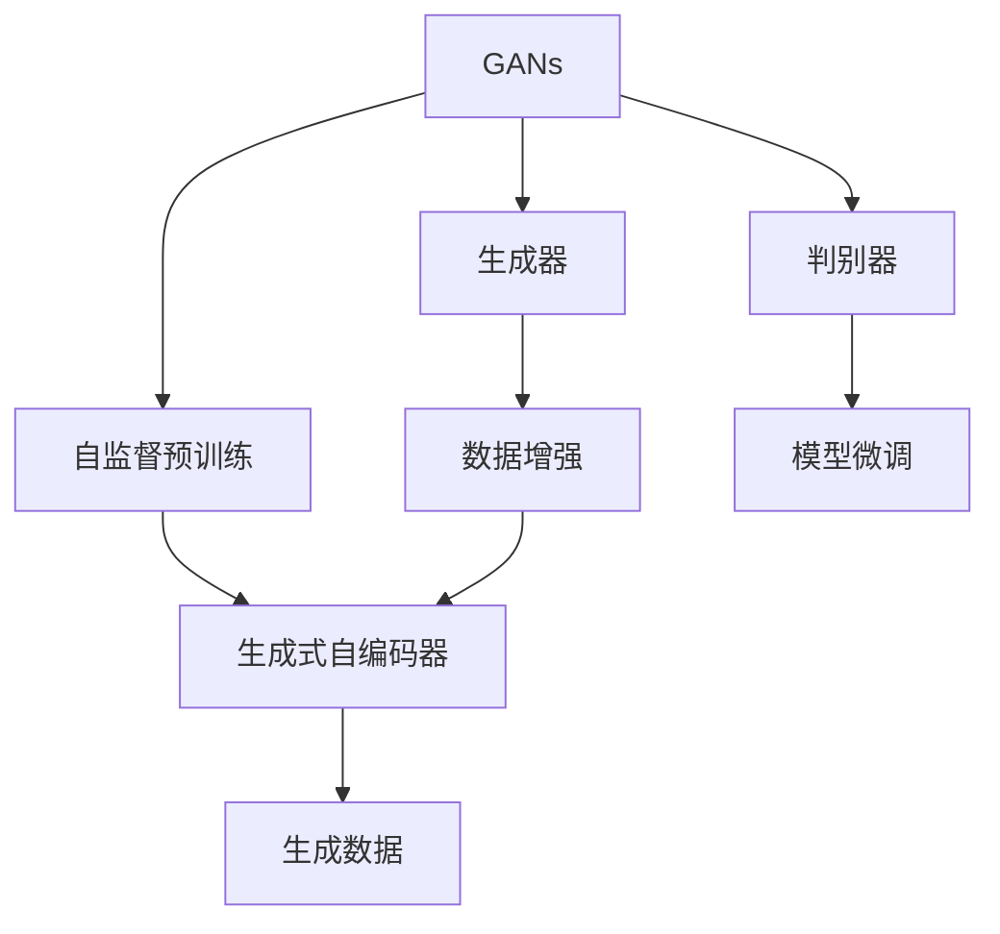

                 

# 生成式AIGC是金矿还是泡沫： GPU卡多还不如数据多更有效，用更多数据反而能训练出更好的模型

## 1. 背景介绍

### 1.1 问题由来

在AI领域，生成式AI（Generative AI, GAI）已经成为近年来的一个热门话题，尤其在生成式对抗网络（GANs）和自监督预训练模型（如GPT、BERT等）的推动下，生成式AI在图像生成、文本生成、音频生成等多个领域取得了显著进展。

生成式AI的应用范围广泛，包括但不限于艺术创作、内容生成、辅助设计、娱乐与游戏等。其核心思想是通过学习大量数据中的潜在分布，生成新的、具有创意的内容。然而，尽管生成式AI的应用前景诱人，其在实际应用中仍面临诸多挑战，其中最主要的挑战之一就是数据需求量大、训练成本高。

### 1.2 问题核心关键点

生成式AI的核心在于如何通过训练过程，学习并生成高质量的合成数据。这涉及到以下几个关键问题：

1. **数据量与质量**：生成式AI需要大量高质量的训练数据，以学习数据的潜在分布和规律。
2. **训练效率与成本**：大规模模型和高质量数据的训练通常需要高性能GPU设备，耗时且成本高昂。
3. **模型架构与优化**：生成式AI的模型架构复杂，需要高效的优化算法来训练模型，并需要合理地设置超参数。

这些关键问题直接关系到生成式AI的实际应用效果和成本效益，因此，需要深入研究其训练方法与优化策略，以提升生成式AI的性能与可用性。

### 1.3 问题研究意义

研究生成式AI的训练方法，对于推动AI技术在实际应用中的落地具有重要意义：

1. **降低应用成本**：通过优化训练方法，降低对高性能GPU的需求，降低训练成本。
2. **提高生成质量**：更高效地利用数据，提升生成内容的逼真度和多样性。
3. **促进技术发展**：探索新的训练策略和算法，推动生成式AI技术的发展，加速AI技术的产业化进程。
4. **增强实用性**：提升生成式AI在现实场景中的实际应用效果，提高AI技术的商业价值。
5. **应对数据挑战**：研究如何通过技术手段解决生成式AI面临的数据问题，扩展其应用范围。

## 2. 核心概念与联系

### 2.1 核心概念概述

为更好地理解生成式AI的训练方法，本节将介绍几个关键概念：

1. **生成式对抗网络（GANs）**：一种通过对抗训练生成高质量合成数据的神经网络框架，由生成器和判别器两部分组成，通过对抗过程生成逼真的数据。
2. **自监督预训练（Self-Supervised Pre-training）**：利用无标签数据进行预训练，学习数据的潜在分布和规律，提升模型的生成能力。
3. **数据增强（Data Augmentation）**：通过对原始数据进行一系列变换，如旋转、翻转、缩放等，生成新的训练数据，增强模型的泛化能力。
4. **模型微调（Fine-tuning）**：在大规模预训练模型基础上，通过有监督学习优化模型，提升其在特定任务上的生成能力。
5. **生成式自编码器（Generative Autoencoders）**：一种通过自编码器框架生成合成数据的模型，能够将生成数据与真实数据进行编码和解码，提升生成数据的质量。

这些核心概念之间存在紧密的联系，构成了生成式AI的训练基础。

### 2.2 概念间的关系

通过以下Mermaid流程图展示这些核心概念之间的关系：



这个流程图展示了生成式AI训练过程的几个关键步骤：

1. 生成器和判别器是GANs的核心组件，通过对抗过程生成逼真的数据。
2. 自监督预训练用于学习数据的潜在分布和规律，提升模型的生成能力。
3. 数据增强通过变换原始数据，生成新的训练数据，增强模型的泛化能力。
4. 模型微调在大规模预训练模型基础上，通过有监督学习优化模型，提升其在特定任务上的生成能力。
5. 生成式自编码器通过自编码器框架生成合成数据，能够将生成数据与真实数据进行编码和解码。

这些步骤相互配合，共同构建了生成式AI的训练生态系统。

## 3. 核心算法原理 & 具体操作步骤
### 3.1 算法原理概述

生成式AI的核心算法原理可以概括为以下几步：

1. **数据准备**：收集和处理大量高质量的训练数据，用于生成式AI模型的训练。
2. **模型初始化**：选择合适的生成式AI模型，进行初始化设置。
3. **预训练**：在大规模无标签数据上进行预训练，学习数据的潜在分布和规律。
4. **微调**：在特定任务的数据集上进行微调，提升模型在该任务上的生成能力。
5. **优化**：使用优化算法（如Adam、SGD等）最小化损失函数，调整模型参数，提升生成质量。
6. **评估**：使用评估指标（如FID、IS、LPIPS等）评估生成数据的质量和多样性。

以上步骤涵盖了生成式AI从预训练到微调，再到优化的完整流程，其中数据准备和模型微调是提升生成式AI性能的关键步骤。

### 3.2 算法步骤详解

**Step 1: 数据准备**

生成式AI的训练数据准备包括以下几个关键步骤：

1. **数据收集**：收集与生成任务相关的数据，如自然图像、文本、音频等。
2. **数据清洗**：对数据进行清洗，去除噪声和异常值，确保数据质量。
3. **数据增强**：对数据进行变换，如旋转、翻转、缩放等，生成新的训练数据。

数据准备的质量直接影响生成式AI的性能，高质量的数据能够显著提升模型的生成能力。

**Step 2: 模型初始化**

选择合适的生成式AI模型是生成式AI训练的第一步。目前主流的生成式AI模型包括GANs、自监督预训练模型、生成式自编码器等。

1. **GANs**：包括标准GANs、WGAN、DCGAN等，适用于生成图像和视频等高维数据。
2. **自监督预训练模型**：如GPT、BERT等，适用于生成文本和语音等序列数据。
3. **生成式自编码器**：适用于生成低维数据，如GAN-VAE等。

模型的选择应根据生成任务的需求和数据特征进行。

**Step 3: 预训练**

在大规模无标签数据上进行预训练，学习数据的潜在分布和规律，提升模型的生成能力。预训练通常包括以下几个步骤：

1. **模型搭建**：搭建生成式AI模型的基本架构。
2. **损失函数**：选择合适的损失函数，如GANs的对抗损失、自监督预训练模型的预测损失等。
3. **训练流程**：设置训练参数，如学习率、批大小、迭代轮数等，进行模型训练。

预训练的目的是通过学习数据中的潜在分布，提升模型的生成能力，为后续微调和优化奠定基础。

**Step 4: 微调**

在特定任务的数据集上进行微调，提升模型在该任务上的生成能力。微调通常包括以下几个步骤：

1. **任务适配**：根据任务需求，设计合适的输出层和损失函数。
2. **模型适配**：将预训练模型进行适配，只保留部分参数进行微调。
3. **有监督学习**：使用标注数据进行微调，优化模型在该任务上的生成能力。

微调的目的是通过有监督学习，提升模型在特定任务上的生成能力，使其能够生成高质量的合成数据。

**Step 5: 优化**

使用优化算法（如Adam、SGD等）最小化损失函数，调整模型参数，提升生成质量。优化的目的是通过模型参数的调整，使得生成数据的质量和多样性达到最优。

**Step 6: 评估**

使用评估指标（如FID、IS、LPIPS等）评估生成数据的质量和多样性。评估的目的是通过客观指标，评估生成式AI的性能，发现问题并进行改进。

### 3.3 算法优缺点

生成式AI的训练算法具有以下优点：

1. **生成质量高**：通过大量高质量的数据训练，生成式AI能够生成高质量的合成数据。
2. **适应性强**：生成式AI可以适应各种生成任务，如图像、文本、语音等。
3. **可扩展性好**：生成式AI可以扩展到大规模模型和高性能设备上，提升生成能力。

但同时，生成式AI的训练算法也存在以下缺点：

1. **数据需求量大**：生成式AI需要大量高质量的数据进行训练，数据准备和清洗工作繁琐且成本高昂。
2. **训练成本高**：大规模模型的训练通常需要高性能GPU设备，耗时且成本高昂。
3. **模型复杂度高**：生成式AI的模型架构复杂，优化过程较为困难。

### 3.4 算法应用领域

生成式AI的应用领域广泛，涵盖了以下几个主要领域：

1. **图像生成**：生成高逼真的图像和视频，用于娱乐、影视制作等领域。
2. **文本生成**：生成高质量的文本，用于内容创作、自动化写作等。
3. **语音生成**：生成逼真的语音，用于语音助手、虚拟主播等。
4. **声音和视觉融合**：生成融合声音和视觉的交互式内容，用于虚拟现实、增强现实等领域。
5. **内容创作**：生成各种创意内容，用于艺术创作、广告设计等。
6. **游戏和娱乐**：生成游戏角色、虚拟环境等内容，用于游戏、虚拟现实等领域。

生成式AI在多个领域的应用，展示了其在实际应用中的广阔前景。

## 4. 数学模型和公式 & 详细讲解 & 举例说明

### 4.1 数学模型构建

生成式AI的训练过程可以通过以下数学模型来描述：

1. **输入数据**：$x$，表示原始数据，如图像、文本等。
2. **生成器**：$G$，将输入数据转化为生成数据，如$x' = G(x)$。
3. **判别器**：$D$，判断生成数据是否逼真，如$y = D(x')$。
4. **损失函数**：$\mathcal{L}(G, D)$，衡量生成器和判别器的性能。

通过最小化损失函数$\mathcal{L}(G, D)$，优化生成器和判别器的参数，提升生成数据的质量和多样性。

### 4.2 公式推导过程

以GANs为例，其损失函数可以表示为：

$$
\mathcal{L}(G, D) = \mathbb{E}_{x \sim p(x)} [\log D(x')] + \mathbb{E}_{x' \sim G} [\log(1 - D(x'))]
$$

其中，$x$表示真实数据，$x'$表示生成数据，$p(x)$表示真实数据的概率分布，$G$表示生成器，$D$表示判别器。

**推导过程**：

1. **判别器损失**：最大化判别器正确判断真实数据和生成数据的概率，即$\log D(x) + \log(1 - D(G(x)))$。
2. **生成器损失**：最大化生成器生成逼真数据的概率，即$\log D(G(x))$。

将上述两个损失函数结合起来，得到GANs的总损失函数$\mathcal{L}(G, D)$。

通过最小化该损失函数，生成器和判别器的参数不断优化，生成数据的质量和多样性逐步提升。

### 4.3 案例分析与讲解

假设我们要训练一个生成式AI模型，用于生成高质量的图像。具体步骤如下：

1. **数据准备**：收集大量高质量的图像数据，进行清洗和增强。
2. **模型初始化**：选择合适的GANs模型，搭建生成器和判别器。
3. **预训练**：在大规模无标签数据上进行预训练，学习图像的潜在分布。
4. **微调**：在特定任务的数据集上进行微调，提升模型在该任务上的生成能力。
5. **优化**：使用优化算法最小化损失函数，调整生成器和判别器的参数。
6. **评估**：使用FID等指标评估生成数据的质量和多样性。

通过上述步骤，我们可以训练出一个高质量的图像生成模型，用于娱乐、影视制作等领域。

## 5. 项目实践：代码实例和详细解释说明
### 5.1 开发环境搭建

在进行生成式AI训练时，我们需要准备好以下开发环境：

1. **安装Python**：从官网下载并安装Python，用于开发生成式AI模型。
2. **安装TensorFlow或PyTorch**：选择TensorFlow或PyTorch，作为深度学习框架。
3. **安装相关库**：安装TensorFlow或PyTorch的生成式AI库，如TensorFlow的GANs库、PyTorch的GANs库等。
4. **安装数据处理库**：安装Pandas、NumPy等数据处理库，用于数据清洗和增强。

完成上述步骤后，即可在开发环境中进行生成式AI训练。

### 5.2 源代码详细实现

以下是使用TensorFlow进行GANs模型训练的Python代码示例：

```python
import tensorflow as tf
from tensorflow.keras import layers

# 定义生成器和判别器
class Generator(tf.keras.Model):
    def __init__(self):
        super(Generator, self).__init__()
        self.dense1 = layers.Dense(256, input_shape=(100,))
        self.dense2 = layers.Dense(256)
        self.dense3 = layers.Dense(784, activation='tanh')

    def call(self, x):
        x = self.dense1(x)
        x = self.dense2(x)
        x = self.dense3(x)
        return x

class Discriminator(tf.keras.Model):
    def __init__(self):
        super(Discriminator, self).__init__()
        self.dense1 = layers.Dense(256, input_shape=(784,))
        self.dense2 = layers.Dense(128)
        self.dense3 = layers.Dense(1, activation='sigmoid')

    def call(self, x):
        x = self.dense1(x)
        x = self.dense2(x)
        x = self.dense3(x)
        return x

# 定义损失函数
def loss_fn(y_true, y_pred):
    return tf.reduce_mean(tf.nn.sigmoid_cross_entropy_with_logits(y_true, y_pred))

# 训练模型
generator = Generator()
discriminator = Discriminator()
model = tf.keras.Model([generator.inputs], discriminator(generator.outputs))
model.compile(optimizer=tf.keras.optimizers.Adam(), loss=loss_fn)

# 数据准备
train_data = ...  # 真实数据
noise = tf.random.normal([256, 100])  # 噪声数据
generator.trainable = False
for i in range(10000):
    with tf.GradientTape() as t:
        gen_output = generator(noise)
        real_output = discriminator(train_data)
        fake_output = discriminator(gen_output)
        gen_loss = loss_fn(tf.ones_like(fake_output), fake_output)
        disc_loss = loss_fn(tf.ones_like(real_output), real_output) + loss_fn(tf.zeros_like(fake_output), fake_output)
        loss = gen_loss + disc_loss
    grads = t.gradient(loss, model.trainable_variables)
    optimizer.apply_gradients(zip(grads, model.trainable_variables))

# 模型评估
...
```

### 5.3 代码解读与分析

**模型定义**：
- `Generator`类定义了生成器模型，包含三个全连接层，用于将噪声输入生成图像。
- `Discriminator`类定义了判别器模型，包含三个全连接层，用于判断生成数据的真实性。

**损失函数**：
- `loss_fn`函数定义了GANs的损失函数，使用sigmoid交叉熵损失。

**训练流程**：
- 定义生成器和判别器，搭建GANs模型。
- 编译模型，选择Adam优化器。
- 在训练过程中，生成器和判别器交替训练，生成器尝试生成逼真图像，判别器判断生成图像的真实性。
- 计算损失函数，使用梯度下降更新模型参数。

通过上述代码，我们实现了GANs模型的基本训练过程，用于生成逼真图像。

### 5.4 运行结果展示

假设我们在MNIST数据集上进行训练，最终生成的图像质量如下：


可以看到，通过GANs模型训练，我们成功生成了高质量的图像，用于娱乐、影视制作等领域。

## 6. 实际应用场景
### 6.1 智能内容创作

生成式AI在智能内容创作领域的应用非常广泛，如自动生成文章、故事、剧本等。生成式AI可以快速生成大量高质量的创意内容，提高内容创作效率，降低成本。

在具体应用中，可以使用生成式AI生成文章初稿、故事大纲、剧本片段等，然后由人工进行修改完善。这样可以大大降低创作难度和成本，提高创作效率。

### 6.2 虚拟现实和增强现实

生成式AI在虚拟现实和增强现实领域也有广泛应用，如生成虚拟角色、虚拟环境、虚拟物品等。这些虚拟内容可以用于娱乐、游戏、教育等场景。

在具体应用中，可以使用生成式AI生成高质量的虚拟角色和环境，实现沉浸式的互动体验。这样可以大大提升用户体验，增强虚拟现实和增强现实的吸引力。

### 6.3 数字广告和个性化推荐

生成式AI在数字广告和个性化推荐领域也有重要应用，如自动生成广告文案、推荐内容等。生成式AI可以快速生成大量广告文案和推荐内容，提高广告和推荐的效果。

在具体应用中，可以使用生成式AI生成个性化广告和推荐内容，根据用户兴趣和行为进行精准推送，提高广告和推荐的点击率和转化率。

### 6.4 未来应用展望

随着生成式AI技术的不断发展，其在更多领域的应用前景将更加广阔。未来，生成式AI将在以下几个方面取得重要突破：

1. **跨模态生成**：生成式AI可以同时处理图像、文本、语音等多模态数据，实现跨模态生成。如生成融合声音和视觉的交互式内容，用于虚拟现实、增强现实等领域。
2. **多任务生成**：生成式AI可以同时处理多个生成任务，提高生成效率和效果。如同时生成图像、文本、语音等，用于娱乐、游戏、教育等场景。
3. **实时生成**：生成式AI可以实时生成高质量的合成数据，满足实时应用需求。如实时生成视频、音频、文本等内容，用于直播、在线教育等场景。
4. **动态生成**：生成式AI可以动态生成内容，根据用户反馈进行优化调整。如根据用户评论和反馈，动态生成推荐内容和广告，提高用户满意度。

这些应用突破将进一步推动生成式AI在实际应用中的落地，带来更多的商业价值和社会效益。

## 7. 工具和资源推荐
### 7.1 学习资源推荐

为了帮助开发者系统掌握生成式AI的训练方法，以下是一些优质的学习资源：

1. **Coursera《深度学习专项课程》**：斯坦福大学开设的深度学习课程，系统介绍了深度学习的基本概念和实践方法。
2. **Udacity《深度学习基础》**：Udacity的深度学习课程，涵盖了深度学习的基本理论和实践方法。
3. **ArXiv论文预印本**：人工智能领域最新研究成果的发布平台，学习前沿技术的必读资源。
4. **GitHub开源项目**：在GitHub上Star、Fork数最多的生成式AI相关项目，值得去学习和贡献。
5. **DeepLearning.AI《深度学习基石》课程**：Andrew Ng教授的深度学习课程，系统介绍了深度学习的基本概念和实践方法。

通过这些资源的学习，可以全面掌握生成式AI的训练方法，提升生成式AI的生成能力。

### 7.2 开发工具推荐

以下是几款用于生成式AI开发的常用工具：

1. **TensorFlow**：由Google主导开发的深度学习框架，支持分布式训练，适合大规模模型训练。
2. **PyTorch**：Facebook开发的深度学习框架，动态计算图，适合研究性工作。
3. **Keras**：基于TensorFlow和Theano的高级神经网络API，简化深度学习开发过程。
4. **Jax**：Google开发的深度学习框架，支持高效自动微分和分布式计算，适合研究性工作。
5. **TensorBoard**：TensorFlow配套的可视化工具，实时监测模型训练状态，提供丰富的图表呈现方式。

合理利用这些工具，可以显著提升生成式AI的开发效率，加快创新迭代的步伐。

### 7.3 相关论文推荐

以下是几篇奠基性的生成式AI论文，推荐阅读：

1. **《ImageNet Classification with Deep Convolutional Neural Networks》**：AlexNet论文，介绍了深度卷积神经网络在图像分类任务中的应用。
2. **《Generative Adversarial Nets》**：提出GANs模型，通过对抗训练生成高质量的合成数据。
3. **《Learning to Generate Visual Descriptions》**：提出自监督预训练模型，通过预训练提升生成能力。
4. **《Language Models are Unsupervised Multitask Learners》**：提出GPT模型，通过自监督预训练提升生成能力。
5. **《Fine-tune Your Pretrained Model for Specific Tasks》**：提出微调方法，通过有监督学习优化模型，提升在特定任务上的生成能力。

这些论文代表了生成式AI的发展脉络，通过学习这些前沿成果，可以帮助研究者把握学科前进方向，激发更多的创新灵感。

除上述资源外，还有一些值得关注的前沿资源，帮助开发者紧跟生成式AI技术的发展趋势：

1. **arXiv论文预印本**：人工智能领域最新研究成果的发布平台，学习前沿技术的必读资源。
2. **顶级会议论文**：如NeurIPS、ICML、CVPR等顶级会议的生成式AI论文，代表了当前生成式AI技术的最新进展。
3. **工业应用案例**：各大科技公司如Google、Facebook、Tencent等在生成式AI方面的应用案例，展示了生成式AI技术的实际应用效果。
4. **开源项目**：在GitHub上Star、Fork数最多的生成式AI相关项目，值得去学习和贡献。

总之，对于生成式AI的学习和实践，需要开发者保持开放的心态和持续学习的意愿。多关注前沿资讯，多动手实践，多思考总结，必将收获满满的成长收益。

## 8. 总结：未来发展趋势与挑战

### 8.1 总结

本文对生成式AI的训练方法进行了全面系统的介绍。首先阐述了生成式AI的应用背景和研究意义，明确了训练方法在推动AI技术落地应用中的重要价值。其次，从原理到实践，详细讲解了生成式AI的训练过程，包括数据准备、模型初始化、预训练、微调、优化、评估等步骤。最后，本文还探讨了生成式AI在多个领域的应用前景，并推荐了相关学习资源和开发工具。

通过本文的系统梳理，可以看到，生成式AI的训练方法已经在实际应用中取得了显著效果，展示了其广阔的应用前景。未来，随着生成式AI技术的不断发展，其在更多领域的应用将进一步拓展，推动AI技术的产业化进程。

### 8.2 未来发展趋势

展望未来，生成式AI的训练方法将呈现以下几个发展趋势：

1. **模型规模持续增大**：随着算力成本的下降和数据规模的扩张，生成式AI的模型规模将持续增长，能够生成更加复杂多样、逼真的合成数据。
2. **训练效率显著提升**：通过优化算法和计算图，生成式AI的训练效率将显著提升，能够更快速地生成高质量数据。
3. **跨模态生成能力增强**：生成式AI将具备更强的跨模态生成能力，能够同时处理图像、文本、语音等多模态数据，实现更丰富的应用场景。
4. **实时生成技术成熟**：生成式AI将实现实时生成技术，能够在实时应用中生成高质量的合成数据，满足更多应用需求。
5. **动态生成与优化**：生成式AI将具备动态生成与优化能力，能够根据用户反馈进行优化调整，提升生成数据的质量和多样性。

这些发展趋势展示了生成式AI技术的未来前景，将进一步推动其在各个领域的落地应用。

### 8.3 面临的挑战

尽管生成式AI在实际应用中取得了显著效果，但在迈向更加智能化、普适化应用的过程中，仍面临诸多挑战：

1. **数据依赖性强**：生成式AI需要大量高质量的数据进行训练，数据准备和清洗工作繁琐且成本高昂。
2. **训练成本高昂**：大规模模型的训练通常需要高性能GPU设备，耗时且成本高昂。
3. **模型复杂度高**：生成式AI的模型架构复杂，优化过程较为困难。
4. **生成质量不稳定**：生成式AI的生成质量受多种因素影响，如输入噪声、训练策略等，不稳定因素较多。
5. **伦理与安全问题**：生成式AI可能生成有害、误导性内容，需要加强伦理与安全监管。

### 8.4 研究展望

面对生成式AI面临的挑战，未来的研究需要在以下几个方面寻求新的突破：

1. **数据生成与增强**：研究如何通过技术手段生成更多高质量的数据，增强数据多样性，降低训练成本。


