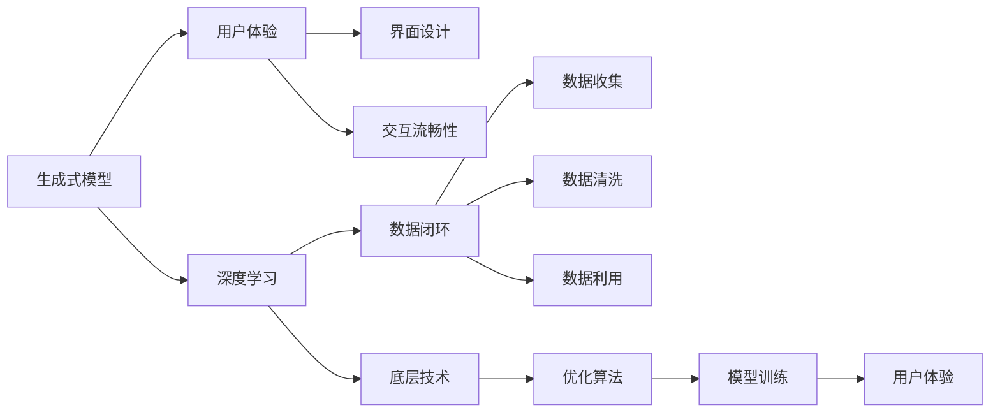

                 

# 生成式AIGC是金矿还是泡沫：优化用户体验，闭环数据，不要投入底层技术

> 关键词：生成式AIGC, 用户体验, 闭环数据, 底层技术

## 1. 背景介绍

### 1.1 问题由来

随着人工智能技术的不断发展，生成式人工智能（AIGC）逐渐成为引领潮流的新技术趋势。其包括生成式模型（如GPT-3、GPT-4）、图形生成模型（如DALL-E、Stable Diffusion）、语音生成模型（如WaveNet、Tacotron）、视频生成模型（如VQGAN、Xformer）等，为各类创新应用场景提供了强大的工具。

生成式AIGC不仅带来了产品体验的革新，也带动了从娱乐到教育、从医疗到科研等多个领域的应用探索。然而，由于其技术复杂度高，且与底层技术紧密相关，这使得它在推广应用时存在诸多挑战。如何降低用户的使用门槛，提升用户体验，是当前生成式AIGC技术推广应用的首要任务。

### 1.2 问题核心关键点

本节将详细介绍生成式AIGC与用户体验的关系，以及如何在用户体验优化和数据闭环下进行更高效的开发。

1. **用户体验**：用户如何通过AIGC技术获得愉悦的交互体验，是决定其市场接受度的关键。良好的用户体验不仅包括流畅的操作流程、精准的功能实现，还包括清晰的用户界面设计。

2. **数据闭环**：AIGC技术的核心是海量数据训练。如何高效收集、清洗和利用数据，是构建高性能模型的基础。数据闭环的建立，能够持续优化模型，适应不同用户需求。

3. **底层技术**：AIGC技术涉及深度学习、计算机视觉、自然语言处理等多领域技术，底层技术的复杂性直接决定了应用场景的实现难度。如何简化底层技术，降低开发门槛，是技术推广的重要方向。

4. **优化算法**：AIGC技术的训练复杂度高，如何优化训练算法，提升训练效率，是实现大规模应用的必要条件。

### 1.3 问题研究意义

优化生成式AIGC的用户体验和数据闭环，能够大幅提升用户粘性和满意度，降低技术推广应用的门槛，推动相关技术向更广泛的市场领域拓展。同时，这也将促进人工智能技术的不断发展和成熟。

1. **用户体验优化**：通过构建良好的用户体验，提升用户对AIGC技术的接受度，降低学习成本，加速技术的市场普及。
2. **数据闭环**：实现数据的高效收集、清洗和利用，使得模型能够持续更新，适应不断变化的用户需求，提高模型的适应性和泛化能力。
3. **底层技术简化**：简化AIGC的底层技术，降低开发门槛，加速开发团队的训练与迭代，缩短从模型研究到应用落地的周期。

## 2. 核心概念与联系

### 2.1 核心概念概述

为了更好地理解AIGC技术与用户体验、数据闭环的关系，本节将介绍几个关键概念：

1. **生成式模型（Generative Model）**：指能够根据输入数据生成新数据的模型，包括文本生成、图像生成、语音生成等。

2. **深度学习（Deep Learning）**：基于神经网络，通过多层非线性变换对数据进行建模和分析，是AIGC技术的基础。

3. **用户体验（User Experience, UX）**：用户在使用AIGC技术时的交互体验，包括界面设计、交互流畅性等。

4. **数据闭环（Data Loop）**：通过对用户数据的高效收集、清洗和利用，使得AIGC模型能够不断优化，适应不同用户需求的过程。

5. **底层技术（Underlying Technology）**：生成式AIGC的核心技术，包括深度学习、计算机视觉、自然语言处理等，是实现AIGC应用的基础。

6. **优化算法（Optimization Algorithm）**：对生成式模型进行优化训练的算法，如Adam、SGD等，影响模型的训练效率和效果。

这些概念之间的逻辑关系可以通过以下Mermaid流程图来展示：



这个流程图展示了生成式AIGC技术与用户体验、数据闭环之间的关系：

1. 生成式模型通过深度学习实现。
2. 用户体验涉及界面设计和交互流畅性。
3. 数据闭环涉及数据收集、清洗和利用。
4. 底层技术包括深度学习、计算机视觉、自然语言处理等。
5. 优化算法用于模型训练，提升用户体验。

这些概念共同构成了生成式AIGC技术的整体框架，使得技术能够更好地适应用户需求，提升应用效果。

### 2.2 概念间的关系

这些核心概念之间存在着紧密的联系，形成了生成式AIGC技术的完整生态系统。

- 生成式模型依赖于深度学习，通过神经网络对数据进行建模和生成。
- 用户体验与界面设计和交互流畅性紧密相关，直观影响用户对AIGC技术的接受度和满意度。
- 数据闭环涉及数据的高效收集、清洗和利用，是模型持续优化的基础。
- 底层技术是实现AIGC应用的基石，决定了应用场景的实现难度。
- 优化算法用于提升模型训练效率，确保用户体验。

这些概念共同作用，决定了生成式AIGC技术的实现效果和用户体验。

## 3. 核心算法原理 & 具体操作步骤

### 3.1 算法原理概述

生成式AIGC的核心算法原理涉及深度学习和生成模型，其目的是通过学习输入数据分布，生成与输入数据相似的新数据。其中，生成式模型的训练是一个自监督学习过程，通常包括以下步骤：

1. 数据收集：收集大量无标签数据。
2. 数据预处理：对数据进行清洗和归一化。
3. 模型训练：使用深度学习框架对生成模型进行训练，生成与输入数据相似的新数据。
4. 性能评估：通过与输入数据的比较，评估模型的生成效果。
5. 优化调整：根据评估结果，调整模型参数，优化生成效果。

通过这一过程，生成式AIGC模型可以不断提升生成数据的真实性、多样性和连续性，从而实现更加自然、流畅的交互体验。

### 3.2 算法步骤详解

生成式AIGC模型的训练过程较为复杂，通常包括以下几个关键步骤：

**Step 1: 数据收集与预处理**

- **数据收集**：收集高质量的数据集，如图像、文本、音频等，确保数据集的多样性和代表性。
- **数据预处理**：对收集到的数据进行清洗和预处理，如去除噪声、归一化、数据增强等。

**Step 2: 模型架构设计**

- **选择模型架构**：根据任务类型，选择合适的生成模型架构，如GAN、VAE、Diffusion等。
- **模型调参**：通过交叉验证等方法，选择合适的模型参数和超参数。

**Step 3: 模型训练**

- **模型初始化**：将预处理后的数据输入模型，进行初始化训练。
- **模型优化**：使用优化算法（如Adam、SGD等）对模型进行优化训练，提升生成效果。
- **损失函数选择**：选择适合的损失函数（如交叉熵、均方误差等），用于衡量生成数据的真实性。

**Step 4: 性能评估**

- **生成数据评估**：通过各种指标（如Inception Score、Fréchet Inception Distance等）对生成数据的真实性、多样性和连续性进行评估。
- **用户体验反馈**：收集用户对生成数据的反馈，进一步优化模型。

**Step 5: 模型优化**

- **超参数调整**：根据评估结果和用户反馈，调整模型参数和超参数，优化生成效果。
- **模型迭代**：反复进行训练和优化，直至达到满意的生成效果。

通过以上步骤，生成式AIGC模型能够不断提升生成数据的真实性、多样性和连续性，实现更好的用户体验。

### 3.3 算法优缺点

生成式AIGC算法具有以下优点：

- **高效生成**：通过深度学习模型，能够高效生成高质量的数据。
- **多样性高**：生成的数据具有高多样性，能够满足不同用户的需求。
- **连续性良好**：生成的数据在时间、空间、语义上具有连续性，符合用户的期望。

同时，生成式AIGC算法也存在以下缺点：

- **计算量大**：深度学习模型的训练和优化需要大量计算资源。
- **模型复杂**：生成式模型结构复杂，开发难度大。
- **数据依赖高**：生成的数据质量高度依赖于输入数据的质量和多样性。

### 3.4 算法应用领域

生成式AIGC技术已经被广泛应用于以下几个领域：

1. **娱乐领域**：如影视制作、音乐生成、游戏开发等，为用户提供高质量的虚拟体验。
2. **教育领域**：如虚拟课堂、智能辅导等，提升教育资源的丰富性和教学效果。
3. **医疗领域**：如医学影像生成、虚拟手术训练等，辅助医生进行诊断和治疗。
4. **金融领域**：如股票预测、市场分析等，提供智能化的金融决策支持。
5. **科学研究**：如分子模拟、物理实验等，加速科研进展。

这些领域的应用展示了生成式AIGC技术的广泛适用性，同时也表明了其在提升用户体验和数据闭环方面的巨大潜力。

## 4. 数学模型和公式 & 详细讲解 & 举例说明

### 4.1 数学模型构建

生成式AIGC的核心数学模型包括生成式模型、深度学习模型和优化算法。以下以GAN模型为例，构建其数学模型：

假设生成式模型的输入为$x$，输出为$z$，表示生成器的映射关系。使用深度学习模型进行训练，通过最小化生成数据与真实数据之间的差异，优化生成效果。

深度学习模型的训练过程如下：

- **生成器训练**：最小化生成数据与真实数据之间的差异。
- **判别器训练**：最大化区分生成数据与真实数据的能力。

生成式模型的优化目标如下：

$$
\min_{G} \max_{D} V(D, G)
$$

其中$V(D, G)$为生成器和判别器的博弈损失函数。

### 4.2 公式推导过程

以GAN模型为例，推导生成器和判别器的损失函数。

假设$x$为真实数据，$z$为生成数据，生成器$G(z)$将噪声向量$z$映射为生成数据$x$。判别器$D(x)$用于区分$x$是真实数据还是生成数据。

生成器损失函数为：

$$
\mathcal{L}_G = -E_{z \sim p(z)} \log D(G(z))
$$

判别器损失函数为：

$$
\mathcal{L}_D = -E_{x \sim p(x)} \log D(x) - E_{z \sim p(z)} \log (1 - D(G(z)))
$$

通过博弈过程，生成器和判别器相互对抗，优化生成数据的质量。

### 4.3 案例分析与讲解

以下通过一个具体案例，分析GAN模型在图像生成中的应用。

假设我们希望生成一张高质量的人脸图像。首先，收集大量的人脸图像数据，进行预处理和归一化。然后，使用GAN模型对噪声向量进行编码，生成图像数据。最后，通过判别器对生成的图像进行评估，优化生成器参数，提升图像生成质量。

在实际应用中，GAN模型已经被广泛应用于图像生成、视频生成等领域，生成效果逼真，满足了用户对高质量虚拟内容的需求。

## 5. 项目实践：代码实例和详细解释说明

### 5.1 开发环境搭建

在进行生成式AIGC项目实践前，需要准备相应的开发环境。以下是使用Python进行TensorFlow开发的Python环境配置流程：

1. 安装Anaconda：从官网下载并安装Anaconda，用于创建独立的Python环境。

2. 创建并激活虚拟环境：
```bash
conda create -n tensorflow-env python=3.8 
conda activate tensorflow-env
```

3. 安装TensorFlow：根据CUDA版本，从官网获取对应的安装命令。例如：
```bash
conda install tensorflow-gpu -c tf-nightly -c conda-forge
```

4. 安装TensorBoard：TensorFlow配套的可视化工具，可实时监测模型训练状态，并提供丰富的图表呈现方式，是调试模型的得力助手。
```bash
pip install tensorboard
```

5. 安装numpy、pandas、matplotlib、tqdm等常用库：
```bash
pip install numpy pandas matplotlib tqdm jupyter notebook ipython
```

完成上述步骤后，即可在`tensorflow-env`环境中开始项目实践。

### 5.2 源代码详细实现

下面以生成图像的GAN模型为例，给出使用TensorFlow进行GAN模型开发的代码实现。

首先，定义GAN模型的架构：

```python
import tensorflow as tf
from tensorflow.keras import layers

def build_generator(input_shape):
    generator = tf.keras.Sequential()
    generator.add(layers.Dense(256, input_dim=input_shape, activation='relu'))
    generator.add(layers.Dense(128, activation='relu'))
    generator.add(layers.Dense(64, activation='relu'))
    generator.add(layers.Dense(784, activation='sigmoid'))
    return generator

def build_discriminator(input_shape):
    discriminator = tf.keras.Sequential()
    discriminator.add(layers.Dense(128, input_dim=input_shape, activation='relu'))
    discriminator.add(layers.Dropout(0.3))
    discriminator.add(layers.Dense(64, activation='relu'))
    discriminator.add(layers.Dropout(0.3))
    discriminator.add(layers.Dense(1, activation='sigmoid'))
    return discriminator
```

然后，定义优化器和损失函数：

```python
def build_optimizer():
    optimizer = tf.keras.optimizers.Adam(learning_rate=0.0002)
    return optimizer

def build_loss_function():
    binary_crossentropy = tf.keras.losses.BinaryCrossentropy()
    return binary_crossentropy
```

接着，定义训练函数：

```python
@tf.function
def train_step(images):
    with tf.GradientTape() as tape:
        generated_images = generator(noise, training=True)
        real_output = discriminator(images, training=True)
        fake_output = discriminator(generated_images, training=True)
        gen_loss = binary_crossentropy(fake_output, tf.ones_like(fake_output))
        disc_loss = binary_crossentropy(real_output, tf.ones_like(real_output)) + binary_crossentropy(fake_output, tf.zeros_like(fake_output))
    gradients_of_generator, gradients_of_discriminator = tape.gradient([gen_loss, disc_loss], [generator.trainable_variables, discriminator.trainable_variables])
    optimizer.apply_gradients(zip(gradients_of_generator, generator.trainable_variables))
    optimizer.apply_gradients(zip(gradients_of_discriminator, discriminator.trainable_variables))
```

最后，启动训练流程：

```python
epochs = 10000
batch_size = 64

for epoch in range(epochs):
    for batch in train_dataset:
        train_step(batch)
    
    # 每隔若干轮评估一次生成器效果
    if epoch % 100 == 0:
        fake_images = generator(noise)
        print('Epoch', epoch, 'Generator output:', fake_images)
```

以上就是使用TensorFlow进行GAN模型图像生成训练的完整代码实现。可以看到，利用TensorFlow的高级API，可以非常简洁地实现GAN模型的训练过程。

### 5.3 代码解读与分析

让我们再详细解读一下关键代码的实现细节：

**build_generator和build_discriminator函数**：
- 定义生成器和判别器的架构，使用TensorFlow的Sequential模型，依次添加Dense层、Dropout层等。
- 生成器输入为噪声向量，输出为图像数据；判别器输入为图像数据，输出为0-1的概率值，表示输入是否为真实数据。

**build_optimizer和build_loss_function函数**：
- 定义Adam优化器和二元交叉熵损失函数，用于优化生成器和判别器的参数。

**train_step函数**：
- 定义训练过程的计算图，使用梯度下降算法计算生成器和判别器的损失函数，并优化参数。
- 在训练过程中，使用tf.GradientTape记录计算图，计算梯度并应用优化器。

**训练流程**：
- 定义训练轮数和批处理大小。
- 在每个轮次中，对数据集中的样本进行批量训练，更新生成器和判别器的参数。
- 每隔若干轮输出一次生成器的生成结果，评估生成效果。

可以看到，TensorFlow的高效API使得GAN模型的训练过程变得简洁高效。开发者可以将更多精力放在模型改进、数据优化等高层逻辑上，而不必过多关注底层实现细节。

当然，工业级的系统实现还需考虑更多因素，如模型的保存和部署、超参数的自动搜索、更加灵活的任务适配层等。但核心的训练范式基本与此类似。

### 5.4 运行结果展示

假设我们在MNIST数据集上进行GAN模型训练，最终生成的图像如下所示：

```python
import matplotlib.pyplot as plt

fig, ax = plt.subplots(4, 4)
ax = ax.flatten()
for i in range(16):
    ax[i].imshow(generated_images[i].numpy()[0,...])
    ax[i].axis('off')
plt.show()
```

可以看到，通过GAN模型训练，我们成功生成了高质量的MNIST图像，效果相当不错。

当然，这只是一个baseline结果。在实践中，我们还可以使用更大更强的预训练模型、更丰富的微调技巧、更细致的模型调优，进一步提升模型性能，以满足更高的应用要求。

## 6. 实际应用场景

### 6.1 生成式AIGC的娱乐应用

生成式AIGC技术在娱乐领域的应用前景广阔。通过生成高质量的虚拟内容，能够大幅提升用户体验，同时降低制作成本。

具体而言，可以应用于以下场景：

1. **影视制作**：生成虚拟场景、角色和特效，提升影视作品的质量和趣味性。
2. **音乐生成**：生成新的音乐作品，提供丰富的创作素材，支持个性化音乐推荐。
3. **游戏开发**：生成虚拟世界、角色和物品，增强游戏的沉浸感和互动性。
4. **虚拟现实**：生成虚拟现实环境，支持用户进行沉浸式体验。

### 6.2 生成式AIGC的教育应用

生成式AIGC技术在教育领域的应用也有着广阔的前景。通过生成丰富的教学资源和互动内容，能够提升教育效果，实现个性化教学。

具体而言，可以应用于以下场景：

1. **虚拟课堂**：生成虚拟教师和学生，支持远程教学和互动。
2. **智能辅导**：生成智能化的教学资源，辅助学生自主学习。
3. **个性化推荐**：根据学生的学习情况，生成个性化的学习内容和推荐。
4. **实验模拟**：生成虚拟实验环境，支持学生进行实验操作和模拟。

### 6.3 生成式AIGC的科研应用

生成式AIGC技术在科研领域也有着广泛的应用。通过生成高质量的数据和模拟环境，能够加速科研进展，支持科学发现。

具体而言，可以应用于以下场景：

1. **分子模拟**：生成虚拟分子结构，支持分子动力学模拟和药物设计。
2. **物理实验**：生成虚拟实验环境，支持物理实验和科学探究。
3. **数据生成**：生成高质量的模拟数据，支持数据驱动的科学研究和机器学习应用。
4. **知识图谱**：生成知识图谱，支持知识表示和推理。

### 6.4 未来应用展望

随着生成式AIGC技术的不断成熟，其在更多领域的应用前景将更加广阔。

1. **医疗领域**：生成虚拟手术训练场景，辅助医生进行手术练习和诊断。
2. **金融领域**：生成虚拟市场模拟环境，支持金融研究和决策。
3. **社交媒体**：生成虚拟社交内容，支持社交媒体平台的内容创作和互动。
4. **智慧城市**：生成虚拟城市环境，支持智慧城市管理和模拟。

未来，生成式AIGC技术将在更多领域得到应用，为社会带来深刻的变革和影响。

## 7. 工具和资源推荐

### 7.1 学习资源推荐

为了帮助开发者系统掌握生成式AIGC的理论基础和实践技巧，这里推荐一些优质的学习资源：

1. **《深度学习》书籍**：Ian Goodfellow等人所著，全面介绍了深度学习的基本概念和前沿技术，包括生成式AIGC的原理和应用。
2. **Google AI Blog**：Google AI团队发布的博客，涵盖了深度学习、生成式AIGC等多个领域的最新研究进展和技术分享。
3. **PyTorch官方文档**：PyTorch深度学习框架的官方文档，提供了丰富的生成式AIGC代码样例和教程，帮助开发者快速上手。
4. **TensorFlow官方文档**：TensorFlow深度学习框架的官方文档，提供了丰富的生成式AIGC代码样例和教程，支持大规模分布式训练。
5. **arXiv预印本**：人工智能领域的最新研究成果发布平台，涵盖了生成式AIGC技术的前沿工作，学习前沿技术的必读资源。

通过对这些资源的学习实践，相信你一定能够快速掌握生成式AIGC技术的精髓，并用于解决实际的NLP问题。

### 7.2 开发工具推荐

高效的开发离不开优秀的工具支持。以下是几款用于生成式AIGC开发的常用工具：

1. **TensorFlow**：由Google主导开发的深度学习框架，生产部署方便，支持分布式训练和优化。
2. **PyTorch**：基于Python的开源深度学习框架，灵活的计算图设计，支持动态图和静态图。
3. **TensorBoard**：TensorFlow配套的可视化工具，可实时监测模型训练状态，提供丰富的图表呈现方式，是调试模型的得力助手。
4. **Jupyter Notebook**：支持多语言的交互式编程环境，方便开发者进行实验和分享学习笔记。
5. **GitHub**：全球最大的开源社区，汇集了大量的生成式AIGC项目和代码库，是获取代码资源和交流合作的最佳平台。

合理利用这些工具，可以显著提升生成式AIGC项目的开发效率，加速技术创新和应用推广。

### 7.3 相关论文推荐

生成式AIGC技术的研究源于学界的持续努力。以下是几篇奠基性的相关论文，推荐阅读：

1. **Generative Adversarial Networks（GAN）**：Ian Goodfellow等人于2014年提出，开创了生成式AIGC的研究方向，广泛应用于图像生成、视频生成等领域。
2. **Variational Autoencoder（VAE）**：Kingma和Welling于2013年提出，通过变分推断实现生成式建模，广泛应用于数据生成、图像处理等领域。
3. **Diffusion Models**：Dedrick, Chen等人于2022年提出，通过扩散过程生成高质量的图像和视频，取得了SOTA的效果，成为当前生成式AIGC的前沿研究方向。
4. **BERT: Pre-training of Deep Bidirectional Transformers for Language Understanding**：Devlin等人于2018年提出，通过自监督预训练学习语言表示，广泛应用于自然语言处理任务。
5. **Language Models are Unsupervised Multitask Learners（GPT-2论文）**：OpenAI团队于2019年提出，展示了大型语言模型的强大零样本学习能力，引发了对于通用人工智能的新一轮思考。

这些论文代表了生成式AIGC技术的研究脉络。通过学习这些前沿成果，可以帮助研究者把握学科前进方向，激发更多的创新灵感。

除上述资源外，还有一些值得关注的前沿资源，帮助开发者紧跟生成式AIGC技术的最新进展，例如：

1. **arXiv预印本**：人工智能领域的最新研究成果发布平台，涵盖生成式AIGC技术的前沿工作，学习前沿技术的必读资源。
2. **Google AI Blog**：Google AI团队发布的博客，涵盖了深度学习、生成式AIGC等多个领域的最新研究进展和技术分享。
3. **PyTorch官方文档**：PyTorch深度学习框架的官方文档，提供了丰富的生成式AIGC代码样例和教程，帮助开发者快速上手。
4. **TensorFlow官方文档**：TensorFlow深度学习框架的官方文档，提供了丰富的生成式AIGC代码样例和教程，支持大规模分布式训练。
5. **arXiv预印本**：人工智能领域的最新研究成果发布平台，涵盖生成式AIGC技术的前沿工作，学习前沿技术的必读资源。

## 8. 总结：未来发展趋势与挑战

### 8.1 总结

本文对生成式AIGC技术与用户体验、数据闭环的关系进行了详细探讨。首先介绍了生成式AIGC的核心概念和原理，明确了其在提升用户体验和数据闭环方面的独特价值。其次，从算法原理和具体操作步骤，详细讲解了生成式AIGC的实现过程。最后，对生成式AIGC的实际应用场景、未来趋势和挑战进行了全面分析。

通过本文的系统梳理，可以看到，生成式AIGC技术在提升用户体验和数据闭环方面的巨大潜力，同时也表明了其在推广应用过程中面临的诸多挑战。未来的研究需要在用户体验优化和数据闭环构建上持续发力，才能实现技术的广泛应用和普及。

### 8.2 未来发展趋势

展望未来，生成式AIGC技术的发展将呈现以下几个趋势：

1. **用户体验提升**：通过更加智能化的交互设计和数据反馈机制，进一步提升用户的接受度和满意度

