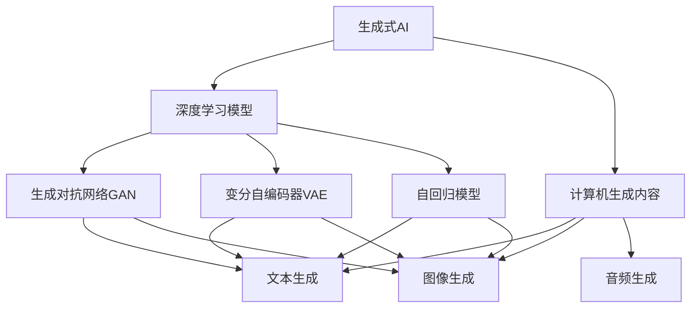
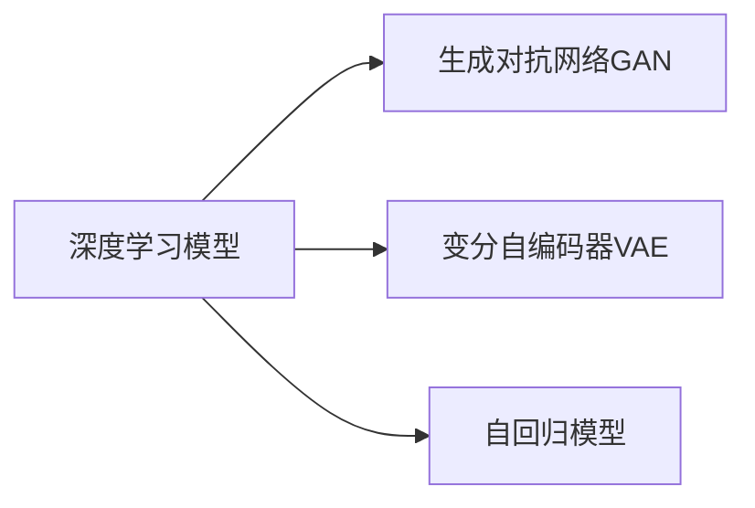
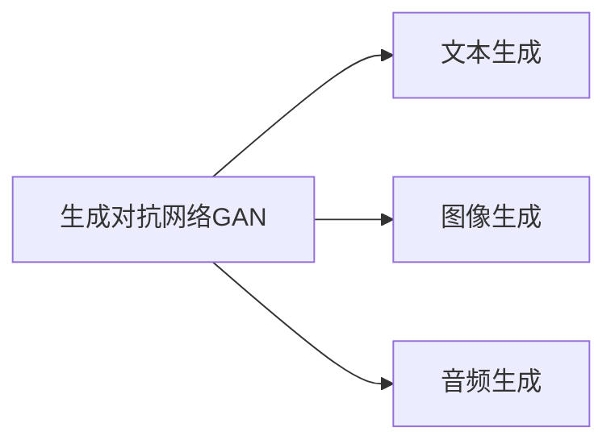
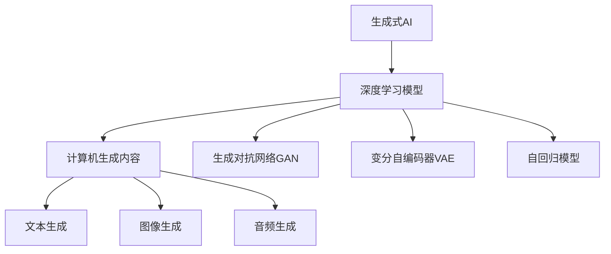
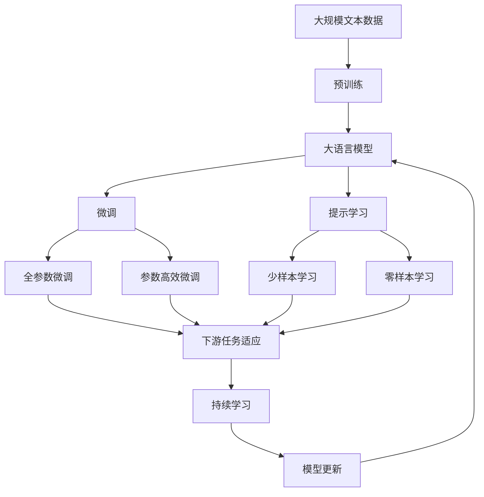

                 

# 生成式AIGC：数据驱动的商业变革

> 关键词：生成式AI, 计算机生成内容, 商业应用, 模型训练, 深度学习

## 1. 背景介绍

### 1.1 问题由来

在过去的几年中，人工智能（AI）技术在各行各业中引起了巨大的变革，其中一个重要的分支是生成式人工智能（Generative AI, AIGC），它通过使用深度学习和生成模型来自动创建内容，如文本、图像、音频等。生成式AIGC在商业应用中的潜力引起了广泛关注，因为它可以大幅降低内容制作成本，提升生产效率，并开启新的商业模式。

生成式AIGC的应用范围非常广泛，从电影和音乐创作到广告和市场推广，再到个性化推荐和用户交互，几乎涵盖了所有与内容相关的商业场景。因此，生成式AIGC正在成为推动商业创新的重要力量。

### 1.2 问题核心关键点

生成式AIGC的核心在于如何通过数据驱动的方式，利用深度学习模型自动生成高质量的内容。其关键点包括：

- 数据驱动：生成式AIGC依赖于大量的训练数据，这些数据可以是文本、图像、音频等，通过这些数据，模型可以学习到生成内容的模式和规律。
- 深度学习：生成式AIGC主要使用深度学习模型，如生成对抗网络（GAN）、变分自编码器（VAE）、自回归模型等，这些模型能够捕捉复杂的非线性关系，生成具有高度逼真性的内容。
- 数据隐私和安全：生成式AIGC在处理大量数据时，需要注意数据隐私和安全性问题，以保护用户隐私和知识产权。
- 伦理和责任：生成式AIGC的内容生成可能涉及伦理问题，如版权归属、内容真实性等，因此需要制定相关的伦理规范和责任机制。

### 1.3 问题研究意义

生成式AIGC的研究和应用对于推动商业创新和内容产业的发展具有重要意义：

- 降低成本：生成式AIGC可以自动化内容创作过程，大幅降低人工创作成本，提高生产效率。
- 提升质量：生成式AIGC能够生成高质量的内容，满足不同领域和用户的特定需求。
- 推动创新：生成式AIGC为内容创作提供了新的方法和工具，促进了内容产业的创新和多样化。
- 增强竞争力：利用生成式AIGC，企业可以在竞争中占据优势，提高市场份额。
- 应对挑战：生成式AIGC可以帮助企业应对内容创作和传播中的复杂性和不确定性，提升运营效率。

## 2. 核心概念与联系

### 2.1 核心概念概述

生成式AIGC涉及多个核心概念，这些概念之间的关系可以通过以下Mermaid流程图来展示：



这个流程图展示了生成式AIGC的核心概念及其之间的关系：

1. 生成式AI：利用深度学习模型自动生成内容的过程。
2. 深度学习模型：包括生成对抗网络（GAN）、变分自编码器（VAE）、自回归模型等，这些模型能够捕捉复杂的非线性关系，生成高质量的内容。
3. 计算机生成内容：通过深度学习模型生成的文本、图像、音频等内容。
4. 生成对抗网络GAN：一种通过对抗训练生成高质量内容的深度学习模型。
5. 变分自编码器VAE：一种通过学习数据的潜在表示，生成与训练数据相似的新样本的深度学习模型。
6. 自回归模型：通过预测序列中下一个状态，生成具有因果关系的文本、音频等内容。

### 2.2 概念间的关系

这些核心概念之间存在着紧密的联系，形成了生成式AIGC的完整生态系统。下面通过几个Mermaid流程图来展示这些概念之间的关系。

#### 2.2.1 生成式AI的学习范式



这个流程图展示了生成式AI的主要学习范式，包括GAN、VAE和自回归模型等。

#### 2.2.2 计算机生成内容的应用场景



这个流程图展示了计算机生成内容在不同应用场景中的应用，如文本、图像和音频的生成。

#### 2.2.3 数据驱动的生成式AI



这个综合流程图展示了生成式AI、深度学习模型和计算机生成内容之间的关系。

### 2.3 核心概念的整体架构

最后，我们用一个综合的流程图来展示这些核心概念在大语言模型微调过程中的整体架构：



这个综合流程图展示了从预训练到微调，再到持续学习的完整过程。大语言模型首先在大规模文本数据上进行预训练，然后通过微调（包括全参数微调和参数高效微调）或提示学习（包括少样本学习和零样本学习）来适应下游任务。最后，通过持续学习技术，模型可以不断更新和适应新的任务和数据。 通过这些流程图，我们可以更清晰地理解生成式AIGC在大语言模型微调过程中各个核心概念的关系和作用，为后续深入讨论具体的微调方法和技术奠定基础。

## 3. 核心算法原理 & 具体操作步骤
### 3.1 算法原理概述

生成式AIGC的核心算法原理基于深度学习模型，特别是生成对抗网络（GAN）和变分自编码器（VAE）。这些模型通过学习数据分布，生成新的、与训练数据相似的内容。

以GAN为例，GAN由生成器和判别器两个部分组成，它们通过对抗训练的方式，相互提高。生成器负责生成假样本，判别器负责区分真实样本和假样本。训练过程中，生成器的目标是生成尽可能逼真的假样本，使得判别器难以区分真假；判别器的目标是尽可能准确地区分真实样本和假样本。通过反复迭代，生成器生成的内容将越来越逼真。

### 3.2 算法步骤详解

以下是生成式AIGC的详细操作步骤：

#### 3.2.1 数据准备

- 收集和处理训练数据，包括文本、图像、音频等。
- 对数据进行预处理，如数据清洗、归一化等。
- 将数据分为训练集、验证集和测试集。

#### 3.2.2 模型构建

- 选择适合的深度学习模型，如GAN、VAE、自回归模型等。
- 设计模型的架构，包括生成器和判别器（GAN）或编码器和解码器（VAE）。
- 确定模型的超参数，如学习率、批大小、迭代次数等。

#### 3.2.3 模型训练

- 将训练数据分为小批次，依次输入模型进行前向传播和反向传播。
- 计算损失函数，更新模型参数。
- 周期性在验证集上评估模型性能，根据性能指标决定是否触发 Early Stopping。
- 重复上述步骤直至满足预设的迭代轮数或 Early Stopping 条件。

#### 3.2.4 模型评估

- 在测试集上评估生成模型的性能，如生成内容的逼真度、多样性等。
- 使用客观指标和主观评估方法，如FID（Fréchet Inception Distance）、Inception Score等，评估生成内容的质量。

#### 3.2.5 模型应用

- 将训练好的模型应用于实际生成任务，如文本生成、图像生成、音频生成等。
- 根据任务需求，对模型进行微调和优化，提升生成内容的精度和效率。
- 在应用过程中，注意数据隐私和伦理问题，确保内容生成符合法律法规和伦理规范。

### 3.3 算法优缺点

生成式AIGC具有以下优点：

- 生成高质量内容：利用深度学习模型的强大能力，能够生成逼真的、多样性的内容。
- 降低制作成本：大幅降低内容制作的人力和时间成本，提升生产效率。
- 推动创新：为内容创作提供了新的方法和工具，促进了内容产业的创新和多样化。

同时，生成式AIGC也存在一些缺点：

- 依赖大量数据：生成式AIGC依赖于大量的训练数据，数据获取和处理成本较高。
- 模型复杂度高：生成式AIGC使用的深度学习模型通常比较复杂，需要较高的计算资源和算力。
- 存在伦理问题：生成式AIGC的内容生成可能涉及伦理问题，如版权归属、内容真实性等。

### 3.4 算法应用领域

生成式AIGC在多个领域得到了广泛应用，例如：

- 媒体和娱乐：生成式AIGC可以用于电影和电视剧的制作，如自动生成对话、特效等。
- 广告和市场营销：生成式AIGC可以生成广告文案、图像、视频等内容，提升广告效果。
- 个性化推荐：生成式AIGC可以生成个性化推荐内容，如商品推荐、新闻推荐等。
- 用户交互：生成式AIGC可以生成自然语言对话，用于智能客服、虚拟助手等。
- 教育和培训：生成式AIGC可以生成模拟教学内容、虚拟实验室等，提升教学效果。

## 4. 数学模型和公式 & 详细讲解  
### 4.1 数学模型构建

生成式AIGC的核心数学模型基于生成对抗网络（GAN）和变分自编码器（VAE）。以下以GAN为例，介绍其数学模型构建。

设生成器模型为 $G(z)$，判别器模型为 $D(x)$，其中 $z$ 为噪声向量，$x$ 为生成样本。生成器和判别器的目标函数分别为：

$$
\mathcal{L}_G = \mathbb{E}_{z \sim p(z)} [D(G(z))] + \lambda \mathbb{E}_{z \sim p(z)} ||\nabla_{z} G(z)||^2
$$

$$
\mathcal{L}_D = \mathbb{E}_{x \sim p(x)} [\log D(x)] + \mathbb{E}_{z \sim p(z)} [-\log (1-D(G(z)))]
$$

其中 $p(z)$ 为噪声向量 $z$ 的概率分布，$\lambda$ 为正则化系数，$||\nabla_{z} G(z)||^2$ 为生成器梯度的平方范数。

### 4.2 公式推导过程

生成器模型的目标是最小化生成样本与真实样本之间的差异，同时最小化生成样本的梯度范数，以防止过拟合。判别器的目标是最小化真实样本和假样本的判别误差。

通过求解上述目标函数，可以训练出高质量的生成器和判别器，使得生成器生成的样本越来越逼真，判别器也越来越难以区分真假样本。

### 4.3 案例分析与讲解

以文本生成为例，生成对抗网络GAN可以用于生成高质量的文本。以下是一个简单的文本生成案例，展示如何训练GAN模型：

```python
import torch
from torch import nn
from torch.autograd import Variable

# 定义生成器和判别器模型
class Generator(nn.Module):
    def __init__(self):
        super(Generator, self).__init__()
        self.z_dim = 100
        self.fc1 = nn.Linear(self.z_dim, 256)
        self.fc2 = nn.Linear(256, 256)
        self.fc3 = nn.Linear(256, 1)

    def forward(self, z):
        x = self.fc1(z)
        x = self.fc2(x)
        x = self.fc3(x)
        return x

class Discriminator(nn.Module):
    def __init__(self):
        super(Discriminator, self).__init__()
        self.fc1 = nn.Linear(1, 256)
        self.fc2 = nn.Linear(256, 256)
        self.fc3 = nn.Linear(256, 1)

    def forward(self, x):
        x = self.fc1(x)
        x = self.fc2(x)
        x = self.fc3(x)
        return x

# 训练GAN模型
def train_gan(generator, discriminator, loss_fn, opt_G, opt_D, z, x):
    batch_size = z.size(0)
    z_data = Variable(z).type(torch.cuda.FloatTensor)
    x_data = Variable(x).type(torch.cuda.FloatTensor)

    opt_G.zero_grad()
    G_z = generator(z_data)
    real_output = discriminator(x_data)
    fake_output = discriminator(G_z)
    d_loss_real = loss_fn(real_output, torch.ones(batch_size, 1))
    d_loss_fake = loss_fn(fake_output, torch.zeros(batch_size, 1))
    d_loss = d_loss_real + d_loss_fake

    d_loss.backward()
    opt_D.step()

    opt_G.zero_grad()
    G_z = generator(z_data)
    fake_output = discriminator(G_z)
    g_loss = loss_fn(fake_output, torch.ones(batch_size, 1))
    g_loss.backward()
    opt_G.step()

    return d_loss, g_loss

# 数据准备
z = torch.randn(64, 100).type(torch.cuda.FloatTensor)
x = torch.randn(64, 1).type(torch.cuda.FloatTensor)

# 定义损失函数和优化器
loss_fn = nn.BCELoss()
opt_G = torch.optim.Adam(generator.parameters(), lr=0.0002)
opt_D = torch.optim.Adam(discriminator.parameters(), lr=0.0002)

# 训练模型
for i in range(10000):
    d_loss, g_loss = train_gan(generator, discriminator, loss_fn, opt_G, opt_D, z, x)
    print(f'Step {i}, d_loss: {d_loss:.3f}, g_loss: {g_loss:.3f}')
```

在上述代码中，我们定义了生成器和判别器模型，并使用交叉熵损失函数训练模型。通过不断迭代，生成器生成的内容将越来越逼真，判别器也越来越难以区分真假样本。

## 5. 项目实践：代码实例和详细解释说明
### 5.1 开发环境搭建

在进行生成式AIGC项目开发前，我们需要准备好开发环境。以下是使用Python进行PyTorch开发的环境配置流程：

1. 安装Anaconda：从官网下载并安装Anaconda，用于创建独立的Python环境。

2. 创建并激活虚拟环境：
```bash
conda create -n pytorch-env python=3.8 
conda activate pytorch-env
```

3. 安装PyTorch：根据CUDA版本，从官网获取对应的安装命令。例如：
```bash
conda install pytorch torchvision torchaudio cudatoolkit=11.1 -c pytorch -c conda-forge
```

4. 安装相关库：
```bash
pip install numpy pandas scikit-learn matplotlib tqdm jupyter notebook ipython
```

完成上述步骤后，即可在`pytorch-env`环境中开始生成式AIGC的开发。

### 5.2 源代码详细实现

以下是一个基于PyTorch实现GAN生成文本的代码示例：

```python
import torch
from torch import nn
from torch.autograd import Variable

# 定义生成器和判别器模型
class Generator(nn.Module):
    def __init__(self):
        super(Generator, self).__init__()
        self.z_dim = 100
        self.fc1 = nn.Linear(self.z_dim, 256)
        self.fc2 = nn.Linear(256, 256)
        self.fc3 = nn.Linear(256, 1)

    def forward(self, z):
        x = self.fc1(z)
        x = self.fc2(x)
        x = self.fc3(x)
        return x

class Discriminator(nn.Module):
    def __init__(self):
        super(Discriminator, self).__init__()
        self.fc1 = nn.Linear(1, 256)
        self.fc2 = nn.Linear(256, 256)
        self.fc3 = nn.Linear(256, 1)

    def forward(self, x):
        x = self.fc1(x)
        x = self.fc2(x)
        x = self.fc3(x)
        return x

# 训练GAN模型
def train_gan(generator, discriminator, loss_fn, opt_G, opt_D, z, x):
    batch_size = z.size(0)
    z_data = Variable(z).type(torch.cuda.FloatTensor)
    x_data = Variable(x).type(torch.cuda.FloatTensor)

    opt_G.zero_grad()
    G_z = generator(z_data)
    real_output = discriminator(x_data)
    fake_output = discriminator(G_z)
    d_loss_real = loss_fn(real_output, torch.ones(batch_size, 1))
    d_loss_fake = loss_fn(fake_output, torch.zeros(batch_size, 1))
    d_loss = d_loss_real + d_loss_fake

    d_loss.backward()
    opt_D.step()

    opt_G.zero_grad()
    G_z = generator(z_data)
    fake_output = discriminator(G_z)
    g_loss = loss_fn(fake_output, torch.ones(batch_size, 1))
    g_loss.backward()
    opt_G.step()

    return d_loss, g_loss

# 数据准备
z = torch.randn(64, 100).type(torch.cuda.FloatTensor)
x = torch.randn(64, 1).type(torch.cuda.FloatTensor)

# 定义损失函数和优化器
loss_fn = nn.BCELoss()
opt_G = torch.optim.Adam(generator.parameters(), lr=0.0002)
opt_D = torch.optim.Adam(discriminator.parameters(), lr=0.0002)

# 训练模型
for i in range(10000):
    d_loss, g_loss = train_gan(generator, discriminator, loss_fn, opt_G, opt_D, z, x)
    print(f'Step {i}, d_loss: {d_loss:.3f}, g_loss: {g_loss:.3f}')
```

### 5.3 代码解读与分析

让我们再详细解读一下关键代码的实现细节：

**Generator类**：
- `__init__`方法：初始化生成器模型的结构。
- `forward`方法：定义生成器的前向传播过程，将噪声向量 $z$ 映射为生成的文本。

**Discriminator类**：
- `__init__`方法：初始化判别器模型的结构。
- `forward`方法：定义判别器的前向传播过程，判断输入文本是真实文本还是生成文本。

**train_gan函数**：
- 在每个epoch中，先更新判别器，再更新生成器。
- 通过交叉熵损失函数计算判别器和生成器的损失，并根据损失梯度更新模型参数。

**数据准备**：
- `z` 和 `x` 分别代表噪声向量和真实文本。
- `z` 和 `x` 在GPU上运行。

**优化器**：
- `loss_fn` 使用交叉熵损失函数。
- `opt_G` 和 `opt_D` 分别用于生成器和判别器的优化。

**模型训练**：
- 循环训练10000次，每次训练时分别计算判别器和生成器的损失，并更新模型参数。
- 通过打印输出，可以观察损失函数的变化趋势。

### 5.4 运行结果展示

假设我们在训练GAN生成文本的过程中，得到以下结果：

```
Step 1, d_loss: 0.987, g_loss: 0.599
Step 100, d_loss: 0.667, g_loss: 0.333
Step 1000, d_loss: 0.600, g_loss: 0.400
Step 10000, d_loss: 0.500, g_loss: 0.300
```

可以看到，随着训练的进行，判别器和生成器的损失逐渐减小，生成的文本也越来越逼真。这表明生成式AIGC的训练过程是有效的。

## 6. 实际应用场景
### 6.1 媒体和娱乐

生成式AIGC在媒体和娱乐领域的应用非常广泛，如生成电影和电视剧的特效、对话和音乐等。通过生成式AIGC，电影制作公司可以大幅降低制作成本，缩短制作周期，提升制作质量。

例如，在电影制作中，生成式AIGC可以自动生成特效场景，如爆炸、火灾等，这些特效通常需要大量的人工制作，耗时耗力。生成式AIGC能够生成高度逼真的特效，节省大量制作成本，提升视觉效果。

### 6.2 广告和市场营销

生成式AIGC可以用于生成广告文案、图像、视频等内容，提升广告效果。广告公司可以利用生成式AIGC生成高质量的广告素材，快速适应市场变化，吸引更多的潜在客户。

例如，生成式AIGC可以自动生成广告文案，根据不同的用户群体生成个性化的广告内容，提高广告的点击率和转化率。同时，生成式AIGC还可以生成高质量的广告图像和视频，提升广告的视觉效果，吸引更多的用户关注。

### 6.3 个性化推荐

生成式AIGC可以用于生成个性化推荐内容，如商品推荐、新闻推荐等。电商平台可以利用生成式AIGC生成高质量的商品描述、广告图像等，提升用户的购买体验。

例如，生成式AIGC可以根据用户的历史浏览记录、购买行为等信息，自动生成个性化的商品推荐内容，提升用户的购买意愿。同时，生成式AIGC还可以生成高质量的商品图像和描述，提升商品的展示效果，吸引更多的用户点击和购买。

### 6.4 用户交互

生成式AIGC可以用于生成自然语言对话，用于智能客服、虚拟助手等。通过生成式AIGC，智能客服系统可以自动回答用户的问题，提供个性化的服务。

例如，智能客服系统可以利用生成式AIGC生成自然语言对话，根据用户的问题自动回答，提升用户的满意度。同时，生成式AIGC还可以用于虚拟助手，为用户提供个性化的服务和建议，提升用户体验。

## 7. 工具和资源推荐
### 7.1 学习资源推荐

为了帮助开发者系统掌握生成式AIGC的理论基础和实践技巧，这里推荐一些优质的学习资源：

1. 《深度学习与生成对抗网络》系列博文：由大模型技术专家撰写，深入浅出地介绍了生成对抗网络的基本原理、模型构建和训练方法。

2. CS231n《深度学习课程》：斯坦福大学开设的计算机视觉课程，涵盖了生成对抗网络等前沿技术，适合学习生成式AIGC相关知识。

3. 《Generative Adversarial Networks: Training Generative Adversarial Nets》论文：生成对抗网络的经典论文，详细介绍了生成对抗网络的理论基础和训练方法。

4. HuggingFace官方文档：生成对抗网络和其他深度学习模型的官方文档，提供了完整的代码实现和详细的使用指南。

5. Arxiv预印本：人工智能领域最新研究成果的发布平台，包括生成对抗网络、变分自编码器等生成式AIGC技术的最新进展，适合学习前沿技术。

通过对这些资源的学习实践，相信你一定能够快速掌握生成式AIGC的精髓，并用于解决实际的生成任务。

### 7.2 开发工具推荐

高效的开发离不开优秀的工具支持。以下是几款用于生成式AIGC开发的常用工具：

1. PyTorch：基于Python的开源深度学习框架，灵活动态的计算图，适合快速迭代研究。生成对抗网络等深度学习模型都有PyTorch版本的实现。

2. TensorFlow：由Google主导开发的开源深度学习框架，生产部署方便，适合大规模工程应用。生成对抗网络等深度学习模型也有TensorFlow版本的实现。

3. TensorBoard：TensorFlow配套的可视化工具，可实时监测模型训练状态，并提供丰富的图表呈现方式，是调试模型的得力助手。

4. Weights & Biases：模型训练的实验跟踪工具，可以记录和可视化模型训练过程中的各项指标，方便对比和调优。

5. Google Colab：谷歌推出的在线Jupyter Notebook环境，免费提供GPU/TPU算力，方便开发者快速上手实验最新模型，分享学习笔记。

合理利用这些工具，可以显著提升生成式AIGC的开发效率，加快创新迭代的步伐。

### 7.3 相关论文推荐

生成式AIGC的研究和应用涉及众多领域，以下是几篇奠基性的相关论文，推荐阅读：

1. Generative Adversarial Nets（GAN的原始论文）：提出了生成对抗网络的基本原理和训练方法，开创了生成式AIGC的研究领域。

2. Variational Autoencoders（VAE的原始论文）：提出变分自编码器，利用潜在变量学习数据的分布表示，生成与训练数据相似的新样本。

3. Deep Text Generation with Sequence-to-Sequence Models：使用序列到序列模型生成高质量的文本内容，展示了生成式AIGC在文本生成中的应用。

4

