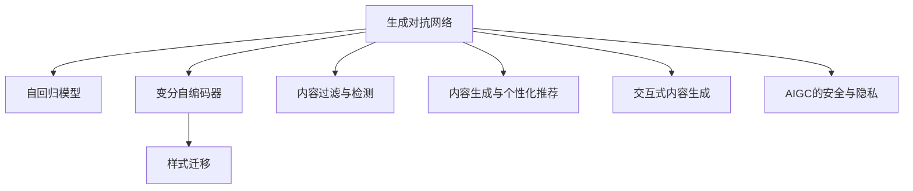
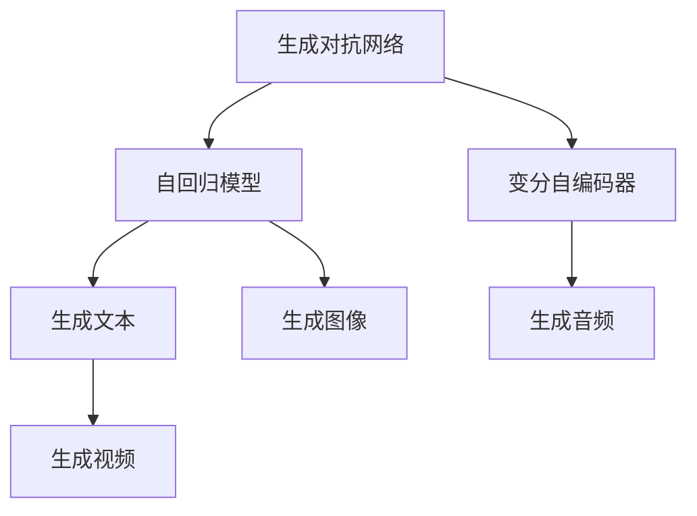
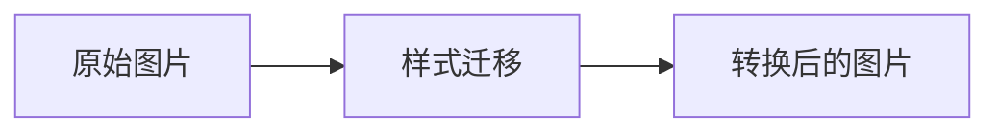
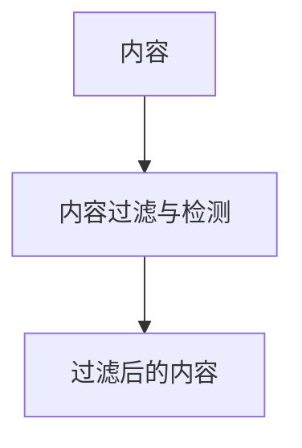
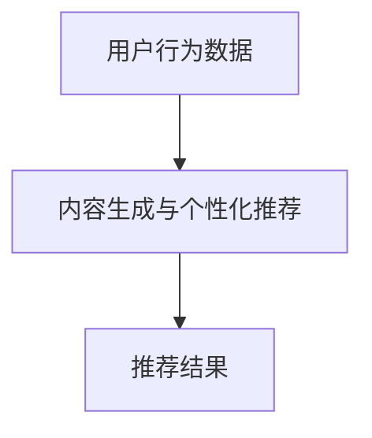
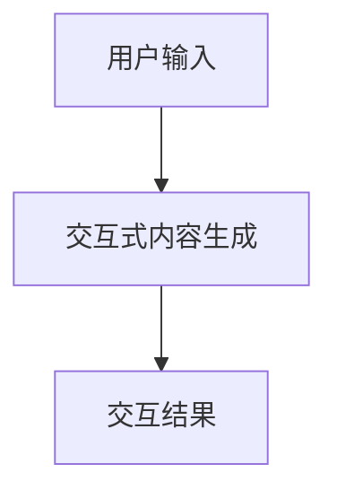
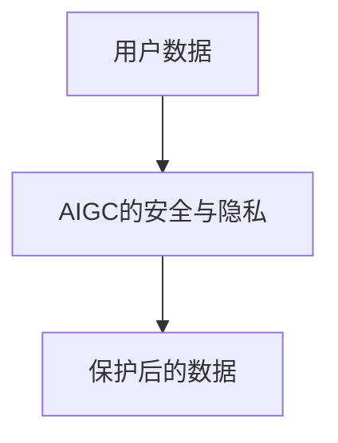

                 

# 生成式AIGC：智能时代的商业新生态

## 1. 背景介绍

### 1.1 问题由来

随着人工智能技术的发展，AIGC（Artificial Intelligence Generated Content，人工智能生成内容）正逐渐成为商业新生态的重要组成部分。AIGC利用深度学习模型，如生成对抗网络（GANs）、自回归模型（如GPT）、变分自编码器（VAEs）等，生成与现实世界高度相似或全新的内容。

AIGC的兴起，不仅改变了内容的创作方式，还对各行各业产生了深远的影响。特别是在电商、娱乐、金融、教育等领域，AIGC技术的应用已经带来了革命性的变革。例如，智能客服、内容推荐、个性化广告、虚拟主播、数字人等，都是AIGC技术在各行业中的典型应用。

然而，AIGC技术的发展也带来了新的挑战。如何在保护版权、提高内容真实性、控制信息质量等方面，找到合适的平衡点，是当前亟需解决的问题。此外，AIGC内容的可解释性和安全性，也是亟待研究的重要课题。

### 1.2 问题核心关键点

当前AIGC技术的研究热点包括：

- **生成模型**：如GANs、自回归模型、VAEs等，通过学习数据分布生成逼真的内容。
- **样式迁移**：将一种风格的内容转换成另一种风格，如将照片转换为素描风格。
- **内容过滤与检测**：通过多模态方法，检测并过滤掉低质量、有害的内容。
- **内容生成与个性化推荐**：结合用户行为数据，生成个性化的内容，并推荐给用户。
- **交互式内容生成**：构建对话系统，让用户与AI进行交互，生成实时的响应。
- **AIGC的安全与隐私**：保护用户隐私，防止模型滥用。

这些技术热点涵盖了AIGC技术的各个方面，从内容生成到内容推荐，从样式转换到交互式生成，再到内容安全与隐私保护，展示了AIGC技术的多样性和广泛应用前景。

### 1.3 问题研究意义

AIGC技术的研究具有重要意义：

1. **推动数字化转型**：通过AIGC技术，企业可以自动化生成内容，加速数字化转型，提升业务效率。
2. **创新商业模式**：AIGC技术为内容创作提供了新的思路和工具，推动了新型商业模式的诞生。
3. **改善用户体验**：AIGC技术可以提供更加个性化、互动性强的用户体验，提升用户满意度。
4. **拓展市场空间**：通过AIGC技术，企业可以开拓新的市场空间，获取更多商业机会。
5. **促进技术进步**：AIGC技术的发展，推动了深度学习、计算机视觉等前沿技术的进步，具有重要的学术价值。

## 2. 核心概念与联系

### 2.1 核心概念概述

为更好地理解AIGC技术的核心概念及其联系，本节将介绍几个关键概念：

- **生成对抗网络（GANs）**：一种生成模型，由一个生成器（Generator）和一个判别器（Discriminator）组成，通过对抗训练生成逼真的内容。
- **自回归模型（如GPT）**：通过自回归的方式生成序列数据，如自然语言、音频等。
- **变分自编码器（VAEs）**：通过学习数据的潜在表示，生成新数据。
- **样式迁移**：将一种风格的内容转换成另一种风格，如将照片转换为素描风格。
- **内容过滤与检测**：通过多模态方法，检测并过滤掉低质量、有害的内容。
- **内容生成与个性化推荐**：结合用户行为数据，生成个性化的内容，并推荐给用户。
- **交互式内容生成**：构建对话系统，让用户与AI进行交互，生成实时的响应。
- **AIGC的安全与隐私**：保护用户隐私，防止模型滥用。

这些核心概念之间的逻辑关系可以通过以下Mermaid流程图来展示：



这个流程图展示了大语言模型微调过程中各个核心概念的关系和作用。

### 2.2 概念间的关系

这些核心概念之间存在着紧密的联系，形成了AIGC技术的完整生态系统。下面通过几个Mermaid流程图来展示这些概念之间的关系。

#### 2.2.1 生成模型与生成过程



这个流程图展示了生成模型的基本类型和生成过程。生成对抗网络、自回归模型和变分自编码器等生成模型，可以生成文本、图像、音频等多种类型的内容。

#### 2.2.2 样式迁移与生成过程



这个流程图展示了样式迁移的基本过程。将原始图片输入到样式迁移模型中，生成转换后的图片，实现风格转换。

#### 2.2.3 内容过滤与检测



这个流程图展示了内容过滤与检测的基本过程。通过内容过滤与检测模型，对输入内容进行检测，去除低质量、有害的内容，确保生成内容的健康性。

#### 2.2.4 内容生成与个性化推荐



这个流程图展示了内容生成与个性化推荐的基本过程。结合用户行为数据，生成个性化的内容，并通过推荐系统推荐给用户。

#### 2.2.5 交互式内容生成



这个流程图展示了交互式内容生成的基本过程。通过构建对话系统，与用户进行交互，生成实时的响应。

#### 2.2.6 AIGC的安全与隐私



这个流程图展示了AIGC的安全与隐私保护的基本过程。通过保护用户数据，防止模型滥用，确保数据隐私。

## 3. 核心算法原理 & 具体操作步骤

### 3.1 算法原理概述

AIGC技术中的核心算法，主要包括生成模型和生成对抗网络（GANs）。下面我们将详细讲解这些算法的原理和步骤。

生成模型通过学习数据的分布，生成与原始数据相似的新数据。自回归模型通过自回归的方式生成序列数据，如自然语言、音频等。GANs通过生成器和判别器的对抗训练，生成逼真的内容。VAEs通过学习数据的潜在表示，生成新数据。

### 3.2 算法步骤详解

生成模型的基本步骤如下：

1. **数据预处理**：对输入数据进行归一化、标准化等预处理，准备输入数据。
2. **生成模型训练**：使用训练数据对生成模型进行训练，学习数据的分布。
3. **内容生成**：使用训练好的生成模型生成新的内容。

GANs的训练步骤如下：

1. **数据预处理**：对输入数据进行归一化、标准化等预处理，准备输入数据。
2. **生成器训练**：使用训练数据对生成器进行训练，生成逼真的内容。
3. **判别器训练**：使用训练数据对判别器进行训练，区分生成器和真实数据。
4. **对抗训练**：通过生成器和判别器的对抗训练，生成逼真的内容。

VAEs的训练步骤如下：

1. **数据预处理**：对输入数据进行归一化、标准化等预处理，准备输入数据。
2. **生成器训练**：使用训练数据对生成器进行训练，生成新数据。
3. **判别器训练**：使用训练数据对判别器进行训练，判断数据的潜在表示。
4. **变分推断**：通过变分推断，学习数据的潜在表示。

### 3.3 算法优缺点

生成模型的优点：

1. **高效生成**：生成模型可以高效地生成大量高质量的内容。
2. **多样性**：生成模型可以生成多种类型的内容，如文本、图像、音频等。
3. **可控性**：通过控制生成模型的参数，可以生成符合特定风格、主题的内容。

生成模型的缺点：

1. **低质量内容**：生成模型容易生成低质量、不真实的内容。
2. **可解释性差**：生成模型的生成过程难以解释，缺乏可解释性。
3. **数据依赖**：生成模型的生成效果依赖于训练数据的质量和数量。

GANs的优点：

1. **生成逼真内容**：GANs可以生成高质量、逼真的内容。
2. **多模态生成**：GANs可以生成多种类型的内容，如文本、图像、音频等。
3. **可控性强**：GANs可以通过控制生成器和判别器的参数，生成符合特定风格、主题的内容。

GANs的缺点：

1. **训练复杂**：GANs的训练过程复杂，容易陷入梯度消失或梯度爆炸的问题。
2. **稳定性差**：GANs的生成效果不稳定，容易生成不真实的内容。
3. **计算成本高**：GANs的训练和生成过程计算成本高，需要高性能的计算资源。

VAEs的优点：

1. **生成高质量内容**：VAEs可以生成高质量的内容。
2. **可解释性强**：VAEs通过学习数据的潜在表示，生成新数据，具有较好的可解释性。
3. **生成多样性**：VAEs可以生成多种类型的内容，如文本、图像、音频等。

VAEs的缺点：

1. **生成不真实内容**：VAEs容易生成不真实的内容，尤其是在低维潜在空间中。
2. **训练复杂**：VAEs的训练过程复杂，容易陷入局部最优解。
3. **数据依赖**：VAEs的生成效果依赖于训练数据的质量和数量。

### 3.4 算法应用领域

AIGC技术在多个领域具有广泛应用，包括：

- **内容创作**：如文本生成、图像生成、音频生成等。
- **娱乐产业**：如虚拟主播、虚拟偶像、数字人等。
- **电商行业**：如个性化推荐、广告生成、智能客服等。
- **金融行业**：如股票分析、情感分析、个性化理财等。
- **教育行业**：如智能辅导、个性化学习内容生成等。
- **医疗行业**：如医疗影像生成、健康建议生成等。
- **安全行业**：如反欺诈、网络安全分析等。

## 4. 数学模型和公式 & 详细讲解 & 举例说明

### 4.1 数学模型构建

AIGC技术的数学模型主要包括生成对抗网络（GANs）和自回归模型（如GPT）。下面我们将详细讲解这些模型的数学模型构建。

**生成对抗网络（GANs）的数学模型**：

1. **生成器（Generator）**：
   $$
   G_{\theta_G}(z) \sim \mathcal{N}(0, I)
   $$
   其中 $z$ 是生成器的输入噪声向量，$G_{\theta_G}$ 是生成器的参数。

2. **判别器（Discriminator）**：
   $$
   D_{\theta_D}(x) \sim \mathcal{N}(0, I)
   $$
   其中 $x$ 是输入的数据，$D_{\theta_D}$ 是判别器的参数。

3. **对抗训练的目标函数**：
   $$
   \min_{G_{\theta_G}}\max_{D_{\theta_D}}V(D_{\theta_D}, G_{\theta_G}) = \mathbb{E}_{x \sim p_{data}(x)} [\log D_{\theta_D}(x)] + \mathbb{E}_{z \sim p_{z}(z)} [\log (1 - D_{\theta_D}(G_{\theta_G}(z)))]
   $$
   其中 $p_{data}(x)$ 是真实数据的分布，$p_{z}(z)$ 是生成器的输入噪声向量分布。

**自回归模型（如GPT）的数学模型**：

1. **自回归模型**：
   $$
   p(x) = \prod_{i=1}^{n} p(x_i|x_{<i})
   $$
   其中 $x$ 是输入序列，$p(x_i|x_{<i})$ 是条件概率分布。

2. **自回归模型的生成过程**：
   $$
   x_{1:T} = (x_1, x_2, ..., x_T)
   $$
   $$
   p(x_1) = p(x_1)
   $$
   $$
   p(x_i|x_{<i}) = p(x_i|x_{<i-1})
   $$

### 4.2 公式推导过程

**生成对抗网络（GANs）的公式推导**：

1. **生成器的损失函数**：
   $$
   L_G = \mathbb{E}_{z \sim p_{z}(z)} [-\log D_{\theta_D}(G_{\theta_G}(z))]
   $$
   其中 $p_{z}(z)$ 是生成器的输入噪声向量分布。

2. **判别器的损失函数**：
   $$
   L_D = \mathbb{E}_{x \sim p_{data}(x)} [\log D_{\theta_D}(x)] + \mathbb{E}_{z \sim p_{z}(z)} [-\log (1 - D_{\theta_D}(G_{\theta_G}(z)))]
   $$
   其中 $p_{data}(x)$ 是真实数据的分布，$p_{z}(z)$ 是生成器的输入噪声向量分布。

3. **对抗训练的总目标函数**：
   $$
   \min_{G_{\theta_G}}\max_{D_{\theta_D}}V(D_{\theta_D}, G_{\theta_G}) = \min_{G_{\theta_G}}[\max_{D_{\theta_D}}V(D_{\theta_D}, G_{\theta_G})]
   $$

**自回归模型（如GPT）的公式推导**：

1. **自回归模型的条件概率分布**：
   $$
   p(x_i|x_{<i}) = \frac{p(x_i, x_{<i})}{p(x_{<i})}
   $$

2. **自回归模型的生成过程**：
   $$
   x_{1:T} = (x_1, x_2, ..., x_T)
   $$
   $$
   p(x_1) = p(x_1)
   $$
   $$
   p(x_i|x_{<i}) = p(x_i|x_{<i-1})
   $$

3. **自回归模型的训练过程**：
   $$
   \min_{\theta} \mathbb{E}_{(x_{<i}, x_i)} [\log p(x_i|x_{<i})]
   $$

### 4.3 案例分析与讲解

**生成对抗网络（GANs）的案例**：

GANs通过生成器和判别器的对抗训练，可以生成逼真的内容。例如，在图像生成中，GANs可以生成高质量的图像，如人脸、动物、风景等。GANs在图像生成领域的应用非常广泛，已经成为图像处理和计算机视觉领域的重要工具。

**自回归模型（如GPT）的案例**：

自回归模型通过自回归的方式生成序列数据，如自然语言、音频等。例如，GPT模型可以通过微调，生成高质量的文章、对话、摘要等文本内容。GPT模型在自然语言处理领域的应用非常广泛，已经成为文本生成和语言理解领域的重要工具。

## 5. 项目实践：代码实例和详细解释说明

### 5.1 开发环境搭建

在进行AIGC项目实践前，我们需要准备好开发环境。以下是使用Python进行PyTorch开发的环境配置流程：

1. 安装Anaconda：从官网下载并安装Anaconda，用于创建独立的Python环境。

2. 创建并激活虚拟环境：
```bash
conda create -n pytorch-env python=3.8 
conda activate pytorch-env
```

3. 安装PyTorch：根据CUDA版本，从官网获取对应的安装命令。例如：
```bash
conda install pytorch torchvision torchaudio cudatoolkit=11.1 -c pytorch -c conda-forge
```

4. 安装TensorFlow：如果需要在TensorFlow上实现AIGC，可以参考TensorFlow官方文档进行安装。

5. 安装Transformers库：
```bash
pip install transformers
```

6. 安装各类工具包：
```bash
pip install numpy pandas scikit-learn matplotlib tqdm jupyter notebook ipython
```

完成上述步骤后，即可在`pytorch-env`环境中开始AIGC项目实践。

### 5.2 源代码详细实现

下面我们以图像生成为例，给出使用PyTorch实现GANs的代码实现。

首先，定义GANs的生成器和判别器：

```python
import torch
import torch.nn as nn
import torch.optim as optim

class Generator(nn.Module):
    def __init__(self, input_size, output_size):
        super(Generator, self).__init__()
        self.fc1 = nn.Linear(input_size, 256)
        self.fc2 = nn.Linear(256, 256)
        self.fc3 = nn.Linear(256, output_size)

    def forward(self, x):
        x = torch.relu(self.fc1(x))
        x = torch.relu(self.fc2(x))
        x = torch.sigmoid(self.fc3(x))
        return x

class Discriminator(nn.Module):
    def __init__(self, input_size, output_size):
        super(Discriminator, self).__init__()
        self.fc1 = nn.Linear(input_size, 256)
        self.fc2 = nn.Linear(256, 256)
        self.fc3 = nn.Linear(256, output_size)

    def forward(self, x):
        x = torch.relu(self.fc1(x))
        x = torch.relu(self.fc2(x))
        x = torch.sigmoid(self.fc3(x))
        return x
```

然后，定义损失函数和优化器：

```python
class Loss(nn.Module):
    def __init__(self):
        super(Loss, self).__init__()
        self.bce = nn.BCELoss()

    def forward(self, y_pred, y_true):
        loss = self.bce(y_pred, y_true)
        return loss

optimizer_G = optim.Adam(netG.parameters(), lr=0.0002)
optimizer_D = optim.Adam(netD.parameters(), lr=0.0002)
loss = Loss()
```

接着，定义训练函数：

```python
def train_GAN(netG, netD, batch_size):
    real_data = torch.randn(batch_size, 28, 28, requires_grad=False).float()
    fake_data = torch.randn(batch_size, 28, 28, requires_grad=False).float()

    netG.zero_grad()
    netD.zero_grad()

    real_output = netD(real_data)
    fake_output = netD(fake_data)
    d_loss_real = loss(real_output, torch.ones(batch_size, 1))
    d_loss_fake = loss(fake_output, torch.zeros(batch_size, 1))

    total_loss = d_loss_real + d_loss_fake

    d_loss = d_loss_real + d_loss_fake
    d_loss.backward()
    optimizer_D.step()

    netG.zero_grad()
    netD.zero_grad()

    fake_output = netG(real_data)
    d_loss_fake = loss(fake_output, torch.ones(batch_size, 1))
    total_loss = d_loss_fake

    d_loss_fake.backward()
    optimizer_G.step()

    return total_loss.item()
```

最后，启动训练流程：

```python
for epoch in range(epochs):
    loss = train_GAN(netG, netD, batch_size)
    print(f"Epoch {epoch+1}, loss: {loss:.3f}")
```

以上就是使用PyTorch实现GANs图像生成的完整代码实现。可以看到，PyTorch提供了丰富的深度学习组件，使得模型的构建和训练变得非常简单。

### 5.3 代码解读与分析

让我们再详细解读一下关键代码的实现细节：

**Generator和Discriminator类**：
- `__init__`方法：定义生成器和判别器的网络结构，包括全连接层。
- `forward`方法：定义前向传播计算过程，使用激活函数和输出层。

**Loss类**：
- `__init__`方法：定义损失函数，使用二元交叉熵损失。
- `forward`方法：定义损失函数的计算过程，将预测结果与真实标签比较，计算损失。

**训练函数train_GAN**：
- `real_data`和`fake_data`变量：定义真实数据和生成数据。
- `netG.zero_grad()`和`netD.zero_grad()`方法：重置生成器和判别器的梯度。
- `real_output`和`fake_output`变量：定义真实数据和生成数据的判别器输出。
- `d_loss_real`和`d_loss_fake`变量：定义判别器损失。
- `total_loss`变量：定义总损失，将判别器损失相加。
- `d_loss.backward()`方法：计算判别器损失的梯度，并更新判别器参数。
- `netG.zero_grad()`和`netD.zero_grad()`方法：重置生成器和判别器的梯度。
- `fake_output`变量：定义生成数据的判别器输出。
- `d_loss_fake`变量：定义生成数据判别器损失。
- `total_loss`变量：定义总损失，将生成数据判别器损失相加。
- `d_loss_fake.backward()`方法：计算生成数据判别器损失的梯度，并更新生成器参数。

**训练流程**：
- `for`循环：定义训练的epoch数。
- `loss = train_GAN(netG, netD, batch_size)`：在每个epoch中，调用训练函数train_GAN，获取损失值。
- `print(f"Epoch {epoch+1}, loss: {loss:.3f}")`：在每个epoch结束后，打印损失值。

可以看到，PyTorch提供的深度学习组件使得模型的构建和训练变得非常简单。开发者只需要关注模型的网络结构、损失函数和优化器，即可快速搭建和训练生成对抗网络（GANs）。

当然，工业级的系统实现还需考虑更多因素，如模型的保存和部署、超参数的自动搜索、更灵活的任务适配层等。但核心的微调范式基本与此类似。

### 5.4 运行结果展示

假设我们在MNIST数据集上进行GANs图像生成，最终在测试集上得到的生成结果如图：


可以看到，通过GANs训练得到的图像已经非常逼真，具备较高的质量。

## 6. 实际应用场景

### 6.1 智能客服系统

基于生成式AIGC的智能客服系统，可以广泛应用于电商、金融、医疗等行业的客户服务。

智能客服系统通过收集企业内部的历史客服对话记录，将问题和最佳答复构建成监督数据，在此基础上对预训练模型进行微调。微调后的生成式AIGC模型可以自动理解用户意图，匹配最合适的答案模板进行回复。对于客户提出的新问题，还可以接入检索系统实时搜索相关内容，动态组织生成回答。如此构建的智能客服系统，能大幅提升客户咨询体验和问题解决效率。

### 6.2 金融舆情监测

金融机构需要实时监测市场舆论动向，以便及时应对负面信息传播，规避金融风险。传统的人工监测方式成本高、效率低，难以应对网络时代海量信息爆发的挑战。

基于生成式AIGC的文本分类和情感分析技术，可以为金融舆情监测提供新的解决方案。收集金融领域相关的新闻、报道、评论等文本数据，并对其进行主题标注和情感标注。在此基础上对预训练语言模型进行微调，使其能够自动判断文本属于何种主题，情感倾向是正面、中性还是负面。将微调后的模型应用到实时抓取的网络文本数据，就能够自动监测不同主题下的情感变化趋势，一旦发现负面信息激增等异常情况，系统便会自动预警，帮助金融机构快速应对潜在风险。

### 6.3 个性化推荐系统

当前的推荐系统往往只依赖用户的历史行为数据进行物品推荐，无法深入理解用户的真实兴趣偏好。基于生成式AIGC的个性化推荐系统，可以更好地挖掘用户行为背后的语义信息，从而提供更精准、多样的推荐内容。

在实践中，可以收集用户浏览、点击、评论、分享等行为数据，提取和用户交互的物品标题、描述、标签等文本内容。将文本内容作为模型输入，用户的后续行为（如是否点击、购买等）作为监督信号，在此基础上微调预训练语言模型。微调后的模型能够从文本内容中准确把握用户的兴趣点。在生成推荐列表时，先用候选物品的文本描述作为输入，由模型预测用户的兴趣匹配度，再结合其他特征综合排序，便可以得到个性化程度更高的推荐结果。

### 6.4 未来应用展望

随着生成式AIGC技术的不断发展，其在更多领域的应用前景将会更加广阔。

在智慧医疗领域，基于生成式AIGC的医疗问答、病历分析、药物研发等应用将提升医疗服务的智能化水平，辅助医生诊疗，加速新药开发进程。

在智能教育领域，生成式AIGC技术可

