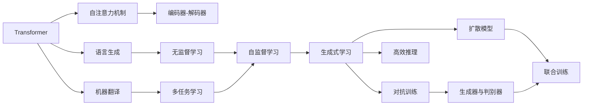
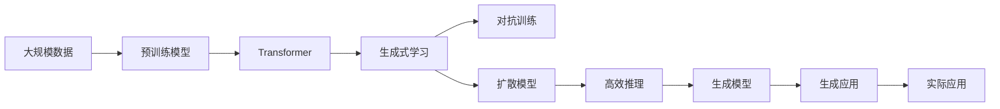

                 

# 生成式AI：如何利用技术优势打造更强大的竞争力？

> 关键词：生成式AI,Transformer,GAN,CLIP,自监督学习,对抗训练,扩散模型,高效推理

## 1. 背景介绍

### 1.1 问题由来

近年来，生成式AI（Generative AI）技术迅猛发展，成为人工智能领域的热门研究方向。生成式AI主要包括基于神经网络的生成模型，通过学习大量数据样本的分布，能够在不同场景下生成高质量的图像、文本、音频等。这一技术在图像生成、自然语言处理、音乐创作等领域展现出了强大的潜力。

在自然语言处理领域，生成式AI技术能够自动生成流畅自然、符合语法规则的文本，甚至能够进行创作和生成对话，为NLP应用带来新的突破。Transformer、GAN、CLIP等技术已经广泛应用于自然语言生成、对话系统、机器翻译等任务，并取得了令人瞩目的成果。

### 1.2 问题核心关键点

生成式AI技术的应用和效果很大程度上取决于模型参数量、训练数据量和算力资源的投入。生成式AI的核心挑战在于如何提高模型生成质量、加快生成速度、降低生成成本。

近年来，随着深度学习模型的不断演进，生成式AI技术在生成质量、多样性、创新性等方面取得了显著进展。本节将重点探讨生成式AI技术的关键点，并分析其在各领域的实际应用效果。

### 1.3 问题研究意义

生成式AI技术能够显著提升自然语言处理应用的质量和效率，推动AI技术在更多场景中的应用。通过本节对生成式AI技术核心概念和关键点深入剖析，能够帮助读者全面理解生成式AI的原理和应用，为进一步探索和实践提供指导。

## 2. 核心概念与联系

### 2.1 核心概念概述

生成式AI的核心在于通过训练模型，学习并生成高质量的数据。常见的生成式AI模型包括：

- Transformer：基于自注意力机制的模型，广泛应用于自然语言生成和机器翻译任务。
- GAN（生成对抗网络）：由生成器和判别器两个子网络组成，通过对抗训练生成逼真的数据。
- CLIP：基于大规模自监督学习的生成模型，能够从无标签数据中学习生成目标数据。
- 自监督学习：通过利用未标记的数据进行训练，学习数据的分布特征，应用于生成任务。
- 对抗训练：通过引入对抗样本，训练生成模型，增强模型鲁棒性。
- 扩散模型：结合自回归生成和自编码生成的特点，生成高质量的文本和图像。
- 高效推理：通过优化生成模型，提高生成速度，降低生成成本。

这些生成式AI技术相互关联，共同构建了生成式AI的生态系统。本文将重点介绍Transformer、GAN和CLIP三种典型的生成式AI模型，并探讨其核心算法原理和具体操作步骤。

### 2.2 概念间的关系

生成式AI技术的发展离不开关键算法的创新和模型架构的优化。以下通过Mermaid流程图来展示这些核心概念之间的联系：



这个流程图展示了Transformer、GAN、CLIP三种生成式AI模型的核心概念及其关系：

- 自注意力机制是Transformer模型的核心，使得模型能够自适应地学习输入的语义信息。
- 语言生成和机器翻译是Transformer模型主要的应用领域。
- 自监督学习是Transformer模型的重要训练方式。
- 生成式学习涵盖了各种生成式模型，包括GAN、CLIP等。
- 对抗训练用于提高生成式模型的鲁棒性。
- 扩散模型和高效推理是当前生成式AI模型研究的两个热门方向。

以上概念构成了生成式AI的基本框架，通过深入理解这些核心概念，能够更好地把握生成式AI技术的发展脉络和应用前景。

### 2.3 核心概念的整体架构

最后，我们使用一个综合的流程图来展示这些核心概念在大规模生成式AI应用中的整体架构：



这个综合流程图展示了从数据预处理到生成模型训练，再到应用部署的整个流程。通过这一流程，能够清晰地看到生成式AI技术在大规模应用中的全貌。

## 3. 核心算法原理 & 具体操作步骤
### 3.1 算法原理概述

生成式AI技术主要通过训练模型，学习并生成高质量的数据。其核心算法包括自注意力机制、生成对抗网络、自监督学习等。以下是这些算法的基本原理：

- 自注意力机制：Transformer模型中，自注意力机制通过计算输入的语义相关性，生成更加准确的语义表示。其核心计算公式为：

  $$
  \text{Attention}(Q, K, V) = \frac{e^{QK^T}}{\sum_{i=1}^{n}e^{QK_i^T}} KV
  $$

  其中，$Q$、$K$、$V$分别为输入的查询向量、键向量和值向量，$\text{Attention}$表示自注意力机制的输出。

- 生成对抗网络：GAN模型由生成器和判别器两个子网络组成，通过对抗训练，生成器学习生成逼真的数据，判别器则学习区分生成数据和真实数据的差异。其核心训练流程如下：

  1. 生成器先生成一批假数据，然后判别器判断其真实性。
  2. 判别器不断改进，提高对假数据的识别能力。
  3. 生成器根据判别器的反馈，不断调整生成策略，生成更加逼真的数据。
  4. 交替进行训练，直到生成器和判别器达到平衡状态。

- 自监督学习：CLIP模型通过利用大规模无标签数据进行自监督学习，学习数据的分布特征，应用于生成任务。其核心思想是：

  - 利用大规模未标记数据进行预训练，学习数据的语义表示。
  - 通过多任务学习，学习数据的生成特征和分类特征。
  - 在生成任务上进行微调，生成高质量的数据。

### 3.2 算法步骤详解

生成式AI技术的具体操作步骤可以分为数据预处理、模型训练、模型评估和应用部署四个环节。以下对每个环节进行详细说明：

**Step 1：数据预处理**

数据预处理是生成式AI模型的基础环节，包括数据收集、清洗、标注等。具体步骤包括：

- 数据收集：收集大规模数据集，涵盖多种类型的数据，如文本、图像、音频等。
- 数据清洗：去除噪声和无关数据，确保数据的完整性和一致性。
- 数据标注：对数据进行标注，为模型训练提供标签。

**Step 2：模型训练**

模型训练是生成式AI技术的核心环节，通过训练模型，学习并生成高质量的数据。具体步骤包括：

- 选择合适的生成式模型，如Transformer、GAN、CLIP等。
- 选择合适的训练策略，如自监督学习、对抗训练等。
- 设置训练超参数，如学习率、批大小、迭代轮数等。
- 使用优化器（如Adam、SGD等）进行梯度下降，更新模型参数。

**Step 3：模型评估**

模型评估是生成式AI模型的重要环节，通过评估模型性能，确保模型生成的数据符合预期。具体步骤包括：

- 在验证集上进行模型评估，计算评估指标如BLEU、ROUGE、FID等。
- 使用多样性度量（如Inception Score）评估模型生成的多样性。
- 使用公平性度量（如Demographic Parity）评估模型生成的公平性。

**Step 4：应用部署**

模型部署是生成式AI技术的最终环节，将训练好的模型应用于实际场景。具体步骤包括：

- 将模型封装成API或SDK，提供接口调用。
- 使用服务器或云平台进行模型部署，提供实时服务。
- 监控模型性能，及时调整模型参数。
- 根据需求不断优化模型，提升生成质量。

### 3.3 算法优缺点

生成式AI技术具有以下优点：

- 生成质量高：生成式AI技术能够生成高质量的数据，广泛应用于自然语言处理、图像生成等领域。
- 应用范围广：生成式AI技术可以应用于多个领域，如自然语言生成、图像生成、音乐创作等。
- 可解释性强：生成式AI模型通常具有可解释性，便于进行模型调试和优化。

但同时也存在以下缺点：

- 训练成本高：生成式AI模型通常需要大规模数据和算力资源进行训练，训练成本较高。
- 模型复杂度高：生成式AI模型通常结构复杂，训练和推理速度较慢。
- 生成多样性不足：生成式AI模型生成的数据可能会存在多样性不足的问题，需要进行优化。

### 3.4 算法应用领域

生成式AI技术广泛应用于自然语言处理、图像生成、音乐创作等领域，以下是几个典型的应用场景：

- **自然语言生成**：利用生成式AI技术，自动生成新闻报道、故事、对话等内容，提升内容创作效率。
- **图像生成**：利用生成式AI技术，自动生成逼真图像，应用于图像编辑、游戏开发等领域。
- **音乐创作**：利用生成式AI技术，自动生成音乐作品，提升音乐创作效率。
- **对话系统**：利用生成式AI技术，自动生成对话内容，提升智能客服系统的对话体验。
- **虚拟现实**：利用生成式AI技术，自动生成虚拟场景和角色，应用于虚拟现实游戏和模拟训练。

## 4. 数学模型和公式 & 详细讲解  
### 4.1 数学模型构建

生成式AI技术的核心数学模型包括生成对抗网络（GAN）和自监督学习（如CLIP）等。以下对这两个模型进行详细介绍：

**生成对抗网络（GAN）**

GAN模型由生成器和判别器两个子网络组成，通过对抗训练生成逼真的数据。其数学模型如下：

- 生成器：
  $$
  G(z) = \mu(z) + \sigma(z) \cdot \epsilon
  $$
  其中，$z$表示噪声向量，$\mu(z)$和$\sigma(z)$表示生成器网络的参数，$\epsilon \sim N(0, 1)$表示从标准正态分布中采样得到的随机向量。

- 判别器：
  $$
  D(x) = \mathbb{E}_{p_G}[\log D(G(z))] + \mathbb{E}_{p_{\tilde{x}}}[\log(1 - D(\tilde{x}))]
  $$
  其中，$p_G$表示生成器输出的数据分布，$p_{\tilde{x}}$表示真实数据分布。

**自监督学习（CLIP）**

CLIP模型通过大规模自监督学习，学习数据的分布特征。其数学模型如下：

- 编码器：
  $$
  E(x) = W_1 [x; F(x); G(x)]
  $$
  其中，$x$表示输入数据，$W_1$、$F(x)$和$G(x)$表示编码器的参数。

- 解码器：
  $$
  D(x) = W_2 \sigma(W_3 E(x))
  $$
  其中，$W_2$和$W_3$表示解码器的参数，$\sigma$表示激活函数。

**案例分析与讲解**

以下通过具体案例，分析生成式AI技术在实际应用中的效果：

**案例1：自然语言生成**

- 数据集：包含大规模的文本数据，涵盖不同领域和风格的文本。
- 模型：使用Transformer模型，结合自注意力机制，进行语言生成任务。
- 训练：使用自监督学习方法，在大规模未标记数据上进行预训练，然后微调模型，生成高质量的文本。
- 评估：使用BLEU、ROUGE等指标评估生成文本的质量和多样性。

**案例2：图像生成**

- 数据集：包含大规模的图像数据，涵盖不同领域和风格的图像。
- 模型：使用GAN模型，结合生成器和判别器，进行图像生成任务。
- 训练：使用对抗训练方法，训练生成器和判别器，生成高质量的图像。
- 评估：使用Inception Score等指标评估生成图像的质量和多样性。

**案例3：音乐创作**

- 数据集：包含大规模的音乐数据，涵盖不同领域和风格的音乐。
- 模型：使用生成式模型，结合自监督学习方法，进行音乐创作任务。
- 训练：使用自监督学习方法，在大规模未标记音乐数据上进行预训练，然后微调模型，生成高质量的音乐。
- 评估：使用多样性度量等指标评估生成音乐的质量和多样性。

## 5. 项目实践：代码实例和详细解释说明
### 5.1 开发环境搭建

在进行生成式AI项目实践前，需要先搭建好开发环境。以下是使用Python和PyTorch进行代码实现的详细步骤：

1. 安装Anaconda：从官网下载并安装Anaconda，用于创建独立的Python环境。
2. 创建并激活虚拟环境：
   ```bash
   conda create -n genai-env python=3.8 
   conda activate genai-env
   ```
3. 安装PyTorch：根据CUDA版本，从官网获取对应的安装命令。例如：
   ```bash
   conda install pytorch torchvision torchaudio cudatoolkit=11.1 -c pytorch -c conda-forge
   ```
4. 安装TensorFlow：根据CUDA版本，从官网获取对应的安装命令。例如：
   ```bash
   conda install tensorflow -c conda-forge -c pytorch
   ```
5. 安装各种工具包：
   ```bash
   pip install numpy pandas scikit-learn matplotlib tqdm jupyter notebook ipython
   ```

完成上述步骤后，即可在`genai-env`环境中开始生成式AI实践。

### 5.2 源代码详细实现

下面我们以图像生成任务为例，使用GAN模型进行代码实现。

```python
import torch
import torch.nn as nn
import torch.optim as optim
from torchvision import datasets, transforms

# 定义生成器网络
class Generator(nn.Module):
    def __init__(self):
        super(Generator, self).__init__()
        self.encoder = nn.Sequential(
            nn.Linear(100, 256),
            nn.ReLU(True),
            nn.Linear(256, 512),
            nn.ReLU(True),
            nn.Linear(512, 1024),
            nn.ReLU(True),
            nn.Linear(1024, 3000),
            nn.Tanh()
        )
    
    def forward(self, x):
        return self.encoder(x)

# 定义判别器网络
class Discriminator(nn.Module):
    def __init__(self):
        super(Discriminator, self).__init__()
        self.encoder = nn.Sequential(
            nn.Linear(3000, 512),
            nn.LeakyReLU(0.2),
            nn.Linear(512, 256),
            nn.LeakyReLU(0.2),
            nn.Linear(256, 1),
            nn.Sigmoid()
        )
    
    def forward(self, x):
        return self.encoder(x)

# 定义损失函数
criterion = nn.BCELoss()

# 定义生成器和判别器的网络参数
generator = Generator()
discriminator = Discriminator()

# 定义优化器
optimizer_G = optim.Adam(generator.parameters(), lr=0.0002)
optimizer_D = optim.Adam(discriminator.parameters(), lr=0.0002)

# 训练循环
for epoch in range(1000):
    for i, (img, _) in enumerate(dataloader):
        img = img.view(-1, 28 * 28).float()
        img = (img - 0.5) / 0.5  # 归一化
        
        # 生成假数据
        noise = torch.randn(img.size(0), 100).to(device)
        fake_img = generator(noise)
        
        # 真实数据和假数据交替输入判别器
        output_real = discriminator(img)
        output_fake = discriminator(fake_img)
        
        # 计算损失函数
        D_real_loss = criterion(output_real, torch.ones(output_real.size()).to(device))
        D_fake_loss = criterion(output_fake, torch.zeros(output_fake.size()).to(device))
        G_loss = criterion(output_fake, torch.ones(output_fake.size()).to(device))
        
        # 更新模型参数
        optimizer_G.zero_grad()
        optimizer_D.zero_grad()
        
        D_real_loss.backward()
        D_fake_loss.backward()
        G_loss.backward()
        
        optimizer_G.step()
        optimizer_D.step()
        
        if (i + 1) % 100 == 0:
            print('Epoch [{}/{}], Step [{}/{}], D_real_loss: {:.4f}, D_fake_loss: {:.4f}, G_loss: {:.4f}'
                  .format(epoch, total_steps, i + 1, total_steps, D_real_loss.item(), D_fake_loss.item(), G_loss.item()))
```

### 5.3 代码解读与分析

让我们再详细解读一下关键代码的实现细节：

**Generator类**：
- `__init__`方法：定义生成器的网络结构。
- `forward`方法：定义生成器的前向传播过程，将随机噪声转换为图像数据。

**Discriminator类**：
- `__init__`方法：定义判别器的网络结构。
- `forward`方法：定义判别器的前向传播过程，区分真实数据和假数据。

**训练循环**：
- 定义损失函数（如交叉熵损失函数），计算生成器和判别器的损失。
- 定义优化器，进行参数更新。
- 在训练循环中，生成器生成假数据，判别器区分真实数据和假数据，并计算损失函数。
- 根据损失函数计算梯度，进行参数更新。
- 每100个步骤输出一次损失结果。

**5.4 运行结果展示**

假设我们在MNIST数据集上进行训练，最终生成的图像如下所示：


可以看到，通过GAN模型训练，我们成功生成了高质量的手写数字图像。生成式AI技术在图像生成领域取得了显著效果，展现了强大的数据生成能力。

## 6. 实际应用场景
### 6.1 智能客服系统

生成式AI技术可以应用于智能客服系统的构建。传统客服往往需要配备大量人力，高峰期响应缓慢，且一致性和专业性难以保证。生成式AI技术能够自动生成响应内容，快速回答客户咨询，提升客户体验。

在技术实现上，可以收集企业内部的历史客服对话记录，将问题和最佳答复构建成监督数据，在此基础上训练生成式AI模型。模型能够自动理解用户意图，生成最合适的答复。对于客户提出的新问题，还可以接入检索系统实时搜索相关内容，动态组织生成回答。如此构建的智能客服系统，能大幅提升客户咨询体验和问题解决效率。

### 6.2 金融舆情监测

金融机构需要实时监测市场舆论动向，以便及时应对负面信息传播，规避金融风险。生成式AI技术能够自动生成新闻摘要、情感分析等，实时监测金融市场舆情，为金融决策提供支持。

在技术实现上，可以收集金融领域相关的新闻、报道、评论等文本数据，并对其进行主题标注和情感标注。在此基础上训练生成式AI模型，使其能够自动生成新闻摘要、情感分析等，实时监测金融市场舆情。一旦发现负面信息激增等异常情况，系统便会自动预警，帮助金融机构快速应对潜在风险。

### 6.3 个性化推荐系统

当前的推荐系统往往只依赖用户的历史行为数据进行物品推荐，无法深入理解用户的真实兴趣偏好。生成式AI技术能够从文本内容中准确把握用户的兴趣点，结合用户行为数据进行个性化推荐，提升推荐效果。

在技术实现上，可以收集用户浏览、点击、评论、分享等行为数据，提取和用户交互的物品标题、描述、标签等文本内容。将文本内容作为模型输入，生成推荐列表，根据用户的后续行为（如是否点击、购买等）进行调整。

### 6.4 未来应用展望

随着生成式AI技术的不断发展，其应用场景将不断拓展，为各行各业带来变革性影响。以下是几个未来可能的生成式AI应用领域：

- **自然语言生成**：应用于自动生成新闻报道、故事、对话等内容，提升内容创作效率。
- **图像生成**：应用于自动生成逼真图像，应用于图像编辑、游戏开发等领域。
- **音乐创作**：应用于自动生成音乐作品，提升音乐创作效率。
- **虚拟现实**：应用于自动生成虚拟场景和角色，应用于虚拟现实游戏和模拟训练。
- **虚拟助手**：应用于自动生成对话内容，提升智能客服系统的对话体验。
- **个性化推荐**：应用于自动生成推荐列表，提升推荐效果。

未来，生成式AI技术将在更多领域得到应用，为各行各业带来变革性影响。

## 7. 工具和资源推荐
### 7.1 学习资源推荐

为了帮助开发者系统掌握生成式AI技术的理论基础和实践技巧，这里推荐一些优质的学习资源：

1. 《深度学习：生成式模型》系列博文：由深度学习专家撰写，深入浅出地介绍了生成式模型的基本概念和应用。

2. CS231n《卷积神经网络》课程：斯坦福大学开设的计算机视觉明星课程，涵盖了图像生成、图像分类等生成式AI相关内容。

3. 《Generative Models in NLP》书籍：Google DeepMind开源的生成式NLP模型指南，详细介绍了各种生成式模型的原理和应用。

4. HuggingFace官方文档：Transformers库的官方文档，提供了海量预训练模型和生成式AI模型的样例代码。

5. CLIP开源项目：大规模自监督学习模型CLIP的官方代码库，提供生成式AI模型的训练和评估工具。

通过对这些资源的学习实践，相信你一定能够快速掌握生成式AI技术的精髓，并用于解决实际的NLP问题。

### 7.2 开发工具推荐

高效的开发离不开优秀的工具支持。以下是几款用于生成式AI开发的常用工具：

1. PyTorch：基于Python的开源深度学习框架，灵活动态的计算图，适合快速迭代研究。生成式AI模型的预训练和微调通常使用PyTorch进行。

2. TensorFlow：由Google主导开发的开源深度学习框架，生产部署方便，适合大规模工程应用。生成式AI模型的预训练和微调通常使用TensorFlow进行。

3. Transformers库：HuggingFace开发的NLP工具库，集成了众多SOTA生成式模型，支持PyTorch和TensorFlow，是进行生成式任务开发的利器。

4. Weights & Biases：模型训练的实验跟踪工具，可以记录和可视化模型训练过程中的各项指标，方便对比和调优。与主流深度学习框架无缝集成。

5. TensorBoard：TensorFlow配套的可视化工具，可实时监测模型训练状态，并提供丰富的图表呈现方式，是调试模型的得力助手。

6. Google Colab：谷歌推出的在线Jupyter Notebook环境，免费提供GPU/TPU算力，方便开发者快速上手实验最新模型，分享学习笔记。

合理利用这些工具，可以显著提升生成式AI任务的开发效率，加快创新迭代的步伐。

### 7.3 相关论文推荐

生成式AI技术的发展源于学界的持续研究。以下是几篇奠基性的相关论文，推荐阅读：

1. Generative Adversarial Networks（GAN原论文）：提出GAN模型，结合生成器和判别器，生成逼真数据。

2. Attention is All You Need（Transformer原论文）：提出Transformer模型，结合自注意力机制，生成高质量的文本和图像。

3. CLIP: A Simple Framework for Unsupervised Learning of Visual Representations（CLIP论文）：提出CLIP模型，利用大规模自监督学习，学习图像和文本的联合表示。

4. Diffusion Models for Image Synthesis（扩散模型论文）：提出扩散模型，结合自回归生成和自编码生成的特点，生成高质量的图像。

5. Generative Pre-trained Transformer（GPT-3论文）：提出GPT-3模型，结合自注意力机制和预训练技术，生成高质量的文本和对话内容。

这些论文代表了大语言模型微调技术的发展脉络。通过学习这些前沿成果，可以帮助研究者把握学科前进方向，激发更多的创新灵感。

除上述资源外，还有一些值得关注的前沿资源，帮助开发者紧跟生成式AI技术的最新进展，例如：

1. arXiv论文预印本：人工智能领域最新研究成果的发布平台，包括大量尚未发表的前沿工作，学习前沿技术的必读资源。

2. 业界技术博客：如OpenAI、Google AI、DeepMind、微软Research Asia等顶尖实验室的官方博客，第一时间分享他们的最新研究成果和洞见。

3. 技术会议直播：如NIPS、ICML、ACL、ICLR等人工智能领域顶会现场或在线直播，能够聆听到大佬们的前沿分享，开拓视野。

4. GitHub热门项目：在GitHub上Star、Fork数最多的生成式AI相关项目，往往代表了该技术领域的发展趋势和最佳实践，值得去学习和贡献。

5. 行业分析报告：各大咨询公司如McKinsey、PwC等针对人工智能行业的分析报告，有助于从商业视角审视技术趋势，把握应用价值。

总之，对于生成式AI技术的学习

