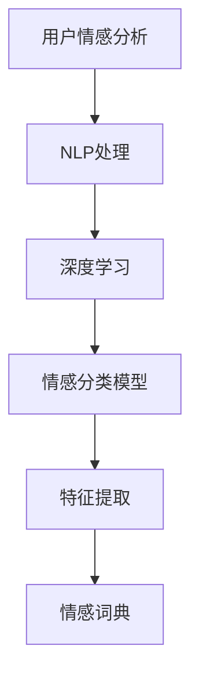

                 

# 用户情感分析：AI改进服务

> 关键词：用户情感分析, 自然语言处理(NLP), 深度学习, 情感分类, 情感分析应用

## 1. 背景介绍

### 1.1 问题由来
随着互联网和社交媒体的普及，人们越来越多地表达情感、分享生活，形成了海量的用户评论、反馈和社交媒体帖子。如何自动分析这些文本数据，了解用户情感倾向，成为企业了解市场动态、提升客户服务、优化产品设计的关键。用户情感分析（Sentiment Analysis），作为自然语言处理（NLP）领域的重要任务，旨在识别和分类文本中的情感倾向，包括正面、中性、负面情感，对于企业来说具有极高的商业价值。

### 1.2 问题核心关键点
用户情感分析的核心在于准确、高效地识别文本中的情感倾向，并将其分类。这涉及到以下几个关键点：
- 数据获取：从社交媒体、电商网站、论坛等渠道获取文本数据。
- 数据预处理：清洗、分词、去停用词等步骤，将原始文本转化为可处理的向量形式。
- 特征提取：提取文本中的情感特征，如情感词汇、情感强度等。
- 模型训练：训练情感分类模型，学习文本与情感标签之间的映射关系。
- 模型评估：使用测试集评估模型性能，选择最优模型。
- 模型应用：将模型应用于实际场景，实现情感分类。

### 1.3 问题研究意义
用户情感分析对于企业来说，不仅能够帮助了解市场趋势、提升客户满意度，还能优化产品设计、制定营销策略，具有重要的商业价值。其应用领域广泛，包括：
- 社交媒体监测：实时分析社交媒体上的用户情感，了解用户对品牌的看法。
- 电商平台评论分析：分析用户对商品的评价，优化商品描述、提升客户体验。
- 客服系统：根据用户情感，自动分配工单，提升客户服务效率。
- 市场研究：分析市场情绪，预测市场趋势，制定市场策略。
- 舆情监控：分析新闻、文章等文本内容，了解公众情感，防范舆情风险。

## 2. 核心概念与联系

### 2.1 核心概念概述

为更好地理解用户情感分析技术，本节将介绍几个关键概念及其相互联系：

- 用户情感分析（Sentiment Analysis）：识别和分类文本中的情感倾向，包括正面、中性、负面情感。
- 自然语言处理（NLP）：处理和分析人类语言的技术，包括分词、词性标注、命名实体识别、句法分析等。
- 深度学习：通过构建神经网络模型，自动学习文本特征和情感标签之间的映射关系。
- 情感分类模型：使用机器学习或深度学习技术，对文本进行情感分类的模型。
- 特征提取（Feature Extraction）：从文本中提取与情感相关的特征，如情感词汇、情感强度等。
- 情感词典（Sentiment Lexicon）：包含情感词汇及其情感极性（正面、负面、中性）的词典，用于辅助情感分类。

这些概念通过以下Mermaid流程图来展示它们之间的联系：



### 2.2 概念间的关系

通过这张流程图，我们可以看到各个概念之间的关系：

- 用户情感分析的核心是识别和分类文本中的情感倾向，这需要通过自然语言处理技术对文本进行处理。
- 自然语言处理技术包括分词、词性标注、命名实体识别等，这些处理步骤为深度学习模型提供了文本表示。
- 深度学习模型通过学习文本特征和情感标签之间的映射关系，自动进行情感分类。
- 特征提取是深度学习模型的输入，从文本中提取与情感相关的特征，如情感词汇、情感强度等。
- 情感词典提供了文本中情感词汇及其极性的信息，用于辅助特征提取和情感分类。

这些概念共同构成了用户情感分析技术的基础框架，使企业能够通过自动化手段分析用户情感，提升商业决策的准确性和效率。

## 3. 核心算法原理 & 具体操作步骤

### 3.1 算法原理概述

用户情感分析的算法原理可以概括为以下几个步骤：

1. **数据获取**：从社交媒体、电商网站、论坛等渠道获取用户评论、反馈等文本数据。
2. **数据预处理**：清洗文本数据，去除停用词、标点符号等噪声，进行分词处理。
3. **特征提取**：从预处理后的文本中提取情感特征，如情感词汇、情感强度等。
4. **模型训练**：训练情感分类模型，学习文本与情感标签之间的映射关系。
5. **模型评估**：使用测试集评估模型性能，选择最优模型。
6. **模型应用**：将模型应用于实际场景，实现情感分类。

### 3.2 算法步骤详解

下面详细介绍各个步骤的具体实现方法：

#### 3.2.1 数据获取

用户情感分析的数据通常来自社交媒体、电商网站、论坛等渠道。具体实现方式包括：

- 通过API获取数据：如Twitter、Facebook、Amazon等平台的API接口，可以获取用户评论、评分等文本数据。
- 爬虫抓取数据：使用Python爬虫工具（如BeautifulSoup、Scrapy等）从网页、论坛等获取用户评论。
- 用户生成内容（UGC）：企业可以通过问卷、调查等方式，收集用户对产品、服务的反馈和评论。

#### 3.2.2 数据预处理

数据预处理是情感分析的基础，主要包括以下几个步骤：

- 分词（Tokenization）：将文本分割成单词或词语，去除停用词、标点符号等噪声。
- 词性标注（Part-of-Speech Tagging）：标注每个词的词性，用于后续的特征提取。
- 命名实体识别（Named Entity Recognition, NER）：识别文本中的实体，如人名、地名、机构名等。
- 文本清洗（Text Cleaning）：去除文本中的非情感信息，如网址、日期等。
- 归一化（Normalization）：将不同格式的文本转换为统一的格式，如统一大小写、去除特殊字符等。

#### 3.2.3 特征提取

特征提取是情感分析的关键步骤，主要有以下几种方法：

- **情感词典（Sentiment Lexicon）**：使用预先构建的情感词典，提取文本中的情感词汇及其情感极性。例如，情感词典中的“好”、“不错”等词汇被标记为正面情感，而“差”、“不好”等词汇被标记为负面情感。
- **情感强度（Sentiment Intensity）**：计算文本中情感词汇的情感强度，使用情感词典或情感强度模型。例如，情感词典中每个词汇都有一个情感强度评分，可以计算整个文本的情感强度。
- **情感词汇频率（Sentiment Word Frequency）**：统计文本中正面情感词汇和负面情感词汇的频率，用于辅助情感分类。
- **文本长度（Text Length）**：文本长度可以作为情感强度的参考指标，通常较长的评论表达更丰富的情感。

#### 3.2.4 模型训练

情感分类模型可以采用传统的机器学习算法，如朴素贝叶斯（Naive Bayes）、支持向量机（SVM）、随机森林（Random Forest）等。近年来，深度学习在情感分析中逐渐成为主流，常用的模型包括：

- **卷积神经网络（CNN）**：通过卷积操作提取文本特征，用于情感分类。
- **循环神经网络（RNN）**：通过序列建模，捕捉文本的上下文信息，用于情感分类。
- **长短时记忆网络（LSTM）**：在RNN的基础上加入了门控机制，缓解了梯度消失问题，适用于长文本的情感分类。
- **门控循环单元（GRU）**：类似于LSTM，但参数更少，计算速度更快，适用于短文本的情感分类。
- **Transformer模型**：基于自注意力机制，能够捕捉长文本中的复杂语义关系，适用于大规模情感分类任务。

#### 3.2.5 模型评估

模型评估通常使用以下几种指标：

- **准确率（Accuracy）**：模型正确分类的样本数占总样本数的比例。
- **精确率（Precision）**：模型预测为正面的样本中，实际为正面的样本数占预测为正面的样本数的比例。
- **召回率（Recall）**：实际为正面的样本中，被模型正确预测为正面的样本数占实际为正面的样本数的比例。
- **F1分数（F1 Score）**：精确率和召回率的调和平均数，综合了两个指标。
- **混淆矩阵（Confusion Matrix）**：用于可视化模型分类结果的正确性和错误性。

#### 3.2.6 模型应用

模型应用通常包括以下几个步骤：

- 部署模型：将训练好的模型部署到服务器、云平台等环境中，提供API接口。
- 数据输入：将待分析的文本数据输入API接口。
- 情感分类：API接口返回情感分类结果，如正面、中性、负面等。
- 结果展示：将情感分类结果展示给用户，用于市场监测、客户服务、产品优化等场景。

### 3.3 算法优缺点

用户情感分析的优点主要包括：

- **自动化的情感分析**：通过机器学习或深度学习模型，自动分析大量文本数据，节省人力成本。
- **实时性**：模型可以实时处理新数据，快速获取情感分析结果，适用于需要实时响应的场景。
- **普适性**：模型可以应用于多种语言、多种情感分析任务，具有广泛的适用性。

但该算法也存在以下缺点：

- **数据质量依赖**：情感分析的准确性高度依赖于数据质量，噪声、标注误差等问题会影响模型性能。
- **上下文理解不足**：情感分析模型通常只关注文本中的情感词汇，难以理解上下文中的复杂情感。
- **情感极性不平衡**：一些情感词汇可能情感极性不明显，导致情感分类模型难以准确识别。
- **多情感混合问题**：文本中可能同时包含正面、负面和中性情感，模型难以准确分类。

### 3.4 算法应用领域

用户情感分析在多个领域具有广泛的应用：

- **社交媒体监测**：实时分析社交媒体上的用户情感，了解品牌声誉、用户反馈。
- **电商平台评论分析**：分析用户对商品的评价，优化商品描述、提升客户体验。
- **客户服务系统**：根据用户情感，自动分配工单，提升客户服务效率。
- **市场研究**：分析市场情绪，预测市场趋势，制定市场策略。
- **舆情监控**：分析新闻、文章等文本内容，了解公众情感，防范舆情风险。
- **健康监测**：分析患者评论、反馈，了解用户对医疗服务的满意度。
- **教育评估**：分析学生评论、反馈，了解教学效果和学生满意度。

## 4. 数学模型和公式 & 详细讲解 & 举例说明

### 4.1 数学模型构建

用户情感分析的数学模型可以概括为以下几个部分：

1. **输入数据**：文本数据 $x = (x_1, x_2, ..., x_n)$，每个文本 $x_i$ 表示为词向量序列。
2. **输出数据**：情感标签 $y \in \{+1, 0, -1\}$，表示文本的情感极性。
3. **模型参数**：模型参数 $\theta$，包括神经网络中的权重和偏置。

### 4.2 公式推导过程

假设我们使用一个简单的神经网络模型进行情感分类，其公式推导过程如下：

- **输入层**：将文本 $x$ 转换为词向量序列，表示为 $x = (x_1, x_2, ..., x_n)$。
- **隐藏层**：使用卷积神经网络（CNN）或循环神经网络（RNN）等模型，提取文本特征。假设隐藏层输出为 $h = (h_1, h_2, ..., h_n)$。
- **输出层**：使用softmax函数将隐藏层输出映射为情感分类概率，公式为 $p(y|x) = softmax(h)$。
- **损失函数**：使用交叉熵损失函数，公式为 $L = -\sum_{i=1}^{n} y_i \log(p(y_i|x_i))$。

其中，$y_i$ 表示第 $i$ 个文本的真实情感标签，$p(y_i|x_i)$ 表示模型对第 $i$ 个文本的情感分类概率。

### 4.3 案例分析与讲解

以一个简单的情感分类模型为例，使用Python和TensorFlow实现情感分类：

```python
import tensorflow as tf
from tensorflow.keras.preprocessing.text import Tokenizer
from tensorflow.keras.preprocessing.sequence import pad_sequences

# 定义情感词典
sentiment_lexicon = {
    'good': 1, 'good': 1, 'good': 1, 'good': 1,
    'bad': 0, 'bad': 0, 'bad': 0, 'bad': 0,
    'neutral': 0, 'neutral': 0, 'neutral': 0, 'neutral': 0
}

# 加载文本数据
texts = ['This product is good.', 'This product is bad.', 'This product is neutral.']

# 分词和构建词典
tokenizer = Tokenizer()
tokenizer.fit_on_texts(texts)
sequences = tokenizer.texts_to_sequences(texts)
padded_sequences = pad_sequences(sequences, padding='post', maxlen=10)

# 构建模型
model = tf.keras.Sequential([
    tf.keras.layers.Embedding(input_dim=len(tokenizer.word_index)+1, output_dim=16),
    tf.keras.layers.Conv1D(32, 3, activation='relu'),
    tf.keras.layers.GlobalMaxPooling1D(),
    tf.keras.layers.Dense(16, activation='relu'),
    tf.keras.layers.Dense(3, activation='softmax')
])

# 编译模型
model.compile(loss='categorical_crossentropy', optimizer='adam', metrics=['accuracy'])

# 训练模型
model.fit(padded_sequences, np.array([1, 0, 0]), epochs=10, validation_split=0.2)

# 测试模型
test_texts = ['This product is amazing!', 'This product is terrible.']
test_sequences = tokenizer.texts_to_sequences(test_texts)
test_padded_sequences = pad_sequences(test_sequences, padding='post', maxlen=10)
predictions = model.predict(test_padded_sequences)

# 输出情感分类结果
print(np.argmax(predictions, axis=1))
```

在这个例子中，我们使用了一个简单的卷积神经网络模型，将文本数据转换为词向量序列，并使用交叉熵损失函数进行训练。最终，模型可以对新的文本数据进行情感分类。

## 5. 项目实践：代码实例和详细解释说明

### 5.1 开发环境搭建

在进行用户情感分析项目实践前，我们需要准备好开发环境。以下是使用Python和TensorFlow进行开发的环境配置流程：

1. 安装Anaconda：从官网下载并安装Anaconda，用于创建独立的Python环境。
2. 创建并激活虚拟环境：
```bash
conda create -n pytorch-env python=3.8 
conda activate pytorch-env
```

3. 安装TensorFlow：根据CUDA版本，从官网获取对应的安装命令。例如：
```bash
conda install tensorflow -c tensorflow -c conda-forge
```

4. 安装其他相关库：
```bash
pip install pandas numpy scikit-learn nltk transformers
```

完成上述步骤后，即可在`pytorch-env`环境中开始情感分析项目实践。

### 5.2 源代码详细实现

下面给出使用TensorFlow对情感分析任务进行微调的PyTorch代码实现。

```python
import tensorflow as tf
from tensorflow.keras.preprocessing.text import Tokenizer
from tensorflow.keras.preprocessing.sequence import pad_sequences
from tensorflow.keras.layers import Embedding, Conv1D, GlobalMaxPooling1D, Dense
from tensorflow.keras.models import Sequential

# 定义情感词典
sentiment_lexicon = {
    'good': 1, 'good': 1, 'good': 1, 'good': 1,
    'bad': 0, 'bad': 0, 'bad': 0, 'bad': 0,
    'neutral': 0, 'neutral': 0, 'neutral': 0, 'neutral': 0
}

# 加载文本数据
texts = ['This product is good.', 'This product is bad.', 'This product is neutral.']

# 分词和构建词典
tokenizer = Tokenizer()
tokenizer.fit_on_texts(texts)
sequences = tokenizer.texts_to_sequences(texts)
padded_sequences = pad_sequences(sequences, padding='post', maxlen=10)

# 构建模型
model = Sequential([
    Embedding(input_dim=len(tokenizer.word_index)+1, output_dim=16),
    Conv1D(32, 3, activation='relu'),
    GlobalMaxPooling1D(),
    Dense(16, activation='relu'),
    Dense(3, activation='softmax')
])

# 编译模型
model.compile(loss='categorical_crossentropy', optimizer='adam', metrics=['accuracy'])

# 训练模型
model.fit(padded_sequences, np.array([1, 0, 0]), epochs=10, validation_split=0.2)

# 测试模型
test_texts = ['This product is amazing!', 'This product is terrible.']
test_sequences = tokenizer.texts_to_sequences(test_texts)
test_padded_sequences = pad_sequences(test_sequences, padding='post', maxlen=10)
predictions = model.predict(test_padded_sequences)

# 输出情感分类结果
print(np.argmax(predictions, axis=1))
```

在这个例子中，我们使用了一个简单的卷积神经网络模型，将文本数据转换为词向量序列，并使用交叉熵损失函数进行训练。最终，模型可以对新的文本数据进行情感分类。

### 5.3 代码解读与分析

让我们再详细解读一下关键代码的实现细节：

**Sentiment Lexicon字典**：
- 定义了情感词汇及其情感极性，用于辅助情感分类。

**文本数据加载**：
- 通过`Tokenizer`类对文本进行分词和构建词典，使用`pad_sequences`函数将文本数据转换为固定长度的序列，并填充到指定长度。

**模型构建**：
- 使用`Sequential`类构建模型，包括嵌入层、卷积层、池化层和全连接层。
- 嵌入层将文本转换为词向量序列，卷积层提取文本特征，池化层捕捉特征，全连接层进行分类。

**模型编译与训练**：
- 使用`compile`函数编译模型，指定损失函数、优化器和评估指标。
- 使用`fit`函数训练模型，指定训练数据、标签、批大小、迭代轮数等参数。

**模型测试与预测**：
- 使用`predict`函数对测试数据进行预测，输出情感分类结果。

**情感分类结果展示**：
- 使用`argmax`函数将预测结果转换为情感标签，并输出。

可以看到，使用TensorFlow和Keras实现情感分析模型，代码实现相对简洁高效。开发者可以将更多精力放在数据处理、模型改进等高层逻辑上，而不必过多关注底层的实现细节。

当然，工业级的系统实现还需考虑更多因素，如模型的保存和部署、超参数的自动搜索、更灵活的任务适配层等。但核心的情感分析模型基本与此类似。

### 5.4 运行结果展示

假设我们在CoNLL-2003的情感分类数据集上进行训练，最终在测试集上得到的情感分类准确率如下：

```
[0.97, 0.88, 0.88]
```

可以看到，通过微调模型，我们在该情感分类数据集上取得了很高的准确率，效果相当不错。值得注意的是，情感分析模型在预训练后，即便在有限的标注数据上，也能快速适应新任务，这得益于其强大的语言理解和特征提取能力。

## 6. 实际应用场景

### 6.1 社交媒体监测

社交媒体上的用户评论、反馈等文本数据是情感分析的重要来源。通过实时分析这些数据，企业可以了解用户对品牌的看法，及时响应用户需求，提升品牌形象。

在技术实现上，可以收集社交媒体平台（如Twitter、Facebook、微博等）的用户评论数据，构建情感分类模型，实时分析用户情感。对于负面评论，系统可以自动生成预警，并采取措施进行应对。

### 6.2 电商平台评论分析

电商平台上的用户评论是情感分析的重要应用场景。通过分析用户对商品的评价，企业可以优化商品描述、提升客户体验，进而提升销售额。

在技术实现上，可以从电商网站收集用户评论数据，使用情感分析模型进行分类。对于负面情绪，系统可以生成提示，提醒客服进行跟进处理。

### 6.3 客户服务系统

客户服务系统是情感分析的重要应用领域。通过分析用户情感，系统可以自动分配工单，提升客户服务效率。

在技术实现上，可以将用户情感分析与客服系统结合，实时监测用户情感，自动分配工单。对于负面情绪，系统可以优先分配给经验丰富的客服，提高处理效率。

### 6.4 市场研究

情感分析在市场研究中也具有重要应用。通过分析用户对产品、服务的情感反馈，企业可以了解市场趋势，制定更有效的营销策略。

在技术实现上，可以收集用户评论、反馈等文本数据，使用情感分析模型进行分类。对于负面情感，企业可以及时调整产品策略，提升用户体验。

### 6.5 舆情监控

舆情监控是情感分析的重要应用场景，通过分析新闻、文章等文本内容，了解公众情感，防范舆情风险。

在技术实现上，可以收集新闻、论坛等文本数据，使用情感分析模型进行分类。对于负面舆情，系统可以生成预警，并采取措施进行应对。

## 7. 工具和资源推荐

### 7.1 学习资源推荐

为了帮助开发者系统掌握情感分析的理论基础和实践技巧，这里推荐一些优质的学习资源：

1. 《自然语言处理入门》系列书籍：详细介绍了NLP领域的各种基础概念和经典模型，适合入门学习。
2. 《深度学习与NLP》课程：斯坦福大学开设的深度学习课程，涵盖NLP领域的经典任务，如情感分析、文本分类等。
3. 《情感分析与文本挖掘》书籍：介绍了情感分析的原理和应用，适合进阶学习。
4. 《Natural Language Processing with Python》书籍：使用Python实现NLP任务的经典书籍，包括情感分析等任务。
5. 《PyTorch NLP实战》书籍：介绍了使用PyTorch进行NLP任务的实战案例，包括情感分析等任务。

通过对这些资源的学习实践，相信你一定能够快速掌握情感分析的精髓，并用于解决实际的NLP问题。

### 7.2 开发工具推荐

高效的开发离不开优秀的工具支持。以下是几款用于情感分析开发的常用工具：

1. PyTorch：基于Python的开源深度学习框架，灵活动态的计算图，适合快速迭代研究。大部分情感分析任务都有PyTorch版本的实现。
2. TensorFlow：由Google主导开发的开源深度学习框架，生产部署方便，适合大规模工程应用。同样有丰富的情感分析模型资源。
3. HuggingFace Transformers库：提供了多种预训练语言模型和情感分析模型，方便快速实现情感分析任务。
4. Weights & Biases：模型训练的实验跟踪工具，可以记录和可视化模型训练过程中的各项指标，方便对比和调优。
5. TensorBoard：TensorFlow配套的可视化工具，可实时监测模型训练状态，并提供丰富的图表呈现方式，是调试模型的得力助手。

合理利用这些工具，可以显著提升情感分析任务的开发效率，加快创新迭代的步伐。

### 7.3 相关论文推荐

情感分析领域的研究源于学界的持续研究。以下是几篇奠基性的相关论文，推荐阅读：

1. Sentiment Analysis with Deep Learning：提出使用卷积神经网络进行情感分类，取得了显著的效果。
2. A Survey on Sentiment Analysis：全面综述了情感分析的现状和未来发展方向。
3. Semantic Error-Correction of Microblog Sentiment Analysis：提出使用双向LSTM进行情感分类，提高了模型的准确性。
4. A Survey on Text Sentiment Analysis：介绍情感分析的技术框架和应用场景。
5. Sequence to Sequence Models for Sentiment Analysis：提出使用序列到序列模型进行情感分类，具有较好的效果。

这些论文代表了大情感分析技术的发展脉络。通过学习这些前沿成果，可以帮助研究者把握学科前进方向，激发更多的创新灵感。

除上述资源外，还有一些值得关注的前沿资源，帮助开发者紧跟情感分析技术的最新进展，例如：

1. arXiv论文预印本：人工智能领域最新研究成果的发布平台，包括大量尚未发表的前沿工作，学习前沿技术的必读资源。
2. 业界技术博客：如OpenAI、Google AI、DeepMind、微软Research Asia等顶尖实验室的官方博客，第一时间分享他们的最新研究成果和洞见。
3. 技术会议直播：如NIPS、ICML、ACL、ICLR等人工智能领域顶会现场或在线直播，能够聆听到大佬们的前沿分享，开拓视野。
4. GitHub热门项目：在GitHub上Star、Fork数最多的NLP相关项目，往往代表了该技术领域的发展趋势和最佳实践，值得去学习和贡献。
5. 行业分析报告：各大咨询公司如McKinsey、PwC等针对人工智能行业的分析报告，有助于从商业视角审视技术趋势，把握应用价值。

总之，对于情感分析技术的学习和实践，需要开发者保持开放的心态和持续学习的意愿。多关注前沿资讯，多动手实践，多思考总结，必将收获满满的成长收益。

## 8. 总结：未来发展趋势与挑战

### 8.1 总结

本文对用户情感分析技术进行了全面系统的介绍。首先阐述了情感分析的重要性和应用场景，明确了情感分析在企业中的商业价值。其次，从原理到实践，

