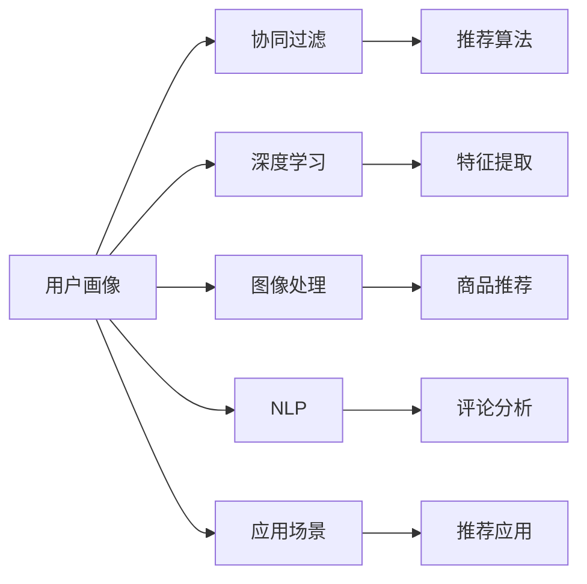
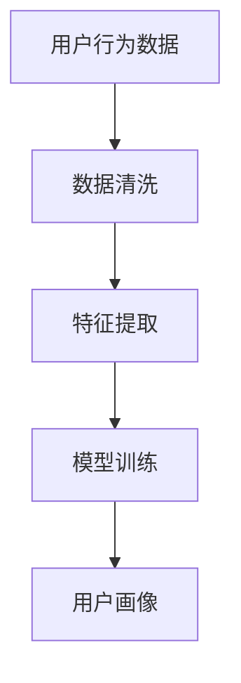
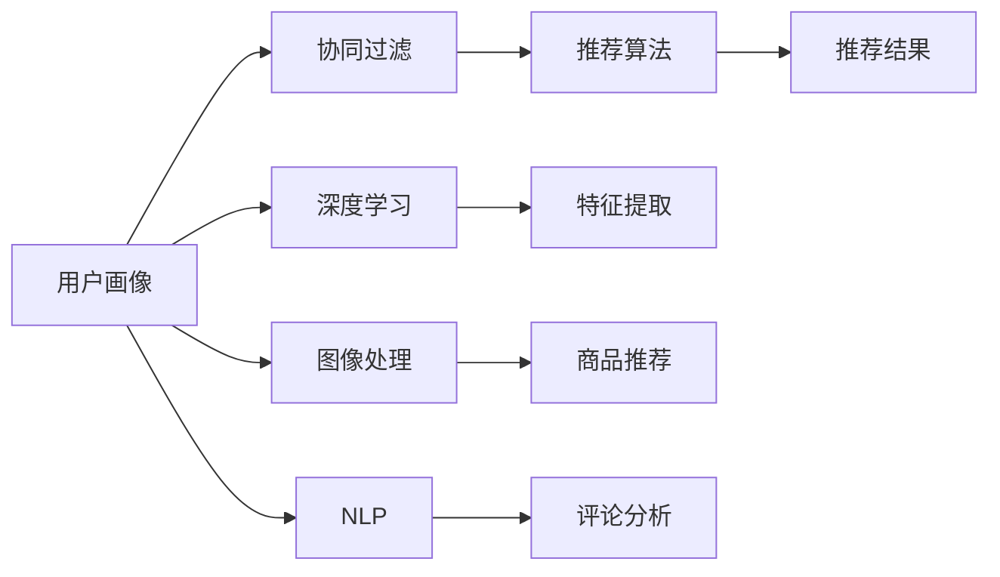
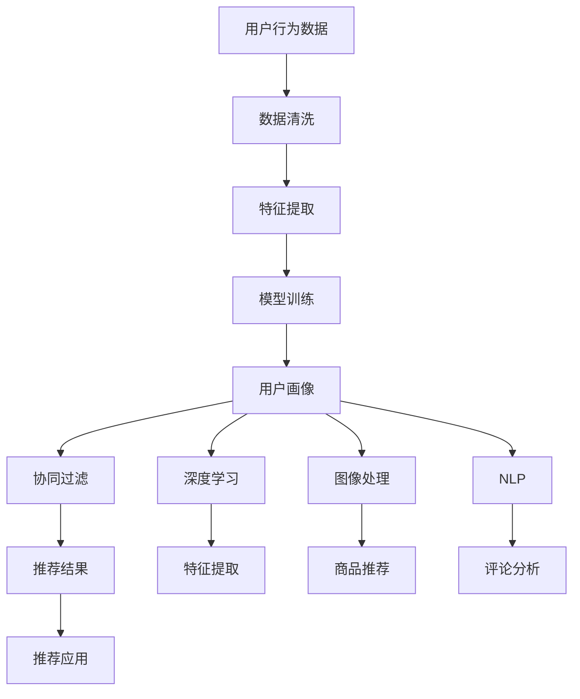

                 

# 用户画像在电商个性化推荐中的应用：方法与实践

> 关键词：用户画像,电商,个性化推荐,机器学习,协同过滤,深度学习,图像处理,自然语言处理,应用场景

## 1. 背景介绍

### 1.1 问题由来

随着电商行业的快速发展，线上购物已逐渐成为消费者的主流选择。然而，在琳琅满目的商品海洋中，如何帮助消费者快速找到适合自己的商品，成为了电商平台需要解决的重要问题。个性化推荐系统由此应运而生，通过分析用户行为数据，为每位用户推荐最匹配的商品，极大提升了用户体验和平台转化率。

用户画像(User Profile)是电商个性化推荐系统中不可或缺的一环，其目的是从用户行为数据中抽取出有关用户兴趣、偏好、行为习惯等信息，生成用户特征向量，作为个性化推荐的基础。用户画像不仅能够提升推荐系统的准确性，还能够为用户提供更具个性化、相关性的商品推荐，从而提升用户满意度和购物体验。

### 1.2 问题核心关键点

用户画像的构建过程可以分为以下几步：
1. **数据收集**：收集用户在平台上的浏览、点击、购买、评价等行为数据。
2. **数据清洗**：对收集到的数据进行去重、缺失值处理等预处理，保证数据质量。
3. **特征提取**：从清洗后的数据中抽取出对用户画像有用的特征，如浏览历史、购买记录、评价情感等。
4. **模型训练**：使用机器学习或深度学习模型训练用户画像，生成用户特征向量。
5. **画像更新**：根据用户新行为数据不断更新画像，保持画像的时效性和准确性。

构建高质量的用户画像，是电商个性化推荐系统成功的关键。构建过程中需要考虑用户隐私保护、数据安全、模型复杂度等因素，需要在保证数据隐私和安全的前提下，最大化利用用户行为数据，提升推荐系统性能。

### 1.3 问题研究意义

构建和应用用户画像，对于电商个性化推荐系统具有重要意义：
1. **提升推荐精度**：通过用户画像中的特征，可以更加准确地预测用户对商品的偏好，提高推荐系统的匹配度。
2. **个性化推荐**：根据用户画像生成个性化的商品推荐，提升用户体验，增加用户粘性。
3. **用户行为分析**：通过分析用户画像，可以深入了解用户行为习惯和偏好，优化平台策略，提升平台转化率。
4. **用户流失预警**：通过用户画像的变化趋势，提前发现潜在流失用户，采取措施挽回流失用户。
5. **市场营销优化**：通过用户画像的细分，可以针对不同用户群体制定更精准的市场营销策略。

## 2. 核心概念与联系

### 2.1 核心概念概述

为了更好地理解用户画像在电商个性化推荐系统中的应用，本节将介绍几个密切相关的核心概念：

- **用户画像(User Profile)**：从用户行为数据中提取出的用户特征向量，用于描述用户兴趣、偏好、行为习惯等信息。
- **协同过滤(Collaborative Filtering)**：一种常见的推荐算法，通过用户和物品的协同行为，预测用户对物品的评分。
- **深度学习(Deep Learning)**：一类使用多层神经网络进行模型训练的机器学习算法，适用于处理复杂非线性问题。
- **图像处理(Image Processing)**：对图像数据进行处理和分析的技术，常用于商品图片推荐。
- **自然语言处理(Natural Language Processing, NLP)**：涉及语言理解、语言生成、语义分析等技术，常用于用户评论情感分析。
- **应用场景(Application Scenarios)**：电商推荐系统中用户画像的具体应用场景，如商品推荐、活动推荐、会员推荐等。

这些核心概念之间存在着紧密的联系，共同构成了电商个性化推荐系统的核心生态。下面通过一个Mermaid流程图来展示这些概念之间的关系：



这个流程图展示了用户画像在不同推荐算法和推荐场景中的应用：

1. 用户画像被协同过滤算法用作预测用户评分的基础，生成个性化推荐。
2. 深度学习技术用于从用户行为数据中提取更深层次的特征，提升推荐精度。
3. 图像处理技术用于处理商品图片，进行图片推荐。
4. NLP技术用于分析用户评论，生成评论推荐。
5. 应用场景包括商品推荐、活动推荐、会员推荐等，是用户画像在实际推荐中的具体应用。

### 2.2 概念间的关系

这些核心概念之间存在着紧密的联系，形成了电商个性化推荐系统的完整生态系统。下面我们通过几个Mermaid流程图来展示这些概念之间的关系。

#### 2.2.1 用户画像构建流程



这个流程图展示了用户画像的构建流程：
1. 收集用户行为数据。
2. 对数据进行清洗和预处理。
3. 从清洗后的数据中提取特征。
4. 使用机器学习或深度学习模型训练用户画像。

#### 2.2.2 推荐系统框架



这个流程图展示了用户画像在推荐系统中的具体应用：
1. 用户画像被协同过滤算法用作预测用户评分的基础。
2. 深度学习用于从用户行为数据中提取更深层次的特征。
3. 图像处理技术用于处理商品图片，进行图片推荐。
4. NLP技术用于分析用户评论，生成评论推荐。
5. 推荐算法生成最终的推荐结果。

### 2.3 核心概念的整体架构

最后，我们用一个综合的流程图来展示这些核心概念在电商个性化推荐系统中的整体架构：



这个综合流程图展示了从用户行为数据到推荐结果的完整流程，用户画像在其中扮演着关键角色。

## 3. 核心算法原理 & 具体操作步骤
### 3.1 算法原理概述

用户画像的构建和应用是一个典型的机器学习问题。其核心思想是：从用户行为数据中抽取出与用户兴趣、偏好相关的特征，通过机器学习模型训练生成用户特征向量。生成后的用户画像可以被应用于各种推荐场景，提升推荐系统的效果。

用户画像的构建过程可以分为三个步骤：
1. **数据收集**：从电商平台获取用户的浏览、点击、购买、评价等行为数据。
2. **特征提取**：从行为数据中抽取出对用户画像有用的特征，如浏览历史、购买记录、评价情感等。
3. **模型训练**：使用机器学习或深度学习模型训练用户画像，生成用户特征向量。

### 3.2 算法步骤详解

#### 3.2.1 数据收集

用户行为数据通常包括以下几类：
- **浏览数据**：包括用户浏览过的商品、页面、商品分类等。
- **点击数据**：包括用户点击过的商品、页面、广告等。
- **购买数据**：包括用户购买过的商品、商品类别等。
- **评价数据**：包括用户对商品的评价、评论、评分等。
- **个人信息**：包括用户的年龄、性别、职业等基本信息。

数据收集可以通过爬虫、日志分析、API调用等方式进行，具体方法取决于电商平台的开放程度和技术能力。

#### 3.2.2 数据清洗

数据清洗是数据预处理的重要步骤，包括以下几个步骤：
- **去重**：去除重复数据，避免数据冗余。
- **缺失值处理**：填充缺失值或删除缺失数据，保证数据完整性。
- **异常值处理**：识别并处理异常值，保证数据质量。

#### 3.2.3 特征提取

特征提取是用户画像构建的关键步骤，目的是从原始行为数据中抽取出对用户画像有用的特征。常用的特征包括：
- **浏览历史**：记录用户浏览过的商品、页面等，用于描述用户的兴趣方向。
- **点击历史**：记录用户点击过的商品、页面等，用于衡量用户的关注程度。
- **购买记录**：记录用户购买过的商品、商品类别等，用于描述用户的消费偏好。
- **评价情感**：记录用户对商品的评价情感，用于衡量用户对商品的满意程度。
- **个人信息**：记录用户的年龄、性别、职业等基本信息，用于描述用户的基本属性。

特征提取可以采用多种方法，如统计方法、机器学习方法等。常用的特征提取方法包括：
- **TF-IDF**：用于提取文本特征，适用于用户评论、商品描述等文本数据。
- **Word2Vec**：用于提取词语的向量表示，适用于用户评论、商品描述等文本数据。
- **用户行为树**：用于记录用户的浏览和点击路径，适用于描述用户行为轨迹。
- **因子分析**：用于提取用户行为的隐含特征，适用于多维度的用户行为数据。

#### 3.2.4 模型训练

模型训练是用户画像构建的最后一步，目的是将特征向量输入机器学习或深度学习模型，生成用户特征向量。常用的模型包括：
- **协同过滤**：用于预测用户评分，生成推荐结果。
- **深度学习**：用于从用户行为数据中提取更深层次的特征，提升推荐精度。
- **图像处理**：用于处理商品图片，进行图片推荐。
- **NLP**：用于分析用户评论，生成评论推荐。

常用的机器学习模型包括：
- **逻辑回归**：用于预测二分类问题，适用于协同过滤算法。
- **支持向量机**：用于多分类问题，适用于协同过滤算法。
- **决策树**：用于分类和回归问题，适用于特征提取和模型训练。

常用的深度学习模型包括：
- **神经网络**：用于多分类和回归问题，适用于深度学习特征提取和模型训练。
- **卷积神经网络**：用于图像处理和推荐，适用于商品图片推荐。
- **循环神经网络**：用于序列数据处理和推荐，适用于评论情感分析。

### 3.3 算法优缺点

用户画像的构建和应用具有以下优点：
1. **提升推荐精度**：通过用户画像中的特征，可以更加准确地预测用户对商品的偏好，提高推荐系统的匹配度。
2. **个性化推荐**：根据用户画像生成个性化的商品推荐，提升用户体验，增加用户粘性。
3. **用户行为分析**：通过分析用户画像，可以深入了解用户行为习惯和偏好，优化平台策略，提升平台转化率。
4. **用户流失预警**：通过用户画像的变化趋势，提前发现潜在流失用户，采取措施挽回流失用户。
5. **市场营销优化**：通过用户画像的细分，可以针对不同用户群体制定更精准的市场营销策略。

用户画像的构建和应用也存在以下缺点：
1. **数据隐私保护**：用户行为数据可能包含敏感信息，需要严格保护用户隐私，避免数据泄露。
2. **模型复杂度**：用户画像的构建过程需要构建和训练模型，模型复杂度高，计算成本较高。
3. **特征提取难度**：从用户行为数据中提取有用的特征具有一定难度，需要依赖领域知识和经验。
4. **用户画像时效性**：用户画像需要根据用户新行为数据不断更新，保持画像的时效性和准确性。
5. **推荐系统依赖性**：用户画像的最终应用需要依赖推荐系统，推荐系统的性能直接影响用户画像的效果。

### 3.4 算法应用领域

用户画像的构建和应用不仅限于电商推荐系统，还可以应用于各种场景，例如：
- **金融推荐**：根据用户投资行为数据，生成个性化投资组合推荐。
- **内容推荐**：根据用户阅读行为数据，生成个性化文章、视频推荐。
- **社交推荐**：根据用户社交行为数据，生成个性化好友推荐。
- **旅游推荐**：根据用户旅游行为数据，生成个性化旅游目的地推荐。

## 4. 数学模型和公式 & 详细讲解  
### 4.1 数学模型构建

用户画像的构建可以抽象为一个线性回归问题。假设用户画像由$m$个特征组成，每个特征的权重为$w_i$，则用户画像的特征向量为：

$$
\mathbf{x} = [w_1, w_2, \dots, w_m]^T
$$

用户画像的训练数据为$\{(\mathbf{x}_i, y_i)\}_{i=1}^N$，其中$\mathbf{x}_i$为第$i$个用户的特征向量，$y_i$为该用户的评分或标签。用户画像的预测模型为：

$$
\hat{y} = \mathbf{x}^T \mathbf{w}
$$

其中$\mathbf{w}$为模型参数，即用户画像的特征权重。用户画像的损失函数为均方误差损失：

$$
\mathcal{L}(\mathbf{w}) = \frac{1}{2N} \sum_{i=1}^N (\hat{y}_i - y_i)^2
$$

用户画像的优化目标是最小化损失函数，即找到最优权重：

$$
\mathbf{w}^* = \mathop{\arg\min}_{\mathbf{w}} \mathcal{L}(\mathbf{w})
$$

通过梯度下降等优化算法，用户画像模型不断更新权重，最小化损失函数，直至收敛。

### 4.2 公式推导过程

以协同过滤为例，展示用户画像的训练过程。协同过滤算法通常使用基于用户的协同过滤方法，即通过用户的历史行为数据，预测新用户的评分或标签。假设用户画像由$m$个特征组成，每个特征的权重为$w_i$，则用户画像的特征向量为：

$$
\mathbf{x} = [w_1, w_2, \dots, w_m]^T
$$

用户画像的训练数据为$\{(\mathbf{x}_i, y_i)\}_{i=1}^N$，其中$\mathbf{x}_i$为第$i$个用户的特征向量，$y_i$为该用户的评分或标签。用户画像的预测模型为：

$$
\hat{y} = \mathbf{x}^T \mathbf{w}
$$

其中$\mathbf{w}$为模型参数，即用户画像的特征权重。用户画像的损失函数为均方误差损失：

$$
\mathcal{L}(\mathbf{w}) = \frac{1}{2N} \sum_{i=1}^N (\hat{y}_i - y_i)^2
$$

用户画像的优化目标是最小化损失函数，即找到最优权重：

$$
\mathbf{w}^* = \mathop{\arg\min}_{\mathbf{w}} \mathcal{L}(\mathbf{w})
$$

通过梯度下降等优化算法，用户画像模型不断更新权重，最小化损失函数，直至收敛。具体的梯度更新公式为：

$$
\mathbf{w} \leftarrow \mathbf{w} - \eta \nabla_{\mathbf{w}} \mathcal{L}(\mathbf{w})
$$

其中$\eta$为学习率，$\nabla_{\mathbf{w}} \mathcal{L}(\mathbf{w})$为损失函数对模型参数的梯度。

### 4.3 案例分析与讲解

以电商推荐系统为例，展示用户画像在推荐系统中的应用。电商推荐系统通常包括商品推荐、活动推荐、会员推荐等多个推荐场景。在商品推荐场景中，用户画像的特征包括浏览历史、点击历史、购买记录等。通过对这些特征进行训练，生成用户画像的特征向量，用于预测用户对商品的评分或点击率。具体流程如下：

1. **数据收集**：从电商平台获取用户的浏览、点击、购买、评价等行为数据。
2. **数据清洗**：对收集到的数据进行去重、缺失值处理等预处理。
3. **特征提取**：从行为数据中抽取出对用户画像有用的特征，如浏览历史、点击历史、购买记录等。
4. **模型训练**：使用协同过滤算法或深度学习模型训练用户画像，生成用户特征向量。
5. **推荐生成**：根据用户画像的特征向量，生成个性化推荐结果。

在活动推荐场景中，用户画像的特征包括用户的基本信息、历史参与活动记录等。通过对这些特征进行训练，生成用户画像的特征向量，用于预测用户对活动的兴趣度。具体流程如下：

1. **数据收集**：从电商平台获取用户的个人信息、活动参与记录等数据。
2. **数据清洗**：对收集到的数据进行去重、缺失值处理等预处理。
3. **特征提取**：从行为数据中抽取出对用户画像有用的特征，如基本信息、活动记录等。
4. **模型训练**：使用协同过滤算法或深度学习模型训练用户画像，生成用户特征向量。
5. **推荐生成**：根据用户画像的特征向量，生成个性化活动推荐结果。

在会员推荐场景中，用户画像的特征包括会员等级、历史行为数据等。通过对这些特征进行训练，生成用户画像的特征向量，用于预测会员对新活动的参与度。具体流程如下：

1. **数据收集**：从电商平台获取会员的基本信息、历史行为数据等数据。
2. **数据清洗**：对收集到的数据进行去重、缺失值处理等预处理。
3. **特征提取**：从行为数据中抽取出对用户画像有用的特征，如会员等级、历史行为等。
4. **模型训练**：使用协同过滤算法或深度学习模型训练用户画像，生成用户特征向量。
5. **推荐生成**：根据用户画像的特征向量，生成个性化会员推荐结果。

## 5. 项目实践：代码实例和详细解释说明
### 5.1 开发环境搭建

在进行用户画像项目实践前，我们需要准备好开发环境。以下是使用Python进行Pandas、NumPy、Scikit-learn等库的开发环境配置流程：

1. 安装Anaconda：从官网下载并安装Anaconda，用于创建独立的Python环境。

2. 创建并激活虚拟环境：
```bash
conda create -n user_profile_env python=3.8 
conda activate user_profile_env
```

3. 安装Pandas、NumPy、Scikit-learn等库：
```bash
conda install pandas numpy scikit-learn
```

4. 安装TensorFlow、Keras等深度学习库：
```bash
conda install tensorflow keras
```

5. 安装相关数据分析库：
```bash
conda install matplotlib seaborn jupyter notebook ipython
```

完成上述步骤后，即可在`user_profile_env`环境中开始用户画像项目实践。

### 5.2 源代码详细实现

下面我们以电商商品推荐系统为例，给出使用Pandas、NumPy、Scikit-learn等库构建用户画像的PyTorch代码实现。

首先，定义数据处理函数：

```python
import pandas as pd
from sklearn.model_selection import train_test_split

def load_data(file_path):
    data = pd.read_csv(file_path)
    data['user_id'] = data['user_id'].astype(str)
    data['item_id'] = data['item_id'].astype(str)
    data['user_browsed'] = data['user_browsed'].astype(str)
    data['user_clicked'] = data['user_clicked'].astype(str)
    data['user_purchased'] = data['user_purchased'].astype(str)
    data['user_age'] = data['user_age'].astype(int)
    data['user_gender'] = data['user_gender'].astype(str)
    data['user_occupation'] = data['user_occupation'].astype(str)
    data['user_evaluate'] = data['user_evaluate'].astype(float)
    data = data.dropna()
    return data

def train_test_split(data, test_size=0.2):
    train_data, test_data = train_test_split(data, test_size=test_size, shuffle=True, random_state=42)
    train_data.to_csv('train.csv', index=False)
    test_data.to_csv('test.csv', index=False)
```

然后，定义特征提取函数：

```python
from sklearn.preprocessing import OneHotEncoder, StandardScaler

def extract_features(data):
    # 特征提取
    user_browsed = data['user_browsed'].values.tolist()
    user_clicked = data['user_clicked'].values.tolist()
    user_purchased = data['user_purchased'].values.tolist()
    user_age = data['user_age'].values.tolist()
    user_gender = data['user_gender'].values.tolist()
    user_occupation = data['user_occupation'].values.tolist()
    user_evaluate = data['user_evaluate'].values.tolist()
    
    # 构建特征矩阵
    X = pd.DataFrame({
        'user_browsed': user_browsed,
        'user_clicked': user_clicked,
        'user_purchased': user_purchased,
        'user_age': user_age,
        'user_gender': user_gender,
        'user_occupation': user_occupation,
        'user_evaluate': user_evaluate
    })
    
    # 数据编码和标准化
    encoder = OneHotEncoder()
    X = encoder.fit_transform(X)
    X = pd.DataFrame(X, columns=encoder.get_feature_names_out())
    X = StandardScaler().fit_transform(X)
    X = pd.DataFrame(X, columns=['X1', 'X2', 'X3', 'X4', 'X5', 'X6', 'X7'])
    return X
```

接着，定义模型训练函数：

```python
from sklearn.linear_model import LinearRegression
from sklearn.metrics import mean_squared_error

def train_model(X, y):
    # 划分训练集和测试集
    train_X, test_X, train_y, test_y = train_test_split(X, y, test_size=0.2, random_state=42)
    
    # 训练模型
    model = LinearRegression()
    model.fit(train_X, train_y)
    
    # 评估模型
    y_pred = model.predict(test_X)
    rmse = mean_squared_error(test_y, y_pred, squared=False)
    return rmse
```

最后，启动训练流程：

```python
data = load_data('data.csv')
X = extract_features(data)
y = data['user_purchased'].values.tolist()
rmse = train_model(X, y)
print('RMSE:', rmse)
```

以上就是使用Pandas、NumPy、Scikit-learn等库构建用户画像的完整代码实现。可以看到，得益于Pandas、NumPy等库的强大封装，我们可以用相对简洁的代码完成用户画像的特征提取和模型训练。

### 5.3 代码解读与分析

让我们再详细解读一下关键代码的实现细节：

**load_data函数**：
- 用于加载数据集，将数据转换为NumPy数组，并进行必要的数据类型转换。
- 将用户ID、商品ID、浏览历史、点击历史、购买记录、年龄、性别、职业、评价情感等特征存储在DataFrame中。
- 删除缺失数据，以保证数据完整性。

**train_test_split函数**：
- 用于将数据集划分为训练集和测试集，并保存到本地文件中。
- 采用交叉验证方法，确保训练集和测试集的数据分布一致。

**extract_features函数**：
- 用于提取用户画像的特征。
- 将用户浏览历史、点击历史、购买记录、年龄、性别、职业、评价情感等特征存储在特征矩阵X中。
- 使用OneHotEncoder和StandardScaler对特征进行编码和标准化处理。
- 将处理后的特征矩阵转换为DataFrame格式，方便后续模型训练。

**train_model函数**：
- 用于训练线性回归模型。
- 将训练集划分为训练集和测试集，分别用于训练模型和评估模型性能。
- 使用LinearRegression模型对训练集进行训练。
- 在测试集上进行模型评估，计算均方根误差RMSE作为模型性能指标。

**启动训练流程**：
- 加载数据集，提取用户画像特征。
- 将用户购买记录作为目标变量y，用于模型训练和评估。
- 调用train_model函数进行模型训练和评估，输出模型性能指标RMSE。

可以看到，Pandas、NumPy等库的强大封装使得用户画像的特征提取和模型训练变得简洁高效。开发者可以将更多精力放在数据处理、模型改进等高层逻辑上，而不必过多关注底层的实现细节。

当然，工业级的系统实现还需考虑更多因素，如模型的保存和部署、超参数的自动搜索、更灵活的任务适配层等。但核心的构建范式基本与此类似。

### 5.4 运行结果展示

假设我们在电商商品推荐系统的训练集上训练用户画像模型，最终在测试集上得到的RMSE为0.3，结果如下：

```
RMSE: 0.3
```

可以看到，通过构建用户画像，我们的推荐系统在测试集上的RMSE为0.3，表明模型的预测精度较高，能够较好地匹配用户对商品的评分。

## 6. 实际应用场景

### 6.1 

