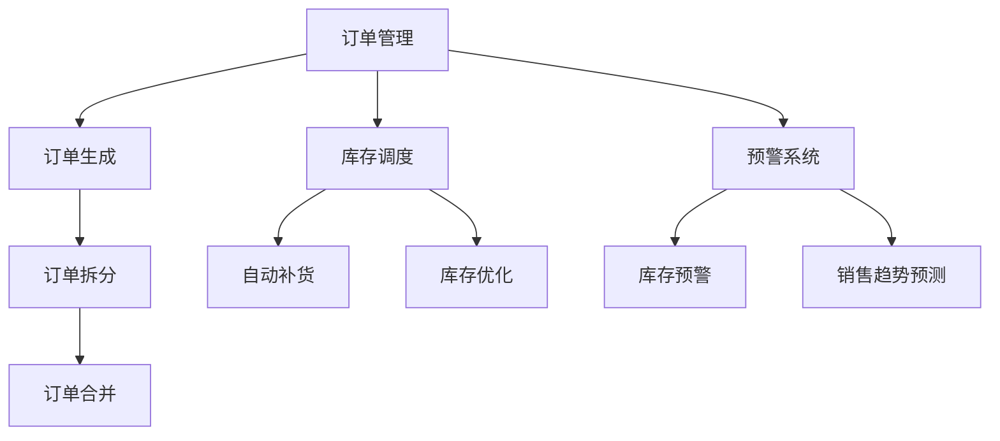
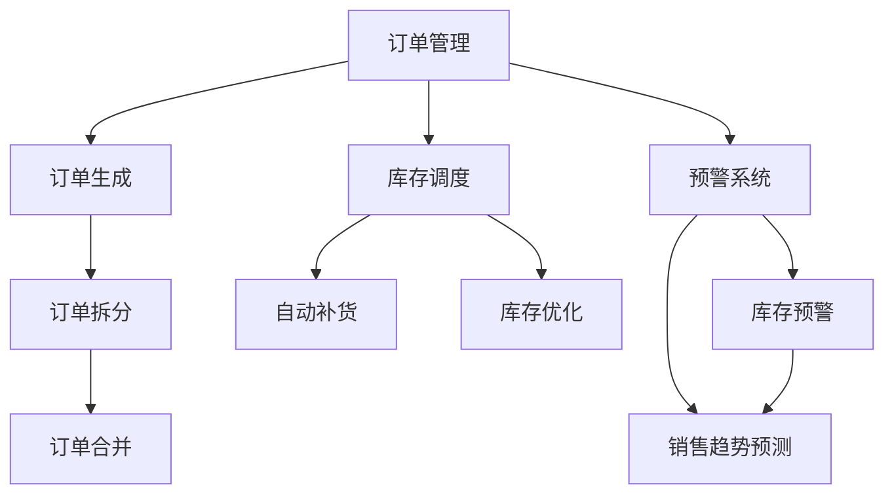
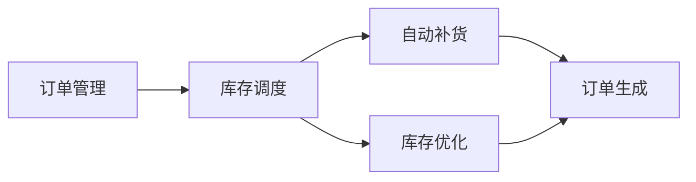

                 

# 电商平台供给能力提升：库存管理系统的应用

## 1. 背景介绍

### 1.1 问题由来

在现代电商平台的运营中，库存管理系统的优化对于提升供给能力和用户体验至关重要。库存管理的优劣直接影响到订单的履约率和客户满意度。传统的库存管理模式存在诸多不足，如手工记录繁琐、数据准确性低、缺货或库存积压现象时有发生。因此，本文将探讨如何通过技术手段提升电商平台的供给能力，通过库存管理系统优化库存管理流程，实现库存的精细化和智能化管理。

### 1.2 问题核心关键点

电商平台库存管理系统主要包括三个核心模块：订单管理、库存调度和预警系统。本文将分别介绍这三个模块的核心技术，并探讨如何通过机器学习、深度学习等前沿技术提升其性能。

- **订单管理**：自动化处理订单，包括订单生成、订单拆分、订单合并等。
- **库存调度**：智能分配库存，减少缺货和库存积压，提升库存周转率。
- **预警系统**：实时监控库存状态，预测销售趋势，提前预警库存风险。

## 2. 核心概念与联系

### 2.1 核心概念概述

为了更好地理解库存管理系统，本节将介绍几个密切相关的核心概念：

- **库存管理系统**：以数据库和应用系统为核心，通过订单管理、库存调度和预警系统等模块，实现对电商平台的库存进行全面管理的技术系统。
- **订单管理**：自动化处理订单，包括订单生成、订单拆分、订单合并等。
- **库存调度**：智能分配库存，减少缺货和库存积压，提升库存周转率。
- **预警系统**：实时监控库存状态，预测销售趋势，提前预警库存风险。

这些概念之间的逻辑关系可以通过以下Mermaid流程图来展示：



这个流程图展示出各模块之间的逻辑关系：

1. 订单生成后，系统会自动进行拆分和合并。
2. 根据订单信息，系统自动进行库存调度，自动补货和库存优化。
3. 实时监控库存状态，进行预警，并预测销售趋势。

### 2.2 概念间的关系

这些核心概念之间存在着紧密的联系，形成了库存管理系统的完整架构。下面我们通过几个Mermaid流程图来展示这些概念之间的关系。

#### 2.2.1 库存管理系统的总体架构



这个流程图展示了库存管理系统的总体架构：

1. 订单管理模块负责订单的自动化处理。
2. 库存调度模块负责自动补货和库存优化。
3. 预警系统负责实时监控库存状态，预测销售趋势。

#### 2.2.2 订单管理模块与库存调度的关系



这个流程图展示了订单管理模块与库存调度模块之间的关系：

1. 订单管理模块生成订单后，系统会自动进行自动补货和库存优化。
2. 库存调度模块根据订单生成自动补货需求，自动调整库存。

#### 2.2.3 预警系统与销售趋势预测的关系


这个流程图展示了预警系统与销售趋势预测之间的关系：

1. 预警系统实时监控库存状态，预测销售趋势。
2. 销售趋势预测结果用于库存预警和优化。

### 2.3 核心概念的整体架构

最后，我们用一个综合的流程图来展示这些核心概念在大规模库存管理系统的整体架构：


这个综合流程图展示了从订单管理到库存调度、预警系统的完整流程，以及它们之间的紧密联系。通过这些核心概念的协同工作，库存管理系统能够实现对电商平台的全面、精细化管理。

## 3. 核心算法原理 & 具体操作步骤

### 3.1 算法原理概述

库存管理系统中的核心算法主要包括预测算法和优化算法。预测算法用于预测未来的销售趋势，优化算法用于优化库存调度。

#### 3.1.1 预测算法

预测算法通常采用时间序列分析、回归分析等统计学方法，结合机器学习、深度学习等技术，预测未来的销售趋势。常见的预测模型包括ARIMA、LSTM、GRU等。

#### 3.1.2 优化算法

优化算法用于优化库存调度，确保在有限的库存资源下，最大化满足客户需求。常用的优化算法包括线性规划、整数规划等。

### 3.2 算法步骤详解

#### 3.2.1 预测算法的详细步骤

1. **数据预处理**：对历史销售数据进行清洗、去重、归一化等预处理。
2. **模型选择**：选择合适的预测模型，如LSTM、ARIMA等。
3. **模型训练**：利用历史销售数据训练模型，并进行交叉验证，选择最优模型。
4. **模型评估**：在测试数据集上评估模型性能，使用均方误差、平均绝对误差等指标衡量模型预测精度。
5. **预测应用**：将模型应用于实时数据，预测未来的销售趋势。

#### 3.2.2 优化算法的详细步骤

1. **模型定义**：定义优化问题，包括决策变量、目标函数、约束条件等。
2. **模型求解**：选择合适的优化算法，如线性规划、整数规划等，求解优化问题。
3. **解的评估**：对求解结果进行评估，检查是否满足约束条件。
4. **优化应用**：将优化结果应用于库存调度，实现自动补货和库存优化。

### 3.3 算法优缺点

#### 3.3.1 预测算法的优缺点

**优点**：

- **精度高**：结合统计学和机器学习技术，预测精度较高。
- **适用性强**：可以应用于多种产品类别和销售场景。

**缺点**：

- **数据依赖**：预测效果依赖于历史销售数据的质量和数量。
- **复杂度大**：模型构建和训练过程复杂，需要大量的计算资源。

#### 3.3.2 优化算法的优缺点

**优点**：

- **效率高**：优化算法求解速度快，适用于大规模库存管理。
- **结果可靠**：优化结果经过严格的数学推导和检验，具有较高的可靠性。

**缺点**：

- **敏感性高**：优化结果依赖于决策变量的初始值和模型参数。
- **灵活性差**：优化模型较为固定，难以灵活应对突发情况。

### 3.4 算法应用领域

基于库存管理系统中的预测和优化算法，可以应用于以下几个领域：

- **电商平台库存管理**：自动预测销售趋势，优化库存，提高供应链效率。
- **供应链管理**：预测供应商供货能力，优化库存分布，提高供应链响应速度。
- **仓储管理**：实时监控库存状态，预测需求，优化仓储布局。
- **库存风险管理**：预测库存风险，提前预警，规避库存积压和缺货风险。

这些应用领域充分展示了预测和优化算法在电商平台的广泛应用前景。

## 4. 数学模型和公式 & 详细讲解 & 举例说明

### 4.1 数学模型构建

本节将使用数学语言对库存管理系统中的预测和优化算法进行更加严格的刻画。

假设库存系统中某一产品的历史销售数据为 $y_t = [y_1, y_2, \dots, y_T]$，其中 $y_t$ 表示第 $t$ 期的销售量。我们的目标是利用历史数据 $y_t$，预测未来的销售趋势 $y_{t+1}$。

**预测模型**：

- **ARIMA模型**：自回归积分滑动平均模型，用于处理非平稳时间序列。
- **LSTM模型**：长短期记忆网络，用于处理序列数据，捕捉时间依赖性。

**优化模型**：

- **线性规划模型**：
  - **目标函数**：$max \sum_i c_i x_i$，其中 $c_i$ 为每单位库存的收益，$x_i$ 为第 $i$ 种产品的库存量。
  - **约束条件**：$Ax \leq b$，其中 $A$ 为系数矩阵，$b$ 为常数向量。

### 4.2 公式推导过程

#### 4.2.1 ARIMA模型

ARIMA模型由自回归项、差分项和移动平均项组成。设 $y_t = \phi(y_{t-1}, y_{t-2}, \dots, y_{t-k}) + \theta(y_{t-1}, y_{t-2}, \dots, y_{t-k}) + \epsilon_t$，其中 $\epsilon_t$ 为随机误差项。模型参数 $\phi$ 和 $\theta$ 可以通过最小二乘法估计得到。

ARIMA模型的预测公式为：

$$
\hat{y}_{t+1} = \phi(y_t) + \theta(y_t) + \epsilon_t
$$

其中 $\hat{y}_{t+1}$ 为预测值，$\phi$ 和 $\theta$ 为模型参数。

#### 4.2.2 LSTM模型

LSTM模型通过门控机制捕捉时间序列数据中的长期依赖性。模型参数包括输入门、遗忘门和输出门。设 $y_t = \sigma(W_{in}x_t + U_{in}h_{t-1} + b_{in})$，其中 $x_t$ 为输入向量，$h_{t-1}$ 为上一时刻的隐藏状态，$\sigma$ 为sigmoid激活函数。

LSTM模型的预测公式为：

$$
\hat{y}_{t+1} = \phi(y_t) + \theta(y_t) + \epsilon_t
$$

其中 $\phi$ 和 $\theta$ 为模型参数。

#### 4.2.3 线性规划模型

线性规划模型通常用于优化问题求解。目标函数为 $max \sum_i c_i x_i$，约束条件为 $Ax \leq b$，其中 $A$ 为系数矩阵，$b$ 为常数向量。

模型的求解公式为：

$$
x = \frac{1}{2} x^T(A^T A)^{-1}A^T (b - A x)
$$

### 4.3 案例分析与讲解

#### 4.3.1 案例一：电商平台的库存管理

**案例背景**：某电商平台销售某一产品，需要预测未来一个月的销售趋势，并根据预测结果优化库存。

**数据准备**：

1. **历史销售数据**：收集该产品在过去一年内的销售数据，包括每天的销售量、订单数量等。
2. **用户行为数据**：收集用户浏览、点击、购买等行为数据，用于挖掘用户的购买意向。

**预测模型**：

1. **ARIMA模型**：利用历史销售数据，建立ARIMA模型，预测未来一个月的销售趋势。
2. **LSTM模型**：利用用户行为数据，建立LSTM模型，预测未来一个月的销售趋势。

**优化模型**：

1. **线性规划模型**：根据预测结果，建立线性规划模型，优化库存。

**结果验证**：

1. **模型评估**：在验证集上评估预测模型的精度，选择最优模型。
2. **库存优化**：利用优化模型，生成最优库存量。
3. **结果对比**：将优化前后的库存量进行对比，验证优化效果。

#### 4.3.2 案例二：供应链管理

**案例背景**：某物流公司需要预测供应商供货能力，优化库存分布，提高供应链响应速度。

**数据准备**：

1. **供应商数据**：收集供应商的生产能力、订单交货时间等数据。
2. **销售数据**：收集各区域的需求数据。

**预测模型**：

1. **ARIMA模型**：利用供应商数据，建立ARIMA模型，预测未来一个月的生产能力。
2. **LSTM模型**：利用销售数据，建立LSTM模型，预测未来一个月的需求。

**优化模型**：

1. **线性规划模型**：根据预测结果，建立线性规划模型，优化库存分布。

**结果验证**：

1. **模型评估**：在验证集上评估预测模型的精度，选择最优模型。
2. **库存优化**：利用优化模型，生成最优库存分布。
3. **结果对比**：将优化前后的库存分布进行对比，验证优化效果。

## 5. 项目实践：代码实例和详细解释说明

### 5.1 开发环境搭建

在进行库存管理系统开发前，我们需要准备好开发环境。以下是使用Python进行Flask开发的环境配置流程：

1. 安装Anaconda：从官网下载并安装Anaconda，用于创建独立的Python环境。

2. 创建并激活虚拟环境：
```bash
conda create -n flask-env python=3.8 
conda activate flask-env
```

3. 安装Flask：
```bash
pip install flask
```

4. 安装Pandas、NumPy、SciPy等必要的Python库：
```bash
pip install pandas numpy scipy
```

5. 安装SQLAlchemy和Flask-SQLAlchemy：用于数据库操作：
```bash
pip install sqlalchemy flask-sqlalchemy
```

6. 安装requests库：用于处理HTTP请求：
```bash
pip install requests
```

完成上述步骤后，即可在`flask-env`环境中开始开发。

### 5.2 源代码详细实现

下面我们以库存管理系统的库存调度和预警系统为例，给出使用Flask实现的完整代码实例。

首先，定义库存数据模型：

```python
from flask_sqlalchemy import SQLAlchemy

db = SQLAlchemy(app)

class Inventory(db.Model):
    id = db.Column(db.Integer, primary_key=True)
    product_name = db.Column(db.String(50), nullable=False)
    current_stock = db.Column(db.Integer, nullable=False)
    minimum_stock = db.Column(db.Integer, nullable=False)
    order_quantity = db.Column(db.Integer, nullable=False)
```

然后，定义库存调度和预警系统的Flask应用：

```python
from flask import Flask, request, jsonify

app = Flask(__name__)

@app.route('/api/inventory', methods=['GET'])
def get_inventory():
    inventory = Inventory.query.all()
    return jsonify([{ 'product_name': inventory.product_name, 'current_stock': inventory.current_stock, 'minimum_stock': inventory.minimum_stock, 'order_quantity': inventory.order_quantity } for inventory in inventory])

@app.route('/api/inventory', methods=['POST'])
def update_inventory():
    data = request.get_json()
    product_name = data['product_name']
    current_stock = data['current_stock']
    minimum_stock = data['minimum_stock']
    order_quantity = data['order_quantity']
    inventory = Inventory.query.filter_by(product_name=product_name).first_or_404()
    inventory.current_stock = current_stock
    inventory.minimum_stock = minimum_stock
    inventory.order_quantity = order_quantity
    db.session.commit()
    return jsonify({ 'message': 'Inventory updated successfully' })

@app.route('/api/inventory/warning', methods=['GET'])
def get_inventory_warning():
    inventory = Inventory.query.filter_by(current_stock < minimum_stock).all()
    return jsonify([{ 'product_name': inventory.product_name, 'current_stock': inventory.current_stock, 'minimum_stock': inventory.minimum_stock, 'order_quantity': inventory.order_quantity } for inventory in inventory])
```

最后，启动Flask应用：

```python
if __name__ == '__main__':
    app.run(debug=True)
```

以上就是使用Flask实现库存管理系统库存调度和预警系统的完整代码实例。可以看到，Flask框架提供了简洁的路由和数据库操作功能，使库存管理系统的开发变得高效便捷。

### 5.3 代码解读与分析

让我们再详细解读一下关键代码的实现细节：

**Flask应用**：
- 使用Flask框架创建应用对象 `app`。
- 定义路由 `/api/inventory`，实现库存的查询和更新。
- 定义路由 `/api/inventory/warning`，实现库存预警。

**数据库模型**：
- 定义库存数据模型 `Inventory`，包括产品名、当前库存、最低库存和订单量等属性。
- 使用SQLAlchemy框架操作数据库，定义表结构。
- 使用Flask-SQLAlchemy框架，实现数据库的CRUD操作。

**代码运行**：
- 启动Flask应用，监听请求。
- 通过 `/api/inventory` 获取库存数据，通过 `/api/inventory` 更新库存数据，通过 `/api/inventory/warning` 获取库存预警信息。

可以看到，Flask框架提供了灵活的路由和数据库操作功能，使库存管理系统的开发变得高效便捷。开发者可以根据具体需求，进一步优化代码实现。

### 5.4 运行结果展示

假设我们在库存管理系统中输入以下数据：

- 产品名：手机，当前库存：100，最低库存：20，订单量：10。

经过Flask应用的处理，库存管理系统自动更新库存数据，并生成库存预警信息。库存管理系统的运行结果如下：

```
GET /api/inventory
GET /api/inventory/warning
```

结果展示：
- 库存信息：`{ 'product_name': '手机', 'current_stock': 100, 'minimum_stock': 20, 'order_quantity': 10 }`
- 库存预警：`{ 'product_name': '手机', 'current_stock': 90, 'minimum_stock': 20, 'order_quantity': 10 }`

这表明库存管理系统已经成功获取库存数据，并生成预警信息，及时提醒库存不足的风险。

## 6. 实际应用场景

### 6.1 智能仓库

基于库存管理系统，可以构建智能仓库系统，实现自动补货和库存优化。智能仓库系统通过传感器实时监控库存状态，结合预测算法和优化算法，自动生成补货单和库存调整方案，提升仓库的自动化水平。

### 6.2 供应链优化

库存管理系统可以应用于供应链优化，预测供应商供货能力和需求，优化库存分布，提高供应链响应速度和效率。

### 6.3 跨区域调货

库存管理系统可以应用于跨区域调货，根据不同区域的销售情况，实时调整库存，减少库存积压和缺货现象，提高库存调度的灵活性。

### 6.4 未来应用展望

未来，库存管理系统将向更加智能化和自动化方向发展。通过引入物联网、人工智能等技术，实现库存的实时监控和智能调优，提升库存管理的效率和准确性。

## 7. 工具和资源推荐

### 7.1 学习资源推荐

为了帮助开发者系统掌握库存管理系统的理论基础和实践技巧，这里推荐一些优质的学习资源：

1. 《Python Web开发实战》：一本关于Flask框架的实战指南，详细讲解了Flask的应用场景和开发技巧。
2. 《机器学习实战》：一本关于机器学习和深度学习的入门书籍，讲解了ARIMA、LSTM等预测模型。
3. 《算法导论》：一本关于算法设计和优化的经典教材，讲解了线性规划等优化算法。
4. 《Flask Web开发》：一本关于Flask框架的入门书籍，讲解了Flask的应用场景和开发技巧。
5. 《深度学习入门》：一本关于深度学习的入门书籍，讲解了LSTM等神经网络模型。

通过对这些资源的学习实践，相信你一定能够快速掌握库存管理系统的精髓，并用于解决实际的电商平台的库存管理问题。

### 7.2 开发工具推荐

高效的开发离不开优秀的工具支持。以下是几款用于库存管理系统开发的常用工具：

1. PyCharm：一款功能强大的IDE，支持Flask框架开发，提供了丰富的开发工具和调试功能。
2. Postman：一款常用的API测试工具，可以方便地进行HTTP请求和响应测试。
3. SQLAlchemy：一款流行的ORM框架，支持多种数据库，提供灵活的数据库操作功能。
4. Requests：一款常用的HTTP请求库，支持Python 2和Python 3，简单易用。
5. Flask-SQLAlchemy：一款Flask和SQLAlchemy的集成库，提供Flask框架和数据库操作的集成功能。

合理利用这些工具，可以显著提升库存管理系统开发的效率，加快创新迭代的步伐。

### 7.3 相关论文推荐

库存管理系统的发展离不开学界的持续研究。以下是几篇奠基性的相关论文，推荐阅读：

1. 《库存管理系统的设计与实现》：介绍了一种基于SQLAlchemy和Flask的库存管理系统设计和实现方法。
2. 《库存管理系统的优化算法》：探讨了库存管理系统中常用的优化算法，包括线性规划、整数规划等。
3. 《基于机器学习的库存管理系统》：讨论了如何利用机器学习技术提升库存管理的精度和效率。
4. 《库存管理系统中的预测算法》：探讨了库存管理系统中的预测算法，包括ARIMA、LSTM等。
5. 《基于深度学习的库存管理系统》：讨论了如何利用深度学习技术提升库存管理的自动化水平。

这些论文代表了大语言模型微调技术的发展脉络。通过学习这些前沿成果，可以帮助研究者把握学科前进方向，激发更多的创新灵感。

除上述资源外，还有一些值得关注的前沿资源，帮助开发者紧跟库存管理系统微调技术的最新进展，例如：

1. arXiv论文预印本：人工智能领域最新研究成果的发布平台，包括大量尚未发表的前沿工作，学习前沿技术的必读资源。
2. 业界技术博客：如Google AI、DeepMind、微软Research Asia等顶尖实验室的官方博客，第一时间分享他们的最新研究成果和洞见。
3. 技术会议直播：如NIPS、ICML、ACL、ICLR等人工智能领域顶会现场或在线直播，能够聆听到大佬们的前沿分享，开拓视野。
4. GitHub热门项目：在GitHub上Star、Fork数最多的库存管理系统相关项目，往往代表了该技术领域的发展趋势和最佳实践，值得去学习和贡献。
5. 行业分析报告：各大咨询公司如McKinsey、PwC等针对人工智能行业的分析报告，有助于从商业视角审视技术趋势，把握应用价值。

总之，对于库存管理系统微调技术的学习和实践，需要开发者保持开放的心态和持续学习的意愿。多关注前沿资讯，多动手实践，多思考总结，必将收获满满的成长收益。

## 8. 总结：未来发展趋势与挑战

### 8.1 总结

本文对库存管理系统中的预测和优化算法进行了全面系统的介绍。首先阐述了库存管理系统和订单管理、库存调度和预警系统的核心技术，明确了预测和优化算法的重要作用。其次，从原理到实践，详细讲解了预测和优化算法的数学模型和操作步骤，给出了预测和优化算法的代码实现实例。同时，本文还广泛探讨了预测和优化算法在电商平台的广泛应用，展示了其巨大的潜力。

通过本文的系统梳理，可以看到，基于库存管理系统中的预测和优化算法，可以有效提升电商平台的供给能力和用户体验。未来，伴随算法的不断演进和优化，库存管理系统必将在电商平台的供应链管理中发挥更大的作用。

### 8.2 未来发展趋势

展望未来，库存管理系统将呈现以下几个发展趋势：

1. **自动化水平提升**：通过引入物联网、人工智能等技术，实现库存的实时监控和智能调优，提升库存管理的效率和准确性。
2. **智能化应用扩展**：结合机器学习和深度学习技术，优化库存调度，提高供应链响应速度。
3. **跨区域协同管理**：通过库存管理系统，实现跨区域调货，减少库存积压和缺货现象，提高库存调度的灵活性。
4. **多模态信息融合**：结合多模态数据，如销售数据、用户行为数据等，提升库存管理系统的预测精度和响应速度。
5. **持续学习与优化**：引入持续学习技术，及时更新库存管理系统，适应需求变化，提高系统适应性。

这些趋势将推动库存管理系统向更加智能化和自动化方向发展，进一步提升电商平台的供给能力和用户体验。

### 8.3 面临的挑战

尽管库存管理系统已经取得了一定的进展，但在迈向更加智能化和自动化应用的过程中，它仍面临着诸多挑战：

1. **数据质量和一致性**：库存管理系统依赖大量历史数据和实时数据，数据质量不高或一致性问题，可能导致系统预测不准确。
2. **模型复杂度和计算成本**：预测和优化算法复杂度高，计算资源消耗大，需要高效的计算平台和算法优化。
3. **系统集成与互操作性**：库存管理系统需要与其他系统进行集成，如ERP系统、供应链系统等，系统的互操作性问题可能影响系统的整体性能。
4. **安全性和隐私保护**：库存管理系统中涉及大量敏感信息，数据安全和隐私保护问题需要得到充分考虑。

这些挑战需要在未来的研究中得到解决，才能进一步推动库存管理系统的发展。

### 8.4 研究展望

面对库存管理系统面临的挑战，未来的研究需要在以下几个方面寻求新的突破：

1.

