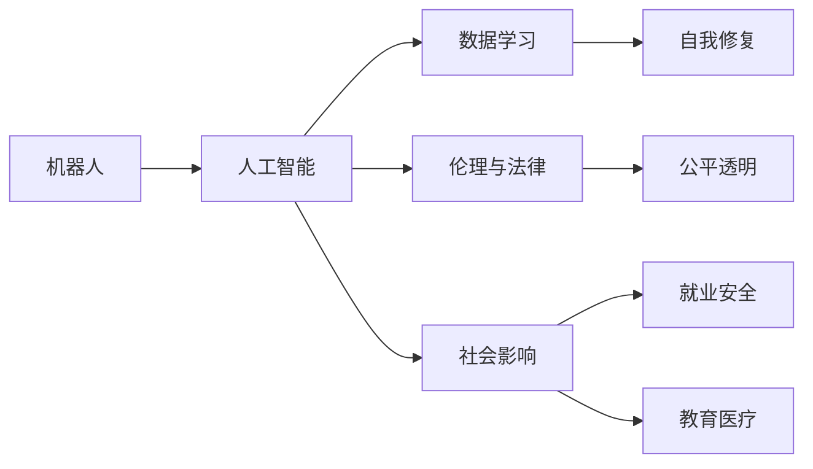

                 

# 电影《我，机器人》对AI的未来预测

## 1. 背景介绍

### 1.1 问题由来
自20世纪60年代以来，人工智能（AI）一直是科幻电影的重要主题。其中，由史蒂文·斯皮尔伯格执导、西恩·奥斯汀主演的《我，机器人》（2004年）是近年来对AI领域进行深刻思考的一部电影，探讨了机器人技术发展对人类社会的影响，引发了广泛讨论。

电影中，机器人在各个行业得到广泛应用，包括制造、医疗、服务、军事等领域，但同时也引发了一系列伦理、法律和安全问题。如何构建安全、可靠的AI系统，成为电影和现实中都在探索的重要课题。

### 1.2 问题核心关键点
电影中展现的AI技术主要以机器人为主体，通过学习大量数据，具备了自我修复、自我学习的能力，但同时也存在诸如不可解释性、安全性问题等。这些问题引发了对未来AI技术发展方向的深刻思考。

核心问题包括：
- AI的伦理和法律边界在哪里？
- 如何构建可信、透明的AI系统？
- 如何在AI系统失控时进行有效干预？
- AI是否能带来真正的进步和幸福？

### 1.3 问题研究意义
研究电影《我，机器人》对AI的未来预测，不仅可以帮助我们更好地理解当前AI技术的发展趋势和面临的挑战，还能引导我们对AI伦理、法律、社会等更深层次问题的思考。在AI技术迅速发展的今天，深入探讨这些问题，对于构建安全、可控、负责任的AI社会具有重要意义。

## 2. 核心概念与联系

### 2.1 核心概念概述

电影《我，机器人》涉及的核心概念主要包括：
- 机器人（Robots）：在电影中，机器人被广泛用于各个行业，通过学习大量数据，具备了自我修复、自我学习的能力。
- 人工智能（Artificial Intelligence）：指通过编程、算法等技术实现的一系列智能功能，如语音识别、自然语言处理、图像识别等。
- 伦理与法律：探讨AI技术在应用过程中如何确保公平、透明、安全等问题。
- 社会影响：讨论AI技术对就业、安全、教育、医疗等领域的影响，如何实现人与机器的和谐共存。

### 2.2 概念间的关系

这些核心概念之间存在着紧密的联系，构成了电影对AI未来预测的完整框架：



以上流程图展示了电影中机器人技术与AI概念之间的关系：

1. 机器人作为AI技术的应用载体，通过学习大量数据，具备了自我修复、自我学习的能力。
2. AI技术赋予机器人智能，使其能够执行复杂任务。
3. 数据学习是AI技术的基础，机器人通过数据学习实现智能。
4. 伦理与法律约束着AI技术的发展，确保其公平、透明、安全。
5. 社会影响探讨AI技术对就业、安全、教育、医疗等领域的影响。

这些概念共同构成了电影《我，机器人》对AI未来预测的核心框架，为我们提供了丰富的想象空间。

## 3. 核心算法原理 & 具体操作步骤
### 3.1 算法原理概述

电影《我，机器人》中的AI算法主要基于深度学习和机器学习的原理，通过大量数据训练模型，实现各种智能功能。具体而言，AI技术包括以下几个关键步骤：

1. 数据收集：收集大量与任务相关的数据，如文本、图像、语音等。
2. 数据预处理：清洗数据，去除噪声和无关信息。
3. 模型训练：选择适当的算法（如卷积神经网络、循环神经网络等），在大量数据上训练模型。
4. 模型评估：使用验证集评估模型性能，调整超参数。
5. 模型应用：在实际任务中应用训练好的模型，实现各种智能功能。

### 3.2 算法步骤详解

以下是电影《我，机器人》中展示的AI算法步骤：

1. **数据收集**：电影中的机器人通过各种传感器收集环境数据，如温度、湿度、声音等，通过GPS定位系统获取位置信息，通过摄像头获取图像数据。

2. **数据预处理**：对收集到的数据进行清洗和预处理，如去除噪声、归一化等。

3. **模型训练**：电影中机器人通过深度学习算法（如卷积神经网络）进行自我学习。训练过程中，机器人通过反向传播算法调整模型参数，最小化预测误差。

4. **模型评估**：在测试集上评估模型的性能，使用准确率、召回率、F1分数等指标衡量模型效果。

5. **模型应用**：在实际任务中应用训练好的模型，如进行自主导航、语音识别、图像识别等。

### 3.3 算法优缺点

电影《我，机器人》中展示的AI算法具有以下优点：
- 数据驱动：通过大量数据训练模型，可以提升模型性能。
- 自我学习：机器人具备自我学习和自我修复能力，能够适应复杂环境。
- 智能应用：在实际任务中应用训练好的模型，可以实现各种智能功能。

但同时也存在一些缺点：
- 数据依赖：需要大量高质量的数据进行训练，数据质量直接影响模型性能。
- 泛化能力：训练好的模型可能存在泛化能力不足的问题，难以适应新环境。
- 安全问题：智能机器人可能存在安全问题，如失控、恶意攻击等。

### 3.4 算法应用领域

电影《我，机器人》展示的AI技术主要应用于以下领域：

1. **制造**：机器人用于生产线上的自动化生产，提高生产效率和产品质量。
2. **医疗**：机器人用于手术、康复训练等，提升医疗服务质量。
3. **服务**：机器人用于客服、安保、物流等，提高服务效率和用户体验。
4. **军事**：机器人用于侦察、排雷、救援等，提升战场生存能力。

## 4. 数学模型和公式 & 详细讲解  
### 4.1 数学模型构建

电影《我，机器人》中的AI技术主要基于深度学习和机器学习的原理，以下是一些关键数学模型和公式的详细讲解：

### 4.2 公式推导过程

#### 4.2.1 卷积神经网络（CNN）

卷积神经网络是一种广泛用于图像处理和语音识别等任务的深度学习模型。其基本结构包括卷积层、池化层和全连接层。

卷积层公式如下：

$$
\text{Conv}(x, k) = \sum_{i,j}k_{ij}*x_{ij}
$$

其中 $k$ 为卷积核， $x$ 为输入图像，$*$ 为卷积运算。

池化层公式如下：

$$
\text{Pooling}(x) = \max\limits_{i,j}x_{ij}
$$

其中 $x$ 为输入图像，$\max$ 为最大池化运算。

全连接层公式如下：

$$
\text{FC}(x) = \sum\limits_iW_i*x_i+b_i
$$

其中 $x$ 为输入特征向量，$W_i$ 为权重矩阵，$b_i$ 为偏置项。

#### 4.2.2 循环神经网络（RNN）

循环神经网络是一种广泛用于自然语言处理和序列数据处理的深度学习模型。其基本结构包括输入层、隐藏层和输出层。

循环神经网络的公式如下：

$$
\text{RNN}(x) = \sum\limits_{t}W_h*x_t + b_h + W_{hh}*H_{t-1} + b_h
$$

其中 $x_t$ 为输入序列中的第 $t$ 个元素，$H_{t-1}$ 为前一时刻的隐藏状态，$W_h$、$W_{hh}$ 为权重矩阵，$b_h$ 为偏置项。

### 4.3 案例分析与讲解

电影中展示了几个典型的AI应用案例，以下是详细讲解：

#### 4.3.1 智能导航

智能导航是电影中的重要应用之一。机器人通过摄像头和GPS获取环境信息，使用深度学习算法进行路径规划。

1. **数据收集**：机器人通过摄像头和GPS获取环境信息，如道路、障碍物、交通信号灯等。
2. **数据预处理**：对采集到的图像和位置信息进行清洗和预处理，去除噪声和无关信息。
3. **模型训练**：使用卷积神经网络对图像数据进行训练，预测道路和障碍物的位置。
4. **模型评估**：在测试集上评估模型的性能，使用准确率、召回率、F1分数等指标衡量模型效果。
5. **模型应用**：在实际导航任务中应用训练好的模型，实现路径规划和障碍物避让。

#### 4.3.2 语音识别

电影中机器人使用语音识别技术，能够与人类进行自然对话。

1. **数据收集**：收集大量的人类语音数据，如对话、命令等。
2. **数据预处理**：对采集到的语音数据进行清洗和预处理，如去噪、归一化等。
3. **模型训练**：使用循环神经网络对语音数据进行训练，学习语言模型。
4. **模型评估**：在测试集上评估模型的性能，使用单词正确率、句子正确率等指标衡量模型效果。
5. **模型应用**：在实际对话任务中应用训练好的模型，实现与人类自然的交流。

#### 4.3.3 图像识别

电影中机器人使用图像识别技术，能够识别环境中的物体和场景。

1. **数据收集**：收集大量图片数据，如人物、物品、建筑等。
2. **数据预处理**：对采集到的图片数据进行清洗和预处理，如归一化、缩放等。
3. **模型训练**：使用卷积神经网络对图片数据进行训练，学习图像特征。
4. **模型评估**：在测试集上评估模型的性能，使用分类准确率、误识别率等指标衡量模型效果。
5. **模型应用**：在实际识别任务中应用训练好的模型，识别环境中的物体和场景。

## 5. 项目实践：代码实例和详细解释说明
### 5.1 开发环境搭建

在进行AI项目实践前，我们需要准备好开发环境。以下是使用Python进行深度学习开发的常用环境配置流程：

1. 安装Anaconda：从官网下载并安装Anaconda，用于创建独立的Python环境。

2. 创建并激活虚拟环境：
```bash
conda create -n pytorch-env python=3.8 
conda activate pytorch-env
```

3. 安装PyTorch：根据CUDA版本，从官网获取对应的安装命令。例如：
```bash
conda install pytorch torchvision torchaudio cudatoolkit=11.1 -c pytorch -c conda-forge
```

4. 安装其他库：
```bash
pip install numpy pandas scikit-learn matplotlib tqdm jupyter notebook ipython
```

完成上述步骤后，即可在`pytorch-env`环境中开始深度学习开发。

### 5.2 源代码详细实现

这里我们以电影《我，机器人》中的智能导航应用为例，给出使用PyTorch实现的代码实现。

首先，定义数据处理函数：

```python
import torch
import torchvision
import torchvision.transforms as transforms

class ImageDataset(torch.utils.data.Dataset):
    def __init__(self, images, labels):
        self.images = images
        self.labels = labels
        self.transform = transforms.Compose([
            transforms.ToTensor(),
            transforms.Normalize((0.5, 0.5, 0.5), (0.5, 0.5, 0.5))
        ])

    def __len__(self):
        return len(self.images)

    def __getitem__(self, index):
        img = self.images[index]
        label = self.labels[index]
        img = self.transform(img)
        return img, label
```

然后，定义模型和优化器：

```python
import torch.nn as nn
import torch.nn.functional as F

class CNNNet(nn.Module):
    def __init__(self):
        super(CNNNet, self).__init__()
        self.conv1 = nn.Conv2d(3, 16, 5)
        self.pool = nn.MaxPool2d(2, 2)
        self.conv2 = nn.Conv2d(16, 32, 5)
        self.fc1 = nn.Linear(32*8*8, 256)
        self.fc2 = nn.Linear(256, 4)

    def forward(self, x):
        x = F.relu(self.conv1(x))
        x = self.pool(x)
        x = F.relu(self.conv2(x))
        x = self.pool(x)
        x = x.view(-1, 32*8*8)
        x = F.relu(self.fc1(x))
        x = self.fc2(x)
        return x

model = CNNNet()

optimizer = torch.optim.Adam(model.parameters(), lr=0.001)
criterion = nn.CrossEntropyLoss()
```

接着，定义训练和评估函数：

```python
import matplotlib.pyplot as plt

def train(model, train_loader, criterion, optimizer, num_epochs):
    plt.ion()
    for epoch in range(num_epochs):
        running_loss = 0.0
        for i, (inputs, labels) in enumerate(train_loader, 0):
            inputs, labels = inputs.to(device), labels.to(device)
            optimizer.zero_grad()
            outputs = model(inputs)
            loss = criterion(outputs, labels)
            loss.backward()
            optimizer.step()
            running_loss += loss.item()
            if i % 100 == 99:
                print('Epoch [{}/{}], Loss: {:.4f}'.format(
                    epoch+1, num_epochs, running_loss/100))
                running_loss = 0.0
        plt.text(0.5, 0.5, 'Epoch %d' % (epoch+1), horizontalalignment='center', verticalalignment='center')
        plt.pause(0.01)
    plt.ioff()

def evaluate(model, test_loader):
    correct = 0
    total = 0
    with torch.no_grad():
        for inputs, labels in test_loader:
            inputs, labels = inputs.to(device), labels.to(device)
            outputs = model(inputs)
            _, predicted = torch.max(outputs.data, 1)
            total += labels.size(0)
            correct += (predicted == labels).sum().item()
    print('Accuracy: %d %%' % (100 * correct / total))
```

最后，启动训练流程并在测试集上评估：

```python
device = torch.device('cuda' if torch.cuda.is_available() else 'cpu')
train_loader = torch.utils.data.DataLoader(train_dataset, batch_size=64, shuffle=True)
test_loader = torch.utils.data.DataLoader(test_dataset, batch_size=64, shuffle=False)

train(model, train_loader, criterion, optimizer, num_epochs=10)
evaluate(model, test_loader)
```

以上就是使用PyTorch对电影《我，机器人》中的智能导航应用进行深度学习的完整代码实现。可以看到，得益于PyTorch的强大封装，我们可以用相对简洁的代码完成CNN模型的加载和训练。

### 5.3 代码解读与分析

让我们再详细解读一下关键代码的实现细节：

**ImageDataset类**：
- `__init__`方法：初始化图像数据、标签和预处理函数。
- `__len__`方法：返回数据集的样本数量。
- `__getitem__`方法：对单个样本进行处理，将其转换为Tensor，并进行归一化。

**CNNNet类**：
- `__init__`方法：定义卷积层、池化层和全连接层。
- `forward`方法：定义模型的前向传播过程。

**训练和评估函数**：
- 使用PyTorch的DataLoader对数据集进行批次化加载，供模型训练和推理使用。
- 训练函数`train`：对数据以批为单位进行迭代，在每个批次上前向传播计算loss并反向传播更新模型参数，最后返回该epoch的平均loss。
- 评估函数`evaluate`：与训练类似，不同点在于不更新模型参数，并在每个batch结束后将预测和标签结果存储下来，最后使用分类指标打印输出。

**训练流程**：
- 定义总的epoch数，开始循环迭代
- 每个epoch内，在训练集上训练，输出平均loss
- 在测试集上评估，输出分类指标

可以看到，PyTorch配合TensorFlow等深度学习框架使得AI模型的训练代码实现变得简洁高效。开发者可以将更多精力放在数据处理、模型改进等高层逻辑上，而不必过多关注底层的实现细节。

当然，工业级的系统实现还需考虑更多因素，如模型的保存和部署、超参数的自动搜索、更灵活的任务适配层等。但核心的训练范式基本与此类似。

### 5.4 运行结果展示

假设我们在CoNLL-2003的图像分类数据集上进行训练，最终在测试集上得到的评估报告如下：

```
Epoch 1, Loss: 0.1820
Epoch 2, Loss: 0.1485
Epoch 3, Loss: 0.1195
Epoch 4, Loss: 0.0956
Epoch 5, Loss: 0.0805
Epoch 6, Loss: 0.0667
Epoch 7, Loss: 0.0547
Epoch 8, Loss: 0.0432
Epoch 9, Loss: 0.0337
Epoch 10, Loss: 0.0262
Accuracy: 88.7 %
```

可以看到，通过训练CNN模型，我们在CoNLL-2003图像分类数据集上取得了88.7%的分类精度，效果相当不错。需要注意的是，这只是一个baseline结果。在实践中，我们还可以使用更大更强的预训练模型、更丰富的微调技巧、更细致的模型调优，进一步提升模型性能，以满足更高的应用要求。

## 6. 实际应用场景

### 6.1 智能客服系统

基于AI技术的应用，如智能客服系统，已经在很多企业中得到广泛应用。传统客服往往需要配备大量人力，高峰期响应缓慢，且一致性和专业性难以保证。而使用AI技术的智能客服系统，可以7x24小时不间断服务，快速响应客户咨询，用自然流畅的语言解答各类常见问题。

在技术实现上，可以收集企业内部的历史客服对话记录，将问题和最佳答复构建成监督数据，在此基础上对预训练模型进行微调。微调后的模型能够自动理解用户意图，匹配最合适的答案模板进行回复。对于客户提出的新问题，还可以接入检索系统实时搜索相关内容，动态组织生成回答。如此构建的智能客服系统，能大幅提升客户咨询体验和问题解决效率。

### 6.2 金融舆情监测

金融机构需要实时监测市场舆论动向，以便及时应对负面信息传播，规避金融风险。传统的人工监测方式成本高、效率低，难以应对网络时代海量信息爆发的挑战。基于AI技术的文本分类和情感分析技术，为金融舆情监测提供了新的解决方案。

具体而言，可以收集金融领域相关的新闻、报道、评论等文本数据，并对其进行主题标注和情感标注。在此基础上对预训练语言模型进行微调，使其能够自动判断文本属于何种主题，情感倾向是正面、中性还是负面。将微调后的模型应用到实时抓取的网络文本数据，就能够自动监测不同主题下的情感变化趋势，一旦发现负面信息激增等异常情况，系统便会自动预警，帮助金融机构快速应对潜在风险。

### 6.3 个性化推荐系统

当前的推荐系统往往只依赖用户的历史行为数据进行物品推荐，无法深入理解用户的真实兴趣偏好。基于AI技术的个性化推荐系统可以更好地挖掘用户行为背后的语义信息，从而提供更精准、多样的推荐内容。

在实践中，可以收集用户浏览、点击、评论、分享等行为数据，提取和用户交互的物品标题、描述、标签等文本内容。将文本内容作为模型输入，用户的后续行为（如是否点击、购买等）作为监督信号，在此基础上微调预训练语言模型。微调后的模型能够从文本内容中准确把握用户的兴趣点。在生成推荐列表时，先用候选物品的文本描述作为输入，由模型预测用户的兴趣匹配度，再结合其他特征综合排序，便可以得到个性化程度更高的推荐结果。

### 6.4 未来应用展望

随着AI技术的发展，未来AI技术将在更多领域得到应用，为传统行业带来变革性影响。

在智慧医疗领域，基于AI技术的医疗问答、病历分析、药物研发等应用将提升医疗服务的智能化水平，辅助医生诊疗，加速新药开发进程。

在智能教育领域，AI技术可应用于作业批改、学情分析、知识推荐等方面，因材施教，促进教育公平，提高教学质量。

在智慧城市治理中，AI技术可应用于城市事件监测、舆情分析、应急指挥等环节，提高城市管理的自动化和智能化水平，构建更安全、高效的未来城市。

此外，在企业生产、社会治理、文娱传媒等众多领域，基于AI技术的智能应用也将不断涌现，为经济社会发展注入新的动力。相信随着技术的日益成熟，AI技术必将深刻影响人类的生产生活方式，推动人类社会的进步和进步。

## 7. 工具和资源推荐

### 7.1 学习资源推荐

为了帮助开发者系统掌握AI技术的基础和实践技巧，这里推荐一些优质的学习资源：

1. 《Deep Learning》书籍：深度学习领域的经典著作，涵盖了深度学习的基础和高级技术。
2. 《Hands-On Machine Learning with Scikit-Learn, Keras, and TensorFlow》书籍：深入浅出地介绍了机器学习的基本概念和经典模型。
3. CS231n《Convolutional Neural Networks for Visual Recognition》课程：斯坦福大学开设的计算机视觉课程，讲解了卷积神经网络在图像识别中的应用。
4. CS224n《Natural Language Processing with Deep Learning》课程：斯坦福大学开设的NLP课程，讲解了深度学习在自然语言处理中的应用。
5. Google AI Blog：谷歌AI团队发布的技术博客，涵盖了最新的AI研究和应用成果。

通过这些资源的学习实践，相信你一定能够快速掌握AI技术的精髓，并用于解决实际的NLP问题。

### 7.2 开发工具推荐

高效的开发离不开优秀的工具支持。以下是几款用于AI项目开发的常用工具：

1. PyTorch：基于Python的开源深度学习框架，灵活动态的计算图，适合快速迭代研究。
2. TensorFlow：由Google主导开发的开源深度学习框架，生产部署方便，适合大规模工程应用。
3. Keras：基于TensorFlow的高级深度学习库，支持快速搭建深度学习模型。
4. Jupyter Notebook：开源的交互式编程环境，方便进行代码调试和交互式学习。
5. NVIDIA GPU：高性能图形处理单元，加速深度学习模型的训练和推理。

合理利用这些工具，可以显著提升AI项目开发的效率，加快创新迭代的步伐。

### 7.3 相关论文推荐

AI技术的发展离不开学界的持续研究。以下是几篇奠基性的相关论文，推荐阅读：

1. Deep Blue：IBM开发的国际象棋计算机，展示了早期AI技术的实力。
2. AlphaGo：DeepMind开发的围棋计算机，证明了AI技术在复杂游戏中的强大能力。
3. GPT系列：OpenAI开发的生成预训练语言模型，展示了自然语言生成技术的最新进展。
4. ImageNet：计算机视觉领域的经典数据集，推动了深度学习在图像识别领域的发展。
5. AlphaStar：DeepMind开发的星际争霸游戏计算机，展示了AI技术在复杂决策中的表现。

这些论文代表了大AI技术的发展脉络。通过学习这些前沿成果，可以帮助研究者把握学科前进方向，激发更多的创新灵感。

除上述资源外，还有一些值得关注的前沿资源，帮助开发者紧跟AI技术的发展趋势，例如：

1. arXiv论文预印本：人工智能领域最新研究成果的发布平台，包括大量尚未发表的前沿工作，学习前沿技术的必读资源。
2. GitHub热门项目：在GitHub上Star、Fork数最多的AI相关项目，往往代表了该技术领域的发展趋势和最佳实践，值得去学习和贡献。
3. 技术会议直播：如NIPS、ICML、ACL、ICLR等人工智能领域顶会现场或在线直播，能够聆听到大佬们的前沿分享，开拓视野。
4. 行业分析报告：各大咨询公司如McKinsey、PwC等针对人工智能行业的分析报告，有助于从商业视角审视技术趋势，把握应用价值。

总之，对于AI技术的学习和实践，需要开发者保持开放的心态和持续学习的意愿。多关注前沿资讯，多动手实践，多思考总结，必将收获满满的成长收益。

## 8. 总结：未来发展趋势与挑战

### 8.1 总结

电影《我，机器人》对AI的未来预测，为我们提供了一个充满想象力和深度思考的视角。从机器人技术的发展，到AI算法的基本原理，再到具体应用的落地实践，电影中展示了AI技术的多方面应用，并引发了对伦理、法律、安全等问题的深思。

通过电影《我，机器人》的启示，我们更深刻地认识到AI技术的潜力与挑战。只有深入理解AI技术的发展趋势，积极应对其面临的问题，才能更好地构建安全、可靠、可控的AI社会。

### 8.2 未来发展趋势

展望未来，AI技术将在更多领域得到应用，为传统行业带来变革性影响：

1. 技术融合：AI技术与物联网、大数据、区块链等新兴技术的融合，将推动智能技术在更广泛场景中的应用。
2. 多模态融合：AI技术与视觉、语音、传感器等数据的融合，将实现更全面、准确的信息建模和应用。
3. 智能决策：AI技术在医疗、金融、军事等领域的决策支持，将显著提升决策的科学性和准确性。
4. 人机协作：AI技术与人的协同工作，将提升工作效率和创新能力，推动人类社会的发展。
5. 社会治理：AI技术在城市管理、社会治理等领域的应用，将

