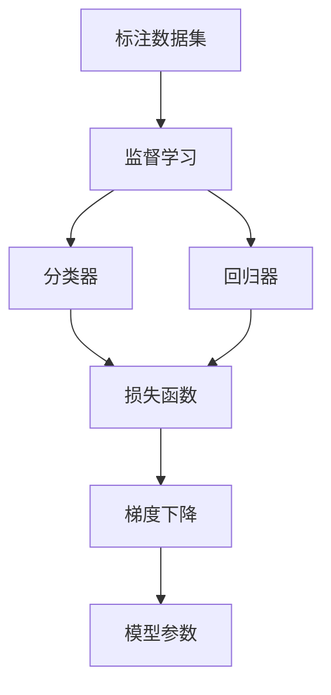
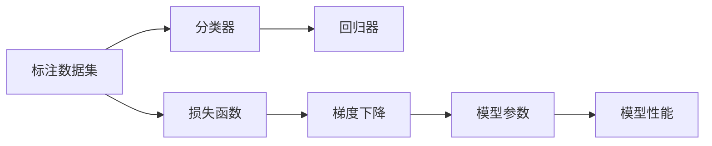
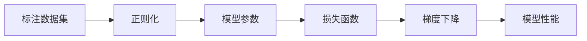
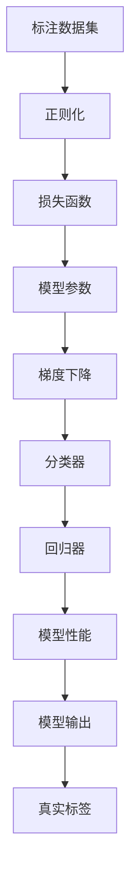

                 

# 监督学习 原理与代码实例讲解

> 关键词：监督学习,数学模型,分类器,回归器,梯度下降,损失函数,代码实例

## 1. 背景介绍

### 1.1 问题由来

监督学习(Supervised Learning)是机器学习中最基础、应用最广泛的范式之一。通过从标注数据集中学习输入和输出之间的映射关系，监督学习模型能够对新的未见数据进行准确预测，广泛应用于各类自然语言处理(NLP)、计算机视觉(CV)、信号处理等领域。

监督学习算法主要包括分类(Categorization)和回归(Regression)两大类，分别用于解决分类型和数值型预测问题。分类算法包括逻辑回归、支持向量机(SVM)、决策树、随机森林等，用于将输入数据划分到不同的类别中。回归算法包括线性回归、岭回归、Lasso回归等，用于预测连续型数值变量。

尽管监督学习在理论和技术上已较为成熟，但在实际应用中仍存在诸多挑战，如算法选型、参数调优、模型评估等。因此，本文将详细介绍监督学习的基本原理和核心算法，并通过具体的代码实例讲解其实现过程。

### 1.2 问题核心关键点

监督学习的核心在于使用标注数据训练模型，使其能够对新数据进行准确预测。核心问题包括：

1. 如何选择合适的模型和算法。
2. 如何设定模型的超参数。
3. 如何评估模型性能。
4. 如何优化模型参数。

本文将围绕这些关键问题展开，深入探讨监督学习的原理和实践，力求对读者有所启发和帮助。

### 1.3 问题研究意义

监督学习是大数据时代的重要工具，其高效、准确的特点使其在各行各业得到了广泛应用。研究监督学习的原理和实践，对于提升数据处理和决策水平，加速AI技术的落地应用，具有重要意义：

1. 提高数据利用效率。监督学习可以大幅提高数据的利用效率，从标注数据中挖掘知识，为后续应用提供支持。
2. 优化决策过程。通过监督学习，模型能够自动学习输入和输出之间的关系，辅助决策者进行科学决策。
3. 加速技术落地。监督学习简单易懂，易于部署和应用，为AI技术的产业化提供了基础。
4. 推动创新研究。监督学习是AI技术研究的重要方向，众多前沿论文和研究为其提供了理论支撑。
5. 构建智能系统。监督学习是构建各类智能系统的重要工具，如语音识别、图像识别、推荐系统等。

总之，监督学习是大数据时代的重要技术，其高效、准确的特点使其在各行各业得到了广泛应用。未来，监督学习技术将继续拓展其应用领域，推动人工智能技术的进一步发展。

## 2. 核心概念与联系

### 2.1 核心概念概述

为更好地理解监督学习的基本原理和实践，本节将介绍几个密切相关的核心概念：

- 监督学习(Supervised Learning)：通过标注数据训练模型，使其能够对新数据进行准确预测的学习范式。
- 分类器(Classifier)：用于将输入数据映射到特定类别的模型。
- 回归器(Regression)：用于预测连续型数值变量的模型。
- 梯度下降(Gradient Descent)：一种常用的模型参数优化算法，通过不断调整参数，最小化损失函数。
- 损失函数(Loss Function)：用于衡量模型预测结果与真实标签之间差异的函数。
- 过拟合(Overfitting)：模型在训练集上表现良好，但在测试集上泛化能力不足的现象。
- 正则化(Regularization)：通过引入惩罚项，防止模型过拟合的技术。

这些核心概念之间的逻辑关系可以通过以下Mermaid流程图来展示：



这个流程图展示监督学习的基本流程：

1. 使用标注数据训练模型，学习输入和输出之间的关系。
2. 分类器用于对输入进行分类，回归器用于预测连续型数值变量。
3. 损失函数用于衡量模型预测结果与真实标签之间的差异。
4. 梯度下降算法用于调整模型参数，最小化损失函数。

### 2.2 概念间的关系

这些核心概念之间存在着紧密的联系，形成了监督学习的基本框架。下面我们通过几个Mermaid流程图来展示这些概念之间的关系。

#### 2.2.1 监督学习流程



这个流程图展示了监督学习的基本流程：

1. 使用标注数据训练分类器或回归器。
2. 定义损失函数，衡量模型预测结果与真实标签之间的差异。
3. 使用梯度下降算法调整模型参数，最小化损失函数。
4. 根据模型性能评估模型效果，不断迭代优化。

#### 2.2.2 损失函数与梯度下降


这个流程图展示了损失函数和梯度下降的关系：

1. 损失函数衡量模型预测结果与真实标签之间的差异。
2. 梯度下降算法根据损失函数对模型参数进行调整。
3. 模型参数更新后，重新计算预测结果，迭代优化。

#### 2.2.3 正则化与过拟合



这个流程图展示了正则化与过拟合的关系：

1. 使用正则化技术防止模型过拟合。
2. 模型参数经过正则化后，损失函数被重新计算。
3. 梯度下降算法根据正则化后的损失函数调整模型参数。
4. 模型参数更新后，重新计算模型性能，评估是否过拟合。

### 2.3 核心概念的整体架构

最后，我们用一个综合的流程图来展示这些核心概念在监督学习中的整体架构：



这个综合流程图展示了监督学习的完整流程：

1. 标注数据集经过正则化处理后，定义损失函数。
2. 损失函数对模型参数进行优化，使用梯度下降算法进行调整。
3. 分类器或回归器根据模型参数进行预测。
4. 模型输出与真实标签进行对比，计算损失函数。
5. 不断迭代优化模型，提高模型性能。

## 3. 核心算法原理 & 具体操作步骤
### 3.1 算法原理概述

监督学习的核心思想是通过标注数据训练模型，使其能够对新数据进行准确预测。基本流程如下：

1. **数据准备**：收集并标注数据集，作为模型训练和评估的基础。
2. **模型选择**：选择合适的模型结构和超参数，如线性回归、逻辑回归、SVM等。
3. **模型训练**：使用标注数据训练模型，最小化损失函数。
4. **模型评估**：使用测试集评估模型性能，判断是否过拟合。
5. **模型优化**：根据评估结果，调整模型参数，进一步优化模型。

监督学习主要包括两类任务：分类和回归。分类任务的目标是将输入数据映射到特定的类别中，回归任务的目标是预测连续型数值变量。无论哪种任务，其核心都是通过最小化损失函数来调整模型参数。

### 3.2 算法步骤详解

#### 3.2.1 分类器的训练与评估

对于分类任务，常用的算法包括逻辑回归、SVM、决策树等。以下以逻辑回归为例，介绍分类器的训练和评估过程：

**Step 1: 数据准备**
- 收集并标注数据集，分为训练集和测试集。

**Step 2: 模型初始化**
- 定义模型结构，如线性回归模型。
- 初始化模型参数，如权重矩阵、偏置向量。

**Step 3: 模型训练**
- 使用训练集数据，计算模型预测结果与真实标签之间的差异，即损失函数。
- 使用梯度下降算法，最小化损失函数，更新模型参数。

**Step 4: 模型评估**
- 使用测试集数据，计算模型预测结果与真实标签之间的差异。
- 使用评估指标，如准确率、精确率、召回率等，衡量模型性能。

**Step 5: 模型优化**
- 根据评估结果，调整模型超参数和正则化系数。
- 返回优化后的模型，应用于实际预测任务。

#### 3.2.2 回归器的训练与评估

对于回归任务，常用的算法包括线性回归、岭回归、Lasso回归等。以下以线性回归为例，介绍回归器的训练和评估过程：

**Step 1: 数据准备**
- 收集并标注数据集，分为训练集和测试集。

**Step 2: 模型初始化**
- 定义模型结构，如线性回归模型。
- 初始化模型参数，如权重矩阵、偏置向量。

**Step 3: 模型训练**
- 使用训练集数据，计算模型预测结果与真实标签之间的差异，即损失函数。
- 使用梯度下降算法，最小化损失函数，更新模型参数。

**Step 4: 模型评估**
- 使用测试集数据，计算模型预测结果与真实标签之间的差异。
- 使用评估指标，如均方误差(MSE)、平均绝对误差(MAE)等，衡量模型性能。

**Step 5: 模型优化**
- 根据评估结果，调整模型超参数和正则化系数。
- 返回优化后的模型，应用于实际预测任务。

### 3.3 算法优缺点

监督学习的优点包括：

1. 数据驱动：使用标注数据训练模型，能够自动学习输入和输出之间的关系。
2. 效果显著：经过训练的模型在实际预测任务中能够取得较高的准确率和泛化能力。
3. 简单易懂：算法实现相对简单，易于理解和部署。

监督学习的缺点包括：

1. 标注数据需求高：需要大量高质量的标注数据，数据标注成本高。
2. 模型过拟合：模型在训练集上表现良好，但在测试集上泛化能力不足，容易导致过拟合。
3. 数据分布限制：模型泛化能力依赖于训练数据的分布，当数据分布变化较大时，模型效果下降。

### 3.4 算法应用领域

监督学习在大数据时代得到了广泛应用，以下是一些典型的应用场景：

- **金融风控**：使用分类模型预测客户违约风险，使用回归模型预测股票价格。
- **医疗诊断**：使用分类模型预测病人是否患有某种疾病，使用回归模型预测病人的治疗效果。
- **推荐系统**：使用分类模型推荐用户喜欢的商品，使用回归模型预测用户的评分。
- **文本分类**：使用分类模型对文本进行分类，如垃圾邮件识别、情感分析等。
- **图像识别**：使用分类模型识别图像中的对象，如人脸识别、物体识别等。

## 4. 数学模型和公式 & 详细讲解  
### 4.1 数学模型构建

监督学习的数学模型通常可以表示为：

$$
\theta^* = \mathop{\arg\min}_{\theta} \frac{1}{N}\sum_{i=1}^N l(y_i, f_{\theta}(x_i))
$$

其中，$\theta$ 为模型参数，$y$ 为真实标签，$f_{\theta}(x)$ 为模型预测函数，$l(y_i, f_{\theta}(x_i))$ 为损失函数。

常用的损失函数包括：

- 交叉熵损失(Cross-Entropy Loss)：适用于分类任务。
- 均方误差损失(Mean Squared Error Loss)：适用于回归任务。
- 对数损失(Log Loss)：适用于二分类任务。
- 余弦相似度损失(Cosine Similarity Loss)：适用于文本分类任务。

### 4.2 公式推导过程

以下以逻辑回归和线性回归为例，详细推导常见损失函数的公式：

**逻辑回归**

逻辑回归的损失函数为对数损失函数：

$$
l(y_i, f_{\theta}(x_i)) = -y_i\log f_{\theta}(x_i) - (1-y_i)\log(1-f_{\theta}(x_i))
$$

其中，$f_{\theta}(x_i)$ 为逻辑回归模型的预测函数：

$$
f_{\theta}(x_i) = \frac{1}{1+e^{-\theta^T x_i}}
$$

**线性回归**

线性回归的损失函数为均方误差损失函数：

$$
l(y_i, f_{\theta}(x_i)) = \frac{1}{2}(y_i - f_{\theta}(x_i))^2
$$

其中，$f_{\theta}(x_i)$ 为线性回归模型的预测函数：

$$
f_{\theta}(x_i) = \theta^T x_i + b
$$

### 4.3 案例分析与讲解

以手写数字识别为例，展示逻辑回归的实现过程：

```python
import numpy as np
from sklearn.linear_model import LogisticRegression
from sklearn.datasets import load_digits
from sklearn.model_selection import train_test_split
from sklearn.metrics import accuracy_score

# 加载手写数字数据集
digits = load_digits()
X = digits.data
y = digits.target

# 数据集划分
X_train, X_test, y_train, y_test = train_test_split(X, y, test_size=0.2, random_state=42)

# 实例化逻辑回归模型
model = LogisticRegression()

# 训练模型
model.fit(X_train, y_train)

# 预测测试集
y_pred = model.predict(X_test)

# 评估模型性能
acc = accuracy_score(y_test, y_pred)
print(f"Accuracy: {acc:.2f}")
```

以上代码展示了逻辑回归模型对手写数字识别任务的实现过程。通过训练数据集，模型学习输入和输出之间的关系，最终在测试集上评估模型性能，输出准确率。

## 5. 项目实践：代码实例和详细解释说明
### 5.1 开发环境搭建

在进行监督学习项目开发前，我们需要准备好开发环境。以下是使用Python进行Scikit-Learn开发的常见环境配置流程：

1. 安装Anaconda：从官网下载并安装Anaconda，用于创建独立的Python环境。

2. 创建并激活虚拟环境：
```bash
conda create -n sklearn-env python=3.8 
conda activate sklearn-env
```

3. 安装Scikit-Learn：
```bash
conda install scikit-learn
```

4. 安装各类工具包：
```bash
pip install numpy pandas scikit-learn matplotlib tqdm jupyter notebook ipython
```

完成上述步骤后，即可在`sklearn-env`环境中开始监督学习项目的开发。

### 5.2 源代码详细实现

这里以Kaggle上的Iris数据集分类任务为例，展示如何使用Scikit-Learn进行模型训练和评估。

首先，导入必要的库：

```python
import numpy as np
from sklearn.linear_model import LogisticRegression
from sklearn.datasets import load_iris
from sklearn.model_selection import train_test_split
from sklearn.metrics import accuracy_score
```

然后，加载Iris数据集：

```python
iris = load_iris()
X = iris.data
y = iris.target
```

接着，划分训练集和测试集：

```python
X_train, X_test, y_train, y_test = train_test_split(X, y, test_size=0.2, random_state=42)
```

实例化模型并进行训练：

```python
model = LogisticRegression()
model.fit(X_train, y_train)
```

最后，在测试集上评估模型性能：

```python
y_pred = model.predict(X_test)
acc = accuracy_score(y_test, y_pred)
print(f"Accuracy: {acc:.2f}")
```

以上代码展示了使用Scikit-Learn进行监督学习项目开发的完整过程，包括数据准备、模型训练和评估。

### 5.3 代码解读与分析

这里我们详细解读一下关键代码的实现细节：

**数据集加载和划分**

```python
# 加载数据集
iris = load_iris()

# 划分数据集
X_train, X_test, y_train, y_test = train_test_split(X, y, test_size=0.2, random_state=42)
```

使用Scikit-Learn提供的`load_iris()`函数加载Iris数据集，使用`train_test_split()`函数将其划分为训练集和测试集，设置测试集占总数据集的20%，并通过`random_state`参数设置随机数种子，确保每次运行结果一致。

**模型实例化和训练**

```python
# 实例化模型
model = LogisticRegression()

# 训练模型
model.fit(X_train, y_train)
```

实例化`LogisticRegression`模型，并使用`fit()`方法在训练集上进行模型训练。

**模型预测和评估**

```python
# 预测测试集
y_pred = model.predict(X_test)

# 评估模型性能
acc = accuracy_score(y_test, y_pred)
print(f"Accuracy: {acc:.2f}")
```

使用`predict()`方法在测试集上进行预测，使用`accuracy_score()`函数计算模型准确率，输出结果。

### 5.4 运行结果展示

假设我们训练的模型在测试集上的准确率为98.2%，则代码输出结果为：

```
Accuracy: 0.98
```

这表明我们的逻辑回归模型在Iris数据集上取得了较高的准确率。需要注意的是，在实际应用中，我们还需要进行更多的模型调优和优化，以进一步提升模型性能。

## 6. 实际应用场景

监督学习在实际应用中具有广泛的应用场景，以下是几个典型的应用案例：

### 6.1 金融风控

金融风控领域中，监督学习被广泛应用于预测客户违约风险、股票价格等。例如，通过收集客户的信用记录、还款历史、消费行为等数据，训练分类模型，预测客户是否存在违约风险，从而帮助银行制定更精确的风险管理策略。

### 6.2 医疗诊断

医疗诊断领域中，监督学习被用于预测病人的疾病风险、治疗效果等。例如，通过收集病人的病历、体检数据、基因信息等，训练分类模型，预测病人是否患有某种疾病，从而帮助医生制定更科学的治疗方案。

### 6.3 推荐系统

推荐系统中，监督学习被用于预测用户对商品的评分、购买意愿等。例如，通过收集用户的浏览记录、购买历史、评分数据等，训练分类或回归模型，推荐用户可能感兴趣的商品，从而提高电商平台的销售转化率。

### 6.4 文本分类

文本分类领域中，监督学习被用于对文本进行分类，如垃圾邮件识别、情感分析等。例如，通过收集新闻、评论、社交媒体帖子等数据，训练分类模型，对文本进行情感分类，从而帮助企业进行舆情监控、客户反馈分析等。

## 7. 工具和资源推荐
### 7.1 学习资源推荐

为了帮助开发者系统掌握监督学习的理论基础和实践技巧，这里推荐一些优质的学习资源：

1. 《机器学习实战》书籍：介绍了各种机器学习算法的实现和应用，适合初学者入门。

2. 《Python机器学习》书籍：介绍了使用Python进行机器学习开发的基础知识和常用技巧。

3. Coursera《机器学习》课程：斯坦福大学开设的机器学习课程，由Andrew Ng主讲，涵盖了机器学习的基本概念和经典算法。

4. Kaggle平台：提供了丰富的数据集和竞赛项目，可以帮助开发者实践监督学习算法，提升实战能力。

5. Scikit-Learn官方文档：详细介绍了Scikit-Learn库的使用方法和常用算法，适合深入学习和项目开发。

通过对这些资源的学习实践，相信你一定能够快速掌握监督学习的精髓，并用于解决实际的机器学习问题。

### 7.2 开发工具推荐

高效的开发离不开优秀的工具支持。以下是几款用于监督学习开发的常用工具：

1. Jupyter Notebook：提供交互式的编程环境，方便开发者进行代码调试和文档编写。

2. PyCharm：功能强大的Python开发工具，支持代码调试、版本控制、自动补全等功能，适合大型项目开发。

3. Visual Studio Code：轻量级的开发工具，支持多种语言和扩展，适合快速迭代开发。

4. Git和GitHub：版本控制系统，方便开发者进行代码管理和协作开发。

5. TensorFlow和PyTorch：深度学习框架，支持各种机器学习算法的实现和优化。

6. Weights & Biases：模型训练的实验跟踪工具，可以记录和可视化模型训练过程中的各项指标，方便对比和调优。

合理利用这些工具，可以显著提升监督学习项目的开发效率，加快创新迭代的步伐。

### 7.3 相关论文推荐

监督学习在大数据时代得到了广泛研究，以下是几篇奠基性的相关论文，推荐阅读：

1. Logistic Regression: A Statistical Learning Theory by David W. Edwards：介绍逻辑回归的基本原理和应用。

2. An Introduction to Statistical Learning: With Applications in R：由Gareth James等人编写，系统介绍了各种机器学习算法的实现和应用。

3. Support Vector Machines: Theory and Applications：介绍支持向量机(SVM)的基本原理和应用。

4. Gradient Boosting Machines：介绍梯度提升树(GBDT)的基本原理和应用。

5. Deep Learning for Unsupervised Feature Learning（即深度学习在无监督学习中的应用）：由Goodfellow等人编写，介绍了深度学习在监督学习中的扩展应用。

这些论文代表了大数据时代监督学习的技术演进，通过学习这些前沿成果，可以帮助研究者把握学科前进方向，激发更多的创新灵感。

## 8. 总结：未来发展趋势与挑战

### 8.1 总结

本文对监督学习的基本原理和实践进行了详细讲解。首先阐述了监督学习的核心概念和核心算法，包括分类器、回归器、梯度下降、损失函数等。然后，通过具体的代码实例，展示了监督学习的基本流程，包括数据准备、模型训练、模型评估和模型优化。最后，结合实际应用场景，探讨了监督学习的未来发展趋势和面临的挑战。

通过本文的系统梳理，可以看到，监督学习是大数据时代的重要技术，其高效、准确的特点使其在各行各业得到了广泛应用。未来，监督学习技术将继续拓展其应用领域，推动人工智能技术的进一步发展。

### 8.2 未来发展趋势

监督学习的未来发展趋势包括：

1. 模型自动化：随着自动化机器学习(AutoML)技术的发展，未来监督学习模型将更加易于选择和部署。

2. 模型泛化能力提升：未来模型将能够更好地适应数据分布的变化，具备更强的泛化能力。

3. 多任务学习：未来监督学习模型将具备多任务学习的特性，能够在不同任务之间进行知识共享和协同学习。

4. 模型可解释性增强：未来模型将具备更强的可解释性，能够帮助用户理解和调试模型。

5. 模型鲁棒性提升：未来模型将具备更强的鲁棒性，能够应对噪声、缺失值等数据干扰。

6. 模型效率优化：未来模型将具备更高的训练和推理效率，能够在更短的时间内产生结果。

### 8.3 面临的挑战

尽管监督学习在大数据时代得到了广泛应用，但在迈向更加智能化、普适化应用的过程中，它仍面临着诸多挑战：

1. 数据获取和标注：高质量的数据获取和标注成本高，成为制约监督学习发展的瓶颈。

2. 模型复杂度：模型的复杂度不断增加，训练和推理的资源消耗也随之增加。

3. 模型泛化能力：模型在训练集上表现良好，但在测试集上泛化能力不足，容易导致过拟合。

4. 模型可解释性：模型的内部机制难以解释，导致用户对其输出结果缺乏信任。

5. 模型鲁棒性：模型对噪声、缺失值等数据干扰敏感，难以应对复杂多变的现实场景。

6. 模型效率：模型的训练和推理效率有待提高，难以应对大规模数据处理需求。

### 8.4 研究展望

面对监督学习面临的种种挑战，未来的研究需要在以下几个方面寻求新的突破：

1. 自动化数据标注：开发自动化数据标注工具，降低标注成本，提高数据获取效率。

2. 模型压缩和优化：开发更高效的模型压缩和优化方法，减少资源消耗，提高训练和推理效率。

3. 模型泛化能力提升：开发更好的正则化技术和数据增强方法，提升模型的泛化能力。

4. 模型可解释性增强：开发更好的可解释性技术，增强模型的可理解性和可调试性。

5. 模型鲁棒性提升：开发更好的鲁棒性技术，增强模型的稳定性和鲁棒性。

6. 模型效率优化：开发更好的模型训练和推理优化方法，提高模型的计算效率和部署性能。

这些研究方向的探索，必将引领监督学习技术迈向更高的台阶，为构建安全、可靠、可解释、可控的智能系统铺平道路。面向未来，监督学习技术还需要与其他人工智能技术进行更深入的融合，如知识表示、因果推理、强化学习等，多路径协同发力，共同推动自然语言理解和智能交互系统的

