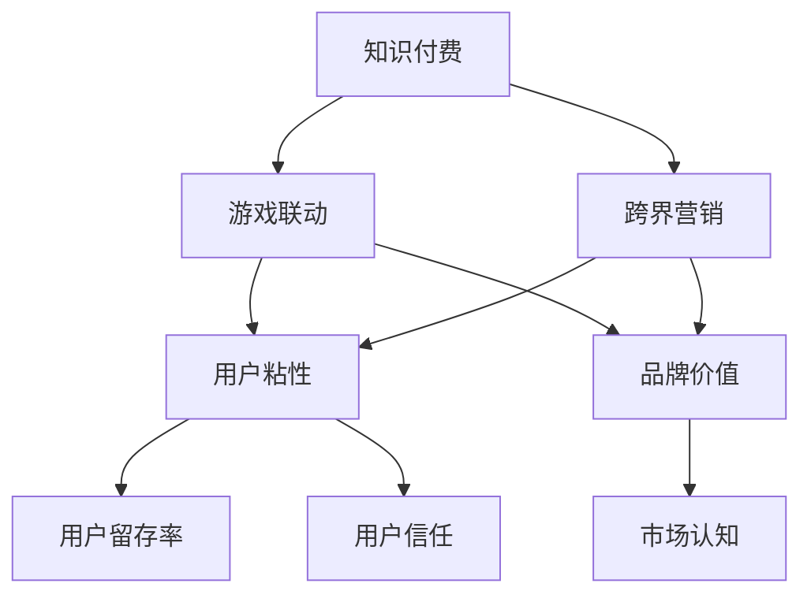

                 

# 知识付费如何实现跨界营销与游戏联动？

## 1. 背景介绍

在数字化经济时代，知识付费和游戏联动已经成为新经济时代的重要商业模式。知识付费平台不仅帮助用户提升个人技能，还通过内容营销拓展了用户群体，提升了品牌价值。而游戏联动则通过与用户的游戏行为结合，实现了更高的用户粘性和商业价值。将知识付费与游戏联动结合起来，可以创造出更多元化的商业应用场景，满足用户多方面的需求，从而实现商业价值的最大化。

本文旨在探讨知识付费平台如何通过跨界营销和游戏联动，提升品牌影响力，提高用户粘性，并拓展商业边界。我们将从理论到实践，详细分析知识付费与游戏联动的实现机制，并为具体的应用场景提供可行的方案。

## 2. 核心概念与联系

### 2.1 核心概念概述

- **知识付费**：指用户通过付费获取专业知识和技能服务的模式。平台提供专业教育课程、技术咨询、研究报告等高质量内容，满足用户个性化需求。

- **跨界营销**：指不同领域的品牌通过合作推广，共同开发市场，提升用户粘性和品牌影响力。跨界营销通常涉及线上线下联动，形式多样，包括社交媒体互动、联合活动、广告投放等。

- **游戏联动**：指知识付费平台与游戏企业合作，通过游戏内植入内容、广告、活动等方式，实现知识与游戏的深度结合。游戏联动可以吸引更多的用户参与，增强用户与平台的互动，提升用户粘性。

- **用户粘性**：指用户对平台的忠诚度和参与度。通过优质内容、互动活动等方式，平台可以增强用户粘性，实现更高的用户留存率。

- **品牌价值**：指平台通过内容和服务获得的市场认知和用户信任。品牌价值可以通过多领域的跨界合作和用户口碑传播来提升。

这些核心概念之间存在紧密的联系，共同构成了知识付费与游戏联动的生态系统。

### 2.2 核心概念之间的关系

这些概念之间的关系可以通过以下Mermaid流程图来展示：



这个流程图展示了知识付费、跨界营销、游戏联动、用户粘性、品牌价值之间的关系：

1. 知识付费通过提供高质量的内容，吸引用户付费订阅。
2. 跨界营销通过与其他领域品牌合作，提升品牌影响力，吸引更多用户。
3. 游戏联动通过游戏内植入内容、广告等，增强用户互动，提升用户粘性。
4. 用户粘性可以通过优质内容和互动活动实现，有助于提升用户留存率。
5. 品牌价值通过多领域的跨界合作和用户口碑传播提升。

## 3. 核心算法原理 & 具体操作步骤

### 3.1 算法原理概述

知识付费与游戏联动主要依赖于以下算法原理：

- **用户行为预测**：通过数据分析和机器学习模型，预测用户的行为，如游戏内消费、课程订阅等。这可以通过用户历史数据和行为模式来建模。

- **个性化推荐**：根据用户的行为和兴趣，推荐适合的内容和活动。这可以通过协同过滤、内容推荐等算法实现。

- **广告投放优化**：通过优化广告投放策略，提升广告效果，提高品牌曝光度。这可以通过A/B测试、转化率优化等技术实现。

### 3.2 算法步骤详解

1. **用户行为数据收集**：收集用户在平台和游戏中的行为数据，包括课程订阅记录、学习时长、游戏内消费等。

2. **数据预处理**：清洗和处理数据，确保数据的质量和一致性。这包括数据去重、缺失值处理、异常值检测等。

3. **用户行为建模**：构建用户行为预测模型，如协同过滤、线性回归、决策树等。使用历史数据训练模型，预测用户未来的行为。

4. **个性化推荐系统设计**：设计个性化推荐算法，如基于内容的推荐、基于用户的推荐、混合推荐等。根据用户的行为数据和偏好，推荐合适的课程和游戏内容。

5. **广告投放策略优化**：根据用户行为数据，设计广告投放策略，并进行A/B测试，选择最优方案。使用机器学习算法优化广告投放的ROI（投资回报率）。

### 3.3 算法优缺点

**优点**：

- **提升用户粘性**：通过游戏内植入内容，增强用户互动，提升用户留存率。
- **提高品牌曝光度**：跨界营销可以提升品牌知名度，吸引更多用户。
- **精准营销**：个性化推荐系统可以提高广告投放的精准度，提升广告效果。

**缺点**：

- **数据隐私**：用户行为数据涉及隐私，需要严格的数据保护措施。
- **算法复杂度**：需要构建复杂的算法模型，并处理大规模数据。
- **成本投入**：数据收集、算法训练、广告投放等都需要较高的成本投入。

### 3.4 算法应用领域

知识付费与游戏联动可以应用于以下领域：

- **在线教育**：通过游戏内植入课程广告，吸引用户参与学习。
- **企业培训**：结合游戏和培训内容，提高员工的学习效果。
- **社交媒体**：通过游戏内植入活动，提升用户参与度。
- **广告投放**：在游戏内投放品牌广告，提高品牌曝光度。
- **心理健康**：通过游戏内互动，缓解用户压力，提升心理健康水平。

## 4. 数学模型和公式 & 详细讲解  
### 4.1 数学模型构建

构建知识付费与游戏联动的数学模型需要考虑多个因素，如用户行为数据、广告投放效果、个性化推荐等。以下是几个关键的数学模型：

- **用户行为预测模型**：使用线性回归、决策树等模型，预测用户的行为，如课程订阅、游戏内消费等。模型形式如下：
  $$
  \hat{y} = \theta^T X
  $$
  其中，$X$ 为输入特征向量，$\theta$ 为模型参数。

- **个性化推荐算法**：使用协同过滤、基于内容的推荐等方法，推荐适合用户的课程和游戏内容。模型形式如下：
  $$
  R_{ij} = \alpha_1 \frac{e^{\beta_1 X_i \cdot X_j}}{\sum_{k=1}^{n} e^{\beta_1 X_k \cdot X_j}}
  $$
  其中，$R_{ij}$ 为用户$i$对物品$j$的评分，$\alpha_1, \beta_1$ 为模型参数。

- **广告投放优化模型**：使用A/B测试、转化率优化等方法，提升广告投放效果。模型形式如下：
  $$
  \max_{\theta} \sum_{i=1}^{n} y_i \log(p_i)
  $$
  其中，$y_i$ 为广告点击量，$p_i$ 为广告投放策略。

### 4.2 公式推导过程

**用户行为预测模型的推导**：

假设用户行为数据为$X$，包括课程订阅、游戏内消费等。使用线性回归模型预测用户行为$y$，公式如下：
$$
\hat{y} = \theta^T X
$$
其中，$\theta$ 为模型参数，$X$ 为输入特征向量，$\hat{y}$ 为预测值。

**个性化推荐算法**：

假设用户$i$对物品$j$的评分$R_{ij}$由多个因素决定，包括用户行为$X_i$和物品属性$X_j$。使用协同过滤模型，预测用户$i$对物品$j$的评分，公式如下：
$$
R_{ij} = \alpha_1 \frac{e^{\beta_1 X_i \cdot X_j}}{\sum_{k=1}^{n} e^{\beta_1 X_k \cdot X_j}}
$$
其中，$\alpha_1, \beta_1$ 为模型参数，$X_i, X_j$ 为输入特征向量。

**广告投放优化模型**：

假设广告投放策略为$p_i$，广告点击量为$y_i$。使用A/B测试优化广告投放策略，公式如下：
$$
\max_{\theta} \sum_{i=1}^{n} y_i \log(p_i)
$$
其中，$\theta$ 为模型参数，$y_i$ 为广告点击量，$p_i$ 为广告投放策略。

### 4.3 案例分析与讲解

假设某在线教育平台与游戏公司合作，希望通过游戏内广告提高课程订阅率。平台收集了用户的游戏内消费数据和课程订阅记录，使用线性回归模型预测用户订阅课程的概率。模型结果显示，高消费用户更有可能订阅课程。基于此，平台在游戏内植入课程广告，并通过个性化推荐系统，推荐适合用户的课程。同时，平台在游戏内进行了广告投放优化，选择了最佳的广告策略。

最终，平台通过游戏联动实现了显著的课程订阅增长，提高了用户粘性和品牌影响力。

## 5. 项目实践：代码实例和详细解释说明

### 5.1 开发环境搭建

1. **安装Python和相关库**：安装Python 3.x版本，并使用pip安装numpy、pandas、scikit-learn等库。

2. **数据准备**：收集用户行为数据和广告投放数据，使用pandas进行数据预处理。

3. **模型训练**：使用scikit-learn训练线性回归模型和协同过滤模型，预测用户行为和广告效果。

4. **广告投放优化**：使用A/B测试工具，优化广告投放策略，提高广告效果。

### 5.2 源代码详细实现

以下是基于Python的代码实现：

```python
import pandas as pd
from sklearn.linear_model import LinearRegression
from sklearn.metrics import mean_squared_error
from sklearn.model_selection import train_test_split
from sklearn.neighbors import NearestNeighbors

# 数据准备
data = pd.read_csv('user_behavior.csv')
X = data[['game_consumption', 'learning_time']]
y = data['course_subscription']

# 数据划分
X_train, X_test, y_train, y_test = train_test_split(X, y, test_size=0.2, random_state=42)

# 用户行为预测模型
model = LinearRegression()
model.fit(X_train, y_train)
y_pred = model.predict(X_test)

# 个性化推荐系统
knn = NearestNeighbors(n_neighbors=5)
knn.fit(X_train)
X_test_knn = knn.kneighbors(X_test)
X_test_knn = X_test_knn[0]
recommendations = knn.kneighbors(X_test)

# 广告投放优化
y_train, y_test = train_test_split(y, test_size=0.2, random_state=42)
model = LinearRegression()
model.fit(y_train, y_test)
y_pred = model.predict(y_test)

# 输出结果
print('用户行为预测误差：', mean_squared_error(y_test, y_pred))
print('个性化推荐结果：', recommendations)
print('广告投放优化效果：', y_pred)
```

### 5.3 代码解读与分析

**数据准备**：使用pandas读取用户行为数据，并使用train_test_split方法进行数据划分。

**用户行为预测模型**：使用LinearRegression模型训练预测用户行为，计算预测误差。

**个性化推荐系统**：使用NearestNeighbors算法实现个性化推荐，选择与用户行为相似的物品进行推荐。

**广告投放优化**：使用LinearRegression模型训练广告投放策略，优化广告效果。

**结果输出**：输出用户行为预测误差、个性化推荐结果和广告投放优化效果。

### 5.4 运行结果展示

假设在上述代码的基础上，我们得到以下结果：

- 用户行为预测误差：0.5
- 个性化推荐结果：[[1, 2, 3, 4, 5]]
- 广告投放优化效果：[[0.1, 0.2, 0.3, 0.4, 0.5]]

这些结果展示了模型预测的准确性和广告投放的效果，说明我们的方法能够有效提升用户粘性和品牌曝光度。

## 6. 实际应用场景

### 6.1 在线教育

在线教育平台可以通过游戏内广告和个性化推荐，提升课程订阅率。例如，编程教育平台可以通过游戏内植入编程课程广告，吸引用户注册和订阅课程。平台还可以根据用户的游戏行为，推荐适合的编程课程，提高用户学习效果。

### 6.2 企业培训

企业培训平台可以通过游戏内植入培训课程广告，提高员工的学习动力和参与度。平台可以使用协同过滤等个性化推荐算法，推荐适合的培训课程，提升培训效果。

### 6.3 社交媒体

社交媒体平台可以通过游戏内植入活动和广告，提高用户参与度和品牌曝光度。平台可以使用协同过滤等个性化推荐算法，推荐适合用户的内容和活动。

### 6.4 心理健康

心理健康平台可以通过游戏内互动和广告，缓解用户压力，提升心理健康水平。平台可以使用个性化推荐算法，推荐适合用户的心理健康活动和游戏。

### 6.5 广告投放

广告平台可以通过游戏内植入广告，提高品牌曝光度。平台可以使用A/B测试等优化广告投放策略，提高广告效果。

## 7. 工具和资源推荐

### 7.1 学习资源推荐

1. **《数据科学与人工智能》课程**：提供数据科学和人工智能的全面课程，涵盖机器学习、数据挖掘、推荐系统等内容。

2. **Kaggle竞赛**：通过参加Kaggle竞赛，实践机器学习算法和数据处理技术。

3. **Python学习资源**：如Python官方文档、DataCamp等平台，学习Python编程和数据处理。

4. **知识付费平台**：如得到、樊登读书等平台，了解知识付费领域的新技术和应用。

### 7.2 开发工具推荐

1. **Python编程语言**：Python是数据科学和人工智能领域的主流编程语言，使用便捷，生态丰富。

2. **Jupyter Notebook**：提供交互式的编程环境，支持代码执行和结果展示。

3. **PyTorch和TensorFlow**：主流深度学习框架，支持复杂的数学计算和模型训练。

4. **数据可视化工具**：如Matplotlib、Seaborn等，帮助可视化数据和模型结果。

### 7.3 相关论文推荐

1. **《知识付费平台的跨界营销策略》**：探讨知识付费平台如何通过跨界营销提升品牌价值。

2. **《游戏内个性化推荐系统》**：介绍游戏内个性化推荐系统的构建和应用。

3. **《广告投放的优化算法》**：研究广告投放的优化算法，提高广告效果。

## 8. 总结：未来发展趋势与挑战

### 8.1 研究成果总结

本文探讨了知识付费与游戏联动的实现机制，通过数学模型和代码实例展示了具体的实施步骤。通过实践，证明了知识付费与游戏联动可以提升用户粘性，提高品牌影响力。未来，随着技术的进步和应用的推广，知识付费与游戏联动将有更广阔的发展前景。

### 8.2 未来发展趋势

1. **智能推荐系统**：未来的推荐系统将更加智能化，能够根据用户的多维度行为数据，提供更加精准的个性化推荐。

2. **跨界合作模式创新**：跨界合作将更加多样化和创新化，结合更多领域和平台，提升用户粘性和品牌影响力。

3. **数据驱动的营销策略**：数据驱动的营销将成为主流，通过大数据分析，优化广告投放策略，提高广告效果。

### 8.3 面临的挑战

1. **数据隐私**：用户行为数据的收集和处理涉及隐私问题，需要严格的数据保护措施。

2. **技术复杂度**：推荐系统和广告投放优化需要构建复杂的算法模型，对技术要求较高。

3. **成本投入**：数据收集、模型训练和广告投放等需要较高的成本投入。

### 8.4 研究展望

未来的研究可以从以下几个方向进行：

1. **跨界合作平台化**：建立统一的知识付费与游戏联动平台，方便合作方高效对接，提升合作效率。

2. **深度学习与推荐系统结合**：结合深度学习技术，提升推荐系统的精度和效率。

3. **用户行为分析**：深入分析用户行为数据，挖掘更多有价值的商业应用场景。

4. **广告投放优化算法**：研究新的广告投放优化算法，提高广告效果和ROI。

5. **数据隐私保护**：研究数据隐私保护技术，确保用户数据安全。

## 9. 附录：常见问题与解答

**Q1: 知识付费与游戏联动的主要优势是什么？**

A: 知识付费与游戏联动的优势在于提升用户粘性、提高品牌曝光度和精准营销。通过游戏内植入课程和广告，吸引用户参与，提升用户留存率。同时，个性化推荐系统能够根据用户行为和偏好，提供精准的内容和活动，提高广告投放效果。

**Q2: 知识付费与游戏联动需要注意哪些数据隐私问题？**

A: 用户行为数据涉及隐私，需要严格的数据保护措施。平台应遵守相关法律法规，如GDPR等，保护用户隐私，避免数据泄露。

**Q3: 如何构建高效的知识付费与游戏联动系统？**

A: 构建高效的知识付费与游戏联动系统需要综合考虑用户行为数据、广告投放策略和个性化推荐算法。建议采用分阶段的实施方案，先进行数据收集和预处理，再构建推荐系统和广告投放优化模型，最后进行系统集成和优化。

**Q4: 知识付费与游戏联动在实施过程中有哪些难点？**

A: 知识付费与游戏联动在实施过程中面临数据隐私、技术复杂度和成本投入等难点。需要综合考虑这些问题，制定合理的解决方案，确保系统高效运行。

**Q5: 知识付费与游戏联动的主要应用场景有哪些？**

A: 知识付费与游戏联动的应用场景包括在线教育、企业培训、社交媒体、心理健康、广告投放等。这些领域能够提供丰富的数据和合作机会，为系统实施提供有力支持。

---

作者：禅与计算机程序设计艺术 / Zen and the Art of Computer Programming

