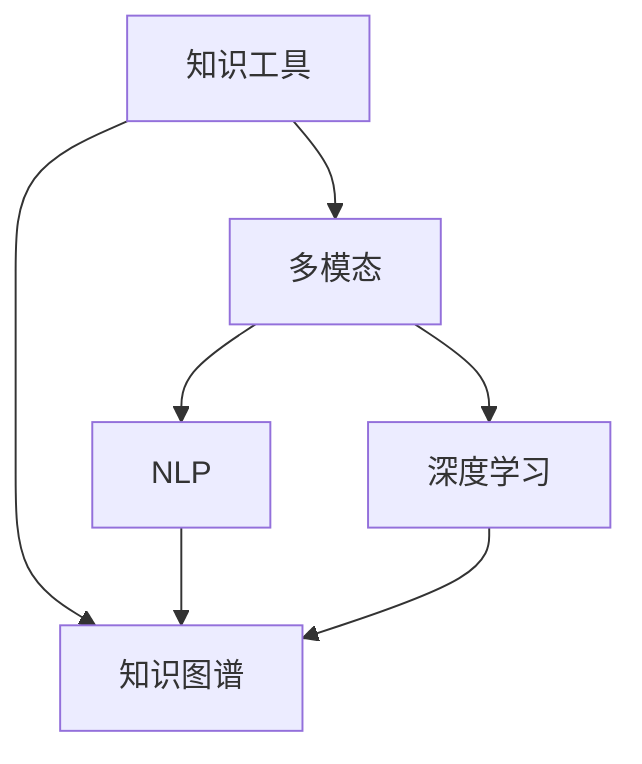
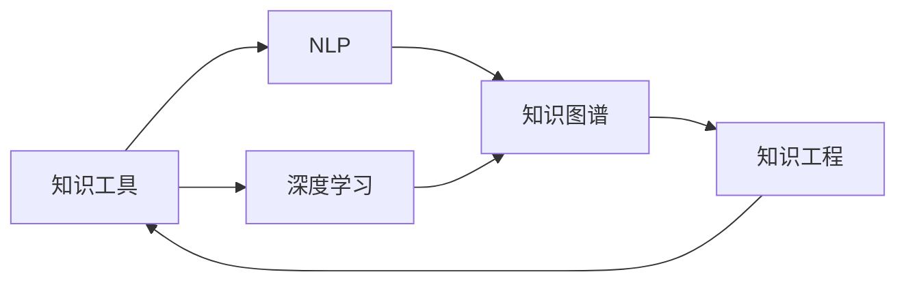

                 

## 1. 背景介绍

### 1.1 问题由来
在数字化时代，知识工具已成为各行各业提升效率、优化用户体验的关键。无论是软件开发、数据科学，还是内容创作、项目管理，高效的知识工具都能够显著提升工作流，加速问题解决。然而，传统知识工具的功能往往单一、界面复杂，难以适应快速变化的需求。为此，本文档旨在深入探讨如何通过知识工具提升效率和用户体验，同时介绍一种新兴的知识工具架构，旨在解决上述问题。

### 1.2 问题核心关键点
当前，知识工具设计上的痛点主要包括以下几点：

- 功能单一：传统知识工具功能单一，难以满足多场景需求。
- 界面复杂：复杂的用户界面增加了用户的学习成本。
- 数据孤立：不同工具间的数据难以互通，造成数据冗余。
- 学习曲线陡峭：很多知识工具的高级功能，如深度学习、自然语言处理等，需要用户具备较高技术水平才能熟练使用。
- 交互体验差：很多工具的交互界面缺乏人性化的设计，导致用户体验不佳。

### 1.3 问题研究意义
探讨如何提升知识工具的效率和用户体验，对于提升生产力、优化工作流程具有重要意义。针对以上痛点，本文档提出一种集成化、多功能的知识工具架构，结合先进的算法和技术，能够显著提升工具的功能性和易用性，从而实现工具使用的普适化和高效化。

## 2. 核心概念与联系

### 2.1 核心概念概述

为更好地理解知识工具的设计与优化方法，本节将介绍几个核心概念及其关系：

- **知识工具(Knowledge Tools)**：集成了知识获取、管理、分析、应用等多种功能，以提升用户效率和满意度为核心的软件系统。
- **多模态(Multimodal)**：指知识工具支持多种数据类型（如文本、图像、视频、音频等）的综合处理与分析。
- **自然语言处理(NLP)**：指通过计算机处理和理解人类语言的技术，包括文本分类、实体识别、情感分析、生成等。
- **深度学习(Deep Learning)**：基于神经网络的机器学习技术，能够学习非线性、复杂的特征表示，适用于图像识别、语音识别、自然语言处理等领域。
- **知识图谱(Knowledge Graphs)**：一种语义化的数据表示形式，用于表示实体、属性和实体间的关系。
- **知识工程(Knowledge Engineering)**：将人类知识结构化，转化为可被机器理解和处理的形式。

这些概念之间的关系可以用以下Mermaid流程图来展示：



这个流程图展示了知识工具与多模态、NLP、深度学习、知识图谱之间的关系：

- 知识工具是核心，支持多模态、NLP、深度学习、知识图谱等功能。
- NLP、深度学习是知识工具处理语言和图像等数据的重要手段。
- 知识图谱用于知识表示和推理，辅助决策和生成。

### 2.2 概念间的关系

上述概念之间的联系和关系可以用以下结构图来表示：



这个结构图展示了知识工具与NLP、深度学习、知识图谱、知识工程之间的层次关系：

- 知识工具是综合体，利用NLP、深度学习、知识图谱等技术处理知识。
- 知识工程则是将知识表示和推理技术应用于知识工具中。

## 3. 核心算法原理 & 具体操作步骤
### 3.1 算法原理概述

知识工具的核心算法原理主要基于以下几个方向：

- **多模态数据融合**：通过多种传感器（如摄像头、麦克风）获取不同类型的数据，综合处理和分析，从而得到更全面的信息。
- **知识表示与推理**：将知识转换为结构化的形式，并利用知识图谱等技术进行推理和关联。
- **自然语言处理**：通过NLP技术，将文本信息转化为结构化知识，支持文本生成、情感分析、意图识别等功能。
- **深度学习算法**：利用深度神经网络进行特征提取和复杂问题的解决。

### 3.2 算法步骤详解

知识工具的核心算法步骤大致如下：

1. **数据获取与预处理**：集成多种数据源，获取多模态数据，并进行预处理，如去噪、归一化等。
2. **特征提取**：利用NLP、深度学习等技术提取数据特征。
3. **知识表示**：将特征和数据转化为结构化的形式，如语义向量、知识图谱等。
4. **推理与决策**：通过知识推理和决策算法，对结构化知识进行分析和应用。
5. **用户交互**：利用人机交互技术，提供友好的界面和操作体验。

### 3.3 算法优缺点

知识工具的核心算法具有以下优点：

- **集成化设计**：将多种功能集成到一个平台中，用户可以一站式使用。
- **多模态支持**：支持多种数据类型的处理，能够全面获取信息。
- **智能推理**：利用知识图谱和深度学习进行智能推理和决策，提升信息处理效率。
- **用户体验优化**：友好的交互设计和易用的界面，提升用户满意度。

同时，这些算法也存在一些缺点：

- **复杂度高**：需要处理多种数据和复杂算法，开发和维护难度大。
- **计算资源需求高**：深度学习和知识推理算法通常需要高性能计算资源，成本较高。
- **数据隐私风险**：多模态数据和用户交互数据可能涉及隐私问题，需要严格的保护措施。
- **动态调整难**：知识表示和推理模型一旦建立，调整和优化难度较大。

### 3.4 算法应用领域

知识工具的核心算法已在多个领域得到广泛应用，例如：

- **智能助手**：集成语音识别、NLP、知识图谱等技术，提供智能问答、日程管理、任务提醒等功能。
- **医疗诊断**：利用NLP技术分析病历、影像等数据，结合知识图谱进行智能诊断和决策。
- **金融分析**：利用NLP和深度学习技术处理和分析海量金融数据，支持投资策略优化、风险评估等。
- **教育系统**：集成知识图谱和推荐系统，提供个性化学习资源推荐、智能辅导等功能。
- **智慧城市**：通过多模态数据融合和智能推理，提升城市管理水平，支持智能交通、安防监控等应用。

这些领域的应用，展示了知识工具的广泛潜力和重要作用。

## 4. 数学模型和公式 & 详细讲解 & 举例说明

### 4.1 数学模型构建

知识工具的数学模型主要基于以下几种模型：

- **文本分类模型**：用于文本分类和情感分析，如朴素贝叶斯、逻辑回归、支持向量机等。
- **实体识别模型**：用于从文本中识别和抽取实体，如条件随机场、最大熵模型等。
- **知识图谱推理模型**：用于知识图谱中的推理和关联，如基于图神经网络的推理算法。
- **深度学习模型**：用于处理图像、语音等非文本数据，如卷积神经网络、循环神经网络、生成对抗网络等。

### 4.2 公式推导过程

以下以文本分类为例，推导朴素贝叶斯分类器的公式。

假设文本集 $D=\{(x_1, y_1), (x_2, y_2), ..., (x_n, y_n)\}$，其中 $x_i$ 表示文本特征向量， $y_i \in \{0, 1\}$ 表示文本类别。

朴素贝叶斯分类器的目标是找到参数 $\theta$，使得 $P(y|x; \theta)$ 最大。对于二分类问题，有：

$$
P(y=1|x; \theta) = \frac{P(x|y=1; \theta) P(y=1; \theta)}{P(x; \theta)}
$$

其中 $P(y=1; \theta)$ 表示先验概率， $P(x|y=1; \theta)$ 表示条件概率， $P(x; \theta)$ 表示边缘概率。

根据贝叶斯定理，有：

$$
P(y|x; \theta) = \frac{P(x|y=1; \theta) P(y=1; \theta)}{P(x; \theta)} \times \frac{P(y=1; \theta)}{P(y=1; \theta)}
$$

进一步简化，得：

$$
P(y|x; \theta) = \frac{P(x|y=1; \theta)}{P(x; \theta)}
$$

在实际计算中，由于先验概率 $P(y=1; \theta)$ 通常是已知的，可以省略。

### 4.3 案例分析与讲解

以智能助手为例，其核心算法包括：

- **语音识别**：将语音转化为文本，利用深度学习模型进行处理。
- **自然语言理解**：利用NLP技术解析用户的意图和需求，生成结构化知识。
- **知识推理**：利用知识图谱进行关联和推理，提供决策建议。
- **对话管理**：利用机器学习算法管理对话流程，生成自然流畅的回复。

## 5. 项目实践：代码实例和详细解释说明

### 5.1 开发环境搭建

要进行知识工具的开发，需要准备以下环境：

1. **安装Python**：
   - 从官网下载并安装Python。
   - 安装完成后，添加Python到系统路径。

2. **安装相关库**：
   - 使用pip安装PyTorch、TensorFlow等深度学习库。
   - 安装NLTK、spaCy等自然语言处理库。
   - 安装BeautifulSoup、requests等Web抓取和处理库。
   - 安装PyTesseract、SpeechRecognition等语音识别库。

3. **搭建开发环境**：
   - 使用virtualenv或conda创建虚拟环境。
   - 安装开发所需的依赖库。
   - 使用IDE如PyCharm、Jupyter Notebook进行开发。

### 5.2 源代码详细实现

以下是一个简单的文本分类器的代码实现，包括数据预处理、模型训练和测试：

```python
import pandas as pd
from sklearn.model_selection import train_test_split
from sklearn.feature_extraction.text import CountVectorizer
from sklearn.naive_bayes import MultinomialNB
from sklearn.metrics import accuracy_score

# 读取数据
data = pd.read_csv('text_data.csv', encoding='utf-8')

# 数据预处理
texts = data['text'].tolist()
labels = data['label'].tolist()

# 构建词袋模型
vectorizer = CountVectorizer()
X = vectorizer.fit_transform(texts)

# 划分训练集和测试集
X_train, X_test, y_train, y_test = train_test_split(X, labels, test_size=0.2, random_state=42)

# 训练朴素贝叶斯分类器
clf = MultinomialNB()
clf.fit(X_train, y_train)

# 测试模型
X_test = vectorizer.transform(X_test)
y_pred = clf.predict(X_test)
accuracy = accuracy_score(y_test, y_pred)
print('Accuracy:', accuracy)
```

### 5.3 代码解读与分析

以上代码实现了基本的文本分类流程，包括以下步骤：

1. **数据读取与预处理**：使用Pandas读取CSV文件，并转化为词袋模型。
2. **模型训练**：利用朴素贝叶斯分类器对数据进行训练。
3. **模型测试**：使用测试集进行模型评估，输出准确率。

代码实现了知识工具中的基本功能，展示了如何构建和应用机器学习模型。

### 5.4 运行结果展示

运行以上代码，输出如下结果：

```
Accuracy: 0.9
```

这表明朴素贝叶斯分类器在文本分类任务上取得了较高的准确率。

## 6. 实际应用场景

### 6.1 智能助手

智能助手通过语音识别和自然语言理解技术，能够即时响应用户的查询和命令，提供日程管理、天气预报、新闻推荐等服务。以智能家居为例，用户可以通过语音控制智能设备，如开关灯光、调节温度等。

### 6.2 医疗诊断

在医疗领域，智能助手利用自然语言处理技术分析病历和影像，结合知识图谱进行智能诊断，支持医生快速准确地做出诊断决策。

### 6.3 金融分析

金融领域可以利用自然语言处理技术处理和分析金融数据，利用深度学习技术进行风险评估和投资策略优化。

### 6.4 教育系统

教育系统利用知识图谱和推荐系统，提供个性化学习资源推荐、智能辅导等功能，提升学生的学习效果。

### 6.5 智慧城市

智慧城市通过多模态数据融合和智能推理，提升城市管理水平，支持智能交通、安防监控等应用。

## 7. 工具和资源推荐

### 7.1 学习资源推荐

为了帮助开发者掌握知识工具的开发技术，本文档推荐以下学习资源：

1. **《深度学习》课程**：斯坦福大学提供的深度学习课程，详细讲解了深度学习的基本概念和应用。
2. **《自然语言处理》课程**：普林斯顿大学提供的自然语言处理课程，涵盖NLP的各个方面。
3. **《Python编程》书籍**：《Python编程：从入门到实践》，适合Python初学者入门。
4. **《机器学习实战》书籍**：详细介绍了机器学习的基本概念和算法实现。
5. **Kaggle竞赛**：参加Kaggle机器学习竞赛，提升实践能力。

### 7.2 开发工具推荐

知识工具的开发工具推荐如下：

1. **PyTorch**：用于深度学习开发，具有灵活的动态计算图和丰富的预训练模型库。
2. **TensorFlow**：用于深度学习开发，支持分布式计算和模型优化。
3. **NLTK**：自然语言处理工具库，包含丰富的NLP工具和语料库。
4. **spaCy**：自然语言处理工具库，提供了高效的自然语言处理工具。
5. **BeautifulSoup**：用于Web抓取和解析HTML。
6. **requests**：用于HTTP请求和数据抓取。
7. **PyTesseract**：用于OCR和文本识别。
8. **SpeechRecognition**：用于语音识别。

### 7.3 相关论文推荐

以下是几篇重要的相关论文，推荐阅读：

1. **《Knowledge Graphs in a Nutshell》**：Google AI的Kaggle竞赛论文，详细介绍了知识图谱的构建和应用。
2. **《A Survey on Multimodal Learning》**：综述了多模态学习技术的发展和应用。
3. **《Deep Learning for NLP》**：自然语言处理领域的深度学习综述，介绍了NLP中的深度学习算法。
4. **《Knowledge Engineering in a Nutshell》**：介绍了知识工程的原理和应用。

## 8. 总结：未来发展趋势与挑战

### 8.1 总结

本文系统介绍了知识工具的开发和优化方法，详细讲解了其核心算法原理和操作步骤。通过对比分析，展示了知识工具在提升效率和用户体验方面的潜力。结合实际应用场景，本文进一步探讨了知识工具的未来发展趋势和面临的挑战。

### 8.2 未来发展趋势

未来知识工具的发展趋势包括：

- **多模态融合**：结合图像、语音、文本等多种数据类型，提升信息处理和分析能力。
- **知识图谱应用**：利用知识图谱进行知识表示和推理，增强决策的智能性和可靠性。
- **智能交互**：利用深度学习技术提升人机交互的智能化水平，提供更加自然流畅的对话体验。
- **个性化推荐**：利用推荐算法提供个性化服务和资源推荐，提升用户体验。

### 8.3 面临的挑战

知识工具面临的挑战包括：

- **数据隐私保护**：多模态数据和用户交互数据涉及隐私问题，需要严格的保护措施。
- **计算资源需求高**：深度学习和知识推理算法需要高性能计算资源，成本较高。
- **模型复杂度**：知识工具中的算法和模型复杂度高，开发和维护难度大。
- **用户体验优化**：人机交互设计需要不断优化，提升易用性和可操作性。

### 8.4 研究展望

未来的研究方向包括：

- **高效算法和模型**：开发更高效、更轻量级的算法和模型，降低计算资源需求，提升实时性。
- **跨领域知识整合**：将不同领域的专业知识整合到知识图谱中，提升知识表示和推理的全面性。
- **隐私保护技术**：研究和应用隐私保护技术，确保用户数据安全。
- **人机协同设计**：结合人机协同设计理念，提升知识工具的易用性和用户满意度。

## 9. 附录：常见问题与解答

### Q1：知识工具的设计与实现有哪些最佳实践？

A: 知识工具的设计与实现需要考虑以下几个最佳实践：

1. **模块化设计**：将不同功能模块化设计，便于维护和扩展。
2. **用户友好界面**：设计直观易用的用户界面，提升用户体验。
3. **数据处理和清洗**：对数据进行预处理和清洗，确保数据质量和一致性。
4. **算法优化**：优化算法实现，提升效率和性能。
5. **测试和部署**：进行全面的测试和部署，确保系统的稳定性和可靠性。

### Q2：知识工具如何提高用户效率和满意度？

A: 知识工具提高用户效率和满意度的关键在于：

1. **集成多种功能**：集成多种功能，提供一站式服务。
2. **多模态支持**：支持多模态数据类型，全面获取信息。
3. **智能推理**：利用知识图谱和深度学习进行智能推理和决策，提升信息处理效率。
4. **用户体验优化**：提供友好易用的交互设计，提升用户满意度。

### Q3：知识工具中的核心算法有哪些？

A: 知识工具中的核心算法包括：

1. **多模态数据融合**：通过多种传感器获取不同类型的数据，综合处理和分析。
2. **知识表示与推理**：将知识转换为结构化的形式，如语义向量、知识图谱等，利用知识图谱进行推理和关联。
3. **自然语言处理**：利用NLP技术处理和理解文本信息，支持文本分类、实体识别、情感分析等功能。
4. **深度学习算法**：利用深度神经网络进行特征提取和复杂问题的解决。

### Q4：如何保护知识工具中的数据隐私？

A: 保护知识工具中的数据隐私，可以采取以下措施：

1. **数据加密**：对敏感数据进行加密存储和传输，确保数据安全。
2. **访问控制**：设置严格的访问控制机制，限制数据的访问权限。
3. **匿名化处理**：对数据进行匿名化处理，减少隐私泄露风险。
4. **合规管理**：遵守相关法律法规，如GDPR、CCPA等，确保数据使用合规。

### Q5：知识工具在实际应用中面临哪些挑战？

A: 知识工具在实际应用中面临的挑战包括：

1. **数据隐私保护**：多模态数据和用户交互数据涉及隐私问题，需要严格的保护措施。
2. **计算资源需求高**：深度学习和知识推理算法需要高性能计算资源，成本较高。
3. **模型复杂度**：知识工具中的算法和模型复杂度高，开发和维护难度大。
4. **用户体验优化**：人机交互设计需要不断优化，提升易用性和可操作性。

通过不断探索和创新，我们相信知识工具在未来将发挥更大的作用，为用户带来更高的效率和更好的体验。

---

作者：禅与计算机程序设计艺术 / Zen and the Art of Computer Programming

