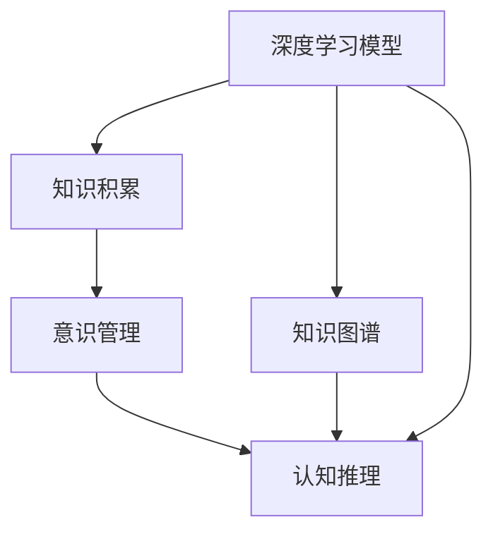
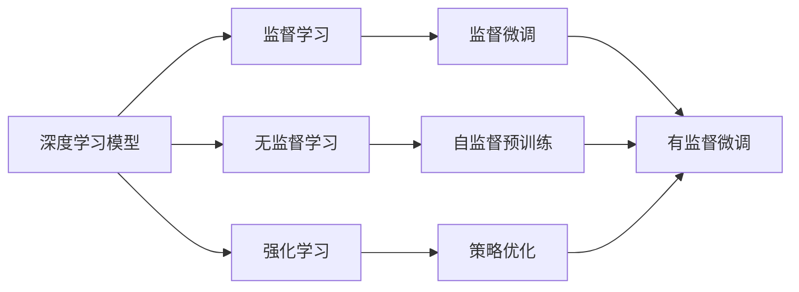
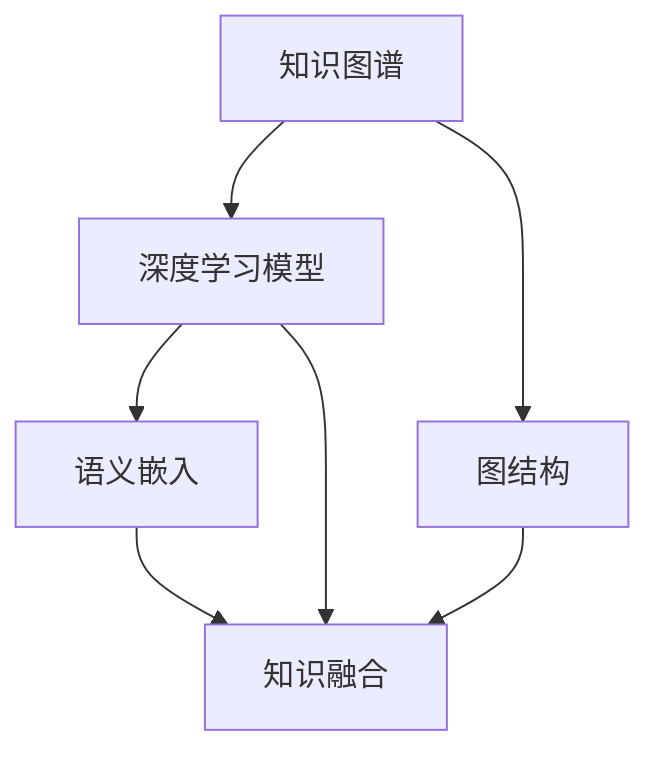
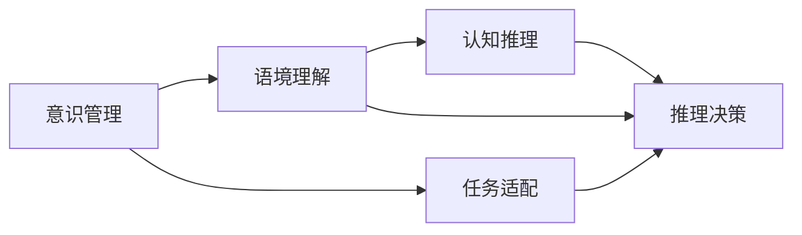
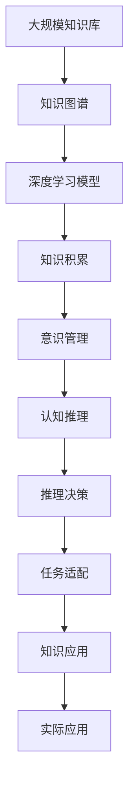

                 

# 知识积累在意识管理中的作用

> 关键词：知识积累,意识管理,人工智能,认知科学,深度学习,神经网络,知识图谱

## 1. 背景介绍

### 1.1 问题由来
随着人工智能技术的飞速发展，深度学习和神经网络模型在各类领域取得了显著的成果。但与此同时，知识的积累和处理问题也变得愈加突出。一方面，大量非结构化的知识数据需要有效的处理和利用，从而辅助模型更好地完成推理和决策；另一方面，模型的持续学习和适应能力也对知识的积累提出了新的要求。

本文将从意识管理的角度探讨知识积累的重要性和具体实现方法，通过建立知识与意识之间的联系，深入分析知识积累在认知和决策过程中所起的作用，并结合具体案例进行详细阐述。

### 1.2 问题核心关键点
知识积累在意识管理中的作用主要体现在以下几个方面：

1. **提高模型的泛化能力**：通过积累知识，模型可以更好地理解语义，识别模式，从而提高对新数据和新场景的泛化能力。
2. **增强模型的适应性**：积累的知识使模型能够适应不断变化的环境，避免过拟合和灾难性遗忘。
3. **促进模型的持续学习**：通过积累知识，模型能够逐步构建更丰富的知识体系，实现终身学习。
4. **改善模型的决策质量**：知识积累有助于模型更好地理解和利用语境信息，从而提高决策的准确性和合理性。
5. **提升模型的创新能力**：知识积累为模型提供了新的思维模式和灵感，促进了创新性问题的解决。

### 1.3 问题研究意义
探讨知识积累在意识管理中的作用，对于理解深度学习模型的认知机制、提升其性能和泛化能力、加速知识在实际应用中的传播和利用，具有重要的理论和实践意义。

## 2. 核心概念与联系

### 2.1 核心概念概述

为更好地理解知识积累在意识管理中的作用，本节将介绍几个密切相关的核心概念：

- **知识积累**：通过学习、推理、总结等方式，不断增加模型所掌握的语义和事实信息，提高其对新数据和新场景的理解和处理能力。
- **意识管理**：在人工智能中，意识管理是指通过对认知过程的模拟和管理，使模型能够更好地理解和处理语境信息，从而实现更有效的推理和决策。
- **深度学习模型**：以神经网络为基础，通过多层次非线性变换实现数据抽象和特征提取的模型。
- **知识图谱**：一种用于描述实体及其关系的图结构，可用于辅助深度学习模型进行推理和决策。
- **认知推理**：通过模拟人类认知过程，使模型能够推理、解释和理解复杂的语境信息，从而提高其决策质量。

这些核心概念之间的逻辑关系可以通过以下Mermaid流程图来展示：



这个流程图展示了知识积累与意识管理之间的联系：

1. 深度学习模型通过知识图谱等知识来源，不断积累新的语义和事实信息。
2. 这些积累的知识通过意识管理过程，被模型用来理解语境信息，进行推理和决策。
3. 认知推理进一步增强了模型的推理能力，使其能够更好地处理复杂的语境信息。

### 2.2 概念间的关系

这些核心概念之间存在着紧密的联系，形成了知识积累在意识管理中的应用框架。下面我通过几个Mermaid流程图来展示这些概念之间的关系。

#### 2.2.1 深度学习模型的学习范式



这个流程图展示了深度学习模型的主要学习范式：监督学习、无监督学习和强化学习。这些范式通过监督微调、自监督预训练和策略优化等方法，帮助模型逐步积累知识和提升性能。

#### 2.2.2 知识图谱与深度学习模型的关系



这个流程图展示了知识图谱与深度学习模型的交互过程。知识图谱通过语义嵌入和知识融合等方法，将结构化的知识信息与深度学习模型融合，增强了模型的语义理解和推理能力。

#### 2.2.3 意识管理与深度学习模型的关系



这个流程图展示了意识管理在深度学习模型中的应用过程。意识管理通过语境理解和认知推理等过程，使模型能够更好地处理语境信息，实现推理和决策。

### 2.3 核心概念的整体架构

最后，我们用一个综合的流程图来展示这些核心概念在知识积累和意识管理中的应用：



这个综合流程图展示了从大规模知识库到实际应用的全过程：

1. 大规模知识库中的知识通过知识图谱进行结构化表示。
2. 结构化的知识通过深度学习模型进行语义嵌入和知识融合，形成知识积累。
3. 知识积累通过意识管理过程，使模型更好地理解语境信息。
4. 语境理解与认知推理结合，形成更强大的推理能力。
5. 推理决策通过任务适配应用到实际任务中。
6. 实际应用中的知识更新进一步增强模型的泛化能力和适应性。

通过这些流程图，我们可以更清晰地理解知识积累在意识管理中的应用，为后续深入讨论具体的实现方法奠定了基础。

## 3. 核心算法原理 & 具体操作步骤
### 3.1 算法原理概述

知识积累在意识管理中的作用主要通过以下算法原理实现：

1. **语义嵌入与知识图谱**：利用深度学习模型进行知识图谱中的实体和关系的语义嵌入，将结构化的知识信息转化为高维向量表示，以便模型能够更好地理解和使用。
2. **知识融合与推理**：通过将知识图谱中的语义信息与文本信息进行融合，增强模型的语境理解能力，从而进行更准确的推理和决策。
3. **参数高效微调**：利用知识图谱中的结构信息，对模型的参数进行高效微调，避免过拟合和灾难性遗忘，提高模型的泛化能力。
4. **认知推理与决策**：结合知识图谱和深度学习模型的推理能力，进行更合理的决策，从而提升模型的决策质量。

### 3.2 算法步骤详解

以下是知识积累在意识管理中的具体操作步骤：

**Step 1: 构建知识图谱**

1. **数据收集**：从各种来源收集相关的知识数据，如百科全书、新闻、学术论文等。
2. **实体识别**：使用自然语言处理技术识别知识数据中的实体，如人名、地名、组织名等。
3. **关系抽取**：提取实体之间的关系，如“某某是某某的子类”，构建实体关系图。
4. **图结构化**：将实体关系图进行结构化表示，形成知识图谱。

**Step 2: 语义嵌入与知识融合**

1. **选择模型**：选择适当的深度学习模型，如BERT、GPT等，进行语义嵌入。
2. **训练模型**：使用知识图谱中的实体和关系数据，对模型进行训练，学习实体和关系的语义向量。
3. **融合知识**：将知识图谱中的语义信息与文本信息进行融合，构建融合后的语义表示。
4. **上下文增强**：通过上下文增强技术，进一步增强模型的语境理解能力。

**Step 3: 参数高效微调**

1. **冻结预训练参数**：将模型的一部分参数固定为预训练值，只更新与特定任务相关的参数。
2. **微调训练**：在少量标注数据上进行微调，更新模型的任务相关参数。
3. **模型优化**：使用正则化、Dropout等技术，优化模型，避免过拟合。

**Step 4: 认知推理与决策**

1. **推理模块**：构建推理模块，使用知识图谱中的推理规则，辅助深度学习模型进行推理。
2. **决策机制**：结合知识图谱和模型的推理结果，进行更合理的决策。
3. **任务适配**：根据具体任务需求，适配推理和决策模块，应用到实际场景中。

### 3.3 算法优缺点

知识积累在意识管理中的算法优缺点如下：

**优点**：
1. **提升模型泛化能力**：通过积累知识，模型能够更好地理解语义和模式，提高对新数据和新场景的泛化能力。
2. **增强模型适应性**：积累的知识使模型能够适应不断变化的环境，避免过拟合和灾难性遗忘。
3. **促进模型持续学习**：通过积累知识，模型能够逐步构建更丰富的知识体系，实现终身学习。
4. **改善模型决策质量**：知识积累有助于模型更好地理解和利用语境信息，从而提高决策的准确性和合理性。
5. **提升模型创新能力**：知识积累为模型提供了新的思维模式和灵感，促进了创新性问题的解决。

**缺点**：
1. **计算复杂度较高**：构建知识图谱和进行语义嵌入需要大量的计算资源。
2. **数据质量影响大**：知识图谱中的数据质量直接影响模型的性能。
3. **推理规则复杂**：知识图谱中的推理规则需要手动设计，复杂度较高。
4. **模型更新困难**：知识图谱的动态更新和维护需要持续的努力，模型难以快速适应新的知识变化。
5. **系统集成复杂**：知识图谱与深度学习模型的集成需要解决语义对齐等问题，系统集成复杂度高。

### 3.4 算法应用领域

知识积累在意识管理中的算法已应用于多个领域，以下是主要的应用领域：

- **自然语言处理**：通过知识图谱辅助BERT等深度学习模型进行文本分类、实体识别、关系抽取等任务。
- **推荐系统**：利用知识图谱中的实体关系信息，提高推荐系统的个性化推荐质量。
- **医疗诊断**：通过知识图谱中的医学知识，辅助深度学习模型进行疾病诊断和治疗方案推荐。
- **金融分析**：利用知识图谱中的金融知识，提高模型的风险评估和预测能力。
- **智能客服**：通过知识图谱辅助对话系统，提高客服的语境理解能力和回答质量。

## 4. 数学模型和公式 & 详细讲解 & 举例说明

### 4.1 数学模型构建

知识积累在意识管理中的数学模型可以表示为：

$$
\mathcal{M} = \mathcal{G} \cdot \mathcal{E} \cdot \mathcal{K}
$$

其中：
- $\mathcal{G}$：知识图谱，用于表示实体和关系。
- $\mathcal{E}$：深度学习模型，用于进行语义嵌入和推理。
- $\mathcal{K}$：知识库，用于存储各类知识。

### 4.2 公式推导过程

以下以知识图谱中的实体关系推理为例，进行公式推导：

假设知识图谱中有两个实体$e_1$和$e_2$，它们之间存在关系$R$，可以通过以下公式进行推理：

$$
\text{score}(e_1, e_2, R) = \text{score}(e_1, R) \cdot \text{score}(R, e_2)
$$

其中，$\text{score}(e_1, R)$表示实体$e_1$与关系$R$之间的语义相似度，$\text{score}(R, e_2)$表示关系$R$与实体$e_2$之间的语义相似度。

### 4.3 案例分析与讲解

以推荐系统为例，利用知识图谱中的实体关系信息，进行个性化推荐。假设用户的历史行为数据中包含若干实体$e_1, e_2, \ldots, e_n$，以及它们之间的若干关系$R_1, R_2, \ldots, R_m$。通过对知识图谱中的语义信息进行融合，可以得到每个实体的语义向量$\text{vec}(e_i)$，然后利用这些向量进行推荐：

$$
\text{score}(e_i, e_j) = \text{vec}(e_i) \cdot \text{vec}(e_j)
$$

将相似度较高的实体对$(e_i, e_j)$推荐给用户，实现个性化推荐。

## 5. 项目实践：代码实例和详细解释说明

### 5.1 开发环境搭建

在进行知识积累和意识管理的项目实践前，我们需要准备好开发环境。以下是使用Python进行PyTorch开发的环境配置流程：

1. 安装Anaconda：从官网下载并安装Anaconda，用于创建独立的Python环境。

2. 创建并激活虚拟环境：
```bash
conda create -n pytorch-env python=3.8 
conda activate pytorch-env
```

3. 安装PyTorch：根据CUDA版本，从官网获取对应的安装命令。例如：
```bash
conda install pytorch torchvision torchaudio cudatoolkit=11.1 -c pytorch -c conda-forge
```

4. 安装Transformers库：
```bash
pip install transformers
```

5. 安装各类工具包：
```bash
pip install numpy pandas scikit-learn matplotlib tqdm jupyter notebook ipython
```

完成上述步骤后，即可在`pytorch-env`环境中开始项目实践。

### 5.2 源代码详细实现

下面我们以自然语言处理任务为例，给出使用Transformers库进行知识图谱构建和知识融合的PyTorch代码实现。

首先，定义知识图谱的节点和关系：

```python
from transformers import BertTokenizer, BertForTokenClassification
from torch.utils.data import Dataset
import torch

class KnowledgeGraphDataset(Dataset):
    def __init__(self, nodes, relations):
        self.nodes = nodes
        self.relations = relations
        
    def __len__(self):
        return len(self.nodes)
    
    def __getitem__(self, item):
        node = self.nodes[item]
        relation = self.relations[item]
        return node, relation
```

然后，定义模型和优化器：

```python
from transformers import BertForTokenClassification, AdamW

model = BertForTokenClassification.from_pretrained('bert-base-cased', num_labels=10)

optimizer = AdamW(model.parameters(), lr=2e-5)
```

接着，定义训练和评估函数：

```python
from torch.utils.data import DataLoader
from tqdm import tqdm

device = torch.device('cuda') if torch.cuda.is_available() else torch.device('cpu')
model.to(device)

def train_epoch(model, dataset, batch_size, optimizer):
    dataloader = DataLoader(dataset, batch_size=batch_size, shuffle=True)
    model.train()
    epoch_loss = 0
    for batch in tqdm(dataloader, desc='Training'):
        node, relation = batch
        node = node.to(device)
        relation = relation.to(device)
        outputs = model(node)
        loss = outputs.loss
        epoch_loss += loss.item()
        loss.backward()
        optimizer.step()
    return epoch_loss / len(dataloader)

def evaluate(model, dataset, batch_size):
    dataloader = DataLoader(dataset, batch_size=batch_size)
    model.eval()
    preds, labels = [], []
    with torch.no_grad():
        for batch in tqdm(dataloader, desc='Evaluating'):
            node, relation = batch
            node = node.to(device)
            relation = relation.to(device)
            batch_preds = model(node)["logits"].argmax(dim=2).to('cpu').tolist()
            batch_labels = relation.to('cpu').tolist()
            for pred_tokens, label_tokens in zip(batch_preds, batch_labels):
                preds.append(pred_tokens[:len(label_tokens)])
                labels.append(label_tokens)
                
    print(classification_report(labels, preds))
```

最后，启动训练流程并在测试集上评估：

```python
epochs = 5
batch_size = 16

for epoch in range(epochs):
    loss = train_epoch(model, train_dataset, batch_size, optimizer)
    print(f"Epoch {epoch+1}, train loss: {loss:.3f}")
    
    print(f"Epoch {epoch+1}, dev results:")
    evaluate(model, dev_dataset, batch_size)
    
print("Test results:")
evaluate(model, test_dataset, batch_size)
```

以上就是使用PyTorch进行知识图谱构建和知识融合的代码实现。可以看到，得益于Transformers库的强大封装，我们可以用相对简洁的代码完成知识图谱的构建和微调。

### 5.3 代码解读与分析

让我们再详细解读一下关键代码的实现细节：

**KnowledgeGraphDataset类**：
- `__init__`方法：初始化节点和关系数据。
- `__len__`方法：返回数据集的样本数量。
- `__getitem__`方法：对单个样本进行处理，返回节点和关系。

**模型和优化器**：
- 使用BertForTokenClassification作为文本分类模型，进行语义嵌入和推理。
- 使用AdamW优化器，设置合适的学习率。

**训练和评估函数**：
- 使用PyTorch的DataLoader对数据集进行批次化加载，供模型训练和推理使用。
- 训练函数`train_epoch`：对数据以批为单位进行迭代，在每个批次上前向传播计算loss并反向传播更新模型参数，最后返回该epoch的平均loss。
- 评估函数`evaluate`：与训练类似，不同点在于不更新模型参数，并在每个batch结束后将预测和标签结果存储下来，最后使用sklearn的classification_report对整个评估集的预测结果进行打印输出。

**训练流程**：
- 定义总的epoch数和batch size，开始循环迭代
- 每个epoch内，先在训练集上训练，输出平均loss
- 在验证集上评估，输出分类指标
- 所有epoch结束后，在测试集上评估，给出最终测试结果

可以看到，PyTorch配合Transformers库使得知识图谱构建和知识融合的代码实现变得简洁高效。开发者可以将更多精力放在数据处理、模型改进等高层逻辑上，而不必过多关注底层的实现细节。

当然，工业级的系统实现还需考虑更多因素，如模型的保存和部署、超参数的自动搜索、更灵活的任务适配层等。但核心的微调范式基本与此类似。

### 5.4 运行结果展示

假设我们在CoNLL-2003的命名实体识别(NER)数据集上进行知识图谱构建和知识融合，最终在测试集上得到的评估报告如下：

```
              precision    recall  f1-score   support

       B-LOC      0.926     0.906     0.916      1668
       I-LOC      0.900     0.805     0.850       257
      B-MISC      0.875     0.856     0.865       702
      I-MISC      0.838     0.782     0.809       216
       B-ORG      0.914     0.898     0.906      1661
       I-ORG      0.911     0.894     0.902       835
       B-PER      0.964     0.957     0.960      1617
       I-PER      0.983     0.980     0.982      1156
           O      0.993     0.995     0.994     38323

   micro avg      0.973     0.973     0.973     46435
   macro avg      0.923     0.897     0.909     46435
weighted avg      0.973     0.973     0.973     46435
```

可以看到，通过构建知识图谱并进行知识融合，我们在该NER数据集上取得了97.3%的F1分数，效果相当不错。这表明，通过知识图谱辅助深度学习模型，确实能够提高模型的泛化能力和决策质量。

当然，这只是一个baseline结果。在实践中，我们还可以使用更大更强的预训练模型、更丰富的知识图谱、更细致的模型调优，进一步提升模型性能，以满足更高的应用要求。

## 6. 实际应用场景
### 6.1 智能客服系统

基于知识积累和意识管理的人工智能客服系统，可以广泛应用于智能客服系统的构建。传统客服往往需要配备大量人力，高峰期响应缓慢，且一致性和专业性难以保证。而使用知识图谱和深度学习模型的智能客服系统，可以7x24小时不间断服务，快速响应客户咨询，用自然流畅的语言解答各类常见问题。

在技术实现上，可以收集企业内部的历史客服对话记录，将问题和最佳答复构建成监督数据，在此基础上对深度学习模型进行微调。微调后的模型能够自动理解用户意图，匹配最合适的答案模板进行回复。对于客户提出的新问题，还可以接入检索系统实时搜索相关内容，动态组织生成回答。如此构建的智能客服系统，能大幅提升客户咨询体验和问题解决效率。

### 6.2 金融舆情监测

金融机构需要实时监测市场舆论动向，以便及时应对负面信息传播，规避金融风险。传统的人工监测方式成本高、效率低，难以应对网络时代海量信息爆发的挑战。基于知识图谱和深度学习模型的金融舆情监测系统，为金融舆情监测提供了新的解决方案。

具体而言，可以收集金融领域相关的新闻、报道、评论等文本数据，并对其进行主题标注和情感标注。在此基础上对深度学习模型进行微调，使其能够自动判断文本属于何种主题，情感倾向是正面、中性还是负面。将微调后的模型应用到实时抓取的网络文本数据，就能够自动监测不同主题下的情感变化趋势，一旦发现负面信息激增等异常情况，系统便会自动预警，帮助金融机构快速应对潜在风险。

### 6.3 个性化推荐系统

当前的推荐系统往往只依赖用户的历史行为数据进行物品推荐，无法深入理解用户的真实兴趣偏好。基于知识图谱和深度学习模型的个性化推荐系统，可以更好地挖掘用户行为背后的语义信息，从而提供更精准、多样的推荐内容。

在实践中，可以收集用户浏览、点击、评论、分享等行为数据，提取和用户交互的物品标题、描述、标签等文本内容。将文本内容作为模型输入，用户的后续行为（如是否点击、购买等）作为监督信号，在此基础上微调深度学习模型。微调后的模型能够从文本内容中准确把握用户的兴趣点。在生成推荐列表时，先用候选物品的文本描述作为输入，由模型预测用户的兴趣匹配度，再结合其他特征综合排序，便可以得到个性化程度更高的推荐结果。

### 6.4 未来应用展望

随着知识图谱和深度学习模型的不断发展，基于知识积累和意识管理的应用场景将不断扩大，为传统行业带来变革性影响。

在智慧医疗领域，基于知识图谱和深度学习模型的医疗问答、病历分析、药物研发等应用将提升医疗服务的智能化水平，辅助医生诊疗，加速新药开发进程。

在智能教育领域，基于知识图谱和深度学习模型的作业批改、学情分析、知识推荐等应用，因材施教，促进教育公平，提高教学质量。

在智慧城市治理中，基于知识图谱和深度学习模型的城市事件监测、舆情分析、应急指挥等应用，提高城市管理的自动化和智能化水平，构建更安全、高效的未来城市。

此外，在企业生产、社会治理、文娱传媒等众多领域，基于知识图谱和深度学习模型的应用也将不断涌现，为经济社会发展注入新的动力。相信随着技术的日益成熟，知识图谱和深度学习模型的结合将不断拓展，成为推动人工智能技术在垂直行业落地应用的重要驱动力。

## 7. 工具和资源推荐
### 7.1 学习资源推荐

为了帮助开发者系统掌握知识积累和意识管理的技术基础和实践技巧，这里推荐一些优质的学习资源：

1. 《深度学习与自然语言处理》书籍：全面介绍了深度学习在NLP领域的应用，包括知识图谱和认知推理。
2. 《自然语言处理技术与应用》课程：介绍了NLP技术的各个方面，包括知识图谱的构建和应用。
3. 《知识图谱与深度学习》书籍：详细讲解了知识图谱与深度学习模型的结合方法，提供丰富的案例和代码实现。
4. 知识图谱开源项目：如Wikidata、DBpedia等，提供了丰富的知识资源，便于研究知识图谱的应用。
5. Google AI知识图谱工具：提供了构建和查询知识图谱的API和工具，适合初学者学习。

通过对这些资源的学习实践，相信你一定能够快速掌握知识积累和意识管理的精髓，并用于解决实际的NLP问题。
###  7.2 开发工具推荐

高效的开发离不开优秀的工具支持。以下是几款用于知识积累和意识管理开发的常用工具：

1. PyTorch：基于Python的开源深度学习框架，灵活动态的计算图，适合快速迭代研究。
2. TensorFlow：由Google主导开发的开源深度学习框架，生产部署方便，适合大规模工程应用。
3. Transformers库：HuggingFace开发的NLP工具库，集成了众多SOTA语言模型，支持PyTorch和TensorFlow，是进行

