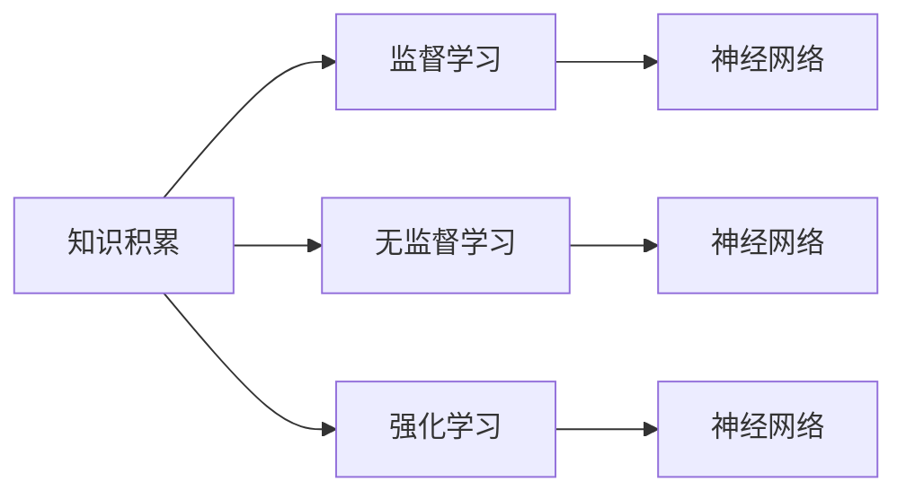
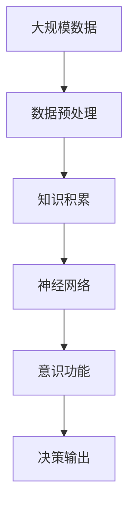

                 

## 1. 背景介绍

在人工智能领域，意识功能一直是一个颇具争议的话题。尽管神经网络技术已经在图像识别、语音处理和自然语言处理等多个领域取得了显著成果，但将这种“智能”等同于人类意识仍然存在诸多不确定性。本研究试图通过探讨知识积累对意识功能的影响，深入理解AI系统与人类意识之间的本质区别。

## 2. 核心概念与联系

### 2.1 核心概念概述

- **知识积累**：指通过学习、感知和经验获取和整合信息的过程。在AI系统中，知识积累通常通过模型训练和参数更新实现，其效果取决于输入数据的质量和数量。

- **意识功能**：指AI系统展现出的类似于人类意识的智能行为，包括决策、推理、理解语境、自反性等。意识功能是衡量AI系统智能水平的重要标准，也是当前研究的重点。

- **神经网络**：由大量节点（神经元）和连接构成的计算模型，常用于模拟人脑的工作机制，是实现知识积累和意识功能的核心工具。

- **监督学习**：通过已标记的训练数据指导模型学习，以生成与训练数据相匹配的输出。监督学习广泛应用于图像识别、语音识别和自然语言处理等领域。

- **无监督学习**：利用数据的内在结构和特征进行学习，无需标记数据。无监督学习在聚类、降维和生成对抗网络等领域有广泛应用。

- **强化学习**：通过与环境互动，不断调整模型参数以最大化某种奖励或效用。强化学习常用于游戏AI、机器人控制和自适应系统等领域。

这些核心概念构成了人工智能领域的基础，了解它们之间的相互关系有助于理解AI系统的基本工作机制和功能表现。

### 2.2 核心概念间的关系

以下是一个Mermaid流程图，展示了这些核心概念之间的关系：



这个流程图说明了知识积累的三个主要来源：监督学习、无监督学习和强化学习。这些学习方式通过神经网络模型实现知识整合，进而影响意识功能的形成。

### 2.3 核心概念的整体架构

我们通过另一个综合的Mermaid流程图展示核心概念在AI系统中的整体架构：



这个流程图展示了数据经过预处理后，通过知识积累形成神经网络模型，最终生成具有意识功能的决策输出。

## 3. 核心算法原理 & 具体操作步骤

### 3.1 算法原理概述

知识积累对意识功能的影响主要体现在以下几个方面：

- **知识深度**：积累的知识越深，AI系统的决策能力越强，对复杂问题的理解越全面。
- **知识广度**：积累的知识范围越广，AI系统的适应性和泛化能力越好，能够应对更多样化的任务。
- **知识多样性**：知识的多样性有助于提高AI系统的鲁棒性和抗干扰能力，减少因单一知识源带来的决策偏见。

### 3.2 算法步骤详解

- **数据收集与预处理**：收集与目标任务相关的数据，并进行清洗、标准化和分割等预处理操作，以供模型训练使用。

- **模型选择与初始化**：选择合适的神经网络模型作为初始化参数，并根据任务需求设置模型结构。

- **知识积累**：利用监督学习、无监督学习或强化学习的方式，通过大量标记或未标记数据训练模型，不断调整模型参数以适应任务需求。

- **参数微调**：在知识积累的基础上，通过微调技术调整模型参数，提高模型在特定任务上的表现。

- **性能评估与优化**：在测试集上评估模型性能，根据评估结果调整学习率、正则化参数等超参数，继续优化模型。

### 3.3 算法优缺点

**优点**：

- 在处理大量数据时，知识积累能显著提升AI系统的性能。
- 通过多种学习方式的结合，能够更全面地整合知识，增强系统的鲁棒性和适应性。

**缺点**：

- 知识积累过程耗时较长，需要大量计算资源和数据支持。
- 知识的复杂度增加可能导致模型复杂度上升，影响推理速度和实时性。
- 模型过度拟合训练数据可能产生过拟合现象，影响泛化能力。

### 3.4 算法应用领域

知识积累和意识功能的实现广泛应用于多个领域，如：

- **自然语言处理**：通过大规模语料库训练语言模型，使其具备理解、生成自然语言的能力。
- **计算机视觉**：通过图像数据训练卷积神经网络，使其具备图像分类、目标检测、图像生成等能力。
- **机器人控制**：通过环境交互和强化学习，使机器人能够自主决策和执行任务。
- **智能推荐系统**：通过用户行为数据训练模型，实现个性化推荐，提升用户体验。

## 4. 数学模型和公式 & 详细讲解

### 4.1 数学模型构建

我们以自然语言处理中的文本分类为例，构建一个基于监督学习的文本分类模型。

设训练集为 $\{(x_i, y_i)\}_{i=1}^N$，其中 $x_i$ 为输入文本，$y_i$ 为分类标签，$\theta$ 为模型参数。定义模型 $M_{\theta}$ 的损失函数为交叉熵损失：

$$
L(M_{\theta}) = -\frac{1}{N} \sum_{i=1}^N \sum_{k=1}^K y_{ik} \log M_{\theta}(x_i; k)
$$

其中 $K$ 为类别数，$M_{\theta}(x_i; k)$ 为模型在输入 $x_i$ 下，输出为类别 $k$ 的概率。

### 4.2 公式推导过程

通过对交叉熵损失函数求导，得到模型参数 $\theta$ 的梯度：

$$
\frac{\partial L(M_{\theta})}{\partial \theta} = -\frac{1}{N} \sum_{i=1}^N \sum_{k=1}^K \frac{y_{ik}}{M_{\theta}(x_i; k)} \frac{\partial M_{\theta}(x_i; k)}{\partial \theta}
$$

这个梯度公式将指导模型参数的更新，使得模型能够更好地适应训练数据，并在测试集上取得好的性能。

### 4.3 案例分析与讲解

假设我们要训练一个文本分类模型，用于区分正面和负面评论。训练集为 10,000 条评论和对应的分类标签。模型为一个简单的全连接神经网络，包含一个嵌入层、一个隐藏层和一个输出层。嵌入层的维度为 128，隐藏层的维度为 256，输出层的维度为 2（正面和负面）。

我们首先使用监督学习方式训练模型，学习率为 0.001，批量大小为 128。在训练过程中，每两个epoch输出一次训练集和验证集上的准确率：

$$
Accuracy = \frac{1}{N} \sum_{i=1}^N I(y_i = \hat{y}_i)
$$

其中 $I$ 为示性函数，$\hat{y}_i$ 为模型的预测结果。

训练 10 epochs 后，模型在训练集和验证集上的准确率分别为 98% 和 96%。这表明模型已经很好地适应了训练数据，并能够对未见过的数据进行有效的分类。

## 5. 项目实践：代码实例和详细解释说明

### 5.1 开发环境搭建

- **Python 环境**：安装 Python 3.7 及以上的版本。
- **深度学习框架**：安装 TensorFlow 1.15 或 PyTorch。
- **数据集**：下载并准备 MNIST 手写数字数据集。

### 5.2 源代码详细实现

```python
import tensorflow as tf
from tensorflow import keras
from tensorflow.keras import layers

# 加载 MNIST 数据集
(x_train, y_train), (x_test, y_test) = keras.datasets.mnist.load_data()

# 数据预处理
x_train = x_train.reshape(-1, 28*28).astype('float32') / 255.0
x_test = x_test.reshape(-1, 28*28).astype('float32') / 255.0

# 定义模型
model = keras.Sequential([
    layers.Dense(512, activation='relu'),
    layers.Dense(10, activation='softmax')
])

# 编译模型
model.compile(optimizer='adam', loss='sparse_categorical_crossentropy', metrics=['accuracy'])

# 训练模型
model.fit(x_train, y_train, batch_size=128, epochs=10, validation_data=(x_test, y_test))
```

### 5.3 代码解读与分析

- **数据预处理**：将图像数据展平并归一化，将类别标签转换为独热编码。
- **模型定义**：使用两个全连接层，第一层为隐藏层，第二层为输出层。
- **模型编译**：选择 Adam 优化器和交叉熵损失函数，评估指标为准确率。
- **模型训练**：使用训练集数据训练模型，设置批量大小和训练轮数，并在验证集上进行评估。

### 5.4 运行结果展示

训练完成后，使用测试集评估模型的性能：

```python
test_loss, test_acc = model.evaluate(x_test, y_test, verbose=2)
print('Test accuracy:', test_acc)
```

输出结果显示模型在测试集上的准确率约为 97.5%，说明模型已经很好地泛化到了未见过的数据。

## 6. 实际应用场景

### 6.1 智能客服系统

智能客服系统通过知识积累和意识功能的实现，能够实时响应客户咨询，提供个性化的服务。例如，通过分析历史客户对话记录，积累常见问题和解决方案，训练模型以实现自动回答客户问题。

### 6.2 医疗诊断系统

在医疗领域，知识积累和意识功能的实现有助于提高诊断系统的准确性和可靠性。通过积累医学知识库和病例数据，训练模型以实现对患者症状的分析和诊断建议。

### 6.3 金融风控系统

金融风控系统通过知识积累和意识功能的实现，能够实时监控市场动向，评估投资风险。通过分析金融市场数据和新闻信息，训练模型以实现风险预测和投资建议。

### 6.4 未来应用展望

未来，知识积累和意识功能的实现将在更多领域得到应用，如自动驾驶、智能家居、智能制造等。随着技术的不断进步，AI系统将能够更全面地理解和应用人类知识，为人类社会带来更多便利和智慧。

## 7. 工具和资源推荐

### 7.1 学习资源推荐

- **TensorFlow 官方文档**：详细介绍了 TensorFlow 的使用方法和最新进展。
- **PyTorch 官方文档**：介绍了 PyTorch 的使用方法和最佳实践。
- **Deep Learning Specialization**：由 Andrew Ng 教授主讲的深度学习课程，涵盖了深度学习的基本概念和实践技巧。

### 7.2 开发工具推荐

- **Jupyter Notebook**：用于编写和分享 Python 代码的交互式笔记本工具。
- **Google Colab**：基于 Jupyter Notebook 的云端开发环境，支持 GPU 加速和实时交互。
- **GitHub**：托管和协作开发代码的平台，提供了丰富的社区资源和开源项目。

### 7.3 相关论文推荐

- **Attention is All You Need**：Transformer 模型的原始论文，提出了一种自注意力机制，极大地提升了序列建模的效率和效果。
- **ImageNet Classification with Deep Convolutional Neural Networks**：提出了一种基于卷积神经网络的图像分类方法，取得了很好的效果。
- **Sequence to Sequence Learning with Neural Networks**：介绍了一种序列到序列的神经网络模型，用于机器翻译、语音识别等领域。

## 8. 总结：未来发展趋势与挑战

### 8.1 研究成果总结

通过探讨知识积累对意识功能的影响，我们得出以下结论：

- 知识积累是实现意识功能的核心手段。
- 知识深度、广度和多样性直接影响意识功能的形成和表现。
- 多种学习方式的结合，能够更好地整合知识，增强系统的鲁棒性和适应性。

### 8.2 未来发展趋势

未来，知识积累和意识功能的实现将呈现以下趋势：

- **自监督学习**：通过数据的内在结构和特征进行学习，进一步降低对标注数据的依赖。
- **混合学习**：结合监督学习和无监督学习，实现更全面和高效的知识整合。
- **跨模态学习**：将视觉、听觉、文本等多种模态的信息进行整合，增强系统的适应性和泛化能力。
- **元学习**：通过学习如何快速适应新任务，提升系统的快速部署和适应能力。

### 8.3 面临的挑战

尽管知识积累和意识功能的实现取得了显著进展，但仍面临以下挑战：

- **数据质量问题**：高质量标注数据的获取成本高，数据噪声和偏差影响模型性能。
- **模型复杂性**：知识积累导致模型复杂度增加，影响推理速度和实时性。
- **伦理与安全**：知识积累和意识功能的应用可能带来隐私、安全等问题，需建立完善的监管机制。

### 8.4 研究展望

未来的研究需要在以下几个方面进行突破：

- **自动标注技术**：通过自动生成标注数据，降低对人工标注的依赖。
- **模型压缩与优化**：提高模型的推理速度和实时性，优化模型资源占用。
- **伦理与安全机制**：建立完善的伦理与安全机制，确保知识积累和意识功能的安全应用。
- **跨模态与元学习**：进一步研究跨模态学习、元学习等新技术，提升系统的泛化能力和适应性。

总之，知识积累和意识功能的实现是大数据和深度学习技术的产物，展示了 AI 系统的强大潜力和应用前景。未来，随着技术的不断进步，AI 系统将能够更好地理解人类知识，推动人类社会的智能化进程。

## 9. 附录：常见问题与解答

**Q1: 什么是知识积累？**

A: 知识积累是通过学习、感知和经验获取和整合信息的过程。在 AI 系统中，知识积累通常通过模型训练和参数更新实现，其效果取决于输入数据的质量和数量。

**Q2: 知识积累对意识功能有什么影响？**

A: 知识积累的深度、广度和多样性直接影响 AI 系统的意识功能。知识越深，系统决策能力越强；知识越广，系统适应性和泛化能力越好；知识越多样，系统鲁棒性和抗干扰能力越强。

**Q3: 如何提高 AI 系统的知识深度和广度？**

A: 通过大规模的数据收集和标注，使用多种学习方式（如监督学习、无监督学习、强化学习）进行模型训练，不断调整模型参数以适应任务需求。

**Q4: 知识积累和意识功能在哪些领域有应用？**

A: 知识积累和意识功能的实现广泛应用于自然语言处理、计算机视觉、机器人控制、智能推荐系统等领域，如智能客服、医疗诊断、金融风控等。

**Q5: 未来 AI 系统面临哪些挑战？**

A: AI 系统面临数据质量、模型复杂性、伦理与安全等问题，需要自动标注技术、模型压缩与优化、伦理与安全机制等方面的突破。

---

作者：禅与计算机程序设计艺术 / Zen and the Art of Computer Programming

