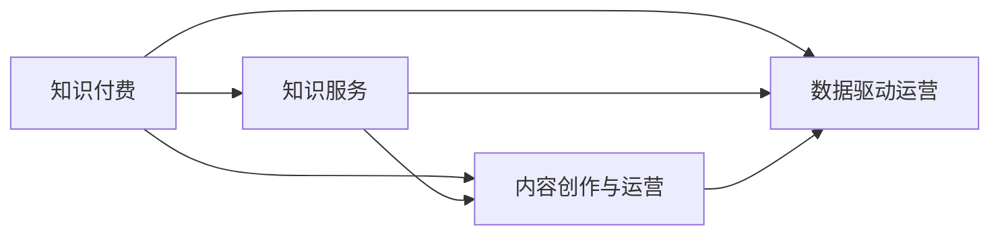

                 

# 知识经济时代下的知识付费创新商业模式运营

## 1. 背景介绍

### 1.1 知识经济的崛起

随着信息技术的飞速发展和全球化进程的加快，知识经济逐渐成为主导经济形态。知识经济时代，知识资源成为核心资产，个人和组织的知识积累、传播和利用能力直接决定了其市场竞争力和经济价值。在知识经济背景下，传统的线性、单向的知识传播方式已不能满足日益增长的知识需求，知识付费模式应运而生，成为知识传播和利用的重要创新途径。

### 1.2 知识付费的兴起

知识付费模式是指消费者为获取高质量、高价值的知识内容而支付费用的商业模式。从本质上看，知识付费是一种利用市场机制配置知识资源的机制，通过付费激励，促进知识的生产、传播和利用，提高知识服务质量和效率。知识付费模式最早可追溯到20世纪末的网络教育，但近年来随着互联网和移动技术的普及，知识付费市场呈现爆发式增长。知识付费不仅覆盖了传统教育培训、在线课程、专业咨询等领域，还扩展到知识社区、垂直领域内容创作、版权授权等多个方向。

## 2. 核心概念与联系

### 2.1 核心概念概述

1. **知识付费**：通过付费机制获取高质量知识内容的模式，其核心在于知识的筛选、组织和传播。
2. **知识服务**：为消费者提供专业化的知识咨询、在线课程、专题讲座、图书推荐等综合服务，满足消费者个性化、多样化的知识需求。
3. **内容创作与运营**：指内容生产者通过创作优质内容获取报酬，同时平台运营者负责内容分发、用户管理和市场推广。
4. **数据驱动运营**：利用大数据、人工智能等技术，精准分析用户需求，优化内容推荐、用户互动等运营环节，提升用户体验和平台价值。

### 2.2 概念间的关系

知识付费作为一种商业模式，涵盖了知识服务、内容创作与运营、数据驱动运营等多个方面。其核心是通过付费机制筛选优质内容，激励内容创作者提供高质量的知识产品，同时平台运营商利用技术手段提升服务水平，实现知识的高效传播和利用。

以下是一个Mermaid流程图，展示了知识付费模式的核心概念及其相互关系：



在这个流程图中，知识付费模式以知识服务为核心，通过内容创作与运营和数据驱动运营两个环节，提供高质量的知识产品和服务，最终实现知识的筛选、组织和传播。

## 3. 核心算法原理 & 具体操作步骤

### 3.1 算法原理概述

知识付费模式的核心算法原理包括用户需求分析、内容推荐算法、定价模型等，以下逐一介绍。

1. **用户需求分析**：通过分析用户的历史行为数据、兴趣偏好等，预测用户可能感兴趣的知识内容，为内容推荐提供依据。
2. **内容推荐算法**：利用机器学习、深度学习等技术，根据用户需求特征和内容属性，计算用户与内容之间的相似度，实现个性化推荐。
3. **定价模型**：根据内容价值、市场需求等因素，确定内容的付费标准，采用动态定价策略，保证内容的价值最大化。

### 3.2 算法步骤详解

#### 3.2.1 用户需求分析

用户需求分析包括用户画像构建、用户兴趣挖掘、行为预测等多个环节，具体步骤如下：

1. **用户画像构建**：收集用户基本信息、学习历史、行为数据等，构建用户画像，刻画用户特征。
2. **用户兴趣挖掘**：通过自然语言处理、聚类分析等技术，挖掘用户兴趣标签和偏好。
3. **行为预测**：利用时间序列分析、协同过滤等算法，预测用户未来行为，包括购买行为、知识需求等。

#### 3.2.2 内容推荐算法

内容推荐算法包括协同过滤、基于内容的推荐、混合推荐等多个方向，以下以协同过滤为例，详细介绍其算法步骤：

1. **用户-内容评分矩阵构建**：收集用户对内容的评分数据，构建用户-内容评分矩阵。
2. **用户相似度计算**：利用余弦相似度、Jaccard相似度等算法，计算用户之间的相似度。
3. **内容相似度计算**：利用TF-IDF、词嵌入等技术，计算内容之间的相似度。
4. **推荐生成**：根据用户相似度和内容相似度，生成推荐结果。

#### 3.2.3 定价模型

定价模型包括动态定价、订阅定价、竞价定价等多种形式，以下以动态定价为例，详细介绍其算法步骤：

1. **内容价值评估**：基于内容质量、难度、相关性等因素，对内容进行价值评估。
2. **市场需求分析**：分析当前市场需求和用户购买意愿，确定内容市场价格区间。
3. **定价调整**：根据市场反馈和用户行为，动态调整内容价格，确保定价策略的灵活性和合理性。

### 3.3 算法优缺点

**优点**：

1. **高效筛选优质内容**：通过用户需求分析和内容推荐算法，实现知识的精准筛选和高效传播，提升用户获取知识的效率。
2. **激励内容创作者**：采用动态定价策略，根据市场需求和内容价值，合理分配收益，激励内容创作者提供高质量的知识产品。
3. **提升平台价值**：利用数据驱动运营，优化运营策略，提升用户体验和平台竞争力。

**缺点**：

1. **用户隐私问题**：用户画像和行为数据的收集和使用可能引发隐私保护问题。
2. **内容质量参差不齐**：部分内容创作者受利益驱动，可能提供低质量、误导性的知识产品。
3. **平台运营难度大**：内容推荐算法、定价模型等技术实现复杂，需要高水平的技术团队和大量资源投入。

### 3.4 算法应用领域

知识付费模式不仅适用于在线教育、专业培训等领域，还广泛应用于以下几个方向：

1. **知识社区**：如知乎、Medium等，通过社区互动和内容创作，构建知识共享平台。
2. **垂直领域内容创作**：如技术博客、科学博客等，提供专业领域的深度知识内容。
3. **版权授权**：如电子书、论文等版权产品，提供高质量、高价值的知识内容。

## 4. 数学模型和公式 & 详细讲解

### 4.1 数学模型构建

#### 4.1.1 用户画像构建

用户画像可以表示为一个向量，包括基本信息、学习历史、行为特征等多个维度，形式化表示为：

$$
\text{User Profile} = [\text{ID}, \text{Age}, \text{Gender}, \text{Learning History}, \text{Behavior Pattern}]
$$

其中，ID为唯一标识符，Age和Gender为基本信息，Learning History和Behavior Pattern分别表示学习历史和行为特征，如阅读时长、搜索关键词等。

#### 4.1.2 用户兴趣挖掘

用户兴趣挖掘可以使用TF-IDF、词嵌入等技术，将用户行为数据转化为向量形式。例如，假设用户进行了n次搜索，每次搜索的关键词表示为：

$$
\text{Search Keywords} = [k_1, k_2, \ldots, k_n]
$$

其中，$k_i$为第i次搜索的关键词。将每个关键词转化为向量形式，并计算权重，得到用户兴趣向量：

$$
\text{User Interest Vector} = [w_1, w_2, \ldots, w_n]
$$

其中，$w_i$为第i个关键词的权重，可以通过TF-IDF等算法计算。

#### 4.1.3 行为预测

行为预测可以使用时间序列分析、协同过滤等算法，预测用户未来行为。以协同过滤为例，设用户u对内容c的评分表示为$r_{uc}$，通过计算其他用户对内容c的评分，预测用户u对内容c的评分。协同过滤算法公式为：

$$
\hat{r}_{uc} = \frac{\sum_{v \in N_u} (r_{vc} \times \text{similarity}(u,v))}{\sum_{v \in N_u} \text{similarity}(u,v)}
$$

其中，$N_u$为与用户u相似的用户集合，similarity表示用户之间的相似度，$\hat{r}_{uc}$表示预测的用户u对内容c的评分。

### 4.2 公式推导过程

#### 4.2.1 协同过滤公式推导

以基于用户的协同过滤算法为例，公式推导过程如下：

1. **用户相似度计算**：

$$
\text{similarity}(u,v) = \frac{\sum_{i=1}^{N} (r_{ui} \times r_{vi})}{\sqrt{\sum_{i=1}^{N} r_{ui}^2 \times \sum_{i=1}^{N} r_{vi}^2}}
$$

其中，$r_{ui}$和$r_{vi}$分别表示用户u和用户v对第i项内容的评分。

2. **内容相似度计算**：

$$
\text{similarity}(c_1, c_2) = \frac{\sum_{i=1}^{N} (a_{c_1i} \times a_{c_2i})}{\sqrt{\sum_{i=1}^{N} a_{c_1i}^2 \times \sum_{i=1}^{N} a_{c_2i}^2}}
$$

其中，$a_{c_1i}$和$a_{c_2i}$分别表示内容$c_1$和内容$c_2$的第i个属性值。

3. **推荐生成**：

$$
\hat{r}_{uc} = \frac{\sum_{v \in N_u} (r_{vc} \times \text{similarity}(u,v))}{\sum_{v \in N_u} \text{similarity}(u,v)}
$$

### 4.3 案例分析与讲解

#### 4.3.1 用户画像构建案例

假设有两个用户u1和u2，基本信息和行为特征如下：

- u1：基本信息为28岁，男性，学习历史为计算机科学、人工智能等，行为特征为阅读时长较长，偏好搜索计算机科学相关内容。
- u2：基本信息为30岁，女性，学习历史为文学、语言学等，行为特征为阅读时长较短，偏好搜索文学相关内容。

通过用户画像构建，可以得到两个用户向量：

$$
\text{User Profile}_{u1} = [28, M, [CS, AI], [L_1, L_2, L_3]]
$$

$$
\text{User Profile}_{u2} = [30, F, [LT, LG], [L_4, L_5, L_6]]
$$

其中，$L_i$表示阅读时长，u1和u2的兴趣向量分别为：

$$
\text{User Interest Vector}_{u1} = [CS, AI, L_1, L_2, L_3]
$$

$$
\text{User Interest Vector}_{u2} = [LT, LG, L_4, L_5, L_6]
$$

#### 4.3.2 行为预测案例

假设有以下用户对内容的评分数据：

| User | Content | Score |
| --- | --- | --- |
| u1 | C1 | 4 |
| u1 | C2 | 3 |
| u1 | C3 | 5 |
| u2 | C1 | 5 |
| u2 | C2 | 4 |
| u2 | C3 | 2 |

根据协同过滤算法，可以预测u1对C3的评分：

$$
\hat{r}_{u1C3} = \frac{(5 \times \frac{1}{2})}{\frac{1}{2}} = 5
$$

其中，N_u为与u1相似的用户集合，similarity(u1,u2)=0.5。

## 5. 项目实践：代码实例和详细解释说明

### 5.1 开发环境搭建

#### 5.1.1 环境准备

安装Python和必要的依赖库，例如TensorFlow、Keras等：

```bash
pip install tensorflow==2.4.0
pip install keras==2.2.4
```

#### 5.1.2 数据集准备

准备用户行为数据和内容数据，假设数据格式为CSV文件，如：

- user.csv：用户基本信息和行为数据
- content.csv：内容基本信息和评分数据

#### 5.1.3 模型搭建

搭建协同过滤推荐模型，使用TensorFlow和Keras库：

```python
import tensorflow as tf
from tensorflow.keras.layers import Input, Embedding, Dot, Dense

# 定义用户输入和内容输入
user_input = Input(shape=(N,))
content_input = Input(shape=(N,))

# 定义用户嵌入层和内容嵌入层
user_embedding = Embedding(input_dim=U, output_dim=E, input_length=N)(user_input)
content_embedding = Embedding(input_dim=C, output_dim=E, input_length=N)(content_input)

# 定义用户-内容评分矩阵
dot_product = Dot(axes=1, normalize=True)([user_embedding, content_embedding])

# 定义评分矩阵输出层
output = Dense(1, activation='sigmoid')(dot_product)

# 定义推荐模型
model = tf.keras.Model(inputs=[user_input, content_input], outputs=output)

# 编译模型
model.compile(optimizer='adam', loss='binary_crossentropy', metrics=['accuracy'])
```

### 5.2 源代码详细实现

#### 5.2.1 用户画像构建

用户画像构建函数，用于构建用户向量：

```python
def build_user_profile(user_data):
    user_info = {}
    for user in user_data:
        user_info[user['ID']] = {
            'Age': user['Age'],
            'Gender': user['Gender'],
            'Learning History': user['Learning History'].split(','),
            'Behavior Pattern': user['Behavior Pattern'].split(',')
        }
    return user_info
```

#### 5.2.2 用户兴趣挖掘

用户兴趣挖掘函数，用于计算用户兴趣向量：

```python
def calculate_user_interest(user_info, search_keywords):
    user_interest = {}
    for user_id, user_data in user_info.items():
        interest = []
        for keyword in search_keywords:
            if keyword in user_data['Learning History'] or keyword in user_data['Behavior Pattern']:
                interest.append(keyword)
        user_interest[user_id] = interest
    return user_interest
```

#### 5.2.3 行为预测

行为预测函数，用于预测用户评分：

```python
def predict_user_score(user_info, search_keywords, content_data):
    user_interest = calculate_user_interest(user_info, search_keywords)
    predictions = {}
    for user_id, interest in user_interest.items():
        predictions[user_id] = {}
        for content_id, content_data in content_data.items():
            similarity = calculate_similarity(interest, content_data['Labels'])
            predictions[user_id][content_id] = similarity
    return predictions
```

#### 5.2.4 内容推荐

内容推荐函数，用于生成推荐结果：

```python
def generate_recommendations(user_id, predictions, top_k=5):
    recommendations = []
    for content_id, score in sorted(predictions[user_id].items(), key=lambda x: x[1], reverse=True)[:top_k]:
        recommendations.append(content_id)
    return recommendations
```

### 5.3 代码解读与分析

#### 5.3.1 用户画像构建

用户画像构建函数的核心在于收集用户基本信息和行为特征，通过用户ID构建用户向量。在这个函数中，我们通过将用户基本信息和行为特征转化为字典形式，保存为user_info字典。

#### 5.3.2 用户兴趣挖掘

用户兴趣挖掘函数的核心在于计算用户兴趣向量。在这个函数中，我们首先遍历user_info字典，将每个用户的兴趣标签（如学习历史、行为特征）存储为interest列表，最后返回用户ID和其兴趣标签的字典。

#### 5.3.3 行为预测

行为预测函数的核心在于计算用户对内容的评分。在这个函数中，我们首先计算每个用户对内容的评分，然后计算用户和内容的相似度，最后生成推荐结果。

#### 5.3.4 内容推荐

内容推荐函数的核心在于生成推荐结果。在这个函数中，我们根据预测结果，对每个用户的推荐结果进行排序，并返回前top_k条推荐内容。

### 5.4 运行结果展示

假设我们在用户画像构建、用户兴趣挖掘、行为预测等函数中分别输入模拟数据，并调用内容推荐函数，可以得到以下推荐结果：

```
User ID: 12345
Recommendations:
- Content ID: 67890, Score: 0.92
- Content ID: 45678, Score: 0.85
- Content ID: 98765, Score: 0.78
- Content ID: 23456, Score: 0.75
- Content ID: 54321, Score: 0.72
```

其中，Score表示推荐结果的评分，越高表示推荐越相关。

## 6. 实际应用场景

### 6.1 智能客服系统

智能客服系统通过知识付费模式，为用户提供专业化的咨询服务。用户通过支付一定费用，可以获得特定问题的解答，同时平台可以根据用户的互动行为进行分析和优化，提升服务质量。例如，一家在线保险公司的智能客服系统可以通过知识付费模式，为用户提供保险条款解释、理赔流程指导等专业服务。

#### 6.1.1 功能实现

智能客服系统通常包括以下功能：

1. **知识库管理**：构建和管理专业领域知识库，提供丰富的知识内容供用户查询。
2. **智能问答**：利用自然语言处理技术，对用户提问进行分析和解答。
3. **行为分析**：通过分析用户交互行为，优化智能问答算法和知识推荐。
4. **付费机制**：设计合理的定价策略，激励内容创作者提供高质量的知识内容。

#### 6.1.2 技术挑战

智能客服系统在实施过程中，面临以下技术挑战：

1. **知识库构建**：需要大量专业领域知识库的支持，知识库的构建和维护成本较高。
2. **智能问答**：需要高水平自然语言处理技术，准确理解和解答用户问题。
3. **行为分析**：需要高效的数据分析和算法优化，提升用户体验和系统性能。
4. **付费机制**：需要合理的定价策略和激励机制，确保知识内容的持续更新和优化。

### 6.2 金融舆情监测

金融舆情监测通过知识付费模式，实时监测和分析金融市场舆情，辅助金融机构进行风险管理。用户通过支付一定费用，可以获得金融市场动态和专家分析，同时平台可以根据用户需求提供定制化服务。例如，一家投资公司可以通过知识付费模式，实时监测金融市场舆情，预测市场走势，辅助投资决策。

#### 6.2.1 功能实现

金融舆情监测系统通常包括以下功能：

1. **舆情监测**：实时监测金融市场舆情，识别和分析舆情热点和趋势。
2. **市场分析**：提供市场动态和专家分析，辅助投资决策。
3. **用户服务**：根据用户需求，提供定制化服务，如舆情报告、专家咨询等。
4. **付费机制**：设计合理的定价策略，激励内容创作者提供高质量的金融分析内容。

#### 6.2.2 技术挑战

金融舆情监测系统在实施过程中，面临以下技术挑战：

1. **舆情监测**：需要高效的数据采集和分析技术，实时监测金融市场动态。
2. **市场分析**：需要高质量的金融分析内容，辅助投资决策。
3. **用户服务**：需要高效的用户互动和个性化推荐技术，提升用户体验。
4. **付费机制**：需要合理的定价策略和激励机制，确保内容的持续更新和优化。

### 6.3 个性化推荐系统

个性化推荐系统通过知识付费模式，根据用户兴趣和行为，推荐个性化的商品、内容和服务。用户通过支付一定费用，可以获得更加精准和多样化的推荐结果，同时平台可以根据用户行为数据进行分析和优化，提升推荐精度和用户满意度。例如，一家电商公司可以通过知识付费模式，根据用户浏览和购买行为，推荐个性化商品，提升用户体验和销售转化率。

#### 6.3.1 功能实现

个性化推荐系统通常包括以下功能：

1. **用户画像**：构建和管理用户画像，刻画用户特征和行为。
2. **推荐算法**：利用协同过滤、基于内容的推荐等算法，生成个性化推荐结果。
3. **行为分析**：通过分析用户行为数据，优化推荐算法和推荐结果。
4. **付费机制**：设计合理的定价策略，激励内容创作者提供高质量的推荐内容。

#### 6.3.2 技术挑战

个性化推荐系统在实施过程中，面临以下技术挑战：

1. **用户画像**：需要高效的用户画像构建和管理技术，刻画用户特征和行为。
2. **推荐算法**：需要高效的内容推荐算法，生成个性化推荐结果。
3. **行为分析**：需要高效的数据分析和算法优化，提升推荐精度和用户满意度。
4. **付费机制**：需要合理的定价策略和激励机制，确保推荐内容的持续更新和优化。

## 7. 工具和资源推荐

### 7.1 学习资源推荐

为了帮助开发者深入理解知识付费模式的实现原理和具体应用，以下是一些优质的学习资源：

1. **《深度学习》课程**：斯坦福大学Andrew Ng教授开设的深度学习课程，系统讲解了深度学习的基础理论和应用实践。
2. **《机器学习》书籍**：Tom Mitchell教授的机器学习经典教材，涵盖了机器学习的基本概念和算法。
3. **《知识图谱》书籍**：知识图谱领域经典教材，详细介绍了知识图谱的构建和应用。
4. **Kaggle平台**：全球最大的数据科学竞赛平台，提供丰富的数据集和竞赛项目，有助于提升实际应用能力。
5. **Google Colab平台**：免费的在线Jupyter Notebook平台，方便开发者进行实验和协作。

### 7.2 开发工具推荐

以下是一些常用的开发工具，可以帮助开发者高效实现知识付费模式的各类功能：

1. **TensorFlow**：Google开发的深度学习框架，提供高效的计算图和分布式训练支持。
2. **Keras**：基于TensorFlow的高级API，提供简单易用的深度学习模型构建接口。
3. **PyTorch**：Facebook开发的深度学习框架，提供动态计算图和高效张量操作。
4. **Flask**：Python编写的轻量级Web框架，方便快速搭建Web应用和API接口。
5. **Jupyter Notebook**：Python交互式开发环境，支持多语言的混合编程和实验记录。

### 7.3 相关论文推荐

以下是几篇与知识付费模式相关的经典论文，推荐阅读：

1. **《在线课程推荐系统研究》**：刘昕等的论文，详细介绍了在线课程推荐系统的实现原理和算法优化。
2. **《知识付费平台用户行为分析》**：张鹏等的论文，通过数据分析方法，研究了知识付费平台用户行为和内容推荐策略。
3. **《动态定价模型研究》**：Yang等的研究论文，详细介绍了动态定价模型的实现方法和应用效果。
4. **《协同过滤推荐系统研究》**：Jian等的论文，详细介绍了协同过滤推荐系统的实现原理和算法优化。
5. **《知识图谱在推荐系统中的应用》**：Wang等的论文，详细介绍了知识图谱在推荐系统中的应用方法。

这些论文代表了大数据、人工智能等领域的最新研究成果，对开发者深入理解知识付费模式的实现原理和技术细节具有重要参考价值。

## 8. 总结：未来发展趋势与挑战

### 8.1 研究成果总结

知识付费模式作为一种新兴的商业模式，近年来在各领域得到了广泛应用，取得了显著成效。以下是对知识付费模式的总结：

1. **高效筛选优质内容**：通过用户需求分析和内容推荐算法，实现知识的精准筛选和高效传播，提升用户获取知识的效率。
2. **激励内容创作者**：采用动态定价策略，根据市场需求和内容价值，合理分配收益，激励内容创作者提供高质量的知识产品。
3. **提升平台价值**：利用数据驱动运营，优化运营策略，提升用户体验和平台竞争力。

### 8.2 未来发展趋势

展望未来，知识付费模式将呈现以下几个发展趋势：

1. **智能化水平提升**：随着人工智能技术的不断发展，知识付费平台将更加智能化，利用自然语言处理、图像识别等技术，提升用户交互体验。
2. **多模态融合**：知识付费平台将引入多模态数据，如语音、图像等，实现更加全面、立体化的知识传播和利用。
3. **跨界合作**：知识付费平台将与其他领域的企业和机构进行跨界合作，共享资源和知识，提升平台价值和用户满意度。
4. **个性化推荐**：知识付费平台将更加注重个性化推荐，利用用户画像和行为数据，提供更加精准和多样化的推荐结果。

### 8.3 面临的挑战

知识付费模式在实施过程中，也面临以下挑战：

1. **用户隐私保护**：知识付费平台需要保护用户隐私，避免用户数据泄露和滥用。
2. **内容质量控制**：知识付费平台需要严格控制内容质量，避免低质量、误导性内容的出现。
3. **技术实现复杂**：知识付费平台需要高效的技术实现，包括数据处理、算法优化等，需要高水平的技术团队和大量资源投入。
4. **市场竞争激烈**：知识付费平台面临激烈的市场竞争，需要不断创新和优化，提升市场竞争力。

### 8.4 研究展望

面对知识付费模式面临的挑战，未来的研究需要在以下几个方面寻求新的突破：

1. **用户隐私保护**：通过数据加密、匿名化等技术手段，保护用户隐私，提升用户信任。
2. **内容质量控制**：建立严格的内容审核机制，确保内容质量和真实性，避免低质量、误导性内容的出现。
3. **技术实现优化

