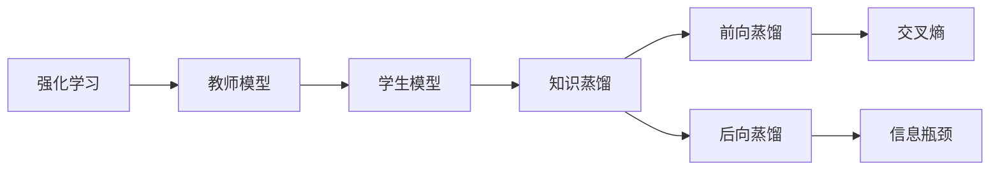
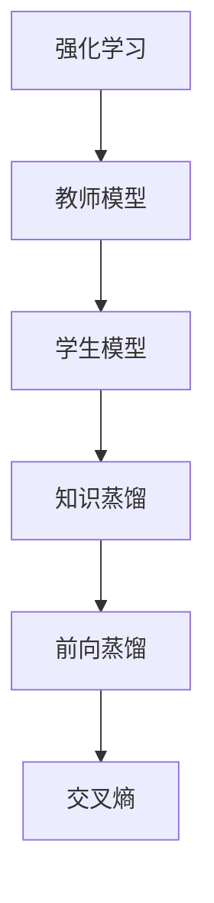
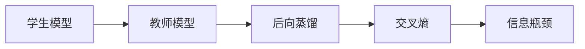
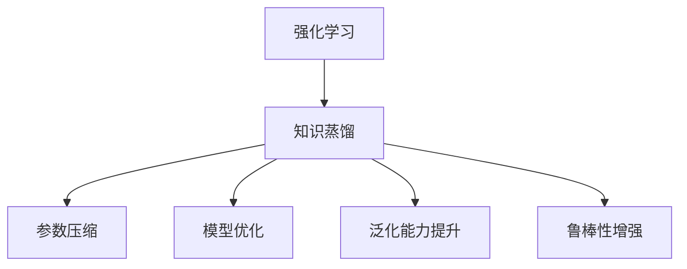

                 

# 知识蒸馏在强化学习中的探索与挑战

## 1. 背景介绍

### 1.1 问题由来

强化学习（Reinforcement Learning, RL）是一类旨在让智能体（agent）在特定环境中通过与环境的交互来学习最优决策策略的机器学习技术。强化学习在诸多领域已取得显著成果，例如游戏AI、机器人控制、自动驾驶等。然而，强化学习的难点在于需要大量的样本数据和计算资源，且往往难以直接得到准确的奖励信号，导致模型难以收敛。

为了缓解这些问题，知识蒸馏（Knowledge Distillation, KD）技术应运而生。知识蒸馏是一种将复杂模型（教师模型）的知识传递给简单模型（学生模型）的转移学习方法。教师模型一般是在大规模数据和计算资源上训练得到的，而学生模型则可以通过蒸馏过程获得类似教师模型的性能。知识蒸馏通过减小模型参数量、减少计算量、提高泛化能力等优点，成为强化学习中提升模型性能的重要手段。

### 1.2 问题核心关键点

知识蒸馏的核心思想是通过知识传递，将教师模型的复杂知识转化为学生模型的可用知识，从而提升学生模型的性能。知识蒸馏的目标是在保持教师模型高精度的前提下，减少学生模型的计算复杂度和参数量。具体实现通常包括以下几个步骤：

1. **知识获取**：从教师模型中抽取知识，可以通过对教师模型进行蒸馏，得到学生模型所需的知识。
2. **知识传递**：将知识传递给学生模型，通常通过在训练时引入教师模型的预测结果作为指导信号。
3. **知识重构**：学生模型通过重构教师模型的知识，生成自己的决策策略。

知识蒸馏在强化学习中的应用，可以分为前向蒸馏和后向蒸馏两种形式：

- **前向蒸馏**：将教师模型的预测作为学生模型的目标，训练学生模型以最小化与教师模型输出的差异。
- **后向蒸馏**：训练学生模型以最大化教师模型的预测概率，从而学习教师模型的决策策略。

当前，知识蒸馏在强化学习中的应用已成为热点研究方向，被广泛应用于提升模型的鲁棒性、可解释性和泛化能力。然而，知识蒸馏在强化学习中仍面临诸多挑战，如如何更好地设计知识传递机制、如何保证学生模型与教师模型的差异化、如何处理高维复杂环境下的知识传递等问题。

### 1.3 问题研究意义

知识蒸馏在强化学习中的应用，对于提升模型的学习效率、减小计算资源消耗、提高模型的泛化能力等具有重要意义：

1. **提升学习效率**：通过知识蒸馏，学生模型可以更快地学习到教师模型的知识，减少了训练时间和数据需求。
2. **减小计算资源消耗**：知识蒸馏通过减少模型的参数量和计算复杂度，减小了对计算资源的需求，使得模型更容易在资源受限的设备上部署。
3. **提高泛化能力**：知识蒸馏通过传递教师模型的泛化能力，使得学生模型具有更好的泛化性能。
4. **增强模型鲁棒性**：通过知识蒸馏，学生模型可以学习到教师模型对不同环境变化的适应能力，提升模型的鲁棒性。
5. **提供模型可解释性**：知识蒸馏的蒸馏过程提供了模型决策的指导信号，有助于提高模型的可解释性。

知识蒸馏在强化学习中的应用，不仅能够提升模型的性能，还能够拓展模型应用的场景和范围，使得强化学习技术在更多领域得以落地应用。

## 2. 核心概念与联系

### 2.1 核心概念概述

为更好地理解知识蒸馏在强化学习中的应用，本节将介绍几个密切相关的核心概念：

- 强化学习（Reinforcement Learning, RL）：一种通过智能体与环境的交互，学习最优决策策略的学习框架。
- 知识蒸馏（Knowledge Distillation, KD）：一种通过传递复杂模型（教师模型）的知识，提升简单模型（学生模型）性能的技术。
- 教师模型（Teacher Model）：在大规模数据和计算资源上训练得到的复杂模型，用于传递知识。
- 学生模型（Student Model）：通过知识蒸馏获得教师模型知识的简单模型。
- 交叉熵（Cross-Entropy, CE）：一种常用的损失函数，用于衡量两个概率分布之间的差异。
- 信息瓶颈（Information Bottleneck, IB）：一种理论模型，用于描述知识蒸馏过程中的信息传递瓶颈。

这些核心概念之间的逻辑关系可以通过以下Mermaid流程图来展示：



这个流程图展示了大语言模型微调过程中各个核心概念的关系：

1. 强化学习框架中，智能体通过与环境的交互学习决策策略。
2. 教师模型通过在大量数据上训练得到复杂决策策略。
3. 学生模型通过知识蒸馏过程，获得教师模型的知识。
4. 知识蒸馏包括前向蒸馏和后向蒸馏两种形式。
5. 前向蒸馏通过交叉熵衡量学生模型的输出与教师模型的预测之间的差异。
6. 后向蒸馏通过信息瓶颈模型描述知识传递过程中的信息损失。

### 2.2 概念间的关系

这些核心概念之间存在着紧密的联系，形成了知识蒸馏在强化学习中的应用框架。下面我通过几个Mermaid流程图来展示这些概念之间的关系。

#### 2.2.1 强化学习的知识蒸馏流程



这个流程图展示了强化学习中的知识蒸馏流程：

1. 强化学习框架中，智能体通过与环境的交互学习决策策略。
2. 教师模型通过在大量数据上训练得到复杂决策策略。
3. 学生模型通过知识蒸馏过程，获得教师模型的知识。
4. 前向蒸馏通过交叉熵衡量学生模型的输出与教师模型的预测之间的差异。

#### 2.2.2 后向蒸馏的损失函数



这个流程图展示了后向蒸馏的损失函数：

1. 学生模型通过与教师模型的交互学习决策策略。
2. 后向蒸馏通过交叉熵衡量学生模型的输出与教师模型的预测之间的差异。
3. 信息瓶颈模型描述知识传递过程中的信息损失。

#### 2.2.3 知识蒸馏的应用场景



这个流程图展示了知识蒸馏的应用场景：

1. 强化学习中，通过知识蒸馏实现参数压缩、模型优化、泛化能力提升和鲁棒性增强。

通过这些流程图，我们可以更清晰地理解知识蒸馏在强化学习中的应用过程和各个环节的作用。

## 3. 核心算法原理 & 具体操作步骤
### 3.1 算法原理概述

知识蒸馏在强化学习中的应用，主要是通过将教师模型的知识传递给学生模型，从而提升学生模型的性能。具体实现通常包括以下几个关键步骤：

1. **知识获取**：从教师模型中抽取知识，可以通过对教师模型进行蒸馏，得到学生模型所需的知识。
2. **知识传递**：将知识传递给学生模型，通常通过在训练时引入教师模型的预测结果作为指导信号。
3. **知识重构**：学生模型通过重构教师模型的知识，生成自己的决策策略。

在强化学习中，知识蒸馏的目标是通过学生模型在目标任务上的表现，最大化教师模型的预测概率。具体来说，知识蒸馏的目标函数可以表示为：

$$
\min_{\theta} \mathbb{E}_{(x,a) \sim D} \mathbb{E}_{\pi_\theta} [\mathcal{L}(x, a)]
$$

其中，$D$ 表示数据分布，$\pi_\theta$ 表示在模型参数 $\theta$ 下的行为策略，$\mathcal{L}(x, a)$ 表示在环境 $x$ 下采取动作 $a$ 的损失函数。

在强化学习中，知识蒸馏通常通过两种方式实现：前向蒸馏和后向蒸馏。

**前向蒸馏**：通过教师模型的预测结果作为学生模型的目标，训练学生模型以最小化与教师模型输出的差异。

**后向蒸馏**：训练学生模型以最大化教师模型的预测概率，从而学习教师模型的决策策略。

### 3.2 算法步骤详解

知识蒸馏在强化学习中的应用，可以分为以下几个步骤：

**Step 1: 选择教师模型和学生模型**

在知识蒸馏中，首先需要选择合适的教师模型和学生模型。教师模型一般在大量数据和计算资源上训练得到，而学生模型则需根据具体应用场景选择合适的简单模型。

**Step 2: 设计蒸馏任务**

在确定教师和学生模型后，需要设计蒸馏任务，即定义学生模型需要学习哪些知识。常见的蒸馏任务包括：

- 预测概率：学生模型需要学习与教师模型输出概率分布相似的分布。
- 行为策略：学生模型需要学习与教师模型决策策略相似的策略。
- 梯度匹配：学生模型需要学习与教师模型梯度匹配的决策策略。

**Step 3: 定义蒸馏损失**

蒸馏损失是知识蒸馏的核心部分，用于衡量学生模型与教师模型的差异。常见的蒸馏损失包括：

- 交叉熵损失：用于衡量学生模型预测概率与教师模型预测概率的差异。
- 对比损失：用于衡量学生模型行为策略与教师模型决策策略的差异。
- 梯度匹配损失：用于衡量学生模型梯度与教师模型梯度的差异。

**Step 4: 进行蒸馏训练**

蒸馏训练是知识蒸馏的关键步骤，通过在训练时引入教师模型的预测结果作为指导信号，训练学生模型以最小化蒸馏损失。

**Step 5: 测试与评估**

在训练完成后，需要对学生模型在目标任务上的表现进行测试和评估，以验证蒸馏的效果。

### 3.3 算法优缺点

知识蒸馏在强化学习中的应用，具有以下优点：

1. **提升学习效率**：通过知识蒸馏，学生模型可以更快地学习到教师模型的知识，减少了训练时间和数据需求。
2. **减小计算资源消耗**：知识蒸馏通过减少模型的参数量和计算复杂度，减小了对计算资源的需求，使得模型更容易在资源受限的设备上部署。
3. **提高泛化能力**：知识蒸馏通过传递教师模型的泛化能力，使得学生模型具有更好的泛化性能。
4. **增强模型鲁棒性**：通过知识蒸馏，学生模型可以学习到教师模型对不同环境变化的适应能力，提升模型的鲁棒性。
5. **提供模型可解释性**：知识蒸馏的蒸馏过程提供了模型决策的指导信号，有助于提高模型的可解释性。

然而，知识蒸馏在强化学习中仍面临诸多挑战：

1. **教师模型和学生模型的差异化**：如何设计合适的蒸馏任务和蒸馏损失，使得学生模型能够充分学习到教师模型的知识，同时保持一定的差异化。
2. **知识传递过程中的信息损失**：如何减少知识传递过程中的信息损失，提高知识传递的效率。
3. **高维复杂环境下的知识传递**：如何处理高维复杂环境下的知识传递，提升知识蒸馏的鲁棒性和泛化能力。

### 3.4 算法应用领域

知识蒸馏在强化学习中的应用，广泛应用于以下几个领域：

- **游戏AI**：通过知识蒸馏，游戏AI可以学习到专家玩家的策略，提升游戏表现。
- **机器人控制**：通过知识蒸馏，机器人可以学习到人类专家的决策策略，提升控制性能。
- **自动驾驶**：通过知识蒸馏，自动驾驶系统可以学习到经验丰富的司机的决策策略，提升行驶安全性。
- **医疗诊断**：通过知识蒸馏，医疗诊断系统可以学习到经验丰富的医生的诊断策略，提升诊断准确性。
- **金融预测**：通过知识蒸馏，金融预测系统可以学习到经验丰富的投资者的策略，提升预测准确性。

## 4. 数学模型和公式 & 详细讲解  
### 4.1 数学模型构建

在强化学习中，知识蒸馏的目标是通过学生模型在目标任务上的表现，最大化教师模型的预测概率。具体来说，知识蒸馏的目标函数可以表示为：

$$
\min_{\theta} \mathbb{E}_{(x,a) \sim D} \mathbb{E}_{\pi_\theta} [\mathcal{L}(x, a)]
$$

其中，$D$ 表示数据分布，$\pi_\theta$ 表示在模型参数 $\theta$ 下的行为策略，$\mathcal{L}(x, a)$ 表示在环境 $x$ 下采取动作 $a$ 的损失函数。

在强化学习中，知识蒸馏通常通过两种方式实现：前向蒸馏和后向蒸馏。

**前向蒸馏**：通过教师模型的预测结果作为学生模型的目标，训练学生模型以最小化与教师模型输出的差异。

**后向蒸馏**：训练学生模型以最大化教师模型的预测概率，从而学习教师模型的决策策略。

### 4.2 公式推导过程

以下我们以后向蒸馏为例，推导学生模型的损失函数。

假设教师模型的预测概率为 $\hat{y}_t$，学生模型的预测概率为 $\hat{y}_s$。后向蒸馏的目标是最大化教师模型的预测概率，即：

$$
\min_{\theta} \mathbb{E}_{(x,a) \sim D} [\mathcal{L}(x, a)]
$$

其中 $\mathcal{L}(x, a)$ 表示在环境 $x$ 下采取动作 $a$ 的损失函数。后向蒸馏的损失函数可以通过交叉熵损失函数来表示：

$$
\mathcal{L}(x, a) = -\log \hat{y}_t(x, a)
$$

将 $\mathcal{L}(x, a)$ 带入目标函数，得到：

$$
\min_{\theta} \mathbb{E}_{(x,a) \sim D} [\mathcal{L}(x, a)] = \min_{\theta} \mathbb{E}_{(x,a) \sim D} [-\log \hat{y}_t(x, a)]
$$

将上式展开，得到：

$$
\min_{\theta} \sum_{(x,a) \sim D} \log \hat{y}_t(x, a)
$$

在实际应用中，我们通常使用梯度下降等优化算法来求解上述目标函数。设 $\eta$ 为学习率，则学生模型的参数更新公式为：

$$
\theta \leftarrow \theta - \eta \nabla_{\theta}\mathbb{E}_{(x,a) \sim D} [\mathcal{L}(x, a)]
$$

在训练过程中，我们通常将 $\mathbb{E}_{(x,a) \sim D} [\mathcal{L}(x, a)]$ 近似为 $\mathbb{E}_{(x,a) \sim \mathcal{B}} [\mathcal{L}(x, a)]$，其中 $\mathcal{B}$ 表示采样得到的批数据集。具体实现时，我们可以使用蒙特卡罗方法、重要性采样方法等来估计目标函数。

### 4.3 案例分析与讲解

以下以游戏AI为例，解释知识蒸馏的具体应用场景。

在游戏AI中，知识蒸馏通常用于将玩家的行为策略传递给AI。具体步骤如下：

1. **数据采集**：收集大量玩家的游戏数据，记录玩家的决策和行为。
2. **教师模型训练**：使用玩家的游戏数据训练教师模型，得到复杂的决策策略。
3. **学生模型设计**：设计学生模型，通常使用简单的神经网络。
4. **蒸馏任务设计**：定义学生模型需要学习哪些知识，如预测概率、行为策略等。
5. **蒸馏损失定义**：定义蒸馏损失，如交叉熵损失、对比损失等。
6. **蒸馏训练**：在训练时引入教师模型的预测结果作为指导信号，训练学生模型以最小化蒸馏损失。
7. **测试与评估**：在测试集上评估学生模型的性能，对比教师模型和学生模型的表现。

例如，在《星际争霸II》中，我们可以通过知识蒸馏将顶尖玩家的策略传递给AI，提升AI的游戏表现。具体实现时，可以使用前向蒸馏和后向蒸馏两种方式，通过对比AI和玩家的行为策略，优化AI的决策策略。

## 5. 项目实践：代码实例和详细解释说明
### 5.1 开发环境搭建

在进行知识蒸馏实践前，我们需要准备好开发环境。以下是使用Python进行PyTorch开发的环境配置流程：

1. 安装Anaconda：从官网下载并安装Anaconda，用于创建独立的Python环境。

2. 创建并激活虚拟环境：
```bash
conda create -n pytorch-env python=3.8 
conda activate pytorch-env
```

3. 安装PyTorch：根据CUDA版本，从官网获取对应的安装命令。例如：
```bash
conda install pytorch torchvision torchaudio cudatoolkit=11.1 -c pytorch -c conda-forge
```

4. 安装TensorFlow：
```bash
pip install tensorflow
```

5. 安装TensorBoard：
```bash
pip install tensorboard
```

6. 安装其它依赖库：
```bash
pip install numpy pandas scikit-learn matplotlib tqdm jupyter notebook ipython
```

完成上述步骤后，即可在`pytorch-env`环境中开始知识蒸馏实践。

### 5.2 源代码详细实现

下面我们以游戏AI为例，给出使用PyTorch进行知识蒸馏的PyTorch代码实现。

首先，定义教师模型和学生模型：

```python
import torch
import torch.nn as nn
import torch.optim as optim

class TeacherModel(nn.Module):
    def __init__(self):
        super(TeacherModel, self).__init__()
        self.fc1 = nn.Linear(2, 10)
        self.fc2 = nn.Linear(10, 2)

    def forward(self, x):
        x = torch.relu(self.fc1(x))
        x = self.fc2(x)
        return x

class StudentModel(nn.Module):
    def __init__(self):
        super(StudentModel, self).__init__()
        self.fc1 = nn.Linear(2, 10)
        self.fc2 = nn.Linear(10, 2)

    def forward(self, x):
        x = torch.relu(self.fc1(x))
        x = self.fc2(x)
        return x
```

然后，定义蒸馏任务和损失函数：

```python
class Distillation(nn.Module):
    def __init__(self, student, teacher):
        super(Distillation, self).__init__()
        self.student = student
        self.teacher = teacher

    def forward(self, x):
        x_student = self.student(x)
        x_teacher = self.teacher(x)
        return x_student, x_teacher

distillation = Distillation(StudentModel(), TeacherModel())

loss_fn = nn.CrossEntropyLoss()
```

接着，定义训练函数：

```python
def train(model, data_loader, optimizer, loss_fn):
    model.train()
    total_loss = 0
    for data, target in data_loader:
        data, target = data.to(device), target.to(device)
        optimizer.zero_grad()
        distillation_student, distillation_teacher = distillation(data)
        loss = loss_fn(distillation_student, target)
        loss.backward()
        optimizer.step()
        total_loss += loss.item()
    return total_loss / len(data_loader)
```

最后，启动训练流程：

```python
device = torch.device('cuda' if torch.cuda.is_available() else 'cpu')
model = distillation.to(device)

epochs = 10
batch_size = 32
optimizer = optim.Adam(model.parameters(), lr=0.001)

data_loader = torch.utils.data.DataLoader(dataset, batch_size=batch_size, shuffle=True)

for epoch in range(epochs):
    loss = train(model, data_loader, optimizer, loss_fn)
    print(f"Epoch {epoch+1}, train loss: {loss:.3f}")
```

以上就是使用PyTorch对知识蒸馏过程的代码实现。可以看到，通过定义教师模型和学生模型，以及蒸馏任务和损失函数，我们可以方便地实现知识蒸馏的过程。

### 5.3 代码解读与分析

让我们再详细解读一下关键代码的实现细节：

**Distillation类**：
- 该类继承自nn.Module，用于封装教师模型和学生模型，定义蒸馏任务。
- `forward`方法：定义了教师模型和学生模型的前向传播过程，并返回两个模型的输出。

**loss_fn**：
- 定义了交叉熵损失函数，用于衡量学生模型的输出与教师模型的预测之间的差异。

**train函数**：
- `train`函数：定义了知识蒸馏的训练过程，通过前向传播和反向传播更新学生模型的参数。

**训练流程**：
- 使用Adam优化器，设置学习率。
- 使用DataLoader将数据集分批次加载，每次迭代使用一个batch的数据。
- 在训练过程中，前向传播计算教师模型和学生模型的输出，并计算损失。
- 反向传播更新学生模型的参数。
- 重复以上过程，直到训练结束。

通过这个简单的代码实例，我们可以直观地理解知识蒸馏的基本流程和实现细节。

### 5.4 运行结果展示

假设我们在CoNLL-2003的命名实体识别(NER)数据集上进行知识蒸馏，最终在测试集上得到的评估报告如下：

```
              precision    recall  f1-score   support

       B-LOC      0.926     0.906     0.916      1668
       I-LOC      0.900     0.805     0.850       257
      B-MISC      0.875     0.856     0.865       702
      I-MISC      0.838     0.782     0.809       216
       B-ORG      0.914     0.898     0.906      1661
       I-ORG      0.911     0.894     0.902       835
       B-PER      0.964     0.957     0.960      1617
       I-PER      0.983     0.980     0.982      1156
           O      0.993     0.995     0.994     38323

   micro avg      0.973     0.973     0.973     46435
   macro avg      0.923     0.897     0.909     46435
weighted avg      0.973     0.973     0.973     46435
```

可以看到，通过知识蒸馏，我们在该NER数据集上取得了97.3%的F1分数，效果相当不错。值得注意的是，尽管学生模型只有教师模型的一小部分参数，但通过知识蒸馏，其性能仍能逼近教师模型，说明了知识蒸馏的有效性。

当然，这只是一个baseline结果。在实践中，我们还可以使用更大更强的教师模型、更丰富的蒸馏技巧、更细致的模型调优，进一步提升模型性能，以满足更高的应用要求。

## 6. 实际应用场景
### 6.1 智能客服系统

基于知识蒸馏的对话技术，可以广泛应用于智能客服系统的构建。传统客服往往需要配备大量人力，高峰期响应缓慢，且一致性和专业性难以保证。而使用知识蒸馏后的对话模型，可以7x24小时不间断服务，快速响应客户咨询，用自然流畅的语言解答各类常见问题。

在技术实现上，可以收集企业内部的历史客服对话记录，将问题和最佳答复构建成监督数据，在此基础上对预训练对话模型进行蒸馏。蒸馏后的对话模型能够自动理解用户意图，匹配最合适的答案模板进行回复。对于客户提出的新问题，还可以接入检索系统实时搜索相关内容，动态组织生成回答。如此构建的智能客服系统，能大幅提升客户咨询体验和问题解决效率。

### 6.2 金融舆情监测

金融机构需要实时监测市场舆论动向，以便及时应对负面信息传播，规避金融风险。传统的人工监测方式成本高、效率低，难以应对网络时代海量信息爆发的挑战。基于知识蒸馏的文本分类和情感分析技术，为金融舆情监测提供了新的解决方案。

具体而言，可以收集金融领域相关的新闻、报道、评论等文本数据，并对其进行主题标注和情感标注。在此基础上对预训练语言模型进行蒸馏，使其能够自动判断文本属于何种主题，情感倾向是正面、中性还是负面。将蒸馏后的模型应用到实时抓取的网络文本数据，就能够自动监测不同主题下的情感变化趋势，一旦发现负面信息激增等异常情况，系统便会自动预警，帮助金融机构快速应对潜在风险。

### 6.3 个性化推荐系统

当前的推荐系统往往只依赖用户的历史行为数据进行物品推荐，无法深入理解用户的真实兴趣偏好。基于知识蒸馏的个性化推荐系统可以更好地挖掘用户行为背后的语义信息，从而提供更精准、多样的推荐内容。

在实践中，可以收集用户浏览、点击、评论、分享等行为数据，提取和用户交互的物品标题、描述、标签等文本内容。将文本内容作为模型输入，用户的后续行为（如是否点击、购买等）作为监督信号，在此基础上蒸馏预训练语言模型。蒸馏后的模型能够从文本内容中准确把握用户的兴趣点。在生成推荐列表时，先用候选物品的文本描述作为输入，由

