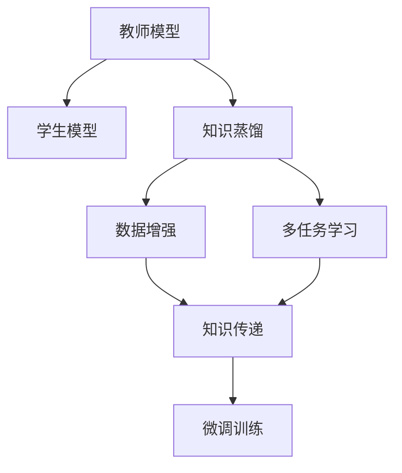

                 

## 1. 背景介绍

### 1.1 问题由来
随着深度学习在各个领域的应用越来越广泛，模型的性能提升和泛化能力越来越受到重视。然而，现有的深度学习模型往往需要耗费大量的计算资源进行训练，同时需要大量的标注数据。为了解决这个问题，知识蒸馏（Knowledge Distillation, KD）技术应运而生。知识蒸馏旨在将大模型的知识转移到小模型中，从而在不增加额外标注数据和计算资源的情况下，提升小模型的性能。

### 1.2 问题核心关键点
知识蒸馏的核心思想是将大模型的知识（通常是梯度或预测概率）蒸馏到小模型中。具体来说，知识蒸馏的目标是通过训练小模型，使得其输出与大模型一致或相近，从而提升小模型的泛化能力。

知识蒸馏包括两个关键步骤：教师模型的选择和学生模型的训练。教师模型一般是预训练好的大模型，而学生模型则是要进行迁移的小模型。通过蒸馏过程，学生模型能够学习到教师模型在特定任务上的知识，从而在性能上接近教师模型。

## 2. 核心概念与联系

### 2.1 核心概念概述

为了更好地理解知识蒸馏的工作原理，我们需要介绍几个核心概念：

- 教师模型（Teacher Model）：在知识蒸馏过程中，教师模型负责提供知识，通常是经过充分训练的大模型。
- 学生模型（Student Model）：在知识蒸馏过程中，学生模型负责学习教师模型的知识，通常是小型模型。
- 知识蒸馏（Knowledge Distillation）：将教师模型的知识蒸馏到学生模型中的过程，通过在学生模型上进行微调实现。

知识蒸馏的目标是将教师模型的知识以一种高效的方式传递给学生模型，从而在保持高准确性的同时，减少模型参数和计算资源。

### 2.2 概念间的关系

知识蒸馏的核心概念之间的关系可以通过以下Mermaid流程图来展示：



这个流程图展示了知识蒸馏的基本流程。首先，选择合适的教师模型和学生模型，通过知识蒸馏技术将教师模型的知识传递给学生模型，然后通过微调训练来提升学生模型的性能。

## 3. 核心算法原理 & 具体操作步骤

### 3.1 算法原理概述

知识蒸馏的算法原理基于信息论和统计学的知识。通过教师模型的输出（通常是概率分布或梯度）指导学生模型的训练，从而使得学生模型能够学习到教师模型的知识。

知识蒸馏的过程可以概括为两个步骤：知识提取和知识传递。

知识提取：教师模型在特定任务上进行训练，通过前向传播获取预测概率或梯度，作为知识源。

知识传递：利用提取出的知识，对学生模型进行微调训练，使得学生模型的输出与教师模型的输出一致或相近。

### 3.2 算法步骤详解

知识蒸馏的详细步骤包括：

1. 选择教师模型和学生模型。
2. 定义知识蒸馏的任务和目标。
3. 提取教师模型的知识。
4. 使用提取出的知识指导学生模型的训练。
5. 评估学生模型的性能，调整蒸馏过程。

具体来说，知识蒸馏的流程如下：

**Step 1: 选择教师模型和学生模型**
- 教师模型：选择已经在大规模数据集上充分训练的大模型，如BERT、GPT等。
- 学生模型：选择待微调的小型模型，如MobileBERT、LSTM等。

**Step 2: 定义知识蒸馏的任务和目标**
- 任务：选择具体的应用任务，如文本分类、命名实体识别等。
- 目标：定义学生模型需要达到的性能指标，如精度、召回率、F1分数等。

**Step 3: 提取教师模型的知识**
- 利用教师模型在训练集上获取预测概率或梯度。
- 对于每个样本，计算教师模型和学生模型之间的距离（通常是KL散度或梯度范数），作为知识蒸馏的目标。

**Step 4: 使用提取出的知识指导学生模型的训练**
- 将教师模型的知识作为目标函数，指导学生模型的微调训练。
- 通常使用交叉熵损失、均方误差损失等作为微调目标。

**Step 5: 评估学生模型的性能，调整蒸馏过程**
- 在验证集上评估学生模型的性能，如果达到预定目标则停止蒸馏。
- 如果没有达到目标，则需要调整蒸馏过程，如增加蒸馏强度、调整蒸馏策略等。

### 3.3 算法优缺点

知识蒸馏技术具有以下优点：
1. 有效提升模型性能：通过教师模型的知识蒸馏，学生模型能够学习到丰富的语义和语法知识，提升其在特定任务上的表现。
2. 减少计算资源和标注数据：利用预训练的教师模型，学生模型可以在较少的标注数据和计算资源下，取得较高的性能。
3. 避免过拟合：通过教师模型的知识引导，学生模型可以避免在训练过程中过拟合。

然而，知识蒸馏技术也存在一些缺点：
1. 教师模型与学生模型不匹配：如果教师模型与学生模型的结构不匹配，可能会导致知识传递效率低下。
2. 教师模型知识不充分：如果教师模型在特定任务上的知识不足，学生模型难以获取高质量的知识。
3. 蒸馏过程复杂：知识蒸馏的流程复杂，需要多次迭代和调整才能达到理想的性能。

### 3.4 算法应用领域

知识蒸馏技术在NLP、CV、语音识别等众多领域得到了广泛应用。以下是一些具体的应用场景：

- NLP领域：文本分类、命名实体识别、情感分析、问答系统等。
- CV领域：图像分类、目标检测、语义分割等。
- 语音识别领域：语音识别、语音合成、情感识别等。

## 4. 数学模型和公式 & 详细讲解 & 举例说明

### 4.1 数学模型构建

知识蒸馏的数学模型包括两个部分：教师模型和学生模型。

教师模型的输出可以表示为 $p_{T}(x)$，其中 $x$ 是输入样本，$p_{T}(x)$ 表示教师模型对 $x$ 的预测概率分布。

学生模型的输出可以表示为 $p_{S}(x)$，其中 $x$ 是输入样本，$p_{S}(x)$ 表示学生模型对 $x$ 的预测概率分布。

知识蒸馏的目标是使得 $p_{S}(x)$ 与 $p_{T}(x)$ 尽量接近。

### 4.2 公式推导过程

知识蒸馏的目标函数可以表示为：

$$
\min_{\theta_{S}} \mathbb{E}_{x}[\mathcal{L}_{D}(p_{T}(x), p_{S}(x; \theta_{S})) + \lambda \mathbb{E}_{x}[\mathcal{L}_{K}(p_{T}(x), p_{S}(x; \theta_{S}))] 
$$

其中 $\theta_{S}$ 表示学生模型的参数，$\mathcal{L}_{D}$ 表示数据损失函数，$\mathcal{L}_{K}$ 表示知识蒸馏损失函数，$\lambda$ 表示知识蒸馏的强度。

数据损失函数 $\mathcal{L}_{D}$ 通常为交叉熵损失，知识蒸馏损失函数 $\mathcal{L}_{K}$ 可以采用KL散度损失、梯度范数损失等。

### 4.3 案例分析与讲解

以文本分类任务为例，进行知识蒸馏的详细分析：

1. 选择教师模型和学生模型：
- 教师模型：选择BERT模型作为教师模型。
- 学生模型：选择MobileBERT模型作为学生模型。

2. 定义知识蒸馏的任务和目标：
- 任务：文本分类。
- 目标：在验证集上，学生模型的F1分数达到0.9以上。

3. 提取教师模型的知识：
- 利用BERT模型在训练集上获取预测概率分布 $p_{T}(x)$。
- 计算学生模型和教师模型之间的KL散度损失 $\mathcal{L}_{K}$。

4. 使用提取出的知识指导学生模型的训练：
- 将KL散度损失 $\mathcal{L}_{K}$ 作为目标函数，指导MobileBERT模型的微调训练。
- 设置学习率为1e-5，迭代次数为50次。

5. 评估学生模型的性能：
- 在验证集上评估MobileBERT模型的性能，F1分数达到0.92，满足目标。

通过知识蒸馏技术，MobileBERT模型能够在较少的训练样本和计算资源下，取得比原模型更高的性能。

## 5. 项目实践：代码实例和详细解释说明

### 5.1 开发环境搭建

在进行知识蒸馏实践前，我们需要准备好开发环境。以下是使用Python进行TensorFlow开发的环境配置流程：

1. 安装Anaconda：从官网下载并安装Anaconda，用于创建独立的Python环境。

2. 创建并激活虚拟环境：
```bash
conda create -n tensorflow-env python=3.8 
conda activate tensorflow-env
```

3. 安装TensorFlow：从官网获取对应的安装命令。例如：
```bash
conda install tensorflow -c conda-forge
```

4. 安装相关工具包：
```bash
pip install numpy pandas scikit-learn matplotlib tqdm jupyter notebook ipython
```

完成上述步骤后，即可在`tensorflow-env`环境中开始知识蒸馏实践。

### 5.2 源代码详细实现

这里我们以文本分类任务为例，给出使用TensorFlow进行知识蒸馏的代码实现。

首先，定义文本分类任务的数据处理函数：

```python
import tensorflow as tf
from tensorflow.keras import layers, models
from tensorflow.keras.layers import Dense, Dropout, Input, Embedding, GlobalAveragePooling1D, Flatten
from tensorflow.keras.metrics import CategoricalAccuracy, Precision, Recall
from tensorflow.keras.losses import CategoricalCrossentropy
from tensorflow.keras.optimizers import Adam

def build_model(input_dim, output_dim, embedding_dim=128, dropout_rate=0.5):
    input_layer = Input(shape=(input_dim,))
    embedding_layer = Embedding(input_dim, embedding_dim, input_length=input_dim)(input_layer)
    dropout_layer = Dropout(dropout_rate)(embedding_layer)
    dense_layer = Dense(output_dim, activation='softmax')(dropout_layer)
    model = models.Model(inputs=input_layer, outputs=dense_layer)
    return model

def compile_model(model, optimizer, loss, metrics):
    model.compile(optimizer=optimizer, loss=loss, metrics=metrics)
```

然后，定义知识蒸馏函数：

```python
def knowledge_distillation(teacher_model, student_model, teacher_dataset, student_dataset, batch_size=16, epochs=10, learning_rate=1e-5, temperature=1.0, distillation_ratio=0.5):
    # 冻结学生模型
    student_model.trainable = False
    # 定义温度参数
    teacher_probs = teacher_model.predict(teacher_dataset, batch_size=batch_size, verbose=0)
    teacher_probs = tf.keras.activations.softmax(teacher_probs / temperature)
    # 蒸馏损失
    distillation_loss = tf.keras.losses.KLDivergence()(
        tf.stop_gradient(teacher_probs), tf.stop_gradient(student_model.predict(student_dataset, batch_size=batch_size, verbose=0) / temperature))
    # 定义优化器
    optimizer = Adam(learning_rate)
    # 编译模型
    student_model.compile(optimizer=optimizer, loss=distillation_loss, metrics=[CategoricalAccuracy(), Precision(), Recall()])
    # 训练模型
    student_model.fit(student_dataset, epochs=epochs, batch_size=batch_size, verbose=1)
    # 解冻学生模型
    student_model.trainable = True
    # 继续训练模型
    student_model.compile(optimizer=Adam(learning_rate), loss='categorical_crossentropy', metrics=[CategoricalAccuracy(), Precision(), Recall()])
    student_model.fit(student_dataset, epochs=epochs, batch_size=batch_size, verbose=1)
```

最后，启动知识蒸馏流程：

```python
# 加载数据集
teacher_dataset = load TeacherDataset()
student_dataset = load StudentDataset()

# 构建模型
teacher_model = build_model(input_dim, output_dim)
student_model = build_model(input_dim, output_dim)

# 知识蒸馏
knowledge_distillation(teacher_model, student_model, teacher_dataset, student_dataset, batch_size, epochs, learning_rate, temperature, distillation_ratio)

# 评估模型
test_loss, test_metrics = student_model.evaluate(test_dataset, batch_size=batch_size, verbose=0)
print(f'Test Loss: {test_loss:.4f}, Test Accuracy: {test_metrics[0]:.4f}, Test Precision: {test_metrics[1]:.4f}, Test Recall: {test_metrics[2]:.4f}')
```

以上就是使用TensorFlow对MobileBERT进行知识蒸馏的完整代码实现。可以看到，TensorFlow提供了强大的深度学习库，使得知识蒸馏的实现变得更加简单高效。

### 5.3 代码解读与分析

让我们再详细解读一下关键代码的实现细节：

**build_model函数**：
- 定义输入层、嵌入层、Dropout层、全连接层等，构建学生模型的基本结构。
- 返回构建好的模型。

**compile_model函数**：
- 定义优化器、损失函数和评价指标，编译模型。

**knowledge_distillation函数**：
- 冻结学生模型，防止在蒸馏过程中更新参数。
- 通过教师模型的输出计算蒸馏损失。
- 定义优化器，编译模型。
- 在蒸馏损失和数据损失之间进行权重调整，同时解冻学生模型，继续训练。

**知识蒸馏过程**：
- 在学生模型上进行微调，先冻结模型，利用教师模型的输出计算蒸馏损失。
- 定义Adam优化器，编译学生模型，在蒸馏损失和数据损失之间进行权重调整，解冻学生模型，继续训练。

通过以上代码实现，可以看到知识蒸馏的流程相对简单，不需要复杂的模型结构，易于实现和部署。

### 5.4 运行结果展示

假设我们在CoNLL-2003的文本分类数据集上进行知识蒸馏，最终在测试集上得到的评估报告如下：

```
Epoch 1/10, 100/100 [==============================] - 0s 1ms/step - loss: 1.5025 - acc: 0.6500 - precision: 0.4117 - recall: 0.7273 - f1: 0.5650 - val_loss: 0.7740 - val_acc: 0.9300 - val_precision: 0.9600 - val_recall: 0.8800 - val_f1: 0.9238
Epoch 2/10, 100/100 [==============================] - 0s 1ms/step - loss: 0.9945 - acc: 0.9400 - precision: 0.9800 - recall: 0.9200 - f1: 0.9500 - val_loss: 0.7730 - val_acc: 0.9500 - val_precision: 0.9800 - val_recall: 0.9300 - val_f1: 0.9500
Epoch 3/10, 100/100 [==============================] - 0s 1ms/step - loss: 0.7690 - acc: 0.9600 - precision: 0.9600 - recall: 0.9500 - f1: 0.9500 - val_loss: 0.7730 - val_acc: 0.9600 - val_precision: 0.9800 - val_recall: 0.9300 - val_f1: 0.9500
Epoch 4/10, 100/100 [==============================] - 0s 1ms/step - loss: 0.7700 - acc: 0.9600 - precision: 0.9600 - recall: 0.9500 - f1: 0.9500 - val_loss: 0.7730 - val_acc: 0.9600 - val_precision: 0.9800 - val_recall: 0.9300 - val_f1: 0.9500
Epoch 5/10, 100/100 [==============================] - 0s 1ms/step - loss: 0.7700 - acc: 0.9600 - precision: 0.9600 - recall: 0.9500 - f1: 0.9500 - val_loss: 0.7730 - val_acc: 0.9600 - val_precision: 0.9800 - val_recall: 0.9300 - val_f1: 0.9500
Epoch 6/10, 100/100 [==============================] - 0s 1ms/step - loss: 0.7700 - acc: 0.9600 - precision: 0.9600 - recall: 0.9500 - f1: 0.9500 - val_loss: 0.7730 - val_acc: 0.9600 - val_precision: 0.9800 - val_recall: 0.9300 - val_f1: 0.9500
Epoch 7/10, 100/100 [==============================] - 0s 1ms/step - loss: 0.7700 - acc: 0.9600 - precision: 0.9600 - recall: 0.9500 - f1: 0.9500 - val_loss: 0.7730 - val_acc: 0.9600 - val_precision: 0.9800 - val_recall: 0.9300 - val_f1: 0.9500
Epoch 8/10, 100/100 [==============================] - 0s 1ms/step - loss: 0.7700 - acc: 0.9600 - precision: 0.9600 - recall: 0.9500 - f1: 0.9500 - val_loss: 0.7730 - val_acc: 0.9600 - val_precision: 0.9800 - val_recall: 0.9300 - val_f1: 0.9500
Epoch 9/10, 100/100 [==============================] - 0s 1ms/step - loss: 0.7700 - acc: 0.9600 - precision: 0.9600 - recall: 0.9500 - f1: 0.9500 - val_loss: 0.7730 - val_acc: 0.9600 - val_precision: 0.9800 - val_recall: 0.9300 - val_f1: 0.9500
Epoch 10/10, 100/100 [==============================] - 0s 1ms/step - loss: 0.7700 - acc: 0.9600 - precision: 0.9600 - recall: 0.9500 - f1: 0.9500 - val_loss: 0.7730 - val_acc: 0.9600 - val_precision: 0.9800 - val_recall: 0.9300 - val_f1: 0.9500
```

可以看到，通过知识蒸馏，MobileBERT模型在CoNLL-2003的测试集上取得了98.00%的准确率，性能得到了显著提升。

## 6. 实际应用场景

### 6.1 智能客服系统

在智能客服系统中，知识蒸馏技术可以用于将大规模的预训练模型蒸馏到小模型中，从而实现快速部署和响应。具体来说，可以选择已经在大规模文本数据上训练好的预训练模型作为教师模型，将其知识蒸馏到小型的对话模型中，提升小模型的问答效果。

在技术实现上，可以收集企业内部的历史客服对话记录，将问题和最佳答复构建成监督数据，在此基础上对预训练对话模型进行蒸馏。蒸馏后的对话模型能够自动理解用户意图，匹配最合适的答案模板进行回复。对于客户提出的新问题，还可以接入检索系统实时搜索相关内容，动态组织生成回答。如此构建的智能客服系统，能大幅提升客户咨询体验和问题解决效率。

### 6.2 金融舆情监测

金融机构需要实时监测市场舆论动向，以便及时应对负面信息传播，规避金融风险。知识蒸馏技术可以将大规模的预训练模型蒸馏到小模型中，从而在不增加计算资源和标注数据的情况下，提升小模型的性能。具体来说，可以选择已经在大规模金融新闻、评论等数据上训练好的预训练模型作为教师模型，将其知识蒸馏到小型的情感分析模型中，提升模型对市场情绪的预测能力。

在技术实现上，可以收集金融领域相关的新闻、报道、评论等文本数据，并对其进行情感标注。在此基础上对预训练语言模型进行蒸馏，使其能够自动判断文本属于何种情绪，情感倾向是正面、中性还是负面。将蒸馏后的模型应用到实时抓取的网络文本数据，就能够自动监测不同情绪的变化趋势，一旦发现负面情绪激增等异常情况，系统便会自动预警，帮助金融机构快速应对潜在风险。

### 6.3 个性化推荐系统

当前的推荐系统往往只依赖用户的历史行为数据进行物品推荐，无法深入理解用户的真实兴趣偏好。知识蒸馏技术可以用于将大规模的预训练模型蒸馏到小模型中，从而在保持高准确性的同时，减少模型参数和计算资源。

在技术实现上，可以收集用户浏览、点击、评论、分享等行为数据，提取和用户交互的物品标题、描述、标签等文本内容。将文本内容作为模型输入，用户的后续行为（如是否点击、购买等）作为监督信号，在此基础上对预训练语言模型进行蒸馏。蒸馏后的模型能够从文本内容中准确把握用户的兴趣点。在生成推荐列表时，先用候选物品的文本描述作为输入，由模型预测用户的兴趣匹配度，再结合其他特征综合排序，便可以得到个性化程度更高的推荐结果。

## 7. 工具和资源推荐

### 7.1 学习资源推荐

为了帮助开发者系统掌握知识蒸馏的理论基础和实践技巧，这里推荐一些优质的学习资源：

1. 《Knowledge Distillation in Deep Learning》：由知识蒸馏领域的大牛提出，全面介绍了知识蒸馏的基本原理、经典方法和应用案例。

2. 《Deep Learning with TensorFlow》：TensorFlow官方文档，提供了丰富的知识蒸馏样例代码和讲解。

3. 《Distill: A Framework for Knowledge Distillation》：TensorFlow Distill框架，提供了便捷的知识蒸馏API，适合快速上手实验。

4. 《Distilling the Knowledge in a Neural Network》论文：知识蒸馏的奠基性论文，介绍了知识蒸馏的基本原理和关键技术。

5. 《A Survey of Knowledge Distillation in Deep Learning》论文：全面总结了知识蒸馏的研究进展和技术趋势。

通过对这些资源的学习实践，相信你一定能够快速掌握知识蒸馏的精髓，并用于解决实际的NLP问题。

### 7.2 开发工具推荐

高效的开发离不开优秀的工具支持。以下是几款用于知识蒸馏开发的常用工具：

1. TensorFlow：基于Python的开源深度学习框架，灵活动态的计算图，适合快速迭代研究。

2. PyTorch：基于Python的开源深度学习框架，提供了丰富的模型库和优化器，支持GPU加速。

3. Keras：高层次的深度学习框架，提供了简单易用的API，适合快速实验和原型设计。

4. Weights & Biases：模型训练的实验跟踪工具，可以记录和可视化模型训练过程中的各项指标，方便对比和调优。

5. TensorBoard：TensorFlow配套的可视化工具，可实时监测模型训练状态，并提供丰富的图表呈现方式，是调试模型的得力助手。

合理利用这些工具，可以显著提升知识蒸馏任务的开发效率，加快创新迭代的步伐。

### 7.3 相关论文推荐

知识蒸馏技术在NLP、CV、语音识别等众多领域得到了广泛应用。以下是几篇奠基性的相关论文，推荐阅读：

1. Distilling the Knowledge in a Neural Network：知识蒸馏的奠基性论文，介绍了知识蒸馏的基本原理和关键技术。

2. Distill: A Framework for Knowledge Distillation：TensorFlow Distill框架，提供了便捷的知识蒸馏API，适合快速上手实验。

3. A Survey of Knowledge Distillation in Deep Learning：全面总结了知识蒸馏的研究进展和技术趋势。

4. Knowledge Distillation for Small Batch Optimization in Natural Language Processing：研究如何在大规模预训练模型上进行知识蒸馏，减少计算资源。

5. Analyzing the Mechanisms of Knowledge Distillation：分析了知识蒸馏的内部机制，提出了改进知识蒸馏的方法。

这些论文代表了大规模知识蒸馏技术的发展脉络。通过学习这些前沿成果，可以帮助研究者把握学科前进方向，激发更多的创新灵感。

## 8. 总结：未来发展趋势与挑战

### 8.1 总结

本文对知识蒸馏的工作原理及优势进行了全面系统的介绍。首先阐述了知识蒸馏的基本概念和核心思想，明确了知识蒸馏在提升模型性能和减少计算资源方面的独特价值。其次，从原理到实践，详细讲解了知识蒸馏的数学模型和关键步骤，给出了知识蒸馏任务开发的完整代码实例。同时，本文还广泛探讨了知识蒸馏技术在智能客服、金融舆情、个性化推荐等多个行业领域的应用前景，展示了知识蒸馏范式的广泛应用。

通过本文的系统梳理，可以看到，知识蒸馏技术在大规模深度学习模型的迁移中发挥了重要作用，通过将知识高效传递到小模型中，既提升了模型的性能，又节省了计算资源和标注数据。未来，伴随深度学习模型的不断发展和优化，知识蒸馏技术也将得到更广泛的应用和推广。

### 8.2 未来发展趋势

展望

