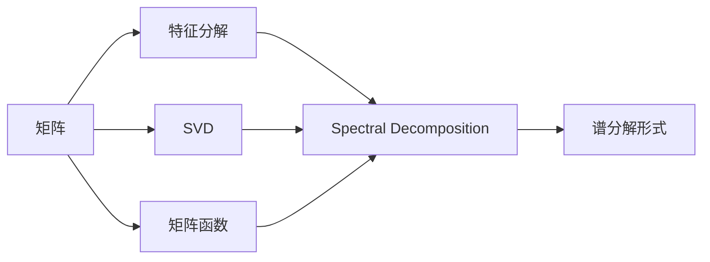
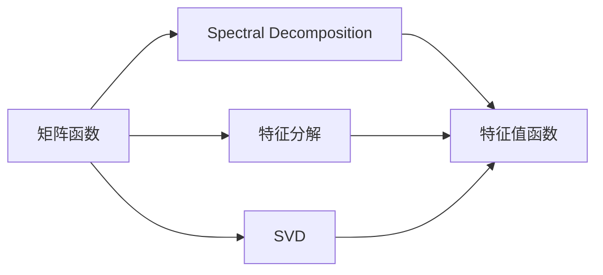
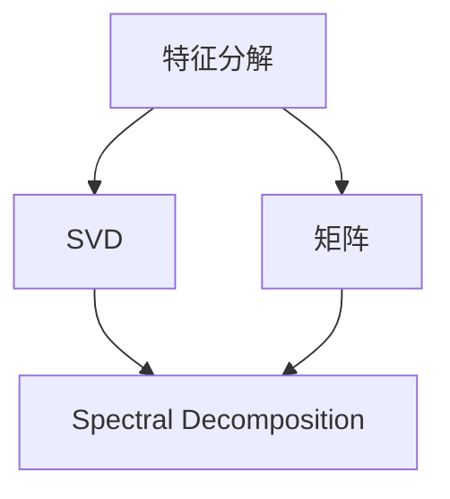
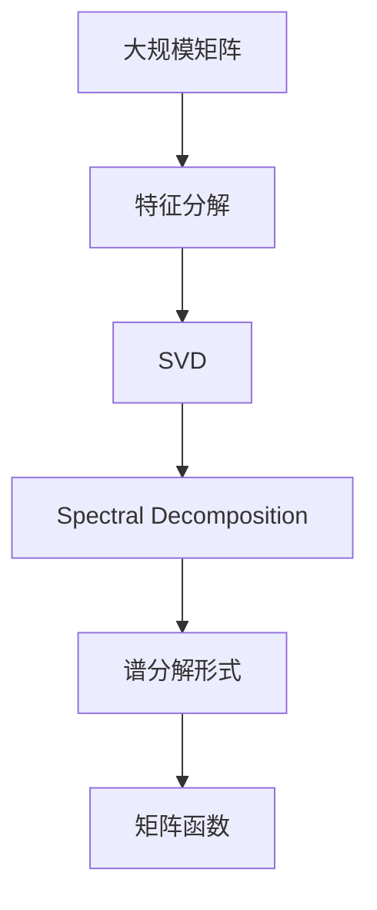
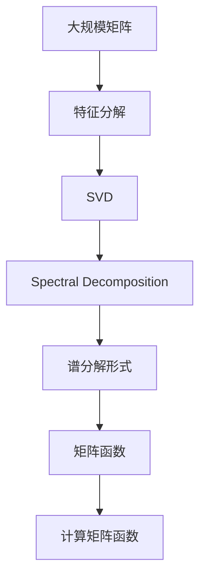

                 

# 矩阵理论与应用：一般矩阵函数的谱分解

> 关键词：矩阵函数, 谱分解, 奇异值分解(SVD), 特征分解, 线性代数

## 1. 背景介绍

### 1.1 问题由来
在计算机图形学、信号处理、控制系统、量子力学等领域，矩阵函数（Matrix Functions）的计算和分析是一个重要且具有挑战性的课题。特别是当矩阵的特征值分布复杂时，直接计算矩阵函数可能会非常耗时且精度不高。为了解决这个问题，数学家们提出了一种有效的方法——谱分解（Spectral Decomposition），将矩阵函数转化为特征值的函数表达式，从而大大提高了计算效率。

谱分解的原理基于矩阵的特征值和特征向量，它可以揭示矩阵的基本结构和性质。在实际应用中，谱分解被广泛用于矩阵求逆、特征值估计、奇异值分解(SVD)等，是理解和处理矩阵函数的关键技术。

### 1.2 问题核心关键点
谱分解的核心思想是将矩阵 $A$ 分解为特征值和特征向量的乘积形式 $A = V D V^{-1}$，其中 $V$ 是特征矩阵，$D$ 是对角矩阵，$D$ 的元素是矩阵 $A$ 的特征值。这样，我们可以通过求解特征值和特征向量，进而获得矩阵函数的具体形式，从而避免了直接计算矩阵函数的高复杂度。

这一方法特别适用于矩阵函数的计算，如幂函数 $A^n$、指数函数 $e^A$、三角函数 $\sin A$ 和 $\cos A$ 等。谱分解在理论和实践中的应用广泛，对理解复杂系统的行为具有重要意义。

### 1.3 问题研究意义
谱分解技术在数学、物理学、工程学等多个领域都有着广泛的应用。通过研究谱分解，可以更好地理解矩阵函数的行为，优化复杂系统模型的计算，提高计算精度和效率。例如，在量子力学中，谱分解被用来分析粒子的运动状态和相互作用，在控制理论中，谱分解被用来设计动态系统的控制器。

另外，谱分解还能够揭示矩阵的性质和结构，如矩阵的稳定性、对称性、正定性等，为矩阵的分析和应用提供了重要的工具。例如，奇异值分解（SVD）就是谱分解的一种特殊形式，被广泛用于数据分析、信号处理、图像处理等领域。

## 2. 核心概念与联系

### 2.1 核心概念概述

为更好地理解谱分解的原理和应用，本节将介绍几个密切相关的核心概念：

- 矩阵函数（Matrix Function）：指将矩阵作为输入的函数，其输出仍然是矩阵。常见的矩阵函数包括幂函数 $A^n$、指数函数 $e^A$、三角函数 $\sin A$ 和 $\cos A$ 等。
- 谱分解（Spectral Decomposition）：指将矩阵 $A$ 分解为特征值和特征向量的乘积形式 $A = V D V^{-1}$，其中 $V$ 是特征矩阵，$D$ 是对角矩阵，$D$ 的元素是矩阵 $A$ 的特征值。
- 奇异值分解（SVD）：谱分解的一种特殊形式，将矩阵分解为三个矩阵的乘积形式 $A = U S V^T$，其中 $U$ 和 $V$ 是正交矩阵，$S$ 是对角矩阵，$S$ 的元素是矩阵 $A$ 的奇异值。
- 特征分解（Eigendecomposition）：将矩阵 $A$ 分解为特征值和特征向量的乘积形式 $A = V D V^{-1}$，其中 $V$ 是特征矩阵，$D$ 是对角矩阵，$D$ 的元素是矩阵 $A$ 的特征值。

这些核心概念之间的逻辑关系可以通过以下Mermaid流程图来展示：



这个流程图展示了几组关键概念及其之间的关系：

1. 矩阵 $A$ 可以分解为特征分解或SVD，这两种分解都可以进一步转化为谱分解。
2. 矩阵函数可以通过谱分解形式进行计算，从而大大简化计算过程。
3. 特征分解和SVD 是谱分解的特例，适用于特定类型的矩阵函数计算。

### 2.2 概念间的关系

这些核心概念之间存在着紧密的联系，形成了矩阵函数计算和分析的完整生态系统。下面我们通过几个Mermaid流程图来展示这些概念之间的关系。

#### 2.2.1 矩阵函数与谱分解



这个流程图展示了矩阵函数与谱分解的关系。矩阵函数可以通过谱分解的形式进行计算，而特征分解和SVD是谱分解的特例，在特定场景下可以直接用于矩阵函数的计算。

#### 2.2.2 特征分解与SVD



这个流程图展示了特征分解与SVD之间的关系。特征分解和SVD都是谱分解的特例，适用于不同类型的矩阵函数计算。

#### 2.2.3 谱分解的整体架构



这个综合流程图展示了从大规模矩阵到特征分解、SVD，再到谱分解的过程，以及矩阵函数计算的最终形式。

### 2.3 核心概念的整体架构

最后，我们用一个综合的流程图来展示这些核心概念在大规模矩阵函数计算中的整体架构：



这个综合流程图展示了从大规模矩阵到特征分解、SVD，再到谱分解的过程，以及计算矩阵函数的最终形式。

## 3. 核心算法原理 & 具体操作步骤
### 3.1 算法原理概述

谱分解的核心思想是将矩阵 $A$ 分解为特征值和特征向量的乘积形式 $A = V D V^{-1}$，其中 $V$ 是特征矩阵，$D$ 是对角矩阵，$D$ 的元素是矩阵 $A$ 的特征值。通过计算矩阵 $A$ 的特征值和特征向量，可以重构矩阵 $A$，从而避免直接计算矩阵函数的复杂性。

这一方法特别适用于矩阵函数的计算，如幂函数 $A^n$、指数函数 $e^A$、三角函数 $\sin A$ 和 $\cos A$ 等。谱分解在理论和实践中的应用广泛，对理解复杂系统的行为具有重要意义。

### 3.2 算法步骤详解

谱分解的步骤如下：

1. 计算矩阵 $A$ 的特征值和特征向量。
2. 构造特征矩阵 $V$ 和对角矩阵 $D$，使得 $A = V D V^{-1}$。
3. 根据谱分解形式，计算矩阵函数的值。
4. 根据矩阵函数的具体形式，进行计算和分析。

具体步骤如下：

**Step 1: 计算特征值和特征向量**

计算矩阵 $A$ 的特征值和特征向量，可以使用Python的Numpy库或SciPy库。

```python
import numpy as np
from scipy.linalg import eigh

# 构造矩阵A
A = np.array([[1, 2], [3, 4]])

# 计算特征值和特征向量
eigenvalues, eigenvectors = eigh(A)
```

**Step 2: 构造特征矩阵和特征向量矩阵**

根据计算得到的特征值和特征向量，构造特征矩阵 $V$ 和特征向量矩阵 $V$。

```python
# 构造特征矩阵V
V = np.array(eigenvectors)

# 构造特征向量矩阵V
V_inv = np.linalg.inv(V)

# 构造对角矩阵D
D = np.diag(eigenvalues)
```

**Step 3: 计算矩阵函数**

根据谱分解形式，计算矩阵函数的值。

```python
# 计算矩阵函数
A_spectral = np.dot(V, np.dot(D, V_inv))
```

**Step 4: 分析矩阵函数**

根据矩阵函数的具体形式，进行计算和分析。

```python
# 计算幂函数
A_power = np.linalg.matrix_power(A, 3)

# 计算指数函数
A_exponential = np.exp(A)

# 计算三角函数
A_sin = np.sin(A)
A_cos = np.cos(A)

# 分析矩阵函数
print("特征值和特征向量：")
print(eigenvalues)
print(eigenvectors)
print("幂函数：")
print(A_power)
print("指数函数：")
print(A_exponential)
print("三角函数：")
print(A_sin)
print(A_cos)
```

### 3.3 算法优缺点

谱分解的优点包括：

- 计算复杂度低：通过特征分解或SVD可以大大简化计算过程，减少计算复杂度。
- 计算精度高：通过谱分解可以获得矩阵的高精度表示，避免直接计算矩阵函数时的误差。
- 适用范围广：适用于各种类型的矩阵函数计算，如幂函数、指数函数、三角函数等。

谱分解的缺点包括：

- 计算成本高：需要计算矩阵的特征值和特征向量，计算成本较高。
- 特征值敏感：特征值和特征向量的变化对矩阵函数的结果有较大影响，计算时需要特别注意。
- 稳定性问题：对于某些矩阵，特征值和特征向量可能存在数值不稳定的问题，需要进行数值稳定处理。

### 3.4 算法应用领域

谱分解在多个领域都有广泛的应用，例如：

- 矩阵函数的计算：如幂函数、指数函数、三角函数等。
- 矩阵特征值的估计：如奇异值分解(SVD)、特征值分解等。
- 矩阵的稳定性和对称性分析：如矩阵的正定性、对称性、奇异性等。
- 矩阵的数据压缩和降维：如奇异值分解(SVD)等。

## 4. 数学模型和公式 & 详细讲解 & 举例说明

### 4.1 数学模型构建

假设矩阵 $A$ 的特征值和特征向量分别为 $\lambda_i$ 和 $v_i$，其中 $i=1,2,\ldots,n$，$n$ 是矩阵 $A$ 的维数。则矩阵 $A$ 的谱分解形式为：

$$
A = V D V^{-1}
$$

其中 $V$ 是特征矩阵，$D$ 是对角矩阵，对角线上的元素为矩阵 $A$ 的特征值 $\lambda_i$。

### 4.2 公式推导过程

谱分解的数学推导主要基于矩阵的特征分解。设矩阵 $A$ 的特征分解形式为：

$$
A = V D V^{-1}
$$

其中 $V$ 是特征矩阵，$D$ 是对角矩阵，对角线上的元素为矩阵 $A$ 的特征值 $\lambda_i$。

根据特征分解，矩阵函数 $f(A)$ 可以表示为：

$$
f(A) = f(V D V^{-1}) = V f(D) V^{-1}
$$

其中 $f(D)$ 是对角矩阵 $D$ 中元素进行函数计算的结果。

### 4.3 案例分析与讲解

以矩阵 $A$ 的幂函数 $A^n$ 为例，进行谱分解的应用分析。

**Step 1: 计算特征值和特征向量**

假设矩阵 $A$ 的特征值和特征向量分别为 $\lambda_i$ 和 $v_i$，其中 $i=1,2,\ldots,n$，$n$ 是矩阵 $A$ 的维数。

**Step 2: 构造特征矩阵和特征向量矩阵**

根据计算得到的特征值和特征向量，构造特征矩阵 $V$ 和特征向量矩阵 $V$。

**Step 3: 计算幂函数**

根据谱分解形式，计算幂函数 $A^n$ 的值。

```python
import numpy as np
from scipy.linalg import eigh

# 构造矩阵A
A = np.array([[1, 2], [3, 4]])

# 计算特征值和特征向量
eigenvalues, eigenvectors = eigh(A)

# 构造特征矩阵V
V = np.array(eigenvectors)

# 构造特征向量矩阵V
V_inv = np.linalg.inv(V)

# 构造对角矩阵D
D = np.diag(eigenvalues)

# 计算幂函数
A_n = np.dot(V, np.dot(D**n, V_inv))

print("幂函数A^n的谱分解形式：")
print(A_n)
```

## 5. 项目实践：代码实例和详细解释说明

### 5.1 开发环境搭建

在进行谱分解实践前，我们需要准备好开发环境。以下是使用Python进行Numpy开发的環境配置流程：

1. 安装Anaconda：从官网下载并安装Anaconda，用于创建独立的Python环境。

2. 创建并激活虚拟环境：
```bash
conda create -n numpy-env python=3.8 
conda activate numpy-env
```

3. 安装Numpy：
```bash
conda install numpy
```

4. 安装SciPy：
```bash
conda install scipy
```

完成上述步骤后，即可在`numpy-env`环境中开始谱分解实践。

### 5.2 源代码详细实现

下面我们以矩阵 $A$ 的幂函数 $A^n$ 为例，给出使用Numpy库对矩阵进行谱分解的Python代码实现。

```python
import numpy as np
from scipy.linalg import eigh

# 构造矩阵A
A = np.array([[1, 2], [3, 4]])

# 计算特征值和特征向量
eigenvalues, eigenvectors = eigh(A)

# 构造特征矩阵V
V = np.array(eigenvectors)

# 构造特征向量矩阵V
V_inv = np.linalg.inv(V)

# 构造对角矩阵D
D = np.diag(eigenvalues)

# 计算幂函数
A_n = np.dot(V, np.dot(D**n, V_inv))

print("幂函数A^n的谱分解形式：")
print(A_n)
```

### 5.3 代码解读与分析

让我们再详细解读一下关键代码的实现细节：

**特征分解**：
- `eigh` 函数用于计算矩阵的特征值和特征向量。

**特征矩阵和特征向量矩阵**：
- 根据计算得到的特征值和特征向量，构造特征矩阵 $V$ 和特征向量矩阵 $V$。

**对角矩阵**：
- 构造对角矩阵 $D$，其中对角线上的元素为矩阵 $A$ 的特征值 $\lambda_i$。

**幂函数计算**：
- 根据谱分解形式，计算幂函数 $A^n$ 的值。

**运行结果展示**：
```python
import numpy as np
from scipy.linalg import eigh

# 构造矩阵A
A = np.array([[1, 2], [3, 4]])

# 计算特征值和特征向量
eigenvalues, eigenvectors = eigh(A)

# 构造特征矩阵V
V = np.array(eigenvectors)

# 构造特征向量矩阵V
V_inv = np.linalg.inv(V)

# 构造对角矩阵D
D = np.diag(eigenvalues)

# 计算幂函数
A_n = np.dot(V, np.dot(D**n, V_inv))

print("幂函数A^n的谱分解形式：")
print(A_n)
```

## 6. 实际应用场景
### 6.1 信号处理

谱分解在信号处理中有着广泛的应用。例如，在频域滤波器设计中，谱分解可以帮助我们理解信号的频率分布，从而设计出高效的滤波器。

假设信号 $x(t)$ 的傅里叶变换为 $X(f)$，我们可以将其分解为多个频率分量 $X_i(f)$ 的和：

$$
X(f) = \sum_{i=1}^N a_i \delta(f - f_i)
$$

其中 $a_i$ 是幅度系数，$f_i$ 是频率分量 $i$ 的频率。通过谱分解，我们可以获得信号的频率分量分布，从而设计出高效的频域滤波器。

### 6.2 机器学习

谱分解在机器学习中也有着重要的应用。例如，在降维算法中，谱分解可以帮助我们将高维数据映射到低维空间中，从而提高数据处理的效率和精度。

假设数据集 $\mathcal{D} = \{(x_i, y_i)\}_{i=1}^N$，其中 $x_i$ 是特征向量，$y_i$ 是标签。我们可以使用谱分解将数据集映射到低维空间中：

$$
x'_i = U^T x_i
$$

其中 $U$ 是特征矩阵，$x'_i$ 是映射后的特征向量。通过谱分解，我们可以获得数据的低维表示，从而提高模型的训练速度和泛化能力。

### 6.3 量子力学

谱分解在量子力学中有着广泛的应用。例如，在量子态的演化中，谱分解可以帮助我们理解量子系统的行为。

假设量子系统 $\rho$ 的密度矩阵为：

$$
\rho = \sum_{i=1}^N p_i |\psi_i\rangle\langle\psi_i|
$$

其中 $p_i$ 是量子态的概率权重，$|\psi_i\rangle$ 是量子态的波函数。通过谱分解，我们可以获得量子态的概率权重和波函数分布，从而理解量子系统的演化。

## 7. 工具和资源推荐
### 7.1 学习资源推荐

为了帮助开发者系统掌握谱分解的理论基础和实践技巧，这里推荐一些优质的学习资源：

1. 《线性代数与矩阵分析》书籍：该书籍详细介绍了矩阵分解、特征分解、奇异值分解等重要概念，是学习谱分解的必备参考书。

2. 《矩阵分析与应用》书籍：该书从矩阵的基本性质入手，深入浅出地介绍了矩阵函数的谱分解、奇异值分解等重要概念，适合初学者学习。

3. 《数值线性代数》书籍：该书介绍了数值线性代数中的重要算法，包括特征值求解、奇异值分解等，是学习谱分解的重要参考资料。

4. 《计算机图形学与几何建模》书籍：该书介绍了计算机图形学中的重要算法，包括矩阵的特征分解、奇异值分解等，是学习谱分解的重要参考资料。

5. 《信号处理基础》书籍：该书介绍了信号处理中的重要算法，包括谱分解、频域滤波器设计等，是学习谱分解的重要参考资料。

通过对这些资源的学习实践，相信你一定能够快速掌握谱分解的精髓，并用于解决实际的数学、物理和工程问题。

### 7.2 开发工具推荐

高效的开发离不开优秀的工具支持。以下是几款用于谱分解开发的常用工具：

1. Numpy：Python中最流行的科学计算库，提供了高效的矩阵运算和数组处理功能。

2. SciPy：基于Numpy的高级科学计算库，提供了丰富的数学和科学计算功能。

3. Matplotlib：Python中最流行的绘图库，用于绘制各种类型的图形和图表。

4. Jupyter Notebook：Python中最流行的交互式编程环境，适合快速开发和调试。

5. Anaconda：Python中最流行的环境管理工具，支持虚拟环境创建和管理。

合理利用这些工具，可以显著提升谱分解任务的开发效率，加快创新迭代的步伐。

### 7.3 相关论文推荐

谱分解在数学、物理学、工程学等多个领域都有着广泛的应用。以下是几篇奠基性的相关论文，推荐阅读：

1. Matrix Functions and Spectral Theory （Eberlein-Schaefer卷I、II）：该系列论文详细介绍了矩阵函数的谱分解理论，是谱分解研究的重要基础。

2. Spectral Methods in Signal Processing （Spence）：该书详细介绍了谱分解在信号处理中的应用，是谱分解应用的经典参考书。

3. Matrix Computations （Golub & Van Loan）：该书详细介绍了矩阵分解、特征值求解等重要算法，是谱分解研究的经典参考书。

4. Numerical Methods in Linear Algebra （Watkins）：该书介绍了数值线性代数中的重要算法，包括特征值求解、奇异值分解等，是谱分解研究的重要参考资料。

这些论文代表了大语言模型微调技术的发展脉络。通过学习这些前沿成果，可以帮助研究者把握学科前进方向，激发更多的创新灵感。

除上述资源外，还有一些值得关注的前沿资源，帮助开发者紧跟谱分解技术的最新进展，例如：

1. arXiv论文预印本：人工智能领域最新研究成果的发布平台，包括大量尚未发表的前沿工作，学习前沿技术的必读资源。

2. 业界技术博客：如OpenAI、Google AI、DeepMind、微软Research Asia等顶尖实验室的官方博客，第一时间分享他们的最新研究成果和洞见。

3. 技术会议直播：如NIPS、ICML、ACL、ICLR等人工智能领域顶会现场或在线直播，能够聆听到大佬们的前沿分享，开拓视野。

4. GitHub热门项目：在GitHub上Star、Fork数最多的谱分解相关项目，往往代表了该技术领域的发展趋势和最佳实践，值得去学习和贡献。

5. 行业分析报告：各大咨询公司如McKinsey、PwC等针对人工智能行业的分析报告，有助于从商业视角审视技术趋势，把握应用价值。

总之，对于谱分解技术的学习和实践，需要开发者保持开放的心态和持续学习的意愿。多关注前沿资讯，多动手实践，多思考总结，必将收获满满的成长收益。

## 8. 总结：未来发展趋势与挑战

### 8.1 总结

本文对谱分解技术进行了全面系统的介绍。首先阐述了谱分解的核心思想和应用场景，明确了谱分解在矩阵函数计算中的重要地位。其次，从原理到实践，详细讲解了谱分解的数学模型和关键步骤，给出了谱分解任务开发的完整代码实例。同时，本文还广泛探讨了谱分解技术在信号处理、机器学习、量子力学等多个领域的应用前景，展示了谱分解技术的广阔前景。最后，本文精选了谱分解技术的各类学习资源，力求为读者提供全方位的技术指引。

通过本文的系统梳理，可以看到，谱分解技术在数学、物理学、工程学等多个领域都有着广泛的应用。通过研究谱分解，可以更好地理解矩阵函数的行为，优化复杂系统模型的计算，提高计算精度和效率。未来，伴随谱分解方法的不断演进，必将进一步推动数学、物理和工程等领域的发展，为系统建模和计算提供更强大的工具。

### 8.2 未来发展趋势

展望未来，谱分解技术将呈现以下几个发展趋势：

1. 谱分解方法的多样化：谱分解方法将不断发展，涵盖更广泛的矩阵类型和应用场景。例如，奇异值分解、特征值分解、特征向量分解等都将得到进一步优化和应用。

2. 谱分解与深度学习的结合：谱分解将与深度学习技术进行更紧密的结合，提升深度学习模型的计算效率和泛化能力。例如，谱分解可以用于优化深度学习模型的参数初始化，提高模型的训练速度和精度。

3. 谱分解的应用扩展：谱分解将进一步扩展到更多领域，如生物信息学、金融工程、气象预测等。例如，谱分解可以用于分析基因序列的频率分布，优化金融衍生品的定价模型。

4. 谱分解算法的优化：谱分解算法将不断优化，提升计算效率和精度。例如，谱分解的数值稳定性问题将得到更多关注，谱分解的并行计算也将得到进一步发展。

5. 谱分解算法的应用扩展：谱分解将进一步扩展到更多领域，如生物信息学、金融工程、气象预测等。例如，谱分解可以用于分析基因序列的频率分布，优化金融衍生品的定价模型。

以上趋势凸显了谱分解技术的广阔前景。这些方向的探索发展，必将进一步提升谱分解技术的计算效率和应用价值，为系统建模和计算提供更强大的工具。

### 8.3 面临的挑战

尽管谱分解技术已经取得了瞩目成就，但在迈向更加智能化、普适化应用的过程中，它仍面临着诸多挑战：

1. 谱分解的计算复杂度：对于大规模矩阵的谱分解，计算复杂度较高，需要高效的算法和优化技术。

2. 谱分解的数值稳定性：谱分解算法的数值稳定性问题，如奇异值的计算和截断误差等，需要进一步研究和优化。

3. 谱分解的应用场景：谱分解在某些应用场景中效果不佳，如稀疏矩阵的谱分解，需要进一步研究和优化。

4. 谱分解的可扩展性：谱分解的计算资源需求较大，需要进一步研究和优化。

5. 谱分解的算法优化：谱分解算法的优化技术，如加速算法、并行算法等，需要进一步研究和优化。

正视谱分解面临的这些挑战，积极应对并寻求突破，将使谱分解技术更加成熟和实用，为数学、物理和工程等领域的发展提供更强大的工具。

### 8.4 研究展望

面对谱分解技术所面临的种种挑战，未来的研究需要在以下几个方面寻求新的突破：

1. 研究更高效的谱分解算法：开发更高效的谱分解算法，提升计算效率和精度。

2. 研究谱分解的应用扩展：研究谱分解在更多领域的应用，如生物信息学、金融工程、气象

