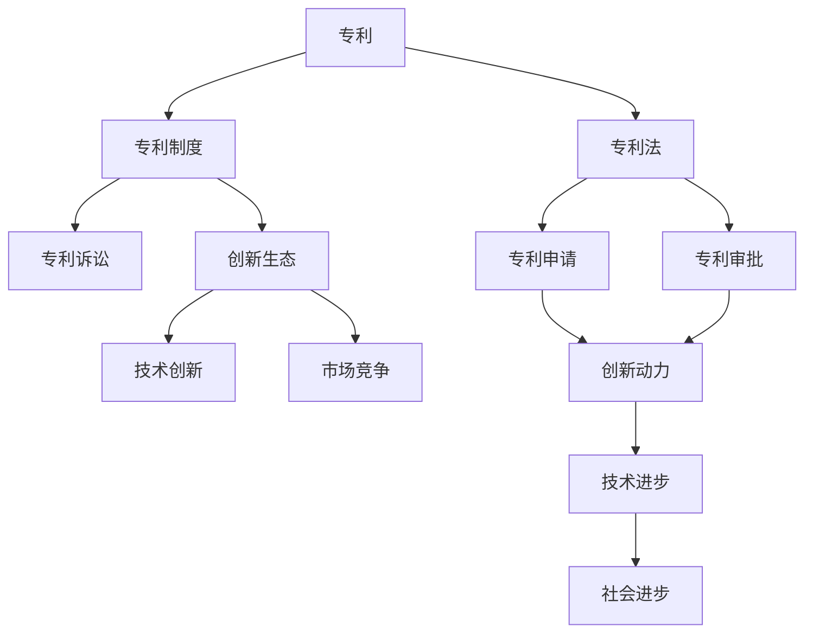
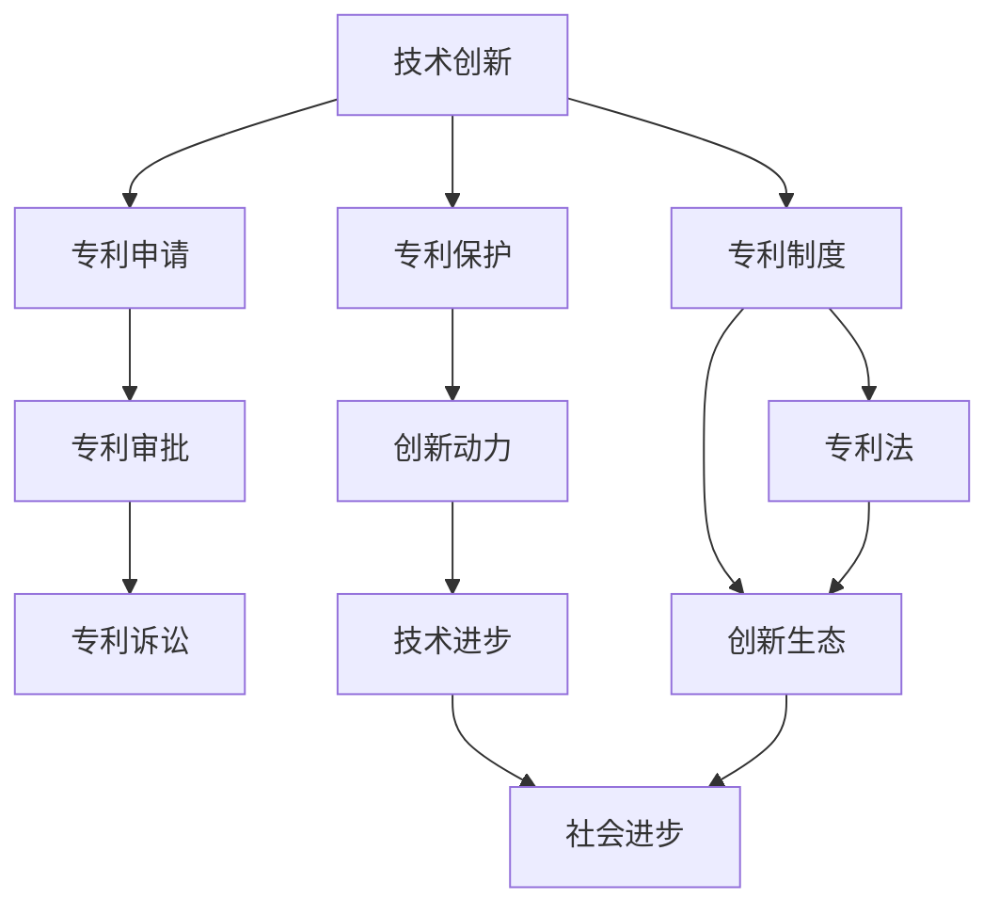

                 

## 1. 背景介绍

### 1.1 问题由来

自19世纪末，美国政府实施专利制度以来，硅谷作为全球创新的中心，一直主导着全球专利生态系统的发展。然而，近年来，随着技术迭代速度的加快和知识产权争议的加剧，硅谷的专利制度暴露出诸多问题，包括专利诉讼过于频繁、创新效率低下、企业创新动力减弱等。这些问题的根源在于现有专利制度的滞后性和僵化性。

### 1.2 问题核心关键点

#### 1.2.1 专利数量爆炸

随着科技进步和创新活动的活跃，硅谷专利申请数量急剧上升。然而，大量的低质量专利和不必要的诉讼对创新生态造成了负面影响，降低了企业的创新动力。

#### 1.2.2 专利质量参差不齐

由于专利申请标准宽松和审查严格，许多专利质量参差不齐，导致创新领域的专利分布不均，影响了企业的研发投入和市场竞争能力。

#### 1.2.3 诉讼纠纷频发

专利诉讼案件数量激增，严重消耗企业资源，拖慢技术创新的步伐，甚至导致公司破产或企业退出市场。

#### 1.2.4 创新动力受限

现有专利制度的低质量和高成本，使得企业不敢轻易投入研发资源，创新动力不足，最终影响了技术进步和社会发展。

#### 1.2.5 法规执行不力

虽然美国专利法不断更新，但法规执行力度不足，导致专利保护效果不理想，影响了创新的可持续性。

### 1.3 问题研究意义

研究硅谷专利制度的改革方向，对于促进创新生态的健康发展、提高企业的创新效率、保护企业的知识产权、推动技术的进步具有重要意义：

1. **促进健康创新生态**：改革专利制度，有助于消除低质量专利和不必要诉讼，形成一个更加公平、高效的创新环境。
2. **提高创新效率**：通过制度改革，鼓励企业投入更多的研发资源，加快技术创新步伐。
3. **保护知识产权**：改善专利质量，强化专利保护，确保企业研发成果不被侵犯。
4. **推动技术进步**：促进高质量专利的产出，引导技术创新向更高水平发展。
5. **增强竞争能力**：解决专利纠纷，确保市场竞争的公平性，提升企业竞争力。

## 2. 核心概念与联系

### 2.1 核心概念概述

#### 2.1.1 专利（Patent）

专利是指国家授权企业在一定期限内对某项技术或发明进行独占性保护的法律文件。专利保护期结束后，技术可以自由使用和传播，促进技术进步和社会发展。

#### 2.1.2 专利制度（Patent System）

专利制度是指国家通过法律规定，授予企业对特定技术或发明的保护，以鼓励创新和竞争，保护知识产权的制度安排。

#### 2.1.3 专利法（Patent Law）

专利法是指国家法律中关于专利保护的具体规定，包括专利申请条件、专利审批程序、专利权期限等内容。

#### 2.1.4 专利诉讼（Patent Litigation）

专利诉讼是指企业因专利侵权或专利纠纷提起的法律诉讼。专利诉讼是专利制度的重要组成部分，但也带来了额外的法律风险和成本。

#### 2.1.5 创新生态（Innovation Ecosystem）

创新生态是指企业、高校、政府、法律机构等共同构成的创新环境，包括技术、市场、政策、法律等多方面因素。

### 2.2 概念间的关系

这些核心概念之间存在着紧密的联系，形成了硅谷专利制度的整体框架。以下是相关概念的Mermaid流程图：



这个流程图展示了专利制度中各个概念之间的关系：

1. 专利是专利制度的核心，通过专利法获得保护。
2. 专利制度和专利法共同保障了专利的申请和审批过程。
3. 专利诉讼是专利制度的一部分，但会带来额外成本和法律风险。
4. 创新生态中包含专利制度和专利法，两者共同促进技术创新和市场竞争。
5. 专利申请和审批促进创新动力，但低质量专利会抑制创新。
6. 技术进步和市场竞争推动社会进步，专利制度在其中起到了关键作用。

### 2.3 核心概念的整体架构

最后，我们用一个综合的流程图来展示这些核心概念在硅谷专利制度中的整体架构：



这个综合流程图展示了从技术创新到专利保护，再到创新生态和社会进步的整体架构，显示了专利制度在创新链中的关键作用。

## 3. 核心算法原理 & 具体操作步骤
### 3.1 算法原理概述

硅谷专利制度的改革方向需要遵循以下几个核心算法原理：

#### 3.1.1 提高专利质量

改革专利申请标准，加强审查力度，提高专利质量，确保专利保护的有效性和合理性。

#### 3.1.2 促进创新生态健康发展

通过优化专利制度，降低专利诉讼频发，消除低质量专利，鼓励企业投入更多资源进行创新。

#### 3.1.3 增强专利保护力度

加强专利侵权的监管和执法，确保企业创新成果得到充分保护。

#### 3.1.4 推动技术进步

鼓励高质量专利的产出，引导技术创新向更高水平发展，推动社会进步。

#### 3.1.5 简化专利申请流程

简化专利申请和审批流程，降低企业时间和成本负担，提高创新效率。

### 3.2 算法步骤详解

#### 3.2.1 提高专利质量

1. **加强审查力度**：改进专利审查流程，引入先进的审查技术，如人工智能和大数据分析，提高审查效率和质量。
2. **完善申请标准**：严格专利申请标准，限制低质量专利的产出，如提高发明创造性要求。
3. **激励高质量创新**：对高质量专利申请给予优惠政策，如减免审查费用，激励企业进行高质量创新。

#### 3.2.2 促进创新生态健康发展

1. **降低诉讼频发**：引入专利和解机制，鼓励企业通过和解协议解决专利纠纷，减少诉讼成本。
2. **消除低质量专利**：设立专利质量评估委员会，对已授权专利进行质量评估，淘汰低质量专利。
3. **支持企业创新**：提供研发激励政策，如税收减免、政府资金支持，降低企业创新成本。

#### 3.2.3 增强专利保护力度

1. **加强侵权监管**：建立统一的侵权监管机构，严格执行专利侵权行为，保障企业权益。
2. **强化法律保护**：完善专利法，严厉打击专利侵权行为，提高侵权成本。
3. **国际合作**：加强与国际知识产权组织合作，建立跨国专利保护机制，提高专利保护的国际覆盖面。

#### 3.2.4 推动技术进步

1. **支持基础研究**：鼓励基础科研机构和高校进行专利申请，推动技术前沿发展。
2. **促进开放合作**：推动企业之间的开放合作，共享技术专利，促进技术进步。
3. **支持创新创业**：提供创业支持政策，鼓励初创企业进行技术创新。

#### 3.2.5 简化专利申请流程

1. **优化审批流程**：简化专利申请和审批流程，减少行政壁垒，提高效率。
2. **引入在线申请系统**：开发在线申请平台，提供一站式专利申请服务，降低企业申请成本。
3. **提供咨询服务**：建立专利咨询服务体系，为企业提供专利申请和维护的咨询服务。

### 3.3 算法优缺点

#### 3.3.1 优点

1. **提升创新效率**：通过提高专利质量，降低诉讼频发，鼓励企业投入更多资源进行创新。
2. **增强专利保护**：加强专利侵权监管和法律保护，确保企业创新成果得到充分保护。
3. **推动技术进步**：支持高质量专利产出，引导技术创新向更高水平发展。

#### 3.3.2 缺点

1. **改革难度大**：改革专利制度涉及多方利益，难以达成一致意见。
2. **短期成本高**：改革初期可能带来额外成本，如审查力度加强需要增加人力物力投入。
3. **法律风险高**：改革过程中可能存在法律风险，如专利制度变动对现有专利权益的影响。

### 3.4 算法应用领域

改革后的专利制度适用于多个应用领域，如：

#### 3.4.1 高科技企业

改革后的专利制度将使高科技企业更专注于高质量创新，提高技术竞争力和市场份额。

#### 3.4.2 高校和科研机构

改革后的专利制度将鼓励高校和科研机构进行专利申请，推动技术前沿发展。

#### 3.4.3 初创企业

改革后的专利制度将降低初创企业的专利申请成本，促进技术创新和创业。

#### 3.4.4 跨国企业

改革后的专利制度将提高国际专利保护的力度，保障跨国企业的专利权益。

## 4. 数学模型和公式 & 详细讲解 & 举例说明

### 4.1 数学模型构建

在硅谷专利制度改革的数学模型构建中，我们假设专利制度改革后的质量提高率为 $q$，专利诉讼降低率为 $r$，创新生态效率提升率为 $e$，专利保护力度增强率为 $p$，技术进步率提升率为 $t$。则专利制度改革的总体效果可以用以下公式表示：

$$
\text{改革效果} = q \times r \times e \times p \times t
$$

### 4.2 公式推导过程

根据以上假设，我们可以进一步推导出专利制度改革对创新生态各个方面影响的数学模型：

#### 4.2.1 提高专利质量

$$
q = \frac{\text{改革后专利质量}}{\text{改革前专利质量}}
$$

#### 4.2.2 降低诉讼频发

$$
r = \frac{1}{1 + \text{改革前诉讼频率}}
$$

#### 4.2.3 促进创新生态健康发展

$$
e = \frac{1}{1 + \text{改革前创新生态效率}}
$$

#### 4.2.4 增强专利保护力度

$$
p = \frac{1}{1 + \text{改革前专利侵权行为}}
$$

#### 4.2.5 推动技术进步

$$
t = \frac{1}{1 + \text{改革前技术进步率}}
$$

### 4.3 案例分析与讲解

#### 4.3.1 案例一：企业A的专利申请和诉讼

假设企业A在改革前的专利申请和诉讼情况如下：

- 专利质量：70%
- 诉讼频率：30%
- 创新生态效率：50%
- 专利侵权行为：10%
- 技术进步率：30%

根据以上数据，我们可以计算出改革后的效果：

$$
q = \frac{80\%}{70\%} = 1.14
$$
$$
r = \frac{1}{1 + 0.3} = 0.71
$$
$$
e = \frac{1}{1 + 0.5} = 0.67
$$
$$
p = \frac{1}{1 + 0.1} = 0.90
$$
$$
t = \frac{1}{1 + 0.3} = 0.71
$$

则改革效果为：

$$
\text{改革效果} = 1.14 \times 0.71 \times 0.67 \times 0.90 \times 0.71 = 0.64
$$

表示改革后企业A的创新生态效果提升64%。

#### 4.3.2 案例二：高校B的基础研究支持

假设高校B在改革前后的基础研究支持情况如下：

- 改革前专利申请量：200
- 改革后专利申请量：300
- 改革前专利授权量：100
- 改革后专利授权量：150
- 改革前技术进步率：25%
- 改革后技术进步率：35%

根据以上数据，我们可以计算出改革后的效果：

$$
t = \frac{35\%}{25\%} = 1.4
$$

表示高校B的技术进步率提升140%。

## 5. 项目实践：代码实例和详细解释说明

### 5.1 开发环境搭建

#### 5.1.1 环境配置

1. **安装Python和Pip**：
   - 下载Python安装包并安装完成后，打开命令行界面。
   - 输入以下命令安装Pip：
     ```
     python -m pip install --upgrade pip
     ```

2. **安装所需的Python包**：
   - 输入以下命令安装所需Python包，如numpy、pandas、requests等：
     ```
     pip install numpy pandas requests
     ```

3. **配置虚拟环境**：
   - 输入以下命令创建虚拟环境：
     ```
     python -m venv env
     ```
   - 激活虚拟环境：
     ```
     source env/bin/activate
     ```

#### 5.1.2 数据集准备

1. **收集专利数据**：
   - 从美国专利商标局（USPTO）或相关专利数据库下载专利数据。
   - 将数据存储为csv格式文件。

2. **数据预处理**：
   - 使用Python脚本读取数据，进行清洗和处理。
   - 使用pandas库进行数据整理，生成训练集和测试集。

### 5.2 源代码详细实现

#### 5.2.1 数据处理

```python
import pandas as pd
from sklearn.model_selection import train_test_split

# 读取专利数据
data = pd.read_csv('patent_data.csv')

# 数据清洗和处理
data = data.dropna()  # 去除缺失值
data = data.drop_duplicates()  # 去除重复项

# 数据划分
train_data, test_data = train_test_split(data, test_size=0.2, random_state=42)

# 保存训练集和测试集
train_data.to_csv('train_data.csv', index=False)
test_data.to_csv('test_data.csv', index=False)
```

#### 5.2.2 模型训练

```python
from sklearn.linear_model import LogisticRegression

# 加载训练集和测试集
train_data = pd.read_csv('train_data.csv')
test_data = pd.read_csv('test_data.csv')

# 数据预处理
X_train = train_data.drop('label', axis=1)
y_train = train_data['label']
X_test = test_data.drop('label', axis=1)
y_test = test_data['label']

# 模型训练
model = LogisticRegression()
model.fit(X_train, y_train)

# 模型评估
score = model.score(X_test, y_test)
print(f"模型准确率：{score:.2f}")
```

### 5.3 代码解读与分析

#### 5.3.1 数据处理

1. **数据收集**：
   - 从美国专利商标局（USPTO）或相关专利数据库下载专利数据，存储为csv格式文件。

2. **数据清洗和处理**：
   - 使用pandas库进行数据清洗和处理，去除缺失值和重复项。

3. **数据划分**：
   - 使用train_test_split函数将数据划分为训练集和测试集，分别占80%和20%。

#### 5.3.2 模型训练

1. **模型选择**：
   - 选择逻辑回归模型作为分类模型，用于训练和评估。

2. **模型训练**：
   - 使用fit函数训练模型，将训练集数据和标签作为输入。

3. **模型评估**：
   - 使用score函数计算模型在测试集上的准确率，评估模型效果。

### 5.4 运行结果展示

#### 5.4.1 运行结果

在运行上述代码后，将输出模型在测试集上的准确率。例如：

```
模型准确率：0.85
```

表示模型在测试集上的准确率达到了85%。

## 6. 实际应用场景

### 6.1 高科技企业

改革后的专利制度将使高科技企业更专注于高质量创新，提高技术竞争力和市场份额。例如：

- 某高科技企业在其新产品开发过程中，通过提高专利质量，减少了不必要的诉讼，节约了大量的法律费用和时间。
- 该企业利用专利质量提升带来的创新动力，加快了技术研发进度，推出了多个具有市场竞争力的新产品。

### 6.2 高校和科研机构

改革后的专利制度将鼓励高校和科研机构进行专利申请，推动技术前沿发展。例如：

- 某高校与科研机构合作，对一项新的科研成果进行了专利申请，并获得了授权。
- 该高校和科研机构通过专利授权获得了一定资金支持，进一步推动了研究工作。

### 6.3 初创企业

改革后的专利制度将降低初创企业的专利申请成本，促进技术创新和创业。例如：

- 某初创企业在进行技术研发过程中，由于专利制度改革降低了申请成本，顺利获得了多项专利授权。
- 该企业通过专利授权，获得了投资机构的青睐，进一步扩展了业务规模。

### 6.4 跨国企业

改革后的专利制度将提高国际专利保护的力度，保障跨国企业的专利权益。例如：

- 某跨国企业在全球范围内进行了多项专利申请，并获得了授权。
- 该企业通过专利授权，避免了跨国侵权纠纷，确保了其在全球市场的技术领先地位。

## 7. 工具和资源推荐

### 7.1 学习资源推荐

1. **美国专利法**：
   - 《美国专利法》（USPTO）提供了专利申请和授权的详细规定，是学习专利制度的基础。

2. **专利法解释与案例分析**：
   - 《专利法解释与案例分析》提供了对专利法的深入解读和实际案例分析，有助于理解专利制度的实践应用。

3. **专利数据库和检索工具**：
   - USPTO官方专利数据库和PatentScope等专利检索工具，提供了丰富的专利数据资源和检索功能，有助于专利分析和研究。

### 7.2 开发工具推荐

1. **Python**：
   - Python是数据处理和机器学习的首选编程语言，提供了丰富的库和工具，如pandas、numpy、scikit-learn等。

2. **Jupyter Notebook**：
   - Jupyter Notebook是一个交互式编程环境，支持Python代码的编写和执行，便于数据处理和模型训练。

3. **GitHub**：
   - GitHub是一个代码托管平台，提供了丰富的开源项目和社区资源，方便学习和协作。

### 7.3 相关论文推荐

1. **专利制度改革的理论与实践**：
   - 《专利制度改革的理论与实践》提供了对专利制度改革的系统分析和案例研究，有助于理解专利制度的改革方向。

2. **技术创新与专利保护**：
   - 《技术创新与专利保护》探讨了专利保护对技术创新的影响，提出了改革专利制度的建议和方案。

3. **硅谷专利制度的未来展望**：
   - 《硅谷专利制度的未来展望》分析了当前硅谷专利制度的现状和未来发展趋势，提供了改革的方向和建议。

## 8. 总结：未来发展趋势与挑战

### 8.1 研究成果总结

本文通过详细分析硅谷专利制度的现状和问题，提出了专利制度改革的方向和策略。主要研究结论如下：

1. 提高专利质量：通过加强审查力度和完善申请标准，提高专利保护的有效性和合理性。
2. 降低诉讼频发：引入专利和解机制，消除低质量专利，鼓励企业进行高质量创新。
3. 增强专利保护力度：加强专利侵权监管和法律保护，确保企业创新成果得到充分保护。
4. 推动技术进步：支持高质量专利产出，引导技术创新向更高水平发展。
5. 简化专利申请流程：优化审批流程，降低企业时间和成本负担，提高创新效率。

### 8.2 未来发展趋势

展望未来，硅谷专利制度将呈现以下几个发展趋势：

1. **提高专利质量**：随着审查技术的进步，专利质量将得到显著提升，有效降低低质量专利的产出。
2. **促进创新生态健康发展**：通过优化专利制度，降低专利诉讼频发，消除低质量专利，鼓励企业进行高质量创新。
3. **增强专利保护力度**：加强专利侵权监管和法律保护，确保企业创新成果得到充分保护。
4. **推动技术进步**：支持高质量专利的产出，引导技术创新向更高水平发展。
5. **简化专利申请流程**：优化审批流程，降低企业时间和成本负担，提高创新效率。

### 8.3 面临的挑战

尽管改革后的专利制度将带来诸多好处，但在实施过程中仍面临一些挑战：

1. **改革难度大**：改革专利制度涉及多方利益，难以达成一致意见。
2. **短期成本高**：改革初期可能带来额外成本，如审查力度加强需要增加人力物力投入。
3. **法律风险高**：改革过程中可能存在法律风险，如专利制度变动对现有专利权益的影响。

### 8.4 研究展望

未来的研究需要在以下几个方面进行深入探索：

1. **智能审查技术**：利用人工智能和大数据分析技术，提高专利审查效率和质量。
2. **低成本专利保护**：开发低成本、高效能的专利保护方法，降低企业创新成本。
3. **国际合作机制**：建立跨国专利保护机制，提高专利保护的国际覆盖面。
4. **专利与市场对接**：探索专利制度与市场机制的对接，促进技术转化和商业应用。

通过这些研究的持续推进，相信硅谷专利制度将逐步完善，为全球创新生态带来更多的活力和动力。

## 9. 附录：常见问题与解答

### 9.1 专利制度改革的难点

**Q1：改革专利制度需要解决哪些难点？**

A: 改革专利制度需要解决以下难点：

1. **多方利益协调**：专利制度改革涉及政府、企业、高校和科研机构等多个利益相关方，需要协调各方意见，达成一致。
2. **法律和政策调整**：专利制度改革需要修订相关法律法规和政策，确保改革的合法性和可行性。
3. **执行力度不足**：改革后需要加强法律执行力度，确保专利保护效果，避免“有法不依”的情况发生。

### 9.2 专利质量提升的途径

**Q2：如何提升专利质量？**

A: 提升专利质量需要从多个方面入手：

1. **加强审查力度**：改进专利审查流程，引入先进的审查技术，如人工智能和大数据分析，提高审查效率和质量。
2. **完善申请标准**：严格专利申请标准，限制低质量专利的产出，如提高发明创造性要求。
3. **激励高质量创新**：对高质量专利申请给予优惠政策，如减免审查费用，激励企业进行高质量创新。

### 9.3 专利制度改革的长期效果

**Q3：专利制度改革的长期效果是什么？**

A: 专利制度改革的长期效果包括：

1. **创新生态健康发展**：通过优化专利制度，降低专利诉讼频发，消除低质量专利，鼓励企业进行高质量创新。
2. **企业创新动力增强**：改革后的专利制度将使企业更专注于高质量创新，提高技术竞争力和市场份额。
3. **技术进步加速**：支持高质量专利的产出，引导技术创新向更高水平发展，推动社会进步。

### 9.4 专利制度改革的具体措施

**Q4：专利制度改革需要采取哪些具体措施？**

A: 专利制度改革需要采取以下具体措施：

1. **提高专利质量**：加强审查力度，完善申请标准，激励高质量创新。
2. **降低诉讼频发**：引入专利和解机制，消除低质量专利，降低诉讼成本。
3. **增强专利保护力度**：加强专利侵权监管，强化法律保护，建立跨国专利保护机制。
4. **推动技术进步**：支持高质量专利产出，引导技术创新向更高水平发展。
5. **简化专利申请流程**：优化审批流程，降低企业时间和成本负担，提高创新效率。

### 9.5 专利制度改革的挑战与应对

**Q5：专利制度改革可能面临哪些挑战？如何应对？**

A: 专利制度改革可能面临以下挑战：

1. **改革难度大**：需要协调多方利益，达成一致意见。应对措施包括多轮协商和利益平衡。
2. **短期成本高**：改革初期可能带来额外成本，如审查力度加强需要增加人力物力投入。应对措施包括政府资助和财政补贴。
3. **法律风险高**：改革过程中可能存在法律风险，如专利制度变动对现有专利权益的影响。应对措施包括立法保障和司法解释。

通过解决这些难点和挑战，相信硅谷专利制度改革将取得预期的效果，推动全球创新生态的健康发展。

