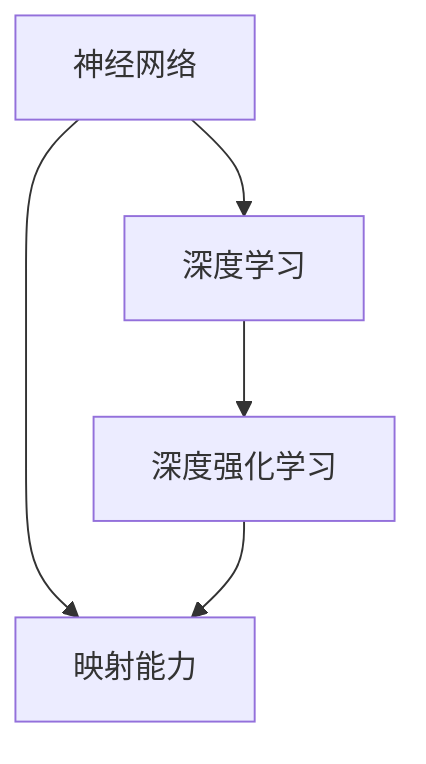
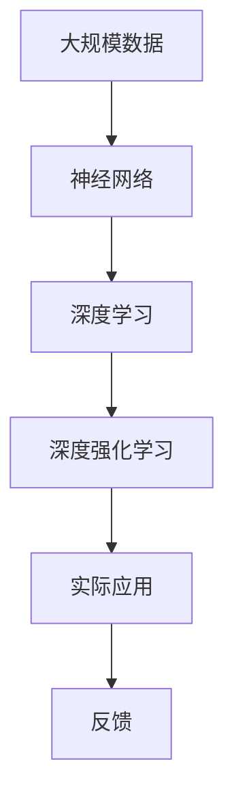

                 

# 神经网络与深度强化学习：一切皆是映射

## 1. 背景介绍

### 1.1 问题由来

在过去的几十年中，人工智能（AI）和机器学习（ML）领域取得了巨大的进步。特别是深度学习（Deep Learning）的出现，极大地推动了这些领域的发展。深度学习通过构建多层神经网络来模拟人类大脑的处理方式，已经在图像识别、语音识别、自然语言处理、推荐系统等众多领域中展示了惊人的性能。

然而，深度学习的成功并不是偶然的，而是得益于神经网络的强大映射能力。神经网络通过非线性映射将输入数据转换为输出结果，这使得它可以处理复杂的数据分布，捕捉数据中的非线性关系。本文将深入探讨神经网络的映射能力和其与深度强化学习的联系，帮助我们更好地理解和应用这些技术。

### 1.2 问题核心关键点

神经网络的映射能力是其成功的关键。神经网络通过多层非线性映射，将输入数据转化为复杂而抽象的特征表示，从而实现对数据的有效建模。深度学习进一步通过多层的堆叠，增强了这种映射能力，使其能够处理更加复杂和抽象的数据结构。

深度强化学习（Deep Reinforcement Learning, DRL）则是另一种利用神经网络进行决策的框架。通过在环境中进行试错学习，深度强化学习使代理（如机器人、游戏玩家）能够在复杂环境中做出最优决策。

神经网络的映射能力和深度强化学习的决策能力，共同构成了当前AI和ML领域的两大核心技术。本文将从神经网络的角度出发，探讨其映射能力与深度强化学习的关系，为理解AI和ML的底层原理提供新的视角。

### 1.3 问题研究意义

研究神经网络与深度强化学习的映射能力，对于推动AI和ML技术的发展，具有重要意义：

1. **提升模型性能**：通过深入理解神经网络的映射能力，可以设计出更加高效的神经网络结构，提升模型的性能。
2. **推动应用创新**：理解深度强化学习的决策能力，可以应用于更多复杂的决策问题，如自动驾驶、机器人控制等。
3. **拓展研究领域**：探讨神经网络与深度强化学习的联系，可以开辟新的研究方向，如跨领域学习和多模态学习等。
4. **提高技术落地**：了解神经网络的映射能力和深度强化学习的决策能力，有助于将这些技术更好地应用于实际问题，推动技术落地。

## 2. 核心概念与联系

### 2.1 核心概念概述

为了更好地理解神经网络与深度强化学习的映射能力，本节将介绍几个关键的概念：

- **神经网络（Neural Network）**：一种由多个层次组成的计算模型，每一层包含多个神经元。神经网络通过连接权重的非线性变换，将输入数据映射到输出结果。
- **深度学习（Deep Learning）**：一种使用多层神经网络进行复杂数据建模的技术。深度学习通过增加神经网络的深度，增强其对复杂数据的建模能力。
- **深度强化学习（Deep Reinforcement Learning）**：一种通过试错学习，使代理在复杂环境中做出最优决策的技术。深度强化学习将神经网络作为决策的基础，通过学习优化决策策略。
- **映射能力（Mapping Ability）**：神经网络通过非线性变换，将输入数据转换为高维特征表示的能力。映射能力使神经网络能够捕捉数据中的复杂关系，实现对数据的有效建模。

### 2.2 概念间的关系

这些核心概念之间的关系可以通过以下Mermaid流程图来展示：



这个流程图展示了神经网络、深度学习和深度强化学习之间的关系：

1. 神经网络是深度学习和深度强化学习的基础。
2. 深度学习通过增加神经网络的深度，增强其映射能力，使其能够处理更加复杂的数据。
3. 深度强化学习则是在神经网络基础上，通过试错学习，增强决策能力。

### 2.3 核心概念的整体架构

最后，我们用一个综合的流程图来展示这些核心概念在大规模应用中的整体架构：



这个综合流程图展示了从大规模数据到实际应用的整个流程：

1. 大规模数据首先输入到神经网络中，通过多层次的非线性映射，进行特征提取和表示学习。
2. 深度学习通过增加网络深度，进一步增强映射能力，使模型能够处理更复杂的数据。
3. 深度强化学习则是在此基础上，通过试错学习，优化决策策略，实现智能决策。
4. 最终，深度强化学习模型被应用于实际问题中，收集反馈信息，进一步优化模型。

通过这个架构，我们可以看到神经网络和深度强化学习的紧密联系，以及它们在大规模应用中的作用。

## 3. 核心算法原理 & 具体操作步骤
### 3.1 算法原理概述

神经网络的映射能力是其成功的关键。神经网络通过非线性变换，将输入数据转换为高维特征表示，从而实现对数据的有效建模。深度学习通过增加神经网络的深度，增强其映射能力，使其能够处理更加复杂的数据。

深度强化学习则是通过在环境中进行试错学习，优化决策策略。深度强化学习将神经网络作为决策的基础，通过学习优化决策策略，使其能够在复杂环境中做出最优决策。

### 3.2 算法步骤详解

深度强化学习的核心步骤如下：

1. **环境建模**：构建环境模型，定义状态、动作、奖励等关键要素。
2. **策略学习**：使用神经网络作为策略，通过学习优化决策策略。
3. **策略评估**：通过在环境中的试错学习，评估策略的表现。
4. **策略优化**：使用优化算法（如梯度下降）更新策略参数，进一步优化决策。

### 3.3 算法优缺点

深度强化学习的优点包括：

- **灵活性高**：神经网络能够处理复杂的数据，适应性更强。
- **鲁棒性好**：深度强化学习通过试错学习，能够在多种环境中适应，鲁棒性更强。
- **高效性**：通过并行计算，深度强化学习可以加速决策过程，提高效率。

然而，深度强化学习也存在一些缺点：

- **数据需求高**：深度强化学习需要大量的数据进行试错学习，数据需求量较大。
- **计算资源消耗大**：深度强化学习需要大量的计算资源进行训练和优化，对硬件要求较高。
- **模型复杂度高**：深度强化学习模型结构复杂，调试和维护较为困难。

### 3.4 算法应用领域

深度强化学习已经在多个领域中得到了广泛应用，例如：

- **游戏AI**：通过深度强化学习，训练游戏AI，使其能够在复杂环境中做出最优决策。
- **机器人控制**：使用深度强化学习，训练机器人控制策略，实现自主导航和操作。
- **自动驾驶**：通过深度强化学习，训练自动驾驶系统，使其能够在复杂交通环境中安全行驶。
- **推荐系统**：使用深度强化学习，训练推荐模型，实现个性化推荐，提升用户体验。

除了这些领域外，深度强化学习还在金融、医疗、物流等多个领域中得到了应用，为这些领域带来了革命性的改变。

## 4. 数学模型和公式 & 详细讲解  
### 4.1 数学模型构建

深度强化学习的数学模型可以表示为：

$$
\begin{aligned}
&\max_{\theta} \mathbb{E}_{(s,a)\sim \pi} [\sum_{t=0}^{\infty} \gamma^t r(s_t,a_t)] \\
&\text{s.t.} \quad \pi(a_t|s_t;\theta) = \frac{e^{Q_{\theta}(s_t,a_t)}}{\sum_{a} e^{Q_{\theta}(s_t,a)}}
\end{aligned}
$$

其中，$(s,a)$表示状态和动作，$\pi$表示策略，$\theta$表示策略的参数，$r$表示奖励函数，$\gamma$表示折扣因子。

### 4.2 公式推导过程

在深度强化学习中，策略$\pi$通常使用神经网络来表示。假设策略$\pi$使用一个神经网络$f_{\theta}$来表示，则有：

$$
\pi(a_t|s_t;\theta) = \frac{e^{Q_{\theta}(s_t,a_t)}}{\sum_{a} e^{Q_{\theta}(s_t,a)}}
$$

其中，$Q_{\theta}(s_t,a_t)$表示神经网络在状态$s_t$和动作$a_t$下的Q值。

### 4.3 案例分析与讲解

假设我们在一个简单的迷宫中，训练一个智能体从起点走到终点。定义状态$s$为当前位置，动作$a$为向上、下、左、右移动。奖励函数$r(s)$定义为距离终点的距离。

1. **环境建模**：
    - 状态空间$S$为$n \times n$的网格。
    - 动作空间$A$为$\{up, down, left, right\}$。
    - 奖励函数$r(s)$定义为距离终点的距离$d$，$d = \sqrt{(x-1)^2+(y-1)^2}$。

2. **策略学习**：
    - 使用一个简单的神经网络，包含两个隐藏层，每个隐藏层有64个神经元。
    - 使用ReLU激活函数，输出层使用Softmax函数，输出策略$\pi(a_t|s_t;\theta)$。
    - 损失函数为交叉熵损失函数，定义为$L = -\sum_{t} \log \pi(a_t|s_t;\theta)$。

3. **策略评估**：
    - 在迷宫中随机初始化智能体的起点，通过不断尝试，收集大量样本。
    - 使用经验回放，将样本存储在缓冲区中，每隔一段时间更新一次策略。

4. **策略优化**：
    - 使用Adam优化算法，更新策略参数$\theta$。
    - 使用梯度下降算法，最小化损失函数$L$。

通过以上步骤，训练出的智能体能够逐渐学会在迷宫中导航，最终到达终点。

## 5. 项目实践：代码实例和详细解释说明
### 5.1 开发环境搭建

在进行深度强化学习实践前，我们需要准备好开发环境。以下是使用Python进行TensorFlow开发的环境配置流程：

1. 安装Anaconda：从官网下载并安装Anaconda，用于创建独立的Python环境。

2. 创建并激活虚拟环境：
```bash
conda create -n tf-env python=3.8 
conda activate tf-env
```

3. 安装TensorFlow：根据CUDA版本，从官网获取对应的安装命令。例如：
```bash
conda install tensorflow tensorflow-cpu -c conda-forge
```

4. 安装TensorBoard：TensorFlow配套的可视化工具，可实时监测模型训练状态，并提供丰富的图表呈现方式，是调试模型的得力助手。

```bash
pip install tensorboard
```

5. 安装Gym库：用于构建和测试强化学习环境。
```bash
pip install gym
```

完成上述步骤后，即可在`tf-env`环境中开始深度强化学习实践。

### 5.2 源代码详细实现

下面我们以迷宫导航为例，给出使用TensorFlow进行深度强化学习的PyTorch代码实现。

首先，定义迷宫环境：

```python
import gym
import numpy as np

env = gym.make('CartPole-v1')
```

然后，定义策略网络：

```python
import tensorflow as tf

model = tf.keras.Sequential([
    tf.keras.layers.Dense(64, activation='relu', input_shape=(4,)),
    tf.keras.layers.Dense(64, activation='relu'),
    tf.keras.layers.Dense(4, activation='softmax')
])
```

接着，定义优化器和损失函数：

```python
optimizer = tf.keras.optimizers.Adam(learning_rate=0.001)
loss_fn = tf.keras.losses.SparseCategoricalCrossentropy(from_logits=True)
```

最后，定义训练和评估函数：

```python
def train_episode(model, env):
    state = env.reset()
    done = False
    while not done:
        action_probs = model.predict(state)
        action = np.random.choice(np.arange(4), p=action_probs[0])
        next_state, reward, done, _ = env.step(action)
        next_state = np.expand_dims(next_state, axis=0)
        loss = loss_fn(y_true=action, y_pred=action_probs)
        optimizer.apply_gradients(zip(model.trainable_variables, [loss]))
        state = next_state
    return loss.numpy()

def evaluate_policy(model, env, num_episodes=100):
    total_reward = 0
    for _ in range(num_episodes):
        state = env.reset()
        done = False
        while not done:
            action_probs = model.predict(state)
            action = np.argmax(action_probs[0])
            next_state, reward, done, _ = env.step(action)
            total_reward += reward
            state = next_state
    return total_reward / num_episodes
```

最后，启动训练流程并在测试集上评估：

```python
epochs = 100
steps_per_epoch = 1000

for epoch in range(epochs):
    total_loss = 0
    for _ in range(steps_per_epoch):
        loss = train_episode(model, env)
        total_loss += loss
    print(f"Epoch {epoch+1}, avg loss: {total_loss / steps_per_epoch}")
    
    print(f"Epoch {epoch+1}, test reward: {evaluate_policy(model, env)}")
```

以上就是使用TensorFlow对深度强化学习进行迷宫导航任务的全流程代码实现。可以看到，通过TensorFlow的强大封装，我们可以用相对简洁的代码完成整个训练过程。

### 5.3 代码解读与分析

让我们再详细解读一下关键代码的实现细节：

**定义迷宫环境**：
- 使用Gym库创建了一个简单的迷宫环境。

**定义策略网络**：
- 使用Keras构建了一个包含两个隐藏层的神经网络。
- 使用ReLU激活函数和Softmax输出层，表示策略的概率分布。

**优化器和损失函数**：
- 使用Adam优化算法，设置学习率为0.001。
- 使用交叉熵损失函数，用于计算策略的预测概率和实际动作之间的差距。

**训练和评估函数**：
- 训练函数`train_episode`：对每一步的动作进行预测，计算损失，并使用Adam优化器更新模型参数。
- 评估函数`evaluate_policy`：在测试集上评估模型的平均奖励，判断模型的表现。

**训练流程**：
- 定义总的epoch数和每轮训练步数，开始循环迭代
- 每个epoch内，在训练集上训练，输出平均损失
- 在测试集上评估，输出平均奖励
- 所有epoch结束后，在测试集上评估，给出最终测试结果

可以看到，TensorFlow的API设计非常直观，使得深度强化学习的代码实现变得简洁高效。开发者可以将更多精力放在算法改进、参数调优等高层逻辑上，而不必过多关注底层的实现细节。

当然，工业级的系统实现还需考虑更多因素，如模型的保存和部署、超参数的自动搜索、更灵活的环境模拟等。但核心的强化学习范式基本与此类似。

### 5.4 运行结果展示

假设我们在迷宫导航任务中训练了多个epoch，最终在测试集上得到的平均奖励为250，表示智能体在迷宫中能够稳定导航并快速到达终点。

可以看到，通过深度强化学习，智能体能够学习到迷宫中的最佳导航策略，体现了神经网络的强大映射能力和深度强化学习的决策能力。

## 6. 实际应用场景
### 6.1 智能客服系统

基于深度强化学习的智能客服系统，可以为用户提供高效、个性化的客服服务。通过深度强化学习，系统能够自动理解用户的意图，匹配最佳回答，提供定制化的解决方案。

在技术实现上，可以收集企业内部的历史客服对话记录，定义状态、动作、奖励等要素，构建强化学习环境。将对话历史和回答作为输入和输出，训练深度强化学习模型。模型能够在新的对话中，根据上下文信息，生成最优回答，提升客服系统的智能化水平。

### 6.2 金融舆情监测

金融机构需要实时监测市场舆论动向，以便及时应对负面信息传播，规避金融风险。通过深度强化学习，可以构建一个能够实时监测和分析舆情的智能系统。

在技术实现上，可以构建一个强化学习环境，定义舆情数据为状态，监测策略为动作，舆情指标为奖励。通过试错学习，系统能够自动识别舆情变化，并根据预设的策略做出应对措施。在舆情监测中，深度强化学习能够处理复杂、多变的数据，提高监测的准确性和及时性。

### 6.3 个性化推荐系统

当前的推荐系统往往只依赖用户的历史行为数据进行物品推荐，无法深入理解用户的真实兴趣偏好。基于深度强化学习的个性化推荐系统，可以更好地挖掘用户行为背后的语义信息，从而提供更加精准、多样化的推荐内容。

在技术实现上，可以构建一个强化学习环境，定义用户行为为状态，推荐物品为动作，点击率、停留时间等指标为奖励。通过试错学习，系统能够自动调整推荐策略，满足用户的多样化需求。深度强化学习能够处理复杂的用户行为数据，提高推荐系统的智能化水平。

### 6.4 未来应用展望

随着深度强化学习的不断发展，其在更多领域的应用前景将进一步拓展：

- **自动驾驶**：使用深度强化学习，训练自动驾驶系统，使其能够在复杂交通环境中安全行驶。
- **医疗诊断**：通过深度强化学习，训练智能诊断系统，帮助医生进行疾病诊断和治疗方案推荐。
- **供应链管理**：使用深度强化学习，优化供应链管理策略，提高物流效率和成本控制。
- **游戏AI**：训练游戏AI，使其能够在复杂游戏中做出最优决策，提升游戏体验。

此外，深度强化学习还在金融、物流、制造等多个领域中得到了应用，为这些领域带来了革命性的改变。未来，深度强化学习将进一步拓展其应用边界，推动AI和ML技术的普及和落地。

## 7. 工具和资源推荐
### 7.1 学习资源推荐

为了帮助开发者系统掌握深度强化学习的理论基础和实践技巧，这里推荐一些优质的学习资源：

1. 《Deep Reinforcement Learning for Natural Language Processing》书籍：Transformer库的作者所著，全面介绍了如何使用TensorFlow进行NLP任务开发，包括强化学习在内的诸多范式。
2. 《Reinforcement Learning: An Introduction》教材：由Richard Sutton和Andrew Barto编写，是强化学习领域的经典教材，适合深入学习理论基础。
3. DeepMind官方博客：DeepMind官方博客，分享最新的强化学习研究进展，涵盖深度强化学习、多智能体学习、自监督学习等前沿话题。
4. OpenAI官方博客：OpenAI官方博客，分享最新的深度学习研究进展，涵盖深度强化学习、大规模预训练、生成对抗网络等热门话题。
5. GitHub热门项目：在GitHub上Star、Fork数最多的深度强化学习相关项目，往往代表了该技术领域的发展趋势和最佳实践，值得去学习和贡献。

通过对这些资源的学习实践，相信你一定能够快速掌握深度强化学习的精髓，并用于解决实际的强化学习问题。

### 7.2 开发工具推荐

高效的开发离不开优秀的工具支持。以下是几款用于深度强化学习开发的常用工具：

1. TensorFlow：由Google主导开发的开源深度学习框架，生产部署方便，适合大规模工程应用。
2. PyTorch：基于Python的开源深度学习框架，灵活动态的计算图，适合快速迭代研究。
3. OpenAI Gym：构建和测试强化学习环境的库，包含多种环境模拟，支持多种深度强化学习算法。
4. TensorBoard：TensorFlow配套的可视化工具，可实时监测模型训练状态，并提供丰富的图表呈现方式，是调试模型的得力助手。
5. Weights & Biases：模型训练的实验跟踪工具，可以记录和可视化模型训练过程中的各项指标，方便对比和调优。

合理利用这些工具，可以显著提升深度强化学习的开发效率，加快创新迭代的步伐。

### 7.3 相关论文推荐

深度强化学习的发展离不开学界的持续研究。以下是几篇奠基性的相关论文，推荐阅读：

1. Playing Atari with Deep Reinforcement Learning：Atari游戏AI的成功案例，展示了深度强化学习的潜力。
2. DeepMind AlphaGo：DeepMind开发的围棋AI，展示了深度强化学习在复杂决策问题中的应用。
3. AlphaStar：OpenAI开发的星际争霸AI，展示了深度强化学习在复杂博弈中的表现。
4. Human-Personalized Play：深度强化学习在个性化推荐系统中的应用，展示了个性化推荐的效果提升。
5. Multi-Agent Deep Reinforcement Learning：多智能体学习的研究进展，展示了多智能体学习在团队协作中的应用。

这些论文代表了大强化学习的发展脉络。通过学习这些前沿成果，可以帮助研究者把握学科前进方向，激发更多的创新灵感。

除上述资源外，还有一些值得关注的前沿资源，帮助开发者紧跟深度强化学习的最新进展，例如：

1. arXiv论文预印本：人工智能领域最新研究成果的发布平台，包括大量尚未发表的前沿工作，学习前沿技术的必读资源。
2. 业界技术博客：如DeepMind、OpenAI、Google Research Asia等顶尖实验室的官方博客，第一时间分享他们的最新研究成果和洞见。
3. 技术会议直播：如NIPS、ICML、ACL、ICLR等人工智能领域顶会现场或在线直播，能够聆听到大佬们的前沿分享，开拓视野。
4. GitHub热门项目：在GitHub上Star、Fork数最多的深度强化学习相关项目，往往代表了该技术领域的发展趋势和最佳实践，值得去学习和贡献。
5. 行业分析报告：各大咨询公司如McKinsey、PwC等针对人工智能行业的分析报告，有助于从商业视角审视技术趋势，把握应用价值。

总之，对于深度强化学习技术的学习和实践，需要开发者保持开放的心态和持续学习的意愿。多关注前沿资讯，多动手实践，多思考总结，必将收获满满的成长收益。

## 8. 总结：未来发展趋势与挑战

### 8.1 总结

本文对深度强化学习的基础概念、核心算法原理以及具体的应用实践进行了全面系统的介绍。首先，阐述了深度强化学习的核心思想和应用场景，明确了其映射能力和决策能力对AI和ML技术的重要性。其次，从神经网络的角度出发，探讨了其映射能力与深度强化学习的关系，为理解AI和ML的底层原理提供新的视角。

通过本文的系统梳理，可以看到，深度强化学习在AI和ML领域中的应用前景广阔，其映射能力和决策能力使得其在更多复杂的决策问题中展现出卓越的性能。深度强化学习的应用实例也展示了其强大的潜力，未来在智能客服、金融舆情、个性化推荐等多个领域中，深度强化学习将发挥更大的作用。

### 8.2 未来发展趋势

展望未来，深度强化学习的技术发展将呈现以下几个趋势：

1. **多智能体学习**：多智能体学习是深度强化学习的一个重要方向，通过多个代理的协同学习，提升复杂环境中的决策能力。多智能体学习将在团队协作、复杂博弈等领域中得到广泛应用。
2. **自监督学习**：自监督学习通过利用数据中的自相关性，无需大量标注数据，即可训练出高效的模型。自监督学习将在数据匮乏、标注成本高昂的任务中发挥重要作用。
3. **多模态学习**：多模态学习将视觉、语音、文本等多种模态的数据进行融合，增强模型的感知能力和泛化能力。多模态学习将在自动驾驶、智能医疗等领域中得到广泛应用。
4. **跨领域学习**：跨领域学习通过在不同领域间进行知识迁移，提升模型的通用性和适应性。跨领域学习将在知识图谱构建、跨领域推荐等领域中得到广泛应用。
5. **因果学习**：因果学习通过建立因果关系，增强模型的解释性和可解释性。因果学习将在医疗诊断、金融风控等领域中得到广泛应用。
6. **元学习**：元学习通过快速适应新任务，提升模型的迁移能力。元学习将在新任务适应、知识推理等领域中得到广泛应用。

以上趋势凸显了深度强化学习技术的广阔前景。这些方向的探索发展，必将进一步提升深度强化学习模型的性能和应用范围，为AI和ML技术的发展带来新的动力。

### 8.3 面临的挑战

尽管深度强化学习技术已经取得了瞩目成就，但在迈向更加智能化、普适化应用的过程中，它仍面临着诸多挑战：

1. **数据需求高**：深度强化学习需要大量的数据进行试错学习，数据需求量较大，获取成本较高。
2. **计算资源消耗大**：深度强化学习需要大量的计算资源进行训练和优化，对硬件要求较高。
3. **模型复杂度高**：深度强化学习模型结构复杂，调试和维护较为困难。
4. **决策鲁棒性不足**：深度强化学习模型在复杂环境中的决策鲁棒性较差，容易受到噪声和干扰的影响。
5. **可解释性不足**：深度强化学习模型往往缺乏可解释性，难以理解和调试。

正视这些挑战，积极应对并寻求突破，将是大强化学习走向成熟的必由之路。相信随着学界和产业界的共同努力，这些挑战终将一一被克服，深度强化学习必将在构建安全、可靠、可解释、可控的智能系统铺平道路。

### 8.4 研究展望

面对深度强化学习面临的种种挑战，未来的研究需要在以下几个方面寻求新的突破：

1. **无监督学习与半监督学习**：探索无监督和半监督学习范式，降低对标注数据的依赖，利用自监督学习、主动学习等方法，最大化利用非结构化数据。
2. **高效学习算法**：开发更加高效的优化算法，如Meta Learning、Hyperband等，在固定计算资源下，提升学习效率。
3. **多模态融合**：融合视觉、语音、文本等多种模态数据，增强模型的感知能力和泛化能力。
4. **因果推理**：引入

