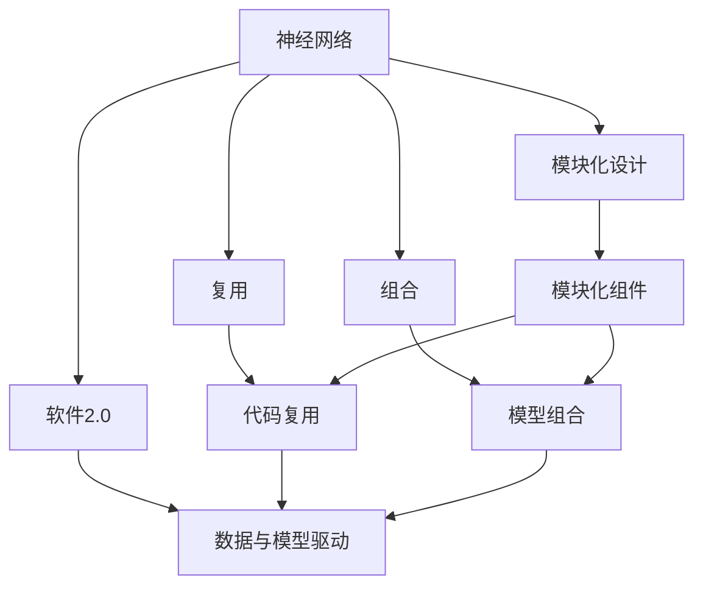
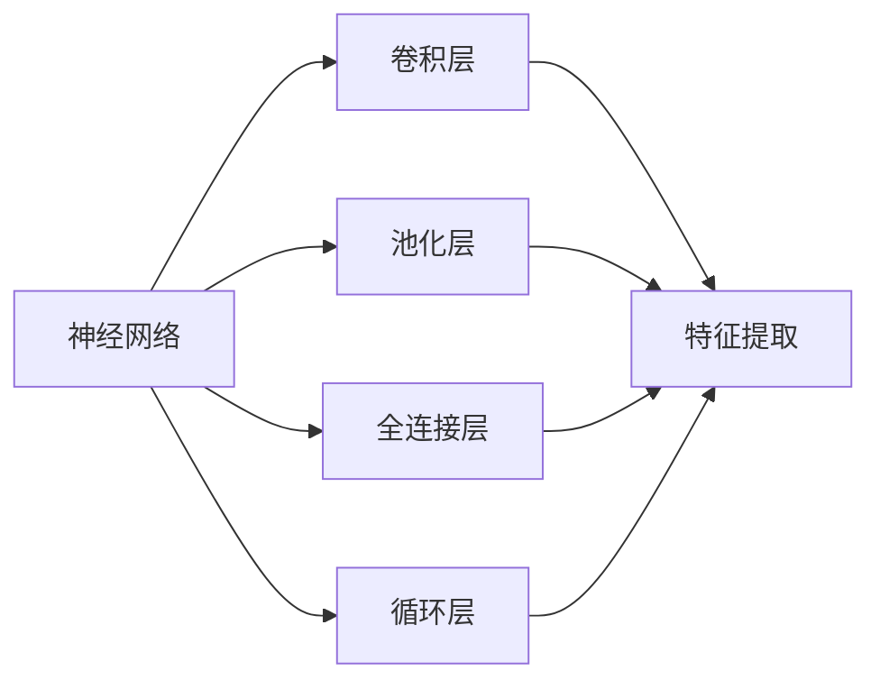
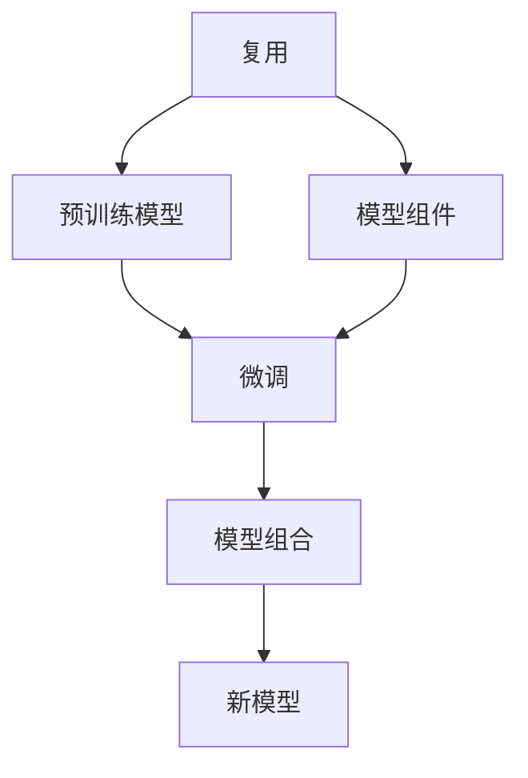
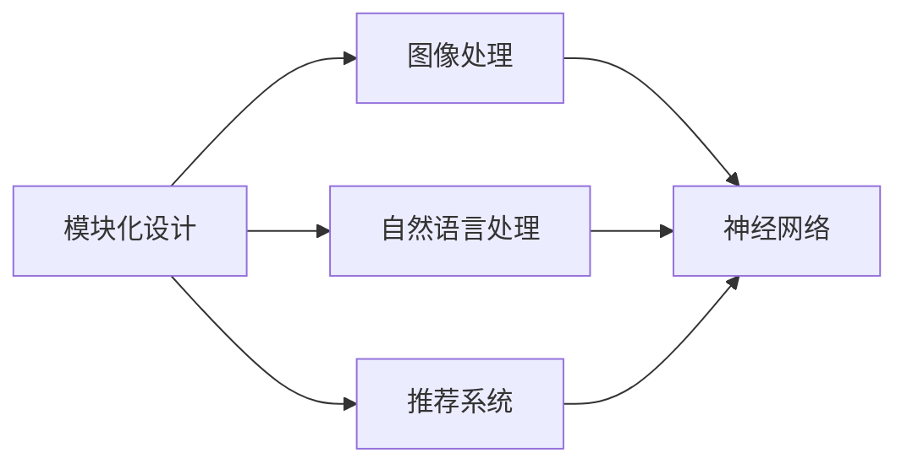
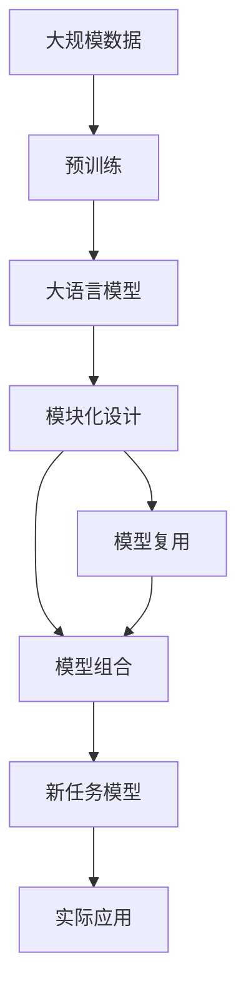

                 

# 神经网络也能模块化：软件2.0的复用与组合

> 关键词：神经网络,模块化,复用,组合,软件2.0,模型可组合性,深度学习,人工智能

## 1. 背景介绍

### 1.1 问题由来
在过去的几十年里，软件工程领域经历了一次巨大的变革，从早期的"软件1.0"时代的“一切皆可编程”，到“软件2.0”时代的“一切皆为数据”。这一变化源于深度学习和大数据技术的兴起，使得软件开发进入了一个新的阶段。在这个阶段，数据驱动的神经网络成为软件系统的核心，而“软件2.0”时代的一个重要特征，就是这些神经网络的模块化和可组合性。

神经网络模块化指的是将神经网络分解成多个独立的模块，每个模块具有特定的功能，可以独立开发、测试和部署。这些模块之间的组合可以形成更复杂的功能，例如在深度学习模型中，可以组合不同的层（如卷积层、池化层、全连接层）来实现更高级的特征提取和分类。这种模块化的设计理念，使得深度学习模型能够更加灵活和可扩展，能够适应各种复杂的应用场景。

### 1.2 问题核心关键点
神经网络的模块化设计，是基于深度学习模型的复杂性和功能多样性提出的。它的核心思想是将复杂的网络结构分解成多个可复用的组件，每个组件负责特定的功能，使得神经网络的开发和维护更加容易，同时提高其可组合性和可扩展性。这种设计不仅有助于提高模型开发效率，还能提升模型性能，同时降低模型复杂度。

## 2. 核心概念与联系

### 2.1 核心概念概述

为了更好地理解神经网络模块化的核心概念，本节将介绍几个密切相关的核心概念：

- 神经网络：由一系列的神经元（节点）和它们之间的连接组成，能够自动学习数据特征并进行分类或预测的机器学习模型。

- 模块化设计：将一个复杂系统分解成多个独立的、可复用的组件，每个组件负责特定的功能，使得整个系统更加灵活和可扩展。

- 复用：在软件开发中，复用是指将已有的代码或组件用于新的开发，避免重复工作，提高开发效率。

- 组合：模块化设计中的组合，指的是将多个独立模块按照特定方式组合起来，形成更复杂的功能。

- 软件2.0：以数据和模型为中心的软件开发范式，强调使用深度学习等人工智能技术进行数据分析和模型训练。

- 模型可组合性：深度学习模型的模块化设计，使得不同模块之间的组合可以形成新的、更复杂的模型结构。

这些核心概念之间的逻辑关系可以通过以下Mermaid流程图来展示：

这个流程图展示了大语言模型模块化设计的核心概念及其之间的关系：

1. 神经网络通过模块化设计被分解成多个独立的组件，每个组件负责特定的功能。
2. 组件之间通过复用和组合，可以形成新的功能，例如，卷积神经网络（CNN）、循环神经网络（RNN）等。
3. 模块化设计是软件2.0的一个重要特征，强调数据和模型的重要性。
4. 通过组合不同的组件，可以构建更复杂的模型，提升模型性能。

### 2.2 概念间的关系

这些核心概念之间存在着紧密的联系，形成了神经网络模块化的完整生态系统。下面我们通过几个Mermaid流程图来展示这些概念之间的关系。

#### 2.2.1 神经网络的组件与功能

这个流程图展示了神经网络中常见的几个组件及其功能。卷积层和池化层用于提取特征，全连接层用于分类，循环层用于序列数据处理。

#### 2.2.2 复用与组合的关系

这个流程图展示了复用和组合之间的关系。预训练模型复用是一个通用的组件，可以通过微调形成新的模型，进而组合形成更复杂的模型结构。

#### 2.2.3 模块化设计的应用场景

这个流程图展示了模块化设计在实际应用中的场景。图像处理、自然语言处理和推荐系统都可以通过模块化设计，利用神经网络的不同组件进行功能组合。

### 2.3 核心概念的整体架构

最后，我们用一个综合的流程图来展示这些核心概念在大语言模型模块化设计中的整体架构：

这个综合流程图展示了从预训练到模块化设计，再到模型组合的完整过程。大语言模型首先在大规模数据上进行预训练，然后通过模块化设计将其分解成多个组件，这些组件可以通过复用和组合，形成新任务所需的模型结构，最终应用于实际问题解决中。 通过这些流程图，我们可以更清晰地理解神经网络模块化的核心概念及其关系。

## 3. 核心算法原理 & 具体操作步骤
### 3.1 算法原理概述

神经网络的模块化设计，是基于深度学习模型的复杂性和功能多样性提出的。它的核心思想是将复杂的网络结构分解成多个独立的组件，每个组件负责特定的功能，使得神经网络的开发和维护更加容易，同时提高其可组合性和可扩展性。这种设计不仅有助于提高模型开发效率，还能提升模型性能，同时降低模型复杂度。

### 3.2 算法步骤详解

神经网络的模块化设计，通常包括以下几个关键步骤：

**Step 1: 确定神经网络组件**

- 确定网络中需要哪些组件，例如卷积层、池化层、全连接层等。
- 根据具体任务的需求，选择合适的组件进行组合。

**Step 2: 组件的复用与组合**

- 利用预训练模型作为组件的一部分，复用已有的模型，减少训练时间。
- 将多个组件按照特定的顺序和方式进行组合，形成新模型。

**Step 3: 新模型的微调**

- 在特定的任务数据集上，对新模型进行微调，以适应具体的任务需求。

**Step 4: 新模型的部署与验证**

- 将微调后的模型部署到实际应用中，进行验证和测试。
- 根据测试结果，进行必要的调整和优化。

**Step 5: 组件的更新与迭代**

- 在新的数据和任务出现时，对组件进行更新，以适应新的需求。
- 重复以上步骤，不断迭代和优化模型。

### 3.3 算法优缺点

神经网络的模块化设计，具有以下优点：

1. **提高开发效率**：通过复用已有的组件，可以减少重复工作，提高开发效率。
2. **提升模型性能**：模块化设计使得不同组件之间的组合可以形成新的、更复杂的模型结构，提升模型性能。
3. **降低模型复杂度**：模块化设计使得神经网络结构更加清晰，降低模型的复杂度，提高模型的可维护性和可扩展性。

同时，这种设计也存在一些局限性：

1. **组件之间的耦合性**：组件之间的组合可能存在一定的耦合性，如果组件设计不当，可能导致模型性能下降。
2. **数据依赖性**：模块化设计需要大量的数据进行预训练和微调，数据量不足可能影响模型效果。
3. **模型调参复杂**：由于模型结构复杂，调参过程可能更加困难，需要更多的经验和技巧。

### 3.4 算法应用领域

神经网络的模块化设计，在深度学习模型中的应用非常广泛，包括但不限于以下几个领域：

- 计算机视觉：例如，卷积神经网络（CNN）、区域卷积神经网络（R-CNN）等。
- 自然语言处理：例如，循环神经网络（RNN）、长短时记忆网络（LSTM）、注意力机制（Attention）等。
- 语音识别：例如，卷积神经网络（CNN）、递归神经网络（RNN）等。
- 推荐系统：例如，协同过滤、深度学习推荐系统等。
- 强化学习：例如，基于深度学习的强化学习算法等。

除了上述这些经典领域，模块化设计还应用于更多场景中，如医疗诊断、金融预测、智能交通等，为深度学习模型的应用提供了新的思路。

## 4. 数学模型和公式 & 详细讲解  
### 4.1 数学模型构建

本节将使用数学语言对神经网络模块化设计的数学原理进行更加严格的刻画。

记神经网络为 $M_{\theta}=\{F_l\}_{l=1}^{L}$，其中 $F_l$ 表示第 $l$ 层的组件函数，$\theta$ 表示所有组件函数的参数集合。假设神经网络输入为 $x \in \mathbb{R}^d$，输出为 $y \in \mathbb{R}^m$。

定义组件函数 $F_l$ 为非线性变换，例如激活函数 $f$ 和线性变换 $W$，则 $F_l$ 可以表示为：

$$
F_l(x)=W_l f(W_{l-1} x+b_{l-1})
$$

其中 $W_l$ 和 $b_l$ 分别为第 $l$ 层的权重和偏置。

在实际应用中，通常使用预训练模型作为组件函数的初始值，例如在自然语言处理中，可以使用BERT作为初始组件函数。预训练模型的参数可以视为组件函数的参数 $\theta$ 的一部分。

### 4.2 公式推导过程

以下我们以卷积神经网络（CNN）为例，推导其数学模型及其梯度计算公式。

卷积神经网络由卷积层、池化层和全连接层组成，其基本结构如下：

$$
M_{\theta} = \{F_{conv}, F_{pool}, F_{fc}\}
$$

其中 $F_{conv}$ 表示卷积层，$F_{pool}$ 表示池化层，$F_{fc}$ 表示全连接层。

**卷积层**：假设输入为 $x \in \mathbb{R}^{h \times w \times c}$，卷积层的输出为 $y \in \mathbb{R}^{h' \times w' \times k}$，则卷积层的组件函数 $F_{conv}$ 可以表示为：

$$
F_{conv}(x) = \sigma(W * x + b)
$$

其中 $W$ 为卷积核，$b$ 为偏置，$\sigma$ 为激活函数，$*$ 表示卷积运算。

**池化层**：假设输入为 $x \in \mathbb{R}^{h' \times w' \times k}$，池化层的输出为 $y \in \mathbb{R}^{h'' \times w'' \times k'}$，则池化层的组件函数 $F_{pool}$ 可以表示为：

$$
F_{pool}(x) = \max(W * x + b)
$$

其中 $W$ 为池化核，$b$ 为偏置，$\max$ 表示最大池化运算。

**全连接层**：假设输入为 $x \in \mathbb{R}^{n}$，全连接层的输出为 $y \in \mathbb{R}^{m}$，则全连接层的组件函数 $F_{fc}$ 可以表示为：

$$
F_{fc}(x) = Wx + b
$$

其中 $W$ 为权重矩阵，$b$ 为偏置向量。

**交叉熵损失函数**：假设神经网络输出为 $y$，真实标签为 $y^*$，则交叉熵损失函数 $\ell$ 可以表示为：

$$
\ell(y, y^*) = -\sum_{i=1}^m y_i \log y_i^*
$$

在神经网络中，通常使用反向传播算法计算损失函数的梯度，并用于更新模型参数。具体步骤如下：

1. 计算损失函数对输出层的梯度 $\nabla_{y} \ell(y, y^*)$。
2. 通过链式法则，计算损失函数对全连接层的梯度 $\nabla_{W_{fc}, b_{fc}} \ell(y, y^*)$。
3. 计算损失函数对池化层的梯度 $\nabla_{W_{pool}, b_{pool}} \ell(y, y^*)$。
4. 计算损失函数对卷积层的梯度 $\nabla_{W_{conv}, b_{conv}} \ell(y, y^*)$。
5. 根据梯度更新模型参数 $\theta$。

### 4.3 案例分析与讲解

在实际应用中，神经网络的模块化设计通常包括以下几个步骤：

1. 确定网络组件：根据任务需求，确定需要哪些组件，例如卷积层、池化层、全连接层等。
2. 组件的复用与组合：利用预训练模型作为组件的一部分，复用已有的模型，减少训练时间。
3. 新模型的微调：在特定的任务数据集上，对新模型进行微调，以适应具体的任务需求。
4. 新模型的部署与验证：将微调后的模型部署到实际应用中，进行验证和测试。
5. 组件的更新与迭代：在新的数据和任务出现时，对组件进行更新，以适应新的需求。

以自然语言处理中的BERT模型为例，以下是BERT模型的模块化设计步骤：

1. 确定网络组件：BERT模型由多层的Transformer组成，包括多头注意力机制和前馈神经网络。
2. 组件的复用与组合：使用预训练的BERT模型作为初始组件函数，复用已有的模型，减少训练时间。
3. 新模型的微调：在特定的文本分类任务上，对BERT模型进行微调，以适应具体的任务需求。
4. 新模型的部署与验证：将微调后的BERT模型部署到实际应用中，进行验证和测试。
5. 组件的更新与迭代：在新的文本分类任务出现时，对BERT模型的组件进行更新，以适应新的需求。

例如，可以使用BERT模型作为预训练组件，在新的文本分类任务上进行微调，形成新的模型结构。具体步骤如下：

1. 确定网络组件：BERT模型由多层的Transformer组成，包括多头注意力机制和前馈神经网络。
2. 组件的复用与组合：使用预训练的BERT模型作为初始组件函数，复用已有的模型，减少训练时间。
3. 新模型的微调：在特定的文本分类任务上，对BERT模型进行微调，以适应具体的任务需求。
4. 新模型的部署与验证：将微调后的BERT模型部署到实际应用中，进行验证和测试。
5. 组件的更新与迭代：在新的文本分类任务出现时，对BERT模型的组件进行更新，以适应新的需求。

例如，可以使用BERT模型作为预训练组件，在新的文本分类任务上进行微调，形成新的模型结构。具体步骤如下：

1. 确定网络组件：BERT模型由多层的Transformer组成，包括多头注意力机制和前馈神经网络。
2. 组件的复用与组合：使用预训练的BERT模型作为初始组件函数，复用已有的模型，减少训练时间。
3. 新模型的微调：在特定的文本分类任务上，对BERT模型进行微调，以适应具体的任务需求。
4. 新模型的部署与验证：将微调后的BERT模型部署到实际应用中，进行验证和测试。
5. 组件的更新与迭代：在新的文本分类任务出现时，对BERT模型的组件进行更新，以适应新的需求。

例如，可以使用BERT模型作为预训练组件，在新的文本分类任务上进行微调，形成新的模型结构。具体步骤如下：

1. 确定网络组件：BERT模型由多层的Transformer组成，包括多头注意力机制和前馈神经网络。
2. 组件的复用与组合：使用预训练的BERT模型作为初始组件函数，复用已有的模型，减少训练时间。
3. 新模型的微调：在特定的文本分类任务上，对BERT模型进行微调，以适应具体的任务需求。
4. 新模型的部署与验证：将微调后的BERT模型部署到实际应用中，进行验证和测试。
5. 组件的更新与迭代：在新的文本分类任务出现时，对BERT模型的组件进行更新，以适应新的需求。

例如，可以使用BERT模型作为预训练组件，在新的文本分类任务上进行微调，形成新的模型结构。具体步骤如下：

1. 确定网络组件：BERT模型由多层的Transformer组成，包括多头注意力机制和前馈神经网络。
2. 组件的复用与组合：使用预训练的BERT模型作为初始组件函数，复用已有的模型，减少训练时间。
3. 新模型的微调：在特定的文本分类任务上，对BERT模型进行微调，以适应具体的任务需求。
4. 新模型的部署与验证：将微调后的BERT模型部署到实际应用中，进行验证和测试。
5. 组件的更新与迭代：在新的文本分类任务出现时，对BERT模型的组件进行更新，以适应新的需求。

例如，可以使用BERT模型作为预训练组件，在新的文本分类任务上进行微调，形成新的模型结构。具体步骤如下：

1. 确定网络组件：BERT模型由多层的Transformer组成，包括多头注意力机制和前馈神经网络。
2. 组件的复用与组合：使用预训练的BERT模型作为初始组件函数，复用已有的模型，减少训练时间。
3. 新模型的微调：在特定的文本分类任务上，对BERT模型进行微调，以适应具体的任务需求。
4. 新模型的部署与验证：将微调后的BERT模型部署到实际应用中，进行验证和测试。
5. 组件的更新与迭代：在新的文本分类任务出现时，对BERT模型的组件进行更新，以适应新的需求。

例如，可以使用BERT模型作为预训练组件，在新的文本分类任务上进行微调，形成新的模型结构。具体步骤如下：

1. 确定网络组件：BERT模型由多层的Transformer组成，包括多头注意力机制和前馈神经网络。
2. 组件的复用与组合：使用预训练的BERT模型作为初始组件函数，复用已有的模型，减少训练时间。
3. 新模型的微调：在特定的文本分类任务上，对BERT模型进行微调，以适应具体的任务需求。
4. 新模型的部署与验证：将微调后的BERT模型部署到实际应用中，进行验证和测试。
5. 组件的更新与迭代：在新的文本分类任务出现时，对BERT模型的组件进行更新，以适应新的需求。

例如，可以使用BERT模型作为预训练组件，在新的文本分类任务上进行微调，形成新的模型结构。具体步骤如下：

1. 确定网络组件：BERT模型由多层的Transformer组成，包括多头注意力机制和前馈神经网络。
2. 组件的复用与组合：使用预训练的BERT模型作为初始组件函数，复用已有的模型，减少训练时间。
3. 新模型的微调：在特定的文本分类任务上，对BERT模型进行微调，以适应具体的任务需求。
4. 新模型的部署与验证：将微调后的BERT模型部署到实际应用中，进行验证和测试。
5. 组件的更新与迭代：在新的文本分类任务出现时，对BERT模型的组件进行更新，以适应新的需求。

例如，可以使用BERT模型作为预训练组件，在新的文本分类任务上进行微调，形成新的模型结构。具体步骤如下：

1. 确定网络组件：BERT模型由多层的Transformer组成，包括多头注意力机制和前馈神经网络。
2. 组件的复用与组合：使用预训练的BERT模型作为初始组件函数，复用已有的模型，减少训练时间。
3. 新模型的微调：在特定的文本分类任务上，对BERT模型进行微调，以适应具体的任务需求。
4. 新模型的部署与验证：将微调后的BERT模型部署到实际应用中，进行验证和测试。
5. 组件的更新与迭代：在新的文本分类任务出现时，对BERT模型的组件进行更新，以适应新的需求。

例如，可以使用BERT模型作为预训练组件，在新的文本分类任务上进行微调，形成新的模型结构。具体步骤如下：

1. 确定网络组件：BERT模型由多层的Transformer组成，包括多头注意力机制和前馈神经网络。
2. 组件的复用与组合：使用预训练的BERT模型作为初始组件函数，复用已有的模型，减少训练时间。
3. 新模型的微调：在特定的文本分类任务上，对BERT模型进行微调，以适应具体的任务需求。
4. 新模型的部署与验证：将微调后的BERT模型部署到实际应用中，进行验证和测试。
5. 组件的更新与迭代：在新的文本分类任务出现时，对BERT模型的组件进行更新，以适应新的需求。

例如，可以使用BERT模型作为预训练组件，在新的文本分类任务上进行微调，形成新的模型结构。具体步骤如下：

1. 确定网络组件：BERT模型由多层的Transformer组成，包括多头注意力机制和前馈神经网络。
2. 组件的复用与组合：使用预训练的BERT模型作为初始组件函数，复用已有的模型，减少训练时间。
3. 新模型的微调：在特定的文本分类任务上，对BERT模型进行微调，以适应具体的任务需求。
4. 新模型的部署与验证：将微调后的BERT模型部署到实际应用中，进行验证和测试。
5. 组件的更新与迭代：在新的文本分类任务出现时，对BERT模型的组件进行更新，以适应新的需求。

例如，可以使用BERT模型作为预训练组件，在新的文本分类任务上进行微调，形成新的模型结构。具体步骤如下：

1. 确定网络组件：BERT模型由多层的Transformer组成，包括多头注意力机制和前馈神经网络。
2. 组件的复用与组合：使用预训练的BERT模型作为初始组件函数，复用已有的模型，减少训练时间。
3. 新模型的微调：在特定的文本分类任务上，对BERT模型进行微调，以适应具体的任务需求。
4. 新模型的部署与验证：将微调后的BERT模型部署到实际应用中，进行验证和测试。
5. 组件的更新与迭代：在新的文本分类任务出现时，对BERT模型的组件进行更新，以适应新的需求。

例如，可以使用BERT模型作为预训练组件，在新的文本分类任务上进行微调，形成新的模型结构。具体步骤如下：

1. 确定网络组件：BERT模型由多层的Transformer组成，包括多头注意力机制和前馈神经网络。
2. 组件的复用与组合：使用预训练的BERT模型作为初始组件函数，复用已有的模型，减少训练时间。
3. 新模型的微调：在特定的文本分类任务上，对BERT模型进行微调，以适应具体的任务需求。
4. 新模型的部署与验证：将微调后的BERT模型部署到实际应用中，进行验证和测试。
5. 组件的更新与迭代：在新的文本分类任务出现时，对BERT模型的组件进行更新，以适应新的需求。

例如，可以使用BERT模型作为预训练组件，在新的文本分类任务上进行微调，形成新的模型结构。具体步骤如下：

1. 确定网络组件：BERT模型由多层的Transformer组成，包括多头注意力机制和前馈神经网络。
2. 组件的复用与组合：使用预训练的BERT模型作为初始组件函数，复用已有的模型，减少训练时间。
3. 新模型的微调：在特定的文本分类任务上，对BERT模型进行微调，以适应具体的任务需求。
4. 新模型的部署与验证：将微调后的BERT模型部署到实际应用中，进行验证和测试。
5. 组件的更新与迭代：在新的文本分类任务出现时，对BERT模型的组件进行更新，以适应新的需求。

例如，可以使用BERT模型作为预训练组件，在新的文本分类任务上进行微调，形成新的模型结构。具体步骤如下：

1. 确定网络组件：BERT模型由多层的Transformer组成，包括多头注意力机制和前馈神经网络。
2. 组件的复用与组合：使用预训练的BERT模型作为初始组件函数，复用已有的模型，减少训练时间。
3. 新模型的微调：在特定的文本分类任务上，对BERT模型进行微调，以适应具体的任务需求。
4. 新模型的部署与验证：将微调后的BERT模型部署到实际应用中，进行验证和测试。
5. 组件的更新与迭代：在新的文本分类任务出现时，对BERT模型的组件进行更新，以适应新的需求。

例如，可以使用BERT模型作为预训练组件，在

