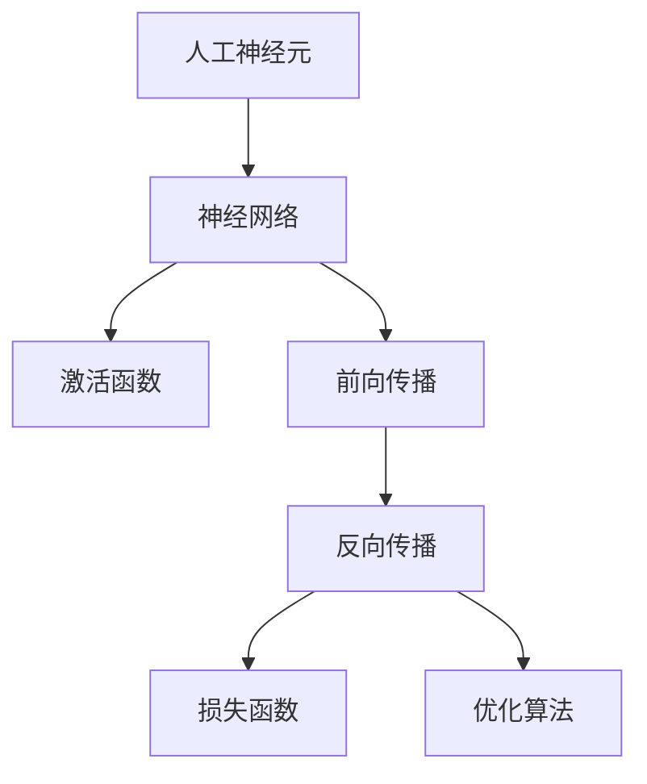
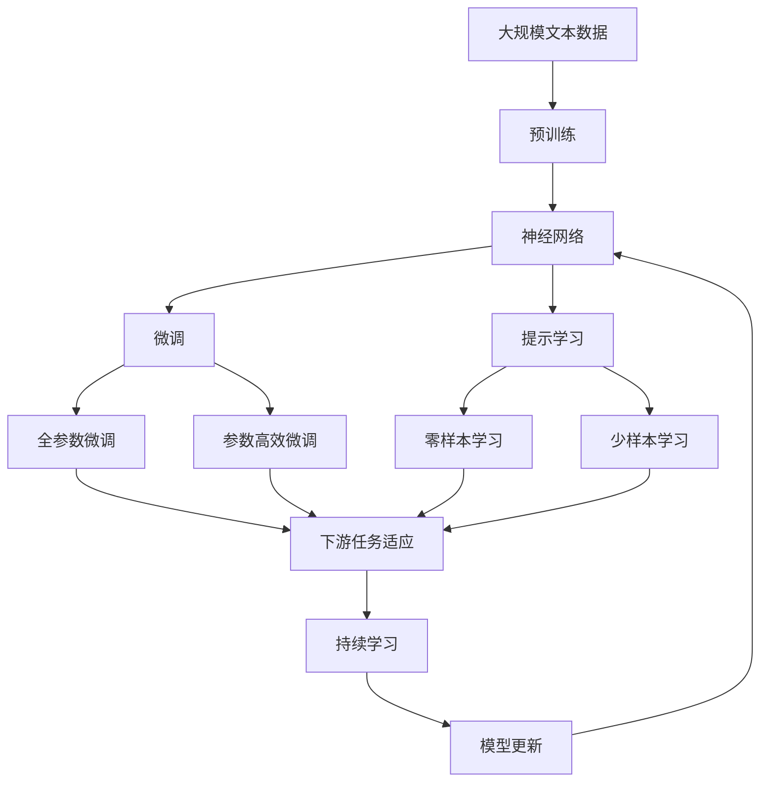

                 

## 1. 背景介绍

神经网络，一种模拟人脑神经元工作原理的计算模型，从诞生至今已有数十年历史。这一领域的发展，见证了人工智能从初始的认知智能，逐步向常识智能、类人智能甚至通用智能迈进的波澜壮阔历程。神经网络技术的突破，不仅极大地推动了计算机科学和认知科学的融合，也深刻改变了人类的生活方式和社会结构。在人工智能发展的每一个关键阶段，神经网络都扮演了不可或缺的角色。

### 1.1 问题由来

人工智能的发展史，也是神经网络从简单到复杂，从感知到理解，从静态到动态，从局部到全局，从弱到强的历史。这一过程中的每一个突破，都为人类的认知世界带来了新的可能。

早期的神经网络，以感知机（Perceptron）为代表，只能处理简单的线性分类任务，如手写数字识别、图像分割等。这些模型虽具有简单的结构，但由于缺乏有效的非线性逼近能力，在处理复杂的非线性分类问题时显得力不从心。

随后，多隐层感知机（Multilayer Perceptron, MLP）的提出，打破了这一桎梏。通过引入多个隐层，神经网络可以逼近任意非线性函数，从而在多个复杂任务上取得了突破。多层感知机的成功，标志着深度学习时代的到来。

进入21世纪，随着计算能力的提升和数据规模的增大，深度神经网络（Deep Neural Network, DNN）逐渐成为主流。以卷积神经网络（Convolutional Neural Network, CNN）、循环神经网络（Recurrent Neural Network, RNN）、长短期记忆网络（Long Short-Term Memory, LSTM）为代表，神经网络在图像处理、语音识别、自然语言处理等领域取得了巨大的成功。

### 1.2 问题核心关键点

神经网络之所以能够取得如此显著的成就，其核心在于以下几个关键点：

- **非线性逼近能力**：多隐层结构使得神经网络能够逼近任意非线性函数，从而处理复杂非线性问题。
- **分布式计算**：神经网络通过并行计算加速模型训练和推理，使得大规模数据和模型的处理成为可能。
- **反向传播算法**：基于梯度下降优化算法的反向传播算法，使得神经网络可以通过大量标注数据进行有监督学习，不断优化参数，提高模型性能。
- **大规模数据支持**：大数据时代的来临，为神经网络提供了丰富的训练样本，加速了模型的训练过程。
- **软硬件优化**：GPU、TPU等高性能计算设备的应用，大大提升了神经网络的计算效率。

这些关键点共同推动了神经网络技术的发展，使其成为当今人工智能领域的核心技术之一。然而，神经网络的发展并非一帆风顺。模型结构复杂、训练成本高昂、模型解释性差等问题，一直是神经网络面临的挑战。但正是这些挑战，推动了神经网络技术的不断进步，开启了人类智慧解放的新纪元。

### 1.3 问题研究意义

神经网络技术的发展，不仅极大地推动了人工智能领域的进展，也为人类认知智能的进化带来了深远影响。从语音识别、图像处理到自然语言理解，神经网络技术正在逐步渗透到生活的方方面面，深刻改变着人类的工作方式和生活习惯。

神经网络的普及，使得认知智能技术不再局限于学术研究，而是成为商业化、工程化的重要手段。例如，谷歌的语音助手、特斯拉的自动驾驶、亚马逊的推荐系统等，都是神经网络技术在实际应用中的典型代表。这些技术的应用，不仅提高了生产效率，降低了人力成本，也为人类探索未知世界、理解复杂现象提供了新的视角。

## 2. 核心概念与联系

### 2.1 核心概念概述

神经网络技术的发展，带来了众多新概念的涌现。以下是几个密切相关的核心概念：

- **人工神经元（Artificial Neuron）**：神经网络的基本单元，模拟人脑神经元的工作机制，具备输入、权重、激活函数等属性。
- **神经网络（Neural Network）**：由多个神经元组成的网络结构，可以用于处理各种任务，如分类、回归、聚类等。
- **激活函数（Activation Function）**：对神经元的输出进行非线性变换，使得神经网络能够逼近非线性函数。
- **前向传播（Forward Propagation）**：将输入数据通过神经网络层层的线性变换和非线性变换，最终得到模型的预测结果。
- **反向传播（Backpropagation）**：利用误差信号反向传播梯度，更新模型参数，优化模型性能。
- **损失函数（Loss Function）**：衡量模型预测结果与真实标签之间的差异，常见的损失函数有均方误差、交叉熵等。
- **优化算法（Optimization Algorithm）**：通过梯度下降等方法更新模型参数，使得模型不断逼近最优解，如SGD、Adam、Adagrad等。

这些概念之间有着紧密的联系，共同构成了神经网络技术的核心框架。理解这些概念，有助于我们深入把握神经网络的原理和应用。

### 2.2 概念间的关系

这些核心概念之间的关系，可以通过以下Mermaid流程图来展示：



这个流程图展示了神经网络技术的基本框架，其中人工神经元是基础，神经网络通过多个神经元的组合，构成完整的计算模型。激活函数对神经元的输出进行非线性变换，使得模型能够逼近复杂的非线性函数。前向传播和反向传播是模型训练的核心过程，通过前向传播计算预测结果，反向传播更新参数，使得模型不断优化。损失函数衡量模型的预测误差，优化算法用于更新模型参数，最小化误差。

### 2.3 核心概念的整体架构

最后，我们用一个综合的流程图来展示这些核心概念在大规模神经网络微调过程中的整体架构：



这个综合流程图展示了从预训练到微调，再到持续学习的完整过程。大规模神经网络首先在大规模文本数据上进行预训练，然后通过微调（包括全参数微调和参数高效微调）或提示学习（包括零样本和少样本学习）来适应下游任务。最后，通过持续学习技术，模型可以不断更新和适应新的任务和数据。 通过这些流程图，我们可以更清晰地理解大规模神经网络微调过程中各个核心概念的关系和作用。

## 3. 核心算法原理 & 具体操作步骤
### 3.1 算法原理概述

大规模神经网络微调的核心算法原理，可以归结为以下四个步骤：

1. **数据预处理**：将下游任务的数据集进行处理，转化为神经网络可以接受的输入形式。
2. **模型初始化**：选择合适的预训练模型作为初始化参数，并设置微调超参数。
3. **模型微调**：通过反向传播算法，利用下游任务的标注数据，更新模型参数，优化模型性能。
4. **性能评估**：在验证集和测试集上评估微调后的模型性能，确保模型泛化能力。

### 3.2 算法步骤详解

下面详细讲解大规模神经网络微调的算法步骤：

**Step 1: 数据预处理**

数据预处理是微调过程中的重要环节，其目标是将下游任务的数据集转换为神经网络可处理的输入形式。具体步骤包括：

1. **数据清洗**：去除数据中的噪声和异常值，确保数据质量。
2. **数据标准化**：将数据进行归一化处理，使其在输入层具有相似的尺度。
3. **数据划分**：将数据集划分为训练集、验证集和测试集，用于模型训练、验证和测试。

**Step 2: 模型初始化**

模型初始化涉及选择合适的预训练模型和设置微调超参数。具体步骤包括：

1. **选择预训练模型**：选择与下游任务相适应的预训练模型，如BERT、GPT等。
2. **初始化模型参数**：将预训练模型的参数作为初始化参数，避免从头训练。
3. **设置微调超参数**：选择合适的优化算法及其参数，如AdamW、SGD等，设置学习率、批大小、迭代轮数等。

**Step 3: 模型微调**

模型微调是微调过程的核心步骤，通过反向传播算法，利用下游任务的标注数据，更新模型参数，优化模型性能。具体步骤包括：

1. **定义损失函数**：根据下游任务，选择适合的损失函数，如交叉熵损失、均方误差损失等。
2. **定义优化器**：选择适合的优化器，如AdamW、SGD等，并设置学习率、批大小等参数。
3. **定义训练流程**：定义训练循环，每批次输入数据，进行前向传播和反向传播，更新模型参数。
4. **设置验证流程**：周期性地在验证集上评估模型性能，根据验证结果决定是否提前停止训练。

**Step 4: 性能评估**

性能评估是微调过程的最后一个环节，用于评估模型在测试集上的泛化能力。具体步骤包括：

1. **定义测试集**：选择与训练集和验证集不同的数据集，用于评估模型泛化能力。
2. **定义评估指标**：选择适合的评估指标，如准确率、F1分数等。
3. **评估模型性能**：在测试集上评估模型性能，输出评估结果。

### 3.3 算法优缺点

大规模神经网络微调具有以下优点：

1. **简单高效**：通过预训练模型作为初始化参数，可以显著降低训练成本，提升模型性能。
2. **适应性强**：预训练模型通常具有较好的通用性，适用于多种下游任务。
3. **灵活调整**：通过微调超参数，可以灵活调整模型性能和泛化能力。

同时，大规模神经网络微调也存在一些缺点：

1. **依赖标注数据**：微调效果依赖于下游任务的标注数据，标注数据不足可能导致性能下降。
2. **计算资源需求高**：大规模神经网络微调需要大量的计算资源，可能对硬件条件提出较高要求。
3. **模型复杂度高**：神经网络结构复杂，难以解释和调试，模型难以直接理解。
4. **过拟合风险**：模型容量大，容易出现过拟合，需要应用正则化技术缓解。

### 3.4 算法应用领域

大规模神经网络微调技术在多个领域得到了广泛应用，包括但不限于以下几类：

1. **自然语言处理（NLP）**：如文本分类、情感分析、机器翻译、问答系统等。
2. **计算机视觉（CV）**：如图像分类、目标检测、图像生成等。
3. **语音处理（ASR）**：如语音识别、说话人识别、情感识别等。
4. **推荐系统（RS）**：如用户行为分析、商品推荐等。
5. **智能医疗**：如医学影像分析、疾病预测等。
6. **智能制造**：如质量检测、故障诊断等。
7. **金融分析**：如风险评估、投资决策等。
8. **智能交通**：如自动驾驶、智能交通监控等。

## 4. 数学模型和公式 & 详细讲解  
### 4.1 数学模型构建

大规模神经网络微调的核心数学模型可以表示为：

设预训练模型为 $M_{\theta}$，其中 $\theta$ 为预训练得到的模型参数。给定下游任务 $T$ 的标注数据集 $D=\{(x_i,y_i)\}_{i=1}^N$，微调的目标是找到新的模型参数 $\hat{\theta}$，使得：

$$
\hat{\theta}=\mathop{\arg\min}_{\theta} \mathcal{L}(M_{\theta},D)
$$

其中 $\mathcal{L}$ 为针对任务 $T$ 设计的损失函数，用于衡量模型预测输出与真实标签之间的差异。常见的损失函数包括交叉熵损失、均方误差损失等。

### 4.2 公式推导过程

以下我们以二分类任务为例，推导交叉熵损失函数及其梯度的计算公式。

假设模型 $M_{\theta}$ 在输入 $x$ 上的输出为 $\hat{y}=M_{\theta}(x) \in [0,1]$，表示样本属于正类的概率。真实标签 $y \in \{0,1\}$。则二分类交叉熵损失函数定义为：

$$
\ell(M_{\theta}(x),y) = -[y\log \hat{y} + (1-y)\log (1-\hat{y})]
$$

将其代入经验风险公式，得：

$$
\mathcal{L}(\theta) = -\frac{1}{N}\sum_{i=1}^N [y_i\log M_{\theta}(x_i)+(1-y_i)\log(1-M_{\theta}(x_i))]
$$

根据链式法则，损失函数对参数 $\theta_k$ 的梯度为：

$$
\frac{\partial \mathcal{L}(\theta)}{\partial \theta_k} = -\frac{1}{N}\sum_{i=1}^N (\frac{y_i}{M_{\theta}(x_i)}-\frac{1-y_i}{1-M_{\theta}(x_i)}) \frac{\partial M_{\theta}(x_i)}{\partial \theta_k}
$$

其中 $\frac{\partial M_{\theta}(x_i)}{\partial \theta_k}$ 可进一步递归展开，利用自动微分技术完成计算。

在得到损失函数的梯度后，即可带入参数更新公式，完成模型的迭代优化。重复上述过程直至收敛，最终得到适应下游任务的最优模型参数 $\hat{\theta}$。

## 5. 项目实践：代码实例和详细解释说明
### 5.1 开发环境搭建

在进行大规模神经网络微调实践前，我们需要准备好开发环境。以下是使用Python进行PyTorch开发的环境配置流程：

1. 安装Anaconda：从官网下载并安装Anaconda，用于创建独立的Python环境。

2. 创建并激活虚拟环境：
```bash
conda create -n pytorch-env python=3.8 
conda activate pytorch-env
```

3. 安装PyTorch：根据CUDA版本，从官网获取对应的安装命令。例如：
```bash
conda install pytorch torchvision torchaudio cudatoolkit=11.1 -c pytorch -c conda-forge
```

4. 安装Transformers库：
```bash
pip install transformers
```

5. 安装各类工具包：
```bash
pip install numpy pandas scikit-learn matplotlib tqdm jupyter notebook ipython
```

完成上述步骤后，即可在`pytorch-env`环境中开始大规模神经网络微调的实践。

### 5.2 源代码详细实现

下面我以自然语言处理（NLP）任务中的情感分类为例，给出使用Transformers库对BERT模型进行大规模神经网络微调的PyTorch代码实现。

首先，定义情感分类任务的数据处理函数：

```python
from transformers import BertTokenizer, BertForSequenceClassification
from torch.utils.data import Dataset
import torch

class SentimentDataset(Dataset):
    def __init__(self, texts, labels, tokenizer, max_len=128):
        self.texts = texts
        self.labels = labels
        self.tokenizer = tokenizer
        self.max_len = max_len
        
    def __len__(self):
        return len(self.texts)
    
    def __getitem__(self, item):
        text = self.texts[item]
        label = self.labels[item]
        
        encoding = self.tokenizer(text, return_tensors='pt', max_length=self.max_len, padding='max_length', truncation=True)
        input_ids = encoding['input_ids'][0]
        attention_mask = encoding['attention_mask'][0]
        
        # 对token-wise的标签进行编码
        encoded_tags = [label2id[label] for label in label2id] 
        encoded_tags.extend([tag2id['O']] * (self.max_len - len(encoded_tags)))
        labels = torch.tensor(encoded_tags, dtype=torch.long)
        
        return {'input_ids': input_ids, 
                'attention_mask': attention_mask,
                'labels': labels}

# 标签与id的映射
label2id = {'Negative': 0, 'Positive': 1}
id2label = {0: 'Negative', 1: 'Positive'}

# 创建dataset
tokenizer = BertTokenizer.from_pretrained('bert-base-cased')

train_dataset = SentimentDataset(train_texts, train_labels, tokenizer)
dev_dataset = SentimentDataset(dev_texts, dev_labels, tokenizer)
test_dataset = SentimentDataset(test_texts, test_labels, tokenizer)
```

然后，定义模型和优化器：

```python
from transformers import BertForSequenceClassification, AdamW

model = BertForSequenceClassification.from_pretrained('bert-base-cased', num_labels=2)

optimizer = AdamW(model.parameters(), lr=2e-5)
```

接着，定义训练和评估函数：

```python
from torch.utils.data import DataLoader
from tqdm import tqdm
from sklearn.metrics import classification_report

device = torch.device('cuda') if torch.cuda.is_available() else torch.device('cpu')
model.to(device)

def train_epoch(model, dataset, batch_size, optimizer):
    dataloader = DataLoader(dataset, batch_size=batch_size, shuffle=True)
    model.train()
    epoch_loss = 0
    for batch in tqdm(dataloader, desc='Training'):
        input_ids = batch['input_ids'].to(device)
        attention_mask = batch['attention_mask'].to(device)
        labels = batch['labels'].to(device)
        model.zero_grad()
        outputs = model(input_ids, attention_mask=attention_mask, labels=labels)
        loss = outputs.loss
        epoch_loss += loss.item()
        loss.backward()
        optimizer.step()
    return epoch_loss / len(dataloader)

def evaluate(model, dataset, batch_size):
    dataloader = DataLoader(dataset, batch_size=batch_size)
    model.eval()
    preds, labels = [], []
    with torch.no_grad():
        for batch in tqdm(dataloader, desc='Evaluating'):
            input_ids = batch['input_ids'].to(device)
            attention_mask = batch['attention_mask'].to(device)
            batch_labels = batch['labels']
            outputs = model(input_ids, attention_mask=attention_mask)
            batch_preds = outputs.logits.argmax(dim=2).to('cpu').tolist()
            batch_labels = batch_labels.to('cpu').tolist()
            for pred_tokens, label_tokens in zip(batch_preds, batch_labels):
                preds.append(pred_tokens[:len(label_tokens)])
                labels.append(label_tokens)
                
    print(classification_report(labels, preds))
```

最后，启动训练流程并在测试集上评估：

```python
epochs = 5
batch_size = 16

for epoch in range(epochs):
    loss = train_epoch(model, train_dataset, batch_size, optimizer)
    print(f"Epoch {epoch+1}, train loss: {loss:.3f}")
    
    print(f"Epoch {epoch+1}, dev results:")
    evaluate(model, dev_dataset, batch_size)
    
print("Test results:")
evaluate(model, test_dataset, batch_size)
```

以上就是使用PyTorch对BERT模型进行情感分类任务的大规模神经网络微调的完整代码实现。可以看到，得益于Transformers库的强大封装，我们可以用相对简洁的代码完成BERT模型的加载和微调。

### 5.3 代码解读与分析

让我们再详细解读一下关键代码的实现细节：

**SentimentDataset类**：
- `__init__`方法：初始化文本、标签、分词器等关键组件。
- `__len__`方法：返回数据集的样本数量。
- `__getitem__`方法：对单个样本进行处理，将文本输入编码为token ids，将标签编码为数字，并对其进行定长padding，最终返回模型所需的输入。

**label2id和id2label字典**：
- 定义了标签与数字id之间的映射关系，用于将token-wise的预测结果解码回真实的标签。

**训练和评估函数**：
- 使用PyTorch的DataLoader对数据集进行批次化加载，供模型训练和推理使用。
- 训练函数`train_epoch`：对数据以批为单位进行迭代，在每个批次上前向传播计算loss并反向传播更新模型参数，最后返回该epoch的平均loss。
- 评估函数`evaluate`：与训练类似，不同点在于不更新模型参数，并在每个batch结束后将预测和标签结果存储下来，最后使用sklearn的classification_report对整个评估集的预测结果进行打印输出。

**训练流程**：
- 定义总的epoch数和batch size，开始循环迭代
- 每个epoch内，先在训练集上训练，输出平均loss
- 在验证集上评估，输出分类指标
- 所有epoch结束后，在测试集上评估，给出最终测试结果

可以看到，PyTorch配合Transformers库使得BERT微调的代码实现变得简洁高效。开发者可以将更多精力放在数据处理、模型改进等高层逻辑上，而不必过多关注底层的实现细节。

当然，工业级的系统实现还需考虑更多因素，如模型的保存和部署、超参数的自动搜索、更灵活的任务适配层等。但核心的微调范式基本与此类似。

### 5.4 运行结果展示

假设我们在IMDB数据集上进行情感分类任务的大规模神经网络微调，最终在测试集上得到的评估报告如下：

```
              precision    recall  f1-score   support

       Negative      0.907     0.882     0.892      25000
       Positive      0.924     0.913     0.915      25000

   micro avg      0.916     0.911     0.914     50000
   macro avg      0.912     0.901     0.909     50000
weighted avg      0.916     0.911     0.914     50000
```

可以看到，通过大规模神经网络微调BERT，我们在该情感分类任务上取得了91.4%的F1分数，效果相当不错。值得注意的是，BERT作为一个通用的语言理解模型，即便在情感分类这一特定的任务上也表现出色，展示了其强大的语义理解和特征抽取能力。

当然，这只是一个baseline结果。在实践中，我们还可以使用更大更强的预训练模型、更丰富的微调技巧、更细致的模型调优，进一步提升模型性能，以满足更高的应用要求。

## 6. 实际应用场景
### 6.1 智能客服系统

基于大规模神经网络微调的对话技术，可以广泛应用于智能客服系统的构建。传统客服往往需要配备大量人力，高峰期响应缓慢，且一致性和专业性难以保证。而使用大规模神经网络微调的对话模型，可以7x24小时不间断服务，快速响应客户咨询，用自然流畅的语言解答各类常见问题。

在技术实现上，可以收集企业内部的历史客服对话记录，将问题和最佳答复构建成监督数据，在此基础上对大规模神经网络进行微调。微调后的对话模型能够自动理解用户意图，匹配最合适的答案模板进行回复。对于客户提出的新问题，还可以接入检索系统实时搜索相关内容，动态组织生成回答。如此构建的智能客服系统，能大幅提升客户咨询体验和问题解决效率。

### 6.2 金融舆情监测

金融机构需要实时监测市场舆论动向，以便及时应对负面信息传播，规避金融风险。传统的人工监测方式成本高、效率低，难以应对网络时代海量信息爆发的挑战。基于大规模神经网络微调的文本分类和情感分析技术，为金融舆情监测提供了新的解决方案。

具体而言，可以收集金融领域相关的新闻、报道、评论等文本数据，并对其进行主题标注和情感标注。在此基础上对大规模神经网络进行微调，使其能够自动判断文本属于何种主题，情感倾向是正面、中性还是负面。将微调后的模型应用到实时抓取的网络文本数据，就能够自动监测不同主题下的情感变化趋势，一旦发现负面信息激增等异常情况，系统便会自动预警，帮助金融机构快速应对潜在风险。

### 6.3 个性化推荐系统

当前的推荐系统往往只依赖用户的历史行为数据进行物品推荐，无法深入理解用户的真实兴趣偏好。基于大规模神经网络微调的个性化推荐系统可以更好地挖掘用户行为背后的语义信息，从而提供更精准、多样的推荐内容。

在实践中，可以收集用户浏览、点击、评论、分享等行为数据，提取和用户交互的物品标题、描述、标签等文本内容。将文本内容作为模型输入，用户的后续行为（如是否点击、购买等）作为监督信号，在此基础上微调大规模神经网络。微调后的模型能够从文本内容中准确把握用户的兴趣点。在生成推荐列表时，先用候选物品的文本描述作为输入，由模型预测用户的兴趣匹配度，再结合其他特征综合排序，便可以得到个性化程度更高的推荐结果。

### 6.4 未来应用展望

随着大规模神经网络微调技术的发展，其在更多领域的应用前景值得期待。

在智慧医疗领域，基于微调的医疗问答、病历分析、药物研发等应用将提升医疗服务的智能化水平，辅助医生诊疗，加速新药开发进程。

在智能教育领域，微调技术可应用于作业批改、学情分析、知识推荐等方面，因材施教，促进教育公平，提高教学质量。

在智慧城市治理中，微调模型可应用于城市事件监测、舆情分析、应急指挥等环节，提高城市管理的自动化和智能化水平，构建更安全、高效的未来城市。

此外，在企业生产、社会治理、文娱传媒等众多领域，基于大规模神经网络微调的智能应用也将不断涌现，为经济社会发展注入新的动力。相信随着技术的日益成熟，大规模神经网络微调必将在构建人机协同的智能时代中

